https://jonny-wei.github.io/blog/css/

## CSS基础

> #### css的三大特性分别是 **继承性，层叠性，和优先级**

### CSS选择器有哪些

> CSS选择器是元素和其他部分组合起来告诉浏览器哪个HTML元素应当是被选为应用规则中的CSS属性值的方式
>
> 选择器所选择的元素，叫做“选择器的对象”
>
> ```html
> <div id="box">
>     <div class="one">
>         <p class="one_1">
>         </p >
>         <p class="one_1">
>         </p >
>     </div>
>     <div class="two"></div>
>     <div class="two"></div>
>     <div class="two"></div>
> </div>
> ```
>
> #### 常用的CSS属性选择器
>
> - id选择器（#box），选择id为box的元素
> - 类选择器（.one），选择类名为one的所有元素
> - 属性选择器 （[attribute]），选择带有attribute属性的元素
> - 伪类选择器（E:link），择匹配的E元素，且匹配元素被定义了未被访问的超链接
> - 标签选择器（div），选择标签为div的所有元素
> - 伪元素选择器（::first-letter），用于选取指定选择器的首字母
> - 相邻兄弟选择器（.one+.two），选择紧接在.one之后的所有.two元素
> - 子选择器（.one>one_1），选择父元素为.one的所有.one_1的元素
> - 后代选择器（#box div），选择id为box元素内部所有的div元素
> - 群组选择器（div,p），选择div、p的所有元素
> - 通配符选择器（*），它可以匹配任意类型的 HTML 元素

### 选择器优先级

> | **选择器**     | **格式**      | **优先级权重** |
> | -------------- | ------------- | -------------- |
> | id选择器       | #id           | 100            |
> | 类选择器       | .classname    | 10             |
> | 属性选择器     | a[ref=“eee”]  | 10             |
> | 伪类选择器     | li:last-child | 10             |
> | 标签选择器     | div           | 1              |
> | 伪元素选择器   | li:after      | 1              |
> | 相邻兄弟选择器 | h1+p          | 0              |
> | 子选择器       | ul>li         | 0              |
> | 后代选择器     | li a          | 0              |
> | 通配符选择器   | *             | 0              |
>
> - **优先级计算规则**
>
> > > 内联 > ID选择器 > 类选择器 > 标签选择器
> >
> > 到具体的计算层⾯，优先级是由 A 、B、C、D 的值来决定的，其中它们的值计算规则如下：
> >
> > - 如果存在内联样式，那么 A = 1, 否则 A = 0
> > - B的值等于 `ID选择器` 出现的次数
> > - C的值等于 `类选择器` 和 `属性选择器` 和 `伪类` 出现的总次数
> > - D 的值等于 `标签选择器` 和 `伪元素` 出现的总次数
> >
> > 举个例子：
> >
> > ```css
> > #nav-global > ul > li > a.nav-link
> > ```
> >
> > 套用上面的算法，依次求出 `A` `B` `C` `D` 的值：
> >
> > - 因为没有内联样式 ，所以 A = 0
> > - ID选择器总共出现了1次， B = 1
> > - 类选择器出现了1次， 属性选择器出现了0次，伪类选择器出现0次，所以 C = (1 + 0 + 0) = 1
> > - 标签选择器出现了3次， 伪元素出现了0次，所以 D = (3 + 0) = 3
> >
> > 上面算出的`A` 、 `B`、`C`、`D` 可以简记作：`(0, 1, 1, 3)`
> >
> > 知道了优先级是如何计算之后，就来看看比较规则：
> >
> > - 从左往右依次进行比较 ，较大者优先级更高
> > - 如果相等，则继续往右移动一位进行比较
> > - 如果4位全部相等，则后面的会覆盖前面的
> >
> > 经过上面的优先级计算规则，我们知道内联样式的优先级最高，如果外部样式需要覆盖内联样式，就需要使用`!important`
>
> - **优先级：**
>
>   -   `!important`
>   -   内联样式（1000）  a=1
>   -   ID选择器（0100）  b=1
>   -   类选择器/属性选择器/伪类选择器（0010）  c=1
>   -   元素选择器/伪元素选择器（0001） d=1
>   -   关系选择器/通配符选择器（0000）
>
>   注意事项：
>
> - 通用选择器（*）、子选择器（>）和相邻同胞选择器（+）并不在这四个等级中，所以它们的权值都为 0 ；
>
> - 带!important 标记的样式属性优先级最高；
>
> - 样式表的来源不同时，优先级顺序为：
>
>   内联样式 > 内部样式 > 外部样式 > 浏览器用户自定义样式 > 浏览器默认样式。
>
> - 样式表的来源相同时：
>   `!important > 行内样式>ID选择器 > 类选择器 > 标签 > 通配符 > 继承 > 浏览器默认属性`
>
> - 元素选择器就是标签选择器

### 伪类 伪元素 元素选择器

> - 伪类选择器 [参考](https://www.w3school.com.cn/css/css_pseudo_classes.asp)
>
>   > 通过单冒号来定义，将特殊的效果添加到特定选择器上。它是已有元素上添加类别的，不会产生新的元素。
>   >
>   > 只是插入了一些修饰类的元素，这些元素对于用户来说是可见的，但是对于DOM来说不可见。
>   >
>   > css伪类选择器有六种：动态伪类选择器、目标伪类选择器、语言伪类选择器、元素状态伪类选择器、结构伪类选择器、否定伪类选择器
>
>   ```css
>   /* 以下都属于动态伪类选择器 */
>   E:link ：选择匹配的E元素，且匹配元素被定义了未被访问的超链接,常用于链接锚点上
>   E:visited：选取匹配的E元素，且匹配元素被定义了已被访问的超链接,常用于链接锚点上
>   E:active：选择匹配的E元素，且匹配元素被激活，常用于链接锚点和按钮上
>   E:hover ：选择匹配的E元素，	且鼠标指针停留在E上
>   E:focus ：选择匹配的E元素，且匹配元素获取到焦点的
>   
>   :first-of-type 表示一组同级元素中其类型的第一个元素
>   :last-of-type 表示一组同级元素中其类型的最后一个元素
>   :only-of-type 表示没有同类型兄弟元素的元素
>   :only-child 表示没有任何兄弟的元素
>   :nth-child(n) 根据元素在一组同级中的位置匹配元素
>   :nth-last-of-type(n) 匹配给定类型的元素，基于它们在一组兄弟元素中的位置，从末尾开始计数
>   :last-child 表示一组兄弟元素中的最后一个元素
>   :root 设置HTML文档
>   :empty 指定空的元素
>   :enabled 选择可用元素
>   :disabled 选择被禁用元素
>   :checked 选择选中的元素
>   :not(selector) 选择与 <selector> 不匹配的所有元素
>   ```
>
> - 伪元素选择器 [参考](https://www.w3school.com.cn/css/css_pseudo_elements.asp)
>
>   > 元素，如div、p、h1等，是实实在在存在的元素。
>   >
>   > 伪元素：双冒号定义，在内容元素的前后插入额外的元素或样式，但是这些元素实际上`并不在文档中生成`。它们只在外部显示可见，但不会在文档的源代码中找到它们，因此，称为“伪”元素。伪元素的由两个冒号::开头，然后是伪元素的名称。
>   >
>   > (双冒号是在css3规范中引入的，不得不兼容IE的话，css2的单冒号比较安全)
>   >
>   > *简单来说，伪元素创建了一个虚拟容器，这个容器不包含任何DOM元素，但是可以包含内容。*
>
>   ```css
>   p::first-letter ：用于选取指定选择器p的首字母，添加一些样式
>   p::first-line ：选取指定选择器p的首行，添加一些样式 只能用于块级元素
>   h1::before : 选择器在被选元素 h1 的内容前面插入内容
>   h1::after : 选择器在被选元素 h1 的内容后面插入内容
>   ```
>
> - 属性选择器 [参考](https://www.w3school.com.cn/css/css_attribute_selectors.asp)
>
>   > 为带有特定属性的 HTML 元素设置样式
>
>   ```css
>   [attribute] 选择带有attribute属性的元素
>   [attribute="value"] 选择所有使用attribute="value"的元素
>   [attribute~=value] 选择attribute属性包含value的元素
>   /* 以下是css3新增的 */
>   [attribute|=value]：选择attribute属性以value开头的元素
>   [attribute*=value]：选择attribute属性值包含value的所有元素
>   [attribute^=value]：选择attribute属性开头为value的所有元素
>   [attribute$=value]：选择attribute属性结尾为value的所有元素
>   ```

### 伪元素和伪类的区别和作用？

> - 伪元素：在内容元素的前后插入额外的元素或样式，但是这些元素实际上并不在文档中生成。它们只在外部显示可见，但不会在文档的源代码中找到它们，因此，称为“伪”元素。例如：
>
> ```css
> p::before {content:"第一章：";}
> p::after {content:"Hot!";}
> p::first-line {background:red;}
> p::first-letter {font-size:30px;}
> ```
>
> - 伪类：将特殊的效果添加到特定选择器上。它是已有元素上添加类别的，不会产生新的元素。例如：
>
> ```css
> a:hover {color: #FF00FF}
> p:first-child {color: red}
> ```
>
> **总结：**伪类是通过在元素选择器上加⼊伪类改变元素状态，⽽伪元素通过对元素的操作进⾏对元素的改变。

### ::before 和 :after 的双冒号和单冒号有什么区别？

> （1）冒号(`:`)用于`CSS3`伪类，双冒号(`::`)用于`CSS3`伪元素。
>
> （2）`::before`就是以一个子元素的存在，定义在元素主体内容之前的一个伪元素。并不存在于`dom`之中，只存在在页面之中。
>
> **注意：** `:before `和 `:after` 这两个伪元素，是在`CSS2.1`里新出现的。起初，伪元素的前缀使用的是单冒号语法，但随着`Web`的进化，在`CSS3`的规范里，伪元素的语法被修改成使用双冒号，成为`::before`、`::after`。

### 清除默认的内边距与外边距

> 现象： 网页元素很多都带有默认的内外边距，而且不同浏览器默认的也不一致。因此我们在布局前，首先要清除下网页元素的内外边距。一般为 8像素
>
> 解决
>
> ```css
> * {
>     padding: 0; /* 清除内边距 */
>     margin: 0;  /* 清除外边距 */
> }
> ```
>
> 注意：行内元素为了照顾兼容性，尽量只设置左右内外边距，不要设置上下内外边距。但是转换为块级和行内块元素就可以了

### CSS中可继承与不可继承属性有哪些

> 继承概念：css的继承性指的是被包在内部的标签拥有外部标签的样式性，子元素可以继承父元素的属性。但也不是所有的css属性都有继承性的。
>
> **一、无继承性的属性**
>
> 1. **display**：规定元素应该生成的框的类型
> 2. **文本属性**：
>
> - vertical-align：垂直文本对齐
> - text-decoration：规定添加到文本的装饰
> - `text-shadow`：文本阴影效果
> - `white-space`：空白符的处理
> - unicode-bidi：设置文本的方向
>
> 3. **盒子模型的属性**：width、height、margin、border、padding
>
> 4. **背景属性**：background、background-color、background-image、background-repeat、background-position、background-attachment
> 5. **定位属性**：float、clear、position、top、right、bottom、left、min-width、min-height、max-width、max-height、overflow、clip、z-index
> 6. **生成内容属性**：content、counter-reset、counter-increment
> 7. **轮廓样式属性**：outline-style、outline-width、outline-color、outline
> 8. **页面样式属性**：size、page-break-before、page-break-after
>
> > 分页符  page-break-before: 页面开始前分页；page-break-after: 页面开始后分页
>
> 9. **声音样式属性**：pause-before、pause-after、pause、cue-before、cue-after、cue、play-during
>
> 
>
> **二、有继承性的属性**
>
> 1. **字体系列属性**
>
> - font-family：字体系列
> - font-weight：字体的粗细
> - font-size：字体的大小
> - font-style：字体的风格
>
> 2. **文本系列属性**
>
> - text-indent：文本缩进
> - text-align：文本水平对齐
> - line-height：行高
> - word-spacing：单词之间的间距
> - letter-spacing：中文或者字母之间的间距
> - text-transform：控制文本大小写（就是uppercase、lowercase、capitalize这三个）
> - color：文本颜色
>
> 3. **元素可见性**
>
> - visibility：控制元素显示隐藏
>
> 4. **列表布局属性**
>
> - list-style：列表风格，包括list-style-type、list-style-image等
>
> 5. **光标属性**
>
> - cursor：光标显示为何种形态

###  display的属性值及其作用

> display 设置一个元素应如何显示

> | **属性值**   | **作用**                                                     |
> | ------------ | ------------------------------------------------------------ |
> | none         | 元素`不显示`，并且会从文档流中移除。不再占有原来的位置       |
> | block        | 块类型。默认宽度为父元素宽度，可设置宽高，`换行显示`。       |
> | inline       | 行内元素类型。默认宽度为内容宽度，`不可`设置宽高，`同行显示`。 |
> | inline-block | 默认宽度为内容宽度，`可以`设置宽高，同行显示。               |
> | list-item    | 像块类型元素一样显示，并添加样式列表标记。                   |
> | table        | 此元素会作为块级表格来显示。                                 |
> | inherit      | 规定应该从父元素继承display属性的值。                        |
>
> 还可以设置成`flex`

###  隐藏元素的方法有哪些

> - **display: none**：彻底消失，渲染树不会包含该渲染对象，元素在页面中**不占据空间**，**不会响应**绑定的监听事件。(会导致浏览器 回流＋重绘)
> - **visibility: hidden**：隐藏元素，DOM结果均会存在，元素在页面中**占据空间**，**不会响应**绑定的监听事件。（重绘）
> - **opacity: 0**：将元素的透明度设置为 0。元素在页面中**占据空间**，**响应**元素绑定的监听事件。（不会重排，一般情况下不会重绘），注意，子元素不能设置opacity来达到显示的效果。
> - **height width margin boder padding**：全设置为0，元素在页面中**不占据空间**，**不会响应**绑定的监听事件，如果元素内有子元素或内容，还应该设置其`overflow:hidden`来隐藏其子元素
> - **position: absolute**：通过使用绝对定位，*left极大负值*，将元素移除可视区域内，不影响页面布局。
> - **z-index: 负值**：来使其他元素遮盖住该元素，以此来实现隐藏。
> - **clip/clip-path** ：使用元素裁剪的方法来实现元素的隐藏，元素在页面中**占据空间**，**不会响应**绑定的监听事件。
> - **transform: scale(0,0)**：将元素缩放为 0，来实现元素的隐藏。这种方法下，元素仍在页面中占据位置，但是不会响应绑定的监听事件。
> - 小结：最常用的还是`display:none`和`visibility:hidden`，其他的方式只能认为是奇招，它们的真正用途并不是用于隐藏元素，所以并不推荐使用它们
>
> > 该问题会引出 回流和重绘
> >
> > **回流：当`render tree`（渲染树）中部分或者是全部的`元素`的`尺寸`、`结构`或者某些`属性`发生变化之后，浏览器会重新渲染部分或者全部的`文档`，就是回流。**
> >
> > > ##### 会触发回流的操作
> > >
> > > 如添加或删除可见的DOM元素；
> > >
> > > 元素的位置发生变化；
> > >
> > > 元素的尺寸发生变化；
> > >
> > > 内容发生变化（比如文本变化或图片被另一个不同尺寸的图片所替代）；
> > >
> > > 页面一开始渲染的时候（这个无法避免）；
> > >
> > > 因为回流是根据视口的大小来计算元素的位置和大小的，所以浏览器的窗口尺寸变化也会引发回流
> >
> > **重绘：当页面中的`样式改变`而并`不`影响他在`文档流中的位置`的时候，浏览器会给元素`赋予新的样式`，然后并且重新绘制文档流，这个过程就是重绘。**
> >
> > > ##### 会触发重绘的操作
> > >
> > > outline, visibility, color, background-color......等
> > >
> > > 第一次渲染页面的时候：触发一次回流和重绘（不可避免的）
> >
> > 回流必将引起重绘，反之不然
> >
> > #### HTML的加载过程/浏览器渲染过程
> >
> > 1.解析HTML，生成DOM树，然后也会解析CSS，生成CSSDOM树就如上六边形；
> >
> > 2.将DOM树和CSSOM树结合，生成渲染树(Render Tree)，这一过程称为Attachment，渲染树并不等同于Dom树，因为像head标签 或 display: none这样的元素就没有必要放到渲染树中了，但是它们在Dom树中；
> >
> > 3.Layout(回流):对渲染树进行布局，定位坐标和大小、确定是否换行、确定position、overflow、z-index等等，这个过程叫layout
> >
> > 4.Painting(重绘):根据渲染树以及回流得到的几何信息，得到节点的绝对像素
> >
> > 5.绘制渲染树，调用操作系统底层API(UI Backend)进行绘图操作（这个步骤比较复杂有兴趣的同学可以去深入了解）。
> >
> > **减少回流与重绘的措施：**
> >
> > - 操作DOM时，尽量在低层级的DOM节点进行操作
> > - 避免频繁操作DOM，可以创建一个文档片段`documentFragment`，在它上面应用所有DOM操作，最后再把它添加到文档中
> > - 将DOM的多个读操作（或者写操作）放在一起，而不是读写操作穿插着写。这得益于**浏览器的渲染队列机制**。
> > - 不要使用`table`布局， 一个小的改动可能会使整个`table`进行重新布局
> > - 使用CSS的表达式
> > - 不要频繁操作元素的样式，对于静态页面，可以修改类名，而不是样式。
> > - 使用absolute或者fixed，使元素脱离文档流，这样他们发生变化就不会影响其他元素
> > - 将元素先设置`display: none`，操作结束后再把它显示出来。因为在display属性为none的元素上进行的DOM操作不会引发回流和重绘。
> >
> > 
> >
> > 浏览器针对页面的回流与重绘，进行了自身的优化——**渲染队列**
> >
> > 
> >
> > **浏览器会将所有的回流、重绘的操作放在一个队列中，当队列中的操作到了一定的数量或者到了一定的时间间隔，浏览器就会对队列进行批处理。这样就会让多次的回流、重绘变成一次回流重绘。**
> >
> > 上面，将多个读操作（或者写操作）放在一起，就会等所有的读操作进入队列之后执行，这样，原本应该是触发多次回流，变成了只触发一次回流。

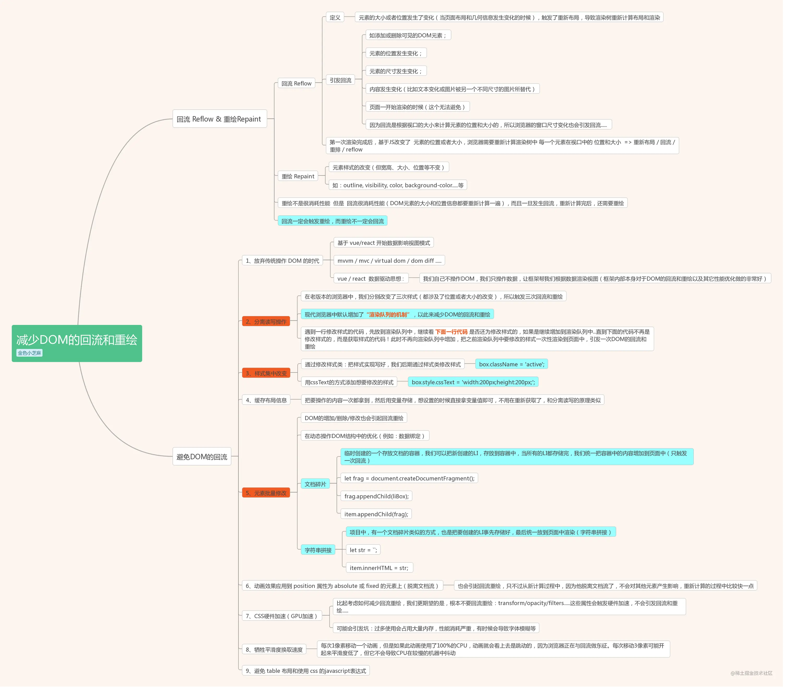

###  display:none与visibility:hidden的区别

> 这两个属性都是让元素隐藏，不可见。两者区别如下：
>
> （1）**在渲染树中**
>
> - `display:none`会让元素完全从渲染树中消失，渲染时不会占据任何空间；
> - `visibility:hidden`不会让元素从渲染树中消失，渲染的元素还会占据相应的空间，只是内容不可见。
>
> （2）**是否是**继承属性
>
> - `display:none`是非继承属性，子孙节点会随着父节点从渲染树消失，通过修改子孙节点的属性也无法显示；
> - `visibility:hidden`是继承属性，子孙节点消失是由于继承了`hidden`，通过设置`visibility:visible`可以让子孙节点显示；
>
> （3）修改常规文档流中元素的 `display` 通常会造成文档的重排（回流＋重绘），但是修改`visibility`属性只会造成本元素的重绘；
>
> （4）如果使用读屏器，设置为`display:none`的内容不会被读取，设置为`visibility:hidden`的内容会被读取。

### 对盒模型的理解

> 当对一个文档进行布局（layout）的时候，浏览器的渲染引擎会根据标准之一的 CSS 基础框盒模型（CSS basic box model），将所有元素表示为一个个矩形的盒子（box）
>
> CSS3中的盒模型有以下两种：标准盒子模型、IE盒子模型
>
> 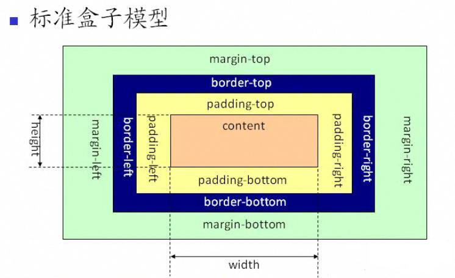
>
> 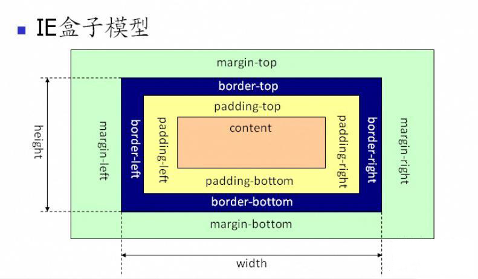
>
> 盒模型都是由四个部分组成的，分别是margin、border、padding和content。
>
> `content`，即实际内容，显示文本和图像
>
> `boreder`，即边框，围绕元素内容的内边距的一条或多条线，由粗细、样式、颜色三部分组成
>
> `padding`，即内边距，清除内容周围的区域，内边距是透明的，取值不能为负，受盒子的`background`属性影响
>
> `margin`，即外边距，在元素外创建额外的空白，空白通常指不能放其他元素的区域
>
> 标准盒模型和IE盒模型的区别在于设置`width`和`height`时，所对应的范围不同：
>
> - `标准盒模型`的width和height属性的范围`只包含了content`，
> - `IE盒模型`的width和height属性的范围包含了`border、padding和content`。
>
> 默认情况下，盒子模型为`W3C` 标准盒子模型，标准盒子模型，是浏览器默认的盒子模型
>
> 可以通过修改元素的box-sizing属性来改变元素的盒模型：
>
> - `box-sizing: content-box`表示标准盒模型（默认值）
> - `box-sizing: border-box`表示IE盒模型（怪异盒模型）
> - inherit ，从父元素继承

### margin 和 padding 的使用场景

> - 需要在border外侧添加空白，且空白处不需要背景（色）时，使用 margin；
> - 需要在border内测添加空白，且空白处需要背景（色）时，使用 padding。

### CSS3中有哪些新特性

> **1 新增各种CSS选择器 属性选择器、伪类选择器**
>
> - [attribute^=value]：选择attribute属性开头为value的所有元素
> - [attribute$=value]：选择attribute属性结尾为value的所有元素
> - :first-of-type 表示一组同级元素中其类型的第一个元素
> - :last-of-type 表示一组同级元素中其类型的最后一个元素
> - :last-child 表示一组兄弟元素中的最后一个元素
>
> **2 边框：css3新增了三个边框属性**
>
> - border-radius：创建圆角边框
>
> - box-shadow：为元素添加阴影
>
>   - 设置元素阴影，设置属性：水平阴影、垂直阴影、模糊距离(虚实)、阴影尺寸(影子大小)、阴影颜色、内/外阴影
>
>     其中水平阴影和垂直阴影是必须设置的
>
> - border-image：使用图片来绘制边框
>
> **3 背景属性**  
>
> - background-clip：确定背景画区
> - background-origin：
> - background-size：常用来调整背景图片的大小，主要用于设定图片本身
> - background-break：控制背景怎样在几个独立的盒子中显示
>
> **4 文字特效** 
>
> - text-overflow：设置或检索当当前行超过指定容器的边界时如何显示，clip：修剪文本，ellipsis：显示省略符号来代表被修剪的文本
> - text-shadow：向文本应用阴影
> - text-decoration：设置文字内部，边界填充颜色、设置文字边界宽度
>
> **5 颜色** 新增了新的颜色表示方式RGBA与HSLA/HSL
>
> - RGBA分为两部分，R G B 分别为红，绿，蓝色值（正整数或者百分数），A为透明度（0-1）
> - HSLA，H S L A:依次代表色调（0 -360），饱和度（0.0% - 100.0%），亮度（0.0% - 100.0%），透明度（0-1）
> - HSL：没有透明度
>
> **6 transition  过渡** 
>
> - transition属性可以被指定为一个或多个`CSS`属性的过渡效果，多个属性之间用逗号进行分隔，必须规定两项内容：
>
>   - 过度效果
>   - 持续时间
>
> - 语法，当然也可以分开写
>
>   ```css
>   transition： CSS属性，花费时间，效果曲线(默认ease)，延迟时间(默认0)
>   /* 分开写 */
>   transition-property: width; 
>   transition-duration: 1s;
>   transition-timing-function: linear;
>   transition-delay: 2s;
>   ```
>
> **7 tansform 转换**，允许你旋转，缩放，倾斜或平移给定元素
>
> - transform: translate(120px, 50%)：位移
> - transform: scale(2, 0.5)：缩放
> - transform: rotate(0.5turn)：旋转
> - transform: skew(30deg, 20deg)：倾斜
>
> **8 animation 动画**，主要是做一个预设的动画。和一些页面交互的动画效果，结果和过渡应该一样，让页面不会那么生硬
>
> - animation-name：动画名称
> - animation-duration：动画持续时间
> - animation-timing-function：动画时间函数
> - animation-delay：动画延迟时间
> - animation-iteration-count：动画执行次数，可以设置为一个整数，也可以设置为infinite，意思是无限循环
> - animation-direction：动画执行方向
> - animation-paly-state：动画播放状态
> - animation-fill-mode：动画填充模式
>
> **9 渐变** 两个颜色之间平稳的过渡
>
> - linear-gradient：线性渐变
> - radial-gradient：径向渐变
>
> **10 其它**
>
> - `flex`弹性布局、`Grid`栅格布局
> - 多列布局 媒体查询 混合模式

### CSS3 动画

> CSS动画（CSS Animations）是为层叠样式表建议的允许可扩展标记语言（XML）元素使用CSS的动画的模块。
>
> 即指元素从一种样式逐渐过渡为另一种样式的过程。
>
> 常见的动画效果有很多，如平移、旋转、缩放等等，复杂动画则是多个简单动画的组合
>
> `css`实现动画的方式，有如下几种：
>
> - transition 实现渐变动画
>   - transition-property:填写需要变化的css属性
>   - transition-duration:完成过渡效果需要的时间单位(s或者ms)
>   - transition-timing-function:完成效果的速度曲线
>   - transition-delay: 动画效果的延迟触发时间
> - transform 转变动画，一般配合 transition 过渡使用  注意！不支持inline元素，使用前要变成bolck
>   - translate：位移
>   - scale：缩放
>   - rotate：旋转
>   - skew：倾斜
> - animation 实现自定义动画
>   - animation-duration：动画完成一个周期所需时间
>   - animation-delay：指定动画延迟时间
>   - `@keyframes` 来定义关键帧，`CSS` 动画只需要定义一些关键的帧，而其余的帧，浏览器会根据计时函数插值计算出
>   - 等等
>
> | 属性               | 含义                                                         |
> | ------------------ | ------------------------------------------------------------ |
> | transition（过度） | 用于设置元素的样式过度，和animation有着类似的效果，但细节上有很大的不同 |
> | transform（变形）  | 用于元素进行旋转、缩放、移动或倾斜，和设置样式的动画并没有什么关系，就相当于color一样用来设置元素的“外表” |
> | translate（移动）  | 只是transform的一个属性值，即移动                            |
> | animation（动画）  | 用于设置动画属性，他是一个简写的属性，包含6个属性            |

### 单行、多行文本溢出隐藏

> - 单行文本溢出
>
> ```css
> overflow: hidden;            // 溢出隐藏
> text-overflow: ellipsis;      // 溢出用省略号显示
> white-space: nowrap;         // 规定段落中的文本不进行换行
> ```
>
> - 多行文本溢出
>
> ```css
> overflow: hidden;            // 溢出隐藏
> text-overflow: ellipsis;     // 溢出用省略号显示
> display:-webkit-box;         // 作为弹性伸缩盒子模型显示。
> -webkit-box-orient:vertical; // 设置伸缩盒子的子元素排列方式：从上到下垂直排列
> -webkit-line-clamp:3;        // 显示的行数
> ```
>
> 注意：由于上面的三个属性都是 CSS3 的属性，没有浏览器可以兼容，所以要在前面加一个`-webkit-` 来兼容一部分浏览器。
>
> 因使用了WebKit的CSS扩展属性，该方法适用于WebKit浏览器及移动端
>
> orient:朝向，vertical：竖着的 clamp：堆
>
> > 在webkit浏览器或移动端（绝大部分是webkit内核的浏览器）可以直接使用webkit的css扩展属性（webkit是私有属性）-webkit-line-clamp；
> > 注意：这是一个不规范的属性，它没有在CSS的规范草案中
> >  -webkit-line-clamp用来限制在一个块元素显示的文本行数，为了实现效果，他要与一下webkit属性结合使用：
> >  display:-webkit-box;（必须结合的属性，将对象作为`弹性伸缩盒子模型`展示）
> >  -webkit-box-orient（必须结合的属性，设置或检索伸缩盒对象的子元素的排列方式）
>
> ps:
>
> `moz`代表firefox浏览器私有属性；
>
> `-ms`代表IE浏览器私有属性；
>
> `-webkit`代表chrome、safari私有属性；
>
> `-o`代表Opera私有属性。

### link和@import的区别

> 两者都是外部引用CSS的方式，它们的区别如下：
>
> - link是XHTML标签，除了加载CSS外，还可以定义RSS等其他事务；@import属于CSS范畴，只能加载CSS。
> - link引用CSS时，在页面载入时同时加载；@import需要页面网页完全载入以后加载。
> - link是XHTML标签，无兼容问题；@import是在CSS2.1提出的，低版本的浏览器不支持。
> - link支持使用Javascript控制DOM去改变样式；而@import不支持。
>
> > ps：[简易信息聚合](https://baike.baidu.com/item/简易信息聚合)（也叫聚合内容），RSS就像一个网站的海报，里面包括这个网站的最新内容，会自动更新。所以，我们只要订阅了RSS，就不会错过自己喜欢的网站的更新了。[rss-阮一峰](https://www.ruanyifeng.com/blog/2006/01/rss.html)
> >
> > **可扩展标记语言**（*Extensible HyperText Markup Language，简称：XHTML*）可扩展超文本标记语言，是一种置标语言，表现方式与超文本标记语言（HTML）类似，不过语法上更加严格。
> >  XHTML 的目标是取代 HTML。
> >  XHTML 与 HTML 4.01 几乎是相同的。
> >  XHTML 是更严格更纯净的 HTML 版本。
> >  XHTML 是作为一种 XML 应用被重新定义的 HTML。

### 常见的图片格式及使用场景

> （1）**BMP**，是无损的、既支持索引色也支持直接色的点阵图。这种图片格式几乎没有对数据进行压缩，所以BMP格式的图片通常是较大的文件。
>
> 
>
> （2）**GIF**是无损的、采用索引色的点阵图。采用LZW压缩算法进行编码。文件小，是GIF格式的优点，同时，GIF格式还具有支持动画以及透明的优点。但是GIF格式仅支持8bit的索引色，所以GIF格式适用于对色彩要求不高同时需要文件体积较小的场景。
>
> 
>
> （3）**JPEG**是有损的、采用直接色的点阵图。JPEG的图片的优点是采用了直接色，得益于更丰富的色彩，JPEG非常适合用来存储照片，与GIF相比，JPEG不适合用来存储企业Logo、线框类的图。因为有损压缩会导致图片模糊，而直接色的选用，又会导致图片文件较GIF更大。
>
> 
>
> （4）**PNG-8**是无损的、使用索引色的点阵图。PNG是一种比较新的图片格式，PNG-8是非常好的GIF格式替代者，在可能的情况下，应该尽可能的使用PNG-8而不是GIF，因为在相同的图片效果下，PNG-8具有更小的文件体积。除此之外，PNG-8还支持透明度的调节，而GIF并不支持。除非需要动画的支持，否则没有理由使用GIF而不是PNG-8。
>
> 
>
> （5）**PNG-24**是无损的、使用直接色的点阵图。PNG-24的优点在于它压缩了图片的数据，使得同样效果的图片，PNG-24格式的文件大小要比BMP小得多。当然，PNG24的图片还是要比JPEG、GIF、PNG-8大得多。
>
> 
>
> （6）**SVG**是无损的矢量图。SVG是矢量图意味着SVG图片由直线和曲线以及绘制它们的方法组成。当放大SVG图片时，看到的还是线和曲线，而不会出现像素点。SVG图片在放大时，不会失真，所以它适合用来绘制Logo、Icon等。
>
> 
>
> （7）**WebP**是谷歌开发的一种新图片格式，WebP是同时支持有损和无损压缩的、使用直接色的点阵图。从名字就可以看出来它是为Web而生的，什么叫为Web而生呢？就是说相同质量的图片，WebP具有更小的文件体积。现在网站上充满了大量的图片，如果能够降低每一个图片的文件大小，那么将大大减少浏览器和服务器之间的数据传输量，进而降低访问延迟，提升访问体验。目前只有Chrome浏览器和Opera浏览器支持WebP格式，兼容性不太好。
>
> - 在无损压缩的情况下，相同质量的WebP图片，文件大小要比PNG小26%；
> - 在有损压缩的情况下，具有相同图片精度的WebP图片，文件大小要比JPEG小25%~34%；
> - WebP图片格式支持图片透明度，一个无损压缩的WebP图片，如果要支持透明度只需要22%的格外文件大小。

### 对 CSSSprites(精灵图) 的理解

> CSSSprites（精灵图），将一个页面涉及到的所有图片都包含到一张大图中去，然后利用CSS的 background-image，background-repeat，background-position属性的组合进行背景定位。
>
> **优点：**
>
> - 利用`CSS Sprites`能很好地减少网页的http请求，从而大大提高了页面的性能，这是`CSS Sprites`最大的优点；
> - `CSS Sprites`能减少图片的字节，把3张图片合并成1张图片的字节总是小于这3张图片的字节总和。
>
> **缺点：**
>
> - 在图片合并时，要把多张图片有序的、合理的合并成一张图片，还要留好足够的空间，防止板块内出现不必要的背景。在宽屏及高分辨率下的自适应页面，如果背景不够宽，很容易出现背景断裂；
> - `CSSSprites`在开发的时候相对来说有点麻烦，需要借助`photoshop`或其他工具来对每个背景单元测量其准确的位置。
> - 维护方面：`CSS Sprites`在维护的时候比较麻烦，页面背景有少许改动时，就要改这张合并的图片，无需改的地方尽量不要动，这样避免改动更多的`CSS`，如果在原来的地方放不下，又只能（最好）往下加图片，这样图片的字节就增加了，还要改动`CSS`。

### CSS预处理器/后处理器是什么？为什么要使用它们？

> CSS预处理器用一种专门的编程语言进行网页页面样式设计，然后再编译成正常的CSS文件，供项目使用。
>
> 为什么需要预处理器：CSS 本身不属于可编程语言，当前端项目逐渐庞大之后 CSS 的维护也愈加困难。CSS 预处理器所做的本质上是为 CSS 增加一些可编程的特性，通过**变量**、**嵌套**、**简单的程序逻辑**、**计算**、**函数**等特性，通过**工程化**的手段让 CSS 更易维护，提升开发效率，方便UI组件开发。
>
> `css`预处理器为`css`增加一些编程特性，无需考虑浏览器的兼容问题，可以在`CSS`中使用变量，简单的逻辑程序，函数等在编程语言中的一些基本的性能，可以让`css`更加的简洁，增加适应性以及可读性，可维护性等。
>
> 目前主流的 CSS 预处理器主要有 Sass、Less、Stylus、
>
> **后处理器，** 如： `postCss`，通常是在完成的样式表中根据`css`规范处理`css`，让其更加有效。目前最常做的是给`css`属性添加浏览器私有前缀，实现跨浏览器兼容性的问题。
>
> 其它`css`预处理器语言：`Sass（Scss）`, `Less`, `Stylus`, `Turbine`, `Swithch css`, `CSS Cacheer`, `DT Css`。
>
> 使用原因：
>
> - 结构清晰， 便于扩展
>- 可以很方便的屏蔽浏览器私有语法的差异
> - 可以轻松实现多重继承
> - 完美的兼容了`CSS`代码，可以应用到老项目中

### Sass、Less 是什么？为什么要使用他们？ 

> 他们都是 CSS 预处理器，是 CSS 上的一种抽象层。他们是一种特殊的语法/语言编译成 CSS。 例如 Less 是一种动态样式语言，将 CSS 赋予了动态语言的特性，如变量，继承，运算， 函数，LESS 既可以在客户端上运行 (支持 IE 6+, Webkit, Firefox)，也可以在服务端运行 (借助 Node.js)。 
>
> 
>
> **为什么要使用它们？** 
>
> - 结构清晰，便于扩展。 可以方便地屏蔽浏览器私有语法差异。封装对浏览器语法差异的重复处理， 减少无意义的机械劳动。 
> - 可以轻松实现多重继承。 完全兼容 CSS 代码，可以方便地应用到老项目中。LESS 只是在 CSS 语法上做了扩展，所以老的 CSS 代码也可以与 LESS 代码一同编译。

### 对**line-height 的理解及其赋值方式**

> **（1）line-height的概念：**
>
> - line-height 指一行文本的高度，包含了字间距，实际上是下一行基线到上一行基线距离；
> - 如果一个标签没有定义 height 属性，那么其最终表现的高度由 line-height 决定；
> - 一个容器没有设置高度，那么撑开容器高度的是 line-height，而不是容器内的文本内容；
> - 把 line-height 值设置为 height 一样大小的值可以实现单行文字的垂直居中；
> - line-height 和 height 都能撑开一个高度；
>
> **（2）line-height 的赋值方式：**
>
> - 带单位：px 是固定值，而 em 会参考父元素 font-size 值计算自身的行高
> - 纯数字：会把比例传递给后代。例如，父级行高为 1.5，子元素字体为 18px，则子元素行高为 1.5 * 18 = 27px
> - 百分比：将计算后的值传递给后代

### 对媒体查询的理解？

> 媒体指的就是各种设备 (移动设备, PC设备)   查询指的是要检测属于哪种设备 
>
> **媒体查询: 通过查询当前属于哪种设备, 让网页能够在不同的设备下正常的预览**
>
> 换句话说：仅在浏览器和设备的环境与你指定的规则相匹配的时候 CSS 才会真的被应用，例如“视口宽于 480 像素”的时候。
>
> 简单来说，使用 @media 查询，可以针对不同的媒体类型定义不同的样式。@media 可以针对不同的屏幕尺寸设置不同的样式，特别是需要设置设计响应式的页面，@media 是非常有用的。当重置浏览器大小的过程中，页面也会根据浏览器的宽度和高度重新渲染页面。
>
> > 理解：媒体查询包含⼀个可选的媒体类型和满⾜CSS3规范的条件下，包含零个或多个表达式，这些表达式描述了媒体特征，最终会被解析为true或false。如果媒体查询中指定的媒体类型匹配展示⽂档所使⽤的设备类型，并且所有的表达式的值都是true，那么该媒体查询的结果为true。那么媒体查询内的样式将会⽣效。 
>
> **语法**
>
> * 内嵌式语法 link标签
> * 外联式语法 style中
>
> ```html
> <!-- link元素中的CSS媒体查询 --> 
> <link rel="stylesheet" media="(max-width: 800px)" href="example.css" /> 
> <!-- 样式表中的CSS媒体查询 --> 
> <style> 
> @media (max-width: 600px) { 
> .facet_sidebar { 
>  display: none; 
> } 
> }
> </style>
> ```
>

### 常见的CSS布局单位

> 常用的布局单位包括像素（`px`），百分比（`%`），`em`，`rem`，`vw/vh`。
>
> > 传统的项目开发中，我们只会用到`px`、`%`、`em`这几个单位，它可以适用于大部分的项目开发，且拥有比较良好的兼容性
> >
> > 从`CSS3`开始，浏览器对计量单位的支持又提升到了另外一个境界，新增了`rem`、`vh`、`vw`、`vm`等一些新的计量单位
> >
> > 利用这些新的单位开发出比较良好的响应式页面，适应多种不同分辨率的终端，包括移动设备等
> >
> > 在`css`单位中，可以分为长度单位、绝对单位，如下表所指示
> >
> > | CSS单位      |                                        |
> > | ------------ | -------------------------------------- |
> > | 相对长度单位 | em、ex、ch、rem、vw、vh、vmin、vmax、% |
> > | 绝对长度单位 | cm、mm、in、px、pt、pc                 |
> >
> > 这里我们主要讲述px、em、rem、vh、vw
>
> **（1）像素**（`px`）是页面布局的基础，一个像素表示终端（电脑、手机、平板等）屏幕所能显示的最小的区域，像素分为两种类型：CSS像素和物理像素：
>
> - **CSS像素**：为web开发者提供，在CSS中使用的一个抽象单位；
> - **物理像素**：只与设备的硬件密度有关，任何设备的物理像素都是固定的。
>
> **（2）百分比**（`%`），当浏览器的宽度或者高度发生变化时，通过百分比单位可以使得浏览器中的组件的宽和高随着浏览器的变化而变化，从而实现响应式的效果。一般认为子元素的百分比相对于直接父元素。
>
> **（3）em和rem**相对于px更具灵活性，它们都是相对长度单位，它们之间的区别：**em相对于父元素，rem相对于根元素。**
>
> - **em：** **文本相对长度单位。相对于当前对象内文本的字体尺寸。如果当前行内文本的字体尺寸未被人为设置，则相对于浏览器的默认字体尺寸(1em = 16px)。**
>
>   - **em会继承`父级元素`的字体大小，所以会发现当前的文本字体会复合，是可变的**
>   - **em是相对于其父元素来设置字体大小的，这样就会存在一个问题，进行任何元素设置，都有可能需要知道他父元素的大小。**
>
>   > [链接](https://www.programminghunter.com/article/17031307753/) 任意浏览器的默认字体高都是16px。所有未经调整的浏览器都符合: 1em=16px。那么12px=0.75em,10px=0.625em。**为了简化font-size的换算，`需要在css中的body选择器中声明Font-size=62.5%`**，这就使em值变为 16px*62.5%=10px, 这样12px=1.2em, 10px=1em, 也就是说只需要将你的原来的px数值除以10，然后换上em作为单位就行了。
>   >
>   > 所以我们在写CSS的时候，需要注意两点：
>   >
>   > - body选择器中声明Font-size=62.5%；
>   > - 将你的原来的px数值除以10，然后换上em作为单位；
>   > -  重新计算那些被放大的字体的em数值。避免字体大小的重复声明。
>   >   - 也就是避免1.2 * 1.2= 1.44的现象。比如说你在#content中声明了字体大小为1.2em，那么在声明p的字体大小时就只能是1em，而不是1.2em, 因为此em非彼em，它因继承#content的字体高而变为了1em=12px
>
> - **rem：** **rem是CSS3新增的一个相对单位，相对于HTML根元素的font-size的倍数。**
>
>   > - 使用rem为元素设定字体大小时，仍然是相对大小，但相对的只是HTML根元素。这个单位可谓集相对大小和绝对大小的优点于一身，通过它既可以做到只修改根元素就成比例地调整所有字体大小，又可以避免字体大小逐层复合的连锁反应。
>   > - **为了方便计算，通常将在`<html>`元素中设置`font-size`值为`62.5%`**，相当于在`<html>`中设置`font-size`为`10px`
>   > - [链接](https://static.kancloud.cn/geeker-jun_1987/bootstrap/1861630) 如果你根元素的字体大小选62.5%，那px和rem之间的换算就是px直接除以10就得到rem了。例如，假设一个div宽度为2rem,高度为3rem.则它换算成px为 width:20px.height:30px，同理，假如一个设计稿为宽度20px,高度为30px，则换成成rem，则是 20/10=2rem，30/10=3rem。
>
> - **作用**：利用rem可以实现简单的响应式布局，可以利用html元素中字体的大小与屏幕间的比值来设置font-size的值，以此实现当屏幕分辨率变化时让元素也随之变化。
>
> **（4）vw/vh**是与视图窗口有关的单位，vw表示相对于视图窗口的宽度，vh表示相对于视图窗口高度，除了vw和vh外，还有vmin和vmax两个相关的单位。
>
> * 根据窗口的宽度，分成100等份，100vw就表示满宽，50vw就表示一半宽。
> * 这里的窗口分成几种情况：
>   - 在桌面端，指的是浏览器的可视区域
>   - 移动端指的就是`布局视口`
>
> - vw：相对于浏览器可见视口【宽度】的百分比，视窗宽度是100vw，1vw代表视窗【宽度】的1%；
> - vh：相对于浏览器可见视口【高度】的百分比，视窗高度是100vh，1vw代表视窗【高度】的1%；
> - vmin：vw和vh中的较小值；
> - vmax：vw和vh中的较大值；
> - ps：`视窗` 与 `可见视口` 是一个意思
>
> **vw/vh** 和百分比很类似，两者的区别：
>
> https://blog.csdn.net/bidang3275/article/details/118657801
>
> - 百分比（`%`）：大部分相对于祖先元素，也有相对于自身的情况比如（border-radius、translate等)
>   - 对于普通定位元素就是我们理解的父元素
>   - 对于position: absolute;的元素是相对于已定位的父元素
>   - 对于position: fixed;的元素是相对于 ViewPort（可视窗口）
> - vw/vm：相对于视窗的尺寸

### 逻辑像素和物理像素

> 从上述的图片放大缩小可以看出，图片尺寸所标注的 `300 * 300` 像素大小并不一定时刻等同于设备上的像素大小，放大3倍后就是 `图片的 1像素格子` ===  `设备的 3像素格子`，缩小后又变小了。
>
> 因此将上述设备不能改变的、在设备一生产出来后就确定的像素称作 `物理像素` ，也叫 `设备像素(device pixels)`，简称 `dp` 。
>
> 与之对应的用于表示图片尺寸、可时刻改变的像素称作 `逻辑像素`，也叫 `设备独立像素(device independent pixels)`，简称 `dip` 。

### px、em、rem的区别及使用场景

> **三者的区别：**
>
> - px是固定的像素，一旦设置了就无法因为适应页面大小而改变。
> - em和rem相对于px更具有灵活性，他们是相对长度单位，其长度不是固定的，更适用于响应式布局。
> - em是相对于其父元素来设置字体大小，这样就会存在一个问题，进行任何元素设置，都有可能需要知道他父元素的大小。
> - 而rem是相对于根元素，这样就意味着，只需要在根元素确定一个参考值。
>
> **使用场景：**
>
> - 对于只需要适配少部分移动设备，且分辨率对页面影响不大的，使用px即可 。
> - 对于需要适配各种移动设备，使用rem，例如需要适配iPhone和iPad等分辨率差别比较挺大的设备。

### css像素、设备像素、设备独立像素、dpr、ppi 之间的区别

> #### 背景
>
> 在`css`中我们通常使用px作为单位，在PC浏览器中`css`的1个像素都是对应着电脑屏幕的1个物理像素，这会造成一种错觉，我们会认为`css`中的像素就是设备的物理像素。
>
> 但实际情况却并非如此，`css`中的像素只是一个抽象的单位，在不同的设备或不同的环境中，`css`中的1px所代表的设备物理像素是不同的。
>
> 当我们做移动端开发时，同为1px的设置，在不同分辨率的移动设备上显示效果却有很大差异
>
> 这背后就涉及了css像素、设备像素、设备独立像素、dpr、ppi的概念
>
> #### CSS像素
>
> CSS像素（css pixel, px）: 适用于web编程，在 CSS 中以 px 为后缀，是一个长度单位
>
> 在 CSS 规范中，长度单位可以分为两类，绝对单位以及相对单位
>
> px是一个相对单位，相对的是设备像素（device pixel）
>
> 一般情况，页面缩放比为1，1个CSS像素等于1个设备独立像素
>
> `CSS`像素又具有两个方面的相对性：
>
> - 在同一个设备上，每1个 CSS 像素所代表的设备像素是可以变化的（比如调整屏幕的分辨率）
> - 在不同的设备之间，每1个 CSS 像素所代表的设备像素是可以变化的（比如两个不同型号的手机）
>
> 在页面进行缩放操作也会 引起`css`中`px`的变化，假设页面放大一倍，原来的 1px 的东西变成 2px，在实际宽度不变的情况下1px 变得跟原来的 2px 的长度（长宽）一样了（元素会占据更多的设备像素）
>
> 假设原来需要 320px 才能填满的宽度现在只需要 160px
>
> px会受到下面的因素的影响而变化：
>
> - 每英寸像素（PPI）
> - 设备像素比（DPR）
>
> #### 设备像素
>
> 设备像素（device pixels），又称为物理像素
>
> 指设备能控制显示的最小物理单位，不一定是一个小正方形区块，也没有标准的宽高，只是用于显示丰富色彩的一个“点”而已
>
> 可以参考公园里的景观变色彩灯，一个彩灯(物理像素)由红、蓝、绿小灯组成，三盏小灯不同的亮度混合出各种色彩
>
> 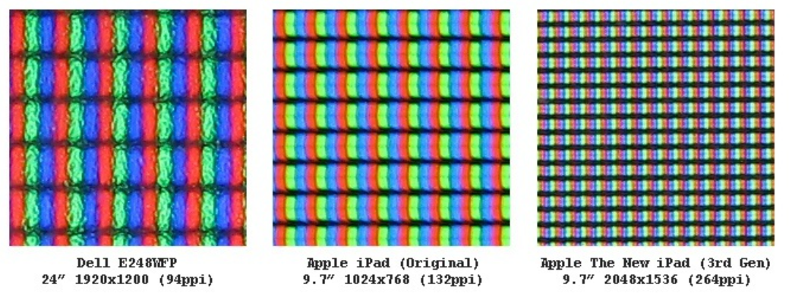
>
> 从屏幕在工厂生产出的那天起，它上面设备像素点就固定不变了，单位为`pt`
>
> 设备独立像素（Device Independent Pixel）：与设备无关的逻辑像素，代表可以通过程序控制使用的虚拟像素，是一个总体概念，包括了CSS像素
>
> 在`javaScript`中可以通过`window.screen.width/ window.screen.height` 查看
>
> 比如我们会说“电脑屏幕在 2560x1600分辨率下不适合玩游戏，我们把它调为 1440x900”，这里的“分辨率”（非严谨说法）指的就是设备独立像素
>
> 一个设备独立像素里可能包含1个或者多个物理像素点，包含的越多则屏幕看起来越清晰
>
> 至于为什么出现设备独立像素这种虚拟像素单位概念，下面举个例子：
>
> iPhone 3GS 和 iPhone 4/4s 的尺寸都是 3.5 寸，但 iPhone 3GS 的分辨率是 320x480，iPhone 4/4s 的分辨率是 640x960
>
> 这意味着，iPhone 3GS 有 320 个物理像素，iPhone 4/4s 有 640 个物理像素
>
> 如果我们按照真实的物理像素进行布局，比如说我们按照 320 物理像素进行布局，到了 640 物理像素的手机上就会有一半的空白，为了避免这种问题，就产生了虚拟像素单位
>
> 我们统一 iPhone 3GS 和 iPhone 4/4s 都是 320 个虚拟像素，只是在 iPhone 3GS 上，最终 1 个虚拟像素换算成 1 个物理像素，在 iphone 4s 中，1 个虚拟像素最终换算成 2 个物理像素
>
> 至于 1 个虚拟像素被换算成几个物理像素，这个数值我们称之为设备像素比，也就是下面介绍的`dpr`
>
> #### dpr-设备像素比
>
> dpr（device pixel ratio），设备像素比，代表设备独立像素到设备像素的转换关系，在`JavaScript`中可以通过 `window.devicePixelRatio` 获取
>
> 计算公式如下：
>
> 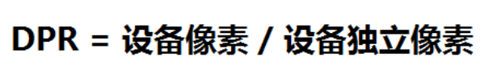
>
> 当设备像素比为1:1时，使用1（1×1）个设备像素显示1个CSS像素
>
> 当设备像素比为2:1时，使用4（2×2）个设备像素显示1个CSS像素
>
> 当设备像素比为3:1时，使用9（3×3）个设备像素显示1个CSS像素
>
> 如下图所示：
>
> 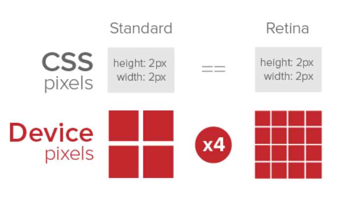
>
> 当`dpr`为3，那么`1px`的`CSS`像素宽度对应`3px`的物理像素的宽度，1px的`CSS`像素高度对应`3px`的物理像素高度
>
> #### ppi
>
> ppi （pixel per inch），每英寸像素，表示每英寸所包含的像素点数目，更确切的说法应该是像素密度。数值越高，说明屏幕能以更高密度显示图像
>
> 计算公式如下：
>
> 
>
> #### 总结
>
> 无缩放情况下，1个CSS像素等于1个设备独立像素
>
> 设备像素由屏幕生产之后就不发生改变，而设备独立像素是一个虚拟单位会发生改变
>
> PC端中，1个设备独立像素 = 1个设备像素 （在100%，未缩放的情况下）
>
> 在移动端中，标准屏幕（160ppi）下 1个设备独立像素 = 1个设备像素
>
> 设备像素比（dpr） = 设备像素 / 设备独立像素
>
> 每英寸像素（ppi），值越大，图像越清晰

### 对 CSS 工程化的理解

> CSS 工程化是为了解决以下问题：
>
> 1. **宏观设计**：CSS 代码如何组织、如何拆分、模块结构怎样设计？
> 2. **编码优化**：怎样写出更好的 CSS？
> 3. **构建**：如何处理我的 CSS，才能让它的打包结果最优？
> 4. **可维护性**：代码写完了，如何最小化它后续的变更成本？如何确保任何一个同事都能轻松接手？
>
> 
>
> 以下三个方向都是时下比较流行的、普适性非常好的 CSS 工程化实践：
>
> - 预处理器：Less、 Sass 等；
> - 重要的工程化插件： PostCss；
> - Webpack loader 等 。
>
> 
>
> 基于这三个方向，可以衍生出一些具有典型意义的子问题，这里我们逐个来看：
>
> **（1）预处理器：为什么要用预处理器？它的出现是为了解决什么问题？**
>
> 预处理器，其实就是 CSS 世界的“轮子”。预处理器支持我们写一种类似 CSS、但实际并不是 CSS 的语言，然后把它编译成 CSS 代码：
>
> 
>
> 那为什么写 CSS 代码写得好好的，偏偏要转去写“类 CSS”呢？这就和本来用 JS 也可以实现所有功能，但最后却写 React 的 jsx 或者 Vue 的模板语法一样——为了爽！要想知道有了预处理器有多爽，首先要知道的是传统 CSS 有多不爽。随着前端业务复杂度的提高，前端工程中对 CSS 提出了以下的诉求：
>
> 1. 宏观设计上：我们希望能优化 CSS 文件的目录结构，对现有的 CSS 文件实现复用；
> 2. 编码优化上：我们希望能写出结构清晰、简明易懂的 CSS，需要它具有一目了然的嵌套层级关系，而不是无差别的一铺到底写法；我们希望它具有变量特征、计算能力、循环能力等等更强的可编程性，这样我们可以少写一些无用的代码；
> 3. 可维护性上：更强的可编程性意味着更优质的代码结构，实现复用意味着更简单的目录结构和更强的拓展能力，这两点如果能做到，自然会带来更强的可维护性。
>
> 
>
> 这三点是传统 CSS 所做不到的，也正是预处理器所解决掉的问题。预处理器普遍会具备这样的特性：
>
> - 嵌套代码的能力，通过嵌套来反映不同 css 属性之间的层级关系 ；
> - 支持定义 css 变量；
> - 提供计算函数；
> - 允许对代码片段进行 extend 和 mixin；
> - 支持循环语句的使用；
> - 支持将 CSS 文件模块化，实现复用。
>
> **（2）PostCss：PostCss 是如何工作的？我们在什么场景下会使用 PostCss？**
>
> PostCss 仍然是一个对 CSS 进行解析和处理的工具，它会对 CSS 做这样的事情：
>
> 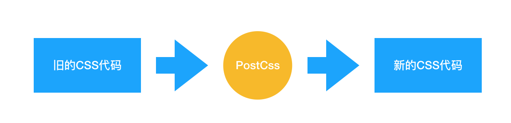
>
> 它和预处理器的不同就在于，预处理器处理的是 类CSS，而 PostCss 处理的就是 CSS 本身。Babel 可以将高版本的 JS 代码转换为低版本的 JS 代码。PostCss 做的是类似的事情：它可以编译尚未被浏览器广泛支持的先进的 CSS 语法，还可以自动为一些需要额外兼容的语法增加前缀。更强的是，由于 PostCss 有着强大的插件机制，支持各种各样的扩展，极大地强化了 CSS 的能力。
>
> 
>
> PostCss 在业务中的使用场景非常多：
>
> - 提高 CSS 代码的可读性：PostCss 其实可以做类似预处理器能做的工作；
> - 当我们的 CSS 代码需要适配低版本浏览器时，PostCss 的 [Autoprefixer](https://github.com/postcss/autoprefixer) 插件可以帮助我们自动增加浏览器前缀；
> - 允许我们编写面向未来的 CSS：PostCss 能够帮助我们编译 CSS next 代码；
>
> **（3）Webpack 能处理 CSS 吗？如何实现？**
>
> Webpack 能处理 CSS 吗：
>
> - **Webpack 在裸奔的状态下，是不能处理 CSS 的**，Webpack 本身是一个面向 JavaScript 且只能处理 JavaScript 代码的模块化打包工具；
> - Webpack 在 loader 的辅助下，是可以处理 CSS 的。
>
> 
>
> 如何用 Webpack 实现对 CSS 的处理：
>
> - Webpack 中操作 CSS 需要使用的两个关键的 loader：css-loader 和 style-loader
> - 注意，答出“用什么”有时候可能还不够，面试官会怀疑你是不是在背答案，所以你还需要了解每个 loader 都做了什么事情：
>
> - - css-loader：导入 CSS 模块，对 CSS 代码进行编译处理；
>   - style-loader：创建style标签，把 CSS 内容写入标签。
>
> 
>
> 在实际使用中，**css-loader 的执行顺序一定要安排在 style-loader 的前面**。因为只有完成了编译过程，才可以对 css 代码进行插入；若提前插入了未编译的代码，那么 webpack 是无法理解这坨东西的，它会无情报错。

## 页面布局

### 响应式布局

> 响应式网站设计（Responsive Web design）是一种网络页面设计布局，页面的设计与开发应当根据用户行为以及设备环境(系统平台、屏幕尺寸、屏幕定向等)进行相应的响应和调整
>
> 描述响应式界面最著名的一句话就是“Content is like water”
>
> 大白话便是“如果将屏幕看作容器，那么内容就像水一样”
>
> 响应式网站常见特点：
>
> - 同时适配PC + 平板 + 手机等
> - 标签导航在接近手持终端设备时改变为经典的抽屉式导航
> - 网站的布局会根据视口来调整模块的大小和位置
>
> #### 实现方式
>
> 响应式设计的基本原理是通过媒体查询检测不同的设备屏幕尺寸做处理，为了处理移动端，页面头部必须有`meta`声明`viewport`
>
> ```html
> <meta name="viewport" content="width=device-width, initial-scale=1, maximum-scale=1, user-scalable=no”>
> ```
>
> 属性对应如下：
>
> - width=device-width: 是自适应手机屏幕的尺寸宽度
> - maximum-scale:是缩放比例的最大值
> - inital-scale:是缩放的初始化
> - user-scalable:是用户的可以缩放的操作
>
> 实现响应式布局的方式有如下：
>
> - 媒体查询
> - 百分比
> - vw/vh
> - rem
>
> #### 小结
>
> 响应式设计实现通常会从以下几方面思考：
>
> - 弹性盒子（包括图片、表格、视频）和媒体查询等技术
> - 使用百分比布局创建流式布局的弹性UI，同时使用媒体查询限制元素的尺寸和内容变更范围
> - 使用相对单位使得内容自适应调节
> - 选择断点，针对不同断点实现不同布局和内容展示
>
> #### 总结
>
> 响应式布局优点可以看到：
>
> - 面对不同分辨率设备灵活性强
> - 能够快捷解决多设备显示适应问题
>
> 缺点：
>
> - 仅适用布局、信息、框架并不复杂的部门类型网站
> - 兼容各种设备工作量大，效率低下
> - 代码累赘，会出现隐藏无用的元素，加载时间加长
> - 其实这是一种折中性质的设计解决方案，多方面因素影响而达不到最佳效果
> - 一定程度上改变了网站原有的布局结构，会出现用户混淆的情况

### grid网格布局

> `Grid` 布局即网格布局，是一个二维的布局方式，由纵横相交的两组网格线形成的框架性布局结构，能够同时处理行与列，擅长将一个页面划分为几个主要区域，以及定义这些区域的大小、位置、层次等关系
>
> 这与之前讲到的`flex`一维布局不相同
>
> 设置`display:grid/inline-grid`的元素就是网格布局容器，这样就能出发浏览器渲染引擎的网格布局算法
>
> `Grid` 布局属性可以分为两大类：
>
> - 容器属性
> - 项目属性
>
> **常见属性**
>
> * `justify-content` 整个内容区域在容器里面的水平位置（左中右）
> * `align-content` 整个内容区域的垂直位置（上中下）
>
> * `rid-template-columns` 设置列宽
> * `grid-template-rows` 设置行高
> * `grid-row-gap` 设置行间距
> * `grid-column-gap` 设置列间距

###  两栏布局的实现

https://juejin.cn/post/6844904062224171021#heading-14

浮动，浮动+bfc，flex；1，子绝父相

> 一般两栏布局指的是**左边一栏宽度固定，右边一栏宽度自适应**，两栏布局的具体实现：
>
> - **float + margin**：利用浮动，将左边元素宽度设置为200px，并且设置向左浮动。将右边元素的margin-left设置为200px，宽度设置为auto（默认为auto，撑满整个父元素）。
>
> ```css
> .outer {
>     height: 100px;
> }
> .left {
>     float: left;
>     width: 200px;
>     background: tomato;
> }
> .right {
>     margin-left: 200px;
>     width: auto;
>     background: gold;
> }
> ```
>
> - **float + BFC**：利用浮动，左侧元素设置固定大小，并左浮动，右侧元素设置overflow: hidden; 这样右边就触发了`BFC`，`BFC的区域不会与浮动元素发生重叠`，所以两侧就不会发生重叠。
>
> ```css
> .left{
>      width: 100px;
>      height: 200px;
>      background: red;
>      float: left;
>  }
>  .right{
>      height: 300px;
>      background: blue;
>      overflow: hidden;
>  }
> ```
>
> - 利用flex布局，将左边元素设置为固定宽度200px，将右边的元素设置为flex:1。
>
> > ## flex: 1 是什么意思
> >
> > `flex: 1` 可以让子元素如何占据父元素的剩余空间，尺寸不足时会优先最小化内容尺寸.可以是一个数字，也可以是 `auto`，表示子元素占据剩余空间的比例。
> >
> > flex 属性是 `flex-grow`、`flex-shrink` 和 `flex-basis` 属性的简写。
> >
> > ```css
> > flex: flex-grow flex-shrink flex-basis|auto|initial|inherit;
> > ```
> >
> > 拷贝
> >
> > `flex: 1` 相当于 `flex-grow: 1`、`flex-shrink: 1` 和 `flex-basis: 0%`。
> >
> > - `flex-grow: 1` ：该属性默认为 `0` ，如果存在剩余空间，元素也不填满。设置为 `1` 代表会填满。
> > - `flex-shrink: 1` ：该属性默认为 `1` ，如果空间不足，元素缩小比例 1。
> > - `flex-basis: 0%` ：该属性定义在分配多余空间之前，元素占据的主轴空间。浏览器就是根据这个属性来**计算是否有多余空间**的。默认值为 `auto` ，即项目本身大小。设置为 `0%` 之后，因为有 `flex-grow` 和 `flex-shrink` 的设置会自动放大或缩小。在做两栏布局时，如果右边的自适应元素 `flex-basis` 设为 `auto` 的话，其本身大小将会是 `0` 。
>
> ```css
> .outer {
>   display: flex;
>   height: 100px;
> }
> .left {
>   width: 200px;
>   background: tomato;
> }
> .right {
>   flex: 1;
>   background: gold;
> }
> ```
>
> - **position**：利用绝对定位，将父级元素设置为相对定位。左边元素设置为absolute定位，并且宽度设置为200px。将右边元素的margin-left的值设置为200px。
>
> ```css
> .outer {
>   position: relative;
>   height: 100px;
> }
> .left {
>   position: absolute;
>   width: 200px;
>   background: tomato;
> }
> .right {
>   margin-left: 200px;
>   background: gold;
> }
> ```
> 
>- **position**：利用绝对定位，将父级元素设置为相对定位。左边元素宽度设置为200px，右边元素设置为绝对定位，左边定位为200px，其余方向定位为0。
> 
>```css
> .outer {
>     position: relative;
>     height: 100px;
> }
> .left {
>     width: 200px;
>     background: tomato;
> }
> .right {
>     position: absolute;
>     top: 0;
>     right: 0;
>     bottom: 0;
>     left: 200px;
>     background: gold;
> }
> ```

### 三栏布局的实现

> 三栏布局一般指的是页面中一共有三栏，**左右两栏宽度固定，中间自适应的布局**，三栏布局的具体实现：
>
> #### float
>
> - 利用**浮动**，左右两栏设置固定大小，并设置对应方向的浮动。中间一栏设置左右两个方向的margin值，注意这种方式**，`中间一栏必须放到最后`：**
>
>   ```js
>   <div class=" outer left"></div>
>   <div class=" outer right"></div>
>   <div class=" outer center"></div>
>   ```
>
>   ps：为什么中间一栏必须放到最后，不放到最后，right就会被撑到下一行？
>
>   > 浏览器解析HTML文档是从上到下按顺序解析的，如果center在right前面，right本来就是一个block，设置右浮动不会对它前面的center有影响
>
>   原理：
>
> - 元素浮动后，脱离文档流。
>
> - 左右栏分别浮动在窗口两边，`中间块(处于文档流中)受左右浮动影响`被`卡在中间`无法继续向左右伸展已达到自适应，最后按需设置中间块的margin值来改变快间间隙即可。
>
> - 基于纯float实现的三栏布局需要将中间的内容放在HTML结构的最后，DOM结构为`左-右-中`，否则右侧会沉在中间内容的下侧 
>
> ```css
> .left {
>     float: left;
>     width: 100px;
>     height: 100px;
>     background: red;
> }
> .right {
>     float: right;
>     width: 200px;
>     height: 100px;
>     background: blue;
> }
> .center {
>     margin-left: 100px;
>     margin-right: 200px;
>     height: 100px;
>     background: green;
> }
> ```
>
> #### flex布局
>
> - 利用**flex布局**，左右两栏设置固定大小，中间一栏设置为flex:1。
>
> ```css
> .outer {
>   display: flex;
>   height: 100px;
> }
> 
> .left {
>   width: 100px;
>   background: tomato;
> }
> 
> .right {
>   width: 100px;
>   background: gold;
> }
> 
> .center {
>   flex: 1;
>   background: lightgreen;
> }
> ```
>
> #### position
>
> - 利用**绝对定位**，左右两栏设置为绝对定位，中间设置对应方向大小的margin的值。
>
> ```css
> .outer {
>     position: relative;
>     height: 100px;
> }
> 
> .left {
>     position: absolute;
>     width: 100px;
>     height: 100px;
>     background: tomato;
> }
> 
> .right {
>     position: absolute;
>     top: 0;
>     right: 0;    /* 这两行必须设置，否则会被挤到第二行 */
>     width: 200px;
>     height: 100px;
>     background: gold;
> }
> 
> .center {
>     margin-left: 100px;
>     margin-right: 200px;
>     height: 100px;
>     background: lightgreen;
> }
> ```
>
> - 圣杯布局，利用浮动和负边距来实现。父级元素设置左右的 padding，三列均设置向左浮动，中间一列放在最前面，宽度设置为父级元素的宽度，因此后面两列都被挤到了下一行，通过设置 margin 负值将其移动到上一行，再利用相对定位，定位到两边。
>
> ```css
> .outer {
>   height: 100px;
>   padding-left: 100px;
>   padding-right: 200px;
> }
> 
> .left {
>   position: relative;
>   left: -100px;
> 
>   float: left;
>   margin-left: -100%;
> 
>   width: 100px;
>   height: 100px;
>   background: tomato;
> }
> 
> .right {
>   position: relative;
>   left: 200px;
> 
>   float: right;
>   margin-left: -200px;
> 
>   width: 200px;
>   height: 100px;
>   background: gold;
> }
> 
> .center {
>   float: left;
> 
>   width: 100%;
>   height: 100px;
>   background: lightgreen;
> }
> ```
>
> - 双飞翼布局，双飞翼布局相对于圣杯布局来说，左右位置的保留是通过中间列的 margin 值来实现的，而不是通过父元素的 padding 来实现的。本质上来说，也是通过浮动和外边距负值来实现的。
>
> ```css
> .outer {
>   height: 100px;
> }
> 
> .left {
>   float: left;
>   margin-left: -100%;
> 
>   width: 100px;
>   height: 100px;
>   background: tomato;
> }
> 
> .right {
>   float: left;
>   margin-left: -200px;
> 
>   width: 200px;
>   height: 100px;
>   background: gold;
> }
> 
> .wrapper {
>   float: left;
> 
>   width: 100%;
>   height: 100px;
>   background: lightgreen;
> }
> 
> .center {
>   margin-left: 100px;
>   margin-right: 200px;
>   height: 100px;
> }
> ```

### 水平垂直居中的实现

> 拓展：水平居中，垂直居中的实现：https://segmentfault.com/a/1190000014116655

> - 利用绝对定位，先将元素的`左上角`通过top:50%和left:50%定位到页面的中心，然后再通过translate(定义`2D`转换)来调整元素的中心点到页面的中心。该方法需要**考虑浏览器兼容问题。** ---`不知道宽高`的情况下		**绝对定位+transform**
>
> ps:[transform详解translate](https://www.cnblogs.com/yanggeng/p/11286250.html)
>
> **translateX**：向X轴平移，填正数往右平移，填负数，往左平移
>
> **translateY**：向Y轴平移，填正数往下平移，填负数，往上平移
>
> **translate**：是同时设置 translateX 和 translateY， 所以里面可以填两个参数， 第一个值 X 第二个 Y
>
> **translate(-50%,-50%)** 作用是，往上（x轴）,左（y轴）移动`自身长宽`的 50%，以使其居于`中心位置`
>
> 与负margin-left和margin-top实现居中不同的是，margin-left必须知道自身的宽高，而translate可以在不知道宽高的情况下进行居中，tranlate（）函数中的百分比是相对于`自身宽高的百分比`，所以能进行居中。
>
> ```css
> .parent {
>     position: relative;
> }
>  
> .child {
>     width: 100px;
>     height: 100px;
>     background: green;
>     
>     position: absolute;
>     left: 50%;
>     top: 50%;
>     transform: translate(-50%,-50%);   
> }
> ```
>
> - 利用绝对定位，设置四个方向的值都为0，并将margin设置为auto，由于宽高固定，因此对应方向实现平分，可以实现水平和垂直方向上的居中。该方法适用于`盒子有宽高的`情况：								**绝对定位+margin:auto**
>
> ```css
> .parent {
>     position: relative;
> }
>  
> .child {
>     width: 100px;
>     height: 100px;
>     background: green;
>     
>     position: absolute;
>     top: 0;
>     bottom: 0;
>     left: 0;
>     right: 0;
>     margin: auto;
> }
> ```
>
> - 利用绝对定位，先将元素的左上角通过top:50%和left:50%定位到页面的中心，然后再通过margin负值来调整元素的中心点到页面的中心。该方法适用于`盒子宽高已知`的情况                                 **绝对定位+负margin**
>
> ```css
> .parent {
>     position: relative;
> }
>  
> .child {
>     width: 100px;
>     height: 100px;
>     background: green;
>     
>     position: absolute;
>     top: 50%;
>     left: 50%;
>     margin-top: -50px;     /* 自身 height 的一半的负值 */
>     margin-left: -50px;    /* 自身 width 的一半的负值 */
> }
> ```
>
> - 使用`flex`布局，通过align-items:center和justify-content:center设置容器的垂直和水平方向上为居中对齐，然后它的子元素也可以实现垂直和水平的居中。要求：父元素必须显示设置height值
>
>   该方法要**考虑兼容的问题**，该方法在`移动端`用的较多：
>
> ```css
> .parent {
>     display: flex;
>     justify-content:center;
>     align-items:center;
> }
> .child {
>     width: 100px;
>     height: 100px;
>     background: pink;
> }
> ```
>
> align:排列  

### 对Flex布局的理解及其使用场景

> Flex是FlexibleBox的缩写，意为"弹性布局"，`用来为盒状模型提供最大的灵活性`。任何一个容器都可以指定为Flex布局。行内元素也可以使用Flex布局。注意，设为Flex布局以后，**子元素的float、clear和vertical-align属性将失效**。采用Flex布局的元素，称为Flex容器（flex container），简称"容器"。它的所有子元素自动成为容器成员，称为Flex项目（flex item），简称"项目"。容器默认存在两根轴：水平的主轴（main axis）和垂直的交叉轴（cross axis），项目默认沿水平主轴排列。
>
> 
>
> 以下6个属性设置在**容器上**：
>
> - flex-direction属性决定主轴的方向（即项目的排列方向）。
> - flex-wrap属性定义，如果一条轴线排不下，如何换行。
>
> - flex-flow属性是flex-direction属性和flex-wrap属性的简写形式，默认值为row nowrap。
> - justify-content属性定义了项目在主轴上的对齐方式。
>
> - align-items属性定义项目在交叉轴上如何对齐。
> - align-content属性定义了多根轴线的对齐方式。如果项目只有一根轴线，该属性不起作用。
>
> 
>
> 以下6个属性设置在**项目上**：
>
> - order属性定义项目的排列顺序。数值越小，排列越靠前，默认为0。
> - flex-grow属性定义项目的放大比例，默认为0，即如果存在剩余空间，也不放大。
>
> - flex-shrink属性定义了项目的缩小比例，默认为1，即如果空间不足，该项目将缩小。
> - flex-basis属性定义了在分配多余空间之前，项目占据的主轴空间。浏览器根据这个属性，计算主轴是否有多余空间。它的默认值为auto，即项目的本来大小。
>
> - flex属性是flex-grow，flex-shrink和flex-basis的简写，默认值为0 1 auto。
> - align-self属性允许单个项目有与其他项目不一样的对齐方式，可覆盖align-items属性。默认值为auto，表示继承父元素的align-items属性，如果没有父元素，则等同于stretch。
>
> 
>
> **简单来说：**
>
> flex布局是`CSS3新增的一种布局方式`，`可以通过将一个元素的display属性值设置为flex从而使它成为一个flex容器`，它的所有子元素都会成为它的项目。一个容器默认有两条轴：一个是水平的主轴，一个是与主轴垂直的交叉轴。可以使用flex-direction来指定主轴的方向。可以使用justify-content来指定元素在主轴上的排列方式，使用align-items来指定元素在交叉轴上的排列方式。还可以使用flex-wrap来规定当一行排列不下时的换行方式。对于容器中的项目，可以使用order属性来指定项目的排列顺序，还可以使用flex-grow来指定当排列空间有剩余的时候，项目的放大比例，还可以使用flex-shrink来指定当排列空间不足时，项目的缩小比例。

## 定位与浮动

### 为什么需要清除浮动？清除浮动的方式

> **浮动的定义：** 非IE浏览器下，容器`不设高度`且`子元素浮动`时，容器高度不能被内容撑开。 此时，内容会溢出到容器外面而影响布局。这种现象被称为浮动（溢出）。
>
> 
>
> **浮动的工作原理：**
>
> - 浮动元素脱离文档流，不占据空间（引起“高度塌陷”现象）
> - 浮动元素碰到包含它的边框或者其他浮动元素的边框停留
>
> 
>
> 浮动元素可以左右移动，直到遇到另一个浮动元素或者遇到它外边缘的包含框。浮动框不属于文档流中的普通流，当元素浮动之后，不会影响块级元素的布局，只会影响内联元素布局。此时文档流中的普通流就会表现得该浮动框不存在一样的布局模式。当包含框的高度小于浮动框的时候，此时就会出现“高度塌陷”。
>
> 
>
> **浮动元素引起的问题？**
>
> - 父元素的高度无法被撑开，影响与父元素同级的元素
> - 与浮动元素同级的非浮动元素会跟随其后
>
> - 若浮动的元素不是第一个元素，则该元素之前的元素也要浮动，否则会影响页面的显示结构
>
> 
>
> **清除浮动的方式如下：**
>
> - 给父级div定义`height`属性
> - 最后一个浮动元素之后添加一个空的div标签，并添加`clear:both`样式
>
> - 包含浮动元素的父级标签添加`overflow:hidden`或者`overflow:auto`
> - 使用 :after 伪元素。由于IE6-7不支持 :after，使用 zoom:1 触发 hasLayout
>
> ```css
> .clearfix:after{
>     content: "\200B";
>     display: table; 
>     height: 0;
>     clear: both;
>   }
>   .clearfix{
>     *zoom: 1;
>   }
> ```

### 什么是margin重叠问题？如何解决？

> **问题描述：**
>
> 两个块级元素的上外边距和下外边距可能会合并（折叠）为一个外边距，其大小会取其中外边距值大的那个，这种行为就是外边距折叠。需要注意的是，**浮动的元素和绝对定位**这种脱离文档流的元素的外边距不会折叠。重叠只会出现在**垂直方向**。
>
> > [链接](https://blog.csdn.net/qq_34902437/article/details/112461965)
> >
> > 出现原因：margin 垂直方向重叠并不是一个 BUG 而是一种官方规定的规则，这个规则就叫做 BFC
> >
> > BFC的一个规定里，规定了 BFC 的其中一个特性，**这个特性就是块级元素上下排列时，margin 重叠，且重叠的 margin 值为最大的那个值**
>
> 综上，margin 垂直方向重叠问题是一个正常的现象，但是有时候我们并不想要这个东西
>
> **计算原则：**
>
> 折叠合并后外边距的计算原则如下：
>
> - 如果两者都是正数，那么就去最大者
> - 如果是一正一负，就会正值减去负值的绝对值
> - 两个都是负值时，用0减去两个中绝对值大的那个
>
> **解决办法：**
>
> 对于折叠的情况，主要有两种：**兄弟之间重叠**和**父子之间重叠**
>
> （1）兄弟之间重叠
>
> - 底部元素变为行内盒子：`display: inline-block`
> - 底部元素设置浮动：`float`
> - 底部元素的position的值为`absolute/fixed`
>
> （2）父子之间重叠
>
> - 父元素加入：`overflow: hidden`
> - 父元素添加透明边框：`border:1px solid transparent`
> - 子元素变为行内盒子：`display: inline-block`
> - 子元素加入浮动属性或定位

### 对BFC的理解，如何创建BFC

> 先来看两个相关的概念：
>
> - Box: Box 是 CSS 布局的对象和基本单位，⼀个⻚⾯是由很多个 Box 组成的，这个Box就是我们所说的盒模型。 
> - Formatting context：块级上下⽂格式化，它是⻚⾯中的⼀块渲染区域，并且有⼀套渲染规则，它决定了其⼦元素将如何定位，以及和其他元素的关系和相互作⽤。 
>
> 
>
> 块格式化上下文（Block Formatting Context，BFC）是Web页面的`可视化CSS渲染`的一部分，是布局过程中生成`块级盒子`的区域，也是浮动元素与其他元素的交互限定区域。
>
> 
>
> 通俗来讲：BFC是一个独立的布局环境，可以理解为一个容器，在这个容器中按照一定规则进行物品摆放，并且不会影响其它环境中的物品。如果一个元素符合触发BFC的条件，则BFC中的元素布局不受外部影响。
>
> 
>
> **创建BFC的条件（任意一个或多个条件）：**
>
> - 根元素：body；  根元素（html）（MDN中的介绍）
> - 元素设置浮动：float 除 none 以外的值；left right inherit
>
> - 元素设置绝对定位：position (absolute、fixed（固定定位）)；
> - display 值为：inline-block（行内块元素）、table-cell（表格单元格）、table-caption（表格标题）、flex（弹性布局）等；
>
> - overflow 值为：hidden、auto、scroll；不为visible
>
> 根元素就是没有父节点的 dom 节点
>
> 
>
> **BFC的特点：**
>
> - 垂直方向上，自上而下排列，和文档流的排列方式一致。
> - 在BFC中上下相邻的两个容器的margin会重叠
>
> - 计算BFC的高度时，需要计算浮动元素的高度
> - BFC区域不会与浮动的容器发生重叠
>
> - BFC是独立的容器，容器内部元素不会影响外部元素
> - 每个元素的左margin值和容器的左border相接触
>
> 
>
> **BFC的作用：**
>
> - **解决margin的重叠问题**：由于BFC是一个独立的区域，内部的元素和外部的元素互不影响，将两个元素变为两个BFC，就解决了margin重叠的问题。
> - **解决高度塌陷的问题**：在对子元素设置浮动后，父元素会发生高度塌陷，也就是父元素的高度变为0。解决这个问题，只需要把父元素变成一个BFC。常用的办法是给父元素设置`overflow:hidden`。
>
> - **创建自适应两栏布局**：可以用来创建自适应两栏布局：左边的宽度固定，右边的宽度自适应。
>
> ```css
> .left{
>      width: 100px;
>      height: 200px;
>      background: red;
>      float: left;
>  }
>  .right{
>      height: 300px;
>      background: blue;
>      overflow: hidden;
>  }
>  
> <div class="left"></div>
> <div class="right"></div>
> ```
>
> 左侧设置`float:left`，右侧设置`overflow: hidden`。这样右边就触发了BFC，BFC的区域不会与浮动元素发生重叠，所以两侧就不会发生重叠，实现了自适应两栏布局。

### position的属性有哪些，区别是什么

> position-指定一个元素在文档中的定位方式，有以下属性值：
>
> | 属性值   | 概述                                                         |
> | -------- | ------------------------------------------------------------ |
> | absolute | 生成绝对定位的元素，相对于static定位以外的一个父元素进行定位。元素的位置通过left、top、right、bottom属性进行规定。 |
> | relative | 生成相对定位的元素，相对于其原来的位置进行定位。元素的位置通过left、top、right、bottom属性进行规定。 |
> | fixed    | 生成绝对定位的元素，指定元素相对于屏幕视⼝（viewport）的位置来指定元素位置。元素的位置在屏幕滚动时不会改变，⽐如回到顶部的按钮⼀般都是⽤此定位⽅式。 |
> | static   | 默认值，没有定位，元素出现在正常的文档流中，会忽略 top, bottom, left, right 或者 z-index 声明，`块级元素`从上往下纵向排布，`⾏级元素`从左向右排列。 |
> | inherit  | 规定从父元素继承position属性的值                             |
>
> `ps`:还有一个属性值，`sticky`，粘性定位，可以被认为是相对定位和`固定`定位的混合（即元素在跨越特定阈值前为相对定位，之后为固定定位）例如：
>
> ```css
> .div{
>   position: sticky;
>   top: 10px; 
> }
> ```
>
> 在 视口滚动到元素 top 距离小于 10px 之前，元素为相对定位。之后，元素将固定在与顶部距离 10px 的位置，直到视口回滚到阈值以下
>
> 粘性定位常作用在**导航**和**概览**信息(标题，表头，操作栏，底部评论等)上

> 前面三者的定位方式如下：
>
> - **relative：**元素的定位永远是相对于元素自身位置的，和其他元素没关系，也不会影响其他元素。
>
> 
>
> - **fixed：**元素的定位是相对于 window （或者 iframe）边界的，和其他元素没有关系。但是它具有破坏性，会导致其他元素位置的变化。
>
> 
>
> - **absolute：**元素的定位相对于前两者要复杂许多。如果为 absolute 设置了 top、left，浏览器会根据什么去确定它的纵向和横向的偏移量呢？`答案是浏览器会递归查找该元素的所有父元素，如果找到一个设置了`position:relative/absolute/fixed`的元素，就以该元素为基准定位，如果没找到，就以浏览器边界定位。`如下两个图所示：
>
> 
>
> 

>  响应式设计的概念及基本原理 
>
> 响应式网站设计（Responsive Web design）是一个网站能够兼容多个终端，而不是为每一个终端做一个特定的版本。
>
> 
>
> 关于原理： 基本原理是通过媒体查询（@media）查询检测不同的设备屏幕尺寸做处理。
>
> 关于兼容： 页面头部必须有mate声明的viewport。
>
> ```html
> <meta name="’viewport’" content="”width=device-width," initial-scale="1." maximum-scale="1,user-scalable=no”"/>
> ```

### 元素的层叠顺序

> 层叠顺序，英文称作 stacking order，表示元素发生层叠时有着特定的垂直显示顺序。下面是盒模型的层叠规则：
>
> 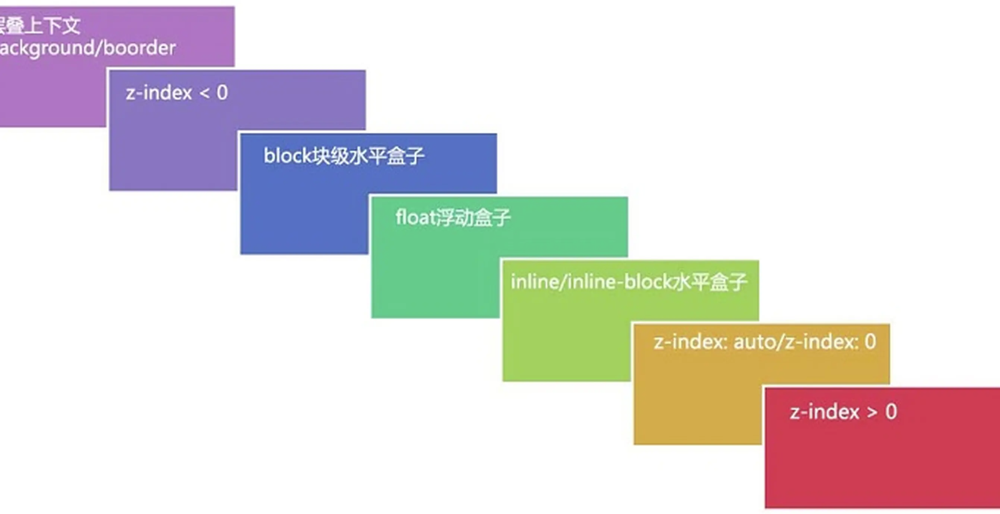
>
> 对于上图，由上到下分别是：
>
> （1）背景和边框：建立当前层叠上下文元素的背景和边框。
>
> （2）负的z-index：当前层叠上下文中，z-index属性值为负的元素。
>
> （3）块级盒：文档流内非行内级非定位后代元素。
>
> （4）浮动盒：非定位浮动元素。
>
> （5）行内盒：文档流内行内级非定位后代元素。
>
> （6）z-index:0：层叠级数为0的定位元素。
>
> （7）正z-index：z-index属性值为正的定位元素。
>
> **注意:** 当定位元素z-index:auto，生成盒在当前层叠上下文中的层级为 0，不会建立新的层叠上下文，除非是根元素。

### display、float、position的关系

> （1）首先判断display属性是否为none，如果为none，则position和float属性的值不影响元素最后的表现。
>
> 
>
> （2）然后判断position的值是否为absolute或者fixed，如果是，则float属性失效，并且display的值应该被设置为table或者block，具体转换需要看初始转换值。
>
> 
>
> （3）如果position的值不为absolute或者fixed，则判断float属性的值是否为none，如果不是，则display的值则按上面的规则转换。注意，如果position的值为relative并且float属性的值存在，则relative相对于浮动后的最终位置定位。
>
> 
>
> （4）如果float的值为none，则判断元素是否为根元素，如果是根元素则display属性按照上面的规则转换，如果不是，则保持指定的display属性值不变。
>
> 
>
> 总的来说，可以把它看作是一个类似优先级的机制，"position:absolute"和"position:fixed"优先级最高，有它存在的时候，浮动不起作用，'display'的值也需要调整；其次，元素的'float'特性的值不是"none"的时候或者它是根元素的时候，调整'display'的值；最后，非根元素，并且非浮动元素，并且非绝对定位的元素，'display'特性值同设置值。

## 场景应用

### 实现一个三角形

> CSS绘制三角形主要用到的是`border`属性，也就是边框。
>
> 平时在给盒子设置边框时，往往都设置很窄，就可能误以为边框是由矩形组成的。实际上，border属性是三角形组成的，下面看一个例子：
>
> ```css
>div {
>      width: 0;
>      height: 0;
>        border: 100px solid;
>        border-color: orange blue red green;
>    }
>    ```
> 
> 将元素的长宽都设置为0，显示出来的效果是这样的：
>
> 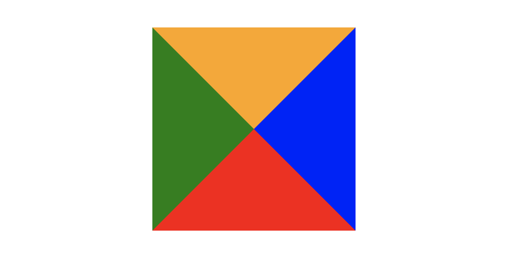
>
> 所以可以根据border这个特性来绘制三角形：
>
> `口诀`：盒子宽高均为零，三面边框皆透明。 
>
> **（1）三角1**
>
> ```css
>div{
>        width: 0;
>        height: 0;
>        border: 100px solid transparent;
>        /* border-radius: 50%; */
>        border-top-color: red;
>    }
>    ```
> 
> 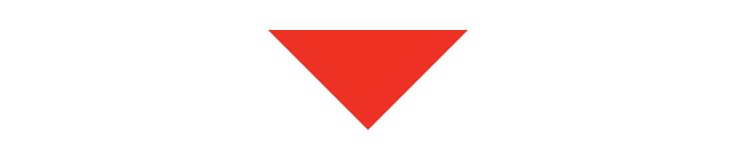
>
> **（2）三角2**
>
> ```css
>div {
>      width: 0;
>      height: 0;
>        border-bottom: 50px solid red;
>        border-right: 50px solid transparent;
>        border-left: 50px solid transparent;
>    }
>    ```
> 
> 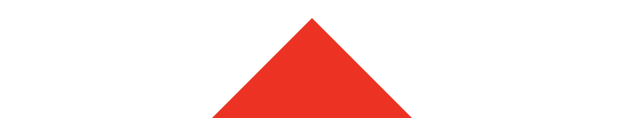
>
> **（3）三角3**
>
> ```css
>div {
>      width: 0;
>      height: 0;
>        border-left: 50px solid red;
>        border-top: 50px solid transparent;
>        border-bottom: 50px solid transparent;
>    }
>    ```
> 
> 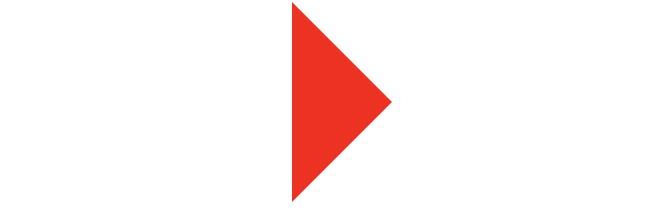
>
> **（4）三角4**
>
> ```css
>div {
>      width: 0;
>      height: 0;
>        border-right: 50px solid red;
>        border-top: 50px solid transparent;
>        border-bottom: 50px solid transparent;
>    }
>    ```
> 
> 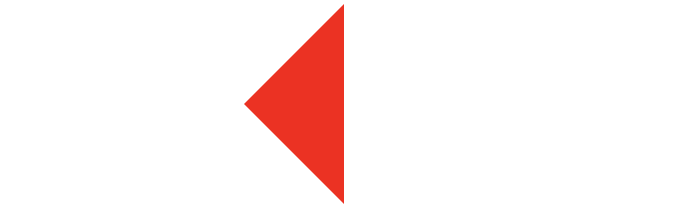
>
> **（5）三角5**
>
> ```css
>div {
>      width: 0;
>      height: 0;
>        border-top: 100px solid red;
>        border-right: 100px solid transparent;
>    }
>    ```
> 
> 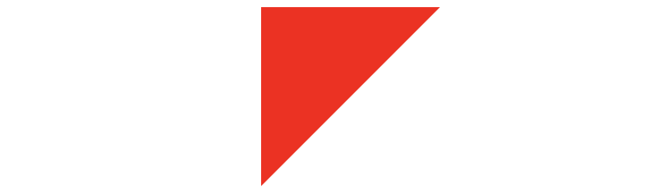
>
> 还有很多，就不一一实现了，总体的原则就是通过上下左右边框来控制三角形的方向，用边框的宽度比来控制三角形的角度。

### 实现一个扇形

> 用CSS实现扇形的思路和三角形基本一致，就是多了一个圆角的样式，实现一个90°的扇形：
>
> ```css
> div {
>     width: 0;
>     height: 0;
>     border: 100px solid transparent;
>     border-radius: 50%; /* 或者100px，以百分比格式为单位的值的参考对象是：边框+内边距+height/width */
>     border-top-color: red;
> }
> /* 画一个圆形 */
> div{
>     width: 100px;
>     height: 100px;
>     border-radius: 50%;
>     background: red;
> }
> /* 画一个半圆 */
> div{
>     width: 100px;
>     height: 50px;
>     border-radius: 0 0 50px 50px;
>     background: red;
> }
> ```
>
> 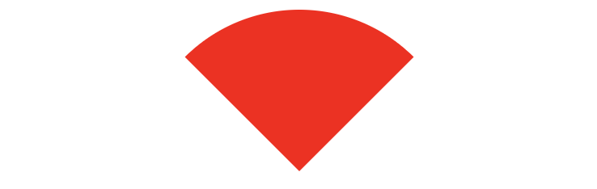

### CSS优化

> - 内联首屏关键CSS
> - 异步加载CSS
> - 资源压缩
> - 合理使用选择器
> - 减少使用昂贵的属性
> - 不要使用@import
> - `css`实现性能的方式可以从选择器嵌套、属性特性、减少`http`这三面考虑，同时还要注意`css`代码的加载顺序
>
> ####  内联首屏关键CSS
>
> > 在打开一个页面，页面首要内容出现在屏幕的时间影响着用户的体验，而通过内联`css`关键代码能够使浏览器在下载完`html`后就能立刻渲染。而如果外部引用`css`代码，在解析`html`结构过程中遇到外部`css`文件，才会开始下载`css`代码，再渲染
> >
> > 所以，`CSS`内联使用使渲染时间提前
>
> ####  异步加载CSS
>
> > 在`CSS`文件请求、下载、解析完成之前，`CSS`会阻塞渲染，浏览器将不会渲染任何已处理的内容
> >
> > 前面加载内联代码后，后面的外部引用`css`则没必要阻塞浏览器渲染。这时候就可以采取异步加载的方案，主要有如下：
> >
> > - 使用javascript将link标签插到head标签最后
> >
> >   ```js
> >   // 创建link标签
> >   const myCSS = document.createElement( "link" );
> >   myCSS.rel = "stylesheet";
> >   myCSS.href = "mystyles.css";
> >   // 插入到header的最后位置
> >   document.head.insertBefore( myCSS, document.head.childNodes[ document.head.childNodes.length - 1 ].nextSibling );
> >   ```
> >
> > - 设置link标签media属性为noexis，浏览器会认为当前样式表不适用当前类型，会在不阻塞页面渲染的情况下再进行下载。加载完成后，将`media`的值设为`screen`或`all`，从而让浏览器开始解析CSS
> >
> > - 通过rel属性将link元素标记为alternate可选样式表，也能实现浏览器异步加载。同样别忘了加载完成之后，将rel设回stylesheet
>
> #### 资源压缩
>
> > 利用`webpack`、`gulp/grunt`、`rollup`等模块化工具，将`css`代码进行压缩，使文件变小，大大降低了浏览器的加载时间
>
> #### 合理使用选择器
>
> > `css`匹配的规则是从右往左开始匹配，例如`#markdown .content h3`匹配规则如下：
> >
> > - 先找到h3标签元素
> > - 然后去除祖先不是.content的元素
> > - 最后去除祖先不是#markdown的元素
> >
> > 如果嵌套的层级更多，页面中的元素更多，那么匹配所要花费的时间代价自然更高
> >
> > 所以我们在编写选择器的时候，可以遵循以下规则：
> >
> > - 不要嵌套使用过多复杂选择器，最好不要三层以上
> > - 使用id选择器就没必要再进行嵌套
> > - 通配符和属性选择器效率最低，避免使用
>
> #### 减少使用昂贵的属性
>
> > 在页面发生重绘的时候，昂贵属性如`box-shadow`/`border-radius`/`filter`/透明度/`:nth-child`等，会降低浏览器的渲染性能
>
> #### 不要使用import
>
> > css样式文件有两种引入方式，一种是`link`元素，另一种是`@import`
> >
> > `@import`会影响浏览器的并行下载，使得页面在加载时增加额外的延迟，增添了额外的往返耗时
> >
> > 而且多个`@import`可能会导致下载顺序紊乱
> >
> > 比如一个css文件`index.css`包含了以下内容：`@import url("reset.css")`
> >
> > 那么浏览器就必须先把`index.css`下载、解析和执行后，才下载、解析和执行第二个文件`reset.css`
>
> #### 其它
>
> > - 减少重排操作，以及减少不必要的重绘
> > - 了解哪些属性可以继承而来，避免对这些属性重复编写
> > - cssSprite，合成所有icon图片，用宽高加上backgroud-position的背景图方式显现出我们要的icon图，减少了http请求
> > - 把小的icon图片转成base64编码
> > - CSS3动画或者过渡尽量使用transform和opacity来实现动画，不要使用left和top属性
>

### google设置小于12px的字体

> 在谷歌下css设置字体大小为12px及以下时，显示都是一样大小，都是默认12px。
>
> 解决方法
>
> * 使用Webkit的内核的-webkit-text-size-adjust的私有CSS属性来解决，只要加了-webkit-text-size-adjust:none;字体大小就不受限制了。但是chrome更新到27版本之后就不可以用了。所以高版本chrome谷歌浏览器已经不再支持-webkit-text-size-adjust样式，所以要使用时候慎用。
> * **css3** 中的 **-webkit-transform:scale(num)** 来对文字进行缩小了解决这个问题，其中 **num** 是设置的“**字体大小/12px**”。比如想要显示 **8px** 的文字，则 **num=8/12=0.67**。 注意-webkit-transform:scale(0.75);收缩的是整个元素的大小，这时候，如果是内联元素，必须要将内联元素转换成块元素，可以使用display：block/inline-block/...；
> * 使用图片：如果是内容固定不变情况下，使用将小于12px文字内容切出做图片，这样不影响兼容也不影响美观。

### 如何解决 1px 问题？

> 1px 问题指的是：在一些 `Retina屏幕` (视网膜屏)的机型上，移动端页面的 1px 会变得很粗，呈现出不止 1px 的效果。原因很简单——CSS 中的 1px 并不能和移动设备上的 1px 划等号。它们之间的比例关系有一个专门的属性来描述：
>
> ```html
> window.devicePixelRatio = 设备的物理像素 / CSS像素。
> ```
>
> 打开 Chrome 浏览器，启动移动端调试模式，在控制台去输出这个 `devicePixelRatio` 的值。这里选中 iPhone6/7/8 这系列的机型，输出的结果就是2：
>
> 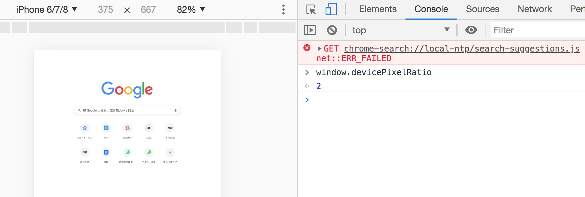
>
> 这就意味着设置的 1px CSS 像素，在这个设备上实际会用 2 个物理像素单元来进行渲染，所以实际看到的一定会比 1px 粗一些。
>
> **解决****1px 问题的三种思路：**
>
> #### 思路一：直接写 0.5px
>
> 如果之前 1px 的样式这样写：
>
> ```css
> border:1px solid #333
> ```
>
> 可以先在 JS 中拿到 window.devicePixelRatio 的值，然后把这个值通过 JSX 或者模板语法给到 CSS 的 data 里，达到这样的效果（这里用 JSX 语法做示范）：
>
> ```javascript
> <div id="container" data-device={{window.devicePixelRatio}}></div>
> ```
>
> 然后就可以在 CSS 中用属性选择器来命中 devicePixelRatio 为某一值的情况，比如说这里尝试命中 devicePixelRatio 为2的情况：
>
> ```css
> #container[data-device="2"] {
>   border:0.5px solid #333
> }
> ```
>
> 直接把 1px 改成 1/devicePixelRatio 后的值，这是目前为止最简单的一种方法。这种方法的缺陷在于兼容性不行，IOS 系统需要8及以上的版本，安卓系统则直接不兼容。
>
> #### 思路二：伪元素先放大后缩小
>
> 这个方法的可行性会更高，兼容性也更好。唯一的缺点是代码会变多。
>
> 
>
> 思路是**先放大、后缩小：****在目标元素的后面追加一个 ::after 伪元素，让这个元素布局为 absolute 之后、整个伸展开铺在目标元素上，然后把它的****宽和高都设置为目标元素的两倍，border值设为 1px。****接着借助 CSS 动画特效中的放缩能力，把整个伪元素缩小为原来的 50%。此时，伪元素的宽高刚好可以和原有的目标元素对齐，而 border 也缩小为了 1px 的二分之一****，间接地实现了 0.5px 的效果。**
>
> 
>
> 代码如下：
>
> ```css
> #container[data-device="2"] {
>     position: relative;
> }
> #container[data-device="2"]::after{
>       position:absolute;
>       top: 0;
>       left: 0;
>       width: 200%;
>       height: 200%;
>       content:"";
>       transform: scale(0.5);
>       transform-origin: left top;
>       box-sizing: border-box;
>       border: 1px solid #333;
>     }
> }
> ```
>
> #### 思路三：viewport 缩放来解决
>
> 这个思路就是对 meta 标签里几个关键属性下手：
>
> ```html
> <meta name="viewport" content="initial-scale=0.5, maximum-scale=0.5, minimum-scale=0.5, user-scalable=no">
> ```
>
> 这里针对像素比为2的页面，把整个页面缩放为了原来的1/2大小。这样，本来占用2个物理像素的 1px 样式，现在占用的就是标准的一个物理像素。根据像素比的不同，这个缩放比例可以被计算为不同的值，用 js 代码实现如下：
>
> ```javascript
> const scale = 1 / window.devicePixelRatio;
> // 这里 metaEl 指的是 meta 标签对应的 Dom
> metaEl.setAttribute('content', `width=device-width,user-scalable=no,initial-scale=${scale},maximum-scale=${scale},minimum-scale=${scale}`);
> ```
>
> 这样解决了，但这样做的副作用也很大，整个页面被缩放了。这时 1px 已经被处理成物理像素大小，这样的大小在手机上显示边框很合适。但是，一些原本不需要被缩小的内容，比如文字、图片等，也被无差别缩小掉了。

### 画一条0.5px的线

> - **采用transform: scale()的方式**，该方法用来定义元素的2D 缩放转换：
>
> ```css
> transform: scale(0.5,0.5);
> ```
>
> - **采用meta viewport的方式**
>
> ```css
> <meta name="viewport" content="width=device-width, initial-scale=0.5, minimum-scale=0.5, maximum-scale=0.5"/>
> ```
>
> 这样就能缩放到原来的0.5倍，如果是1px那么就会变成0.5px。viewport只针对于移动端，只在移动端上才能看到效果

## 字节前端面经

###  垂直居中的实现方案   

###  flexbox 的一些坑   

### 介绍一下盒子模型   

### z-index 在什么情况下会失效   

> 1、一般z-index的使用是在有两个重叠的标签，在一定的情况下控制其中一个在另一个的上方出现。
>
> 2、z-index值越大就越是在上层。z-index：9999；z-index元素的position属性要是relative，absolute或是fixed。
>
> 3、z-index在一定的情况下会失效。
>
> 　　①、父元素position为relative时，子元素的z-index失效。
>
> 　　　　解决：父元素position改为absolute或static
>
> 　　②、该元素没有设置position属性为非static属性。
>
> 　　　　解决：设置该元素的position属性为relative，absolute或是fixed中的一种。
>
> 　　③、该标签在设置z-index的同时还设置了float浮动
>
> 　　　　解决：float去除，改为display：inline-block；

### position: sticky 的作用

> 粘性定位可以被认为是相对定位和固定定位的混合（即元素子再跨越特定阈值前为相对定位，之后为固定定位）例如：
>
> ```css
> .div{
>   position: sticky;
>   top: 10px; 
> }
> ```
>
> 在 视口滚动到元素 top 距离小于 10px 之前，元素为相对定位。之后，元素将固定在与顶部距离 10px 的位置，直到视口回滚到阈值以下
>
> 一、应用场景：
>
> 1、粘性定位常作用在导航和概览信息(标题，表头，操作栏，底部评论等)上
>
> 2、当用户在浏览详细信息时，也能看到信息的概览和做一些操作，给用户带来便捷的使用体验。

### CSS预处理器

> CSS预处理器用一种专门的编程语言进行网页页面样式设计，然后再编译成正常的CSS文件，供项目使用。
>
> 为什么需要预处理器：CSS 本身不属于可编程语言，当前端项目逐渐庞大之后 CSS 的维护也愈加困难。CSS 预处理器所做的本质上是为 CSS 增加一些可编程的特性，通过**变量**、**嵌套**、**简单的程序逻辑**、**计算**、**函数**等特性，通过**工程化**的手段让 CSS 更易维护，提升开发效率。
>
> 
>
> `css`预处理器为`css`增加一些编程特性，无需考虑浏览器的兼容问题，可以在`CSS`中使用变量，简单的逻辑程序，函数等在编程语言中的一些基本的性能，可以让`css`更加的简洁，增加适应性以及可读性，可维护性等。
>
> 
>
> 目前主流的 CSS 预处理器主要有 PostCSS，Sass、Less、Stylus、
>
> ### 1. PostCSS
>
> PostCSS 是目前最为流行的 CSS 预/后处理器。PostCSS 本体功能比较单一，它提供一种用 JavaScript 来处理 CSS 的方式。PostCSS 会把 CSS 解析成 AST（Abstract Syntax Tree 抽象语法树），之后由其他插件进行不同的处理。
>
> #### 功能
>
> PostCSS 本体功能比较单一，大多数的 CSS 处理功能都由插件提供，下面是一些常用的插件：
>
> - [Autoprefixer](https://link.juejin.cn?target=https%3A%2F%2Fgithub.com%2Fpostcss%2Fautoprefixer) 为 CSS 中的属性添加浏览器特定的前缀。
> - [postcss-preset-env](https://link.juejin.cn?target=https%3A%2F%2Fgithub.com%2Fcsstools%2Fpostcss-preset-env) 根据 `browserslist` 指定的目标浏览器将一些 CSS 的新特性转换为目标浏览器所支持的语法。
> - [cssnano](https://link.juejin.cn?target=https%3A%2F%2Fgithub.com%2Fcssnano%2Fcssnano) 提供 CSS 压缩功能。
> - [postcss-nested](https://link.juejin.cn?target=https%3A%2F%2Fgithub.com%2Fpostcss%2Fpostcss-nested) 提供 CSS 嵌套功能。
> - [postcss-px-to-viewport](https://link.juejin.cn?target=https%3A%2F%2Fgithub.com%2Fevrone%2Fpostcss-px-to-viewport) 提供 px 转 vw 功能。
> - [postcss-custom-properties](https://link.juejin.cn?target=https%3A%2F%2Fgithub.com%2Fpostcss%2Fpostcss-custom-properties) 支持 CSS 的自定义属性。
>
> #### 优点
>
> - 插件系统完善，扩展性强。
> - 配合插件功能齐全。
> - 生态优秀。
>
> #### 缺点
>
> - 配置相对复杂。
>
> ### 2. Sass
>
> Sass 在完全兼容 CSS 语法的前提下，给 CSS 提供了变量、嵌套、混合、操作符、自定义函数等可编程能力。
>
> #### 功能
>
> Sass 常用的有几种功能：
>
> - 变量：变量中可以存储颜色、字体或任何 CSS 值。
> - 嵌套：可嵌套 CSS 选择器，提供清晰的层次结构。
> - 混合：可以定义&重用代码块。
> - 扩展/集成：可以在一个选择器内继承另一个选择器。
> - 操作符：可以在 CSS 中使用操作符进行计算。
> - 条件/循环语句：可以循环/条件生成 CSS。
> - 自定义函数：可以自定义复杂操作的函数。
>
> #### 优点
>
> - 使用广泛。
> - 功能支持完善。
> - 可编程能力强。
>
> #### 缺点
>
> - CSS 的复杂度不可控。
> - node-sass 国内安装不易（非 Sass 本身的缺点，dart-sass 可代替）。
>
> ### 3. Less
>
> Less 和 Sass 类似，完全兼容 CSS 语法，并给 CSS 提供了变量、嵌套、混合、运算等可编程能力。Less 通过 JavaScript 实现，可在浏览器端直接使用。
>
> #### 功能
>
> Less 常用的有几种功能：
>
> - 变量：变量中可以存储颜色、字体或任何 CSS 值。
> - 嵌套：可嵌套 CSS 选择器，提供清晰的层次结构。
> - 混合：可以定义&重用的代码块。
> - 扩展/集成：可以在一个选择器内继承另一个选择器。
> - 运算：可以在 CSS 中进行计算。
> - 条件/循环语句：可以循环/条件生成 CSS。
>
> #### 优点
>
> - 使用广泛。
> - 可以在浏览器中运行，容易实现主题定制功能。
>
> #### 缺点
>
> - 不支持自定义函数（可通过 mixins 实现简单逻辑）。
> - 编程能力相对较弱。
>
> 
>
> 使用原因：
>
> - 结构清晰， 便于扩展
> - 可以很方便的屏蔽浏览器私有语法的差异
> - 可以轻松实现多重继承
> - 完美的兼容了`CSS`代码，可以应用到老项目中

### HTML：meta标签干什么的，都有什么属性；doctype是干嘛的，都有哪些属性

### CSS：position，display，float都有哪些属性；盒模型

### 语义化标签说出几个；form表单的属性说一说

### CSS：background的属性；隐藏元素的方法

### **浏览器都有哪几种缓存？区别是什么**

> cookie 、localStorage 和 sessionStorage  
>
> -  **cookie：**其实最开始是服务器端用于记录用户状态的一种方式，由服务器设置，在客户端存储，然后每次发起同源请求时，发送给服务器端。cookie 最多能存储 4 k 数据，它的生存时间由 expires 属性指定，并且 cookie 只能被同源的页面访问共享。 
> -  **sessionStorage：**html5 提供的一种浏览器本地存储的方法，它借鉴了服务器端 session 的概念，代表的是一次会话中所保存的数据。它一般能够存储 5M 或者更大的数据，它在当前窗口关闭后就失效了，并且 sessionStorage 只能被同一个窗口的同源页面所访问共享。 
> -  **localStorage：**html5 提供的一种浏览器本地存储的方法，它一般也能够存储 5M 或者更大的数据。它和 sessionStorage 不同的是，除非手动删除它，否则它不会失效，并且 localStorage 也只能被同源页面所访问共享。
> -  客户端请求服务端，服务端会为这次请求开辟一块`内存空间`，这个对象便是 Session 对象
> -  是服务器发送到 Web 浏览器的一小块数据。服务器发送到浏览器的 Cookie，浏览器会进行存储，并与下一个请求一起发送到服务

### 一个button宽高都设为100px，那它的真实大小是多少？