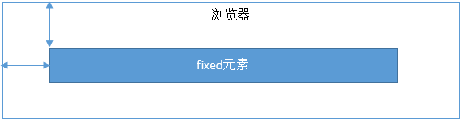
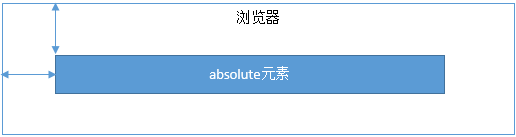

https://jonny-wei.github.io/blog/css/

## CSS基础

### CSS选择器及其优先级

> | **选择器**     | **格式**      | **优先级权重** |
> | -------------- | ------------- | -------------- |
> | id选择器       | #id           | 100            |
> | 类选择器       | .classname    | 10             |
> | 属性选择器     | a[ref=“eee”]  | 10             |
> | 伪类选择器     | li:last-child | 10             |
> | 标签选择器     | div           | 1              |
> | 伪元素选择器   | li:after      | 1              |
> | 相邻兄弟选择器 | h1+p          | 0              |
> | 子选择器       | ul>li         | 0              |
> | 后代选择器     | li a          | 0              |
> | 通配符选择器   | *             | 0              |
>
> - **优先级：**
>
>   -   `!important`
>   -   内联样式（1000）
>   -   ID选择器（0100）
>   -   类选择器/属性选择器/伪类选择器（0010）
>   -   元素选择器/伪元素选择器（0001）
>   -   关系选择器/通配符选择器（0000）
>
>   注意事项：
>
>   通用选择器（*）、子选择器（>）和相邻同胞选择器（+）并不在这四个等级中，所以它们的权值都为 0 ；
>
>   带!important 标记的样式属性优先级最高；
>
>   样式表的来源不同时，优先级顺序为：内联样式 > 内部样式 > 外部样式 > 浏览器用户自定义样式 > 浏览器默认样式。
>
>    样式表的来源相同时：
>   `!important > 行内样式>ID选择器 > 类选择器 > 标签 > 通配符 > 继承 > 浏览器默认属性`
>
>   元素选择器就是标签选择器

###  display的属性值及其作用

> display 设置一个元素应如何显示

> | **属性值**   | **作用**                                                     |
> | ------------ | ------------------------------------------------------------ |
> | none         | 元素`不显示`，并且会从文档流中移除。不再占有原来的位置       |
> | block        | 块类型。默认宽度为父元素宽度，可设置宽高，`换行显示`。       |
> | inline       | 行内元素类型。默认宽度为内容宽度，`不可`设置宽高，`同行显示`。 |
> | inline-block | 默认宽度为内容宽度，`可以`设置宽高，同行显示。               |
> | list-item    | 像块类型元素一样显示，并添加样式列表标记。                   |
> | table        | 此元素会作为块级表格来显示。                                 |
> | inherit      | 规定应该从父元素继承display属性的值。                        |

###  隐藏元素的方法有哪些

> - **display: none**：渲染树不会包含该渲染对象，因此该元素不会在页面中占据位置，也不会响应绑定的监听事件。(回流＋重绘)
> - **visibility: hidden**：元素在页面中仍占据空间，但是不会响应绑定的监听事件。（重绘）
>
> - **opacity: 0**：将元素的透明度设置为 0，以此来实现元素的隐藏。元素在页面中仍然占据空间，并且能够响应元素绑定的监听事件。
> - **position: absolute**：通过使用绝对定位，*left极大负值*，将元素移除可视区域内，以此来实现元素的隐藏。
>
> - **z-index: 负值**：来使其他元素遮盖住该元素，以此来实现隐藏。
> - **clip/clip-path** ：使用元素裁剪的方法来实现元素的隐藏，这种方法下，元素仍在页面中占据位置，但是不会响应绑定的监听事件。
>
> - **transform: scale(0,0)**：将元素缩放为 0，来实现元素的隐藏。这种方法下，元素仍在页面中占据位置，但是不会响应绑定的监听事件。
>
> > 该问题会引出 回流和重绘
> >
> > **回流：当`render tree`（渲染树）中部分或者是全部的`元素`的`尺寸`、`结构`或者某些`属性`发生变化之后，浏览器会重新渲染部分或者全部的`文档`，就是回流。**
> >
> > **重绘：当页面中的`样式改变`而并`不`影响他在`文档流中的位置`的时候，浏览器会给元素`赋予新的样式`，然后并且重新绘制文档流，这个过程就是重绘。**
> >
> > 回流必将引起重绘，反之不然
> >
> > #### HTML的加载过程/浏览器渲染过程
> >
> > 1.解析HTML，生成DOM树，然后也会解析CSS，生成CSSDOM树就如上六边形；
> >
> > 2.将DOM树和CSSOM树结合，生成渲染树(Render Tree)，这一过程称为Attachment，渲染树并不等同于Dom树，因为像head标签 或 display: none这样的元素就没有必要放到渲染树中了，但是它们在Dom树中；
> >
> > 3.Layout(回流):对渲染树进行布局，定位坐标和大小、确定是否换行、确定position、overflow、z-index等等，这个过程叫layout
> >
> > 4.Painting(重绘):根据渲染树以及回流得到的几何信息，得到节点的绝对像素
> >
> > 5.绘制渲染树，调用操作系统底层API(UI Backend)进行绘图操作（这个步骤比较复杂有兴趣的同学可以去深入了解）。
> >

###  display:none与visibility:hidden的区别

> 这两个属性都是让元素隐藏，不可见。**两者****区别如下：**
>
> （1）**在渲染树中**
>
> - `display:none`会让元素完全从渲染树中消失，渲染时不会占据任何空间；
> - `visibility:hidden`不会让元素从渲染树中消失，渲染的元素还会占据相应的空间，只是内容不可见。
>
> （2）**是否是**继承属性
>
> - `display:none`是非继承属性，子孙节点会随着父节点从渲染树消失，通过修改子孙节点的属性也无法显示；
> - `visibility:hidden`是继承属性，子孙节点消失是由于继承了`hidden`，通过设置`visibility:visible`可以让子孙节点显示；
>
> （3）修改常规文档流中元素的 `display` 通常会造成文档的重排（回流＋重绘），但是修改`visibility`属性只会造成本元素的重绘；
>
> （4）如果使用读屏器，设置为`display:none`的内容不会被读取，设置为`visibility:hidden`的内容会被读取。

### 对盒模型的理解

> CSS3中的盒模型有以下两种：标准盒子模型、IE盒子模型
>
> 
>
> 
>
> 盒模型都是由四个部分组成的，分别是margin、border、padding和content。
>
> 
>
> 标准盒模型和IE盒模型的区别在于设置`width`和`height`时，所对应的范围不同：
>
> - `标准盒模型`的width和height属性的范围`只包含了content`，
> - `IE盒模型`的width和height属性的范围包含了`border、padding和content`。
>
> 
>
> 可以通过修改元素的box-sizing属性来改变元素的盒模型：
>
> - `box-sizing: content-box`表示标准盒模型（默认值）
> - `box-sizing: border-box`表示IE盒模型（怪异盒模型）

### CSS3中有哪些新特性

> - 新增各种CSS选择器 （: not(.input)：所有 class 不是“input”的节点），nth-of-type()
> - 圆角 （border-radius:8px）
>
> - 多列布局 （multi-column layout）
> - 阴影和反射 （Shadoweflect）
>
> - 文字特效 （text-shadow）
> - 文字渲染 （Text-decoration）
>
> - 线性渐变 （gradient）
> - 旋转 （transform）
>
> - 增加了旋转,缩放,定位,倾斜,动画,多背景
>
> -----------------
>
> - `过渡`
>
> ```js
> /*所有属性从原始值到制定值的一个过渡，运动曲线ease,运动时间0.5秒*/ 
> transition：all,.5s
> ```
>
> - `动画`
>
> ```js
> //animation：动画名称，一个周期花费时间，运动曲线（默认ease），动画延迟（默认0），播放次数（默认1），是否反向播放动画（默认normal），是否暂停动画（默认running）
> /*执行一次logo2-line动画，运动时间2秒，运动曲线为 linear*/
> animation: logo2-line 2s linear;
> ```
>
> - `形状转换`
>
> ```js
> //transform:适用于2D或3D转换的元素
> //transform-origin：转换元素的位置（围绕那个点进行转换）。默认(x,y,z)：(50%,50%,0)
> transform:translate(30px,30px);
> transform:rotate(30deg);
> transform:scale(.8);
> ```
>
> - 选择器:nth-of-type()
> - 阴影
>   文字阴影: text-shadow: 2px 2px 2px #000;(水平阴影，垂直阴影，模糊距离，阴影颜色) 盒子阴影: box-shadow: 10px 10px 5px #999
> - 边框 border-image: url(border.png);
> - 背景
> - 文字
> - 渐变
> - Filter（滤镜）
> - 弹性布局、栅格布局、多列布局
> - 媒体查询

### 单行、多行文本溢出隐藏

> - 单行文本溢出
>
> ```css
> overflow: hidden;            // 溢出隐藏
> text-overflow: ellipsis;      // 溢出用省略号显示
> white-space: nowrap;         // 规定段落中的文本不进行换行
> ```
>
> - 多行文本溢出
>
> ```css
> overflow: hidden;            // 溢出隐藏
> text-overflow: ellipsis;     // 溢出用省略号显示
> display:-webkit-box;         // 作为弹性伸缩盒子模型显示。
> -webkit-box-orient:vertical; // 设置伸缩盒子的子元素排列方式：从上到下垂直排列
> -webkit-line-clamp:3;        // 显示的行数
> ```
>
> 注意：由于上面的三个属性都是 CSS3 的属性，没有浏览器可以兼容，所以要在前面加一个`-webkit-` 来兼容一部分浏览器。
>
> 因使用了WebKit的CSS扩展属性，该方法适用于WebKit浏览器及移动端
>
> orient:朝向，vertical：竖着的 clamp：堆
>
> > 在webkit浏览器或移动端（绝大部分是webkit内核的浏览器）可以直接使用webkit的css扩展属性（webkit是私有属性）-webkit-line-clamp；
> > 注意：这是一个不规范的属性，它没有在CSS的规范草案中
> >  -webkit-line-clamp用来限制在一个块元素显示的文本行数，为了实现效果，他要与一下webkit属性结合使用：
> >  display:-webkit-box;（必须结合的属性，将对象作为弹性伸缩盒子模型展示）
> >  -webkit-box-orient（必须结合的属性，设置或检索伸缩盒对象的子元素的排列方式）
>
> ps:
>
> `moz`代表firefox浏览器私有属性；
>
> `-ms`代表IE浏览器私有属性；
>
> `-webkit`代表chrome、safari私有属性；
>
> `-o`代表Opera私有属性。

## 页面布局

###  两栏布局的实现

https://juejin.cn/post/6844904062224171021#heading-14

浮动，浮动+bfc，flex；1，子绝父相

> 一般两栏布局指的是**左边一栏宽度固定，右边一栏宽度自适应**，两栏布局的具体实现：
>
> - **float + margin**：利用浮动，将左边元素宽度设置为200px，并且设置向左浮动。将右边元素的margin-left设置为200px，宽度设置为auto（默认为auto，撑满整个父元素）。
>
> ```css
> .outer {
>     height: 100px;
> }
> .left {
>     float: left;
>     width: 200px;
>     background: tomato;
> }
> .right {
>     margin-left: 200px;
>     width: auto;
>     background: gold;
> }
> ```
>
> - **float + BFC**：利用浮动，左侧元素设置固定大小，并左浮动，右侧元素设置overflow: hidden; 这样右边就触发了`BFC`，`BFC的区域不会与浮动元素发生重叠`，所以两侧就不会发生重叠。
>
> ```css
> .left{
>      width: 100px;
>      height: 200px;
>      background: red;
>      float: left;
>  }
>  .right{
>      height: 300px;
>      background: blue;
>      overflow: hidden;
>  }
> ```
>
> - 利用flex布局，将左边元素设置为固定宽度200px，将右边的元素设置为flex:1。
>
> > ## flex: 1 是什么意思
> >
> > `flex: 1` 可以让子元素如何占据父元素的剩余空间，可以是一个数字，也可以是 `auto`，表示子元素占据剩余空间的比例。
> >
> > flex 属性是 `flex-grow`、`flex-shrink` 和 `flex-basis` 属性的简写。
> >
> > ```css
> > flex: flex-grow flex-shrink flex-basis|auto|initial|inherit;
> > ```
> >
> > 拷贝
> >
> > `flex: 1` 相当于 `flex-grow: 1`、`flex-shrink: 1` 和 `flex-basis: 0%`。
> >
> > - `flex-grow: 1` ：该属性默认为 `0` ，如果存在剩余空间，元素也不填满。设置为 `1` 代表会填满。
> > - `flex-shrink: 1` ：该属性默认为 `1` ，如果空间不足，元素缩小比例 1。
> > - `flex-basis: 0%` ：该属性定义在分配多余空间之前，元素占据的主轴空间。浏览器就是根据这个属性来**计算是否有多余空间**的。默认值为 `auto` ，即项目本身大小。设置为 `0%` 之后，因为有 `flex-grow` 和 `flex-shrink` 的设置会自动放大或缩小。在做两栏布局时，如果右边的自适应元素 `flex-basis` 设为 `auto` 的话，其本身大小将会是 `0` 。
>
> ```css
> .outer {
>   display: flex;
>   height: 100px;
> }
> .left {
>   width: 200px;
>   background: tomato;
> }
> .right {
>   flex: 1;
>   background: gold;
> }
> ```
>
> - **position**：利用绝对定位，将父级元素设置为相对定位。左边元素设置为absolute定位，并且宽度设置为200px。将右边元素的margin-left的值设置为200px。
>
> ```css
> .outer {
>   position: relative;
>   height: 100px;
> }
> .left {
>   position: absolute;
>   width: 200px;
>   background: tomato;
> }
> .right {
>   margin-left: 200px;
>   background: gold;
> }
> ```
> 
>- **position**：利用绝对定位，将父级元素设置为相对定位。左边元素宽度设置为200px，右边元素设置为绝对定位，左边定位为200px，其余方向定位为0。
> 
>```css
> .outer {
>     position: relative;
>     height: 100px;
> }
> .left {
>     width: 200px;
>     background: tomato;
> }
> .right {
>     position: absolute;
>     top: 0;
>     right: 0;
>     bottom: 0;
>     left: 200px;
>     background: gold;
> }
> ```

### 三栏布局的实现

> 三栏布局一般指的是页面中一共有三栏，**左右两栏宽度固定，中间自适应的布局**，三栏布局的具体实现：
>
> - 利用**绝对定位**，左右两栏设置为绝对定位，中间设置对应方向大小的margin的值。
>
> ```css
> .outer {
>     position: relative;
>     height: 100px;
> }
> 
> .left {
>     position: absolute;
>     width: 100px;
>     height: 100px;
>     background: tomato;
> }
> 
> .right {
>     position: absolute;
>     top: 0;
>     right: 0;    /* 这两行必须设置，否则会被挤到第二行 */
>     width: 200px;
>     height: 100px;
>     background: gold;
> }
> 
> .center {
>     margin-left: 100px;
>     margin-right: 200px;
>     height: 100px;
>     background: lightgreen;
> }
> ```
>
> - 利用flex布局，左右两栏设置固定大小，中间一栏设置为flex:1。
>
> ```css
> .outer {
>   display: flex;
>   height: 100px;
> }
> 
> .left {
>   width: 100px;
>   background: tomato;
> }
> 
> .right {
>   width: 100px;
>   background: gold;
> }
> 
> .center {
>   flex: 1;
>   background: lightgreen;
> }
> ```
>
> - 利用浮动，左右两栏设置固定大小，并设置对应方向的浮动。中间一栏设置左右两个方向的margin值，注意这种方式**，`中间一栏必须放到最后`：**
>
> - ```js
>   <div class=" outer left"></div>
>   <div class=" outer right"></div>
>   <div class=" outer center"></div>
>   ```
>
>   ps：为什么中间一栏必须放到最后，不放到最后，right就会被撑到下一行？
>
>   > ，浏览器解析HTML文档是从上到下按顺序解析的，如果center在right前面，right本来就是一个block，设置右浮动不会对它前面的center有影响
>
>   原理：
>
> - 元素浮动后，脱离文档流。
>
> - 左右栏分别浮动在窗口两边，`中间块(处于文档流中)受左右浮动影响`被`卡在中间`无法继续向左右伸展已达到自适应，最后按需设置中间块的margin值来改变快间间隙即可。
>
> - 基于纯float实现的三栏布局需要将中间的内容放在HTML结构的最后，DOM结构为`左-右-中`，否则右侧会沉在中间内容的下侧 .
>
> ```css
> .outer {
>     height: 100px;
> }
> 
> .left {
>     float: left;
>     width: 100px;
>     height: 100px;
>     background: tomato;
> }
> 
> .right {
>     float: right;
>     width: 200px;
>     height: 100px;
>     background: gold;
> }
> 
> .center {
>     height: 100px;
>     margin-left: 100px;
>     margin-right: 200px;
>     background: lightgreen;
> }
> ```
>
> - 圣杯布局，利用浮动和负边距来实现。父级元素设置左右的 padding，三列均设置向左浮动，中间一列放在最前面，宽度设置为父级元素的宽度，因此后面两列都被挤到了下一行，通过设置 margin 负值将其移动到上一行，再利用相对定位，定位到两边。
>
> ```css
> .outer {
>   height: 100px;
>   padding-left: 100px;
>   padding-right: 200px;
> }
> 
> .left {
>   position: relative;
>   left: -100px;
> 
>   float: left;
>   margin-left: -100%;
> 
>   width: 100px;
>   height: 100px;
>   background: tomato;
> }
> 
> .right {
>   position: relative;
>   left: 200px;
> 
>   float: right;
>   margin-left: -200px;
> 
>   width: 200px;
>   height: 100px;
>   background: gold;
> }
> 
> .center {
>   float: left;
> 
>   width: 100%;
>   height: 100px;
>   background: lightgreen;
> }
> ```
>
> - 双飞翼布局，双飞翼布局相对于圣杯布局来说，左右位置的保留是通过中间列的 margin 值来实现的，而不是通过父元素的 padding 来实现的。本质上来说，也是通过浮动和外边距负值来实现的。
>
> ```css
> .outer {
>   height: 100px;
> }
> 
> .left {
>   float: left;
>   margin-left: -100%;
> 
>   width: 100px;
>   height: 100px;
>   background: tomato;
> }
> 
> .right {
>   float: left;
>   margin-left: -200px;
> 
>   width: 200px;
>   height: 100px;
>   background: gold;
> }
> 
> .wrapper {
>   float: left;
> 
>   width: 100%;
>   height: 100px;
>   background: lightgreen;
> }
> 
> .center {
>   margin-left: 100px;
>   margin-right: 200px;
>   height: 100px;
> }
> ```

### 水平垂直居中的实现

> 拓展：水平居中，垂直居中的实现：https://segmentfault.com/a/1190000014116655

> - 利用绝对定位，先将元素的左上角通过top:50%和left:50%定位到页面的中心，然后再通过translate(定义`2D`转换)来调整元素的中心点到页面的中心。该方法需要**考虑浏览器兼容问题。** ---`不知道宽高`的情况下		**绝对定位+transform**
>
> ps:[transform详解translate](https://www.cnblogs.com/yanggeng/p/11286250.html)
>
> **translateX**：向X轴平移，填正数往右平移，填负数，往左平移
>
> **translateY**：向Y轴平移，填正数往下平移，填负数，往上平移
>
> **translate**：是同时设置 translateX 和 translateY， 所以里面可以填两个参数， 第一个值 X 第二个 Y
>
> **translate(-50%,-50%)** 作用是，往上（x轴）,左（y轴）移动自身长宽的 50%，以使其居于`中心位置`
>
> 与负margin-left和margin-top实现居中不同的是，margin-left必须知道自身的宽高，而translate可以在不知道宽高的情况下进行居中，tranlate（）函数中的百分比是相对于自身宽高的百分比，所以能进行居中。
>
> ```css
> .parent {
>     position: relative;
> }
>  
> .child {
>     width: 100px;
>     height: 100px;
>     background: green;
>     
>     position: absolute;
>     left: 50%;
>     top: 50%;
>     transform: translate(-50%,-50%);   
> }
> ```
>
> - 利用绝对定位，设置四个方向的值都为0，并将margin设置为auto，由于宽高固定，因此对应方向实现平分，可以实现水平和垂直方向上的居中。该方法适用于`盒子有宽高`的情况：								**绝对定位+margin:auto**
>
> ```css
> .parent {
>     position: relative;
> }
>  
> .child {
>     width: 100px;
>     height: 100px;
>     background: green;
>     
>     position: absolute;
>     top: 0;
>     bottom: 0;
>     left: 0;
>     right: 0;
>     margin: auto;
> }
> ```
>
> - 利用绝对定位，先将元素的左上角通过top:50%和left:50%定位到页面的中心，然后再通过margin负值来调整元素的中心点到页面的中心。该方法适用于`盒子宽高已知`的情况                                 **绝对定位+负margin**
>
> ```css
> .parent {
>     position: relative;
> }
>  
> .child {
>     width: 100px;
>     height: 100px;
>     background: green;
>     
>     position: absolute;
>     top: 50%;
>     left: 50%;
>     margin-top: -50px;     /* 自身 height 的一半的负值 */
>     margin-left: -50px;    /* 自身 width 的一半的负值 */
> }
> ```
>
> - 使用`flex`布局，通过align-items:center和justify-content:center设置容器的垂直和水平方向上为居中对齐，然后它的子元素也可以实现垂直和水平的居中。该方法要**考虑兼容的问题**，该方法在`移动端`用的较多：
>
> ```css
> .parent {
>     display: flex;
>     justify-content:center;
>     align-items:center;
> }
> .child {
>     width: 100px;
>     height: 100px;
>     background: pink;
> }
> ```
>
> align:排列  

### 对Flex布局的理解及其使用场景

> Flex是FlexibleBox的缩写，意为"弹性布局"，用来为盒状模型提供最大的灵活性。任何一个容器都可以指定为Flex布局。行内元素也可以使用Flex布局。注意，设为Flex布局以后，**子元素的float、clear和vertical-align属性将失效**。采用Flex布局的元素，称为Flex容器（flex container），简称"容器"。它的所有子元素自动成为容器成员，称为Flex项目（flex item），简称"项目"。容器默认存在两根轴：水平的主轴（main axis）和垂直的交叉轴（cross axis），项目默认沿水平主轴排列。
>
> 
>
> 以下6个属性设置在**容器上**：
>
> - flex-direction属性决定主轴的方向（即项目的排列方向）。
> - flex-wrap属性定义，如果一条轴线排不下，如何换行。
>
> - flex-flow属性是flex-direction属性和flex-wrap属性的简写形式，默认值为row nowrap。
> - justify-content属性定义了项目在主轴上的对齐方式。
>
> - align-items属性定义项目在交叉轴上如何对齐。
> - align-content属性定义了多根轴线的对齐方式。如果项目只有一根轴线，该属性不起作用。
>
> 
>
> 以下6个属性设置在**项目上**：
>
> - order属性定义项目的排列顺序。数值越小，排列越靠前，默认为0。
> - flex-grow属性定义项目的放大比例，默认为0，即如果存在剩余空间，也不放大。
>
> - flex-shrink属性定义了项目的缩小比例，默认为1，即如果空间不足，该项目将缩小。
> - flex-basis属性定义了在分配多余空间之前，项目占据的主轴空间。浏览器根据这个属性，计算主轴是否有多余空间。它的默认值为auto，即项目的本来大小。
>
> - flex属性是flex-grow，flex-shrink和flex-basis的简写，默认值为0 1 auto。
> - align-self属性允许单个项目有与其他项目不一样的对齐方式，可覆盖align-items属性。默认值为auto，表示继承父元素的align-items属性，如果没有父元素，则等同于stretch。
>
> 
>
> **简单来说：**
>
> flex布局是CSS3新增的一种布局方式，可以通过将一个元素的display属性值设置为flex从而使它成为一个flex容器，它的所有子元素都会成为它的项目。一个容器默认有两条轴：一个是水平的主轴，一个是与主轴垂直的交叉轴。可以使用flex-direction来指定主轴的方向。可以使用justify-content来指定元素在主轴上的排列方式，使用align-items来指定元素在交叉轴上的排列方式。还可以使用flex-wrap来规定当一行排列不下时的换行方式。对于容器中的项目，可以使用order属性来指定项目的排列顺序，还可以使用flex-grow来指定当排列空间有剩余的时候，项目的放大比例，还可以使用flex-shrink来指定当排列空间不足时，项目的缩小比例。

## 定位与浮动

### 为什么需要清除浮动？清除浮动的方式

> **浮动的定义：** 非IE浏览器下，容器`不设高度`且`子元素浮动`时，容器高度不能被内容撑开。 此时，内容会溢出到容器外面而影响布局。这种现象被称为浮动（溢出）。
>
> 
>
> **浮动的工作原理：**
>
> - 浮动元素脱离文档流，不占据空间（引起“高度塌陷”现象）
> - 浮动元素碰到包含它的边框或者其他浮动元素的边框停留
>
> 
>
> 浮动元素可以左右移动，直到遇到另一个浮动元素或者遇到它外边缘的包含框。浮动框不属于文档流中的普通流，当元素浮动之后，不会影响块级元素的布局，只会影响内联元素布局。此时文档流中的普通流就会表现得该浮动框不存在一样的布局模式。当包含框的高度小于浮动框的时候，此时就会出现“高度塌陷”。
>
> 
>
> **浮动元素引起的问题？**
>
> - 父元素的高度无法被撑开，影响与父元素同级的元素
> - 与浮动元素同级的非浮动元素会跟随其后
>
> - 若浮动的元素不是第一个元素，则该元素之前的元素也要浮动，否则会影响页面的显示结构
>
> 
>
> **清除浮动的方式如下：**
>
> - 给父级div定义`height`属性
> - 最后一个浮动元素之后添加一个空的div标签，并添加`clear:both`样式
>
> - 包含浮动元素的父级标签添加`overflow:hidden`或者`overflow:auto`
> - 使用 :after 伪元素。由于IE6-7不支持 :after，使用 zoom:1 触发 hasLayout
>
> ```css
> .clearfix:after{
>     content: "\200B";
>     display: table; 
>     height: 0;
>     clear: both;
>   }
>   .clearfix{
>     *zoom: 1;
>   }
> ```

### 对BFC的理解，如何创建BFC

> 先来看两个相关的概念：
>
> - Box: Box 是 CSS 布局的对象和基本单位，⼀个⻚⾯是由很多个 Box 组成的，这个Box就是我们所说的盒模型。 
> - Formatting context：块级上下⽂格式化，它是⻚⾯中的⼀块渲染区域，并且有⼀套渲染规则，它决定了其⼦元素将如何定位，以及和其他元素的关系和相互作⽤。 
>
> 
>
> 块格式化上下文（Block Formatting Context，BFC）是Web页面的`可视化CSS渲染`的一部分，是布局过程中生成`块级盒子`的区域，也是浮动元素与其他元素的交互限定区域。
>
> 
>
> 通俗来讲：BFC是一个独立的布局环境，可以理解为一个容器，在这个容器中按照一定规则进行物品摆放，并且不会影响其它环境中的物品。如果一个元素符合触发BFC的条件，则BFC中的元素布局不受外部影响。
>
> 
>
> **创建BFC的条件（任意一个或多个条件）：**
>
> - 根元素：body；  根元素（html）（MDN中的介绍）
> - 元素设置浮动：float 除 none 以外的值；left right inherit
>
> - 元素设置绝对定位：position (absolute、fixed（固定定位）)；
> - display 值为：inline-block（行内块元素）、table-cell（表格单元格）、table-caption（表格标题）、flex（弹性布局）等；
>
> - overflow 值为：hidden、auto、scroll；不为visible
>
> 根元素就是没有父节点的 dom 节点
>
> 
>
> **BFC的特点：**
>
> - 垂直方向上，自上而下排列，和文档流的排列方式一致。
> - 在BFC中上下相邻的两个容器的margin会重叠
>
> - 计算BFC的高度时，需要计算浮动元素的高度
> - BFC区域不会与浮动的容器发生重叠
>
> - BFC是独立的容器，容器内部元素不会影响外部元素
> - 每个元素的左margin值和容器的左border相接触
>
> 
>
> **BFC的作用：**
>
> - **解决margin的重叠问题**：由于BFC是一个独立的区域，内部的元素和外部的元素互不影响，将两个元素变为两个BFC，就解决了margin重叠的问题。
> - **解决高度塌陷的问题**：在对子元素设置浮动后，父元素会发生高度塌陷，也就是父元素的高度变为0。解决这个问题，只需要把父元素变成一个BFC。常用的办法是给父元素设置`overflow:hidden`。
>
> - **创建自适应两栏布局**：可以用来创建自适应两栏布局：左边的宽度固定，右边的宽度自适应。
>
> ```css
> .left{
>      width: 100px;
>      height: 200px;
>      background: red;
>      float: left;
>  }
>  .right{
>      height: 300px;
>      background: blue;
>      overflow: hidden;
>  }
>  
> <div class="left"></div>
> <div class="right"></div>
> ```
>
> 左侧设置`float:left`，右侧设置`overflow: hidden`。这样右边就触发了BFC，BFC的区域不会与浮动元素发生重叠，所以两侧就不会发生重叠，实现了自适应两栏布局。

### position的属性有哪些，区别是什么

> position有以下属性值：
>
> | 属性值   | 概述                                                         |
> | -------- | ------------------------------------------------------------ |
> | absolute | 生成绝对定位的元素，相对于static定位以外的一个父元素进行定位。元素的位置通过left、top、right、bottom属性进行规定。 |
> | relative | 生成相对定位的元素，相对于其原来的位置进行定位。元素的位置通过left、top、right、bottom属性进行规定。 |
> | fixed    | 生成绝对定位的元素，指定元素相对于屏幕视⼝（viewport）的位置来指定元素位置。元素的位置在屏幕滚动时不会改变，⽐如回到顶部的按钮⼀般都是⽤此定位⽅式。 |
> | static   | 默认值，没有定位，元素出现在正常的文档流中，会忽略 top, bottom, left, right 或者 z-index 声明，`块级元素`从上往下纵向排布，`⾏级元素`从左向右排列。 |
> | inherit  | 规定从父元素继承position属性的值                             |
>
> `ps`:还有一个属性值，`sticky`，粘性定位，可以被认为是相对定位和`固定`定位的混合（即元素在跨越特定阈值前为相对定位，之后为固定定位）例如：
>
> ```css
> .div{
>   position: sticky;
>   top: 10px; 
> }
> ```
>
> 在 视口滚动到元素 top 距离小于 10px 之前，元素为相对定位。之后，元素将固定在与顶部距离 10px 的位置，直到视口回滚到阈值以下
>
> 粘性定位常作用在**导航**和**概览**信息(标题，表头，操作栏，底部评论等)上


> 前面三者的定位方式如下：
>
> - **relative：**元素的定位永远是相对于元素自身位置的，和其他元素没关系，也不会影响其他元素。
>
> 
>
> - **fixed：**元素的定位是相对于 window （或者 iframe）边界的，和其他元素没有关系。但是它具有破坏性，会导致其他元素位置的变化。
>
> 
>
> - **absolute：**元素的定位相对于前两者要复杂许多。如果为 absolute 设置了 top、left，浏览器会根据什么去确定它的纵向和横向的偏移量呢？答案是浏览器会递归查找该元素的所有父元素，如果找到一个设置了`position:relative/absolute/fixed`的元素，就以该元素为基准定位，如果没找到，就以浏览器边界定位。如下两个图所示：
>
> 
>
> 

## 场景应用

### 实现一个三角形

> CSS绘制三角形主要用到的是`border`属性，也就是边框。
>
> 平时在给盒子设置边框时，往往都设置很窄，就可能误以为边框是由矩形组成的。实际上，border属性是三角形组成的，下面看一个例子：
>
> ```css
>div {
>  width: 0;
>  height: 0;
>     border: 100px solid;
>     border-color: orange blue red green;
>    }
>    ```
> 
> 将元素的长宽都设置为0，显示出来的效果是这样的：
>
> 
>
> 所以可以根据border这个特性来绘制三角形：
>
> `口诀`：盒子宽高均为零，三面边框皆透明。 
>
> **（1）三角1**
>
> ```css
>div {
>  width: 0;
>  height: 0;
>     border-top: 50px solid red;
>     border-right: 50px solid transparent;
>     border-left: 50px solid transparent;
>    }
>    ```
> 
> 
>
> **（2）三角2**
>
> ```css
>div {
>  width: 0;
>  height: 0;
>     border-bottom: 50px solid red;
>     border-right: 50px solid transparent;
>     border-left: 50px solid transparent;
>    }
>    ```
> 
> 
>
> **（3）三角3**
>
> ```css
>div {
>  width: 0;
>  height: 0;
>     border-left: 50px solid red;
>     border-top: 50px solid transparent;
>     border-bottom: 50px solid transparent;
>    }
>    ```
> 
> 
>
> **（4）三角4**
>
> ```css
>div {
>  width: 0;
>  height: 0;
>     border-right: 50px solid red;
>     border-top: 50px solid transparent;
>     border-bottom: 50px solid transparent;
>    }
>    ```
> 
> 
>
> **（5）三角5**
>
> ```css
>div {
>  width: 0;
>  height: 0;
>     border-top: 100px solid red;
>     border-right: 100px solid transparent;
>    }
>    ```
> 
> 
>
> 还有很多，就不一一实现了，总体的原则就是通过上下左右边框来控制三角形的方向，用边框的宽度比来控制三角形的角度。

### 如何解决 1px 问题？

> 1px 问题指的是：在一些 `Retina屏幕` (视网膜屏)的机型上，移动端页面的 1px 会变得很粗，呈现出不止 1px 的效果。原因很简单——CSS 中的 1px 并不能和移动设备上的 1px 划等号。它们之间的比例关系有一个专门的属性来描述：
>
> ```html
> window.devicePixelRatio = 设备的物理像素 / CSS像素。
> ```
>
> 打开 Chrome 浏览器，启动移动端调试模式，在控制台去输出这个 `devicePixelRatio` 的值。这里选中 iPhone6/7/8 这系列的机型，输出的结果就是2：
>
> 
>
> 这就意味着设置的 1px CSS 像素，在这个设备上实际会用 2 个物理像素单元来进行渲染，所以实际看到的一定会比 1px 粗一些。
>
> **解决****1px 问题的三种思路：**
>
> #### 思路一：直接写 0.5px
>
> 如果之前 1px 的样式这样写：
>
> ```css
> border:1px solid #333
> ```
>
> 可以先在 JS 中拿到 window.devicePixelRatio 的值，然后把这个值通过 JSX 或者模板语法给到 CSS 的 data 里，达到这样的效果（这里用 JSX 语法做示范）：
>
> ```javascript
> <div id="container" data-device={{window.devicePixelRatio}}></div>
> ```
>
> 然后就可以在 CSS 中用属性选择器来命中 devicePixelRatio 为某一值的情况，比如说这里尝试命中 devicePixelRatio 为2的情况：
>
> ```css
> #container[data-device="2"] {
>   border:0.5px solid #333
> }
> ```
>
> 直接把 1px 改成 1/devicePixelRatio 后的值，这是目前为止最简单的一种方法。这种方法的缺陷在于兼容性不行，IOS 系统需要8及以上的版本，安卓系统则直接不兼容。
>
> #### 思路二：伪元素先放大后缩小
>
> 这个方法的可行性会更高，兼容性也更好。唯一的缺点是代码会变多。
>
> 
>
> 思路是**先放大、后缩小：****在目标元素的后面追加一个 ::after 伪元素，让这个元素布局为 absolute 之后、整个伸展开铺在目标元素上，然后把它的****宽和高都设置为目标元素的两倍，border值设为 1px。****接着借助 CSS 动画特效中的放缩能力，把整个伪元素缩小为原来的 50%。此时，伪元素的宽高刚好可以和原有的目标元素对齐，而 border 也缩小为了 1px 的二分之一****，间接地实现了 0.5px 的效果。**
>
> 
>
> 代码如下：
>
> ```css
> #container[data-device="2"] {
>     position: relative;
> }
> #container[data-device="2"]::after{
>       position:absolute;
>       top: 0;
>       left: 0;
>       width: 200%;
>       height: 200%;
>       content:"";
>       transform: scale(0.5);
>       transform-origin: left top;
>       box-sizing: border-box;
>       border: 1px solid #333;
>     }
> }
> ```
>
> #### 思路三：viewport 缩放来解决
>
> 这个思路就是对 meta 标签里几个关键属性下手：
>
> ```html
> <meta name="viewport" content="initial-scale=0.5, maximum-scale=0.5, minimum-scale=0.5, user-scalable=no">
> ```
>
> 这里针对像素比为2的页面，把整个页面缩放为了原来的1/2大小。这样，本来占用2个物理像素的 1px 样式，现在占用的就是标准的一个物理像素。根据像素比的不同，这个缩放比例可以被计算为不同的值，用 js 代码实现如下：
>
> ```javascript
> const scale = 1 / window.devicePixelRatio;
> // 这里 metaEl 指的是 meta 标签对应的 Dom
> metaEl.setAttribute('content', `width=device-width,user-scalable=no,initial-scale=${scale},maximum-scale=${scale},minimum-scale=${scale}`);
> ```
>
> 这样解决了，但这样做的副作用也很大，整个页面被缩放了。这时 1px 已经被处理成物理像素大小，这样的大小在手机上显示边框很合适。但是，一些原本不需要被缩小的内容，比如文字、图片等，也被无差别缩小掉了。

## 字节前端面经

###  垂直居中的实现方案   

###  flexbox 的一些坑   

### 介绍一下盒子模型   

### z-index 在什么情况下会失效   

> 1、一般z-index的使用是在有两个重叠的标签，在一定的情况下控制其中一个在另一个的上方出现。
>
> 2、z-index值越大就越是在上层。z-index：9999；z-index元素的position属性要是relative，absolute或是fixed。
>
> 3、z-index在一定的情况下会失效。
>
> 　　①、父元素position为relative时，子元素的z-index失效。
>
> 　　　　解决：父元素position改为absolute或static
>
> 　　②、该元素没有设置position属性为非static属性。
>
> 　　　　解决：设置该元素的position属性为relative，absolute或是fixed中的一种。
>
> 　　③、该标签在设置z-index的同时还设置了float浮动
>
> 　　　　解决：float去除，改为display：inline-block；

### position: sticky 的作用

> 粘性定位可以被认为是相对定位和固定定位的混合（即元素子再跨越特定阈值前为相对定位，之后为固定定位）例如：
>
> ```css
> .div{
>   position: sticky;
>   top: 10px; 
> }
> ```
>
> 在 视口滚动到元素 top 距离小于 10px 之前，元素为相对定位。之后，元素将固定在与顶部距离 10px 的位置，直到视口回滚到阈值以下
>
> 一、应用场景：
>
> 1、粘性定位常作用在导航和概览信息(标题，表头，操作栏，底部评论等)上
>
> 2、当用户在浏览详细信息时，也能看到信息的概览和做一些操作，给用户带来便捷的使用体验。

### CSS预处理器

> CSS预处理器用一种专门的编程语言进行网页页面样式设计，然后再编译成正常的CSS文件，供项目使用。
>
> 为什么需要预处理器：CSS 本身不属于可编程语言，当前端项目逐渐庞大之后 CSS 的维护也愈加困难。CSS 预处理器所做的本质上是为 CSS 增加一些可编程的特性，通过**变量**、**嵌套**、**简单的程序逻辑**、**计算**、**函数**等特性，通过**工程化**的手段让 CSS 更易维护，提升开发效率。
>
> 
>
> `css`预处理器为`css`增加一些编程特性，无需考虑浏览器的兼容问题，可以在`CSS`中使用变量，简单的逻辑程序，函数等在编程语言中的一些基本的性能，可以让`css`更加的简洁，增加适应性以及可读性，可维护性等。
>
> 
>
> 目前主流的 CSS 预处理器主要有 PostCSS，Sass、Less、Stylus、
>
> ### 1. PostCSS
>
> PostCSS 是目前最为流行的 CSS 预/后处理器。PostCSS 本体功能比较单一，它提供一种用 JavaScript 来处理 CSS 的方式。PostCSS 会把 CSS 解析成 AST（Abstract Syntax Tree 抽象语法树），之后由其他插件进行不同的处理。
>
> #### 功能
>
> PostCSS 本体功能比较单一，大多数的 CSS 处理功能都由插件提供，下面是一些常用的插件：
>
> - [Autoprefixer](https://link.juejin.cn?target=https%3A%2F%2Fgithub.com%2Fpostcss%2Fautoprefixer) 为 CSS 中的属性添加浏览器特定的前缀。
> - [postcss-preset-env](https://link.juejin.cn?target=https%3A%2F%2Fgithub.com%2Fcsstools%2Fpostcss-preset-env) 根据 `browserslist` 指定的目标浏览器将一些 CSS 的新特性转换为目标浏览器所支持的语法。
> - [cssnano](https://link.juejin.cn?target=https%3A%2F%2Fgithub.com%2Fcssnano%2Fcssnano) 提供 CSS 压缩功能。
> - [postcss-nested](https://link.juejin.cn?target=https%3A%2F%2Fgithub.com%2Fpostcss%2Fpostcss-nested) 提供 CSS 嵌套功能。
> - [postcss-px-to-viewport](https://link.juejin.cn?target=https%3A%2F%2Fgithub.com%2Fevrone%2Fpostcss-px-to-viewport) 提供 px 转 vw 功能。
> - [postcss-custom-properties](https://link.juejin.cn?target=https%3A%2F%2Fgithub.com%2Fpostcss%2Fpostcss-custom-properties) 支持 CSS 的自定义属性。
>
> #### 优点
>
> - 插件系统完善，扩展性强。
> - 配合插件功能齐全。
> - 生态优秀。
>
> #### 缺点
>
> - 配置相对复杂。
>
> ### 2. Sass
>
> Sass 在完全兼容 CSS 语法的前提下，给 CSS 提供了变量、嵌套、混合、操作符、自定义函数等可编程能力。
>
> #### 功能
>
> Sass 常用的有几种功能：
>
> - 变量：变量中可以存储颜色、字体或任何 CSS 值。
> - 嵌套：可嵌套 CSS 选择器，提供清晰的层次结构。
> - 混合：可以定义&重用代码块。
> - 扩展/集成：可以在一个选择器内继承另一个选择器。
> - 操作符：可以在 CSS 中使用操作符进行计算。
> - 条件/循环语句：可以循环/条件生成 CSS。
> - 自定义函数：可以自定义复杂操作的函数。
>
> #### 优点
>
> - 使用广泛。
> - 功能支持完善。
> - 可编程能力强。
>
> #### 缺点
>
> - CSS 的复杂度不可控。
> - node-sass 国内安装不易（非 Sass 本身的缺点，dart-sass 可代替）。
>
> ### 3. Less
>
> Less 和 Sass 类似，完全兼容 CSS 语法，并给 CSS 提供了变量、嵌套、混合、运算等可编程能力。Less 通过 JavaScript 实现，可在浏览器端直接使用。
>
> #### 功能
>
> Less 常用的有几种功能：
>
> - 变量：变量中可以存储颜色、字体或任何 CSS 值。
> - 嵌套：可嵌套 CSS 选择器，提供清晰的层次结构。
> - 混合：可以定义&重用的代码块。
> - 扩展/集成：可以在一个选择器内继承另一个选择器。
> - 运算：可以在 CSS 中进行计算。
> - 条件/循环语句：可以循环/条件生成 CSS。
>
> #### 优点
>
> - 使用广泛。
> - 可以在浏览器中运行，容易实现主题定制功能。
>
> #### 缺点
>
> - 不支持自定义函数（可通过 mixins 实现简单逻辑）。
> - 编程能力相对较弱。
>
> 
>
> 使用原因：
>
> - 结构清晰， 便于扩展
> - 可以很方便的屏蔽浏览器私有语法的差异
> - 可以轻松实现多重继承
> - 完美的兼容了`CSS`代码，可以应用到老项目中

### HTML：meta标签干什么的，都有什么属性；doctype是干嘛的，都有哪些属性

### CSS：position，display，float都有哪些属性；盒模型

### 语义化标签说出几个；form表单的属性说一说

### CSS：background的属性；隐藏元素的方法

### **浏览器都有哪几种缓存？区别是什么**

> cookie 、localStorage 和 sessionStorage  
>
> -  **cookie：**其实最开始是服务器端用于记录用户状态的一种方式，由服务器设置，在客户端存储，然后每次发起同源请求时，发送给服务器端。cookie 最多能存储 4 k 数据，它的生存时间由 expires 属性指定，并且 cookie 只能被同源的页面访问共享。 
> -  **sessionStorage：**html5 提供的一种浏览器本地存储的方法，它借鉴了服务器端 session 的概念，代表的是一次会话中所保存的数据。它一般能够存储 5M 或者更大的数据，它在当前窗口关闭后就失效了，并且 sessionStorage 只能被同一个窗口的同源页面所访问共享。 
> -  **localStorage：**html5 提供的一种浏览器本地存储的方法，它一般也能够存储 5M 或者更大的数据。它和 sessionStorage 不同的是，除非手动删除它，否则它不会失效，并且 localStorage 也只能被同源页面所访问共享。
> -  客户端请求服务端，服务端会为这次请求开辟一块`内存空间`，这个对象便是 Session 对象
> -  是服务器发送到 Web 浏览器的一小块数据。服务器发送到浏览器的 Cookie，浏览器会进行存储，并与下一个请求一起发送到服务

### 一个button宽高都设为100px，那它的真实大小是多少？