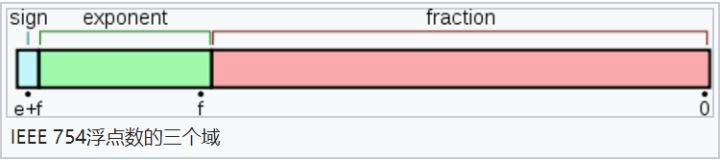

## 数据类型

### JavaScript有哪些数据类型，它们的区别？

> JavaScript共有八种数据类型，分别是 Undefined、Null、Boolean、Number、String、Object、Symbol、BigInt。
>
> 
>
> 其中 Symbol 和 BigInt 是ES6 中新增的数据类型：
>
> - Symbol 代表创建后独一无二且不可变的数据类型，它主要是为了解决可能出现的全局变量冲突的问题。
> - BigInt 是一种数字类型的数据，它可以表示任意精度格式的整数，使用 BigInt 可以安全地存储和操作大整数，即使这个数已经超出了 Number 能够表示的安全整数范围。
>
> 
>
> 这些数据可以分为原始（基本）数据类型和引用数据类型：
>
> - 栈：原始数据类型（Undefined、Null、Boolean、Number、String、Symbol、BigInt）
> - 堆：引用数据类型（对象、数组和函数）
>
> 
>
> 两种类型的区别在于**存储位置的不同：**
>
> - 基本数据类型直接存储在栈（stack）中的简单数据段，占据空间小、大小固定，属于被频繁使用数据，所以放入栈中存储；
> - 引用数据类型存储在堆（heap）中的对象，占据空间大、大小不固定。如果存储在栈中，将会影响程序运行的性能；引用数据类型在栈中存储了指针，这个指针指向堆中该实体的起始地址。当解释器寻找引用值时，会首先检索其在栈中的地址，取得地址后从堆中获得实体。
>
> 
>
> 堆和栈的概念存在于数据结构和操作系统内存中，在数据结构中：
>
> - 在数据结构中，栈中数据的存取方式为先进后出。
> - 堆是一个优先队列，是按优先级来进行排序的，优先级可以按照大小来规定。
>
> 
>
> 在操作系统中，内存被分为栈区和堆区：
>
> - 栈区内存由编译器自动分配释放，存放函数的参数值，局部变量的值等。其操作方式类似于数据结构中的栈。 
> - 堆区内存一般由开发者分配释放，若开发者不释放，程序结束时可能由垃圾回收机制回收。

### 深拷贝和浅拷贝

> 浅拷贝只复制指向某个对象的指针，而不复制对象本身，新旧对象还是共享同一块内存。
>
> 深拷贝会另外创造一个一模一样的对象，新对象跟原对象不共享内存，修改新对象不会改到原对象。
>
> * 当我们把一个对象赋值给一个新的变量时，赋的其实是该对象的在栈中的地址，而不是堆中的数据。也就是两个对象指向的是同一个存储空间，无论哪个对象发生改变，其实都是改变的存储空间的内容，因此，两个对象是联动的。
> * 浅拷贝是按位拷贝对象，它会创建一个新对象，这个对象有着原始对象属性值的一份精确拷贝。
>   * 如果属性是`基本类型`，拷贝的就是基本类型的值；
>   * 如果属性是内存地址（`引用类型`），拷贝的就是内存地址 ，因此如果其中一个对象改变了这个地址，就会影响到另一个对象。即默认拷贝构造函数只是对对象进行浅拷贝复制(逐个成员依次拷贝)，即只复制对象空间而不复制资源。
>
> #### 浅拷贝实现方式
>
> * Object.assign()   注意：当object只有一层的时候，是深拷贝
> * Array.prototype.concat()
> * Array.prototype.slice

### typeof 和 instanceof的区别

> `typeof`与`instanceof`都是判断数据类型的方法，区别如下：
>
> - `typeof`会返回一个变量的基本类型，`instanceof`返回的是一个布尔值
> - `instanceof` 可以准确地判断复杂引用数据类型，但是不能正确判断基础数据类型
> - 而` typeof` 也存在弊端，它虽然可以判断基础数据类型（`null` 除外），但是引用数据类型中，除了` function` 类型以外，其他的也无法判断
>
> 可以看到，上述两种方法都有弊端，并不能满足所有场景的需求
>
> 如果需要通用检测数据类型，可以采用`Object.prototype.toString`，调用该方法，统一返回格式`“[object Xxx]” `的字符串
>
> 如下

### 数据类型检测的方式有哪些

> **（1）typeof**
>
> ```javascript
> console.log(typeof 2);               // number
> console.log(typeof true);            // boolean
> console.log(typeof 'str');           // string
> console.log(typeof []);              // object    
> console.log(typeof function(){});    // function
> console.log(typeof {});              // object
> console.log(typeof undefined);       // undefined
> console.log(typeof null);            // object
> ```
>
> 其中数组、对象、null都会被判断为object，其他判断都正确。
>
> 
>
> **（2）instanceof**
>
> `instanceof`可以正确判断对象的类型，其内部运行机制是**判断在其原型链中能否找到该类型的原型**。
>
> ```javascript
> console.log(2 instanceof Number);                    // false
> console.log(true instanceof Boolean);                // false 
> console.log('str' instanceof String);                // false 
>  
> console.log([] instanceof Array);                    // true
> console.log(function(){} instanceof Function);       // true
> console.log({} instanceof Object);                   // true
> ```
>
> 可以看到，`instanceof`**只能正确判断引用数据类型**，而不能判断基本数据类型。`instanceof` 运算符可以用来测试一个对象在其原型链中是否存在一个构造函数的 `prototype` 属性。
>
> 
>
> **（3） constructor**
>
> ```javascript
> console.log((2).constructor === Number); // true
> console.log((true).constructor === Boolean); // true
> console.log(('str').constructor === String); // true
> console.log(([]).constructor === Array); // true
> console.log((function() {}).constructor === Function); // true
> console.log(({}).constructor === Object); // true
> ```
>
> `constructor`有两个作用，一是判断数据的类型，二是对象实例通过 `constrcutor` 对象访问它的构造函数。需要注意，如果创建一个对象来改变它的原型，`constructor`就不能用来判断数据类型了：
>
> ```javascript
> function Fn(){};
>  
> Fn.prototype = new Array();
>  
> var f = new Fn();
>  
> console.log(f.constructor===Fn);    // false
> console.log(f.constructor===Array); // true
> ```
>
> **（4）Object.prototype.toString.call()**
>
> `Object.prototype.toString.call()` 使用 Object 对象的原型方法 toString 来判断数据类型：
>
> ```javascript
> var a = Object.prototype.toString;
>  
> console.log(a.call(2));  			// [object Number]
> console.log(a.call(true));  		// [object Boolean]
> console.log(a.call('str'));  		// [object String]
> console.log(a.call([]));     		// [object Array]
> console.log(a.call(function(){}));  // [object Function]
> console.log(a.call({}));          	// [object Object]
> console.log(a.call(undefined));     // [object Undefined]
> console.log(a.call(null));  		// [object Null]
> ```
>
> 同样是检测对象obj调用toString方法，obj.toString()的结果和Object.prototype.toString.call(obj)的结果不一样，这是为什么？
>
> 
>
> 这是因为toString是Object的原型方法，而Array、function等**类型作为Object的实例，都重写了toString方法**。不同的对象类型调用toString方法时，根据原型链的知识，调用的是对应的重写之后的toString方法（function类型返回内容为函数体的字符串，Array类型返回元素组成的字符串…），而不会去调用Object上原型toString方法（返回对象的具体类型），所以采用obj.toString()不能得到其对象类型，只能将obj转换为字符串类型；因此，在想要得到对象的具体类型时，应该调用Object原型上的toString方法。

### 判断数组的方式有哪些

> ```js
> obj = [0, 1, 2];
> ```
>

> * 通过Object.prototype.toString.call()做判断
>
> ```js
> Object.prototype.toString.call(obj).slice(8,-1) === 'Array';
> ```
>
> * 静态方法 Object.getPrototypeOf做判断
>
> ```js
> let arr = [];
> console.log(Object.getPrototypeOf(arr) === Array.prototype); // true
> ```
>
> * 通过原型链做判断
>
> ```js
> obj.__proto__ === Array.prototype;
> ```
>
> * 通过ES6的Array.isArray()做判断
>
> ```js
> Array.isArrray(obj);
> ```
>
> * 通过instanceof做判断
>
> ```js
> obj instanceof Array
> ```
>
> * 通过Array.prototype.isPrototypeOf
>
> ```js
> Array.prototype.isPrototypeOf(obj)
> ```

### null和undefined区别

> 首先 Undefined 和 Null 都是基本数据类型，这两个基本数据类型分别都只有一个值，就是 undefined 和 null。
>
> undefined 代表的含义是**未定义**，null 代表的含义是**空对象**。一般变量声明了但还没有定义的时候会返回 undefined，null主要用于赋值给一些可能会返回对象的变量，作为初始化。
>
> **undefined表示"缺少值"，未定义，就是此处应该有一个值，但是还没有定义。**
>
> > （1）变量被声明了，但没有赋值时，就等于undefined。
> >
> > （2) 调用函数时，应该提供的参数没有提供，该参数等于undefined。
> >
> > （3）对象没有赋值的属性，该属性的值为undefined。
> >
> > （4）函数没有返回值时，默认返回undefined。
>
> **null表示"没有对象"，即该处不应该有值。**典型用法是：
>
> > （1） 作为函数的参数，表示该函数的参数不是对象。
> >
> > （2） 作为对象原型链的终点。
> >
> > 赋值给一些可能会返回对象的变量，作为初始化。
>
> 
>
> undefined 在 JavaScript 中不是一个保留字，这意味着可以使用 undefined 来作为一个变量名，但是这样的做法是非常危险的，它会影响对 undefined 值的判断。我们可以通过一些方法获得安全的 undefined 值，比如说 void 0。
>
> 
>
> 当对这两种类型使用 typeof 进行判断时，Null 类型化会返回 “object”，Undefined返回'undefined'，这是一个历史遗留的问题。

### typeof null 的结果是什么，为什么？

> typeof null 的结果是Object。
>
> 在 JavaScript 第一个版本中，所有值都存储在 32 位的单元中，每个单元包含一个小的 **`类型标签`(1-3 bits)** 以及当前要存储值的真实数据。类型标签存储在每个单元的低位中，共有五种数据类型：
>
> ```javascript
> 000: object   - 当前存储的数据指向一个对象。
>   1: int      - 当前存储的数据是一个 31 位的有符号整数。
> 010: double   - 当前存储的数据指向一个双精度的浮点数。
> 100: string   - 当前存储的数据指向一个字符串。
> 110: boolean  - 当前存储的数据是布尔值。
> ```
>
> 如果最低位是 1，则类型标签标志位的长度只有一位；如果最低位是 0，则类型标签标志位的长度占三位，为存储其他四种数据类型提供了额外两个 bit 的长度。
>
> 
>
> 有两种特殊数据类型：
>
> - undefined的值是 (-2)30(-2的30次方)(一个超出整数范围的数字)；
> - null 的值是机器码 NULL 指针(null 指针的值全是 0)
>
> 
>
> 那也就是说null的类型标签也是000，和Object的类型标签一样，所以会被判定为Object。

### intanceof 操作符的实现原理及实现


> instanceof 运算符用于判断构造函数的 prototype 属性是否出现在对象实例的原型链中的任何位置。
>
> **实现原理**就是只要右边变量的 prototype 在左边变量的原型链上即可
>
> `getPrototypeof`方法返回参数对象的原型，这是获取原型对象的标准方法
>
> 实例对象的`__proto__`属性返回该对象的原型，该属性可读写。	
>
> ```js
> function myInstanceof(left, right) {
>        // 获取对象的原型
>        let proto = Object.getPrototypeOf(left)   //还可以写成 proto = left.__proto__;
>        // 获取构造函数的 prototype 对象
>        let prototype = right.prototype; 
>  
>        // 判断构造函数的 prototype 对象是否在对象的原型链上
>        while (true) {
>            if (!proto) return false;
>            if (proto === prototype) return true;
>            // 如果没有找到，就继续从其原型上找，Object.getPrototypeOf方法用来获取指定对象的原型
>            proto = Object.getPrototypeOf(proto);
>        }
> }
> ```

### 为什么0.1+0.2 ! == 0.3，如何让其相等  

> ```js
> let n1 = 0.1, n2 = 0.2
> console.log(n1 + n2)  // 0.30000000000000004
> ```
>
> 这里得到的不是想要的结果，要想等于0.3，就要把它进行转化：
>
> ```js
> (n1 + n2).toFixed(1) // 注意oFixed()方法先将一个数转为指定位数的小数，然后返回这个小数对应的字符串。
> ```
>
> `题外话`：
>
> 由于浮点数的原因，小数`5`的四舍五入是不确定的，使用的时候必须小心。
>
> ```
> (10.055).toFixed(2) // 10.05
> (10.005).toFixed(2) // 10.01
> ```
>
> 计算机是通过二进制的方式存储数据的，所以计算机计算0.1+0.2的时候，实际上是计算的两个数的二进制的和。0.1的二进制是`0.0001100110011001100...`（1100循环），0.2的二进制是：`0.00110011001100...`（1100循环），这两个数的二进制都是无限循环的数。那JavaScript是如何处理无限循环的二进制小数呢？
>
> 一般我们认为数字包括整数和小数，但是在 JavaScript 中只有一种数字类型：Number，它的实现遵循`IEEE 754`标准，使用64位固定长度来表示，也就是标准的double双精度浮点数。在二进制科学表示法中，双精度浮点数的小数部分最多只能保留`52`位，再加上前面的`1`，其实就是保留`53`位有效数字，剩余的需要舍去，遵从“0舍1入”的原则。
>
> 根据这个原则，0.1和0.2的二进制数相加，再转化为十进制数就是：`0.30000000000000004`。
>
> > **`Number.MAX_SAFE_INTEGER`** 常量表示在 JavaScript 中最大的安全整数（maxinum safe integer)（`2^53 - 1）。`
>
> 下面看一下**双精度数是如何保存**的：
>
> 
>
> - 第一部分（蓝色）：用来存储符号位（sign），用来区分正负数，0表示正数，占用1位
> - 第二部分（绿色）：用来存储指数（exponent），占用11位
> - 第三部分（红色）：用来存储小数（fraction），占用52位
>
> 
>
> 对于0.1，它的二进制为：
>
> ```js
> 0.00011001100110011001100110011001100110011001100110011001 10011...
> ```
>
> 转为科学计数法（科学计数法的结果就是浮点数）：
>
> ```js
> 1.1001100110011001100110011001100110011001100110011001*2^-4
> ```
>
> 可以看出0.1的符号位为0，指数位为-4，小数位为：
>
> ```js
> 1001100110011001100110011001100110011001100110011001
> ```
>
> 那么问题又来了，指数位是负数，该如何保存呢？
>
> 
>
> IEEE标准规定了一个偏移量，对于指数部分，每次都加这个偏移量进行保存，这样即使指数是负数，那么加上这个偏移量也就是正数了。由于JavaScript的数字是双精度数，这里就以双精度数为例，它的指数部分为11位，能表示的范围就是0~2047，IEEE固定双精度数的偏移量为1023。
>
> 
>
> ●当指数位不全是0也不全是1时(规格化的数值)，IEEE规定，阶码计算公式为 e-Bias。 此时e最小值是1，则1-1023= -1022，e最大值是2046，则2046-1023=1023，可以看到，这种情况下取值范围是-1022~1013。
>
> ●当指数位全部是0的时候(非规格化的数值)，IEEE规定，阶码的计算公式为1-Bias，即1-1023= -1022。
>
> ●当指数位全部是1的时候(特殊值)，IEEE规定这个浮点数可用来表示3个特殊值，分别是正无穷，负无穷，NaN。 具体的，小数位不为0的时候表示NaN；小数位为0时，当符号位s=0时表示正无穷，s=1时候表示负无穷。
>
> 对于上面的0.1的指数位为-4，-4+1023 = 1019 转化为二进制就是：1111111011.
>
> 所以，0.1表示为：
>
> ```
> 0 1111111011 1001100110011001100110011001100110011001100110011001
> ```
>
> 说了这么多，是时候该最开始的问题了，如何实现0.1+0.2=0.3呢？
>
> 对于这个问题，一个直接的`解决方法`就是设置一个`误差范围`，通常称为“`机器精度`”。对JavaScript来说，这个值通常为2-52，在ES6中，提供了`Number.EPSILON`属性，而它的值就是2-52，只要判断`0.1+0.2-0.3`是否小于`Number.EPSILON`，如果小于，就可以判断为0.1+0.2 ===0.3
>
> > ps：`Number.EPSILON`实际上是 JavaScript 能够表示的最小精度。误差如果小于这个值，就可以认为已经没有意义了，即不存在误差了。 Number.EPSILON === Math.pow(2, -52);
>
> ```js
> function numberepsilon(arg1,arg2){                   
>   return Math.abs(arg1 - arg2) < Number.EPSILON;        
> }        
> 
> console.log(numberepsilon(0.1 + 0.2, 0.3)); // true
> ```

### == 操作符的强制类型转换规则？

> 对于 `==` 来说，如果对比双方的类型**不一样**，就会进行**类型转换**。假如对比 `x` 和 `y` 是否相同，就会进行如下判断流程：
>
> 1. 首先会判断两者类型是否**相同，**相同的话就比较两者的大小；
> 2. 类型不相同的话，就会进行类型转换；
> 3. 会先判断是否在对比 `null` 和 `undefined`，是的话就会返回 `true `  console.log(null == undefined) -- true
> 4. 判断两者类型是否为 `string` 和 `number`，是的话就会将字符串转换为 `number`
>
> ```javascript
> 1 == '1'
>       ↓
> 1 ==  1
> ```
>
> 5. 判断其中一方是否为 `boolean`，是的话就会把 `boolean` 转为 `number` 再进行判断
>
> ```javascript
> '1' == true
>         ↓
> '1' ==  1
>         ↓
>  1  ==  1
> ```
>
> 6. 判断其中一方是否为 `object` 且另一方为 `string`、`number` 或者 `symbol`，是的话就会把 `object` 转为原始类型再进行判断
>
> ```javascript
> '1' == { name: 'js' }
>         ↓
> '1' == '[object Object]'
> ```
>
> 其流程图如下：
>
> 

### Object.is() 与比较操作符 `“===”、` `“==”` 的区别？

> https://segmentfault.com/a/1190000016411254

> - 使用双等号（==）进行相等判断时，如果两边的类型不一致，则会进行强制类型转化后再进行比较。
> - 使用三等号（===）进行相等判断时，如果两边的类型不一致时，不会做强制类型准换，直接返回 false。
> - 使用 Object.is 来进行相等判断时，一般情况下和三等号的判断相同，它处理了一些特殊的情况，比如 -0 和 +0 不再相等，两个 NaN 是相等的。
> - 与[`===` 运算也不相同。 `===` 运算符 (也包括 `==` 运算符) 将数字 `-0` 和 `+0` 视为相等 ，而将[`Number.NaN`](https://developer.mozilla.org/zh-CN/docs/Web/JavaScript/Reference/Global_Objects/Number/NaN) 与[`NaN`](https://developer.mozilla.org/zh-CN/docs/Web/JavaScript/Reference/Global_Objects/NaN)视为不相等.

> `Object.is()` 方法判断两个值是否为[同一个值](https://developer.mozilla.org/zh-CN/docs/Web/JavaScript/Equality_comparisons_and_sameness)。如果满足以下条件则两个值相等:
>
> - 都是 [`undefined`](https://developer.mozilla.org/zh-CN/docs/Web/JavaScript/Reference/Global_Objects/undefined)
> - 都是 [`null`](https://developer.mozilla.org/zh-CN/docs/Web/JavaScript/Reference/Global_Objects/null)
> - 都是 `true` 或 `false`
> - 都是相同长度的字符串且相同字符按相同顺序排列
> - 都是相同对象（意味着每个对象有同一个引用）
> - 都是数字且  
>   - 都是 `+0`
>   - 都是 `-0`
>   - 都是 [`NaN`](https://developer.mozilla.org/zh-CN/docs/Web/JavaScript/Reference/Global_Objects/NaN)
>   - 或都是非零而且非 [`NaN`](https://developer.mozilla.org/zh-CN/docs/Web/JavaScript/Reference/Global_Objects/NaN) 且为同一个值

### [Map和ForEach的区别](https://blog.fundebug.com/2018/02/05/map_vs_foreach/)

> https://blog.fundebug.com/2018/02/05/map_vs_foreach/
>
> #### 定义
>
> - `forEach()`: 针对每一个元素执行提供的函数
> - `map()`: 创建一个新的数组，其中每一个元素由调用数组中的每一个元素执行提供的函数得来
>
> > 1. `forEach`是不会返回有意义的值的。
> > 2. `forEach()`的执行速度比`map()`慢 - 原因暂不明，但 for 循环肯定是最快的
> > 3. 因为`forEach()`会改变原始的数组的值，而`map()`会返回一个全新的数组，原本的数组不受到影响。
> > 4. `forEach`适合于你并不打算改变数据的时候，而只是想用数据做一些事情 – 比如存入数据库或则打印出来。
> > 5. `map()`适用于你要改变数据值的时候。不仅仅在于它更快，而且返回一个新的数组。这样的优点在于你可以使用复合(composition)(map(), filter(), reduce()等组合使用)来玩出更多的花样。
> > 6. 能用`forEach()`做到的，`map()`同样可以。反过来也是如此。
> > 7. `map()`会分配内存空间存储新数组并返回，`forEach()`不会返回数据。
> > 8. `forEach()`允许`callback`更改原始数组的元素。`map()`返回新的数组。

### jS遍历方法

> 参考链接：https://blog.csdn.net/weixin_45416189/article/details/123241559
>
> **数组**
>
> | 方法                        | 是否改变原数组 | 是否有返回值 | 特点                                                         |
> | --------------------------- | -------------- | ------------ | ------------------------------------------------------------ |
> | forEach()                   | 否             | 没有返回值   |                                                              |
> | map()                       | 否             | 有           | 可链式调用                                                   |
> | for of                      | 否             | 无           | for…of遍历具有Iterator迭代器的对象的属性，返回的是数组的元素、对象的属性值，不能遍历普通的obj对象，将异步循环变成同步循环 |
> | filter()                    | 否             | 有           | 过滤数组，返回包含符合条件的元素的数组，可链式调用           |
> | every(）、some()            | 否             | 有           | some()只要有一个是true，便返回true；而every()只要有一个是false，便返回false. |
> | find()、findIndex()         | 否             | 有           | find()返回的是第一个符合条件的值；findIndex()返回的是第一个返回条件的值的索引值 |
> | reduce()、reduceRight()     | 否             | 有           | reduce()对数组正序操作；reduceRight()对数组逆序操作          |
> | keys()、values()、entries() | 否             | 无           | keys() 返回数组的索引值；values() 返回数组元素；entries() 返回数组的键值对。 |
>
> **对象遍历方法**
>
> | 对象方法                            | 遍历基本属性 | 遍历原型链 | 遍历不可枚举属性 | 遍历Symbol |
> | ----------------------------------- | ------------ | ---------- | ---------------- | ---------- |
> | for in                              | 是           | 是         | 否               | 否         |
> | Object.keys() 、Values()、entries() | 是           | 否         | 否               | 否         |
> | Object.getOwnPropertyNames()        | 是           | 否         | 是               | 否         |
> | Object.getOwnPropertySymbols()      | 否           | 否         | 是               | 是         |
> | Object.getOwnPropertySymbols()      | 是           | 否         | 是               | 是         |
> | for while do/while循环              |              |            |                  |            |
> | for await of                        |              |            |                  |            |
>
> 
>
> 


## ES6

### let、const、var的区别

> **（1）块级作用域：**块作用域由 `{ }`包括，let和const具有块级作用域，var不存在块级作用域。块级作用域解决了ES5中的两个问题：
>
> - 内层变量可能覆盖外层变量  
> - 用来计数的循环变量泄露为全局变量
>
> **（2）变量提升：**var存在变量提升，let和const不存在变量提升，即在变量只能在声明之后使用，否在会报错。
>
> **（3）给全局添加属性：**浏览器的全局对象是window，Node的全局对象是global。var声明的变量为全局变量，并且会将该变量添加为全局对象的属性，但是let和const不会。
>
> **（4）重复声明：**var声明变量时，可以重复声明变量，后声明的同名变量会覆盖之前声明的变量。const和let不允许重复声明变量。
>
> **（5）暂时性死区：**在使用let、const命令声明变量之前，该变量都是不可用的。这在语法上，称为**暂时性死区**。使用var声明的变量不存在暂时性死区。
>
> **（6）初始值设置：**在变量声明时，var 和 let 可以不用设置初始值。而const声明变量必须设置初始值。
>
> **（7）指针指向：**let和const都是ES6新增的用于创建变量的语法。 let创建的变量是可以更改指针指向（可以重新赋值）。但const声明的变量是不允许改变指针的指向。ps：：对象是引用类型的，const定义的对象t中保存的是指向对象t的指针，这里的“不变”指的是指向对象的**指针**不变，而修改对象中的属性并不会让指向对象的指针发生变化
>
> | **区别**           | **var** | **let** | **const** |
> | ------------------ | ------- | ------- | --------- |
> | 是否有块级作用域   | ×       | ✔️       | ✔️         |
> | 是否存在变量提升   | ✔️       | ×       | ×         |
> | 是否添加全局属性   | ✔️       | ×       | ×         |
> | 能否重复声明变量   | ✔️       | ×       | ×         |
> | 是否存在暂时性死区 | ×       | ✔️       | ✔️         |
> | 是否必须设置初始值 | ×       | ×       | ✔️         |
> | 能否改变指针指向   | ✔️       | ✔️       | ×         |

### 箭头函数与普通函数的区别

> **（1）箭头函数比普通函数更加简洁**
>
> - 如果没有参数，就直接写一个空括号即可
> - 如果只有一个参数，可以省去参数的括号
> - 如果有多个参数，用逗号分割
> - 如果函数体的返回值只有一句，可以省略大括号
> - 如果函数体不需要返回值，且只有一句话，可以给这个语句前面加一个void关键字。最常见的就是调用一个函数：
>
> ```javascript
> let fn = () => void doesNotReturn();
> ```
>
> **（2）箭头函数没有自己的this**
>
> 箭头函数不会创建自己的this， 所以它没有自己的this，它只会在自己作用域的上一层继承this。所以箭头函数中this的指向在它在定义时已经确定了，之后不会改变。
>
> **（3）箭头函数继承来的this指向永远不会改变**
>
> ```javascript
> var id = 'GLOBAL';
> var obj = {
>   id: 'OBJ',
>   a: function(){
>     console.log(this.id);
>   },
>   b: () => {
>     console.log(this.id);
>   }
> };
> obj.a();    // 'OBJ'
> obj.b();    // 'GLOBAL'
> new obj.a()  // undefined
> new obj.b()  // Uncaught TypeError: obj.b is not a constructor
> ```
>
> 对象obj的方法b是使用箭头函数定义的，这个函数中的this就永远指向它定义时所处的全局执行环境中的this，即便这个函数是作为对象obj的方法调用，this依旧指向Window对象。需要注意，`定义对象的大括号`{}`是无法形成一个单独的执行环境的，它依旧是处于全局执行环境中`。
>
> **（4）call()、apply()、bind()等方法不能改变箭头函数中this的指向**
>
> ```javascript
> var id = 'Global';
> let fun1 = () => {
>     console.log(this.id)
> };
> fun1();                     // 'Global'
> fun1.call({id: 'Obj'});     // 'Global'
> fun1.apply({id: 'Obj'});    // 'Global'
> fun1.bind({id: 'Obj'})();   // 'Global'
> ```
>
> **（5）箭头函数不能作为构造函数使用**
>
> 构造函数在new的步骤在上面已经说过了，实际上第二步就是将函数中的this指向该对象。 但是由于箭头函数时没有自己的this的，且this指向外层的执行环境，且不能改变指向，所以不能当做构造函数使用。
>
> **（6）箭头函数没有自己的arguments**
>
> 箭头函数没有自己的arguments对象。在箭头函数中访问arguments实际上获得的是它外层函数的arguments值。
>
> **（7）箭头函数没有prototype**
>
> **（8）箭头函数不能用作Generator函数，不能使用yeild关键字**

## JS基础

### js定义函数的几种方式

> **1 使用函数声明的形式定义函数 -- 具有优先级，优先将function关键字定义的函数优先执行**
>
> ​	function fn() {}
>
> **2 使用函数表达式的形式定义函数（即将匿名函数复制给变量）**-**必须等到解析器执行到它所在的代码行才能真正被解释执行。**
>
> ​	var fn = function() {}
>
> **3 箭头函数**
>
> **4 使用new Function构造函数定义函数**
>
> **函数声明和函数表达式的区别：**
>
> * 函数声明形式定义的函数，函数一旦声明，允许任意调用（在函数定义前、函数定义后、函数内部，可以在任意位置调用）
>
> * 使用函数表达式、new Function构造函数定义的函数，不能在函数定义前使用
> * 也就是说，**JavaScript解释器中存在一种变量声明被提升的机制，也就是说`函数声明`会被提升到作用域的最前面，即使写代码的时候是写在最后面，也还是会被提升至最前面。而用`函数表达式`创建的函数是在运行时进行赋值，且要等到表达式赋值完成后才能调用**
>
> **经典例题**
>
> ```js
> getName(); // '数声明'
> var getName = function() {
>     console.log('函数表达式');
> }
> getName(); // '数表达式'
> function getName() {
>     console.log('函数声明');
> }
> getName(); // '数表达式'
> ```
>
> 翻译成下面就是：
>
> ```js
> var getName // 变量被提升，此时为undefined
>                 
> getName() // '函数声明' 函数被提升 这里受函数声明的影响，虽然函数声明在最后可以被提升到最前面了
> var getName = function() {
>     console.log('函数表达式');
> } // 函数表达式此时才开始覆盖函数声明的定义
> getName() // '函数表达式'
> function getName() {
>     console.log('函数声明');
> }
> getName() // '函数表达式' 这里就执行了函数表达式的值
> ```
>
> 

### ps:arguments详解

> **定义**
>
> 由于 JavaScript 允许函数有不定数目的参数，所以需要一种机制，可以在函数体内部读取所有参数。这就是`arguments`对象的由来。
>
> `arguments`对象包含了函数运行时的所有参数，`arguments[0]`就是第一个参数，`arguments[1]`就是第二个参数，以此类推。这个对象只有在函数体内部，才可以使用。

### new操作符的实现原理

> **new操作符的执行过程：**
>
> （1）首先创建了一个新的空对象，作为将要返回的实例														
>
> （2）继承构造函数的原型
>
> （3）将这个空对象赋值给构造函数内部的this关键字，执行构造函数的代码（为这个新对象添加属性）
>
> （4）判断函数的返回值`result`类型，如果返回结果是对象，就直接返回，否则返回newObject对象
>
> （对4中的理解：这话的意思是，如果构造函数中使用了return语句并返回了一个对象，那么myNew函数就会返回该对象；否则，myNew函数会返回一个新创建的对象。这是因为在JavaScript中，使用new操作符创建对象时，如果构造函数中使用了return语句并返回了一个对象，那么该对象就会作为new操作符的返回值；否则，new操作符会返回一个新创建的对象。）

> 具体实现：
>
> ```js
> function _new(/* 构造函数 */ constructor, /* 构造函数参数 */ params) {
>        //将arguments对象转为数组
>        var args = [].slice.call(arguments);
>        //取出构造函数
>        var constructor = args.shift();
>        //创建一个空对象，继承构造函数的原型（ptptotype属性）：creat指定原型对象(第一个参数)和属性（余后参数），返回一个新的对象
>        var newObject = Object.create(constructor.prototype);
>        //将构造函数的this指向新建对象，并传入参数，（执行构造函数 args是一个数组，它将作为参数传递给constructor）
>        var result = constructor.apply(newObject, args);
>        //如果构造函数返回了一个对象，就直接返回，否则返回newObject对象
>        return result instanceof Object ? result : newObject;
> }
> 
> function Person(name, age) {
>        this.name = name;
>        this.age = age;
> }
> let actor = _new(Person, 'zs', 22);
> console.log(actor);
> ```
>
> ps:
>
> 忘了使用`new`命令，直接调用构造函数会发生什么事？
>
> ```js
> var Vehicle = function (){
>       this.price = 1000;
> };
> 
> var v = Vehicle();
> v // undefined
> price // 1000
> ```
>
> 变量`v`变成了`undefined`，而`price`属性变成了全局变量。
>
> 为了保证构造函数必须与`new`命令一起使用，解决办法：
>
> 1. 构造函数内部使用严格模式，即第一行加上`use strict`。
>
> 2. 构造函数内部判断是否使用`new`命令，如果发现没有使用，则直接返回一个实例对象。
>
>    ```js
>    var Vehicle = function (){
>      if (!(this instanceof Vehicle)) {
>        return new Vehicle();
>      }
>      this.price = 1000;
>    };
>    ```
>
>    

### 数组有哪些原生方法？

> - 数组和字符串的`转换方法`：toString()、toLocalString()、join() 其中 join() 方法可以指定转换为字符串时的分隔符。如果不提供参数，默认用逗号分隔。
> - 数组`尾部操作`的方法 pop() 和 push()，push 方法可以传入多个参数。 `改变原数组`
> - 数组`首部操作`的方法 shift() 和 unshift()  `改变原数组`
> - `重排序`的方法 reverse() 和 sort()，sort() 方法可以传入一个函数来进行比较，传入前后两个值，如果返回值为正数，则交换两个参数的位置。                                  `改变原数组`
> - `数组连接`的方法 concat() ，返回的是拼接好的数组，`不影响原数组`。
> - `数组截取`办法 slice()，用于截取数组中的一部分返回，`不影响原数组`。
> - `数组插入`方法 splice()，删除原数组的一部分成员，并可以在删除的位置添加新的数组成员，返回值是被删除的元素。`改变原数组`
> - `查找特定项`的索引的方法，
>   - indexOf() :返回给定元素在数组中第一次出现的位置，如果没有出现则返回`-1`,第二个参数，表示搜索的开始位置
>   - lastIndexOf() :返回给定元素在数组中最后一次出现的位置，如果没有出现则返回`-1`
>   - 他们两个不能搜索NaN的位置：内部用===比较
> - `迭代方法` every()、some()、filter()、map() 和 forEach() 方法
> - `数组归并方法` reduce() 和 reduceRight() 方法
>
> ps:
>
> * LocaleString()会根据你机器的本地环境来返回字符串，它和toString()返回的值在不同的本地环境下使用的符号会有微妙的变化。
> * `reverse`方法用于颠倒排列数组元素，返回改变后的数组。注意，该方法将`改变原数组`。
> * `sort`方法对数组成员进行排序，默认是按照字典顺序排序。排序后，`原数组将被改变`
> * every()、some()：它们接受一个函数作为参数，所有数组成员依次执行该函数。该函数接受三个参数：当前成员、当前位置和整个数组，然后返回一个布尔值，`some`方法是只要一个成员的返回值是`true`，则整个`some`方法的返回值就是`true`，否则返回`false`。
> * `map()`方法将数组的所有成员依次传入参数函数，然后把每一次的执行结果组成一个新数组返回。第二个参数，用来绑定回调函数内部的`this`变量。
> * `forEach()`方法与`map()`方法很相似，也是对数组的所有成员依次执行参数函数。但是，`forEach()`方法不返回值，只用来操作数据。这就是说，如果数组遍历的目的是为了得到返回值，那么使用`map()`方法，否则使用`forEach()`方法。`forEach()`方法无法中断执行，总是会将所有成员遍历完。 他们`不会跳过`undefined`和`null`，但会跳过空位。
> * `reduce()`方法和`reduceRight()`方法依次处理数组的每个成员，最终累计为一个值。它们的差别是，`reduce()`是从左到右处理（从第一个成员到最后一个成员），`reduceRight()`则是从右到左（从最后一个成员到第一个成员），其他完全一样。

#### sort()方法原理

> `sort`方法对数组成员进行排序，默认是按照字典顺序排序，即按照ascii码进行排序，它会先将数组里的元素全部转为字符串(不影响原值)，方便比较。排序后，原数组将被改变。
>
> ```js
> [11, 101].sort()
> // [101, 11]
> 
> [10111, 1101, 111].sort()
> // [10111, 1101, 111]  // 按照字典顺序排序
> ```
>
> ```js
> let arr = [0, 1, 2]
> arr.sort((a, b) => {
>     console.log("a:" + a);
>     console.log("b:" + b);
>     return 1
> })
> 打印出来的值是：
>    a:1
> b:0
>    a:2
> b:1
> ```
>
> 即：a的值范围是`[arr[1],arr[arr.length-1]]`,b范围是`[arr[0],arr[arr.length-2]`
>
> 小技巧：数组反序的方法：return -1；递增方法：a - b 递减：b - a
>
> `sort排序原理：`不同引擎对js的sort方法解析可能存在差异，在v8引擎中，对sort方法提供了2种排序算法：插入排序及快排序。当数组长度小于等于10的时候，采用`插入排序`，大于10的时候，采用`快排`。对于长度大于1000的数组，采用的是`快排与插入排序混合`的方式进行排序的，因为，当数据量很小的时候，插入排序效率优于快排。快排的平均时间复杂度是nlogn
>
> 

### 什么是 DOM 和 BOM？

> - DOM 是 JavaScript 操作网页的接口，全称为“文档对象模型”（Document Object Model）。它的作用是将网页转为一个 JavaScript 对象，从而可以用脚本进行各种操作（比如增删内容）。
>
> - 浏览器会根据 DOM 模型，将结构化文档（比如 HTML 和 XML）解析成一系列的节点，再由这些节点组成一个树状结构（DOM Tree）。所有的节点和最终的树状结构，都有规范的对外接口。
>
> - DOM 只是一个接口规范，可以用各种语言实现。所以严格地说，DOM 不是 JavaScript 语法的一部分，但是 DOM 操作是  JavaScript 最常见的任务，离开了 DOM，JavaScript 就无法控制网页。另一方面，JavaScript 也是最常用于 DOM  操作的语言。后面介绍的就是 JavaScript 对 DOM 标准的实现和用法
>
> - `节点：`DOM 的最小组成单位叫做节点（node）。文档的树形结构（DOM 树），就是由各种不同类型的节点组成。每个节点可以看作是文档树的一片叶子。
>
> - 节点的类型有七种。
>
>   - `Document`：整个文档树的顶层节点
>   - `DocumentType`：`doctype`标签（比如`<!DOCTYPE html>`）
>   - `Element`：网页的各种HTML标签（比如`<body>`、`<a>`等）
>   - `Attr`：网页元素的属性（比如`class="right"`）
>   - `Text`：标签之间或标签包含的文本
>   - `Comment`：注释
>   - `DocumentFragment`：文档的片段
>
> - 浏览器提供一个原生的节点对象`Node`，上面这七种节点都继承了`Node`，因此具有一些共同的属性和方法。
>
> - `节点树：`一个文档的`所有节点`，按照所在的`层级`，可以抽象成一种`树状结构`。这种树状结构就是 DOM 树。它有一个`顶层节点`，`下一层`都是顶层节点的子节点，然后`子节点`又有自己的子节点，就这样层层衍生出一个金字塔结构，又像一棵树。
>
>   浏览器原生提供`document`节点，代表整个文档。
>
> - BOM 指的是浏览器对象模型，它指的是把浏览器当做一个对象来对待，这个对象主要定义了与浏览器进行交互的方法和接口。BOM的核心是 window，而 window 对象具有双重角色，它既是通过 js 访问浏览器窗口的一个接口，又是一个 Global（全局）对象。这意味着在网页中定义的任何对象，变量和函数，都作为全局对象的一个属性或者方法存在。window 对象含有 location 对象、navigator 对象、screen 对象等子对象，并且 DOM 的最根本的对象 `document` 对象也是 BOM 的 window 对象的子对象。

### 常见的DOM操作有哪些

> #### 1）DOM 节点的获取
>
> DOM 节点的获取的API及使用：
>
> ```js
> getElementById // 按照 id 查询 ,注意！！！这个Element不加's'
> getElementsByTagName // 按照标签名查询
> getElementsByClassName // 按照类名查询
> querySelectorAll // 按照 css 选择器查询
> 
> // 按照 id 查询
> var imooc = document.getElementById('imooc') // 查询到 id 为 imooc 的元素
> // 按照标签名查询
> var pList = document.getElementsByTagName('p')  // 查询到标签为 p 的集合
> console.log(divList.length)
> console.log(divList[0])
> // 按照类名查询
> var moocList = document.getElementsByClassName('mooc') // 查询到类名为 mooc 的集合
> // 按照 css 选择器查询
> var pList = document.querySelectorAll('.mooc') // 查询到类名为 mooc 的集合
> ```
>
> #### 2）DOM 节点的创建
>
> **创建一个新节点，并把它添加到指定节点的后面。**已知的 HTML 结构如下：
>
> ```html
> <html>
>   <head>
>     <title>DEMO</title>
>   </head>
>   <body>
>     <div id="container"> 
>       <h1 id="title">我是标题</h1>
>     </div>   
>   </body>
> </html>
> ```
>
> 要求添加一个有内容的 span 节点到 id 为 title 的节点后面，做法就是：
>
> ```js
> // 首先获取父节点
> var container = document.getElementById('container')
> // 创建新节点
> var targetSpan = document.createElement('span')
> // 设置 span 节点的内容
> targetSpan.innerHTML = 'hello world'
> // 把新创建的元素塞进父节点里去
> container.appendChild(targetSpan)
> ```
>
> #### 3）DOM 节点的删除
>
> **删除指定的 DOM 节点，**已知的 HTML 结构如下：
>
> ```html
> <html>
>   <head>
>     <title>DEMO</title>
>   </head>
>   <body>
>     <div id="container"> 
>       <h1 id="title">我是标题</h1>
>     </div>   
>   </body>
> </html>
> ```
>
> 需要删除 id 为 title 的元素，做法是：
>
> ```js
> // 获取目标元素的父元素
> var container = document.getElementById('container')
> // 获取目标元素
> var targetNode = document.getElementById('title')
> // 删除目标元素
> container.removeChild(targetNode)
> ```
>
> 或者通过子节点数组来完成删除：
>
> ```js
> // 获取目标元素的父元素
> var container = document.getElementById('container')
> // 获取目标元素
> var targetNode = container.childNodes[1]
> // 删除目标元素
> container.removeChild(targetNode)
> ```
>
> #### 4）修改 DOM 元素
>
> 修改 DOM 元素这个动作可以分很多维度，比如说移动 DOM 元素的位置，修改 DOM 元素的属性等。
>
> 
>
> **将指定的两个 DOM 元素交换位置，**已知的 HTML 结构如下：
>
> ```html
> <html>
>   <head>
>     <title>DEMO</title>
>   </head>
>   <body>
>     <div id="container"> 
>       <h1 id="title">我是标题</h1>
>       <p id="content">我是内容</p>
>     </div>   
>   </body>
> </html>
> ```
>
> 现在需要调换 title 和 content 的位置，可以考虑 insertBefore 或者 appendChild：
>
> ```js
> // 获取父元素
> var container = document.getElementById('container')   
>  
> // 获取两个需要被交换的元素
> var title = document.getElementById('title')
> var content = document.getElementById('content')
> // 交换两个元素，把 content 置于 title 前面
> container.insertBefore(content, title)
> ```

### 对类数组对象的理解，如何转化为数组

> 一个拥有 `length属性`和`若干索引属性`的对象就可以被称为类数组对象，类数组对象和数组类似，但是不能调用数组的方法。常见的类数组对象有 `arguments` 和 `DOM 方法的返回结果`，`函数参数`也可以被看作是类数组对象，因为它含有 length属性值，代表可接收的参数个数。
>
> 常见的类数组转换为数组的方法有这样几种：
>
> ```js
> var arrayLike = {
>        0: 'Java',
>        1: 'Python',
>        2: 'Scala',
>        length: 3
> }
> ```
>
> - 通过 `call` 调用数组的 `slice` 方法来实现转换
>
> ```js
> Array.prototype.slice.call(arrayLike); // slice()没有参数，实际上等于返回一个原数组的拷贝。
> ```
>
> - 通过 `call` 调用数组的 `splice` 方法来实现转换
>
> ```js
> Array.prototype.splice.call(arrayLike, 0);  // 删除的起始位置
> ```
>
> * 通过 `apply` 调用数组的 `concat` 方法来实现转换
>
> ```js
> Array.prototype.concat.apply([], arrayLike); 
> ```
>
> * 通过 Array.from 方法来实现转换
>
> ```js
> Array.from(arrayLike);
> ```
>
> ps:`Array.from()` 方法对一个类似数组或可迭代对象创建一个新的，浅拷贝的数组实例。
>
> ps:
>
> ```js
> var arr = Array.prototype.slice.call(arrayLike);
> ```
>
> 理解：第一， arrayLike本来是没有 `slice` 方法的， `Array.prototype.slice.call(arrayLike)` 这个表达式相当于赋予 `arrayLike`这个对象 `slice` 方法。
>
> 第二， `Array.prototype.slice.call(arrayLike);` 相当于 `Array.prototype.slice.call(arrayLike, 0);` 是把取一个数组（或者类数组）的子集，并作为一个数组返回。所以当后面的作用对象是一个类数组时，就会把这个类数组对象转换为了一个新的数组。
>
> 上面代码等同于：
>
> ```js
> arrayLike.slice = Array.prototype.slice;
> arrayLike.slice();
> ```

### 对AJAX的理解，实现一个AJAX请求

> AJAX是 Asynchronous JavaScript and XML 的缩写，指的是通过 JavaScript 的 异步通信，从服务器获取 XML 文档从中提取数据，再更新当前网页的对应部分，而不用刷新整个网页。
>
> 通俗的理解：在网页中利用 XMLHttpRequest 对象和服务器进行数据交互的方式，就是Ajax。
>
> 创建AJAX请求的步骤：
>
> - **创建一个 XMLHttpRequest 对象。**
> - 在这个对象上**使用 open 方法创建一个 HTTP 请求**，open 方法所需要的参数是请求的方法、请求的地址、是否异步和用户的认证信息。
> - 在发起请求前，可以为这个对象**`添加一些信息`和`监听函数`**。比如说可以通过 setRequestHeader 方法来为请求添加头信息。还可以为这个对象添加一个状态监听函数。一个 XMLHttpRequest 对象一共有 5 个状态，当它的状态变化时会触发onreadystatechange 事件，可以通过设置监听函数，来处理请求成功后的结果。当对象的 readyState 变为 4 的时候，代表服务器返回的数据接收完成，这个时候可以通过判断请求的状态，如果状态是 2xx 或者 304 的话则代表返回正常。这个时候就可以通过 response 中的数据来对页面进行更新了。
> - 当对象的属性和监听函数设置完成后，最后调**用 send 方法来向服务器发起请求**，可以传入参数作为发送的数据体。
>
> ps:readyState:
>
> - 0 表示未初始化，尚未调用open()方法
> - 1 启动，已经调用open()方法，还未调用send()
> - 2 发送，已经调用send()方法，但未收到响应
> - 3 接收，收到部分响应
> - 4 完成，已经收到全部的响应数据，且可以在客户端使用了
>
> ```js
> const SERVER_URL = "/server";
> // 创建XMLHttpRequest对象
> let xhr = new XMLHttpRequest();
> // 创建 Http 请求
> xhr.open("GET", url, true);
> // 设置状态监听函数
> xhr.onreadystatechange = function() {
>   if (xhr.readyState !== 4) return;
>   // 当请求成功时
>   if (xhr.status >= 200 && xhr.status < 300) {
>     handle(xhr.response);
>   } else {
>     console.error(xhr.statusText);
>   }
> };
> // 设置请求失败时的监听函数
> xhr.onerror = function() {
>   console.error(this.statusText);
> };
> // 设置请求头信息：请求类型，请求头
> xhr.responseType = "json";
> xhr.setRequestHeader("Accept", "application/json");
> // 发送 Http 请求
> xhr.send(null);
> ```
>
> 使用Promise封装AJAX：
>
> ```js
> // promise 封装实现：
> function getJSON(url) {
>   // 创建一个 promise 对象
>   let promise = new Promise(function(resolve, reject) {
>     let xhr = new XMLHttpRequest();
>     // 新建一个 http 请求
>     xhr.open("GET", url, true);
>     // 设置状态的监听函数
>     xhr.onreadystatechange = function() {
>       if (xhr.readyState !== 4) return;
>       // 当请求成功或失败时，改变 promise 的状态
>       if (xhr.status >= 200 && xhr.status < 300) {
>         resolve(xhr.response);
>       } else {
>         reject(new Error(xhr.statusText));
>       }
>     };
>     // 设置错误监听函数
>     xhr.onerror = function() {
>       reject(new Error(xhr.statusText));
>     };	
>     // 设置响应的数据类型
>     xhr.responseType = "json";
>     // 设置请求头信息
>     xhr.setRequestHeader("Accept", "application/json");
>     // 发送 http 请求
>     xhr.send(null);
>   });
>   return promise;
> }
> ```

### JavaScript为什么要进行变量提升，它导致了什么问题？

> 变量提升的表现是，无论在函数中何处位置声明的变量，好像都被提升到了函数的首部，可以在变量声明前访问到而不会报错。
>
> 造成变量声明提升的**本质原因**是 js 引擎在代码`执行前`有一个`解析`的过程，创建了执行上下文，初始化了一些代码执行时需要用到的对象。当访问一个变量时，会到当前执行上下文中的作用域链中去查找，而作用域链的首端指向的是当前执行上下文的变量对象，这个变量对象是执行上下文的一个属性，它包含了函数的形参、所有的函数和变量声明，这个对象的是在代码解析的时候创建的。
>
> 
>
> 首先要知道，JS在拿到一个变量或者一个函数的时候，会有两步操作，即解析和执行(执行上下文环境的步骤）。
>
> - **在`解析`阶段**，JS会检查语法，并对函数进行`预编译`。`解析`的时候会先创建一个`全局执行上下文环境`，先把代码中即将执行的变量、函数声明都拿出来，变量先赋值为undefined，函数先声明好可使用。在一个`函数执行之前`，也会创建一个`函数执行上下文环境`，跟全局执行上下文类似，不过函数执行上下文会多出`this`、`arguments和函数的参数`。
>
> - - 全局上下文：变量定义，函数声明
>   - 函数上下文：变量定义，函数声明，this，arguments,函数的参数
>
> - **在`执行`阶段**，就是按照代码的顺序依次执行。
>
> 
>
> 那为什么会进行变量提升呢？主要有以下两个原因：
>
> - 提高性能
> - 容错性更好
>
> 
>
> **（1）提高性能**
>
> 在JS代码执行之`前`，会进行`语法检查和预编译`，并且这一操作只进行一次。这么做（指变量提升）就是为了提高性能，如果没有这一步，那么每次执行代码前都必须重新解析一遍该变量（函数），而这是没有必要的，因为变量（函数）的代码并不会改变，解析一遍就够了。
>
> 
>
> 在解析的过程中，还会为函数生成`预编译代码`。在预编译时，会统计声明了哪些变量、创建了哪些函数，并对函数的代码进行压缩，去除注释、不必要的空白等。这样做的好处就是每次执行函数时都可以直接为该函数分配栈空间（不需要再解析一遍去获取代码中声明了哪些变量，创建了哪些函数），并且因为代码压缩的原因，代码执行也更快了。
>
> **（2）容错性更好**
>
> 变量提升可以在一定程度上提高JS的容错性，看下面的代码：
>
> ```js
> a = 1;
> var a;
> console.log(a);
> ```
>
> 如果没有变量提升，这两行代码就会报错，但是因为有了变量提升，这段代码就可以正常执行。
>
> 虽然，在可以开发过程中，可以完全避免这样写，但是有时代码很复杂的时候。可能因为疏忽而先使用后定义了，这样也不会影响正常使用。由于变量提升的存在，而会正常运行。
>
> **总结：**
>
> - 解析和预编译过程中的声明提升可以提高性能，让函数可以在执行时预先为变量分配栈空间
> - 声明提升还可以提高JS代码的容错性，使一些不规范的代码也可以正常执行
>
> 变量提升虽然有一些优点，但是他也会造成一定的问题，在ES6中提出了let、const来定义变量，它们就没有变量提升的机制。下面看一下变量提升可能会导致的问题：
>
> ```js
> var tmp = new Date();
> 
> function fn(){
> 	console.log(tmp);
> 	if(false){
> 		var tmp = 'hello world';
> 	}
> }
> 
> fn();  // undefined
> ```
>
> 在这个函数中，原本是要打印出外层的tmp变量，但是因为变量提升的问题，内层定义的tmp被提到函数内部的最顶部，相当于覆盖了外层的tmp，所以打印结果为undefined。
>
> ```js
> var tmp = 'hello world';
> 
> for (var i = 0; i < tmp.length; i++) {
> 	console.log(tmp[i]);
> }
> 
> console.log(i); // 11
> ```
>
> 由于遍历时定义的i会变量提升成为一个全局变量，在函数结束之后不会被销毁，所以打印出来11。

## 原型与原型链

### 对原型、原型链的理解

> 在JavaScript中是使用构造函数来新建一个对象的，每一个构造函数的内部都有一个` prototype `属性：它的属性值是一个对象，这个对象包含了可以由该构造函数的所有实例共享的属性和方法。
>
> 当使用构造函数新建一个实例对象后，在这个实例对象的内部将包含一个指针，这个指针指向构造函数的 prototype 属性对应的值，在 ES5 中这个指针被称为`对象的原型`。 --'proto'
>
> 一般来说不应该能够获取到这个值的，但是现在浏览器中都实现了 __proto__ 属性来访问这个属性，但是最好不要使用这个属性，因为它不是规范中规定的。ES5 中新增了一个 Object.getPrototypeOf() 方法，可以通过这个方法来获取对象的原型。
>
> 
>
> 当访问一个对象的属性时，如果这个对象内部不存在这个属性，那么它就会去它的原型对象里找这个属性，这个原型对象又会有自己的原型，于是就这样一直找下去，也就是`原型链`的概念。依此类推一直找到 Object 为止（null）， 所以这就是新建的对象为什么能够使用 toString() 等方法的原因。
>
> 
>
> **特点：**JavaScript 对象是通过引用来传递的，创建的每个新对象实体中并没有一份属于自己的原型副本。当修改原型时，与之相关的对象也会继承这一改变。
>
> 

### 原型链指向

> ```js
> p.__proto__  // Person.prototype
> Person.prototype.__proto__  // Object.prototype
> p.__proto__.__proto__ //Object.prototype
> p.__proto__.constructor.prototype.__proto__ // Object.prototype
> Person.prototype.constructor.prototype.__proto__ // Object.prototype
> p1.__proto__.constructor // Person
> Person.prototype.constructor  // Person
> ```
>
> 

## 执行上下文|作用域|闭包

### 对闭包的理解

> **闭包是指有权访问另一个函数作用域中变量的函数**，创建闭包的最常见的方式就是在一个函数内创建另一个函数，创建的函数可以访问到当前函数的局部变量。
>
> > **稍全面的回答**： 在js中变量的作用域属于函数作用域, 在函数执行完后,作用域就会被清理,内存也会随之被回收,但是由于闭包函数是建立在函数内部的子函数, 由于其可访问上级作用域,即使上级函数执行完, 作用域也不会随之销毁, 这时的子函数(也就是闭包),便拥有了访问上级作用域中变量的权限,即使上级函数执行完后作用域内的值也不会被销毁。
> >
> > **闭包的特性**：
> >
> > - 1、内部函数可以访问定义他们外部函数的参数和变量。(作用域链的向上查找，把外围的作用域中的变量值存储在内存中而不是在函数调用完毕后销毁)设计私有的方法和变量，避免全局变量的污染。
> >
> >   1.1.闭包是密闭的容器，，类似于set、map容器，存储数据的
> >
> >   1.2.闭包是一个对象，存放数据的格式为 key-value 形式
> >
> > - 2、函数嵌套函数
> >
> > - 3、本质是将函数内部和外部连接起来。优点是可以读取函数内部的变量，让这些变量的值始终保存在内存中，不会在函数被调用之后自动清除
> >
> > **闭包形成的条件**：
> >
> > 1. 函数的嵌套
> > 2. 内部函数引用外部函数的局部变量，延长外部函数的变量生命周期
> >
> > **闭包的用途**：
> >
> > 1. 模仿块级作用域
> > 2. 保护外部函数的变量 能够访问函数定义时所在的词法作用域(阻止其被回收)
> > 3. 封装私有化变量
> > 4. 创建模块
> >
> > **闭包应用场景**
> >
> > 闭包的两个场景，闭包的两大作用：`保存/保护`。 在开发中, 其实我们随处可见闭包的身影, 大部分前端JavaScript 代码都是“事件驱动”的,即一个事件绑定的回调方法; 发送ajax请求成功|失败的回调;setTimeout的延时回调;或者一个函数内部返回另一个匿名函数,这些都是闭包的应用。
> >
> > **闭包的优点**：延长局部变量的生命周期
> >
> > **闭包缺点**：会导致函数的变量一直保存在内存中，过多的闭包可能会导致内存泄漏
>
> 闭包有两个常用的用途；
>
> - 闭包的第一个用途是使我们在`函数外部`能够访问到`函数内部`的变量。通过使用闭包，可以通过在外部调用闭包函数，从而在外部访问到函数内部的变量，可以使用这种方法来创建私有变量。
> - 闭包的另一个用途是使已经运行结束的函数上下文中的变量对象继续留在内存中，因为闭包函数保留了这个变量对象的引用，所以这个变量对象不会被回收。
>
> 
>
> 比如，函数 A 内部有一个函数 B，函数 B 可以访问到函数 A 中的变量，那么函数 B 就是闭包。
>
> ```js
> function A() {
>   let a = 1
>   window.B = function () {
>       console.log(a)
>   }
> }
> A()
> B() // 1
> ```
>
> 在 JS 中，闭包存在的意义就是让我们可以`间接访问函数内部的变量`。
>
> `经典面试题`：循环中使用闭包解决 var 定义函数的问题
>
> ```js
> for (var i = 1; i <= 5; i++) {
>   setTimeout(function timer() {
>     console.log(i)
>   }, i * 1000)
> }
> ```
>
> 首先因为 `setTimeout` 是个异步函数，所以会先把循环全部执行完毕，这时候 `i` 就是 6 了，所以会输出一堆 6。解决办法有三种：
>
> - 第一种是使用闭包的方式
>
> ```js
> for (var i = 1; i <= 5; i++) {
>   ;(function(j) {                 //写完代码之后要进行代码压缩 就要整合到一行代码上面,为了预防 我们需要在自执行前面加上一个 分号
>     setTimeout(function timer() {
>       console.log(j)
>     }, j * 1000)
>   })(i)
> }
> ```
>
> 在上述代码中，首先使用了立即执行函数将 `i` 传入函数内部，这个时候值就被固定在了参数 `j` 上面不会改变，当下次执行 `timer` 这个闭包的时候，就可以使用外部函数的变量 `j`，从而达到目的。
>
> - 第二种就是使用 `setTimeout` 的第三个参数，这个参数会被当成 `timer` 函数的参数传入。
>
> ```js
> for (var i = 1; i <= 5; i++) {
>   setTimeout(
>     function timer(j) {
>       console.log(j)
>     },
>     i * 1000,
>     i
>   )
> }
> ```
>
> - 第三种就是使用 `let` 定义 `i` 来解决问题了，这个也是`最为推荐`的方式
>
> ```js
> for (let i = 1; i <= 5; i++) {
>   setTimeout(function timer() {
>     console.log(i)
>   }, i * 1000)
> }
> ```
>
> 

### 对作用域、作用域链的理解

> ##### 1）全局作用域和函数作用域
>
> （1）全局作用域
>
> - `最外层函数`和最外层函数`外面定义的变量`拥有全局作用域
> - 所有`未定义直接赋值`的变量自动声明为全局作用域
> - 所有`window对象的属性`拥有全局作用域
> - 全局作用域有很大的弊端，过多的全局作用域变量会污染全局命名空间，容易引起命名冲突。
>
> （2）函数作用域，又称为局部作用域
>
> - 函数作用域`声明在函数内部的变量`，一般只有固定的代码片段可以访问到
> - 作用域是`分层`的，内层作用域可以访问外层作用域，反之不行
>
> ##### 2）块级作用域
>
> - 使用ES6中新增的`let`和`const`指令可以声明块级作用域，块级作用域可以在`函数中`创建，也可以在`一个代码块`中的创建（由`{ }`包裹的代码片段）
> - let和const声明的变量不会有变量提升，也不可以重复声明
> - 在循环中比较适合绑定块级作用域，这样就可以把声明的计数器变量限制在循环内部。
>
> 
>
> **作用域链：**
>
> 在当前作用域中查找所需变量，但是该作用域没有这个变量，那这个变量就是自由变量。如果在自己作用域找不到该变量就去父级作用域查找，依次向上级作用域查找，直到访问到window对象就被终止，这一层层的关系就是作用域链。
>
> **作用域链的作用**是保证执行环境里有权访问的变量和函数是**有序的**，作用域链的变量**只能向上访问**，变量访问到 window 对象即被终止，作用域链向下访问变量是不被允许的。
>
> 作用域链的本质上是一个指向变量对象的指针列表。变量对象是一个包含了执行环境中所有变量和函数的对象。作用域链的前端始终都是当前执行上下文的变量对象。全局执行上下文的变量对象（也就是全局对象）始终是作用域链的最后一个对象。
>
> 当查找一个变量时，如果当前执行环境中没有找到，可以沿着作用域链向后查找。
>
> **原型链和作用域链的区别**
>
> 原型链：原型链作用在`构造函数`上，原型链操作的是构造函数的属性：实例属性和原型属性；
>
> 作用域链：作用域链作用域`普通函数`上，操作的是全局变量和局部变量。
>
> 作用域链是相对于变量而言， 原型是相对于属性而言
>
> 作用域最顶层是window ，原型链最顶层是Object

### 对执行上下文的理解

Execution Context

Execution Context stack(ECS)

> javaScript 引擎不是一行行执行的，而是一段段执行的。当执行一段代码的时候，会进行一个 **“准备工作”**，比如`变量提升或函数提升`，这个“准备工作”就是**构建执行上下文**。JavaScript 引擎创建执行上下文栈(ECS)来管理执行上下文。
>
> 执行上下文是一个对象，由js的执行引擎创建，具有三个属性：**变量对象(variable object)**，**作用域链(scope chain)**，**this指针**。

> ##### 1. 执行上下文类型
>
> **（1）`全局`执行上下文**
>
> 任何不在函数内部的都是全局执行上下文，它首先会创建一个全局的`window`对象，并且设置`this`的值等于这个全局对象，一个程序中`只有一个`全局执行上下文。
>
> **（2）`函数`执行上下文**
>
> 当一个`函数被调用`时，就会为该函数创建一个新的执行上下文，函数的上下文可以有任意`多个`。
>
> **（3）**`eval`**函数执行上下文**
>
> 执行在`eval函数`中的代码会有属于他`自己`的执行上下文，不过eval函数不常使用，不做介绍。
>
> ##### 2. 执行上下文栈
>
> - JavaScript引擎使用执行上下文栈来管理执行上下文
> - 当JavaScript执行代码时，首先遇到全局代码，会创建一个全局执行上下文并且压入`执行栈`中，每当遇到一个函数调用，就会为该函数创建一个新的执行上下文并`压入栈顶`，引擎会执行位于执行上下文栈顶的函数，当函数执行完成之后，执行上下文从栈中弹出，继续执行下一个上下文。当所有的代码都执行完毕之后，从栈中弹出全局执行上下文。
>
> ```javascript
> let a = 'Hello World!';
> function first() {
>     console.log('Inside first function');
>     second();
>     console.log('Again inside first function');
> }
> function second() {
>     console.log('Inside second function');
> }
> first();
> //执行顺序
> //先执行second(),再执行first()
> ```
>
> ##### 3. 创建执行上下文
>
> 创建执行上下文有两个阶段：**创建阶段**和**执行阶段**，回收阶段
>
> https://blog.fundebug.com/2019/03/20/understand-javascript-context-and-stack/
>
> **1）创建阶段**
>
> （1）this绑定
>
> - 在全局执行上下文中，this指向全局对象（window对象）
> - 在函数执行上下文中，this指向取决于函数如何调用。如果它被一个引用对象调用，那么 this 会被设置成那个对象，否则 this 的值被设置为全局对象或者 undefined
>
> （2）创建词法环境组件
>
> - 词法环境是一种有**标识符——变量映射**的数据结构，标识符是指变量/函数名，变量是对实际对象或原始数据的引用。
> - 词法环境的内部有两个组件：**加粗样式**：环境记录器:用来储存变量个函数声明的实际位置**外部环境的引用**：可以访问父级作用域
>
> （3）创建变量环境组件
>
> - 变量环境也是一个词法环境，其环境记录器持有变量声明语句在执行上下文中创建的绑定关系。
>
> **2）执行阶段**
>
> 此阶段会完成对变量的分配，最后执行完代码。
>
> **简单来说执行上下文就是指：**
>
> 在执行一点JS代码之前，需要先解析代码。解析的时候会先创建一个全局执行上下文环境，先把代码中即将执行的变量、函数声明都拿出来，变量先赋值为undefined，函数先声明好可使用。这一步执行完了，才开始正式的执行程序。
>
> 在一个函数执行之前，也会创建一个函数执行上下文环境，跟全局执行上下文类似，不过函数执行上下文会多出this、arguments和函数的参数。
>
> - 全局上下文：变量定义，函数声明
> - 函数上下文：变量定义，函数声明，`this`，`arguments`

## this/call/apply/bind

### 对this对象的理解

> this 是执行上下文中的一个属性，它指向最后一次调用这个方法的对象。在实际开发中，this 的指向可以通过四种调用模式来判断。
>
> > ps：
> >
> > **普通函数中的this**：
> >
> > 在标准函数中，this引用的是把函数当成方法调用的上下文对象，这时候通常称其为this值（在网页的全局上下文中调用函数时，this指向window）。
> >
> > 这个this值到底引用哪个对象，必须到函数被调用的时候才能确定，因此这个值在代码执行过程中可能会变。
> >
> > 箭头函数中的this：
> >
> > 在箭头函数中，this引用的是定义箭头函数的上下文，this指针一旦确定，不能改变。也可以说this值取决于该函数外部非箭头函数的this值，且不能通过`call(), apply(), bind()` 方法来改变this值。
>
> 执行上下文 3 个重要的属性:变量对象(Variable Object，VO)  作用域链(Scope Chain)  this
>
> - 第一种是**函数调用模式**，当一个函数不是一个对象的属性时，直接作为函数来调用时，this 指向全局对象。
>   - ps:如果使用严格模式，那么全局对象无法使用默认绑定， `this` 绑定至 `undefined` 并抛错
> - 第二种是**方法调用模式**，如果一个函数作为一个对象的方法来调用时，this 指向这个对象。
> - 第三种是**构造器调用模式**，如果一个函数用 new 调用时，函数执行前会新创建一个对象，this 指向这个新创建的对象。
> - 第四种是 **apply 、 call 和 bind 调用模式**，这三个方法都可以显示的指定调用函数的 this 指向。其中 apply 方法接收两个参数：一个是 this 绑定的对象，一个是参数数组。call 方法接收的参数，第一个是 this 绑定的对象，后面的其余参数是传入函数执行的参数。也就是说，在使用 call() 方法时，传递给函数的参数必须逐个列举出来。**`bind()`** 方法创建一个新的函数，在 `bind()` 被调用时，这个新函数的 `this` 被指定为 `bind()` 的第一个参数，而其余参数将作为新函数的参数，供调用时使用。这个函数的 this 指向除了使用 new 时会被改变，其他情况下都不会改变。
> - 箭头函数 箭头函数的`this`绑定看的是`this所在函数定义在哪个对象下`，就绑定哪个对象。如果有嵌套的情况，则this绑定到最近的一层对象上。
>
> 
>
> 这四种方式，使用`构造器调用模式`的优先级最高，然后是` apply、call 和 bind` 调用模式，然后是`方法调用`模式，然后是`函数调用`模式。

### call() 和 apply() 的区别？

> 它们的作用一模一样，区别仅在于传入参数的形式的不同。
>
> - apply 接受两个参数，第一个参数指定了函数体内 this 对象的指向，第二个参数为一个带下标的集合，这个集合可以为数组，也可以为类数组，apply 方法把这个集合中的元素作为参数传递给被调用的函数。
> - call 传入的参数数量不固定，跟 apply 相同的是，第一个参数也是代表函数体内的 this 指向，从第二个参数开始往后，每个参数被依次传入函数。

> #### call、apply、bind三者的异同
>
> - 共同点 : 都可以改变this指向
> - 不同点:
>   - call 和 apply  会调用函数, 并且改变函数内部this指向.
>   - call 和 apply传递的参数不一样,call传递参数使用逗号隔开,apply使用数组/类数组传递
>   - bind  不会调用函数, 可以改变函数内部this指向.
>   - `bind` 方法与 `call / apply` 最大的不同就是前者返回一个绑定上下文的**函数**，而后两者是**直接执行**了函数。
>
>
> - 应用场景
>   1. call 经常做继承. 
>   2. apply经常跟数组有关系.  比如借助于数学对象实现数组最大值最小值
>   3. bind  不调用函数,但是还想改变this指向. 比如改变定时器内部的this指向. 
>   
>   
>


### 实现call、apply 及 bind 函数

> 实现以下效果：
>
> ```js
> let person = {
>        name: 'y'
> }
> function say(age) {
>        console.log(this.name, age);
> }
> say.myCall(person, 11); // y 11
> say.myApply(person, [22]); // y 11
> let sayPerson = say.bind(person, 33);
> sayPerson(); // y 33
> ```

> **（1）call 函数的实现步骤：**
>
> - 判断调用对象是否为函数，即使是定义在函数的原型上的，但是可能出现使用 call 等方式调用的情况。
> - 判断传入上下文对象是否存在，如果不存在，则设置为 window 。
> - 处理传入的参数，截取第一个参数后的所有参数。
> - 将函数作为上下文对象的一个属性。
> - 使用上下文对象来调用这个方法，并保存返回结果。
> - 删除刚才新增的属性。
> - 返回结果。
>
> ```js
> Function.prototype.myCall = function(context) {
>     // 1.判断调用对象是否为函数，非函数则error
>     if (typeof this !== 'function') {
>         console.error('type error');
>     }
>     // 2.判断传入上下文对象是否存在，否则设为window
>     context = context || window;
>     // 3.将函数作为上下文对象的一个属性。
>     context.fn = this;
>     // 4.处理传入的参数，截取第一个参数（即将绑定对象）后的所有参数。
>     let args = [...arguments].slice(1);
>     // 5.使用上下文对象来调用这个方法，并保存返回结果
>     let result = context.fn(...args);
>     // 6.删除刚才新增的属性。
>     delete context.fn;
>     // 7.返回结果
>     return result;
> }
> ```
>
> **（2）apply 函数的实现步骤：**
>
> - 判断调用对象是否为函数，即使是定义在函数的原型上的，但是可能出现使用 call 等方式调用的情况。
> - 判断传入上下文对象是否存在，如果不存在，则设置为 window 。
> - 将函数作为上下文对象的一个属性。
> - 判断参数值是否传入
> - 使用上下文对象来调用这个方法，并保存返回结果。
> - 删除刚才新增的属性
> - 返回结果
>
> ```js
> Function.prototype.myApply = function(context) {
>     // 1.判断调用对象是否为函数，非函数则error
>     if (typeof this !== 'function') {
>         throw new TypeError('Error');
>     }
>     // 2.判断传入上下文对象是否存在，否则设为window
>     context = context || window;
>     // 3.将函数作为上下文对象的一个属性。
>     context.fn = this;
>     // 4.处理传入的参数：判断值是否传入
>     // 5.使用上下文对象来调用这个方法，并保存返回结果
>     let res = null;
>     if (arguments[1]) {
>         res = context.fn(...arguments[1]);
>     } else {
>         res = context.fn();
>     }
>     // 6.删除刚才新增的属性。
>     delete context.fn;
>     // 7.返回结果
>     return res;
> }
> ```
>
> **（3）bind 函数的实现步骤：**
>
> - 判断调用对象是否为函数，即使是定义在函数的原型上的，但是可能出现使用 call 等方式调用的情况。
> - 保存当前函数的引用，获取其余传入参数值。
> - 创建一个函数返回
> - 函数内部使用 apply 来绑定函数调用，需要判断函数作为构造函数的情况，这个时候需要传入当前函数的 this 给 apply 调用，其余情况都传入指定的上下文对象。
> - ps：解释一下函数作为构造函数的情况：原函数使用bind()方法绑定函数之后，原函数可以作为构造函数使用。
> - `绑定函数自动适应于使用 new 操作符去构造一个由目标函数创建的新实例。当一个绑定函数是用来构建一个值的，原来提供的 this 就会被忽略` --- MDN
>
> ```js
> Function.prototype.myBind = function(context) {
>     // 1.判断调用对象是否为函数，非函数则error
>     if (typeof this !== 'function') {
>         throw new TypeError('error');
>     }
>     // 2.保存当前函数的引用，获取其余传入参数值。
>     let args = Array.prototype.slice.call(arguments, 1)
>     let fn = this;
>     // 3.创建一个函数返回
>     // 4.函数内部使用 apply 来绑定函数调用，需要判断函数作为构造函数的情况，这个时候需要传入当前函数的 this 给 apply 调用，其余情况都传入指定的上下文对象。
>     return function Fn() {
>         return fn.apply(
>             this instanceof Fn ? this : context,
>             args.concat(...arguments)
>         )
>     }
> }
> ```
>
> ps:总的来说bind有如下三个功能点：
>
> `bind` 有如下特性：
>
> - 1、指定 `this`
> - 2、传入参数
> - 3、返回一个函数
> - 4、柯里化
> - 一个绑定函数也能使用 new 操作符创建对象：这种行为就像把原函数当成构造器，提供的 this 值被忽略，同时调用时的参数被提供给模拟函数。
>
> - 输入：接受一个或者多个参数，第一个是要绑定的上下文，额外参数当作绑定函数的前置参数。
> - 输出：返回原函数的拷贝，即返回一个函数，这个函数呢具备原函数的功能
>
> ### 补充：柯里化
>
> 在计算机科学中，柯里化（Currying）是把接受多个参数的函数变换成接受一个单一参数(最初函数的第一个参数)的函数，并且返回接受余下的参数且返回结果的新函数的技术。这个技术由 Christopher Strachey 以逻辑学家 Haskell Curry 命名的，尽管它是 Moses Schnfinkel 和 Gottlob Frege 发明的。
>
> ```js
> var add = function(x) {
>     return function(y) {
>        return x + y;
>     };
> };
> 
> var increment = add(1);
> var addTen = add(10);
> 
> increment(2);
> // 3
> 
> addTen(2);
> // 12
> 
> add(1)(2);
> // 3
> ```
>
> 这里定义了一个 `add` 函数，它接受一个参数并返回一个新的函数。调用 `add` 之后，返回的函数就通过闭包的方式记住了 `add` 的第一个参数。所以说 `bind` 本身也是闭包的一种使用场景。
>
> **柯里化**是将 `f(a,b,c)` 可以被以 `f(a)(b)(c)` 的形式被调用的转化。JavaScript 实现版本通常保留函数被正常调用和在参数数量不够的情况下返回偏函数这两个特性。

### 对Promise的理解

> ### 对Promise的理解
>
> Promise是异步编程的一种解决方案，它是一个对象，可以获取异步操作的消息，他的出现大大改善了异步编程的困境，避免了地狱回调，它比传统的解决方案回调函数和事件更合理和更强大。
>
> 所谓Promise，简单，说就是一个容器，里面保存着某个未来才会结束的事件（通常是一个异步操作）的结果。从语法上说，Promise 是一个对象，从它可以获取异步操作的消息。Promise 提供统一的 API，各种异步操作都可以用同样的方法进行处理。
>
> （1）Promise的实例有**三个状态**:
>
> - Pending（进行中）
> - Resolved（已完成）
> - Rejected（已拒绝）
>
> 当把一件事情交给promise时，它的状态就是Pending，任务完成了状态就变成了Resolved、没有完成失败了就变成了Rejected。
>
> （2）Promise的实例有**两个过程**：
>
> - pending -> fulfilled : Resolved（已完成）
> - pending -> rejected：Rejected（已拒绝）
>
> 注意：一旦从进行状态变成为其他状态就永远不能更改状态了。
>
> **Promise的特点：**
>
> - 对象的状态不受外界影响。promise对象代表一个异步操作，有三种状态，`pending`（进行中）、`fulfilled`（已成功）、`rejected`（已失败）。只有异步操作的结果，可以决定当前是哪一种状态，任何其他操作都无法改变这个状态，这也是promise这个名字的由来——“**承诺**”；
> - 一旦状态改变就不会再变，任何时候都可以得到这个结果。promise对象的状态改变，只有两种可能：从`pending`变为`fulfilled`，从`pending`变为`rejected`。这时就称为`resolved`（已定型）。如果改变已经发生了，你再对promise对象添加回调函数，也会立即得到这个结果。这与事件（event）完全不同，事件的特点是：如果你错过了它，再去监听是得不到结果的。
>
> **Promise的缺点：**
>
> - 无法取消Promise，一旦新建它就会立即执行，无法中途取消。
> - 如果不设置回调函数，Promise内部抛出的错误，不会反应到外部。
> - 当处于pending状态时，无法得知目前进展到哪一个阶段（刚刚开始还是即将完成）。
>
> **总结：**
>
> Promise 对象是异步编程的一种解决方案，最早由社区提出。Promise 是一个构造函数，接收一个函数作为参数，返回一个 Promise 实例。一个 Promise 实例有三种状态，分别是pending、resolved 和 rejected，分别代表了进行中、已成功和已失败。实例的状态只能由 pending 转变 resolved 或者rejected 状态，并且状态一经改变，就凝固了，无法再被改变了。
>
> 状态的改变是通过 resolve() 和 reject() 函数来实现的，可以在异步操作结束后调用这两个函数改变 Promise 实例的状态，它的原型上定义了一个 then 方法，使用这个 then 方法可以为两个状态的改变注册回调函数。这个回调函数属于微任务，会在本轮事件循环的末尾执行。
>
> **注意：**在构造 `Promise` 的时候，构造函数内部的代码是立即执行的

### Promise的基本用法

> #### （1）创建Promise对象
>
> Promise对象代表一个异步操作，有三种状态：pending（进行中）、fulfilled（已成功）和rejected（已失败）。
>
> Promise构造函数接受一个函数作为参数，该函数的两个参数分别是`resolve`和`reject`。
>
> ```js
> const promise = new Promise(function(resolve, reject) {
>     // ... some code
>     if (/* 异步操作成功 */){
>         resolve(value);
> 	} else {
>         reject(error);
> 	}
> });
> ```
>
> **一般情况下都会使用**`new Promise()`**来创建promise对象，但是也可以使用**`Promise.resolve`**和** `Promise.reject`**这两个方法：**
>
> - **Promise.resolve**
>
> `Promise.resolve(value)`的返回值也是一个promise对象，可以对返回值进行.then调用，代码如下：
>
> ps: Promise.resolve(value):如果传入的参数value为 `非Promise`类型的对象, 则返回的结果为成功promise对象;如果传入的参数为 `Promise` 对象, 则`参数的结果决定了 resolve 的结果`
>
> ```js
> Promise.resolve(11).then(function(value){
>   console.log(value); // 打印出11
> });
> ```
>
> `resolve(11)`代码中，会让promise对象进入确定(`resolve`状态)，并将参数`11`传递给后面的`then`所指定的`onFulfilled` 函数；
>
> 创建promise对象可以使用`new Promise`的形式创建对象，也可以使用`Promise.resolve(value)`的形式创建promise对象；
>
> - **Promise.reject**
>
> `Promise.reject` 也是`new Promise`的快捷形式，也创建一个promise对象。代码如下
>
> ```js
> Promise.reject(new Error(“我错了，请原谅俺！！”));
> ```
>
> 就是下面的代码new Promise的简单形式：
>
> ```js
> new Promise(function(resolve,reject){
>    reject(new Error("我错了，请原谅俺！！"));
> });
> ```
>
> 下面是使用resolve方法和reject方法：
>
> ```js
> function testPromise(flag) {
>     return new Promise(function(resolve, reject) {
>         if (flag) {
>             resolve('yes');
>         } else {
>             reject('no');
>         }
>     })
> }
> 
> let p = testPromise(0);
> p.then(
>     function(msg) {
>         console.log(msg);
>     },
>     function(err) {
>         console.log(err);
>     }
> )
> ```
>
> 上面的代码的含义是给`testPromise`方法传递一个参数，返回一个promise对象，如果为`true`的话，那么调用promise对象中的`resolve()`方法，并且把其中的参数传递给后面的`then`第一个函数内，因此打印出 “`hello world`”, 如果为`false`的话，会调用promise对象中的`reject()`方法，则会进入`then`的第二个函数内，会打印`No thanks`；
>
> #### 2）Promise方法
>
> > 总览：
> >
> > * `Promise构造函数`: Promise (excutor) {} 
> >   (1) executor函数:  执行器  (resolve, reject) => {}  
> >   (2) resolve函数: 内部定义成功时我们调用的函数 value => {} 
> >   (3) reject函数: 内部定义失败时我们调用的函数 reason => {} 
> >   说明: executor会在Promise内部立即同步调用,异步操作在执行器中执行
> >
> >   --- 以下为**实例方法**
> >   
> > * `Promise.prototype.then`方法: (onResolved, onRejected) => {} 
> >   (1) onResolved函数: 成功的回调函数  (value) => {} 
> >   (2) onRejected函数: 失败的回调函数 (reason) => {} 
> >   说明: 指定用于得到成功value的成功回调和用于得到失败reason的失败回调 
> >   `返回`一个新的promise对象 
> >
> > * `Promise.prototype.catch`方法: (onRejected) => {} 
> >   (1) onRejected函数: 失败的回调函数 (reason) => {} 
> >
> >   说明: then()的语法糖, 相当于: then(undefined, onRejected)
> >
> > * `Promise.prototype.finally`: () => {}
> >
> >   用于指定不管 Promise 对象最后状态如何，都会执行的操作。该方法是 ES2018 引入标准的。
> >
> >   finally方法的回调函数不接受任何参数，这意味着没有办法知道，前面的 Promise 状态到底是fulfilled还是rejected。这表明，finally方法里面的操作，应该是与状态无关的，不依赖于 Promise 的执行结果。finally本质上是`then`方法的特例
> >
> >   --- 以下为**静态方法**，如果在一个方法前，加上`static`关键字，就表示该方法不会被实例继承，而是直接通过类来调用，这就称为“静态方法”。
> >
> > * `Promise.resolve`方法: (value) => {} 
> >   (1) value: 成功的数据或promise对象 
> >   说明: `返回`一个成功/失败的promise对象 
> >
> > * `Promise.reject`方法: (reason) => {} 
> >   (1) reason: 失败的原因 
> >   说明: `返回`一个失败的promise对象 
> >
> > * `Promise.all`方法: (promises) => {} 
> >   (1) promises: 包含n个promise的数组 
> >   说明: `返回`一个新的promise, 只有所有的promise都成功才成功, 只要有一个失败了就
> >   直接失败 
> >
> > * `Promise.race`方法: (promises) => {} 
> >   (1) promises: 包含n个promise的数组 
> >   说明: `返回`一个新的promise, 第一个完成的promise的结果状态就是最终的结果状态 
>
> Promise有五个常用的方法：then()、catch()、all()、race()、finally。下面就来看一下这些方法。
>
> > Promise.resolve方法: (value) => {} 
> >
> > (1) value: 成功的`数据`或`promise对象 `
> > 说明: 返回一个成功/失败的promise对象 
> >
> > 如果传入的参数value为 `非Promise`类型的对象, 则返回的结果为成功promise对象;如果传入的参数为 `Promise` 对象, 则`参数的结果决定了 resolve 的结果`
> >
> > Promise.reject方法: (reason) => {} 
> >
> > (1) reason: 失败的原因 
> > 说明: 返回一个失败的promise对象
>
> 1. **then()**
>
> > Promise.prototype.then方法: (onResolved, onRejected) => {} 
> > (1) onResolved函数: 成功的回调函数  (value) => {} 
> > (2) onRejected函数: 失败的回调函数 (reason) => {} 
> > 说明: 指定用于得到成功value的成功回调和用于得到失败reason的失败回调 
> > 返回一个新的promise对象 
>
> 当Promise执行的内容符合成功条件时，调用`resolve`函数，失败就调用`reject`函数。Promise创建完了，那该如何调用呢？
>
> ```js
> promise.then(function(value) {
>   // success
> }, function(error) {
>   // failure
> });
> ```
>
> `then`方法可以接受两个回调函数作为参数。第一个回调函数是Promise对象的状态变为`resolved`时调用，第二个回调函数是Promise对象的状态变为`rejected`时调用。其中第二个参数可以省略。
>
> `then`方法返回的是一个`新的Promise实例`（不是原来那个Promise实例）。因此可以采用链式写法，即`then`方法后面再调用另一个then方法。
>
> 当要写有顺序的异步事件时，需要串行时，可以这样写：
>
> ```js
> let promise = new Promise((resolve,reject)=>{
>     ajax('first').success(function(res){
>         resolve(res);
>     })
> })
> promise.then(res=>{
>     return new Promise((resovle,reject)=>{
>         ajax('second').success(function(res){
>             resolve(res)
>         })
>     })
> }).then(res=>{
>     return new Promise((resovle,reject)=>{
>         ajax('second').success(function(res){
>             resolve(res)
>         })
>     })
> }).then(res=>{
>     
> })
> ```
>
> 那当要写的事件没有顺序或者关系时，还如何写呢？可以使用`all` 方法来解决
>
> **2. catch()**
>
> > Promise.prototype.catch方法: (onRejected) => {} 
> > (1) onRejected函数: 失败的回调函数 (reason) => {}
> >
> > 说明: then()的语法糖, 相当于: then(undefined, onRejected) 
>
> Promise对象除了有then方法，还有一个catch方法，
>
> 1. 该方法相当于`then`方法的第二个参数，指向`reject`的回调函数。
>
> 2. `catch`方法还有一个作用，就是在执行`resolve`回调函数时，如果出现错误，抛出异常，不会停止运行，而是进入`catch`方法中。
>
> ```js
> p.then((data) => {
>      console.log('resolved',data);
> },(err) => {
>      console.log('rejected',err);
>      }
> ); 
> p.then((data) => {
>     console.log('resolved',data);
> }).catch((err) => {
>     console.log('rejected',err);
> });
> ```
>
> **3. all()**
>
> > Promise.all方法: (promises) => {} 
> > (1) promises: 包含n个promise的数组 
> > 说明: 返回一个新的promise, 只有所有的promise都成功才成功, 只要有一个失败了就
> > 直接失败 
>
> `all`方法可以完成并行任务， 它接收一个数组，数组的每一项都是一个`promise`对象。当数组中所有的`promise`的状态都达到`resolved`的时候，`all`方法的状态就会变成`resolved`，如果有一个状态变成了`rejected`，那么`all`方法的状态就会变成`rejected`。
>
> ```js
> let promise1 = new Promise((resolve,reject)=>{
> 	setTimeout(()=>{
>        resolve(1);
> 	},2000)
> });
> let promise2 = new Promise((resolve,reject)=>{
> 	setTimeout(()=>{
>        resolve(2);
> 	},1000)
> });
> let promise3 = new Promise((resolve,reject)=>{
> 	setTimeout(()=>{
>        resolve(3);
> 	},3000)
> });
> Promise.all([promise1,promise2,promise3]).then(res=>{
>     console.log(res);
>     //结果为：[1,2,3] 
> })
> ```
>
> 调用`all`方法时的结果成功的时候是回调函数的参数也是一个数组，这个数组按顺序保存着每一个promise对象`resolve`执行时的值。
>
> **4）race()**
>
> > Promise.race方法: (promises) => {} 
> > (1) promises: 包含n个promise的数组 
> > 说明: 返回一个新的promise, 第一个完成的promise的结果状态就是最终的结果状态
>
> `race`方法和`all`一样，接受的参数是一个每项都是`promise`的数组，但是与`all`不同的是，当最先执行完的事件执行完之后，就直接返回该`promise`对象的值。如果第一个`promise`对象状态变成`resolved`，那自身的状态变成了`resolved`；反之第一个`promise`变成`rejected`，那自身状态就会变成`rejected`。
>
> ```js
> let promise1 = new Promise((resolve,reject)=>{
> 	setTimeout(()=>{
>        reject(1);
> 	},2000)
> });
> let promise2 = new Promise((resolve,reject)=>{
> 	setTimeout(()=>{
>        resolve(2);
> 	},1000)
> });
> let promise3 = new Promise((resolve,reject)=>{
> 	setTimeout(()=>{
>        resolve(3);
> 	},3000)
> });
> Promise.race([promise1,promise2,promise3]).then(res=>{
> 	console.log(res);
> 	//结果：2
> },rej=>{
>     console.log(rej)};
> )
> ```
>
> 那么`race`方法有什么实际作用呢？当要做一件事，超过多长时间就不做了，可以用这个方法来解决：
>
> ```js
> Promise.race([promise1,timeOutPromise(5000)]).then(res=>{})
> ```
>
> **5. finally()**
>
> > 
>
> `finally`方法用于指定不管 Promise 对象最后状态如何，都会执行的操作。该方法是 ES2018 引入标准的。
>
> ```js
> promise
> .then(result => {···})
> .catch(error => {···})
> .finally(() => {···});
> ```
>
> 上面代码中，不管`promise`最后的状态，在执行完`then`或`catch`指定的回调函数以后，都会执行`finally`方法指定的回调函数。
>
> 下面是一个例子，服务器使用 Promise 处理请求，然后使用`finally`方法关掉服务器。
>
> ```js
> server.listen(port)
>   .then(function () {
>     // ...
>   })
>   .finally(server.stop);
> ```
>
> `finally`方法的回调函数不接受任何参数，这意味着没有办法知道，前面的 Promise 状态到底是`fulfilled`还是`rejected`。这表明，`finally`方法里面的操作，应该是与状态无关的，不依赖于 Promise 的执行结果。`finally`本质上是`then`方法的特例：
>
> ```js
> promise
> .finally(() => {
>   // 语句
> });
> // 等同于
> promise
> .then(
>   result => {
>     // 语句
>     return result;
>   },
>   error => {
>     // 语句
>     throw error;
>   }
> );
> ```
>
> 上面代码中，如果不使用`finally`方法，同样的语句需要为成功和失败两种情况各写一次。有了`finally`方法，则只需要写一次。
>
> 

### 对async/await 的理解

> ES8中推出 async await 终极异步解决方案（这种书写风格，是最推荐的）
>
> ##### 1、 async 和 await 必须成对出现
>
> ##### 2、方法里面，第一个 await 前面的代码是同步执行的
>
> ##### 3 如果某个方法（函数）的返回值是 Promise实例对象，那么就可以在 前面用一个await 修饰，修饰完毕之后 这个返回值就不在是 Promise实例了，就变成了一个真正的值。 注意：如果内部使用 await修饰，那么这个 方法（函数）前面 必须被 async进行 修饰！！！
>
> ##### 4 在async方法中，第一个await之前的代码会同步执行，包括和它并行的，await以下的代码会异步执行
>
> > 1. await右侧的表达式一般为一个promise对象
> >
> > 2. 如果修饰的不是promise对象，会返回该值本身
> >
> > 3. 如果是promise对象，那么await的返回值是promise对象成功的值
> >
> > 4. 如果promise对象失败了，那么await会抛出这个错误的值 **所以await要配合try catch使用** 
> >
> >    ```js
> >    //创建 promise 对象
> >    const p = new Promise((resolve, reject) => {
> >        // resolve("用户数据");
> >        reject("失败啦!");
> >    })
> >    
> >    // await 要放在 async 函数中.
> >    async function main() {
> >        try {
> >            let result = await p;
> >            console.log(result);
> >        } catch (e) {
> >            console.log(e);
> >        }
> >    }
> >    //调用函数
> >    main();
> >    ```
> >
> > 5. await必须写在async函数中，但是async函数可以没有await
> >
> > 6. await会阻塞进程，会暂停当前 async function 的执行，等待 Promise 处理完成。

> async/await其实是`Generator` 的语法糖，它能实现的效果都能用then链来实现，它是`为优化then链而开发出来的`。
>
> 从字面上来看，async是“异步”的简写，await则为等待，所以很好理解`async 用于申明一个 function 是异步的，而 await 用于等待一个异步方法执行完成`。当然语法上强制规定await只能出现在asnyc函数中，先来看看async函数返回了什么：
>
> ```js
> async function testAsy(){
>    return 'hello world';
> }
> let result = testAsy(); 
> console.log(result)
> ```
>
> 
>
> 所以，async 函数返回的是一个 Promise 对象。async 函数（包含函数语句、函数表达式、Lambda表达式）会返回一个 Promise 对象，如果在函数中 `return` 一个直接量，async 会把这个直接量通过 `Promise.resolve()` 封装成 Promise 对象。
>
> 
>
> async 函数返回的是一个 Promise 对象，所以在最外层不能用 await 获取其返回值的情况下，当然应该用原来的方式：`then()` 链来处理这个 Promise 对象，就像这样：
>
> ```js
> async function testAsy(){
>    return 'hello world'
> }
> let result = testAsy() 
> console.log(result)
> result.then(v=>{
>     console.log(v)   // hello world
> })
> ```
>
> 那如果 async 函数没有返回值，又该如何？很容易想到，它会返回 `Promise.resolve(undefined)`。
>
> 
>
> 联想一下 Promise 的特点——无等待，所以在没有 `await` 的情况下执行 async 函数，它会立即执行，返回一个 Promise 对象，并且，绝不会阻塞后面的语句。这和普通返回 Promise 对象的函数并无二致。
>
> 
>
> **注意：**`Promise.resolve(x)` 可以看作是 `new Promise(resolve => resolve(x))` 的简写，可以用于快速封装字面量对象或其他对象，将其封装成 Promise 实例。

### async/await对比Promise的优势

> - 代码读起来更加同步，Promise虽然摆脱了回调地狱，但是then的链式调⽤也会带来额外的阅读负担 
> - Promise传递中间值⾮常麻烦，⽽async/await⼏乎是同步的写法，⾮常优雅 
> - 错误处理友好，async/await可以⽤成熟的try/catch，Promise的错误捕获⾮常冗余 
> - 调试友好，Promise的调试很差，由于没有代码块，你不能在⼀个返回表达式的箭头函数中设置断点，如果你在⼀个.then代码块中使⽤调试器的步进(step-over)功能，调试器并不会进⼊后续的.then代码块，因为调试器只能跟踪同步代码的每⼀步。 

## 面向对象

### 对象创建的方式有哪些？

> ## 1：Object构造函数创建
>
> ```js
> var Person =new Object();
> Person.name = 'Jason';Person.age = 21;
> ```
>
> ## 2:使用对象字面量表示法来创建对象
>
> ```js
> // var Person={};   //等同于var Person =new Object();
> var Person={
>     name:"Jason",
>     age:21
> }
> ```
>
> 对象字面量是对象定义的一种简写形式，第一种和第二种创建形式的缺点就是：**他们用同一个接口创建很多对象和，会产生大量的重复代码，如果你有500个对象，那么你就要输入500次很多相同的代码。**
>
> ## 3：使用工厂模式创建对象
>
> 工厂模式是用来创建对象的一种最常用的设计模式。我们不暴露创建对象的具体逻辑，而是将将逻辑封装在一个函数中，那么这个函数就可以被视为一个工厂。工厂模式根据抽象程度的不同可以分为：`简单工厂`，`工厂方法`和`抽象工厂`。
>
> ```js
> function createPerson(name, age, job) {
>        var o = new Object();
>        o.name = name;
>        o.age = age;
>        o.job = job;
>        o.sayName = function() {
>            console.log(this.name);
>        }
>        return o;
> }
> var p1 = createPerson('l', 2, 'techer');
> var p2 = createPerson('l', 42, 'student');
> p1.sayName();
> p2.sayName();
> ```
>
> 在使用工厂模式创建对象的时候，我们都可以注意到，在createPerson函数中，返回的是一个对象。那么我们就无法判断返回的对象究竟是一个什么样的类型。于是就出现了第四种创建对象的模式
>
> ps:工厂模式实例化对象的时候没有用new。因为函数内部用了、
>
> ## 4 使用构造函数创建对象
>
> ```js
> function Person(name, age) {
>        this.name = name;
>        this.age = age;
>        this.sayName = function() {
>            console.log(this.name);
>        }
> }
> let p1 = new Person('l', 223);
> p1.sayName();
> ```
>
> ## 5：原型创建对象模式
>
> ```js
> function Person() {
>        Person.prototype.name = 'nike',
>            Person.prototype.age = 29;
>        Person.prototype.sayName = function() {
>            console.log(this.name);
>        }
> }
> let p1 = new Person();
> p1.sayName();
> ```
>
> 使用原型创建对象的方式，可以让所有对象实例共享它所包含的属性和方法。
>
> ## 6：组合使用构造函数模式和原型模式
>
> ```js
> function Person(name,age,job)
> { this.name =name; 
> this.age = age;
>  this.job = job;}
> Person.prototype = { 
> constructor:Person,
>  sayName: function()
> { alert(this.name); };
> }
> var person1 = new Person('Nike',20,'teacher');
> ```
>
> 创建自定义类型的最常见方式，就是组合使用构造函数模式和原型模式
>
> 实例属性都是在构造函数中定义的，而所有实例共享的属性constructor和方法sayName()则是在原型中定义。这种模式是ECMAScript中使用最广泛，认可度最高的一种创建自定义类型的方法，可以说这是用来定义引用类型的一种默认模式。

### 对象继承的方式有哪些？

> #### 1 原型链继承
>
> - 简单理解就是将父类的实例作为子类的原型：**一个引用类型继承另一个引用类型的属性和方法**。
>
> ```js
> function Parent() {
>     this.info = {
>         name: "js",
>         age: 18,
>     };
> }
> 
> Parent.prototype.say = function () { console.log("hello"); }
> 
> // 关键代码
> function Child() {};
> Child.prototype = new Parent();
> Child.prototype.constructor = Child;
> 
> // DEMO
> let child1 = new Child();
> child1.info.gender = "男";
> console.log(child1.info);  // {name: "js", age: 18, gender: "男"}
> child1.say(); // hello
> console.log(child1 instanceof Parent); // true，因为是原型链继承
> 
> let child2 = new Child();
> console.log(child2.info);  // {name: "js", age: 18, gender: "男"} -- 对子类Child1的更改影响到了Child2
> ```
>
> - 优点：
>   - 父类新增原型方法/原型属性，子类都能访问到
>   - 简单，易于实现
> - 缺点：
>   - 无法实现多继承
>   - 父类的所有引用属性会被所有子类共享，更改一个子类的引用属性，其他子类也会受影响；
>   - 子类型实例不能给父类型构造函数传参。
>
> #### 2 构造函数继承
>
> - **在子类构造函数中调用父类构造函数，可以在子类构造函数中使用call()和apply()方法，使所有需要继承的`属性`都定义在实例对象上**
> - 优点:
>   - 解决了原型链继承中子类实例共享父类引用属性的问题。
>   - 可以在子类型构造函数中向父类构造函数传递参数。
>   - 可以实现多继承（call 多个父类对象）。 
>
> * 缺点：
>   * 实例并不是父类的实例，只是子类的实例（通过 instanceof 返回 false可以证明）
>   * 子类不能访问父类原型上定义的`方法`（即不能访问Parent.prototype上定义的方法），因此所有方法属性都写在构造函数中，每次创建实例都会初始化。
>   * 无法实现函数复用，每个子类都有父类实例函数的副本，影响性能。
>
> ```js
> function Parent(name) {
>     this.info = {
>         name: name || "js",
>         age: 19,
>     }
> }
> 
> Parent.prototype.say = function() { console.log("hello"); }
> 
> function Child(name) {
>     Parent.call(this, name);
> }
> 
> let child1 = new Child("ts"); // 在子类构造函数中向父类构造函数传递参数
> console.log(child1.info); // {name: "ts", age: 19, gender: "男"};
> child1.say(); // 会报错，因为使用构造函数继承并没有访问到原型链，say 方法不能调用
> 
> let child2 = new Child();
> console.log(child2.info); // {name: , age: 19} -- 解决了原型链继承中子类实例共享父类引用属性的问题
> console.log(child2 instanceof Parent); // false，因为不是继承
> ```
>
> 通过使用call()或apply()方法，Parent构造函数在为Child的实例创建的新对象的上下文执行了，就相当于新的Child实例对象上运行了Parent()函数中的所有初始化代码，结果就是每个实例都有自己的info属性。
>  1、传递参数
> ​ 相比于原型链继承，借用构造函数的一个优点在于可以在子类构造函数中向父类构造函数传递参数。
>
> ```js
> function Parent(name) {
>     this.info = { name: name };
> }
> function Child(name) {
>     //继承自Parent，并传参
>     Parent.call(this, name);
> 
>      //实例属性
>     this.age = 18
> }
> 
> let child1 = new Child("js");
> console.log(child1.info.name); // "js"
> console.log(child1.age); // 18
> 
> let child2 = new Child("wxb");
> console.log(child2.info.name); // "wxb"
> console.log(child2.age); // 18
> ```
>
> ```js
> 在上面例子中，Parent构造函数接收一个name参数，并将他赋值给一个属性，在Child构造函数中调用Parent构造函数时传入这个参数， 实际上会在Child实例上定义name属性。为确保Parent构造函数不会覆盖Child定义的属性，可以在调用父类构造函数之后再给子类实例添加额外的属性。
> ```
>
> #### 3 组合继承
>
> 组合继承综合了原型链继承和借用构造函数继承(构造函数继承)，将两者的优点结合了起来，基本的思路就是**使用`原型链`继承原型上的`属性和方法`，而通过`构造函数`继承`实例属性`**，这样既可以把方法定义在原型上以实现重用，又可以让每个实例都有自己的属性。
>
> * 优点：
>   * 可以继承实例属性/方法，也可以继承原型属性/方法。
>   * 可以在Child构造函数中向Parent构造函数中传参；
>   * 父类构造函数中的引用属性不会被共享
>   * 函数可复用
>
> * 缺点：
>   * 调用了两次父类构造函数（耗内存），生成了两份实例。
>
> ```js
> function Parent(name) {
>     this.name = name
>     this.colors = ["red", "blue", "yellow"]
> }
> 
> Parent.prototype.sayName = function () {
>     console.log(this.name);
> }
> 
> function Child(name, age) {
>     // 继承父类属性
>     Parent.call(this, name)
>     this.age = age;
> }
> 
> // 继承父类方法
> Child.prototype = new Parent();
> Child.prototype.constructor = Child;
> 
> Child.prototype.sayAge = function () {
>     console.log(this.age);
> }
> 
> let child1 = new Child("js", 19);
> child1.colors.push("pink");
> console.log(child1.colors); // ["red", "blue", "yellow", "pink"]
> child1.sayAge(); // 19 -- 
> child1.sayName(); // "js" -- 可以使用父类方法
> 
> let child2 = new Child("ts", 30);
> console.log(child2.colors);  // ["red", "blue", "yellow"] -- 对子类child1的更改不影响child2
> child2.sayAge(); // 30
> child2.sayName(); // "ts"
> ```
>
> ```js
> 上面例子中，Parent构造函数定义了name，colors两个属性，接着又在他的原型上添加了个sayName()方法。Child构造函数内部调用了Parent构造函数，同时传入了name参数，同时Child.prototype也被赋值为Parent实例，然后又在他的原型上添加了个sayAge()方法。这样就可以创建 child1，child2两个实例，让这两个实例都有自己的属性，包括colors，同时还共享了父类的sayName方法。
> ```
>
> #### 4 原型式继承
>
> - 对参数对象的一种浅复制
> - 主要思路就是基于已有的对象来创建新的对象，实现的原理是，向函数中传入一个对象，然后返回一个以这个对象为原型的对象。
> - 优点：父类方法可复用。
> - 缺点：父类的引用会被所有子类所共享；子类实例不能向父类传参。
>
> ```js
> function objectCopy(obj) {
>   function Fun() { };
>   Fun.prototype = obj;
>  return new Fun()
> }
> 
> let person = {
>   name: "js",
>   age: 18,
>   friends: ["jack", "tom", "rose"],
>   sayName:function() {
>     console.log(this.name);
>   }
> }
> 
> let person1 = objectCopy(person);
> person1.name = "wxb";
> person1.friends.push("lily");
> person1.sayName(); // wxb
> 
> let person2 = objectCopy(person);
> person2.name = "gsr";
> person2.friends.push("kobe");
> person2.sayName(); // "gsr"
> 
> console.log(person.friends); // ["jack", "tom", "rose", "lily", "kobe"]
> ```
>
> #### 5 寄生式继承
>
> - 使用原型式继承对一个目标对象进行浅复制，增强这个浅复制的能力。
> - 思路是创建一个用于封装继承过程的函数，通过传入一个对象，然后复制一个对象的副本，然后对象进行扩展，最后返回这个对象。
> - 优点:对一个简单对象实现继承，如果这个对象不是自定义类型时。
> - 缺点是没有办法实现函数的复用。
>
> ```js
> function objectCopy(obj) {
>     function Fun() { };
>     Fun.prototype = obj;
>     return new Fun();
> }
> 
> function createAnother(original) {
>     let clone = objectCopy(original);
>     clone.getName = function () {
>         console.log(this.name);
>     };
>     return clone;
> }
> 
> let person = {
>     name: "js",
>     friends: ["rose", "tom", "jack"]
> }
> 
> let person1 = createAnother(person);
> person1.friends.push("lily");
> console.log(person1.friends);
> person1.getName(); // js
> 
> let person2 = createAnother(person);
> console.log(person2.friends); // ["rose", "tom", "jack", "lily"]
> ```
>
> #### 6 寄生式组合继承
>
> - 优点：只调用一次父类构造函数;Child可以向Parent传参;父类方法可以复用;父类的引用属性不会被共享。
> - 寄生式组合继承可以算是引用类型继承的最佳模式
>
> ```js
> function objectCopy(obj) {
>     function Fun() { };
>     Fun.prototype = obj;
>     return new Fun();
> }
> 
> function inheritPrototype(child, parent) {
>     let prototype = objectCopy(parent.prototype); // 创建对象
>     prototype.constructor = child; // 增强对象
>     Child.prototype = prototype; // 赋值对象
> }
> 
> function Parent(name) {
>     this.name = name;
>     this.friends = ["rose", "lily", "tom"]
> }
> 
> Parent.prototype.sayName = function () {
>     console.log(this.name);
> }
> 
> function Child(name, age) {
>     Parent.call(this, name);
>     this.age = age;
> }
> 
> inheritPrototype(Child, Parent);
> Child.prototype.sayAge = function () {
>     console.log(this.age);
> }
> 
> let child1 = new Child("js", 23);
> child1.sayAge(); // 23
> child1.sayName(); // js
> child1.friends.push("jack");
> console.log(child1.friends); // ["rose", "lily", "tom", "jack"]
> 
> let child2 = new Child("yl", 22)
> child2.sayAge(); // 22
> child2.sayName(); // yl
> console.log(child2.friends); // ["rose", "lily", "tom"]
> ```
>
> 

#### ES6中类的继承

> ES6 中引入了 class 关键字， class 可以通过 extends 关键字实现继承，还可以通过 static 关键字定义类的静态方法，这比 ES5 的通过修改原型链实现继承，要清晰和方便很多。 **需要注意的是：class 关键字只是原型的语法糖， JavaScript 继承仍然是基于原型实现的。**
>
> ```js
> class Pet {
>        constructor(name, age) {
>            this.name = name;
>            this.age = age;
>        }
>   
>        showName() {
>            console.log("调用父类的方法");
>            console.log(this.name, this.age);
>        }
> }
>   
> // 定义一个子类
> class Dog extends Pet {
>        constructor(name, age, color) {
>            super(name, age); // 通过 super 调用父类的构造方法
>            this.color = color;
>        }
> 
>        showName() {
>            console.log("调用子类的方法");
>            console.log(this.name, this.age, this.color);
>        }
> }
> 
> 
> let d = new Dog('z', 11, 'blue');
> d.showName();
> ```
>
> 

## 垃圾回收与内存泄漏

### 浏览器的垃圾回收机制

> #### （1）垃圾回收的概念
>
> **垃圾回收**：JavaScript代码运行时，需要分配内存空间来储存变量和值。当变量不在参与运行时，就需要系统收回被占用的内存空间，这就是垃圾回收。
>
> 
>
> **回收机制**：
>
> - Javascript 具有自动垃圾回收机制，会定期对那些不再使用的变量、对象所占用的内存进行释放，原理就是找到不再使用的变量，然后释放掉其占用的内存。
> - JavaScript中存在两种变量：局部变量和全局变量。全局变量的生命周期会持续要页面卸载；而局部变量声明在函数中，它的生命周期从函数执行开始，直到函数执行结束，在这个过程中，局部变量会在堆或栈中存储它们的值，当函数执行结束后，这些局部变量不再被使用，它们所占有的空间就会被释放。
> - 不过，当局部变量被外部函数使用时，其中一种情况就是闭包，在函数执行结束后，函数外部的变量依然指向函数内部的局部变量，此时局部变量依然在被使用，所以不会回收。
>
> #### （2）垃圾回收的方式
>
> 浏览器通常使用的垃圾回收方法有两种：标记清除，引用计数。
>
> **1）标记清除**-主流浏览器
>
> * 主要思想是给当前不使用的值加上标记，然后再回收他的内存;
>
> - 大致思想：标记清除是浏览器常见的垃圾回收方式，当变量进入执行环境时，就标记这个变量“进入环境”，被标记为“进入环境”的变量是不能被回收的，因为他们正在被使用。当变量离开环境时，就会被标记为“离开环境”，被标记为“离开环境”的变量会被内存释放。
> - **原理：**垃圾收集器在运行的时候会给存储在内存中的所有变量`都加上标记`。然后，它会`去掉`环境中的`变量`以及被环境中的变量引用的`标记`。而在此之后`再被加上标记`的变量将被视为准备删除的变量，原因是环境中的变量已经无法访问到这些变量了。最后。垃圾收集器完成内存清除工作，销毁那些带标记的值，并回收他们所占用的内存空间。
> - **标记和扫描算法经过**：
>   - 根节点：一般来说，根是代码中引用的全局变量;
>   - 然后算法检查所有根节点和他们的子节点并且把他们标记为活跃的(意思是他们不是垃圾)。任何根节点不能访问的变量将被标记为垃圾;
>   - 最后，垃圾收集器释放所有未被标记为活跃的内存块，并将这些内存返回给操作系统;
>
> **2）引用计数**-IE9以下
>
> * 含义是跟踪记录所有值被引用的次数;
> * **例如变量a赋值后，这个值的引用次数为1，这个a值又被赋值给另一个变量b，这时引用次数+1;但当b赋另外的值，引用次数-1;当值的引用书为0，说明没有办法再访问这个值，这时就可以将内存回收了。**
>
> - 另外一种垃圾回收机制就是引用计数，这个用的相对较少。引用计数就是跟踪记录每个值被引用的次数。当声明了一个变量并将一个引用类型赋值给该变量时，则这个值的引用次数就是1。相反，如果包含对这个值引用的变量又取得了另外一个值，则这个值的引用次数就减1。当这个引用次数变为0时，说明这个变量已经没有价值，因此，在在机回收期下次再运行时，这个变量所占有的内存空间就会被释放出来。
> - 这种方法会引起**循环引用**的问题：例如：` obj1`和`obj2`通过属性进行相互引用，两个对象的引用次数都是2。当使用循环计数时，由于函数执行完后，两个对象都离开作用域，函数执行结束，`obj1`和`obj2`还将会继续存在，因此它们的引用次数永远不会是0，就会引起循环引用。
>
> > **谷歌浏览器**：“查找引用”，浏览器不定时去查找当前内存的引用，如果没有被占用了，浏览器会回收它；如果被占用，就不能回收。
> > **IE浏览器**：“引用计数法”，当前内存被占用一次，计数累加1次，移除占用就减1，减到0时，浏览器就回收它。
> >
> > 优化手段：内存优化 ; 手动释放：取消内存的占用即可。
> >
> > （1）堆内存：fn = null 【null：空指针对象】
> >
> > （2）栈内存：把上下文中，被外部占用的堆的占用取消即可。
> >
> > 内存泄漏
> >
> > 在 JS 中，常见的内存泄露主要有 4 种,全局变量、闭包、DOM 元素的引用、定时器

### 内存泄漏

> [参考](https://juejin.cn/post/6844904048961781774#heading-7)
>
> **含义**：申请的内存没有及时回收掉，被泄漏了
>
> **为什么会发生**：虽然前端有垃圾回收机制，但当某块无用的内存，却无法被垃圾回收机制认为是垃圾时，也就发生内存泄漏了
>
> **内存泄漏直接原因**：当不同生命周期的两个东西相互通信时，一方生命到期该回收了，却被另一方还持有时，也就发生内存泄漏了
>
> **会发生内存泄漏的场景**：
>
> * **意外的全局变量**
>
>   > 全局变量的生命周期最长，直到页面关闭前，它都存活着，所以全局变量上的内存一直都不会被回收
>   >
>   > 当全局变量使用不当，没有及时回收（手动赋值 null），或者拼写错误等将某个变量挂载到全局变量时，也就发生内存泄漏了
>
> * **遗忘的定时器**
>
>   > setTimeout 和 setInterval 是由浏览器专门线程来维护它的生命周期，所以当在某个页面使用了定时器，当该页面销毁时，没有手动去释放清理这些定时器的话，那么这些定时器还是存活着的
>   >
>   > 也就是说，定时器的生命周期并不挂靠在页面上，所以当在当前页面的 js 里通过定时器注册了某个回调函数，而该回调函数内又持有当前页面某个变量或某些 DOM 元素时，就会导致即使页面销毁了，由于定时器持有该页面部分引用而造成页面无法正常被回收，从而导致内存泄漏了
>   >
>   > 如果此时再次打开同个页面，内存中其实是有双份页面数据的，如果多次关闭、打开，那么内存泄漏会越来越严重
>
> * **使用不当的闭包**
>
>   > 正常来说，闭包并不是内存泄漏，因为这种持有外部函数词法环境本就是闭包的特性，就是为了让这块内存不被回收，因为可能在未来还需要用到，但这无疑会造成内存的消耗，所以，不宜烂用就是了
>
> * **遗漏的 DOM 元素**
>
>   > DOM 元素的生命周期正常是取决于是否挂载在 DOM 树上，当从 DOM 树上移除时，也就可以被销毁回收了
>   >
>   > 但如果某个 DOM 元素，在 js 中也持有它的引用时，那么它的生命周期就由 js 和是否在 DOM 树上两者决定了，记得移除时，两个地方都需要去清理才能正常回收它
>
> * **网络回调**
>
>   > 某些场景中，在某个页面发起网络请求，并注册一个回调，且回调函数内持有该页面某些内容，那么，当该页面销毁时，应该注销网络的回调，否则，因为网络持有页面部分内容，也会导致页面部分内容无法被回收
>
> **如何监控内存泄漏**
>
> > 使用开发者工具的performance监控
> >
> > * 同一个函数调用，内存占用却呈现梯状式上升，且手动 GC 内存都无法下降，说明内存泄漏了
>
> **如何分析引起内存泄漏的代码**
>
> > 借助开发者工具的 Memory 功能，这个功能可以抓取内存快照

## 其它

### 异步解决方案

> - 回调函数
> - Promise 对象
> - generator 函数
> - async/await
>
> 这里通过文件读取案例，将几种解决异步的方案进行一个比较：
>
> ### 回调函数
>
> 所谓回调函数，就是把任务的第二段单独写在一个函数里面，等到重新执行这个任务的时候，再调用这个函数
>
> ```js
> fs.readFile('/etc/fstab', function (err, data) {
>   if (err) throw err;
>   console.log(data);
>   fs.readFile('/etc/shells', function (err, data) {
>     if (err) throw err;
>     console.log(data);
>   });
> });
> ```
>
> `readFile`函数的第三个参数，就是回调函数，等到操作系统返回了`/etc/passwd`这个文件以后，回调函数才会执行
>
> ### Promise
>
> `Promise`就是为了解决回调地狱而产生的，将回调函数的嵌套，改成链式调用
>
> ```js
> const fs = require('fs');
> 
> const readFile = function (fileName) {
>   return new Promise(function (resolve, reject) {
>     fs.readFile(fileName, function(error, data) {
>       if (error) return reject(error);
>       resolve(data);
>     });
>   });
> };
> 
> 
> readFile('/etc/fstab').then(data =>{
>     console.log(data)
>     return readFile('/etc/shells')
> }).then(data => {
>     console.log(data)
> })
> ```
>
> 这种链式操作形式，使异步任务的两段执行更清楚了，但是也存在了很明显的问题，代码变得冗杂了，语义化并不强
>
> ### generator
>
> `yield`表达式可以暂停函数执行，`next`方法用于恢复函数执行，这使得`Generator`函数非常适合将异步任务同步化
>
> ```js
> const gen = function* () {
>   const f1 = yield readFile('/etc/fstab');
>   const f2 = yield readFile('/etc/shells');
>   console.log(f1.toString());
>   console.log(f2.toString());
> };
> ```
>
> ### async/await
>
> 将上面`Generator`函数改成`async/await`形式，更为简洁，语义化更强了
>
> ```js
> const asyncReadFile = async function () {
>   const f1 = await readFile('/etc/fstab');
>   const f2 = await readFile('/etc/shells');
>   console.log(f1.toString());
>   console.log(f2.toString());
> };
> ```

### 理解Generator

> Generator 函数是 ES6 提供的一种异步编程解决方案，语法行为与传统函数完全不同
>
> 执行 `Generator` 函数会返回一个遍历器对象，可以依次遍历 `Generator` 函数内部的每一个状态
>
> 形式上，`Generator `函数是一个普通函数，但是有两个特征：
>
> - `function`关键字与函数名之间有一个星号
> - 函数体内部使用`yield`表达式，定义不同的内部状态
>
> ```js
> function* helloWorldGenerator() {
>   yield 'hello';
>   yield 'world';
>   return 'ending';
> }
> ```

### 什么是 JavaScript 中的包装类型？

> 在 JavaScript 中，基本类型是没有属性和方法的，但是为了便于操作基本类型的值，在调用基本类型的属性或方法时 JavaScript 会在后台隐式地将基本类型的值转换为对象，如：
>
> ```js
> const a = "abc";
> a.length; // 3
> a.toUpperCase(); // "ABC"
> ```
>
> 在访问'abc'.length时，JavaScript 将'abc'在后台转换成String('abc')，然后再访问其length属性。
> JavaScript也可以使用**Object**函数显式地将基本类型转换为包装类型：
>
> ```js
> var a = 'abc'
> Object(a) // String {"abc"}
> ```
>
> 也可以使用**valueOf**方法将包装类型倒转成基本类型：
>
> ```js
> var a = 'abc'
> var b = Object(a)
> var c = b.valueOf() // 'abc'
> ```
>
> 看看如下代码会打印出什么：
>
> ```js
> var a = new Boolean( false );
> if (!a) {
>     console.log( "Oops" ); // never runs
> }
> ```
>
> 答案是什么都不会打印，因为虽然包裹的基本类型是false，但是false被包裹成包装类型后就成了对象，所以其非值为false，所以循环体中的内容不会运行。

### 数组扁平化

> - 数组扁平化就是把多维数组转化成一维数组。
>
> #### flat(depth)
>
> 该方法返回一个新数组，对原数据没有影响
>
> `flat()`默认只会“拉平”一层，如果想要“拉平”多层的嵌套数组，可以将`flat()`方法的参数写成一个整数，表示想要拉平的层数，默认为1。
>
> 如果不管有多少层嵌套，都要转成一维数组，可以用`Infinity`关键字作为参数。
>
> ```js
> let a = [1,[2,3]];  
> a.flat(); // [1,2,3]  
> a.flat(1); //[1,2,3]
> ```
>
> #### reduce
>
> * `reduce()`方法和`reduceRight()`方法的第一个参数都是一个函数:
>   * 第一个参数：累积变量。第一次执行时，默认为数组的第一个成员；以后每次执行时，都是上一轮的返回值。
>   * 第二个参数：当前变量。第一次执行时，默认为数组的第二个成员；以后每次执行时，都是下一个成员。
>
> * 如果要对累积变量指定初值，可以把它放在`reduce()`方法和`reduceRight()`方法的`第二个参数`。
> *  建议总是加上第二个参数，这样比较符合直觉，每个数组成员都会依次执行`reduce()`方法的参数函数。另外，第二个参数可以防止空数组报错。
>
> > ps:递归的时候必须毫不怀疑地坚信这个递归函数的功能---flatten(arr):返回arr的一维形式
> >
> > 思路：从左到右把arr迭代一遍，如果当前元素是数组，则给它扁平，否则返回本身
>
> ```js
> function flatten(arr){
>     return arr.reduce(function(prev, cur){
>         return prev.concat(Array.isArray(cur) ? flatten(cur) : cur)
>     }, [])
> }
> const arr = [1, [2, [3, 4]]];
> console.log(flatten(arr)); // [1, 2, 3, 4]
> 
> //PS：reduce计算扁平化数组的和
> let sum = arr.reduce((pre, cur) => {
>     return pre + cur;
> }, 0)
> console.log(sum) //10
> ```
>
> #### 解构运算符 + some() + concat() 	
>
> > 思路：while（arr数组不扁平）{
> >
> > ​	用...展开不扁平的arr，用concat拼接起来；
> >
> > }
>
> some(), every():两个方法类似“断言”（assert），返回一个布尔值，表示判断数组成员是否符合某种条件。
>
> 它们接受一个函数作为参数，所有数组成员依次执行该函数。该函数接受三个参数（elem, index, arr）：当前成员、当前位置和整个数组，然后返回一个布尔值。
>
> `some`方法是只要一个成员的返回值是`true`，则整个`some`方法的返回值就是`true`，否则返回`false`。
>
> ```js
> function flatten(arr){
>   while(arr.some(item => Array.isArray(item))){
>     arr = [].concat(...arr);
>   }
>   return arr;
> }
> 
> const arr = [1, [2, [3, 4]]];
> console.log(flatten(arr)); // [1, 2, 3, 4]
> ```
>
> 还有个思路:将多维数组利用toString()方法将其转为字符串，然后再转为number类型的字符串。
>
> ```js
> var a = [[1,[2,3],[4,5]],[6,[7,[8,9],0]]];  //定义多维数组
> var s = a.toString();  //把数组转换为字符串
> var t = s.split(',').map(elem => elem - 0)
> console.log(t);  // [1, 2, 3, 4, 5, 6, 7, 8, 9, 0]
> ```
>
> 

### 数组去重

> #### for 双重循环
>
> ```js
> function Array_dfor(data) {
>       const newArray = [];
>       let isRepeat;
>       for (let i = 0; i < data.length; i++) {
>            isRepeat = false;
>            for (let j = 0; j < newArray.length; j++) {
>                if (data[i] === newArray[j]) {
>                    isRepeat = true;
>                    break;
>                }
>            }
>            if (!isRepeat) {
>                newArray.push(data[i]);
>            }
>       }
>       return newArray;
> }
> ```
>
> #### includes()
>
> > 返回一个布尔值，表示某个数组是否包含给定的值，与字符串的`includes`方法类似。
> >
> > 该方法的第二个参数表示搜索的起始位置，默认为`0`。如果第二个参数为负数，则表示倒数的位置，如果这时它大于数组长度（比如第二个参数为`-4`，但数组长度为`3`），则会重置为从`0`开始。
>
> ```js
> function Array_includes(data) {
>     var arr = [];
>     for (var i = 0; i < data.length; i++) {
>         if (!arr.includes(data[i])) {
>             arr.push(data[i])
>         }
>     }
>     return arr;
> ```
>
> #### indexOf()
>
> > indexOf方法返回给定元素在数组中`第一次出现的位置`(0开始计数），如果没有出现则返回`-1`
> >
> > `indexOf`方法还可以接受第二个参数，表示搜索的开始位置。
>
> ```js
> function Array_indexOf(data) {
>     var arr = [];
>     for (var i = 0; i < data.length; i++) {
>         if (arr.indexOf(data[i]) === -1){
>             arr.push(data[i])
>         }
>     }
>     return arr;
> }
> ```
>
> #### Map()
>
> > 它类似于对象，也是键值对的集合，但是“键”的范围不限于字符串，各种类型的值（包括对象）都可以当作键。
>
> ```js
> function Array_Map(data) {
>     const newArr = [];
>     const tmp = new Map();
>     for (var i = 0; i < data.length; i++) {
>         if (!tmp.has(data[i])){
>             tmp.set(data[i],1)
>             newArr.push(data[i])
>         }
>     }
>     return newArr;
> }
> ```
>
> #### Set()
>
> > 它类似于数组，但是成员的值都是唯一的，没有重复的值
>
> ```js
> function Array_set(data) {
>     return Array.from(new Set(data))  // Array.from() 方法对一个类似数组或可迭代对象创建一个新的，浅拷贝的数组实例。
> }
> ```
>

### 数组和字符串相互转换

> http://c.biancheng.net/view/5673.html
>
> * 数组转字符串
>
> | 数组方法        | 说明                               |
> | --------------- | ---------------------------------- |
> | toString()      | 将数组转换成一个字符串             |
> | toLocalString() | 把数组转换成本地约定的字符串       |
> | join()          | 将数组元素连接起来以构建一个字符串 |
>
> ```js
> var a = [1,2,3,4,5,6,7,8,9,0];  // 定义数组
> var s = a.toString();  // 把数组转换为字符串
> console.log(s);  // 返回字符串“1,2,3,4,5,6,7,8,9,0”
> -------------------------------------------------
> var b = [[1,[2,3],[4,5]],[6,[7,[8,9],0]]];  // 定义多维数组
> console.log(b);  // 返回字符串“1,2,3,4,5,6,7,8,9,01,2,3,4,5,6,7,8,9,0”
> -------------------------------------------------
> var a = [1,2,3,4,5];  // 定义数组
> var s = a.join("==");  // 指定分隔符
> console.log(s);  // 返回字符串“1==2==3==4==5”
> -------------------------------------------------
> var a = [1,2,3,4,5];  // 定义数组
> var s = a.join("");  // 没有分隔符
> console.log(s);  // 返回字符串“12345”
> -------------------------------------------------
> var a = [1,2,3,4,5];  // 定义数组
> var s = a.join();  // 不指定，默认用逗号分隔
> console.log(s);  // 返回字符串“12345”
> 
> 
> 
> ```
>
> * 字符串转数组
>
> | 字符串方法        | 说明                   |
> | :---------------- | :--------------------- |
> | split() 方法      | 将字符串转换成一个数组 |
> | 扩展运算符（...） | es6里面的扩展运算符    |
>
> ```js
> var s = "1=2=3=4=5";
> var a = s.split("="); // 返回一个由分割出来的子字符串组成的数组。
> console.log(a);  //返回数组[ '1', '2', '3', '4', '5' ]
> -------------------------------------------------
> var s = "1=2=3=4=5";
> var a = s.split(""); // 规则为空字符串，返回数组的成员是原字符串的每一个字符
> console.log(a); // ['1', '=', '2','=', '3', '=','4', '=', '5']
> -------------------------------------------------
> var s = "1=2=3=4=5";
> var a = s.split(); // 省略参数，则返回数组的唯一成员就是原字符串
> console.log(a); // [ '1=2=3=4=5' ]
> -------------------------------------------------
> var s = "1=2=3=4=5";
> var a = [...s];
> console.log(a); // ['1', '=', '2','=', '3', '=','4', '=', '5']
> ```

### setTimeout 与 setInterval

> setTimeout 表示间隔一段时间之后执行一次调用，而 setInterval 则是每间隔一段时间循环调用，直至 clearInterval 结束。
>
> 内存方面，setTimeout 只需要进入一次队列，不会造成内存溢出，setInterval 因为不计算代码时间，有可能通知执行多次代码，导致内存溢出。

## axios

### axios 是什么

> 1. axios 是一个基于 promise 的 HTTP 库，可以用在浏览器和 node.js 中。前端最流行的 ajax 请求库，
> 2. react/vue 官方都推荐使用 axios 发 ajax 请求
> 3. 简单的理解就是ajax的封装。

### 作用

> axios主要是用于向后台发起请求的，还有在请求中做更多是可控功能.

### axios 特点

> * 基于 promise 的异步 ajax 请求库，支持promise所有的API
>
> * 浏览器端/node 端都可以使用，浏览器中创建XMLHttpRequests
>
> * 支持请求／响应拦截器
>
> * 支持请求取消
>
> * 可以转换请求数据和响应数据，并对响应回来的内容自动转换成 JSON类型的数据
>
> * 批量发送多个请求
>
> * 安全性更高，客户端支持防御 XSRF，就是让你的每个请求都带一个从cookie中拿到的key, 根据浏览器同源策略，假冒的网站是拿不到你cookie中得key的，这样，后台就可以轻松辨别出这个请求是否是用户在假冒网站上的误导输入，从而采取正确的策略。

### axios 常用语法

> - axios(config): 通用/最本质的发任意类型请求的方式
> - axios(url[, config]): 可以只指定 url 发 get 请求
> - axios.request(config): 等同于 axios(config)
> - axios.get(url[, config]): 发 get 请求
> - axios.delete(url[, config]): 发 delete 请求
> - axios.post(url[, data, config]): 发 post 请求
> - axios.put(url[, data, config]): 发 put 请求
> - axios.defaults.xxx: 请求的默认全局配置
> - axios.interceptors.request.use(): 添加请求拦截器
> - axios.interceptors.response.use(): 添加响应拦截器
> - axios.create([config]): 创建一个新的 axios(它没有下面的功能)
> - axios.Cancel(): 用于创建取消请求的错误对象
> - axios.CancelToken(): 用于创建取消请求的 token 对象
> - axios.isCancel(): 是否是一个取消请求的错误
> - axios.all(promises): 用于批量执行多个异步请求
> - axios.spread(): 用来指定接收所有成功数据的回调函数的方法

### 拦截器

> 在请求或响应被then或catch处理前拦截它们。 拦截器分为请求拦截器和响应拦截器
>
> 请求拦截器（interceptors.requst）是指可以拦截每次或指定HTTP请求，并可修改配置项。
>
> ```js
> // 添加请求拦截器
> axios.interceptors.request.use(function (config) {
>     // 在发送请求之前做些什么
>     return config;
>   }, function (error) {
>     // 对请求错误做些什么
>     return Promise.reject(error);
>   });
> ```
>
> 应用场景:在发起请求之前, 最后对要发送的请求配置对象进行修改
>
> 例如: 每个请求都带上的参数，比如token，时间戳等
>
> 响应拦截器（interceptors.response）可以在每次HTTP请求后拦截住每次或指定HTTP请求，并可修改返回结果项。
>
> ```js
> // 添加响应拦截器
> axios.interceptors.response.use(function (response) {
>     // 对响应数据做点什么
>     return response;
>   }, function (error) {
>     // 对响应错误做点什么
>     return Promise.reject(error);
>   });
> ```
>
> 应用场景:在响应回来后, 马上执行响应拦截器函数
>
> 例如: 判断错误状态码, 进行相应报错等提示操作;清除过期token

### axios原理

> createInstance底层根据默认设置 新建一个Axios对象， axios中所有的请求[axios, axios.get, axios. post等...]内部调用的都是Axios.prototype.request,将Axios.prototype.request的内部this绑定到新建的 Axios对象上,从而形成一个axios实例。新建一个Axios对象时，会有两个拦截器，request拦截器，response拦 截器。

### axios和ajax的区别和优缺点

> **1.区别**
>
> axios是通过promise实现对ajax技术的一种封装，就像jQuery实现ajax封装一样。 简单来说： ajax技术实现了网页的局部数据刷新，axios实现了对ajax的封装。 axios是ajax ajax不止axios。
>
> **2.优缺点：**
>
> - ajax：
>
> 本身是针对MVC的编程,不符合现在前端MVVM的浪潮 基于原生的XHR开发，XHR本身的架构不清晰，已经有了fetch的替代方案 JQuery整个项目太大，单纯使用ajax却要引入整个JQuery非常的不合理（采取个性化打包的方案又不能享受CDN服务
>
> - axios：
>
> 从 node.js 创建 http 请求 支持 Promise API 客户端支持防止CSRF（Cross-site request forgery） 提供了一些并发请求的接口（很重要，方便了很多的操作）