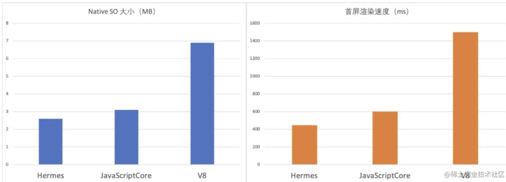
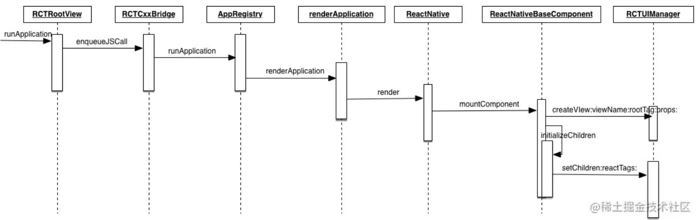
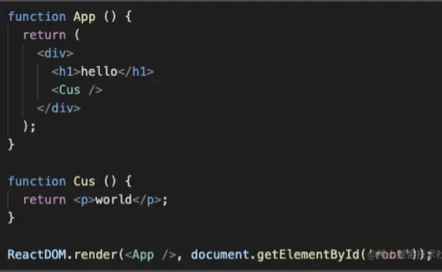
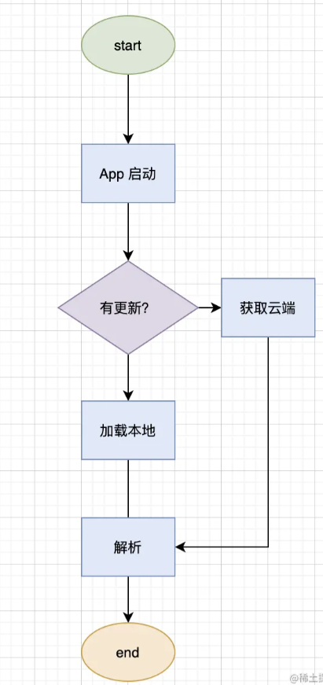
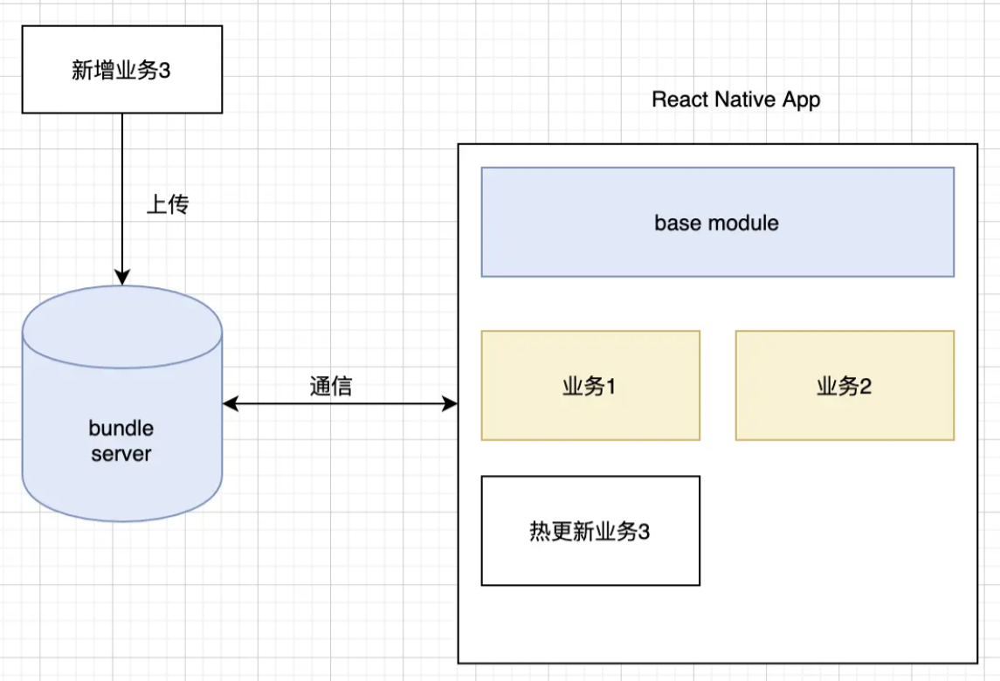

### 常见的跨平台开发框架

> * React Native
> * Native
>
> Flutter 是由谷歌开发的软件开发工具包（SDK）。它可以帮助开发人员使用单一代码库构建 iOS 和 Android 应用程序。React Native 与 Flutter 具有相同的目的，但方式不同。它是由 Facebook 建立的，基于 React 用于创建移动应用程序，而不会影响应用程序的外观和感觉。

### 什么是React Native

> 参考：https://juejin.cn/post/6916452544956858382#heading-1

> React Native 是一个由 Facebook 于 2015 年 9 月发布的一款开源的 JavaScript 框架，它可以让开发者使用 JavaScript 和 React 来开发跨平台的移动应用。它既保留了 React 的开发效率，又同时拥有 Native 应用的良好体验，加上 Virtual DOM 跨平台的优势，实现了真正意义上的：***Learn Once,Write Anywhere.***

### React Native 的特点

#### **跨平台**

> React Native 使用了 Virtual DOM(虚拟 DOM)，只需编写一套代码，便可以将代码打包成不同平台的 App，极大提高了开发效率，并且相对全部原生开发的应用来说，维护成本也相对更低。

#### **上手快**

> 相比于原生开发，JavaScript 学习成本低、语法灵活。允许让 Web 开发者更多地基于现有经验开发 App。React Native 只需使用 JavaScript 就能编写移动原生应用，它和 React 的设计理念是一样的，因此可以毫不夸张地说：你如果会写 React，就会写 React Native!

#### **原生体验**

> 由于 React Native 提供的组件是对原生 API 的暴露，虽然我们使用的是 JavaScript 语言编写的代码，但是实际上是调用了原生的 API 和原生的 UI 组件。因此，体验和性能足以媲美原生应用。

#### **热更新**

> React Native 开发的应用支持热更新，因为 React Native 的产物是 bundle 文件，其实本质上就是 JS 代码，在 App 启动的时候就会去服务器上获取 bundle 文件，我们只需要更新 bundle 文件，从而使得 App 不需要重新前往商店下载包体就可以进行版本更新，开发者可以在用户无感知的情况下进行功能迭代或者 bug 修复。但是值得注意的是，AppStore 禁止热更新的功能中有调用私有 API、篡改原生代码和改变 App 的行为。
>
> 

### React Native 原理

#### **JavaScriptCore**

> JavaScriptCore 是 JavaScript 引擎，通常会被叫做虚拟机，专门设计来解释和执行 JavaScript 代码。在 React Native 里面，JavaScriptCore 负责 bundle 产出的 JS 代码的解析和执行

> **JS Engine**
>
> React Native 需要一个 JS 的运行环境，因为 React Native 会把应用的 JS 代码编译成一个 JS 文件（x x.bundle），React Native 框架的目标就是解释运行这个 JS 脚本文件，如果是 Native 拓展的 API，则直接通过 bridge 调用 Native 方法，最基础的比如绘制 UI 界面，映射 Virtual DOM 到真实的 UI 组件中。
>
> > 如图：
> >
> > 绿色的是我们应用开发的部分，我们写的代码基本上都是在这一层。
> >
> > 蓝色代表公用的跨平台的代码和工具引擎，一般我们不会动蓝色部分的代码。
> >
> > 黄色代表平台相关的 bridge 代码，做定制化的时候会添加修改代码。
> >
> > 红色代表系统平台的功能，另外红色上面有一个虚线，表示所有平台相关的东西都通过 bridge 隔离开来了，红色部分是独立于 React Native 的。
>
> 

> **脱离 React Native，纯原生端是如何与 JS 交互的？来看下 iOS 里面是如何实现的。**
>
> 在 Native 创建一个 JS 上下文：
>
> ```csharp
> // 创建一个ctx的JS上下文
> JSContent *ctx = [[JSContent alloc] init];
> // 创建一个变量name
> [ctx evaluateScript:@"var name = 'Hellen'"];
> // 创建一个方法
> [ctx evaluateScript:@"var hello = function(name) { return 'hello ' + name }"];
> 复制代码
> ```
>
> Native 调用 JavaScript 方法：
>
> ```ini
> // 通过ctx上下文对象，获取到hello方法
> JSValue *helloFUnction = ctx[@"hello"];
> // 运行js方法
> JSValue *greetings = [helloFunction callWithArguments:@[@"bytedancers"]; // hello bytedancers
> 复制代码
> ```
>
> 所以，JavaScript 代码只要将变量暴露在 JS 上下文全局，Native 就能获取到，并运行 JS 的代码。
>
> JavaScript 调用 Native，首先需要在 Native 端，将一个变量暴露在 JS 上下文全局，在 JavaScript 全局变量里面就能获取到并执行这个方法：
>
> ```kotlin
> ctx[@"createdByNative"] = ^(NSString *name) {
>     // do something
>     return someResult
> }
> 复制代码
> ```
>
> React Native 同样借助 JS Engine 的能力，基于 JavaScriptCore 来执行 JS，但是是通过 Bridge 来进行交互的，JS 不会直接引用 Native 层的对象实例，Native 也不会直接引用 JS 层的对象实例(在 React Native 里所有 Native 和 JS 互调都是通过 Bridge 层的几个最基础的方法衔接的)。

**Hermes Engine**

> Hermes 是 Facebook 在 2019 年发布的新一代 JS Engine，Hermes 是一款小巧轻便的 JavaScript 引擎，专门针对在 Android 上运行 React Native 进行了优化：应用启动时间减少、减少内存使用量并缩小应用程序大小，此外因为它采用 JavaScript 标准实现，所以很容易在 React Native 应用中集成。

**Hermes vs JavaScriptCore vs V8**

> 经过官方的数据验证，Faceback 团队提出的关键性指标相较于原先的 JavaScriptCore 方案都有了显著提高。首先，是产物文件的大小方面，RN 所依赖的必要 so 库，Hermes 比 JavaScriptCore 减少了约 16%，V8 则要远大于 Hermes 和 JavaScriptCore。
>
> 

#### Bridge

> 在 React Native 中，原生端和 JavaScript 交互是通过 Bridge 进行的，Bridge 的作用就是给 React Native 内嵌的 JS Engine 提供原生接口的扩展供 JS 调用。所有的本地存储、图片资源访问、图形图像绘制、3D 加速、网络访问、震动效果、NFC、原生控件绘制、地图、定位、通知等都是通过 Bridge 封装成 JS 接口以后注入 JS Engine 供 JS 调用。理论上，任何原生代码能实现的效果都可以通过 Bridge 封装成 JS 可以调用的组件和方法, 以 JS 模块的形式提供给 RN 使用。

**RCTRootView**

> 原生项目如果想用 React Native，那么就需要用到 RCTRootView，它是 React Native 加载的地方，可以把它看作是一个容器。

```scss
// RCTRootView.m

- (void)javaScriptDidLoad:(NSNotification *)notification
{
    RCTAssertMainQueue();
    RCTBridge *bridge = notification.userInfo[@"bridge"];
    if (bridge != _contentView.bridge) {
        [self bundleFinishedLoading:bridge];
    }
}

- (void)bundleFinishedLoading:(RCTBridge *)bridge
{
    // 省略创建RCTRootContentView...

    [self runApplication:bridge];

    // 省略添加一个RCTRootContentView...
}

- (void)runApplication:(RCTBridge *)bridge
{
    NSString *moduleName = _moduleName ?: @""; // 这里是@"NewProject"
    NSDictionary *appParameters = @{
        @"rootTag": _contentView.reactTag,
            @"initialProps": _appProperties ?: @{},
    };

    [bridge enqueueJSCall:@"AppRegistry"                 method:@"runApplication"                   args:@[moduleName, appParameters]
        completion:NULL];
}
```

> 上面的源码(iOS)可以看出 RCTRootView 其实做了这些事情：
>
> - 创建了负责 React Native 和 Native 通信的 RCTBridge 实例的初始化。
>
> - 初始化了真正展示视图的 RCTRootContentView。
>
> - 通过 runApplication 方法把必要的参数（moduleName, params）传给 JS 侧的 AppRegistry 的 runApplication 方法，从而运行起了 React Native 的功能。（在 React native 中，根组件是需要通过 AppRegistry 的 registerComponent 方法进行注册的。所谓根组件，就是 Native to JS 的入口文件）
>
> 渲染过程：
>
> 
>
> 

**React Native 中的 Native 模块如何暴露给 JS？**

> 我们知道，React Native 可以调用 Native 侧的方法，并且只要 Native 侧只要遵循一定的规则，是可以将方法暴露给 JS 调用的：

```objectivec
// iOS端原生代码
#import <Foundation/Foundation.h>
#import <React/RCTBridgeModule.h>

@interface NativeLogModule : NSObject<RCTBridgeModule>

@end

#import "NativeLogBridge.h"

@implementation NativeLogModule
RCT_EXPORT_MODULE()
RCT_EXPORT_METHOD(nativeLog:(id)obj) {
  NSLog(@"%@",obj);
}
@end

// JS端调用
import { NativeModules } from 'react-native';
NativeModules.NativeLogModule.nativeLog('从JS侧来的消息');
复制代码
```

> 可以看到，上面的代码中使用了**RCT_EXPORT_MODULE()** 宏将 Native 类以 module 的形式暴露给了 JS，然后使用了**RCT_EXPORT_METHOD**将 Native 的方法暴露给 JS，最后在 JS 侧直接引用一个模块，便可以直接调用暴露的方法与 Native 通信。

**React Native 是如何实现 Native <---> JS 通信的呢？**

> 上面我们有提到 JS Engine，Native 可以把原生方法暴露到全局，同样的 JS 也可以把方法暴露给 Native，但是 React Native 并没有这样做，原因之一是这样会导致大量的全局变量污染，所以为了规范这个通信过程，React Native 自己实现了 Bridge。

**Native 调用 JS**

> 在 React Native 里面，JS 的方法可以通过 `global.batchedBridge.callFunctionReturnFlushedQueue` 这个方法进行调用，所以在 Native 侧，只需将 React Native 里面的 global.batchedBridge 对象中的方法和 Native 侧的 JSIExecutor 方法进行绑定（本质上 Native 指针指向 JS 函数）

```ini
JSIExecutor::callFunctionReturnFlushedQueue_ = global.batchedBridge.callFunctionReturnFlushedQueue
```

> Native 侧的 callFunctionReturnFlushedQueue 主要做了这样的事情：
>
> - 通过 moduleid 和 methodid 完成方法的调用，通过这两个参数可以找到 JS 侧定义的方法模块。

> 

**JS 调用 Native**

> 当 JS 调用 Native 模块的时候，会调用一个 Native 暴露出来的全局方法：nativeFlushQueueImmediate，并通过传入要调用的 moduleName 、methodName、callback 参数给这个方法，然后这个方法再通知给 Native 侧找到相应的模块并执行。
>
> 

#### Virtual DOM

> 在认识 Virtual DOM 之前，我们先来看看浏览器的工作原理：
>
> - 浏览器有一套完整的 UI 控件，样式和功能都是按照 HTML 标准实现的。
>
> - 浏览器能够解析 HTML 和 CSS，通过 HTML 告诉浏览器需要生成什么类型的 UI 控件，并通过 CSS 样式文件来描述该 UI 控件的外观（大小，背景，布局等等...）。
>
> - 浏览器的主要作用就是解析 HTML 和 CSS 来形成渲染树，并通过 Render Engine 将页面渲染出来。
>
> 了解浏览器的工作原理之后，Virtual DOM 是如何工作的？
>
> - 首先 Virtual DOM 和真实 DOM 都有一个共同点：都是用来描述页面 UI 控件。
>
> - Virtual DOM 具有平台无关性：它描述的 UI 控件只是数据结构层的，具体渲染工作是交给了原生渲染引擎（浏览器、iOS、Android）去处理。
>
> **React (Native)的 Virtual DOM**
>
> 在 React Native 里面，是如何把 Virtual DOM 渲染成真实的 UI 的呢？
>
> 首先，在 React 里面，用来表示 dom 属性的对象有以下关键属性：
>
> ```js
> var ele = {
>     ...
>     type: type, // 元素的类型
>     key: key, // 元素key标示
>     ref: ref, // 元素的引用
>     props: props, // 元素的参数，包含children
>     ...
> }
> 
> // example 1
> <div>hello</div>
> // 会被描述为
> 
> {type: 'div',
>     props: {
>         children: ['hello']
>     }
> }
> 
> // example 2
> <CustomerComponents />
> // 会被描述为
> {
>     type: CustomerComponents
> }
> ```

> React 里面的 Virtual DOM 把真实 DOM 分为了以下几种类型：
>
> - 原子类型
>   - 类型为字符串，结构上不可再分解，渲染由平台底层支持。
>   - 在浏览器端：原子类型表示为浏览器支持的原始标签，例如 div、ul、li、p、a、span 等等。
>   - 在 Native 端：原子类型表示为 Native 端的各种基础 UI 组件，例如 RCTText、RCTView 等等
>
> - 组合类型
>   - 类型为函数构造器，它给我们提供了一种自定义元素 UI 和行为的能力，当渲染器遇到组合类型的元素时，会使用它的构造器创建一个实例并运行 render 方法得到一个新元素（原子类型，或者组合类型），然后再拿该元素继续进行渲染或者分解。
>   - 用户自定义的组件元素。

> **渲染器**
>
> 在浏览器端和 Native 端，React (Native)中 Virtual DOM 用来渲染真实 DOM 的渲染器是不一样的：
>
> 在浏览器端：
>
> 
>
> ```kotlin
> // 文本类型渲染器工作原理
> mountComponent: function(
>     transaction,
>     hostParent,
>     hostContainerInfo,
>     context
> ) {
>     // 获取到DOM对象
>     var lazyTree = DOMLazyTree(ownerDocument.createDocumentFragment());
>     // 判断是不是文本类型
>     if (this._stringText) {
>         DOMLazyTree.queueChild(
>             lazyTree,
>             DOMLazyTree(ownerDocument.createTextNode(this._stringText))
>         );
>     }
>     return lazyTree
> }
> 
> // 原子类型渲染器工作原理
> mountComponent: function(
>     transaction,
>     hostParent,
>     hostContainerInfo,
>     context
> ) {
>     var ownerDocument = hostContainerInfo._ownerDocument;
>     // 创建原子type类型dom
>     var el = 
> ownerDocument.createElement(this._currentElement.type)
>     ...
> 
>     // 创建子节点
>     this._createInitialChildren(transaction, props, context, lazyTree);
>     ...
> }
> 
> // 组合类型渲染器工作原理
> mountComponent: function(
>     transaction,
>     hostParent,
>     hostContainerInfo,
>     context
> ) {
> 
>     // 运行构造器，获取到组件实例
> 
>     var inst = this._constructComponent({
>         doConstruct,
>         publicProps,
>         publicContext,
>         updateQueue,
>     });
> 
>     ...
> 
>     // 获取到虚拟dom
>     if (renderedElement === undefined) {
>       renderedElement = this._renderValidatedComponent();
>     }
> 
>     ...
> 
>     // 获取到分解后的组件类型（ReactXXXComponent,可以看作是三种组件类型的集合）
>     this._renderedComponent = this._instantiateReactComponent(
>       renderedElement
>     );
>     // 最后通过ReactReconciler.mountComponent间接的调用不同类型的渲染器的mountComponent方法获取到生产的node节点，并返回。
>     var markup = ReactReconciler.mountComponent(
>       this._renderedComponent,
>       rootID,
>       transaction,
>       this._processChildContext(context)
>     );
> 
>     return markup
> }
> 复制代码
> ```
>
> 看以下代码结构：
>
> 
>
> 
>
> 在 Native 端：
>
> 
>
> 在浏览器里面，JavaScript 可以调用 DOM API 去完成创建 UI 的工作，而在 React Native 里面，是通过 UI Manager 来创建视图的，基于 Virtual DOM ，React Native 把不同平台创建视图的逻辑封装了一层，不同平台通过 Bridge 调用 UI Manager 来创建不同的 Native 视图。
>
> 
>
> **三个线程**
>
> 在 React Native 里面，真正有三个重要的线程在执行，他们分别是 Shadow thread、UI thread 和 JS thread。
>
> **JS thread：** 其实是 JavaScript 线程，负责 JS 和原生代码的交互线程，因为 JS 是单线程模型，所以需要一个单独的线程来驱动，并且 JS 和 Native 交互是异步的。
>
> **Shadow thread**: 这个线程是负责 Native 布局，提供给 yoga 引擎使用。
>
> **UI thread**：这个可以看作是主线程，可以看作是 UI Manager 线程，负责页面的交互和控件绘制逻辑。

#### 热更新

> React Native 的产物 bundle 文件，本质上是 JS 的逻辑代码加上 React Native 的 Runtime 的集合，所以在应用一启动的时候就会去获取 bundle 文件，之后解析 bundle 文件，最后再由 JS Engine 去执行具体的业务代码逻辑。这就可以允许开发者在云端去更新 bundle 文件，然后应用启动的时候获取最新的 bundle 文件，这一整个流程下来就实现了热更新。
>
> 
>
> **增量更新（拆包）**
>
> 对于 React Native 的代码打包之后只会生成一个 Bundle 文件，这里面包含了基础业务逻辑、React Native 的基础库类，所以我们可以把一个包拆分成：一个基础包+ n 个业务包，其中基础包是不变的，这就是 runtime，业务包就是具体的业务，后面如果有更新，也只需要再打出一个业务包就行。
>
> 目前行业的解决方案有 facebook 官方提供的 metro bundle：[facebook.github.io/metro/](https://link.juejin.cn?target=https%3A%2F%2Ffacebook.github.io%2Fmetro%2F)
>
> 
>
> 

### React Native 实践

### 总结 & 拓展

#### React Native 的不足

> 由于 React Native 和原生交互依赖的只有一个 Bridge，而且 JS 和 Native 交互是异步的，所以对需要和 Native 大量实时交互的功能可能会有性能上的不足，比如动画效率，**性能是不如原生的**。
>
> React Native 始终是依赖原生的能力，所以摆脱不了对原生的依赖，相对 Flutter 的自己来画 UI 来说，React Native 显得有些尴尬。

#### React Native 的未来

> **JSI 是什么？**
>
> 在 RN 中， JSI 是 JavaScript Interface 的缩写，JSI 是一个轻量级的通用的 API 框架，可以应用于任意的 JavaScript virtual machine，让各种平台可以方便地使用不同的 JavaScript 解析引擎(JavaScript virtual machine 包含 JavaScript Engine)。
>
> JSI 是用 C++写的，用于取代原先的 bridge，提高通信效率，已在 RN 的 `0.58` 中实现。
>
> 目前在 RN 中，默认使用的 JavaScript virtual machine 也就是 JavascriptCore，有了 JSI ，我们就能轻松地直接调用原生 UI Views 或 Native Modules 用 Java/ObjC 实现的方法（类似 RPC），而不是像原来那样用一层 bridge 来排队等待原生层返回的消息。
>
> 
>
> **JSI 能做什么？**
>
> JSI 本身不是 React Native 的一部分——它是一个统一的、轻量的、通用适用于任何(理论上) JavaScript 虚拟机的接口层。
>
> 当把 JSI 加入到新架构中后，它使得一些真正重要的改进成为可能。
>
> 第一个改进很直观——javaScriptCore 现在可以更容易地被替换成其它引擎，其它选项包括微软的 ChakraCore 和谷歌的 V8。
>
> 第二个改进，可以说是整个新架构的基石，是通过使用 JSI，JavaScript 可以持有对 C++ 宿主对象的引用，并且对它进行调用。
>
> 这意味着：JavaScript 和 Native 之间真正地相互知晓，并且不再需要通过 JSON 序列化传递消息，这会消除 Bridge 的阻塞问题。

#### 和其他跨端技术比较

> **Flutter vs React Native**
>
> 首先来简单了解下 Flutter 和 React Native 的背景，Flutter 是由谷歌开发的软件开发工具包（SDK）。它可以帮助开发人员使用单一代码库构建 iOS 和 Android 应用程序。React Native 与 Flutter 具有相同的目的，但方式不同。它是由 Facebook 建立的，基于 React 用于创建移动应用程序，而不会影响应用程序的外观和感觉。
>
> **开发体验**
>
> React Native 在界面开发延续了 React 开发风格，支持 css-in-js(其实就是用 js 来写 css)，而且在 0.59 版本之后支持了 React Hook 函数式编程，开发的时候大多只关心样式界面的搭建，原生能力有客户端或者 Bridge 实现。
>
> Flutter 最大的特点在于：Flutter 是一套平台无关的 UI 框架，并且在 Flutter 里面万物皆 Widget。很多时候开发一个控件需要嵌套多个 Widget 去实现，与 JS 里面的回调地狱有点像，而这也是被吐槽代码嵌套样式难看的原因。
>
> **状态管理**
>
> React Native 和 Flutter 对于状态管理，两者有着很高的相似度，虽然内部实现很大差别，但是都可以获取 state 和 setState 的方式去更新页面的状态。
>
> **产物**
>
> React Native 产生的是 bundle 文件，实际上就是 JS 脚本文件；而 Flutter 编译后 Android 产生的主要是一些应用程序指令段、数据段，虚拟机数据段、指令段，iOS 则是 App.framework，其实也是一些原生的数据集。
>
> **原生能力 & 性能**
>
> 其实两者的在这方面的区别不是很大，性能方面 React Native 稍微差一点。但是在原生灵活性上 React Native 要有优势。
>
> 最后，目前来看两者是不分上下，各有所长。

### React Native实践

> #### 安装环境（针对 macOS）
>
> iOS 所需环境: Node、Watchman、Xcode、CocoaPods。
>
> Android 所需环境: Node、Watchman、JDK 和 Android Studio。
>
> 可参考 React Native 官网：[reactnative.cn/docs/gettin…](https://link.juejin.cn?target=https%3A%2F%2Freactnative.cn%2Fdocs%2Fgetting-started)
>
> Notice-1：AppStore Xcode 最新的版本可能对系统版本有需求，不想升级系统，想装之前版本的 Xcode 的同学可以看看这里：[developer.apple.com/download/mo…](https://link.juejin.cn?target=https%3A%2F%2Fdeveloper.apple.com%2Fdownload%2Fmore%2F)
>
> 
>
> Notice-2：在安装 CocoaPods 依赖的时候很可能会出现下载失败的情况，可以试下切换镜像源：[mirror.tuna.tsinghua.edu.cn/help/CocoaP…](https://link.juejin.cn?target=https%3A%2F%2Fmirror.tuna.tsinghua.edu.cn%2Fhelp%2FCocoaPods%2F)
>
> Notice-3：请仔细阅读官网教程，因为从头到尾操作一遍之后项目仍然无法跑起来的体验真的很抓狂。
>
> #### 目录结构
>
> 用 React Native 官方脚手架生成的项目目录是这样的：
>
> ```bash
> ├── android # Android runtime
> ├── iOS # iOS runtime
> ├── node_modules # 项目依赖
> ├── app.json # 描述app 信息
> ├── App.js # React Native 代码
> ├── index.js # 入口文件，这个文件里面调用了AppRegistry.registerComponent，注册React Native组件提供给Native
> ├── package.json # 依赖信息和版本信息
> ├── ...
> ├── ...
> ├── ...
> 复制代码
> ```
>
> #### 实现一个弹窗动画
>
> 需要用到组件：View、Text、TouchableOpacity、StyleSheet、Dimensions、Animated。他们分别有什么用？
>
> View: 最基础的 UI 组件，View 是一个支持 Flexbox 布局的容器，可以看作是浏览器的 div。
>
> Text: 用于显示文本的 UI 组件，文本内容一般需要放在这个组件里面。
>
> TouchableOpacity: 按钮组件，并且点击的时候会提供一个半透明的效果，该效果由原生支持实现，当点击的时候会触发一个 onPress 事件。
>
> StyleSheet: 提供了一种类似 CSS 样式表的抽象，它可以使用 JS 对象来编写 CSS 样式。
>
> Dimensions: 封装了设备的宽高属性，一般设置元素的宽高可以基于它来实现屏幕适配。
>
> Animated: 动画库，它提供了用户输入、输出动画属性的能力，来实现一些简单动画。
>
> 首先在页面里面加入一个按钮，点击的时候显示一个全屏的 Modal 弹窗：
>
> ```php
> // 控制弹窗显示隐藏
> const [visiable, setVisiable] = useState(false);
> 
> <View style={styles.container}>
>   <Header /> {/* 官方组件，忽略 */}
>   <View style={styles.buttonWrap}>
>     <TouchableOpacity
>       style={styles.button}
>       onPress={() => setVisiable(true)}>
>       <Text style={styles.buttonText}>Button</Text>
>     </TouchableOpacity>
>   </View>
>   <Modal visiable={visiable} onClose={() => setVisiable(false)} />
> </View>
> 
> const styles = StyleSheet.create({
>   container: {
>     width: '100%',
>     height: '100%',
>   },
>   buttonWrap: {
>     alignItems: 'center',
>     justifyContent: 'center',
>     marginTop: 20,
>   },
> 
>   button: {
>     width: 100,
>     height: 30,
>     backgroundColor: 'skyblue',
>     borderRadius: 5,
>     alignItems: 'center',
>     justifyContent: 'center',
>   },
> 
>   buttonText: {
>     color: '#fff',
>   },
> });
> 复制代码
> ```
>
> 接下来我们编写 Modal 弹窗的样式，首先它应该是个全屏的，并且有个半透明的背景色，然后内容区域应该是居中显示的：
>
> ```php
> <Animated.View style={{...styles.container, backgroundColor: back}}>
>   <Animated.View
>     style={[styles.box, {transform: [{scale: content}], opacity: content}]}>
>     <TouchableOpacity style={styles.button} onPress={handleClose}>
>       <Text style={styles.buttonText}>Close</Text>
>     </TouchableOpacity>
>   </Animated.View>
> </Animated.View>
> 
> const styles = StyleSheet.create({
>   container: {
>     position: 'absolute',
>     left: 0,
>     top: 0,
>     flex: 1,
>     width: '100%',
>     height: '100%',
>     alignItems: 'center',
>     justifyContent: 'center',
>   },
>   box: {
>     position: 'relative',
>     opacity: 0,
>     width: 200,
>     height: 200,
>     backgroundColor: '#fff',
>     alignItems: 'center',
>     justifyContent: 'center',
>   },
>   button: {
>     width: 100,
>     height: 30,
>     backgroundColor: 'skyblue',
>     borderRadius: 5,
>     alignItems: 'center',
>     justifyContent: 'center',
>   },
>   buttonText: {
>     color: '#fff'
>  },
> });
> 复制代码
> ```
>
> 它们分别长这样：
>
> 
>
> 现在只差一件事了，就是加上动画属性，这个时候就需要用到 Animated 了：
>
> ```scss
>  // 创建一个渐变值。
>  const [fade] = useState(new Animated.Value(0));
> 复制代码
> ```
>
> 我们用 Animated 创建了一个 fade 变量，这个变量是可变的，我们可以使用 Animated.timing().start()方法，来改变 fade 的值。
>
> ```arduino
> Animated.timing(
>       fade, // 动画中的变量值
>       {
>         toValue: 100, // 需要变成的值
>         duration: 400, // 变化执行时长，0-100的变化需要400毫秒
>         useNativeDriver: false, // 是否使用原生动画引擎，如果开启，部分属性是不支持原生渲染的，会报错，所以一般会关闭这个选项。
>       },
>     ).start();
> 复制代码
> ```
>
> 现在我们要把 fade 的值（0 ～ 100）映射成背景色从 rgba(0, 0, 0, 0) ~ rgba(0, 0, 0, 0.8)变化，以及元素缩放 scale(0) ~ scale(1):
>
> ```ini
> // 背景颜色过渡
> let back = fade.interpolate({
>     inputRange: [0, 100],
>     outputRange: ['rgba(0,0,0,0)', 'rgba(0,0,0,.8)'],
>     });
> // 内容缩放过渡
> let content = fade.interpolate({
>     inputRange: [0, 100],
>     outputRange: [0, 1],
> });
> 复制代码
> ```
>
> fade.interpolate 方法可以把线性输入范围映射到线性输出范围，并且支持缓动功能。
>
> 最后我们把这两个插值赋值给相应的 dom 元素的属性上，加上交互，在点击按钮出现 Modal 弹窗的时候，去执行 fade 插值 0-100，这样背景色就会从 rgba(0, 0, 0, 0) 渐变到 rgba(0, 0, 0, 0.8)，元素大小缩放 0 到 1，当点击隐藏的时候，则相反。
>
> 效果：
>
> 