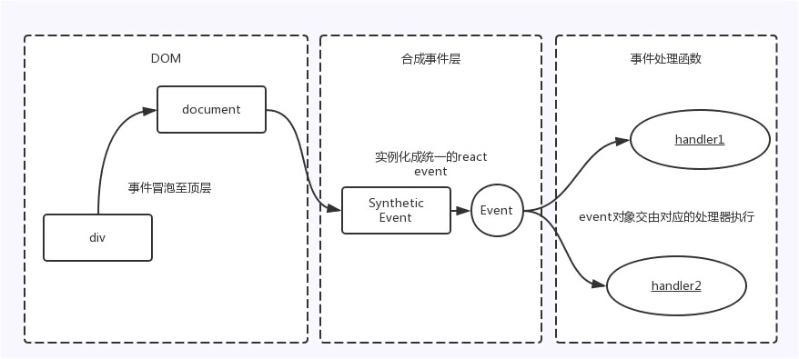
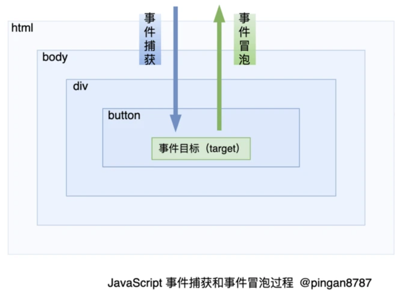
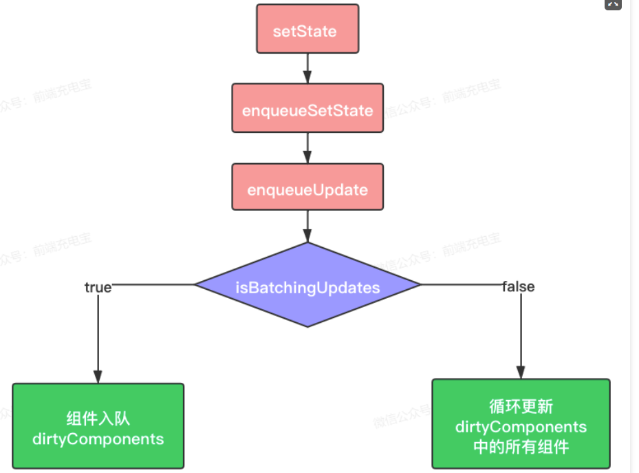
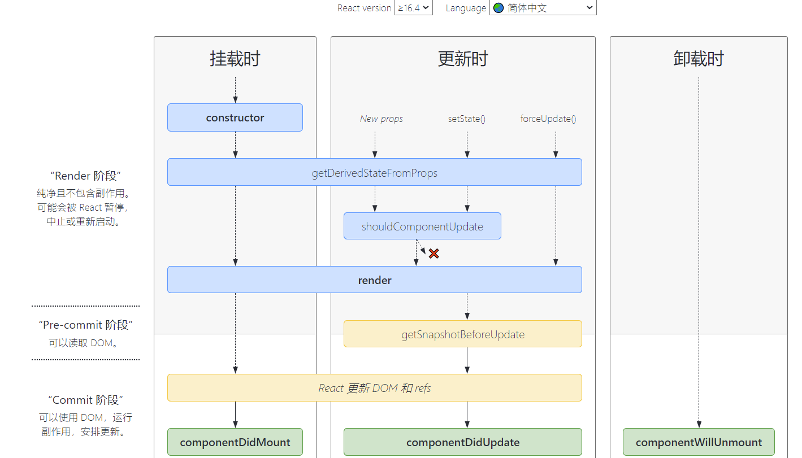
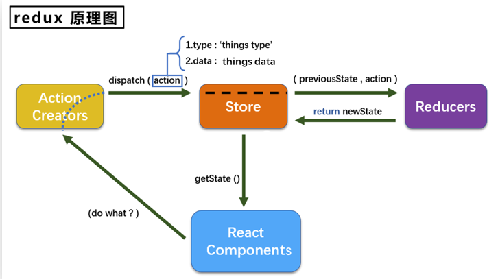
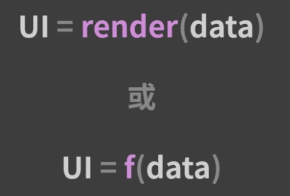
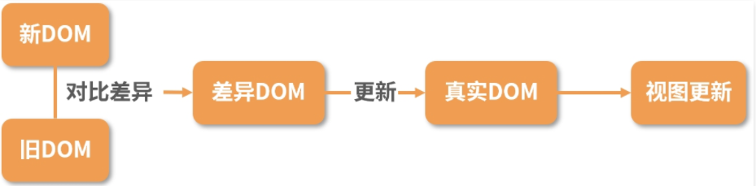
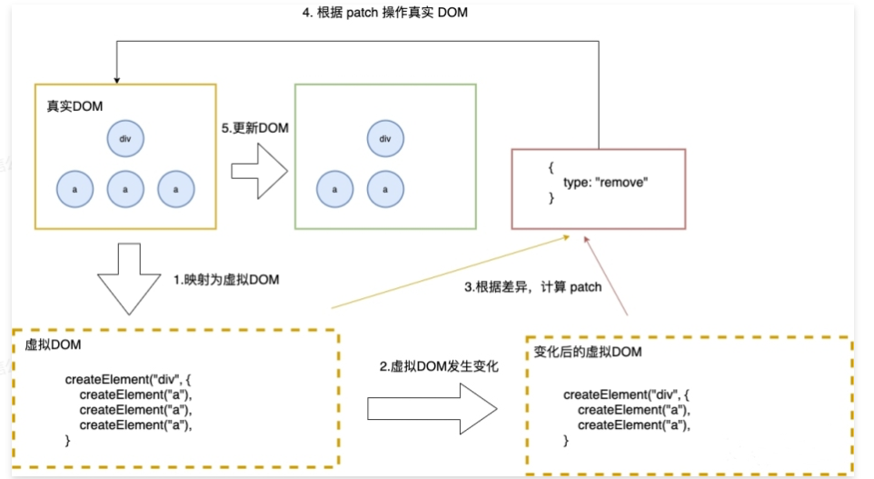

## 组件基础

### React 事件机制

> ```javascript
> <div onClick={this.handleClick.bind(this)}>点我</div>
> ```
>
> React并不是将click事件绑定到了div的真实DOM上，而是在document处监听了所有的事件，当事件发生并且冒泡到document处的时候，React将事件内容封装并交由真正的处理函数运行。这样的方式不仅仅减少了内存的消耗，还能在组件挂载销毁时统一订阅和移除事件。
>
> 除此之外，冒泡到document上的事件也不是原生的浏览器事件，而是由react自己实现的合成事件（SyntheticEvent）。因此如果不想要是事件冒泡的话应该调用event.preventDefault()方法，而不是调用event.stopProppagation()方法。
>
> 
>
> JSX 上写的事件并没有绑定在对应的真实 DOM 上，而是通过`事件代理`的方式，将所有的事件都统一绑定在了 `document` 上,当事件发生并且冒泡到document处的时候，React将事件内容封装并交由真正的处理函数运行。这样的方式不仅`减少`了内存消耗，还能在组件挂载销毁时`统一`订阅和移除事件。
>
> 另外冒泡到 `document` 上的事件也不是原生浏览器事件，而是 React 自己实现的合成事件（SyntheticEvent）。
>
> 因此我们如果不想要事件冒泡的话，调用 `event.stopPropagation` 是无效的，而应该调用 `event.preventDefault`。
>
> > https://segmentfault.com/a/1190000038251163
> >
> > ps:
> >
> > 1.event.stopPropagation()
> >
> > 这是阻止事件的冒泡方法，不让事件向documen上蔓延，但是默认事件依然会执行，当你调用这个方法的时候，如果点击一个连接，这个连接仍然会被打开
> >
> > 2.event.preventDefault()
> >
> > 这是阻止默认事件的方法，调用此方法时，连接不会被打开，但是会发生冒泡，冒泡会传递到上一层的父元素；
> >
> > 3.return false
> >
> > 这个方法比较暴力，他会同时阻止事件冒泡也会阻止默认事件；写上此代码，连接不会被打开，事件也不会传递到上一层的父元素；可以理解为return false就等于同时调用了event.stopPropagation()和event.preventDefault()
>
> > React `合成事件`（SyntheticEvent）是 React **模拟原生 DOM 事件所有能力的一个`事件对象`**，即浏览器原生事件的跨浏览器包装器。它根据 [W3C 规范](https://link.segmentfault.com/?enc=KXFOhTwb7kLAUHPdGLbNLw%3D%3D.g2M1qrTWUHRWD40C8ynvRWrTsZ0NO2vjHbFWagfinJiR9BPqiyub5%2BVAGI4B444t) 来定义合成事件，`兼容`所有浏览器，拥有与浏览器原生事件相同的`接口`。
> >
> > 那么 React 为什么使用合成事件？其主要有三个目的：
> >
> > 1. 进行浏览器兼容，实现更好的跨平台
> >
> > React 采用的是顶层事件代理机制，能够保证冒泡一致性，可以跨浏览器执行。React 提供的合成事件用来抹平不同浏览器事件对象之间的差异，将不同平台事件模拟合成事件。
> >
> > 2. 避免频繁的垃圾回收
> >
> > 事件对象可能会被频繁创建和回收，因此 React 引入**事件池**，在事件池中获取或释放事件对象。**即 React 事件对象不会被释放掉，而是存放进一个数组中，当事件触发，就从这个数组中弹出，避免频繁地去创建和销毁(垃圾回收)**。
> >
> > 3. 方便事件统一管理和事务机制

### 原生事件-捕获 冒泡 代理

> > `事件池`
> >
> > **React 事件池仅支持在 React 16 及更早版本中，在 React 17 已经不使用事件池**。
> >
> > 原因：它并不会提高现代浏览器的性能，甚至还会使经验丰富的开发者一头雾水。在 React 16 及之前的版本，合成事件对象的事件处理函数`全部被调用之后`，所有属性都会被置为 `null` 。这时，如果我们需要在事件处理函数运行之后获取事件对象的属性，可以使用 React 提供的 `e.persist()` 方法，保留所有属性
>
> > `关于原生事件`
> >
> > 
> >
> > ### 1. 事件捕获
> >
> > 当某个元素触发某个事件（如 `onclick` ），顶层对象 `document` 就会发出一个事件流，随着 DOM 树的节点向目标元素节点流去，**直到到达事件真正发生的目标元素**。在这个过程中，事件相应的监听事件会被执行。
> >
> > ### 2. 事件目标
> >
> > 当到达目标元素之后，执行目标元素该事件相应的处理函数。如果没有绑定监听函数，那就不执行。
> >
> > ### 3. 事件冒泡
> >
> > 从目标元素开始，往顶层元素传播。途中如果有节点绑定了相应的事件处理函数，这些函数都会被触发一次。如果想阻止事件起泡，可以使用 `e.stopPropagation()` 或者` e.cancelBubble=true`（IE）来阻止事件的冒泡传播。
> >
> > ### 4. 事件委托/事件代理
> >
> > 简单理解就是**将一个响应事件委托到另一个元素**。
> > 当子节点被点击时，`click` 事件向上冒泡，父节点捕获到事件后，我们判断是否为所需的节点，然后进行处理。其优点在于**减少内存消耗和动态绑定事件**。
>
> > `合成事件与原生事件区别`
> >
> > * 事件名称命名方式不同,原生事件命名为纯小写（onclick, onblur），而 React 事件命名采用**小驼峰式**（camelCase）
> > * 事件处理函数写法不同,原生事件中事件处理函数为字符串，在 React JSX 语法中，传入一个**函数**作为事件处理函数。
> > * 阻止默认行为方式不同,在原生事件中，可以通过返回 `false` 方式来阻止默认行为，但是在 React 中，需要显式使用 `preventDefault()` 方法来阻止。

### React 高阶组件是什么，和普通组件有什么区别，适用什么场景

> 官方解释∶ 
>
> 高阶组件（HOC,higherOrderComponent）是 React 中用于`复用组件逻辑`的一种高级技巧。HOC 自身不是 React API 的一部分，它是一种基于 React 的组合特性而形成的`设计模式`。
>
> 高阶组件（HOC）就是一个函数，且该函数接受一个组件作为参数，并返回一个新的组件，它只是一种组件的设计模式，这种设计模式是由react自身的组合性质必然产生的。我们将它们称为纯组件，因为它们可以接受任何动态提供的子组件，但它们不会修改或复制其输入组件中的任何行为。
>
> ```js
> // hoc的定义
> function withSubscription(WrappedComponent, selectData) {
>     return class extends React.Component {
>         constructor(props) {
>             super(props);
>             this.state = {
>                 data: selectData(DataSource, props)
>             };
>         }
>         // 一些通用的逻辑处理
>         render() {
>             // ... 并使用新数据渲染被包装的组件!
>             return <WrappedComponent data={this.state.data} {...this.props} />;
>         }
>     };
> 
> // 使用
> const BlogPostWithSubscription = withSubscription(BlogPost, (DataSource, props) => {
>     DataSource.getBlogPost(props.id)
> });
> ```
>
> **1）HOC的优缺点**
>
> - 优点∶ 逻辑复用、不影响被包裹组件的内部逻辑。
> - 缺点∶ 高阶组件传递给被包裹组件的 props 如果重名的话，会发生覆盖
>
> **2）适用场景**
>
> - 代码复用，逻辑抽象 
> - 渲染劫持 
> - 抽象化和操作状态（`state`）
> - 操作属性（`props`） 
>
> **3）具体应用例子** 
>
> - **权限控制：**利用高阶组件的 **条件渲染** 特性可以对页面进行权限控制，权限控制一般分为两个维度：页面级别和 页面元素级别
> - **组件渲染性能追踪：**借助父组件子组件生命周期规则捕获子组件的`生命周期`，可以方便的对某个组件的渲染时间进行记录∶
> - **页面复用**

### React 高阶组件、Render props、hooks 有什么区别，为什么要不断迭代

> 这三者是目前react解决`代码复用`的主要方式：
>
> - 高阶组件（HOC）是 React 中用于复用组件逻辑的一种高级技巧。HOC 自身不是 React API 的一部分，它是一种基于 React 的组合特性而形成的设计模式。具体而言，高阶组件是参数为组件，返回值为新组件的函数。
> - render props是指一种在 React 组件之间使用一个值为函数的 prop 共享代码的简单技术，更具体的说，render prop 是一个用于告知组件需要渲染什么内容的函数 prop。
> - 简单点讲, render props 就一种在组件间共享逻辑的技巧。 把一些渲染逻辑以prop 的形式传递给 Component, 把注意力集中在渲染逻辑上。使用场景：重复UI结构，共享某个数据源，共享某个全局事件
> - Hook是 React 16.8 的新增特性。它可以让你在不编写 class 的情况下使用 state 以及其他的 React 特性。通过自定义hook，可以复用代码逻辑。
> - 通常，render props 和高阶组件只渲染一个子节点。让 Hook 来服务这个使用场景更加简单。这两种模式仍有用武之地，（例如，一个虚拟滚动条组件或许会有一个 renderltem 属性，或是一个可见的容器组件或许会有它自己的 DOM 结构）。但在大部分场景下，Hook 足够了，并且能够帮助减少嵌套。
>
> **总结∶**
>
> Hoc、render props和hook都是为了解决代码复用的问题，但是hoc和render props都有特定的使用场景和明显的缺点。hook是react16.8更新的新的API，让组件逻辑复用更简洁明了，同时也解决了hoc和render props的一些缺点。
>
> **（1）HOC**
>
> 官方解释∶ 
>
> 高阶组件（HOC）是 React 中用于复用组件逻辑的一种高级技巧。HOC 自身不是 React API 的一部分，它是一种基于 React 的组合特性而形成的设计模式。
>
> 简言之，HOC是一种组件的设计模式，HOC接受一个组件和额外的参数（如果需要），返回一个新的组件。HOC 是纯函数，没有副作用。
>
> HOC的优缺点∶
>
> - 优点∶ 逻辑复用、不影响被包裹组件的内部逻辑。 
> - 缺点∶ 高阶组件传递给被包裹组件的 props 如果重名的话，会发生覆盖 
>
> 2）Render props
>
> 官方解释∶
>
> "render prop"是指一种在 React 组件之间使用一个值为 函数的prop 共享代码的简单技术
>
> 简单点讲, render props 就一种在组件间共享逻辑的技巧。 把一些渲染逻辑以 prop 的形式传递给 Component, 把注意力集中在渲染逻辑上。使用场景：重复UI结构，共享某个数据源，共享某个全局事件
>
> ```jsx
> // DataProvider组件内部的渲染逻辑如下
> class DataProvider extends React.Components {
>     state = {
>         name: 'Tom'
>     }
> 
>     render() {
>         return (
>             <div>
>                 <p>共享数据组件自己内部的渲染逻辑</p>
>                 { this.props.render(this.state) }
>             </div>
>         );
>     }
> }
> 
> // 调用方式
> <DataProvider render={data => (<h1>Hello {data.name}</h1>) } />
> 
> ```
> 
> 由此可以看到，render props的优缺点也很明显∶
>
> - 优点：数据共享、代码复用，将组件内的state作为props传递给调用者，将渲染逻辑交给调用者。
>- 缺点：`无法在 return 语句外访问数据、嵌套写法不够优雅`
> 
> 3）Hooks
>
> 官方解释∶
>
> Hook是 React 16.8 的新增特性。它可以让你在不编写 class 的情况下使用 state 以及其他的 React 特性。通过自定义hook，可以复用代码逻辑。
>
> ```js
>// 自定义一个获取订阅数据的hook
> function useSubscription() {
>   const data = DataSource.getComments();
>   return [data];
> }
> // 
> function CommentList(props) {
>   const {data} = props;
>   const [subData] = useSubscription();
>     ...
> }
> // 使用
> <CommentList data='hello' />
> ```
> 
> 以上可以看出，hook解决了hoc的prop覆盖的问题，同时使用的方式解决了render props的嵌套地狱的问题。hook的优点如下∶ 
>
> - 使用直观；
>- 解决hoc的prop 重名问题；
> - 解决render props 因共享数据 而出现嵌套地狱的问题；
> - 能在return之外使用数据的问题。
> 
> 需要注意的是：hook只能在组件顶层使用，不可在分支语句中使用。
>
> **总结∶**
>
> Hoc、render props和hook都是为了解决代码复用的问题，但是hoc和render props都有特定的使用场景和明显的缺点。hook是react16.8更新的新的API，让组件逻辑复用更简洁明了，同时也解决了hoc和render props的一些缺点。

### 对React-Fiber的理解，它解决了什么问题？

> 问题：`JavaScript`引擎和`页面渲染`引擎两个`线程`是互斥的，当其中一个线程执行时，另一个线程只能挂起等待
>
> 如果 `JavaScript` 线程长时间地占用了主线程，那么渲染层面的更新就不得不长时间地等待，界面长时间不更新，会导致页面响应度变差，用户可能会感觉到卡顿

> React Fiber 在React 16 版本发布
>
> https://zhuanlan.zhihu.com/p/416859389
>
> Fiber 是 React 16 对 React 核心算法的一次重写。**Fiber 会使原本同步的渲染过程变成异步的。**

> 而这也正是 `React 15` 的 `Stack Reconciler`（栈调和,指代 React 15 的 Diff 算法）所面临的问题。React V15 在`渲染`时，会递归比对 VirtualDOM 树，找出需要变动的节点，然后同步更新它们， 一气呵成。这个过程期间， React 会占据浏览器资源，这会导致用户触发的事件（用户交互、动画）得不到响应，并且会导致掉帧，**导致用户感觉到卡顿**。
>
> 为了给用户制造一种应用很快的“假象”，不能让一个任务长期霸占着资源。 可以将浏览器的渲染、布局、绘制、资源加载(例如 HTML 解析)、事件响应、脚本执行视作操作系统的“进程”，需要通过某些调度策略合理地分配 CPU 资源，从而提高浏览器的用户响应速率, 同时兼顾任务执行效率。
>
> 所以 React 通过Fiber 架构，让这个执行过程变成可被中断。“适时”地让出 CPU 执行权，除了可以让浏览器及时地响应用户的交互，还有其他好处:
>
> - 分批延时对DOM进行操作，避免一次性操作大量 DOM 节点，可以得到更好的用户体验；
> - 给浏览器一点喘息的机会，它会对代码进行编译优化（JIT）及进行热代码优化，或者对 reflow 进行修正。
>
> **核心思想：**Fiber 也称协程或者纤程。它和线程并不一样，协程本身是没有并发或者并行能力的（需要配合线程），它只是一种控制流程的让出机制。让出 CPU 的执行权，让 CPU 能在这段时间执行其他的操作。渲染的过程可以被中断，可以将控制权交回浏览器，让位给高优先级的任务，浏览器空闲后再恢复渲染。
>
> `Fiber 会将原本耗时很长的同步任务分成多个耗时短的分片。每当执行完一个分片时，渲染线程都会把主线程交回去，看看有没有优先级更高的工作要处理，确保不会出现其他任务被“饿死”的情况，进而避免同步渲染带来的卡顿。此时，渲染线程是可以被打断的，这就是所谓的“异步渲染”。`
>
> `Fiber 架构的重要特征就是可以被打断的异步渲染模式。`

### 调和

> > 官方： Virtual DOM 是一种编程概念，在这个概念里，UI 以一种理想化的，或者说“虚拟的”表现形式被保存于内存中，并通过如 ReactDOM 等类库使之与“真实的” DOM 同步，这一过程叫作[协调](https://zh-hans.reactjs.org/docs/reconciliation.html)或调和。
>
> 即协调（调和）指的是将虚拟 DOM 映射到真实 DOM 的过程。
>
> > 严格来说，调和过程并不能和 Diff 画等号。调和是“使一致”的过程，而 Diff 是“找不同”的过程，它只是“使一致”过程中的一个环节。不过 Diff 确实是调和过程中最具代表性的一环。根据 Diff 实现形式的不同，调和过程被划分为了以 React 15 为代表的“栈调和”以及 React 16 以来的“Fiber 调和”。
>
> “栈调和”指代 React 15 的 Diff 算法。

### 哪些方法会触发 React 重新渲染？重新渲染 render 会做些什么？

> **（1）哪些方法会触发 react 重新渲染?** 
>
> - **setState（）方法被调用**
>
> setState 是 React 中最常用的命令，通常情况下，执行 setState 会触发 render。
>
> 但是这里有个点值得关注，执行 setState 的时候不一定会重新渲染。当 setState 传入 `null` 时，并`不会触发` render。
>
> * **父组件重新渲染**
>
> 只要父组件重新渲染了，即使传入子组件的 props 未发生变化，那么子组件也会重新渲染，进而触发 render
>
> * **forceUpdate()**
>
> 默认情况下，当组件的state或props改变时，组件将重新渲染。如果你的render()方法依赖于一些其他的数据，你可以告诉React组件需要通过调用forceUpdate()重新渲染。
>
> 调用forceUpdate()会导致组件`跳过shouldComponentUpdate`(),直接调用render()。这将触发组件的正常生命周期方法,包括每个子组件的shouldComponentUpdate()方法。
>
> forceUpdate就是重新render。有些变量不在state上，当时你又想达到这个变量更新的时候，刷新render；或者state里的某个变量层次太深，更新的时候没有自动触发render。这些时候都可以手动调用forceUpdate自动触发render
>
> **(2) 重新渲染 render 会做些什么?**
>
> - 会对新旧 VNode(虚拟dom，简称vnode) 进行对比，也就是我们所说的Diff算法。
> - 对新旧两棵树进行一个深度优先遍历，这样每一个节点都会进行标记，在到深度遍历的时候，每遍历到一个节点，就把该节点和新的节点树进行对比，如果有差异就放到一个对象里面
> - 遍历差异对象，根据差异的类型，根据对应对规则更新VNode(虚拟dom，简称vnode)
>
> React 的处理 render 的基本思维模式是每次一有变动就会去重新渲染整个应用。在 Virtual DOM 没有出现之前，最简单的方法就是直接调用 innerHTML。Virtual DOM厉害的地方并不是说它比直接操作 DOM 快，而是说不管数据怎么变，都会尽量以最小的代价去更新 DOM。React 将 render 函数返回的虚拟 DOM 树与老的进行比较，从而确定 DOM 要不要更新、怎么更新。当 DOM 树很大时，遍历两棵树进行各种比对还是相当耗性能的，特别是在顶层 setState 一个微小的修改，默认会去遍历整棵树。尽管 React 使用高度优化的 Diff 算法，但是这个过程仍然会损耗性能.
>
> ### 总结
>
> React 基于虚拟 DOM 和高效 Diff 算法的完美配合，实现了对 DOM 最小代价的更新。大多数情况下，React 对 DOM 的渲染效率足以我们的业务日常。但在个别复杂业务场景下，性能问题依然会困扰我们。此时需要采取一些措施来提升运行性能，其很重要的一个方向，就是避免不必要的渲染（Render）。
>
> 这里提下优化的点
>
> -见下一个问题

### 如何尽可能减少render次数

> 我们总是在开发过程中会产生非常多不必要的**重新渲染**
>
> #### 1.shouldComponentUpdate 和 PureComponent
>
> 在 React 类组件中，可以利用 shouldComponentUpdate 或者 PureComponent 来减少因父组件更新而触发子组件的 render，从而达到目的。shouldComponentUpdate 来决定是否组件是否重新渲染，如果不希望组件重新渲染，返回 false 即可。
>
> #### 2.利用高阶组件
>
> 在函数组件中，并没有 shouldComponentUpdate 这个生命周期，可以利用高阶组件，封装一个类似 PureComponet 的功能
>
> #### 3.使用 React.memo
>
> React.memo 是 React 16.6 新的一个 API，用来缓存组件的渲染，避免不必要的更新，其实也是一个高阶组件，与 PureComponent 十分类似，但不同的是， React.memo 只能用于函数组件 。
>
> React.memo()是一个`高阶组件`，用于`函数组件`，通过对前后props进行**浅比较**，如果前后props不一致，该组件将重新渲染，反之，不进行渲染，使用缓存中的组件。
>
> #### 4.合理拆分组件
>
> 微服务的核心思想是：以更轻、更小的粒度来纵向拆分应用，各个小应用能够独立选择技术、发展、部署。我们在开发组件的过程中也能用到类似的思想。试想当一个整个页面只有一个组件时，无论哪处改动都会触发整个页面的重新渲染。在对组件进行拆分之后，render 的粒度更加精细，性能也能得到一定的提升。
>
> ### 5.使用防抖来减少render
>
> #### 6.减少setState 使用私有属性
>
> 不使用`setState`而是换成私有属性`this.inputVal`来代替。
>
> 但是其实这样的优化有一个缺点：**不能使用双向绑定**。

### 对有状态组件和无状态组件的理解及使用场景

> https://www.cnblogs.com/WindrunnerMax/p/14224984.html

> `React`中的组件按状态主要分为无状态组件和有状态组件两类，通常来说，使用`class`关键字创建的组件，有自己的私有数据`this.state`和生命周期函数就是有状态组件；使用`function`创建的组件，只有`props`没有自己的私有数据和生命周期函数就是无状态组件，当一个类组件不需要管理自身状态时，也可称为无状态组件

> **（1）有状态组件** 
>
> **特点：**
>
> - 是类组件 
> - 有继承 
> - 可以使用this
> - 可以使用react的生命周期
> - 使用较多，容易频繁触发生命周期钩子函数，影响性能
> - 内部使用 state，维护自身状态的变化，有状态组件根据外部组件传入的 props 和自身的 state进行渲染。
>
> **使用场景：**
>
> - 需要使用到状态的。 
> - 需要使用状态操作组件的（无状态组件的也可以实现新版本react hooks也可实现）
>
> **总结：**
>
> 类组件可以维护自身的状态变量，即组件的 state ，类组件还有不同的生命周期方法，可以让开发者能够在组件的不同阶段（挂载、更新、卸载），对组件做更多的控制。类组件则既可以充当无状态组件，也可以充当有状态组件。当一个类组件不需要管理自身状态时，也可称为无状态组件。
>
> **（2）无状态组件**
>
> **特点：**
>
> - 不依赖自身的状态state
> - 可以是类组件或者函数组件。
> - 可以完全避免使用 this 关键字。（由于使用的是箭头函数事件无需绑定）
> - 有更高的性能。当不需要使用生命周期钩子时，应该首先使用无状态函数组件
> - 组件内部不维护 state ，只根据外部组件传入的 props 进行渲染的组件，当 props 改变时，组件重新渲染。
>
> **使用场景：**
>
> - 组件不需要管理 state，纯展示 
>
> **优点：**
>
> - 简化代码、专注于 render
> - 组件不需要被实例化，无生命周期，提升性能。 输出（渲染）只取决于输入（属性），无副作用
> - 视图和数据的解耦分离
>
> **缺点：**
>
> - 无法使用 ref 
> - 无生命周期方法
> - 无法控制组件的重渲染，因为无法使用shouldComponentUpdate 方法，当组件接受到新的属性时则会重渲染
>
> **总结：**
>
> 组件内部状态且与外部无关的组件，可以考虑用状态组件，这样状态树就不会过于复杂，易于理解和管理。当一个组件不需要管理自身状态时，也就是无状态组件，应该优先设计为函数组件。比如自定义的 `<Button/>`、 `<Input />` 等组件。

### React中什么是受控组件和非控组件？

> **（1）受控组件**
>
> 在HTML的表单元素中，它们通常自己维护一套`state`，并随着用户的输入,自己进行`UI`上的更新，这种行为是不被我们程序所管控的。
>
> 在react中，使用表单来收集用户输入时，例如`<input> <select> <textearea>`等元素都要绑定一个change事件，当表单的状态发生变化，就会触发onChange事件，然后通过`setState()`更新组件的state。这种组件在React中被称为**受控组件**，在受控组件中，组件渲染出的状态与它的value或checked属性相对应，react通过这种方式消除了组件的局部状态，使整个状态可控。react官方推荐使用受控表单组件。
>
> 受控组件更新state的流程：
>
> - 可以通过初始state中设置表单的默认值
> - 每当表单的值发生变化时，调用onChange事件处理器
> - 事件处理器通过事件对象event拿到改变后的状态，并通过setState（）更新组件的state
> - 一旦通过setState方法更新state，就会触发视图的重新渲染，完成表单组件的更新
>
> **受控组件缺陷：**
>
> 表单元素的值都是由React组件进行管理，当有多个输入框，或者多个这种组件时，如果想同时获取到全部的值就必须每个都要编写事件处理函数，这会让代码看着很臃肿，所以为了解决这种情况，出现了非受控组件。
>
> **（2）非受控组件**
>
> 如果一个表单组件没有value props（单选和复选按钮对应的是checked props）时，就可以称为非受控组件。在非受控组件中，可以使用一个ref来从DOM获得表单值。而不是为每个状态更新编写一个事件处理程序。
>
> React官方的解释：
>
> 要编写一个非受控组件，而不是为每个状态更新都编写数据处理函数，你可以使用 ref来从 DOM 节点中获取表单数据。
>
> ps:ref是React提供的用来操纵React组件实例或者DOM元素的接口。
>
> 用法：字符串（通过 this.refs.a 来引用真实dom的节点），回调函数，**React.createRef()**（16.3版本）
>
> 因为非受控组件将真实数据储存在 DOM 节点中，所以在使用非受控组件时，有时候反而更容易同时集成 React 和非 React 代码。如果你不介意代码美观性，并且希望快速编写代码，使用非受控组件往往可以减少你的代码量。否则，你应该使用受控组件。
>
> **`总结`：**页面中所有`输入类的DOM`如果是现用现取的称为非受控组件，而通过setState将输入的值维护到了state中，需要时再从state中取出，这里的数据就受到了state的控制，称为受控组件。

### 类组件与函数组件有什么异同？

> **相同点：**
>
> 组件是 React 可复用的最小代码片段，它们会返回要在页面中渲染的 React 元素。也正因为组件是 React 的最小编码单位，所以无论是函数组件还是类组件，在使用方式和最终呈现效果上都是完全一致的。
>
> 我们甚至可以将一个类组件改写成函数组件，或者把函数组件改写成一个类组件（虽然并不推荐这种重构行为）。从使用者的角度而言，很难从使用体验上区分两者，而且在现代浏览器中，闭包和类的性能只在极端场景下才会有明显的差别。所以，基本可认为两者作为组件是完全一致的。
>
> **不同点：**
>
> * `语法`上两者最明显的不同就是在语法上： 函数组件是一个纯函数，它接收一个 `props` 对象返回一个 `react` 元素； 类组件需要去继承 `React.Component` 并且创建 `render` 函数返回 `react` 元素，虽然实现的效果相同，但需要更多的代码。
> * `状态管理`因为函数组件是一个纯函数，所以不能在组件中使用 `setState()`，这也是为什么把函数组件称作为无状态组件。
> * `生命周期钩子`,函数组件中不能使用生命周期钩子，原因和不能使用 `state` 一样，所有的生命周期钩子都来自于继承的 `React.Component` 中。
> * `调用方式`，如果 `SayHi` 是一个函数组件，`React` 需要调用它，在react内部，会用一个变量接收此函数的返回值；如果 `SayHi` 是一个类组件，在react内部，`React` 需要先用 `new` 操作符将其实例化，然后调用刚才生成实例的 `render` 方法。
>
> - 它们在开发时的`心智模型`上却存在巨大的差异。类组件是基于面向对象编程的，它主打的是继承、生命周期等核心概念；而函数组件内核是函数式编程，主打的是 不可变、没有副作用、引用透明等特点。
> - 之前，在`使用场景`上，如果存在需要使用生命周期的组件，那么主推类组件；设计模式上，如果需要使用继承，那么主推类组件。但现在由于 React Hooks 的推出，生命周期概念的淡出，函数组件可以完全取代类组件。其次继承并不是组件最佳的设计模式，react官方更推崇“`组合优于继承`”的设计概念，所以类组件在这方面的优势也在淡出。
> - `性能优化`上，类组件主要依靠 shouldComponentUpdate 阻断渲染来提升性能，而函数组件依靠 React.memo 缓存渲染结果来提升性能。
> - 从`上手程度`而言，类组件更容易上手，从未来趋势上看，由于React Hooks 的推出，函数组件成了社区未来主推的方案。
> - 类组件在未来时间切片与并发模式中，由于生命周期带来的复杂度，并不易于优化。而函数组件本身轻量简单，且在 Hooks 的基础上提供了比原先更细粒度的逻辑组织与复用，更能适应 React 的未来发展。
>
> ps:React.memo()是一个`高阶组件`，用于`函数组件`，通过对前后props进行**浅比较**，如果前后props不一致，该组件将重新渲染，反之，不进行渲染，使用缓存中的组件。

## 数据管理

### React setState 调用的原理

> 首先明确定义，在 React 中为元素添加的事件被叫做合成事件。

> 
>
> 具体的执行过程如下（源码级解析）：
>
> * 首先调用了setState 入口函数，入口函数在这里就是充当一个分发器的角色，根据入参的不同，将其分发到不同的功能函数中去；
>
> - `enqueueSetState` 方法将新的 `state` 放进组件的状态队列里，并调用 `enqueueUpdate` 来处理将要更新的实例对象；
> - 在 `enqueueUpdate` 方法中引出了一个关键的对象——`batchingStrategy`，该对象所具备的`isBatchingUpdates` 属性直接决定了当下是要走更新流程，还是应该排队等待(这里决定了异步还是同步)；如果轮到执行，就调用 `batchedUpdates` 方法来直接发起更新流程。由此可以推测，`batchingStrategy` 或许正是 React 内部专门用于管控批量更新的对象。
> -  **注意：**`batchingStrategy` 对象可以理解为“锁管理器”。这里的“锁”，是指 React 全局唯一的 `isBatchingUpdates` 变量，`isBatchingUpdates` 的初始值是 `false`，意味着“当前并未进行任何批量更新操作”。每当 React 调用 `batchedUpdate` 去执行更新动作时，会先把这个锁给“锁上”（置为 `true`），表明“现在正处于批量更新过程中”。当锁被“锁上”的时候，任何需要更新的组件都只能暂时进入 `dirtyComponents` 里排队等候下一次的批量更新，而不能随意“插队”。此处体现的“任务锁”的思想，是 React 面对大量状态仍然能够实现有序分批处理的基石。

### React setState 调用之后发生了什么？是同步还是异步？

> > **1）React中setState后发生了什么**
> >
> > 在代码中调用setState函数之后，React 会将传入的参数对象与组件当前的状态合并，然后触发调和过程(Reconciliation)。经过调和过程，React 会以相对高效的方式根据新的状态构建 React 元素树并且着手重新渲染整个UI界面。
> >
> > 在 React 得到元素树之后，React 会自动计算出新的树与老树的节点差异，然后根据差异对界面进行最小化重渲染。在差异计算算法中，React 能够相对精确地知道哪些位置发生了改变以及应该如何改变，这就保证了按需更新，而不是全部重新渲染。
> >
> > 如果在短时间内频繁setState。React会将state的改变压入栈中，在合适的时机，批量更新state和视图，达到提高性能的效果。
> >
> > (ps:Reconciliation 是实现UI更新的一个过程。目的是在用户无感知的情况下将数据的更新体现到UI上。ReactDom.render(),setState()，forceUpdate()等都会触发调和过程)
> >
> > **（2）setState 是同步还是异步的**
> >
> > 默认是异步的，但是在一些情况下是同步的。
> >
> > 假如所有setState是同步的，意味着每执行一次setState时（有可能一个同步代码中，多次setState），都重新vnode diff + dom修改，这对性能来说是极为不好的。如果是异步，则可以把一个同步代码中的多个setState合并成一次组件更新。所以默认是异步的，但是在一些情况下是同步的。
> >
> > setState 并不是单纯同步/异步的，它的表现会因调用场景的不同而不同。在源码中，通过 `isBatchingUpdates` 来判断setState 是先存进 state 队列还是直接更新，如果值为 true 则执行异步操作，为 false 则直接更新。
> >
> > - **异步：**在 React 可以控制的地方，就为 true，比如在 React 生命周期事件和合成事件中，都会走合并操作，延迟更新的策略。
> > - **同步：**在 React 无法控制的地方，比如原生事件，具体就是在 addEventListener 、setTimeout、setInterval 等事件中，就只能同步更新。
> >
> > 一般认为，做异步设计是为了性能优化、减少渲染次数：
> >
> > - `setState`设计为异步，可以显著的提升性能。如果每次调用 `setState`都进行一次更新，那么意味着`render`函数会被频繁调用，界面重新渲染，这样效率是很低的；最好的办法应该是获取到多个更新，之后进行批量更新； 
> > - 如果同步更新了`state`，但是还没有执行`render`函数，那么`state`和`props`不能保持同步。`state`和`props`不能保持一致性，会在开发中产生很多的问题；

## 生命周期

### React的生命周期有哪些？

> https://github.com/sisterAn/JavaScript-Algorithms/issues/153
>
> > React （16.3之后）通常将组件生命周期分为三个阶段：
> >
> > - 装载阶段（Mount），组件第一次在DOM树中被渲染的过程；
> > - 更新过程（Update），组件状态发生变化，重新更新渲染的过程；
> > - 卸载过程（Unmount），组件从DOM树中被移除的过程；
> >
> > 
> >
> > * 组件`挂载阶段`,挂载阶段组件被创建，然后组件实例插入到 DOM 中，完成组件的第一次渲染，该过程只会发生一次，在此阶段会依次调用以下这些方法：
> >   * constructor,组件的构造函数，第一个被执行，若没有显式定义它，会有一个默认的构造函数，但是若显式定义了构造函数，我们必须在构造函数中执行 `super(props)`，否则无法在构造函数中拿到this。constructor中通常只做两件事,初始化事件的state，给事件处理方法绑定this
> >   
> >   ps:绑定this原因，事件触发时，会由React作为中介调用回调函数（事件机制），此时的this指向丢失，就指向了window
> >   
> >   * getDerivedStateFromProps，静态方法，有两个参数 `props` 和 `state`，分别指接收到的新参数和当前组件的 `state` 对象，这个函数会返回一个对象用来更新当前的 `state` 对象，如果不需要更新可以返回 `null`。该函数会在装载时，接收到新的 `props` 或者调用了 `setState` 和 `forceUpdate` 时被调用。如当接收到新的属性想修改 `state` ，就可以使用。 
> >   
> >     **在挂载阶段用来代替`componentWillMount`**；在组件更新阶段配合 `componentDidUpdate`，可以覆盖 `componentWillReceiveProps` 的所有用法。
> >   
> >   * render，render是React 中最核心的方法，一个组件中必须要有这个方法，它会根据状态 `state` 和属性 `props` 渲染组件。这个函数只做一件事，就是`返回需要渲染的内容`，所以不要在这个函数内做其他业务逻辑，通常调用该方法会返回以下类型中一个，**React 元素**，**字符串和数字**,**布尔值或 null**。 创建虚拟 dom，进行 diff 算法，更新 dom 树都在此进行
> >   
> >   * componentDidMount() ，会在`组件挂载后（插入 DOM 树中）立即调`。该阶段通常进行以下操作：执行依赖于DOM的操作，发送网络请求，添加订阅消息（会在componentWillUnmount取消订阅）
> > * 组件`更新阶段`，当组件的 `props` 改变了，或组件内部调用了 `setState/forceUpdate`，会触发更新重新渲染，这个过程可能会发生多次。这个阶段会依次调用下面这些方法：
> >   * getDerivedStateFromProps
> >   * shouldComponentUpdate，用来提升速度的，它是在重新渲染组件开始前触发的，默认返回 `true`，可以比较 `this.props` 和 `nextProps` ，`this.state` 和 `nextState` 值是否变化，来确认返回 true 或者 `false`。当返回 `false` 时，组件的更新过程停止，后续的 `render`、`componentDidUpdate` 也不会被调用。
> >   * render
> >   * getSnapshotBeforeUpdate，两个参数 `prevProps` 和 `prevState`，表示更新之前的 `props` 和 `state`，这个函数必须要和 `componentDidUpdate` 一起使用，并且要有一个返回值，默认是 `null`，这个返回值作为第三个参数传给 `componentDidUpdate`。可以覆盖`componentWillUpdate` 的所有用法。
> >   * componentDidUpdate，`更新后会被立即调用`，首次渲染不会执行此方法。 该阶段通常进行以下操作：当组件更新后，对 DOM 进行操作；如果对更新前后的 props 进行了比较，也可以选择在此处进行网络请求；（例如，当 props 未发生变化时，则不会执行网络请求）。 该方法三个参数，preProps: 更新前的props;prevState: 更新前的state;snapshot: getSnapshotBeforeUpdate()生命周期的返回值
> > * 组件`卸载阶段`,
> >   
> >   * componentWillUnmount(),会在组件卸载及销毁之前直接调用。在此方法中执行必要的清理操作：清除 timer，取消网络请求或清除；取消在 componentDidMount() 中创建的订阅等；
> > * 错误处理阶段,componentDidCatch(error, info)，此生命周期在后代组件抛出错误后被调用。

### React 废弃了哪些生命周期？为什么？

> 被废弃的三个函数都是在render之前，因为Fiber的出现，很可能因为高优先级任务的出现而打断现有任务导致它们会被执行多次。另外的一个原因则是，React想约束使用者，好的框架能够让人不得已写出容易维护和扩展的代码，这一点又是从何谈起，可以从新增加以及即将废弃的生命周期分析入手
>
> **1) componentWillMount**
>
> 首先这个函数的功能完全可以使用componentDidMount和 constructor来代替，异步获取的数据的情况上面已经说明了，而如果抛去异步获取数据，其余的即是初始化而已，这些功能都可以在constructor中执行，除此之外，如果在 willMount 中订阅事件，但在服务端这并不会执行 willUnMount事件，也就是说服务端会导致内存泄漏所以componentWilIMount完全可以不使用，但使用者有时候难免因为各 种各样的情况在 componentWilMount中做一些操作，那么React为了约束开发者，干脆就抛掉了这个API 
>
> **2) componentWillReceiveProps**
>
> 在老版本的 React 中，如果组件自身的某个 state 跟其 props 密切相关的话，一直都没有一种很优雅的处理方式去更新 state，而是需要在 componentWilReceiveProps 中判断前后两个 props 是否相同，如果不同再将新的 props更新到相应的 state 上去。这样做一来会破坏 state 数据的单一数据源，导致组件状态变得不可预测，另一方面也会增加组件的重绘次数。类似的业务需求也有很多，如一个可以横向滑动的列表，当前高亮的 Tab 显然隶属于列表自身的时，根据传入的某个值，直接定位到某个 Tab。为了解决这些问题，React引入了第一个新的生命周期：getDerivedStateFromProps。它有以下的优点∶
>
> - getDSFP是静态方法，在这里不能使用this，也就是一个纯函数，开发者不能写出副作用的代码
> - 开发者只能通过prevState而不是prevProps来做对比，保证了state和props之间的简单关系以及不需要处理第一次渲染时prevProps为空的情况
> - 基于第一点，将状态变化（setState）和昂贵操作（tabChange）区分开，更加便于 render 和 commit 阶段操作或者说优化。 
>
> **3) componentWillUpdate**
>
> 与 componentWillReceiveProps 类似，许多开发者也会在 componentWillUpdate 中根据 props 的变化去触发一些回调 。 但不论是 componentWilReceiveProps 还 是 componentWilUpdate，都有可能在一次更新中被调用多次，也就是说写在这里的回调函数也有可能会被调用多次，这显然是不可取的。与 componentDidMount 类 似， componentDidUpdate 也不存在这样的问题，一次更新中 componentDidUpdate 只会被调用一次，所以将原先写在 componentWillUpdate 中 的 回 调 迁 移 至 componentDidUpdate 就可以解决这个问题。
>
> 另外一种情况则是需要获取DOM元素状态，但是由于在fber中，render可打断，可能在wilMount中获取到的元素状态很可能与实际需要的不同，这个通常可以使用第二个新增的生命函数的解决 getSnapshotBeforeUpdate(prevProps, prevState)
>
> **4) getSnapshotBeforeUpdate(prevProps, prevState)**
>
> 返回的值作为componentDidUpdate的第三个参数。与willMount不同的是，getSnapshotBeforeUpdate会在最终确定的render执行之前执行，也就是能保证其获取到的元素状态与didUpdate中获取到的元素状态相同

## 组件通信

> React组件间通信常见的几种情况:
>
> - 父组件向子组件通信
> - 子组件向父组件通信
> - 跨级组件通信
> - 非嵌套关系的组件通信

### 父子组件的通信方式？

> **父组件向子组件通信**：父组件通过 props 向子组件传递需要的信息。
>
> ```js
> // 子组件: Child
> const Child = props =>{
>       return <p>{props.name}</p>
> }
> // 父组件 Parent
> const Parent = ()=>{
>        return <Child name="react"></Child>
> }
> ```
>
> **子组件向父组件通信**：: props+回调的方式，父组件事`先定义好`回调函数，并将回调函数`传递`给子组件，子组件`调用`回调函数，向父组件通信。
>
> ```jsx
> // 子组件: Child
> const Child = props => {
>       const cb = msg => {
>            return () => {
>                console.log('child-cb');                             // 2，点击 ‘你好’按钮后，开始执行，使用了props
>                props.callback(msg)
>            }
>       }
>       return (
>            <button onClick={cb("你好!")}>你好</button>
>       )
> }
> // 父组件 Parent
> class Parent extends React.Component {
>        callback(msg) {														
>            console.log('parent-callback');                        // 3，之后来到这里，开始打印
>            console.log(msg)									   // 4，打印’你好‘
>        }
>        render() {
>            console.log('Parent-render');                               // 1，初始化时执行
>            return <Child callback={this.callback.bind(this)}></Child>    
>        }
> }
> ```

### 跨级组件的通信方式？

> 父组件向子组件的子组件通信，向更深层子组件通信：
>
> - 使用props，利用中间组件层层传递,但是如果父组件结构较深，那么中间每一层组件都要去传递props，增加了复杂度，并且这些props并不是中间组件自己需要的。
> - 使用context，context相当于一个大容器，可以把要通信的内容放在这个容器中，这样不管嵌套多深，都可以随意取用，对于跨越多层的全局数据可以使用context实现。
>
> ```jsx
> // context方式实现跨级组件通信 
> // Context 设计目的是为了共享那些对于一个组件树而言是“全局”的数据
> const BatteryContext = createContext();
> //  子组件的子组件 
> class GrandChild extends Component {
>     render(){
>         return (
>             <BatteryContext.Consumer>
>                 {
>                     color => <h1 style={{"color":color}}>我是红色的:{color}</h1>
>                 }
>             </BatteryContext.Consumer>
>         )
>     }
> }
> //  子组件
> const Child = () =>{
>     return (
>         <GrandChild/>
>     )
> }
> // 父组件
> class Parent extends Component {
>     state = {
>         color:"red"
>     }
>     render(){
>         const {color} = this.state
>         return (
>             <BatteryContext.Provider value={color}>
>                 <Child></Child>
>             </BatteryContext.Provider>
>         )
>     }
> }
> ```

### 非嵌套关系组件的通信方式？

> 即没有任何包含关系的组件，包括兄弟组件以及不在同一个父级中的非兄弟组件。
>
> - 可以使用自定义事件通信（发布订阅模式）
> - 可以通过redux等进行全局状态管理
> - 如果是兄弟组件通信，可以找到这两个兄弟节点共同的父节点, 结合父子间通信方式进行通信。

### 组件通信的方式有哪些

> - **⽗组件向⼦组件通讯**: ⽗组件可以向⼦组件通过传 props 的⽅式，向⼦组件进⾏通讯 
> - **⼦组件向⽗组件通讯**: props+回调的⽅式，父组件事`先定义好`回调函数，并将回调函数`传递`给子组件，子组件`调用`回调函数，向父组件通信。
> - **兄弟组件通信**: 找到这两个兄弟节点共同的⽗节点,结合上⾯两种⽅式由⽗节点转发信息进⾏通信 
> - **跨层级通信**: Context 设计⽬的是为了共享那些对于⼀个组件树⽽⾔是“全局”的数据，例如当前认证的⽤户、主题或⾸选语⾔，对于跨越多层的全局数据通过 Context 通信再适合不过 
> - **发布订阅模式**: 发布者发布事件，订阅者监听事件并做出反应,我们可以通过引⼊event模块进⾏通信 
> - **全局状态管理⼯具**: 借助Redux或者Mobx等全局状态管理⼯具进⾏通信,这种⼯具会维护⼀个全局状态中⼼Store,并根据不同的事件产⽣新的状态

## 路由

### React-Router

> 一个路由就是一个映射关系(key : value),key为路径path, value可能是function或component
>
> 后端路由：
>
> * value是function, 用来处理客户端提交的请求。
> * 注册路由： `router.get(path, function(req, res))`
> * 工作过程：当node接收到一个请求时, 根据请求路径找到匹配的路由, 调用路由中的函数来处理请求, 返回响应数据
>
> 前端路由：
>
> * 浏览器端路由，value是component，用于展示页面内容。
> * 注册路由: `<Route path="/test" component={Test}>`
> * 工作过程：当浏览器的path变为/test时, 当前路由组件就会变为Test组件
>
> `react-router-dom`的理解:
>
> 1. react的一个插件库。
>
> 2. 专门用来实现一个SPA应用。
>
> 3. 基于react的项目基本都会用到此库。
>
> `react-router-dom`的内置组件：
>
> ```js
> 1. <BrowserRouter>
> 
> 2. <HashRouter>
> 
> 3. <Route>
> 
> 4. <Redirect>
> 
> 5. <Link>
> 
> 6. <NavLink>
> 
> 7. <Switch>
> ```
>
> 原生hmtl中靠`<a></a>`跳转不同页面
>
> ```js
> <a className="list-group-item" href="./about.html">About</a>
> <a className="list-group-item active" href="./home.html">Home</a>
> ```
>
> 在react中靠路由链接实现切换组件-
>
> ```js
> <Link className='list-group-item' to='/about'>About</Link>
> <Link className='list-group-item' to='/home'>Home</Link>
> ```
>
> 路由使用基本步骤：
>
> 1. 先准备两个组件，About, Home
> 2. App.jsx中引入react-router-dom
> 3. App.jsx的render(),return里编写路由链接
>
> ```js
> <Link className='list-group-item' to='/about'>About</Link>
> <Link className='list-group-item' to='/home'>Home</Link>
> ```
>
> 4. 注册路由---react-dom-router 6以上的版本
>
> ```js
> <Route path='/about' component={About}/>
> <Route path='/home' component={Home}/>
> ```
>
> 5. 在index.jsx中的App.js外层包裹HashRouter(也要引入`react-router-dom`)
>
> ```js
> <HashRouter>
>     <App/>
> </HashRouter>
> ```

> 客户端路由实现的思想：
>
> - 基于 hash 的路由：通过监听`hashchange`事件，感知 hash 的变化
>
> - - 改变 hash 可以直接通过 location.hash=xxx
>
> - 基于 H5 history 路由：
>
> - - 改变 url 可以通过 history.pushState 和 resplaceState 等，会将URL压入堆栈，同时能够应用 `history.go()` 等 API
>   - 监听 url 的变化可以通过自定义事件触发实现
>
> 
>
> **react-router 实现的思想：**
>
> - 基于 `history` 库来实现上述不同的客户端路由实现思想，并且能够保存历史记录等，磨平浏览器差异，上层无感知
> - 通过维护的列表，在每次 URL 发生变化的回收，通过配置的 路由路径，匹配到对应的 Component，并且 render

### React-Router的路由有几种模式？

> React-Router 支持使用 hash（对应 HashRouter）和 browser（对应 BrowserRouter） 两种路由规则， react-router-dom 提供了 BrowserRouter 和 HashRouter 两个组件来实现应用的 UI 和 URL 同步：
>
> - BrowserRouter 创建的 URL 格式：http://xxx.com/path
> - HashRouter 创建的 URL 格式：http://xxx.com/#/path

## Redux

### 对 Redux 的理解，主要解决什么问题

> React是视图层框架。Redux是一个用来管理数据状态和UI状态的JavaScript应用工具。随着JavaScript单页应用（SPA）开发日趋复杂， JavaScript需要管理比任何时候都要多的state（状态）， Redux就是降低管理难度的。（Redux支持React、Angular、jQuery甚至纯JavaScript）。
>
> 在 React 中，UI 以组件的形式来搭建，组件之间可以嵌套组合。但 React 中组件间通信的数据流是单向的，顶层组件可以通过 props 属性向下层组件传递数据，而下层组件不能向上层组件传递数据，兄弟组件之间同样不能。这样简单的单向数据流支撑起了 React 中的数据可控性。
>
> 当项目越来越大的时候，管理数据的事件或回调函数将越来越多，也将越来越不好管理。管理不断变化的 state 非常困难。如果一个 model 的变化会引起另一个 model 变化，那么当 view 变化时，就可能引起对应 model 以及另一个 model 的变化，依次地，可能会引起另一个 view 的变化。直至你搞不清楚到底发生了什么。state 在什么时候，由于什么原因，如何变化已然不受控制。 当系统变得错综复杂的时候，想重现问题或者添加新功能就会变得举步维艰。如果这还不够糟糕，考虑一些来自前端开发领域的新需求，如更新调优、服务端渲染、路由跳转前请求数据等。state 的管理在大项目中相当复杂。
>
> Redux 提供了一个叫 store 的统一仓储库，组件通过 dispatch 将 state 直接传入store，不用通过其他的组件。并且组件通过 subscribe 从 store获取到 state 的改变。使用了 Redux，所有的组件都可以从 store 中获取到所需的 state，他们也能从store 获取到 state 的改变。这比组件之间互相传递数据清晰明朗的多。
>
> **主要解决的问题：**
>
> 单纯的Redux只是一个状态机，是没有UI呈现的，react- redux作用是将Redux的状态机和React的UI呈现绑定在一起，当你dispatch action改变state的时候，会自动更新页面。

### Redux 原理及工作流程

> redux是什么：
>
> redux是一个专门用于做**状态管理**的JS库(不是react插件库)。
>
> 作用：集中式管理react应用中多个组件**共享**的状态。
>
> 它可以用在react, angular, vue等项目中, 但基本与react配合使用。
>
> 使用场景：
>
> 某个组件的状态，需要让其他组件可以随时拿到（共享）。一个组件需要改变另一个组件的状态（通信）
>
> 
>
> reduc三个核心概念：
>
> `action`:
>
> 动作的对象,包含2个属性
>
> type：标识属性, 值为字符串, 唯一, 必要属性,
>
> data：数据属性, 值类型任意, 可选属性
>
> `reducer`:
>
> 用于初始化状态、加工状态。
>
> 加工时，根据旧的state和action， 产生新的state的**纯函数**
>
> `store`:
>
> 将state、action、reducer联系在一起的对象
>
> 功能：
>
> getState(): 得到state
>
> dispatch(action): 分发action, 触发reducer调用, 产生新的state
>
> subscribe(listener): 注册监听, 当产生了新的state时, 自动调用

###  Redux 和 Vuex 有什么区别，它们的共同思想

## Hooks

### 对 React Hook 的理解，它的实现原理是什么

> React-Hooks 是 React 团队在 React 组件开发实践中，逐渐认知到的一个改进点，这背后其实涉及对`类组件`和`函数组件`两种组件形式的思考和侧重。
>
> Hook是React 16.8.0版本增加的新特性/新语法
>
> Hooks 钩子是 React 试图将基于类的组件（即内部状态和生命周期方法）的优势引入函数式组件的尝试。
>
> **（1）类组件：**所谓类组件，就是基于 ES6 Class 这种写法，通过继承 React.Component 得来的 React 组件。以下是一个类组件：
>
> ```jsx
> class DemoClass extends React.Component {
>       state = {
>            text: ""
>       };
>       componentDidMount() {
>            //...
>       }
>       changeText = (newText) => {
>            this.setState({
>                text: newText
>            });
>       };
> 
>       render() {
>            return (
>                <div className="demoClass">
>                	<p>{this.state.text}</p>
>        		    <button onClick={this.changeText}>修改</button>
>    			</div>
>    		);
>   	}
> }
> 
> ```
>
> 可以看出，React 类组件内部预置了相当多的“现成的东西”等着我们去调度/定制，state 和生命周期就是这些“现成东西”中的典型。要想得到这些东西，难度也不大，只需要继承一个 React.Component 即可。
>
> 当然，这也是类组件的一个不便，它太繁杂了，对于解决许多问题来说，编写一个类组件实在是一个过于复杂的姿势。复杂的姿势必然带来高昂的理解成本，这也是我们所不想看到的。除此之外，由于开发者编写的逻辑在封装后是和组件粘在一起的，这就使得**类组件内部的逻辑难以实现拆分和复用。**
>
> **（2）函数组件**：函数组件就是以函数的形态存在的 React 组件。早期并没有 React-Hooks，函数组件内部无法定义和维护 state，因此它还有一个别名叫“无状态组件”。以下是一个函数组件：
>
> ```jsx
> function DemoFunction(props) {
>       const { text } = props
>       return (
>            <div className="demoFunction">
>            	<p>{`函数组件接收的内容：[${text}]`}</p>
>    	    </div>
>   	);
> }
> ```
>
> 相比于类组件，函数组件肉眼可见的特质自然包括轻量、灵活、易于组织和维护、较低的学习成本等。
>
> 通过对比，从形态上可以对两种组件做区分，它们之间的区别如下：
>
> - 类组件需要继承 class，函数组件不需要；
> - 类组件可以访问生命周期方法，函数组件不能；
> - 类组件中可以获取到实例化后的 this，并基于这个 this 做各种各样的事情，而函数组件不可以；
> - 类组件中可以定义并维护 state（状态），而函数组件不可以；
>
> 除此之外，还有一些其他的不同。通过上面的区别，我们不能说谁好谁坏，它们各有自己的优势。在 React-Hooks 出现之前，**类组件的能力边界明显强于函数组件。**
>
> 实际上，类组件和函数组件之间，是面向对象和函数式编程这两套不同的设计思想之间的差异。而函数组件更加契合 React 框架的设计理念：
>
> 
>
> 
>
> `React 组件本身的定位就是函数`，一个输入数据、输出 UI 的函数。作为开发者，我们编写的是声明式的代码，而 React 框架的主要工作，就是及时地把声明式的代码转换为命令式的 DOM 操作，把数据层面的描述映射到用户可见的 UI 变化中去。这就意味着从原则上来讲，React 的数据应该总是紧紧地和渲染绑定在一起的，而类组件做不到这一点。**函数组件就真正地将数据和渲染绑定到了一起。**`函数组件是一个更加匹配其设计理念、也更有利于逻辑拆分与重用的组件表达形式。`
>
> 为了能让开发者更好的的去编写函数式组件。于是，React-Hooks 便应运而生。
>
> React-Hooks 是一套能够使函数组件更强大、更灵活的“钩子”。
>
> 函数组件比起类组件少了很多东西，比如生命周期、对 state 的管理等。这就给函数组件的使用带来了非常多的局限性，导致我们并不能使用函数这种形式，写出一个真正的全功能的组件。而React-Hooks 的出现，就是为了帮助函数组件补齐这些（相对于类组件来说）缺失的能力。
>
> 常用的hook
>
> State Hook让函数组件也可以有state状态, 并进行状态数据的读写操作
>
> Effect Hook 可以让你在函数组件中执行副作用操作(用于模拟类组件中的生命周期钩子)
>
> Ref Hook可以在函数组件中存储/查找组件内的标签或任意其它数据
>
> ```js
> (1). State Hook: React.useState()
> (2). Effect Hook: React.useEffect()
> (3). Ref Hook: React.useRef()
> ```
>

###  在React中组件的this.state和setState有什么区别？

> this.state通常是用来初始化state的，this.setState是用来修改state值的。如果初始化了state之后再使用this.state，之前的state会被覆盖掉，如果使用this.setState，只会替换掉相应的state值。所以，如果想要修改state的值，就需要使用setState，而不能直接修改state，直接修改state之后页面是不会更新的。

### React组件的state和props有什么区别？

> **（1）props**
>
> props是一个从外部传进组件的参数，主要作用就是从`父`组件向`子`组件传递数据，它具有可读性和不变性，只能通过外部组件主动传入新的props来重新渲染子组件，否则子组件的props以及展现形式不会改变。
>
> **（2）state**
>
> state的主要作用是用于组件保存、控制以及修改自己的状态，它只能在constructor中初始化，它算是组件的私有属性，不可通过外部访问和修改，只能通过组件内部的this.setState来修改，修改state属性会导致组件的重新渲染。
>
> **（3）区别**
>
> - props 是传递给组件的（类似于函数的形参），而state 是在组件内被组件自己管理的（类似于在一个函数内声明的变量）。
> - props 是不可修改的，所有 React 组件都必须像纯函数一样保护它们的 props 不被更改。
> - state 是在组件中创建的，一般在 constructor中初始化 state。state 是多变的、可以修改，每次setState都异步更新的。

## 虚拟DOM

### 对虚拟 DOM 的理解？虚拟 DOM 主要做了什么？虚拟 DOM 本身是什么？

> 在React中，render执行的结果得到的并不是真正的DOM节点，结果仅仅是轻量级的JavaScript对象，我们称之为virtual DOM。
>
> 简单的说，其实所谓的virtual DOM就是JavaScript对象到Html DOM节点的映射；即使用JavaScript对象将Html结构表示出来，而这个对象就是virtual DOM。

> 虚拟DOM是对DOM的抽象，这个对象是更加`轻量级`的对DOM的描述。它设计的`最初目的`，就是`更好的跨平台`，
>
> 从本质上来说，Virtual Dom是一个`JavaScript对象`，通过对象的方式来表示DOM结构。将页面的状态抽象为JS对象的形式，配合不同的渲染工具，使`跨平台渲染`成为可能。通过事务处理机制，将多次DOM修改的结果一次性的更新到页面上，从而有效的减少页面渲染的次数，减少修改DOM的重绘重排次数，提高渲染性能。
>
> 在代码`渲染到页面之前`，vue或者react会把代码转换成一个对象（虚拟DOM）。以对象的形式来描述真实dom结构，最终渲染到页面。
>
> 在每次`数据发生变化前`，虚拟dom都会缓存一份，变化之时，现在的虚拟dom会与缓存的虚拟dom进行比较。
>
> 在vue或者react内部封装了`diff算法`，通过这个算法来进行比较，渲染时修改改变的变化，原先没有发生改变的通过原先的数据进行渲染。
>
> 另外现代前端框架的一个基本要求就是无须手动操作DOM，一方面是因为手动操作DOM无法保证程序性能，多人协作的项目中如果review不严格，可能会有开发者写出性能较低的代码，另一方面更重要的是省略手动DOM操作可以大大提高开发效率。
>
> **为什么要用 Virtual DOM：**
>
> **（1）保证性能下限，在不进行手动优化的情况下，提供过得去的性能**
>
> 下面对比一下修改DOM时真实DOM操作和Virtual DOM的过程，来看一下它们重排重绘的性能消耗∶
>
> - 真实DOM∶ 生成HTML字符串＋ 重建所有的DOM元素
> - Virtual DOM∶ 生成vNode＋ DOMDiff＋必要的DOM更新
>
> Virtual DOM的更新DOM的准备工作耗费更多的时间，也就是JS层面，相比于更多的DOM操作它的消费是极其便宜的。尤雨溪在社区论坛中说道∶ 框架给你的保证是，你不需要手动优化的情况下，我依然可以给你提供过得去的性能。
>
> **（2）跨平台**
>
> Virtual DOM本质上是JavaScript的对象，它可以很方便的跨平台操作，比如服务端渲染、uniapp等。

### 虚拟DOM和真实DOM

> 两者的区别如下：
>
> - 虚拟DOM不会进行排版与重绘操作，而真实DOM会频繁重排(回流)与重绘
> - 虚拟DOM的总损耗是“虚拟DOM增删改+真实DOM`差异`增删改+排版与重绘”，真实DOM的总损耗是“真实DOM`完全`增删改+排版与重绘”
>
> ps:
>
> > https://juejin.cn/post/6844904083212468238
>
> 浏览器渲染过程：
>
> * 解析 HTML，生成 DOM 树，解析 CSS，生成 CSSOM 树
>
> * 将 DOM 树和 CSSOM 树结合，生成渲染树(Render Tree)
>
> * Layout(回流/重排):根据生成的渲染树，进行回流(Layout)，得到节点的位置，大小等集合信息,将其安放在界面中的正确位置
>
> * Painting(重绘):根据渲染树以及回流得到的几何信息，得到节点的绝对像素，把元素外观绘制出来
>
> * Display:将像素发送给 GPU，展示在页面上。（这一步其实还有很多内容，比如会在 GPU 将多个合成层合并为同一个层，并展示在页面中。而 css3 硬件加速的原理则是新建合成层，这里我们不展开）
>
> **回流/重排：当`render tree`（渲染树）中部分或者是全部的`元素`的`尺寸`、`结构`或者某些`属性`发生变化之后，浏览器会重新渲染部分或者全部的`文档`，将其安放在界面中的正确位置，就是回流。**
>
> **重绘：当页面中的`样式改变`而并`不`影响他在`文档流中的位置`的时候，浏览器会给元素`赋予新的样式`，然后并且重新绘制文档流，这个过程就是重绘。**
>
> 回流必然会造成重绘，但重绘不一定会造成回流。
>
> 引起回流的操作：**DOM的增删行为**，**几何属性的变化**，**元素位置的变化**，**页面初次渲染**
>
> 引起重绘的操作：颜色改变，背景图片改变，阴影改变等，只要不影响元素本身相对于浏览器文档的位置只会触发重绘。
>
> 举例：
>
> 传统的原生`api`或`jQuery`去操作`DOM`时，浏览器会从构建`DOM`树开始从头到尾执行一遍流程
>
> 当你在一次操作时，需要更新10个`DOM`节点，浏览器没这么智能，收到第一个更新`DOM`请求后，并不知道后续还有9次更新操作，因此会马上执行流程，最终执行10次流程
>
> 而通过`VNode`，同样更新10个`DOM`节点，虚拟`DOM`不会立即操作`DOM`，而是将这10次更新的`diff`内容保存到本地的一个`js`对象中，最终将这个`js`对象一次性`attach`到`DOM`树上，避免大量的无谓计算
>
> #### 各自优缺点
>
> 真实`DOM`的优势：
>
> - 易用
>
> 缺点：
>
> - 效率低，解析速度慢，内存占用量过高
> - 性能差：频繁操作真实DOM，易于导致重绘与回流
>
> 使用虚拟`DOM`的优势如下：
>
> - 简单方便：如果使用手动操作真实`DOM`来完成页面，繁琐又容易出错，在大规模应用下维护起来也很困难
> - 性能方面：使用Virtual DOM，能够有效避免真实DOM数频繁更新，减少多次引起重绘与回流，提高性能
> - 跨平台：React借助虚拟DOM， 带来了跨平台的能力，一套代码多端运行
>
> 缺点：
>
> - 在一些性能要求极高的应用中虚拟 DOM 无法进行针对性的极致优化
> - 首次渲染大量DOM时，由于多了一层虚拟DOM的计算，速度比正常稍慢

### React diff 算法的原理是什么？

> diff算法就是为**节省性能**而设计的，diff算法和虚拟DOM的完美结合是react最有魅力的地方。其中，diff 是 different 的简写，这样一来，diff 算法是什么也就顾名思义了——找不同。
>
> diff算法的基本流程：
>
> *第一次render在执行的时候会将第一次的虚拟dom做一次缓存，第二次渲染的时候会将新的虚拟dom和老的虚拟dom进行对比。这个对比的过程其实就是diff算法。*

> 实际上，diff 算法探讨的就是虚拟 DOM 树发生变化后，生成 DOM 树更新补丁的方式。它通过对比新旧两株虚拟 DOM 树的变更差异，将更新补丁作用于真实 DOM，以最小成本完成视图更新。
>
> 
>
> 具体的流程如下：https://github.com/pfan123/Articles/issues/62
>
> - 真实的 DOM 首先会映射为虚拟 DOM；
> - 当虚拟 DOM 发生变化后，通过深优遍历（广优可能会导致组件的生命周期乱套）比较新旧虚拟 DOM 树，找出最小的有变化的部分，将这个变化的部分（Patch）加入队列；
> - 最终批量的更新这些 (变化部分)Patch 到实际的 DOM 
>
> 
>
> 一个简单的例子：
>
> ```js
> import React from 'react'
> export default class ExampleComponent extends React.Component {
>   render() {
>     if(this.props.isVisible) {
>        return <div className="visible">visbile</div>;
>     }
>      return <div className="hidden">hidden</div>;
>   }
> }
> ```
>
> 这里，首先假定 ExampleComponent 可见，然后再改变它的状态，让它不可见 。映射为真实的 DOM 操作是这样的，React 会创建一个 div 节点。
>
> ```js
> <div class="visible">visbile</div>
> ```
>
> 当把 visbile 的值变为 false 时，就会替换 class 属性为 hidden，并重写内部的 innerText 为 hidden。**这样一个生成补丁、更新差异的过程统称为 diff 算法。**
>
> 普通的`diff算法`，虽然完美地实现了找不同的功能，但是傻瓜式的**循环递归对节点进行依次的对比**，使其算法的时间复杂度为**O(n^3)**，其中n是dom树的节点数。如果dom数足够大的话，这个算法将对cpu形成绝杀。为了优化diff算法，react中对普通的diff算法实行了三大策略，成功将时间复杂度降为**O(n)**
>
> diff算法可以总结为三个策略，分别从树tree、组件component及元素element三个层面进行复杂度的优化：
>
> **策略一：tree diff-基于树进行对比-忽略节点跨层级操作场景，提升比对效率。**
>
> 这一策略需要进行树比对，即对树进行分层比较。树比对的处理手法是非常“暴力”的，即`两棵树`只对同一层次的节点进行比较，根据对比结果，进行节点的新增和删除。只需要对树进行一次遍历，便能完成整个 DOM 树的比较。，这就提升了比对效率。
>
> **策略二：component diff-基于组件进行对比-拥有相同类型的两个组件将会生成相似的树形结构，拥有不同类型的两个组件将会生成不同树形结构。**
>
> 在组件比对的过程中：
>
> - 如果组件是同一类型则遵循 tree diff，进行层级对比，（如果开发者知道这个组件的 Virtual DOM没有任何变化，就可以手动使用 `shouldComponentUpdate()` 来判断组件是否需要进行diff，进一步的提升了diff效率和性能）
> - 如果不是同一类型则（被判定作为脏组件(dirty component)处理），从而替换整个组件下的所有子节点。
>
> 只要父组件类型不同，就会被重新渲染。这也就是为什么 shouldComponentUpdate、PureComponent 及 React.memo 可以提高性能的原因。
>
> **策略三：element diff-基于节点进行对比-同一层级的子节点，可以通过标记 key 的方式进行列表对比。**
>
> 在双方同一层级的节点对比时，有三种情况：
>
> * 对全新的节点时，执行**插入操作** —— `INSERT_MARKUP`
> * 面对多余的节点时，执行**删除操作** —— `REMOVE_NODE`
>   * 组件新集合中有组件旧集合中的类型，但对应的element不同了不能直接复用直接更新，只能执行删除
>   * 旧组件不在新集合里面，执行删除
> * 面对换位的节点时，执行**移动操作** —— `MOVE_EXISTING`
>   * 比如该层级的组件原本是 [A,B,C,D] ，新的结构为 [A,D,B,C] ，只进行了移动操作。在传统的diff算法中，只要遇见不同（B/D）就删除并重新插入，这样的做法过于粗暴，浪费了很多可以复用的节点，所以在element diff中，对新旧该层级的对比双方都添加了唯一的key值进行区分，只要对应的key值对应的元素没有改变，则只需要执行移动即可。
>
> 元素比对主要发生在同层级中，通过标记节点操作生成补丁。节点操作包含了插入、移动、删除等。其中节点重新排序同时涉及插入、移动、删除三个操作，所以效率消耗最大，此时策略三起到了至关重要的作用。通过标记 key 的方式，React 可以直接移动 DOM 节点，降低内耗。

### react key 是干嘛用的 为什么要加？key 主要是解决哪一类问题的

> Keys 是 React 用于追踪哪些列表中元素被修改、被添加或者被移除的辅助标识。在开发过程中，我们需要保证某个元素的 key 在其同级元素中具有唯一性。
>
> 
>
> 在 React Diff 算法中 React 会借助元素的 Key 值来判断该元素是新近创建的还是被移动而来的元素，从而减少不必要的元素重渲染此外，React 还需要借助 Key 值来判断元素与本地状态的关联关系。
>
> 
>
> 注意事项：
>
> - key值一定要和具体的元素—一对应；
>- 尽量不要用数组的index去作为key；
> - 不要在render的时候用随机数或者其他操作给元素加上不稳定的key，这样造成的性能开销比不加key的情况下更糟糕。


## 杂记

#### React 中 keys 的作用是什么？

> key是React中用于`追踪`哪些列表中元素被`修改`、`删除`或者`被添加`的`辅助标识`。在`diff算法`中，key用来`判断`该元素节点是被移动过来的还是新创建的元素，减少`不必要`的元素`重复渲染`。
>
> 在开发过程中，我们需要保证某个元素的 key 在其同级元素中具有唯一性。
>
> 在 React Diff 算法中 React 会借助元素的 Key 值来判断该元素是新近创建的还是被移动而来的元素，从而减少不必要的元素重渲染。
>
> 此外，React 还需要借助 Key 值来判断元素与本地状态的关联关系，因此我们绝不可忽视转换函数中 Key 的重要性。

#### 当你调用 setState 的时候，发生了什么事？

> 将传递给 setState 的对象合并到组件的当前状态，这将触发调和过程（Reconciliation），构建一个新的 react 元素树，与上一个元素树进行对比（ diff ），从而进行最小化的重渲染。

#### react diff 原理

> - 把树形结构按照层级分解，只比较同级元素
> - 给列表结构的每个单元添加唯一的 key 属性，方便比较
> - React 只会匹配相同 class 的 component（这里面的 class 指的是组件的名字）
> - 选择性子树渲染。开发人员可以重写shouldComponentUpdate 提高 diff 的性能

#### 为什么建议传递给 setState 的参数是一个 callback 而不是一个对象

> 因为`this.props` 和`this.state` 的更新可能是`异步`的，不能依赖它们的值去计算下一个 state

#### Redux 是什么？

> Redux 是 React 的第三方状态管理库，创建于上下文API存在之前。它基于一个称为存储的状态容器的概念，组件可以从该容器中作为 props 接收数据。更新存储区的唯一方法是向存储区发送一个操作，该操作被传递到一个reducer中。reducer接收操作和当前状态，并返回一个新状态，触发订阅的组件重新渲染。

#### 状态（state）和属性（props）有何不同？

> props 是从父组件传递到组件的数据。它们不应该被改变，而应该只显示或用于计算其他值。状态是组件的内部数据，可以在组件的生存期内修改，并在重新呈现之间进行维护。

#### 为什么虚拟 dom 会提高性能?

> - 虚拟 dom 相当于在 js 和真实 dom 中间加了一个缓存，利用 dom diff 算法避免了没有必要的 dom 操作，从而提高性能。
> - 用 JavaScript 对象结构表示 DOM 树的结构；然后用这个树构建一个真正的 DOM 树，插到文档当中当状态变更的时候，重新构造一棵新的对象树。然后用新的树和旧的树进行比较，记录两棵树差异把 2 所记录的差异应用到步骤 1 所构建的真正的 DOM 树上，视图就更新了。

#### React 中 refs 的作用是什么？

> Refs 是 React 提供给我们的安全访问 DOM 元素或者某个组件实例的句柄。

#### 为什么调用 setState 而不是直接改变 state？

> 如果您尝试直接改变组件的状态，React 将无法得知它需要重新渲染组件。通过使用`setState()`方法，React 可以更新组件的UI。

#### 如何限制作为 props 传递的值的类型，或使其成为必需的？

>  为了对组件的 props 进行类型检查，您可以使用`prop-types`包

#### React hooks 是什么？

>  Hooks 钩子是 React 试图将基于类的组件（即内部状态和生命周期方法）的优势引入函数式组件的尝试。

#### React hooks 有什么优势？

> **解答**
>
> 向 React 引入钩子有几个明显的好处：
>
> - 不需要基于类的组件、生命周期钩子和 this 关键字
> - 通过将公共函数抽象到定制钩子中，使重用逻辑变得更容易
> - 通过能够将逻辑与组件本身分离出来，使代码更具可读性和可测试性

#### React组件生命周期的阶段是什么？

> React 组件的生命周期有三个不同的阶段：
>
> 1. *装载阶段：*这是组件第一次在DOM树中被渲染的过程；
> 2. *更新阶段：*一旦组件被添加到 DOM，它只有在 prop 或状态发生变化时才可能更新和重新渲染。这些只发生在这个阶段。
> 3. *卸载阶段：*这是组件生命周期的最后阶段，组件被销毁并从 DOM 中删除。

#### 详细解释 React 组件的生命周期方法。

> 一些最重要的生命周期方法是：
>
> 1. ***componentWillMount\*****()** – 在渲染之前执行，在客户端和服务器端都会执行。
> 2. ***componentDidMount\*****()** – 仅在第一次渲染后在客户端执行。
> 3. ***componentWillReceiveProps\*****()** – 当从父类接收到 props 并且在调用另一个渲染器之前调用。
> 4. ***shouldComponentUpdate\*****()** – 根据特定条件返回 true 或 false。如果你希望更新组件，请返回**true** 否则返回 **false**。默认情况下，它返回 false。
> 5. ***componentWillUpdate\*****()** – 在 DOM 中进行渲染之前调用。
> 6. ***componentDidUpdate\*****()** – 在渲染发生后立即调用。
> 7. ***componentWillUnmount\*****()** – 从 DOM 卸载组件后调用。用于清理内存空间。

#### 列出React的一些主要优点。

> React的一些主要优点是：
>
> 1. 它提高了应用的性能
> 2. 可以方便地在客户端和服务器端使用
> 3. 由于 JSX，代码的可读性很好
> 4. React 很容易与 Meteor，Angular 等其他框架集成
> 5. 使用React，编写UI测试用例变得非常容易

#### React有哪些限制？

> React的限制如下：
>
> 1. React 只是一个库，而不是一个完整的框架
> 2. 它的库非常庞大，需要时间来理解
> 3. 新手程序员可能很难理解
> 4. 编码变得复杂，因为它使用内联模板和 JSX