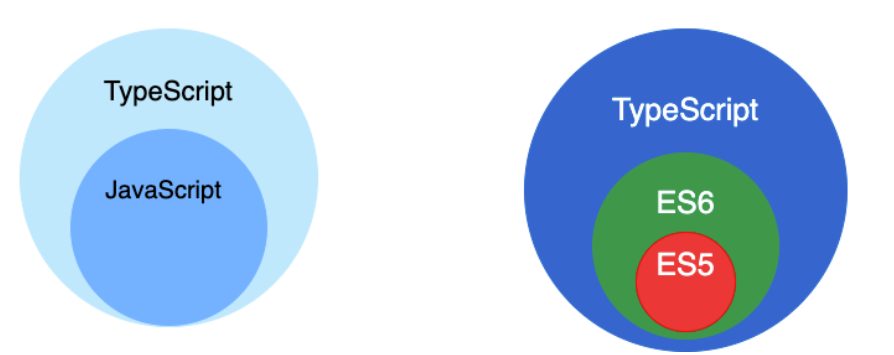

### 什么是TypeScript

> TypeScript 是一种由微软开发开源编程语言。它是 JavaScript 的一个超集，支持`ES6`语法，支持面向对象编程的概念，如类、接口、继承、泛型等。
>
> ts是一种静态类型检查的语言，提供了类型注解，在代码编译阶段就可以检查出数据类型的错误。
>
> 同时扩展了`JavaScript` 的语法，所以任何现有的`JavaScript` 程序可以不加改变的在 `TypeScript` 下工作。
>
> 为了保证兼容性，`TypeScript` 在编译阶段需要编译器编译成纯 `JavaScript` 来运行，是为大型应用之开发而设计的语言。
>
> > 简而言之，TypeScript是JavaScript的超集，具有可选的类型并可以编译为纯JavaScript。从技术上讲TypeScript就是具有静态类型的 JavaScript 。
> >
> > 超集，子集：如果一个集合 A 里面的的所有元素集合 B 里面都存在，那么我们可以理解集合 B 是集合 A 的超集，集合 A 为集合 B 的子集
> >
> > 
>
> **环境安装**
>
> * typescript：装好之后用 tsc 命令将ts转换成js，然后执行 node 就可以输出
>
> * ts-node：无需转换成js，直接运行 ts 文件

### TypeScript优缺点

> - 增强代码的可维护性，尤其在大型项目的时候效果显著
> - 友好地在编辑器里提示错误，编译阶段就能检查类型发现大部分错误
> - 支持最新的JavaScript新特特性
> - 周边生态繁荣，vue3已全面支持 typescript
>
> ### 缺点
>
> - 需要一定的学习成本
> - 和一些插件库的兼容并不是特别完美，如以前在 vue2 项目里使用 typescript就并不是那么顺畅
> - 增加前期开发的成本，毕竟你需要写更多的代码（但是便于后期的维护）

### TypeScript特性

> `TypeScript` 的特性主要有如下：
>
> - **类型批注和编译时类型检查** ：在编译时批注变量类型
> - **类型推断**：ts 中没有批注变量类型会自动推断变量的类型
> - **类型断言**：用来手动指定一个值的类型，允许覆盖它的推断
> - **类型擦除**：在编译过程中批注的内容和接口会在运行时利用工具擦除
> - **接口**：ts 中用接口来定义对象类型
> - **枚举**：用于取值被限定在一定范围内的场景
> - **Mixin**：可以接受任意类型的值
> - **泛型编程**：写代码时使用一些以后才指定的类型
> - **名字空间**：名字只在该区域内有效，其他区域可重复使用该名字而不冲突
> - **元组**：元组合并了不同类型的对象，相当于一个可以装不同类型数据的数组

#### 类型注解/批注

> > **含义**：TypeScript提供了很多数据类型，通过类型对变量进行限制，称之为类型注解，使用类型注解后，就不能够随意变更变量的类型
> >
> > **语法** ： `: Type`。如 `: boolean`。
> >
> > **作用** ：约定变量的数据类型。如约定 `bar` 为布尔值。
> >
> > **好处** ：
> >
> > 1. 静态编译时检查类型。类型操作不合理时，编译器会警告，如： `Type 'string' is not assignable to type 'boolean'`。
> > 2. 作为文档。在 VSCode 中将光标移到 `bar` 上时，会提示 `let bar: boolean`。
>
> 通过类型批注提供在编译时启动类型检查的静态类型，这是可选的，而且可以忽略而使用 `JavaScript` 常规的动态类型
>
> ```ts
> function Add(left: number, right: number): number {
>   return left + right;
> }
> ```
>
> 对于基本类型的批注是 `number`、`bool` 和 `string`，而弱或动态类型的结构则是 `any` 类型

#### 类型推断

> 当类型没有给出时，TypeScript 编译器利用类型推断来推断类型，如下：
>
> ```ts
> let x = 1;
> x = true; // 报错
> ```
>
> 我们没有给 x 指定明确类型的时候，typescript 会推断出 x 的类型是 number。
>
> 而如果定义的时候没有赋值(声明)，不管之后有没有赋值，都会被推断成 any 类型而完全不被类型检查：
>
> ```ts
> let x;
> x = 1; // 编译正确
> x = true; // 编译正确
> ```

#### 类型断言

> > 类型断言用来手动指定一个值的类型。允许你覆盖它的推断
> >
> > TypeScript 类型断言用来告诉编译器你比它更了解这个类型，并且它不应该再发出错误。
>
> * 尖括号写法  `<类型>值`
>
>   ```ts
>   let str: any = "to be or not to be";
>   let strLength: number = (<string>str).length;
>   ```
>
> * as 写法   `值 as 类型`
>
>   当你在 JSX 中使用 `<foo>` 的断言语法时，这会与 JSX 的语法存在歧义，因此在 tsx 语法（React 的 jsx 语法的 ts 版）中必须使用 `值 as 类型`。
>
>   ```ts
>   let str: any = "to be or not to be";
>   let strLength: number = (str as string).length;
>   ```
>
>   


### 基础类型

> `typescript` 和 `javascript`几乎一样，拥有相同的数据类型，另外在`javascript`基础上提供了更加实用的类型供开发使用
>
> 在开发阶段，可以为明确的变量定义为某种类型，这样`typescript`就能在编译阶段进行类型检查，当类型不合符预期结果的时候则会出现错误提示
>
> 和`javascript`基本一致，也分成：
>
> - 基本类型
> - 引用类型
>
> 在基础类型上，`typescript`增添了`void`、`any`、`enum`等原始类型
>
> * boolean（布尔类型）
> * number（数字类型）
> * string（字符串类型）
> * array（数组类型）
> * tuple（元组类型）
> * enum（枚举类型）
> * any（任意类型）
> * null 和 undefined 类型
> * void 类型
> * never 类型
> * object 对象类型

#### boolean

> 布尔类型
>
> ```ts
> let flag:boolean = true;
> // flag = 123; // 错误
> flag = false;  //正确
> ```
>
> 

#### number

> 数字类型
>
> 数字类型，和`javascript`一样，`typescript`的数值类型都是浮点数，可支持二进制、八进制、十进制和十六进制
>
> ```ts
> let num:number = 123;
> // num = '456'; // 错误
> num = 456;  //正确
> ```
>
> 进制表示
>
> ```ts
> let decLiteral: number = 6; // 十进制
> let hexLiteral: number = 0xf00d; // 十六进制
> let binaryLiteral: number = 0b1010; // 二进制
> let octalLiteral: number = 0o744; // 八进制
> ```

#### string

> 字符串类型，和`JavaScript`一样，可以使用双引号（`"`）或单引号（`'`）表示字符串
>
> ```ts
> let str:string = 'this is ts';
> str = 'test';
> ```
>
> 作为超集，当然也可以使用模版字符串``进行包裹，通过 ${} 嵌入变量
>
> ```ts
> let name: string = `Gene`;
> let age: number = 37;
> let sentence: string = `Hello, my name is ${ name }
> ```

#### array

> 数组类型，跟`javascript`一致，通过`[]`进行包裹，有两种写法：
>
> 方式一：元素类型后面接上 `[]`
>
> ```ts
>  let arr:string[] = ['12', '23'];
>  arr = ['45', '56'];
> ```
>
> 方式二：使用数组泛型，`Array<元素类型>`：
>
> ```ts
> let arr:Array<number> = [1, 2];
> arr = ['45', '56'];
> ```

#### tuple

> 元组类型，允许表示一个已知元素数量和类型的数组，各元素的类型不必相同，可以理解为他是一种特殊的数组
>
> ```ts
> let tupleArr:[number, string, boolean];
> tupleArr = [12, '34', true]; //ok
> typleArr = [12, '34'] // no ok
> ```
>
> 赋值的类型、位置、个数需要和定义（生明）的类型、位置、个数一致
>
> > 需要注意的是，元组类型只能表示一个已知元素数量和类型的数组，长度已指定，越界访问会提示错误。例如，一个数组中可能有多种类型，数量和类型都不确定，那就直接any[]。

#### enum

> 枚举是 TypeScript 添加的新特性，用于描述一个值可能是多个常量中的一个。当一个变量有几种可能的取值时,可以将它定义为枚举类型
>
> 通俗来说，枚举就是一个对象的所有可能取值的集合
>
> 在日常生活中也很常见，例如表示星期的SUNDAY、MONDAY、TUESDAY、WEDNESDAY、THURSDAY、FRIDAY、SATURDAY就可以看成是一个枚举
>
> 使用枚举类型可以为`一组数值赋予友好的名字`。
>
> 枚举（Enum）类型用于取值被限定在一定范围内的场景，比如一周只能有七天，颜色限定为红绿蓝等。
>
> ```ts
> // 枚举使用 enum 关键字来定义：
> enum Days {Sun, Mon, Tue, Wed, Thu, Fri, Sat};
> // 枚举成员会被赋值为从 0 开始递增的数字，同时也会对枚举值到枚举名进行反向映射：
> let c:Days = Days.Sat;
> console.log(c); // 6
> console.log(Days["Sun"]); // 0
> console.log(Days[0]);     // Sun
> console.log(Days.Mon);    // 1 
> console.log(Days.Tue);    // 2
> console.log(Days.Wed);    // 3
> ```

#### any

> 可以指定任何类型的值，在编程阶段还不清楚类型的变量指定一个类型，不希望类型检查器对这些值进行检查而是直接让它们通过编译阶段的检查，这时候可以使用`any`类型
>
> 使用`any`类型允许被赋值为任意类型，甚至可以调用其属性、方法
>
> ```ts
> let num:any = 123;
> num = 'str';
> num = true;
> ```
>
> 定义存储各种类型数据的数组时，示例代码如下：
>
> ```ts
> let arrayList: any[] = [1, false, 'fine'];
> arrayList[1] = 100;
> ```

#### null  undefined

> 在`JavaScript` 中 `null`表示 "什么都没有"，是一个只有一个值的特殊类型，表示一个空对象引用，而`undefined`表示一个没有设置值的变量
>
> 默认情况下`null`和`undefined`是所有类型的子类型， 就是说你可以把 `null`和 `undefined`赋值给 `number`类型的变量
>
> ```ts
> let num:number | undefined; // 数值类型 或者 undefined
> console.log(num); // 正确
> num = 123;
> console.log(num); // 正确
> ```
>
> 但是`ts`配置了`--strictNullChecks`标记，`null`和`undefined`只能赋值给`void`和它们各自

#### void

> 用于标识方法返回值的类型，表示该方法没有返回值。
>
> ```ts
> function hello(): void {
>     alert("Hello Runoob");
> }
> ```

#### never

> `never`是其他类型 （包括`null`和 `undefined`）的子类型，可以赋值给任何类型，代表从不会出现的值
>
> 但是没有类型是 never 的子类型，这意味着声明 `never` 的变量只能被 `never` 类型所赋值。
>
> `never` 类型一般用来指定那些总是会抛出异常、无限循环
>
> ```ts
> let a:never;
> a = 123; // 错误的写法
> 
> a = (() => { // 正确的写法
>   throw new Error('错误');
> })()
> 
> // 返回never的函数必须存在无法达到的终点
> function error(message: string): never {
>     throw new Error(message);
> }
> ```

#### object

> 对象类型，非原始类型，常见的形式通过`{}`进行包裹
>
> ```ts
> let obj:object;
> obj = {name: 'Wang', age: 25};
> ```

### 枚举类型的理解

> 枚举是 TypeScript 添加的新特性，用于描述一个值可能是多个常量中的一个。当一个变量有几种可能的取值时,可以将它定义为枚举类型
>
> 通俗来说，枚举就是一个对象的所有可能取值的集合
>
> 在日常生活中也很常见，例如表示星期的SUNDAY、MONDAY、TUESDAY、WEDNESDAY、THURSDAY、FRIDAY、SATURDAY就可以看成是一个枚举
>
> 枚举的说明与结构和联合相似，其形式为：
>
> ```ts
> enum 枚举名{
>     标识符①[=整型常数],
>     标识符②[=整型常数],
>     ...
>     标识符N[=整型常数],
> }枚举变量;
> ```
>
> **使用**
>
> 枚举的使用是通过`enum`关键字进行定义，形式如下：
>
> ```ts
> enum xxx { ... }
> ```
>
> 声明关键字为枚举类型的方式如下：
>
> ```ts
> // 声明d为枚举类型Direction
> let d: Direction;
> ```
>
> 类型可以分成：
>
> - 数字枚举
> - 字符串枚举
> - 异构枚举
>
> **应用场景**
>
> 后端返回的字段使用 0 - 6 标记对应的日期，这时候就可以使用枚举可提高代码可读性，如下：
>
> ```ts
> enum Days {Sun, Mon, Tue, Wed, Thu, Fri, Sat};
> 
> console.log(Days["Sun"] === 0); // true
> console.log(Days["Mon"] === 1); // true
> console.log(Days["Tue"] === 2); // true
> console.log(Days["Sat"] === 6); // true
> ```
>
> 包括后端日常返回0、1 等等状态的时候，我们都可以通过枚举去定义，这样可以提高代码的可读性，便于后续的维护
>
> 
>
> **数字枚举**
>
> 当我们声明一个枚举类型是,虽然没有给它们赋值,但是它们的值其实是默认的数字类型,而且默认从0开始依次累加:
>
> ```ts
> enum Direction {
>     Up,   // 值默认为 0
>     Down, // 值默认为 1
>     Left, // 值默认为 2
>     Right // 值默认为 3
> }
> 
> console.log(Direction.Up === 0); // true
> console.log(Direction.Down === 1); // true
> ```
>
> 如果我们将第一个值进行赋值后，后面的值也会根据前一个值进行累加1：
>
> ```ts
> enum Direction {
>     Up = 10,
>     Down,
>     Left,
>     Right
> }
> 
> console.log(Direction.Up, Direction.Down, Direction.Left, Direction.Right); // 10 11 12 13
> ```
>
> **字符串枚举**
>
> ```ts
> //枚举类型的值其实也可以是字符串类型：
> 
> enum Direction {
>     Up = 'Up',
>     Down = 'Down',
>     Left = 'Left',
>     Right = 'Right'
> }
> 
> console.log(Direction['Right'], Direction.Up); // Right Up
> ```
>
> 如果设定了一个变量为字符串之后，后续的字段也需要赋值字符串，否则报错：
>
> ```ts
> enum Direction {
>  Up = 'UP',
>  Down, // error TS1061: Enum member must have initializer
>  Left, // error TS1061: Enum member must have initializer
>  Right // error TS1061: Enum member must have initializer
> }
> ```
>
> **异构枚举**
>
> 将数字枚举和字符串枚举结合起来混合起来使用，如下：
>
> ```ts
> enum BooleanLikeHeterogeneousEnum {
>     No = 0,
>     Yes = "YES",
> }
> ```
>
> 通常情况下我们很少会使用异构枚举

### 接口的理解

> 在 TypeScript 中，我们使用接口（Interfaces）来定义对象的类型。
>
> 在面向对象语言中，接口（Interfaces）是一个很重要的概念，它是对行为的抽象，而具体如何行动需要由类（classes）去实现（implement）。
>
> 简单来讲，一个接口所描述的是一个对象相关的属性和方法，但并不提供具体创建此对象实例的方法
>
> > TypeScript 中的接口是一个非常灵活的概念，除了可用于[对类的一部分行为进行抽象](https://ts.xcatliu.com/advanced/class-and-interfaces.html#类实现接口)以外，也常用于对「对象的形状（Shape）」进行描述。
> >
> > `typescript`的核心功能之一就是对类型做检测，虽然这种检测方式是“鸭式辨型法”，而接口的作用就是为为这些类型命名和为你的代码或第三方代码定义一个约定
>
> **使用方法**
>
> 接口定义如下：
>
> ```ts
> interface interface_name {
> }
> ```
>
> **简单例子**
>
> https://ts.xcatliu.com/basics/type-of-object-interfaces.html
>
> https://jkchao.github.io/typescript-book-chinese/#why
>
> https://ts.yayujs.com/handbook/TheBasics.html#%E5%9F%BA%E7%A1%80-the-basics

