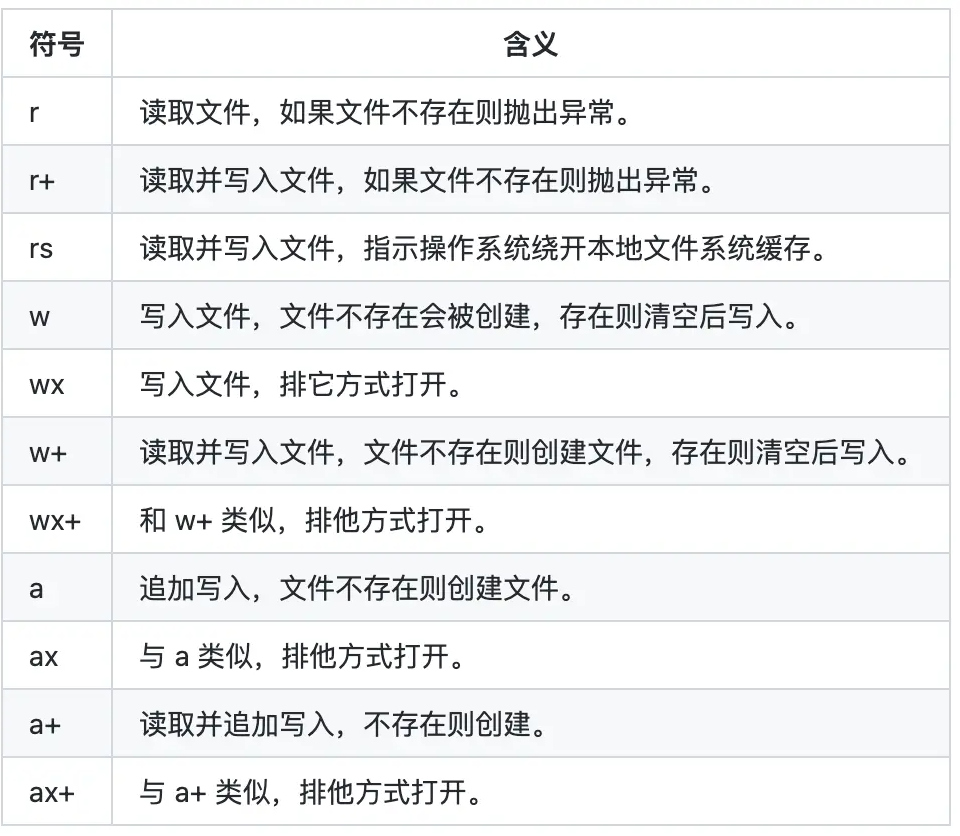

## 对Node.js的理解

> Node. js是一个基于 Chrome v8引擎的开源与跨平台的服务器端 JavaScript运行环境；
>
> 在浏览器外运行 V8 JavaScript 引擎（Google Chrome 的内核），利用`事件驱动`、`非阻塞`和`异步输入输出模型`等技术提高性能。
>
> > 可以理解为：Node.js 就是一个服务器端的、非阻塞式I/O的、事件驱动的JavaScript运行环境。而却Node. js的包管理器npm是全球最大的开源库生态系统。

> - **事件驱动：** 事件驱动就是当进来一个新的请求的时，请求将会被压入一个事件队列中，然后通过一个循环来检测队列中的事件状态变化，如果检测到有状态变化的事件，那么就执行该事件对应的处理代码，一般都是回调函数。
>
>   比如，读取一个文件，文件读取完毕后，就会触发对应的状态，然后通过对应的回调函数来进行处理。
>
> - **非阻塞异步：** Nodejs采用了非阻塞型I/O机制，在做I/O操作的时候不会造成任何的阻塞，当完成之后，以时间的形式通知执行操作。
>
>   例如，在执行了访问数据库的代码之后，将立即转而执行其后面的代码，把数据库返回结果的处理代码放在回调函数中，从而提高了程序的执行效率。
>
>   

## Node.js优缺点

> 优点：
>
> - 处理高并发场景性能更佳
> - 适合I/O密集型应用，值的是应用在运行极限时，CPU占用率仍然比较低，大部分时间是在做 I/O硬盘内存读写操作
> - 轻量级， Node. js本身既是代码又是服务器，前后端使用同一语言。
> - 可扩展，可以轻松应对多实例、多服务器架构，同时有海量的第三方应用组件。
>
> 因为`Nodejs`是单线程，带来的缺点有：
>
> - 不适合CPU密集型应用
> - 只支持单核CPU，不能充分利用CPU
> - 可靠性低，一旦代码某个环节崩溃，整个系统都崩溃

## Node.js应用场景

> 借助`Nodejs`的特点和弊端，其应用场景分类如下：
>
> - 善于`I/O`，不善于计算。因为Nodejs是一个单线程，如果计算（同步）太多，则会阻塞这个线程
> - 大量并发的I/O，应用程序内部并不需要进行非常复杂的处理
> - 与 websocket 配合，开发长连接的实时交互应用程序
> - 轻量级， Node. js本身既是代码又是服务器，前后端使用同一语言。
>
> 具体场景可以表现为如下：
>
> - 第一大类：用户表单收集系统、后台管理系统、实时交互系统、考试系统、联网软件、高并发量的web应用程序
> - 第二大类：基于web、canvas等多人联网游戏
> - 第三大类：基于web的多人实时聊天客户端、聊天室、图文直播
> - 第四大类：单页面浏览器应用程序 SPA
> - 第五大类：操作数据库、为前端和移动端提供基于`json`的API
>
> 其实，`Nodejs`能实现几乎一切的应用，只考虑适不适合使用它

## node的构架是什么样子的

> 主要分为三层
>
> 应用app >> V8及node内置架构 >> 操作系统. 
>
> V8是node运行的环境，可以理解为node虚拟机．
>
> node内置架构又可分为三层: 核心模块(javascript实现) >> c++绑定 >> libuv + CAes + http.
>
> 

## Node.js与JavaScript对比

| JavaScript                                                   | Node.js                                                      |
| ------------------------------------------------------------ | ------------------------------------------------------------ |
| JavaScript是—种编程语言,可以在任何具有合适浏览器引擎的网络浏览器中运行。 | Node.js是一个为JavaScript设计的解释器和运行时环境。Node.js内置了一些增强JavaScript编程功能模块。 |
| 除了Node.js，JavaScript用于网络应用程序的客户端,特别是用于开发动态特性。 | Node.js 可以在任何操作系统上用于开发与系统硬件交互的应用程序，特别是对于web 后端。 |
| JavaScript可以在不同的浏览器引擎上运行，比如v8 (Google Chrome) . Spider Monkey(Firefox)和JavaScript Core(Safari) | Node.js 仅在Chrome 使用的V8引擎上运行                        |

## node有哪些核心模块

EventEmitter, Stream, FS, Net和全局对象

## **Node. js有哪些全局对象？**

> 在浏览器 `JavaScript` 中，通常`window` 是全局对象， 而 `Nodejs`中的全局对象是 `global`
>
> 在NodeJS里，是不可能在最外层定义一个变量，因为所有的用户代码都是当前模块的，只在当前模块里可用，但可以通过exports对象的使用将其传递给模块外部。
>
> 所以，在NodeJS中，用var声明的变量并不属于全局的变量，只在当前模块生效。
>
> 像global全局对象则在全局作用域中，任何全局变量、函数、对象都是该对象的一个属性值。
>
> ### 有哪些
>
> 将全局对象分成两类：
>
> - 真正的全局对象
> - 模块级别的全局变量
>

#### 真正的全局对象

> - Class:Buffer
> - process
> - console
> - clearInterval、setInterval
> - clearTimeout、setTimeout
> - global
>
> > **Class:Buffer**
> >
> > > 可以处理二进制以及非`Unicode`编码的数据
> > >
> > > 在`Buffer`类实例化中存储了原始数据。`Buffer`类似于一个整数数组，在V8堆原始存储空间给它分配了内存
> > >
> > > 一旦创建了`Buffer`实例，则无法改变大小
> >
> > #### **process**
> >
> > > 进程对象，提供有关当前进程的信息和控制，包括在执行`node`程序进程时，如果需要传递参数，我们想要获取这个参数需要在`process`内置对象中
> > >
> > > 比如写一个index.js
> > >
> > > ```js
> > > process.argv.forEach((val, index) => {
> > >     console.log(`${index}: ${val}`);
> > > })
> > > ```
> > >
> > > 执行命令 `node .\index.js 参数1 参数2`，输出如下：
> > >
> > > ```js
> > > 0: E:\MySoftware\nodejs\node.exe
> > > 1: C:\Users\DRAGON\Desktop\tmp\index.js
> > > 2: 参数1
> > > 3: 参数2
> > > ```
> >
> > **console**
> >
> > > 用来打印`stdout`（标准输出）和`stderr`（标准错误）
> > >
> > > 最常用的输入内容的方式：console.log()
> > >
> > > ```js
> > > console.log("hello"); // 控制台输出 hello
> > > ```
> > >
> > > 清空控制台：console.clear(); // 控制台清空
> > >
> > > 打印函数的调用栈：console.trace
> > >
> > > ```js
> > > function test() {
> > >     demo();
> > > }
> > > function demo() {
> > >     foo();
> > > }
> > > function foo() {
> > >     console.trace();
> > > }
> > > test();
> > > ```
> > >
> > > 控制台输出：
> > >
> > > ```js
> > > Trace
> > >     at foo (C:\Users\DRAGON\Desktop\tmp\index.js:8:13)
> > >     at demo (C:\Users\DRAGON\Desktop\tmp\index.js:5:5)
> > >     at test (C:\Users\DRAGON\Desktop\tmp\index.js:2:5)
> > >     at Object.<anonymous> (C:\Users\DRAGON\Desktop\tmp\index.js:10:1)
> > >     at Module._compile (node:internal/modules/cjs/loader:1105:14)
> > >     at Object.Module._extensions..js (node:internal/modules/cjs/loader:1159:10)
> > >     at Module.load (node:internal/modules/cjs/loader:981:32)
> > >     at Function.Module._load (node:internal/modules/cjs/loader:822:12)
> > >     at Function.executeUserEntryPoint [as runMain] (node:internal/modules/run_main:77:12)
> > >     at node:internal/main/run_main_module:17:47
> > > ```
> > >
> >
> > **setInterval、clearInterval**
> >
> > > 设置定时器与清除定时器
> > >
> > > `callback`每`delay`毫秒重复执行一次
> > >
> > > `clearInterval`则为对应发取消定时器的方法
> >
> > **setTimeout、clearTimeout**
> >
> > > 设置延时器与清除延时器
> > >
> > > ```js
> > > setTimeout(callback,delay[,...args])
> > > ```
> > >
> > > `callback`在`delay`毫秒后执行一次
> > >
> > > `clearTimeout`则为对应取消延时器的方法
> >
> > **global**
> >
> > > 全局命名空间对象，前面讲到的`process`、`console`、`setTimeout`等都有放到`global`中
> > >
> > > global 最根本的作用是作为全局变量的宿主。按照 ECMAScript 的定义，满足以下条件的变量是全局变量：
> > >
> > > * 在最外层定义的变量；
> > >
> > > * 全局对象的属性；
> > >
> > > * 隐式定义的变量（未定义直接赋值的变量）。
> > >
> > > 当你定义一个全局变量时，这个变量同时也会成为全局对象的属性，反之亦然。需要注意的是，`在 Node.js 中你不可能在最外层定义变量，因为所有用户代码都是属于当前模块的， 而模块本身不是最外层上下文`。
> > >
> > > ```js
> > > console.log(process === global.process) // true
> > > ```
>
> ****
>

#### 模块级别的全局对象

> 这些全局对象是模块中的变量，只是每个模块都有，看起来就像全局变量，像在命令交互中是不可以使用，包括：
>
> - __dirname
> - __filename
> - exports
> - module
> - require
>
> **__dirname**
>
> > 获取当前文件所在的路径，不包括后面的文件名
> >
> > 从 `C:\Users\DRAGON\Desktop\tmp` 运行 `node index.js`：
> >
> > ```js
> > console.log(__dirname);
> > // 打印：C:\Users\DRAGON\Desktop\tmp
> > ```
>
> **__filename**
>
> > 获取当前文件所在的路径和文件名称，**包括后面的文件名称**
> >
> > 从 `C:\Users\DRAGON\Desktop\tmp` 运行 `node index.js`：
> >
> > ```js
> > console.log(__filename);
> > // 打印：C:\Users\DRAGON\Desktop\tmp\index.js
> > ```
>
> **exports**
>
> > `module.exports` 用于指定一个模块所导出的内容，即可以通过 `require()` 访问的内容
> >
> > ```js
> > exports.name = name;
> > exports.age = age;
> > exports.sayHello = sayHello;
> > ```
>
> **module**
>
> > 对当前模块的引用，通过`module.exports` 用于指定一个模块所导出的内容，即可以通过 `require()` 访问的内容
>
> **require**
>
> > 用于引入模块、 `JSON`、或本地文件。 可以从 `node_modules` 引入模块。
> >
> > 可以使用相对路径引入本地模块或`JSON`文件，路径会根据`__dirname`定义的目录名或当前工作目录进行处理

## **对process的理解**

### 基本概念

我们知道，进程计算机系统进行资源分配和调度的基本单位，是操作系统结构的基础，是线程的容器。当我们启动一个js文件，实际就是开启了一个服务进程，每个进程都拥有自己的独立空间地址、数据栈，像另一个进程无法访问当前进程的变量、数据结构，只有数据通信后，进程之间才可以数据共享。

process 对象是Node的一个全局变量，提供了有关当前 Node.js 进程的信息并对其进行控制。
由于JavaScript是一个单线程语言，所以通过node xxx启动一个文件后，只有一条主线程。

### 常用属性和方法

process的常见属性如下：

- process.env：环境变量，例如通过 `process.env.NODE_ENV 获取不同环境项目配置信息
- process.nextTick：这个在谈及 EventLoop 时经常为会提到
- process.pid：获取当前进程id
- process.ppid：当前进程对应的父进程
- process.cwd()：获取当前进程工作目录
- process.platform：获取当前进程运行的操作系统平台
- process.uptime()：当前进程已运行时间，例如：pm2 守护进程的 uptime 值
  进程事件： process.on(‘uncaughtException’,cb) 捕获异常信息、 process.on(‘exit’,cb）进程推出监听
- 三个标准流： process.stdout 标准输出、 process.stdin 标准输入、 process.stderr 标准错误输出
- process.title：用于指定进程名称，有的时候需要给进程指定一个名称

process.stdin、 process.stdout、 process.stderr、process.on、 process.env、 process.argv、 process.arch、process.platform、 process.exit

## 对fs模块的理解

### fs是什么

fs（filesystem）是文件系统模块，该模块提供本地文件的读写能力，基本上是POSIX文件操作命令的简单包装。可以说，所有与文件的操作都是通过fs核心模块来实现的。

使用之前，需要先导入fs模块，如下：

```js
const fs = require('fs');
```

### 文件基础知识

计算机中，有关于文件的基础知识有如下一些：

- 权限位 mode
- 标识位 flag
- 文件描述为 fd

#### 权限位mode


针对文件所有者、文件所属组、其他用户进行权限分配，其中类型又分成读、写和执行，具备权限位4、2、1，不具备权限为0。如在linux查看文件权限位的命令如下：

```brainfuck
drwxr-xr-x 1 PandaShen 197121 0 Jun 28 14:41 core
-rw-r--r-- 1 PandaShen 197121 293 Jun 23 17:44 index.md
```

在开头前十位中，d为文件夹，-为文件，后九位就代表当前用户、用户所属组和其他用户的权限位，按每三位划分，分别代表读（r）、写（w）和执行（x），- 代表没有当前位对应的权限。

#### 标识位

标识位代表着对文件的操作方式，如可读、可写、即可读又可写等等，如下表所示：



#### 文件描述fd

操作系统会为每个打开的文件分配一个名为文件描述符的数值标识，文件操作使用这些文件描述符来识别与追踪每个特定的文件。

Window 系统使用了一个不同但概念类似的机制来追踪资源，为方便用户，NodeJS 抽象了不同操作系统间的差异，为所有打开的文件分配了数值的文件描述符。

在 NodeJS 中，每操作一个文件，文件描述符是递增的，文件描述符一般从 3 开始，因为前面有 0、1、2三个比较特殊的描述符，分别代表 process.stdin（标准输入）、process.stdout（标准输出）和 process.stderr（错误输出）。

### 常用方法

由于fs模块主要是操作文件的，所以常见的文件操作方法有如下一些：

- 文件读取
- 文件写入
- 文件追加写入
- 文件拷贝
- 创建目录

#### 文件读取

常用的文件读取有readFileSync和readFile两个方法。

`readFileSync表示同步读取`，如下：

```js
const fs = require("fs");

let buf = fs.readFileSync("1.txt");
let data = fs.readFileSync("1.txt", "utf8");

console.log(buf); // <Buffer 48 65 6c 6c 6f>
console.log(data); // Hello
```

- 第一个参数为读取文件的路径或文件描述符。
- 第二个参数为 options，默认值为 null，其中有 encoding（编码，默认为 null）和 flag（标识位，默认为 r），也可直接传入 encoding。

`readFile为异步读取方法`， readFile 与 readFileSync 的前两个参数相同，最后一个参数为回调函数，函数内有两个参数 err（错误）和 data（数据），该方法没有返回值，回调函数在读取文件成功后执行。

```javascript
const fs = require("fs");

fs.readFile("1.txt", "utf8", (err, data) => {
   if(!err){
       console.log(data);         // Hello
   }
});
```

#### 文件写入

文件写入需要用到writeFileSync和writeFile两个方法。

`writeFileSync表示同步写入`，如下所示。

```js
const fs = require("fs");

fs.writeFileSync("2.txt", "Hello world");
let data = fs.readFileSync("2.txt", "utf8");

console.log(data); // Hello world
```

- 第一个参数为写入文件的路径或文件描述符。
- 第二个参数为写入的数据，类型为 String 或 Buffer。
- 第三个参数为 options，默认值为 null，其中有 encoding（编码，默认为 utf8）、 flag（标识位，默认为 w）和 mode（权限位，默认为 0o666），也可直接传入 encoding。

`writeFile表示异步写入`，writeFile 与 writeFileSync 的前三个参数相同，最后一个参数为回调函数，函数内有一个参数 err（错误），回调函数在文件写入数据成功后执行。

```javascript
const fs = require("fs");

fs.writeFile("2.txt", "Hello world", err => {
    if (!err) {
        fs.readFile("2.txt", "utf8", (err, data) => {
            console.log(data);       // Hello world
        });
    }
});
```

#### 文件追加写入

文件追加写入需要用到appendFileSync和appendFile两个方法。

`appendFileSync表示同步写入`，如下。

```js
const fs = require("fs");

fs.appendFileSync("3.txt", " world");
let data = fs.readFileSync("3.txt", "utf8");
```

- 第一个参数为写入文件的路径或文件描述符。
- 第二个参数为写入的数据，类型为 String 或 Buffer。
- 第三个参数为 options，默认值为 null，其中有 encoding（编码，默认为 utf8）、 flag（标识位，默认为 a）和 mode（权限位，默认为 0o666），也可直接传入 encoding。

`appendFile表示异步追加写入`，方法 appendFile 与 appendFileSync 的前三个参数相同，最后一个参数为回调函数，函数内有一个参数 err（错误），回调函数在文件追加写入数据成功后执行，如下所示。

```javascript
const fs = require("fs");

fs.appendFile("3.txt", " world", err => {
    if (!err) {
        fs.readFile("3.txt", "utf8", (err, data) => {
            console.log(data); // Hello world
        });
    }
});
```

#### 文件拷贝

#### 创建目录

创建目录主要有mkdirSync和mkdir两个方法。

`mkdirSync为同步创建`，参数为一个目录的路径，没有返回值，在创建目录的过程中，必须保证传入的路径前面的文件目录都存在，否则会抛出异常。

```js
// 假设已经有了 a 文件夹和 a 下的 b 文件夹
fs.mkdirSync("a/b/c")
```

`mkdir为异步创建`，第二个参数为回调函数，如下所示。

```js
fs.mkdir("a/b/c", err => {
    if (!err) console.log("创建成功");
});
```

## 对Stream的理解

### 基本概念

流（Stream）是一种数据传输的手段，是一种端到端信息交换的方式，而且是有顺序的，是逐块读取数据、处理内容，用于顺序读取输入或写入输出。在Node中，Stream分成三部分：source、dest、pipe。

其中，在source和dest之间有一个连接的管道pipe，它的基本语法是source.pipe(dest)，source和dest就是通过pipe连接，让数据从source流向dest，如下图所示：


### 流的分类

在Node，流可以分成四个种类：

- **可写流**：可写入数据的流，例如 fs.createWriteStream() 可以使用流将数据写入文件。
- **可读流**： 可读取数据的流，例如fs.createReadStream() 可以从文件读取内容。
- **双工流**： 既可读又可写的流，例如 net.Socket。
- **转换流**： 可以在数据写入和读取时修改或转换数据的流。例如，在文件压缩操作中，可以向文件写入压缩数据，并从文件中读取解压数据。

在Node的HTTP服务器模块中，request 是可读流，response 是可写流。对于fs 模块来说，能同时处理可读和可写文件流可读流和可写流都是单向的，比较容易理解。而Socket是双向的，可读可写。

#### 双工流

在Node中，比较的常见的全双工通信就是websocket，因为发送方和接受方都是各自独立的方法，发送和接收都没有任何关系。

基本的使用方法如下：

```javascript
const { Duplex } = require('stream');

const myDuplex = new Duplex({
  read(size) {
    // ...
  },
  write(chunk, encoding, callback) {
    // ...
  }
});
```

### 使用场景

流的常见使用场景有：

- get请求返回文件给客户端
- 文件操作
- 一些打包工具的底层操作

#### 网络请求

流一个常见的使用场景就是网络请求，比如使用stream流返回文件，res也是一个stream对象，通过pipe管道将文件数据返回。

```js
const server = http.createServer(function (req, res) {
    const method = req.method;  
    // get 请求
    if (method === 'GET') { 
        const fileName = path.resolve(__dirname, 'data.txt');
        let stream = fs.createReadStream(fileName);
        stream.pipe(res);   
    }
});
server.listen(8080);
```

#### 文件操作

文件的读取也是流操作，创建一个可读数据流readStream，一个可写数据流writeStream，通过pipe管道把数据流转过去。

```javascript
const fs = require('fs')
const path = require('path')

// 两个文件名
const fileName1 = path.resolve(__dirname, 'data.txt')
const fileName2 = path.resolve(__dirname, 'data-bak.txt')
// 读取文件的 stream 对象
const readStream = fs.createReadStream(fileName1)
// 写入文件的 stream 对象
const writeStream = fs.createWriteStream(fileName2)
// 通过 pipe执行拷贝，数据流转
readStream.pipe(writeStream)
// 数据读取完成监听，即拷贝完成
readStream.on('end', function () {
    console.log('拷贝完成')
})
```

另外，一些打包工具，Webpack和Vite等都涉及很多流的操作。

## 事件循环机制

### 什么是浏览器事件循环

Node.js 在主线程里维护了一个事件队列，当接到请求后，就将该请求作为一个事件放入这个队列中，然后继续接收其他请求。当主线程空闲时(没有请求接入时)，就开始循环事件队列，检查队列中是否有要处理的事件，这时要分两种情况：如果是非 I/O 任务，就亲自处理，并通过回调函数返回到上层调用；如果是 I/O 任务，就从 线程池 中拿出一个线程来处理这个事件，并指定回调函数，然后继续循环队列中的其他事件。

当线程中的 I/O 任务完成以后，就执行指定的回调函数，并把这个完成的事件放到事件队列的尾部，等待事件循环，当主线程再次循环到该事件时，就直接处理并返回给上层调用。 这个过程就叫 事件循环 (Event Loop)，其运行原理如下图所示。


### 事件循环的六个阶段

事件循环一共可以分成了六个阶段，如下图所示。


- timers阶段：此阶段主要执行timer（setTimeout、setInterval）的回调。
- I/O事件回调阶段(I/O callbacks)：执行延迟到下一个循环迭代的 I/O 回调，即上一轮循环中未被执行的一些I/O回调。
- 闲置阶段(idle、prepare)：仅系统内部使用。
- 轮询阶段(poll)：检索新的 I/O 事件;执行与 I/O 相关的回调（几乎所有情况下，除了关闭的回调函数，那些由计时器和 setImmediate() 调度的之外），其余情况 node 将在适当的时候在此阻塞。
- 检查阶段(check)：setImmediate() 回调函数在这里执行
- 关闭事件回调阶段(close callback)：一些关闭的回调函数，如：socket.on('close', ...)

每个阶段对应一个队列，当事件循环进入某个阶段时, 将会在该阶段内执行回调，直到队列耗尽或者回调的最大数量已执行, 那么将进入下一个处理阶段，如下图所示。


## EventEmitter

### 基本概念

前文说过，Node采用了事件驱动机制，而EventEmitter 就是Node实现事件驱动的基础。在EventEmitter的基础上，Node 几乎所有的模块都继承了这个类，这些模块拥有了自己的事件，可以绑定、触发监听器，实现了异步操作。

Node.js 里面的许多对象都会分发事件，比如 fs.readStream 对象会在文件被打开的时候触发一个事件，这些产生事件的对象都是 events.EventEmitter 的实例，用于将一个或多个函数绑定到命名事件上。

### 基本使用

Node的events模块只提供了一个EventEmitter类，这个类实现了Node异步事件驱动架构的基本模式：观察者模式。

在这种模式中，被观察者(主体)维护着一组其他对象派来(注册)的观察者，有新的对象对主体感兴趣就注册观察者，不感兴趣就取消订阅，主体有更新会依次通知观察者，使用方式如下。

```js
const EventEmitter = require('events')

class MyEmitter extends EventEmitter {}
const myEmitter = new MyEmitter()

function callback() {
    console.log('触发了event事件！')
}
myEmitter.on('event', callback)
myEmitter.emit('event')
myEmitter.removeListener('event', callback);
```

在上面的代码中，我们通过实例对象的`on`方法注册一个名为event的事件，通过`emit`方法触发该事件，而`removeListener`用于取消事件的监听。

除了上面介绍的一些方法外，其他常用的方法还有如下一些：

- **emitter.addListener/on(eventName, listener)** ：添加类型为 eventName 的监听事件到事件数组尾部。
- **emitter.prependListener(eventName, listener)**：添加类型为 eventName 的监听事件到事件数组头部。
- **emitter.emit(eventName[, ...args])**：触发类型为 eventName 的监听事件。
- **emitter.removeListener/off(eventName, listener)**：移除类型为 eventName 的监听事件。
- **emitter.once(eventName, listener)**：添加类型为 eventName 的监听事件，以后只能执行一次并删除。
- **emitter.removeAllListeners([eventName])**： 移除全部类型为 eventName 的监听事件。


### 实现原理

EventEmitter其实是一个构造函数，内部存在一个包含所有事件的对象。

```javascript
class EventEmitter {
    constructor() {
        this.events = {};
    }
}
```

其中，events存放的监听事件的函数的结构如下：

```js
{
  "event1": [f1,f2,f3]，
  "event2": [f4,f5]，
  ...
}
```

然后，开始一步步实现实例方法，首先是emit，第一个参数为事件的类型，第二个参数开始为触发事件函数的参数，实现如下：

```js
emit(type, ...args) {
    this.events[type].forEach((item) => {
        Reflect.apply(item, this, args);
    });
}
```

实现了emit方法之后，然后依次实现on、addListener、prependListener这三个实例方法，它们都是添加事件监听触发函数的。

```js
on(type, handler) {
    if (!this.events[type]) {
        this.events[type] = [];
    }
    this.events[type].push(handler);
}

addListener(type,handler){
    this.on(type,handler)
}

prependListener(type, handler) {
    if (!this.events[type]) {
        this.events[type] = [];
    }
    this.events[type].unshift(handler);
}
```

移除事件监听，可以使用方法removeListener/on。

```js
removeListener(type, handler) {
    if (!this.events[type]) {
        return;
    }
    this.events[type] = this.events[type].filter(item => item !== handler);
}

off(type,handler){
    this.removeListener(type,handler)
}
```

实现once方法， 再传入事件监听处理函数的时候进行封装，利用闭包的特性维护当前状态，通过fired属性值判断事件函数是否执行过。

```js
once(type, handler) {
    this.on(type, this._onceWrap(type, handler, this));
  }

  _onceWrap(type, handler, target) {
    const state = { fired: false, handler, type , target};
    const wrapFn = this._onceWrapper.bind(state);
    state.wrapFn = wrapFn;
    return wrapFn;
  }

  _onceWrapper(...args) {
    if (!this.fired) {
      this.fired = true;
      Reflect.apply(this.handler, this.target, args);
      this.target.off(this.type, this.wrapFn);
    }
 }
```

下面是完成的测试代码：

```js
class EventEmitter {
    constructor() {
        this.events = {};
    }

    on(type, handler) {
        if (!this.events[type]) {
            this.events[type] = [];
        }
        this.events[type].push(handler);
    }

    addListener(type,handler){
        this.on(type,handler)
    }

    prependListener(type, handler) {
        if (!this.events[type]) {
            this.events[type] = [];
        }
        this.events[type].unshift(handler);
    }

    removeListener(type, handler) {
        if (!this.events[type]) {
            return;
        }
        this.events[type] = this.events[type].filter(item => item !== handler);
    }

    off(type,handler){
        this.removeListener(type,handler)
    }

    emit(type, ...args) {
        this.events[type].forEach((item) => {
            Reflect.apply(item, this, args);
        });
    }

    once(type, handler) {
        this.on(type, this._onceWrap(type, handler, this));
    }

    _onceWrap(type, handler, target) {
        const state = { fired: false, handler, type , target};
        const wrapFn = this._onceWrapper.bind(state);
        state.wrapFn = wrapFn;
        return wrapFn;
    }

    _onceWrapper(...args) {
        if (!this.fired) {
            this.fired = true;
            Reflect.apply(this.handler, this.target, args);
            this.target.off(this.type, this.wrapFn);
        }
    }
}
```

## Node性能优化

关于Node的性能优化的方式有如下几个：

- 使用最新版本Node.js
- 正确使用流 Stream
- 代码层面优化
- 内存管理优化

### 使用最新版本Node.js

每个版本的性能提升主要来自于两个方面：

- V8 的版本更新
- Node.js 内部代码的更新优化

### 正确使用流

在Node中，很多对象都实现了流，对于一个大文件可以通过流的形式发送，不需要将其完全读入内存。

```js
const http = require('http');
const fs = require('fs');

// 错误方式
http.createServer(function (req, res) {
    fs.readFile(__dirname + '/data.txt', function (err, data) {
        res.end(data);
    });
});

// 正确方式
http.createServer(function (req, res) {
    const stream = fs.createReadStream(__dirname + '/data.txt');
    stream.pipe(res);
});
```

### 代码层面优化

合并查询，将多次查询合并一次，减少数据库的查询次数。

```js
// 错误方式
for user_id in userIds 
     let account = user_account.findOne(user_id)

// 正确方式
const user_account_map = {}  
 // 注意这个对象将会消耗大量内存。
user_account.find(user_id in user_ids).forEach(account){
    user_account_map[account.user_id] =  account
}
for user_id in userIds 
    var account = user_account_map[user_id]
```

### 内存管理优化

在 V8 中，主要将内存分为新生代和老生代两代：

- **新生代**：对象的存活时间较短。新生对象或只经过一次垃圾回收的对象。
- **老生代**：对象存活时间较长。经历过一次或多次垃圾回收的对象。

若新生代内存空间不够，直接分配到老生代。通过减少内存占用，可以提高服务器的性能。如果有内存泄露，也会导致大量的对象存储到老生代中，服务器性能会大大降低，比如下面的例子。

```js
const buffer = fs.readFileSync(__dirname + '/source/index.htm');

app.use(
    mount('/', async (ctx) => {
        ctx.status = 200;
        ctx.type = 'html';
        ctx.body = buffer;
        leak.push(fs.readFileSync(__dirname + '/source/index.htm'));
    })
);

const leak = [];
```

当leak的内存非常大的时候，就有可能造成内存泄露，应当避免这样的操作。

减少内存使用，可以明显的提高服务性能。而节省内存最好的方式是使用池，其将频用、可复用对象存储起来，减少创建和销毁操作。例如有个图片请求接口，每次请求，都需要用到类。若每次都需要重新new这些类，并不是很合适，在大量请求时，频繁创建和销毁这些类，造成内存抖动。而使用对象池的机制，对这种频繁需要创建和销毁的对象保存在一个对象池中，从而避免重读的初始化操作，从而提高框架的性能。


## **console有哪些常用方法？**

console.log/console. info、console.error/console.warning、console.time/console.timeEnd 、console.trace、console .table。

## **Node.js有哪些定时功能？**

setTimeout/clearTimeout, setInterval/clearInterval、 setImmediate/clearImmediate、 process. nextTick。

## 参考链接

1. 【前端面试题】—53道常见NodeJS基础面试题（附答案）：https://jishuin.proginn.com/p/763bfbd4ec80
2. 15 个常见的 Node.js 面试问题及答案：https://www.infoq.cn/article/qbjxf0413reeca2exgwd
3. node-interview-questions：https://github.com/jimuyouyou/node-interview-questions
4. 菜鸟教程：https://www.runoob.com/nodejs/nodejs-tutorial.html
4. https://fairyly.github.io/interview/5.1.2%20node%20%E5%B8%B8%E8%A7%81%E9%9D%A2%E8%AF%95%E9%A2%98.html
4. https://segmentfault.com/a/1190000040937008


。。。
