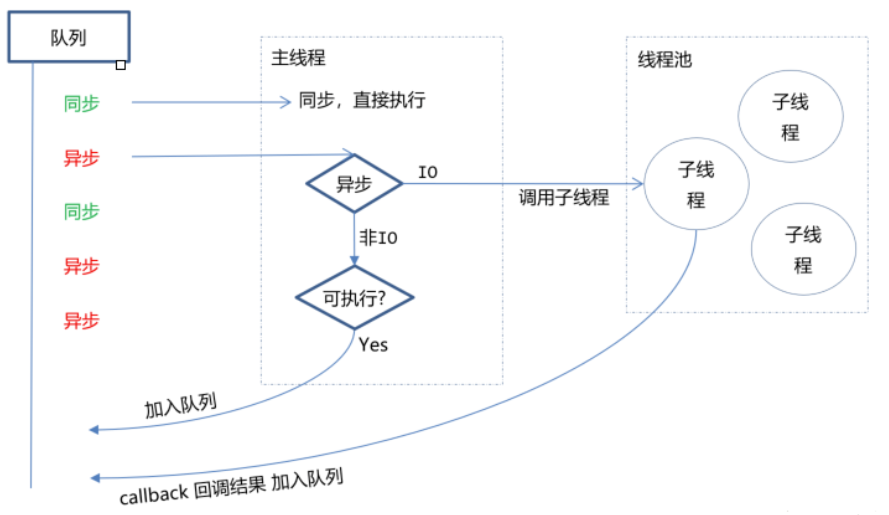
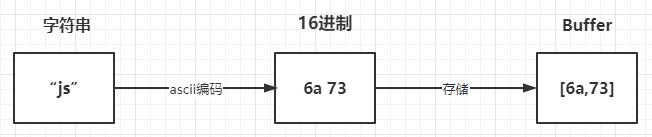
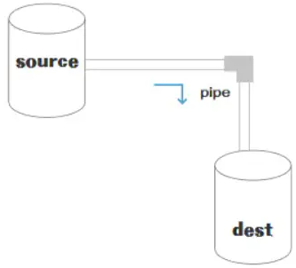
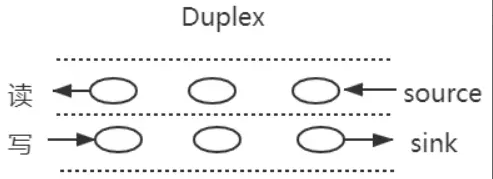
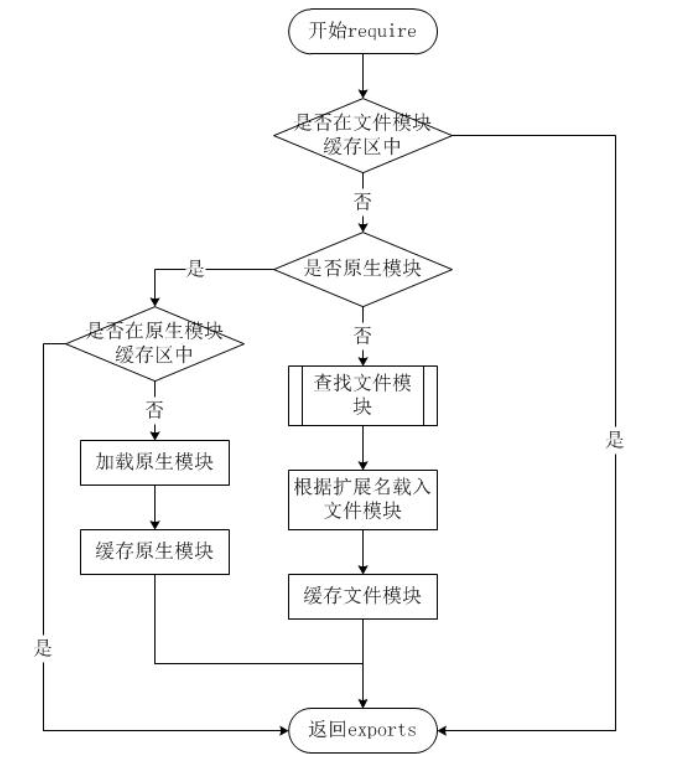
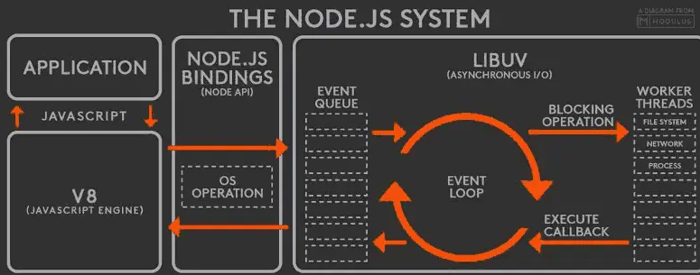
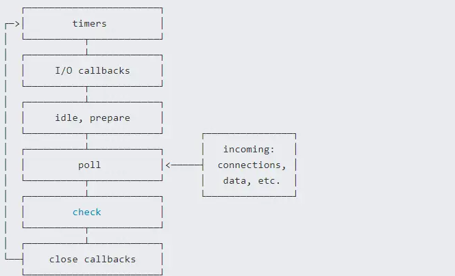
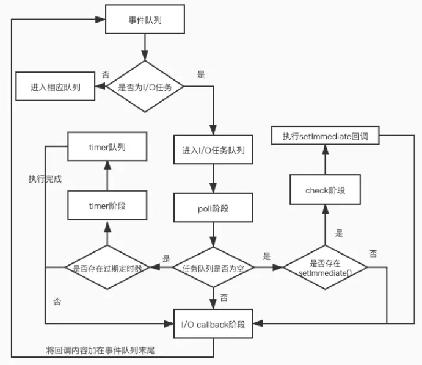
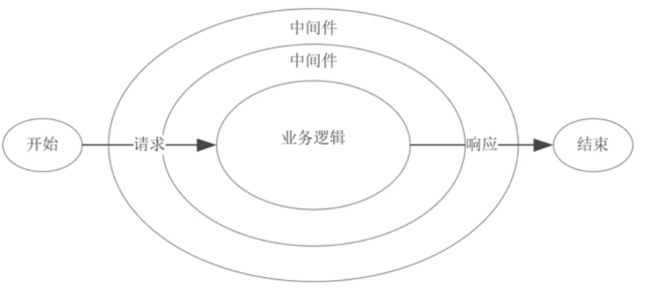

## 对Node.js的理解

> Node. js是一个基于 Chrome v8引擎的开源与跨平台的服务器端 JavaScript运行环境；
>
> 在浏览器外运行 V8 JavaScript 引擎（Google Chrome 的内核），利用`事件驱动`、`非阻塞`和`异步输入输出模型`等技术提高性能。
>
> > 可以理解为：Node.js 就是一个服务器端的、非阻塞式I/O的、事件驱动的JavaScript运行环境。而却Node. js的包管理器npm是全球最大的开源库生态系统。

> - **事件驱动：** 事件驱动就是当进来一个新的请求的时候，请求将会被压入一个事件队列中，然后通过一个循环来检测队列中的事件状态变化，如果检测到有状态变化的事件，那么就执行该事件对应的处理代码，一般都是回调函数。
>
>   比如，读取一个文件，文件读取完毕后，就会触发对应的状态，然后通过对应的回调函数来进行处理。
>
> - **非阻塞异步：** Nodejs采用了非阻塞型I/O机制，在`做I/O操作的时候`不会造成任何的阻塞，当完成之后，以时间的形式通知执行操作。
>
>   例如，在执行了访问数据库的代码之后，将立即转而执行其后面的代码，把数据库返回结果的处理代码放在回调函数中，从而提高了程序的执行效率。
>
>   

## Node.js优缺点

> 优点：
>
> - 处理高并发场景性能更佳
> - 适合`I/O密集型应用`，值的是应用在运行极限时，CPU占用率仍然比较低，大部分时间是在做 I/O硬盘内存读写操作
> - 轻量级， Node. js本身既是代码又是服务器，前后端使用同一语言。
> - 可扩展，可以轻松应对多实例、多服务器架构，同时有海量的第三方应用组件。
>
> 因为`Nodejs`是单线程，带来的缺点有：
>
> - 不适合`CPU密集型应用`
> - 只支持单核CPU，不能充分利用CPU
> - 可靠性低，一旦代码某个环节崩溃，整个系统都崩溃

## Node.js应用场景

> 借助`Nodejs`的特点和弊端，其应用场景分类如下：
>
> - 善于`I/O`，`不善于`计算。因为Nodejs是一个单线程，如果计算（同步）太多，则会阻塞这个线程
> - 大量并发的I/O，应用程序内部并不需要进行非常复杂的处理
> - 与 websocket 配合，开发长连接的实时交互应用程序
> - 轻量级， Node. js本身既是代码又是服务器，前后端使用同一语言。
>
> 具体场景可以表现为如下：
>
> - 第一大类：用户表单收集系统、后台管理系统、实时交互系统、考试系统、联网软件、高并发量的web应用程序
> - 第二大类：基于web、canvas等多人联网游戏
> - 第三大类：基于web的多人实时聊天客户端、聊天室、图文直播
> - 第四大类：单页面浏览器应用程序 SPA
> - 第五大类：操作数据库、为前端和移动端提供基于`json`的API
>
> 其实，`Nodejs`能实现几乎一切的应用，只考虑适不适合使用它

## node的构架是什么样子的

> 主要分为三层
>
> 应用app >> V8及node内置架构 >> 操作系统. 
>
> V8是node运行的环境，可以理解为node虚拟机．
>
> node内置架构又可分为三层: 核心模块(javascript实现) >> c++绑定 >> libuv + CAes + http.
>
> 

## Node.js与JavaScript对比

> | JavaScript                                                   | Node.js                                                      |
> | ------------------------------------------------------------ | ------------------------------------------------------------ |
> | JavaScript是—种编程语言,可以在任何具有合适浏览器引擎的网络浏览器中运行。 | Node.js是一个为JavaScript设计的解释器和运行时环境。Node.js内置了一些增强JavaScript编程功能模块。 |
> | 除了Node.js，JavaScript用于网络应用程序的客户端,特别是用于开发动态特性。 | Node.js 可以在任何操作系统上用于开发与系统硬件交互的应用程序，特别是对于web 后端。 |
> | JavaScript可以在不同的浏览器引擎上运行，比如v8 (Google Chrome) . Spider Monkey(Firefox)和JavaScript Core(Safari) | Node.js 仅在Chrome 使用的V8引擎上运行                        |

## node有哪些核心模块

EventEmitter, Stream, FS, Net和全局对象

## **Node. js有哪些全局对象？**

> 在浏览器 `JavaScript` 中，通常`window` 是全局对象， 而 `Nodejs`中的全局对象是 `global`
>
> 在NodeJS里，是不可能在最外层定义一个变量，因为所有的用户代码都是当前模块的，只在当前模块里可用，但可以通过exports对象的使用将其传递给模块外部。
>
> 所以，在NodeJS中，用var声明的变量并不属于全局的变量，只在当前模块生效。
>
> 像global全局对象则在全局作用域中，任何全局变量、函数、对象都是该对象的一个属性值。
>
> ### 有哪些
>
> 将全局对象分成两类：
>
> - 真正的全局对象
> - 模块级别的全局变量
>

#### 真正的全局对象

> - Class:Buffer
> - process
> - console
> - clearInterval、setInterval
> - clearTimeout、setTimeout
> - global
>
> > **Class:Buffer**
> >
> > > 可以处理二进制以及非`Unicode`编码的数据
> > >
> > > 在`Buffer`类实例化中存储了原始数据。`Buffer`类似于一个整数数组，在V8堆原始存储空间给它分配了内存
> > >
> > > 一旦创建了`Buffer`实例，则无法改变大小
> >
> > #### **process**
> >
> > > 进程对象，提供有关当前进程的信息和控制，包括在执行`node`程序进程时，如果需要传递参数，我们想要获取这个参数需要在`process`内置对象中
> > >
> > > 比如写一个index.js
> > >
> > > ```js
> > > process.argv.forEach((val, index) => {
> > >     console.log(`${index}: ${val}`);
> > > })
> > > ```
> > >
> > > 执行命令 `node .\index.js 参数1 参数2`，输出如下：
> > >
> > > ```js
> > > 0: E:\MySoftware\nodejs\node.exe
> > > 1: C:\Users\DRAGON\Desktop\tmp\index.js
> > > 2: 参数1
> > > 3: 参数2
> > > ```
> >
> > **console**
> >
> > > 用来打印`stdout`（标准输出）和`stderr`（标准错误）
> > >
> > > 最常用的输出内容的方式：console.log()
> > >
> > > ```js
> > > console.log("hello"); // 控制台输出 hello
> > > ```
> > >
> > > 清空控制台：console.clear(); // 控制台清空
> > >
> > > 打印函数的调用栈：console.trace
> > >
> > > ```js
> > > function test() {
> > >     demo();
> > > }
> > > function demo() {
> > >     foo();
> > > }
> > > function foo() {
> > >     console.trace();
> > > }
> > > test();
> > > ```
> > >
> > > 控制台输出：
> > >
> > > ```js
> > > Trace
> > >     at foo (C:\Users\DRAGON\Desktop\tmp\index.js:8:13)
> > >     at demo (C:\Users\DRAGON\Desktop\tmp\index.js:5:5)
> > >     at test (C:\Users\DRAGON\Desktop\tmp\index.js:2:5)
> > >     at Object.<anonymous> (C:\Users\DRAGON\Desktop\tmp\index.js:10:1)
> > >     at Module._compile (node:internal/modules/cjs/loader:1105:14)
> > >     at Object.Module._extensions..js (node:internal/modules/cjs/loader:1159:10)
> > >     at Module.load (node:internal/modules/cjs/loader:981:32)
> > >     at Function.Module._load (node:internal/modules/cjs/loader:822:12)
> > >     at Function.executeUserEntryPoint [as runMain] (node:internal/modules/run_main:77:12)
> > >     at node:internal/main/run_main_module:17:47
> > > ```
> > >
> >
> > **setInterval、clearInterval**
> >
> > > 设置定时器与清除定时器
> > >
> > > `callback`每`delay`毫秒重复执行一次
> > >
> > > `clearInterval`则为对应发取消定时器的方法
> >
> > **setTimeout、clearTimeout**
> >
> > > 设置延时器与清除延时器
> > >
> > > ```js
> > > setTimeout(callback,delay[,...args])
> > > ```
> > >
> > > `callback`在`delay`毫秒后执行一次
> > >
> > > `clearTimeout`则为对应取消延时器的方法
> >
> > **global**
> >
> > > 全局命名空间对象，前面讲到的`process`、`console`、`setTimeout`等都有放到`global`中
> > >
> > > global 最根本的作用是作为全局变量的宿主。按照 ECMAScript 的定义，满足以下条件的变量是全局变量：
> > >
> > > * 在最外层定义的变量；
> > >
> > > * 全局对象的属性；
> > >
> > > * 隐式定义的变量（未定义直接赋值的变量）。
> > >
> > > 当你定义一个全局变量时，这个变量同时也会成为全局对象的属性，反之亦然。需要注意的是，`在 Node.js 中你不可能在最外层定义变量，因为所有用户代码都是属于当前模块的， 而模块本身不是最外层上下文`。
> > >
> > > ```js
> > > console.log(process === global.process) // true
> > > ```
>
> ****
>

#### 模块级别的全局对象

> 这些全局对象是模块中的变量，只是每个模块都有，看起来就像全局变量，像在命令交互中是不可以使用，包括：
>
> - __dirname
> - __filename
> - exports
> - module
> - require
>
> **__dirname**
>
> > 获取当前文件所在的路径，不包括后面的文件名
> >
> > 从 `C:\Users\DRAGON\Desktop\tmp` 运行 `node index.js`：
> >
> > ```js
> > console.log(__dirname);
> > // 打印：C:\Users\DRAGON\Desktop\tmp
> > ```
>
> **__filename**
>
> > 获取当前文件所在的路径和文件名称，**包括后面的文件名称**
> >
> > 从 `C:\Users\DRAGON\Desktop\tmp` 运行 `node index.js`：
> >
> > ```js
> > console.log(__filename);
> > // 打印：C:\Users\DRAGON\Desktop\tmp\index.js
> > ```
>
> **exports**
>
> > `module.exports` 用于指定一个模块所导出的内容，即可以通过 `require()` 访问的内容
> >
> > ```js
> > exports.name = name;
> > exports.age = age;
> > exports.sayHello = sayHello;
> > ```
>
> **module**
>
> > 对当前模块的引用，通过`module.exports` 用于指定一个模块所导出的内容，即可以通过 `require()` 访问的内容
>
> **require**
>
> > 用于引入模块、 `JSON`、或本地文件。 可以从 `node_modules` 引入模块。
> >
> > 可以使用相对路径引入本地模块或`JSON`文件，路径会根据`__dirname`定义的目录名或当前工作目录进行处理

## **对process的理解**

### 基本概念

> process 对象是Node的一个全局变量，提供了有关当前 Node.js 进程的信息并对其进行控制。
> 由于JavaScript是一个单线程语言，所以通过node xxx启动一个文件后，只有一条主线程。
>
> 我们知道，进程是计算机系统进行资源分配和调度的基本单位，是操作系统结构的基础，是线程的容器。
>
> 当我们启动一个js文件，实际就是开启了一个服务进程，每个进程都拥有自己的独立空间地址、数据栈，像另一个进程无法访问当前进程的变量、数据结构，只有数据通信后，进程之间才可以数据共享。

### 常用属性和方法

> process的常见属性如下：
>
> - process.env：环境变量，例如通过 process.env.NODE_ENV 获取不同环境项目配置信息
> - process.nextTick：这个在谈及 EventLoop 时经常为会提到
> - process.pid：获取当前进程id
> - process.ppid：当前进程对应的父进程
> - process.cwd()：获取当前进程工作目录
> - process.platform：获取当前进程运行的操作系统平台
> - process.uptime()：当前进程已运行时间，例如：pm2 守护进程的 uptime 值
>   进程事件： process.on(‘uncaughtException’,cb) 捕获异常信息、 process.on(‘exit’,cb）进程推出监听
> - 三个标准流： process.stdout 标准输出、 process.stdin 标准输入、 process.stderr 标准错误输出
> - process.title：用于指定进程名称，有的时候需要给进程指定一个名称
>
> 简单介绍几个属性
>
> > ### process.argv
> >
> > 在终端通过 Node 执行命令的时候，通过 `process.argv` 可以获取传入的命令行参数，返回值是一个数组：
> >
> > - 0: Node 路径（一般用不到，直接忽略）
> > - 1: 被执行的 JS 文件路径（一般用不到，直接忽略）
> > - 2~n: 真实传入命令的参数
> >
> > 所以，我们只要从 `process.argv[2]` 开始获取就好了
> >
> > ```js
> > const args = process.argv.slice(2);
> > ```
> >
> > ### process.nextTick()
> >
> > 我们知道`NodeJs`是基于事件轮询，在这个过程中，同一时间只会处理一件事情
> >
> > 在这种处理模式下，`process.nextTick()`就是定义出一个动作，并且让这个动作在下一个事件轮询的时间点上执行
> >
> > 例如下面例子将一个`foo`函数在下一个时间点调用
> >
> > ```js
> > function foo() {
> >     console.error('foo');
> > }
> > 
> > process.nextTick(foo);
> > console.error('bar');
> > ```
> >
> > 输出结果为`bar`、`foo`
> >
> > 虽然下述方式也能实现同样效果：
> >
> > ```js
> > setTimeout(foo, 0);
> > console.log('bar');
> > ```
> >
> > 两者区别在于：
> >
> > - process.nextTick()会在这一次event loop的call stack清空后（下一次event loop开始前）再调用callback
> > - setTimeout()是并不知道什么时候call stack清空的，所以何时调用callback函数是不确定的

## 对fs模块的理解

### fs是什么

> fs（filesystem）是文件系统模块，该模块提供本地文件的读写能力，基本上是`POSIX`文件操作命令的简单包装。
>
> > ps：POSIX是可移植操作系统接口，并不局限于UNIX，是一组操作系统调用的规范。POSIX文件操作理解为对设备驱动操作的封装。
>
> 可以说，所有与文件的操作都是通过fs核心模块来实现的。
>
> 使用之前，需要先导入fs模块，如下：
>
> ```js
> const fs = require('fs');
> ```
>
> 这个模块对所有文件系统操作提供异步（不具有`sync` 后缀）和同步（具有 `sync` 后缀）两种操作方式，而供开发者选择

### 文件基础知识

> 计算机中，有关于文件的基础知识有如下一些：
>
> - 权限位 mode：针对文件所有者、文件所属组、其他用户进行权限分配
> - 标识位 flag：对文件的操作方式，如可读、可写、即可读又可写
> - 文件描述为 fd：为每个打开的文件分配一个名为文件描述符的数值标识

#### 权限位mode

> 
>
> 针对文件所有者、文件所属组、其他用户进行权限分配，其中类型又分成读、写和执行，具备权限位4、2、1，不具备权限为0。如在linux查看文件权限位的命令如下：
>
> ```js
> drwxr-xr-x 1 PandaShen 197121 0 Jun 28 14:41 core
> -rw-r--r-- 1 PandaShen 197121 293 Jun 23 17:44 index.md
> ```
>
> 在开头前十位中，d为文件夹，-为文件，后九位就代表当前用户、用户所属组和其他用户的权限位，按每三位划分，分别代表读（r）、写（w）和执行（x），- 代表没有当前位对应的权限。

#### 标识位

> 标识位代表着对文件的操作方式，如可读、可写、即可读又可写等等，如下表所示：
>
> | 符号 | 含义                                                     |
> | ---- | -------------------------------------------------------- |
> | r    | 读取文件，如果文件不存在则抛出异常。                     |
> | r+   | 读取并写入文件，如果文件不存在则抛出异常。               |
> | rs   | 读取并写入文件，指示操作系统绕开本地文件系统缓存。       |
> | w    | 写入文件，文件不存在会被创建，存在则清空后写入。         |
> | wx   | 写入文件，排它方式打开。                                 |
> | w+   | 读取并写入文件，文件不存在则创建文件，存在则清空后写入。 |
> | wx+  | 和 w+ 类似，排他方式打开。                               |
> | a    | 追加写入，文件不存在则创建文件。                         |
> | ax   | 与 a 类似，排他方式打开。                                |
> | a+   | 读取并追加写入，不存在则创建。                           |
> | ax+  | 与 a+ 类似，排他方式打开。                               |

#### 文件描述fd

> 操作系统会为每个打开的文件分配一个名为文件描述符的数值标识，文件操作使用这些文件描述符来识别与追踪每个特定的文件。
>
> Window 系统使用了一个不同但概念类似的机制来追踪资源，为方便用户，NodeJS 抽象了不同操作系统间的差异，为所有打开的文件分配了数值的文件描述符。
>
> 在 NodeJS 中，每操作一个文件，文件描述符是递增的，文件描述符一般从 3 开始，因为前面有 0、1、2三个比较特殊的描述符，分别代表 process.stdin（标准输入）、process.stdout（标准输出）和 process.stderr（错误输出）。

### 常用方法

> 由于fs模块主要是操作文件的，所以常见的文件操作方法有如下一些：
>
> - 文件读取
> - 文件写入
> - 文件追加写入
> - 文件拷贝
> - 创建目录

#### 文件读取

> 常用的文件读取有
>
> **`readFileSync`**：同步读取
>
> **`readFile`**：异步读取
>
> `readFileSync表示同步读取`，如下：
>
> ```js
> const fs = require("fs");
> 
> let buf = fs.readFileSync("1.txt"); // 1.text的内容为：  abc
> let data = fs.readFileSync("1.text", "utf-8");
> 
> console.log(buf); // <Buffer 61 62 63>
> console.log(data); // abc
> ```
>
> - 第一个参数为读取文件的路径或文件描述符。
> - 第二个参数为 options，默认值为 null，其中有 encoding（编码，默认为 null）和 flag（标识位，默认为 r），也可直接传入 encoding。
>
> `readFile为异步读取方法`， readFile 与 readFileSync 的前两个参数相同，最后一个参数为回调函数，函数内有两个参数 err（错误）和 data（数据），该方法没有返回值，回调函数在读取文件成功后执行。
>
> ```javascript
> const fs = require("fs");
> 
> fs.readFile("1.txt", 'utf8', (err, data) => {
>     if (!err) {
>         console.log(data); // abc
>     }
> })
> ```
>
> 

#### 文件写入

> 文件写入需要用到
>
> **`writeFileSync`**：同步写入
>
> **`writeFile`**：异步写入
>
> `writeFileSync表示同步写入`，如下所示。
>
> ```js
> const fs = require("fs");
> 
> fs.writeFileSync("2.txt", "Hello world"); // 如果没有 2.txt，会自动创建
> let data = fs.readFileSync("2.txt", "utf8");
> 
> console.log(data); // Hello world
> ```
>
> - 第一个参数为写入文件的路径或文件描述符。
> - 第二个参数为写入的数据，类型为 String 或 Buffer。
> - 第三个参数为 options，默认值为 null，其中有 encoding（编码，默认为 utf8）、 flag（标识位，默认为 w）和 mode（权限位，默认为 0o666），也可直接传入 encoding。
>
> `writeFile表示异步写入`，writeFile 与 writeFileSync 的前三个参数相同，最后一个参数为回调函数，函数内有一个参数 err（错误），回调函数在文件写入数据成功后执行。
>
> ```javascript
> const fs = require("fs");
> 
> fs.writeFile("2.txt", "Hello world", err => {
>     if (!err) {
>         fs.readFile("2.txt", "utf8", (err, data) => {
>             console.log(data);       // Hello world
>         });
>     }
> });
> ```
>
> 

#### 文件追加写入

> 文件追加写入需要用到appendFileSync和appendFile两个方法。
>
> `appendFileSync表示同步写入`，如下。
>
> ```js
> const fs = require("fs");
> 
> fs.appendFileSync("3.txt", " world"); // 3.txt原本的内容是 hello
> let data = fs.readFileSync("3.txt", "utf8");
> console.log(data); // 现在的内容是 hello world
> ```
>
> - 第一个参数为写入文件的路径或文件描述符。
> - 第二个参数为写入的数据，类型为 String 或 Buffer。
> - 第三个参数为 options，默认值为 null，其中有 encoding（编码，默认为 utf8）、 flag（标识位，默认为 a）和 mode（权限位，默认为 0o666），也可直接传入 encoding。
>
> `appendFile表示异步追加写入`，方法 appendFile 与 appendFileSync 的前三个参数相同，最后一个参数为回调函数，函数内有一个参数 err（错误），回调函数在文件追加写入数据成功后执行，如下所示。
>
> ```javascript
> const fs = require("fs");
> 
> fs.appendFile("3.txt", " world", err => { // 3.txt 的内容是 hello word
>     if (!err) {
>         fs.readFile("3.txt", "utf8", (err, data) => {
>             console.log(data); // 追加之后是： Hello world world
>         });
>     }
> });
> ```
>
> 

#### 文件拷贝

> * **`copyFileSync`** 同步拷贝
> * **`copyFile`** 异步拷贝
>
> copyFileSync
>
> ```js
> const fs = require("fs");
> 
> fs.copyFileSync("3.txt", "4.txt"); // 3.txt 原本的内容是 Hello
> let data = fs.readFileSync("4.txt", "utf8");
> 
> console.log(data); // Hello world
> ```
>
> copyFileSyne
>
> ```js
> const fs = require("fs");
> 
> fs.copyFile("3.txt", "4.txt", () => {
>     fs.readFile("4.txt", "utf8", (err, data) => {
>         console.log(data); // Hello world
>     });
> });
> ```
>
> 

#### 创建目录

> 创建目录主要有mkdirSync和mkdir两个方法。
>
> `mkdirSync为同步创建`，参数为一个目录的路径，没有返回值，在创建目录的过程中，必须保证传入的路径前面的文件目录都存在，否则会抛出异常。
>
> ```js
> const fs = require("fs");
> 
> // 假设 a 文件夹和 a 下的 b 文件夹已经存在
> fs.mkdirSync("a/b/c"); // 执行结果：b 下会生成 c 文件夹
> ```
>
> `mkdir为异步创建`，第二个参数为回调函数，如下所示。
>
> ```js
> const fs = require("fs");
> 
> // 假设 a 文件夹和 a 下的 b 文件夹已经存在
> fs.mkdir("a/b/c", err => {
>     console.log(err);
>     if (!err) {
>         console.log("创建成功"); // err的值为 null，子文件夹 c 创建成功
>     }
> })
> ```
>
> 

## Buffer的理解

### 概念

> 在`Node`应用中，需要处理网络协议、操作数据库、处理图片、接收上传文件等，在网络流和文件的操作中，要处理大量二进制数据，而`Buffer`就是在内存中开辟一片区域（初次初始化为8KB），用来存放二进制数据。
>
> 在上述操作中都会存在数据流动，每个数据流动的过程中，都会有一个最小或最大数据量。
>
> 如果数据到达的速度比进程消耗的速度快，那么少数早到达的数据会处于等待区等候被处理。
>
> 反之，如果数据到达的速度比进程消耗的数据慢，那么早先到达的数据需要等待一定量的数据到达之后才能被处理。
>
> 这里的等待区就指的缓冲区（Buffer），它是计算机中的一个小物理单位，通常位于计算机的 `RAM` 中。
>
> 简单来讲，`Nodejs`不能控制数据传输的速度和到达时间，只能决定何时发送数据，如果还没到发送时间，则将数据放在`Buffer`中，即在`RAM`中，直至将它们发送完毕。
>
> **上面讲到`Buffer`是用来存储二进制数据，形式可以理解成一个数组，数组中的每一项，都可以保存8位二进制：`00000000`，也就是一个字节**
>
> ```js
> const buffer = Buffer.from("why")
> ```
>
> 其存储过程如下图所示：
>
> 

### 使用方法

> `Buffer` 类在全局作用域中，无须`require`导入
>
> 创建`Buffer`的方法有很多种，我们讲讲下面的两种常见的形式：
>
> - **Buffer.from()**
>   - **Buffer.from(array)：** 返回一个被 array 的值初始化的新的 Buffer 实例（传入的 array 的元素只能是数字，不然就会自动被 0 覆盖）
>   - **Buffer.from(buffer)：** 复制传入的 Buffer 实例的数据，并返回一个新的 Buffer 实例
>   - **Buffer.from(string[, encoding])：** 返回一个被 string 的值初始化的新的 Buffer 实例
> - **Buffer.alloc(size[, fill[, encoding]])**：返回一个指定大小的 Buffer 实例，如果没有设置 fill，则默认填满 0
>
> **Buffer.from()**
>
> > ```js
> > const b1 = Buffer.from("ab"); 
> > const b2 = Buffer.from("10", "utf-8");
> > const b3 = Buffer.from([10]); 
> > const b4 = Buffer.from(b3);
> > console.log(b1, b2, b3, b4); 
> > // <Buffer 61 62>
> > // <Buffer 31 30> 
> > // <Buffer 0a> 
> > // <Buffer 0a>
> > ```
>
> **Buffer.alloc()**
>
> > ```js
> > const bAlloc1 = Buffer.alloc(10); // 创建一个大小为 10 个字节的缓冲区
> > const bAlloc2 = Buffer.alloc(10, 1); // 建一个长度为 10 的 Buffer,其中全部填充了值为 `1` 的字节
> > console.log(bAlloc1); // <Buffer 00 00 00 00 00 00 00 00 00 00>
> > console.log(bAlloc2); // <Buffer 01 01 01 01 01 01 01 01 01 01>
> > ```
> >
> > 在上面创建`buffer`后，则能够`toString`的形式进行交互，默认情况下采取`utf8`字符编码形式，如下
> >
> > ```js
> > const buffer = Buffer.from("你好");
> > console.log(buffer); // <Buffer e4 bd a0 e5 a5 bd>
> > const str = buffer.toString();
> > console.log(str); // 你好
> > ```
> >
> > 会出现乱码的情况
> >
> > * 编码与解码不是相同的格式
> >
> >   ```js
> >   const buffer = Buffer.from("你好", "utf-8");
> >   console.log(buffer); // <Buffer e4 bd a0 e5 a5 bd>
> >   const str = buffer.toString("ascii");
> >   console.log(str); // d= e%=
> >   ```
> >
> > * 设定的范围导致字符串被截断
> >
> >   ```js
> >   const buf = Buffer.from("前端", "utf-8");
> >   console.log(buf, buf.length); // <Buffer e5 89 8d e7 ab af> 6
> >   console.log(buf.toString('utf-8', 0, 3)); // 前
> >   console.log(buf.toString('utf-8', 0, 5)); // 前�
> >   ```

### 应用场景

> `Buffer`的应用场景常常与流的概念联系在一起，例如有如下：
>
> - I/O操作
> - 加密解密
> - zlib.js
>
> **I/O操作**
>
> 通过流的形式，将一个文件的内容读取到另外一个文件
>
> ```js
> const fs = require('fs');
> 
> const inputStream = fs.createReadStream('input.txt'); // 创建可读流
> const outputStream = fs.createWriteStream('output.txt'); // 创建可写流
> 
> inputStream.pipe(outputStream); // 管道读写
> ```
>
> **加解密**
>
> 在一些加解密算法中会遇到使用 `Buffer`，例如 `crypto.createCipheriv` 的第二个参数 `key` 为 `string` 或 `Buffer` 类型
>
> **zlib.js**
>
> `zlib.js` 为 `Node.js` 的核心库之一，其利用了缓冲区（`Buffer`）的功能来操作二进制数据流，提供了压缩或解压功能

## **Node.js 目前支持的字符编码包括**：

> - ascii：仅支持 7 位 ASCII 数据，如果设置去掉高位的话，这种编码是非常快的
> - utf8：多字节编码的 Unicode 字符，许多网页和其他文档格式都使用 UTF-8
> - utf16le：2 或 4 个字节，小字节序编码的 Unicode 字符，支持代理对（U+10000至 U+10FFFF）
> - ucs2，utf16le 的别名
> - base64：Base64 编码
> - latin：一种把 Buffer 编码成一字节编码的字符串的方式
> - binary：latin1 的别名，
> - hex：将每个字节编码为两个十六进制字符

## Stream的理解

### 基本概念

> 流（Stream）是一种数据传输的手段，是一种端到端信息交换的方式，而且是`有顺序的，是逐块读取数据、处理内容`，用于顺序读取输入或写入输出。
>
> `Node.js`中很多对象都实现了流，总之它是会冒数据（以 `Buffer` 为单位）
>
> 它的独特之处在于，它不像传统的程序那样一次将一个文件读入内存，而是逐块读取数据、处理其内容，而不是将其全部保存在内存中
>
> 在Node中，Stream分成三部分：source、dest、pipe。
>
> 在source和dest之间有一个连接的管道pipe，它的基本语法是source.pipe(dest)，source和dest就是通过pipe连接，让数据从source流向dest，如下图所示：
> 

### 流的分类

> 在Node，流可以分成四个种类：
>
> - **可写流**：可写入数据的流，例如 fs.createWriteStream() 可以使用流将数据写入文件。
> - **可读流**： 可读取数据的流，例如fs.createReadStream() 可以从文件读取内容。
> - **双工流**： 既可读又可写的流，例如 net.Socket。
> - **转换流**： 可以在数据写入和读取时修改或转换数据的流。例如，在文件压缩操作中，可以向文件写入压缩数据，并从文件中读取解压数据。
>
> 在Node的HTTP服务器模块中，request 是可读流，response 是可写流。对于fs 模块来说，能同时处理可读和可写文件流，可读流和可写流都是单向的，比较容易理解。
>
> **双工流-websocket**
>
> 在Node中，比较的常见的全双工通信就是websocket，因为发送方和接受方都是各自独立的方法，发送和接收都没有任何关系。
> 
> 基本的使用方法如下：
>
> ```javascript
> const { Duplex } = require('stream');
> 
> const myDuplex = new Duplex({
>   read(size) {
>     // ...
>   },
>   write(chunk, encoding, callback) {
>     // ...
>   }
> });
> ```
>
> 

### 使用场景

> `stream`的应用场景主要就是处理`IO`操作，而`http`请求和文件操作都属于`IO`操作
>
> 试想一下，如果一次`IO`操作过大，硬件的开销就过大，而将此次大的`IO`操作进行分段操作，让数据像水管一样流动，直到流动完成
>
> 常见的场景有：
>
> - get请求返回文件给客户端
> - 文件操作
> - 一些打包工具的底层操作

####  get请求返回文件给客户端

> 流一个常见的使用场景就是网络请求，比如使用stream流返回文件，res也是一个stream对象，通过pipe管道将文件数据返回。
>
> ```js
> const server = http.createServer(function (req, res) {
>        const method = req.method; // 获取请求方法
>        if (method === 'GET') { // get 请求
>            const fileName = path.resolve(__dirname, 'data.txt');
>            let stream = fs.createReadStream(fileName);
>            stream.pipe(res); // 将 res 作为 stream 的 dest
>        }
> });
> server.listen(8000);
> ```
>
> 

#### 文件操作

> 文件的读取也是流操作，创建一个可读数据流readStream，一个可写数据流writeStream，通过pipe管道把数据流转过去。
>
> ```javascript
> const fs = require("fs");
> const path = require("path");
> 
> // 两个文件名：一开始只有 data.txt，内容是 abc，没有 data-bak.txt 文件
> const fileName1 = path.resolve(__dirname, "data.txt");
> const fileName2 = path.resolve(__dirname, "data-bak.txt");
> // 读取文件的 stream 对象
> const readStream = fs.createReadStream(fileName1);
> // 写入文件的 stream 对象
> const writeStream = fs.createWriteStream(fileName2); // 生成了 data-bak，但是无数据
> // 通过 pipe 执行拷贝，数据流转
> readStream.pipe(writeStream); // 数据拷贝到 data-bak.txt
> // 数据读取完成监听，即拷贝完成
> readStream.on("end", function() {
>     console.log("拷贝完成");
> })
> ```
>
> 

#### 打包工具底层操作

> 目前一些比较火的前端打包构建工具，都是通过`node.js`编写的，打包和构建的过程肯定是文件频繁操作的过程，离不来`stream`，如`gulp` 、`webpack`。

## EventEmitter

### 基本概念

> **Events模块**
>
> 在nodejs中的js层面事件核心模块是**Events**，它是node.js对“**发布/订阅**”模式（publish/subscribe）的部署。一个对象通过这个模块，向另一个对象传递消息。该模块通过EventEmitter属性，提供了一个构造函数。该构造函数的实例具有on方法，可以用来监听指定事件，并触发回调函数。任意对象都可以发布指定事件，被EventEmitter实例的on方法监听到。
>
> **EventEmitter类**
>
> 在这个模块中有一个非常重要的类 - **EventEmitter**，nodejs通过EventEmitter类实现事件的统一管理。但实际业务开发中单独引入这个模块的场景并不多，因为nodejs本身就是基于事件驱动实现的异步非阻塞I/O，从js层面来看他就是Events模块。
>
> 而其他核心模块，需要进行异步操作的API，就是继承这个模块的EventEmitter类实现的（例如：fs、net、http等），这些异步操作本身就具备了Events模块定义相关的事件机制和功能，所以也就不需要单独的引入和使用了，我们只需要知道nodejs是基于事件驱动的异步操作架构，內置模块是Events模块。
>
> Node.js 里面的许多对象都会分发事件，比如 fs.readStream 对象会在文件被打开的时候触发一个事件。
>
> 这些产生事件的对象都是 events.EventEmitter 的实例，这些对象有一个 eventEmitter.on() 函数，用于将一个或多个函数绑定到命名事件上。

### 基本使用

> Node的events模块只提供了一个EventEmitter类，这个类实现了Node异步事件驱动架构的基本模式：“发布/订阅”模式。
>
> > 疑问：发布订阅和观察者模式应该是有区别的，但是很多博客说是一样的？？？
>
> > 发布订阅：**`订阅者`**（Subscriber）把自己想订阅的事件**注册**（Subscribe）到**`调度(消息)中心`**（Event Channel），当**`发布者`**（Publisher）发布该**事件**（Publish Event）到调度中心，也就是该事件触发时，由调度中心统一调度（Fire Event）订阅者注册到调度中心的处理代码。
>
> **基本代码如下**
>
> > 先建立一个**消息中心**，然后通过on方法，为各种事件指定回调函数，从而将程序转为**事件驱动型**，各个模块之间通过事件联系。在加载events模块后，通过EventEmitter属性建立了一个EventEmitter对象实例，这个**实例就是消息中心**。然后，通过**on方法**为someEvent事件**指定回调函数**。最后，通过**emit方法触发**someEvent事件。
>
> ```js
> const EventEmitter = require("events");
> class MyEmitter extends EventEmitter {};
> // 上面两行也可以写成一行：
> // const MyEmitter = require("events").EventEmitter;
> 
> const myEmitter = new MyEmitter();
> 
> function callback() {
>     console.log("触发了 event 事件");
> }
> myEmitter.on("event", callback);
> myEmitter.emit("event"); // 会打印：触发了 event 事件
> myEmitter.removeListener("event", callback);
> ```
>
> 在上面的代码中，我们通过实例对象的`on`方法注册一个名为event的事件，通过`emit`方法触发该事件，而`removeListener`用于取消事件的监听。
>
> 常用的方法：
>
> - **emitter.addListener/on(eventName, listener)** ：添加类型为 eventName 的监听事件到事件数组尾部。
> - **emitter.prependListener(eventName, listener)**：添加类型为 eventName 的监听事件到事件数组头部。
> - **emitter.emit(eventName[, ...args])**：触发类型为 eventName 的监听事件。
> - **emitter.removeListener/off(eventName, listener)**：移除类型为 eventName 的监听事件。
> - **emitter.once(eventName, listener)**：添加类型为 eventName 的监听事件，以后只能执行一次并删除。
> - **emitter.removeAllListeners([eventName])**： 移除全部类型为 eventName 的监听事件。

### 实现原理

> EventEmitter其实是一个构造函数，内部存在一个包含所有事件的对象。
>
> ```javascript
> class EventEmitter {
>     constructor() {
>         this.events = {};
>     }
> }
> ```
>
> 其中，events存放的监听事件的函数的结构如下：
>
> ```js
> {
>   "event1": [f1,f2,f3]，
>   "event2": [f4,f5]，
>   ...
> }
> ```
>
> 然后，开始一步步实现实例方法，首先是emit，第一个参数为事件的类型，第二个参数开始为触发事件函数的参数，实现如下：
>
> ```js
> emit(type, ...args) {
>     this.events[type].forEach((item) => {
>         Reflect.apply(item, this, args);
>     });
> }
> ```
>
> 实现了emit方法之后，然后依次实现on、addListener、prependListener这三个实例方法，它们都是添加事件监听触发函数的。
>
> ```js
> on(type, handler) {
>     if (!this.events[type]) {
>         this.events[type] = [];
>     }
>     this.events[type].push(handler);
> }
> 
> addListener(type,handler){
>     this.on(type,handler)
> }
> 
> prependListener(type, handler) {
>     if (!this.events[type]) {
>         this.events[type] = [];
>     }
>     this.events[type].unshift(handler);
> }
> ```
>
> 移除事件监听，可以使用方法removeListener/on。
>
> ```js
> removeListener(type, handler) {
>     if (!this.events[type]) {
>         return;
>     }
>     this.events[type] = this.events[type].filter(item => item !== handler);
> }
> 
> off(type,handler){
>     this.removeListener(type,handler)
> }
> ```
>
> 实现once方法， 再传入事件监听处理函数的时候进行封装，利用闭包的特性维护当前状态，通过fired属性值判断事件函数是否执行过。
>
> ```js
> once(type, handler) {
>     this.on(type, this._onceWrap(type, handler, this));
>   }
> 
>   _onceWrap(type, handler, target) {
>     const state = { fired: false, handler, type , target};
>     const wrapFn = this._onceWrapper.bind(state);
>     state.wrapFn = wrapFn;
>     return wrapFn;
>   }
> 
>   _onceWrapper(...args) {
>     if (!this.fired) {
>       this.fired = true;
>       Reflect.apply(this.handler, this.target, args);
>       this.target.off(this.type, this.wrapFn);
>     }
>  }
> ```
>
> 下面是完成的测试代码：
>
> ```js
> class EventEmitter {
>     constructor() {
>         this.events = {};
>     }
> 
>     on(type, handler) {
>         if (!this.events[type]) {
>             this.events[type] = [];
>         }
>         this.events[type].push(handler);
>     }
> 
>     addListener(type,handler){
>         this.on(type,handler)
>     }
> 
>     prependListener(type, handler) {
>         if (!this.events[type]) {
>             this.events[type] = [];
>         }
>         this.events[type].unshift(handler);
>     }
> 
>     removeListener(type, handler) {
>         if (!this.events[type]) {
>             return;
>         }
>         this.events[type] = this.events[type].filter(item => item !== handler);
>     }
> 
>     off(type,handler){
>         this.removeListener(type,handler)
>     }
> 
>     emit(type, ...args) {
>         this.events[type].forEach((item) => {
>             Reflect.apply(item, this, args);
>         });
>     }
> 
>     once(type, handler) {
>         this.on(type, this._onceWrap(type, handler, this));
>     }
> 
>     _onceWrap(type, handler, target) {
>         const state = { fired: false, handler, type , target};
>         const wrapFn = this._onceWrapper.bind(state);
>         state.wrapFn = wrapFn;
>         return wrapFn;
>     }
> 
>     _onceWrapper(...args) {
>         if (!this.fired) {
>             this.fired = true;
>             Reflect.apply(this.handler, this.target, args);
>             this.target.off(this.type, this.wrapFn);
>         }
>     }
> }
> ```
>
> 测试代码
>
> ```js
> const ee = new EventEmitter();
> 
> // 注册所有事件
> ee.once('wakeUp', (name) => { console.log(`${name} 1`); });
> ee.on('eat', (name) => { console.log(`${name} 2`) });
> ee.on('eat', (name) => { console.log(`${name} 3`) });
> const meetingFn = (name) => { console.log(`${name} 4`) };
> ee.on('work', meetingFn);
> ee.on('work', (name) => { console.log(`${name} 5`) });
> 
> // ee.emit('wakeUp', 'xx');         // 打印：xx 1
> // ee.emit('wakeUp', 'xx');         // 第二次没有触发，这句不会打印      
> // ee.emit('eat', 'xx');            // 打印： xx 2    xx 3
> // ee.emit('work', 'xx');           // 打印 xx 4 xx 5
> ee.off('work', meetingFn);       // 移除事件
> ee.emit('work', 'xx');           // 再次工作，打印 xx 5
> ```
>
> 

## Node文件查找的优先级&require()的查找策略

### 模块规范

> `NodeJS`对`CommonJS`进行了支持和实现，让我们在开发`node`的过程中可以方便的进行模块化开发：
>
> - 在Node中每一个js文件都是一个单独的模块
> - 模块中包括CommonJS规范的核心变量：exports、module.exports、require
> - 通过上述变量进行模块化开发
>
> 而模块化的核心是导出与导入，在`Node`中通过`exports`与`module.exports`负责对模块中的内容进行导出，通过`require`函数导入其他模块（自定义模块、系统模块、第三方库模块）中的内容

### 查找策略

> `require`方法接收一下几种参数的传递：
>
> - 原生模块：http、fs、path等
> - 相对路径的文件模块：./mod或../mod
> - 绝对路径的文件模块：/pathtomodule/mod
> - 目录作为模块：./dirname
> - 非原生模块的文件模块：mod
>
> `require`参数较为简单，但是内部的加载却是十分复杂的，其加载优先级也各自不同，如下图：
>
> 
>
> 从上图可以看见，文件模块存在缓存区，寻找模块路径的时候都会优先从缓存中加载已经存在的模块
>
> #### 原生模块
>
> 而像原生模块这些，通过`require`方法在解析文件名之后，优先检查模块是否在原生模块列表中，如果在则从原生模块中加载
>
> #### 绝对路径、相对路径
>
> 如果`require`绝对路径的文件，则直接查找对应的路径，速度最快
>
> 相对路径的模块则相对于当前调用`require`的文件去查找
>
> 如果按确切的文件名没有找到模块，则 `NodeJs` 会尝试带上 `.js`、`.json`或 `.node`拓展名再加载
>
> #### 目录作为模块
>
> 默认情况是根据根目录中`package.json`文件的`main`来指定目录模块，如：
>
> ```json
> { "name" : "some-library",
>   "main" : "main.js" }
> ```
>
> 如果这是在`./some-library node_modules`目录中，则 `require('./some-library')` 会试图加载 `./some-library/main.js`
>
> 如果目录里没有 `package.json`文件，或者 `main`入口不存在或无法解析，则会试图加载目录下的 `index.js` 或 `index.node` 文件
>
> #### 非原生模块
>
> 在每个文件中都存在`module.paths`，表示模块的搜索路径，`require`就是根据其来寻找文件
>
> 在`window`下输出如下：
>
> ```js
> [ 'c:\\nodejs\\node_modules',
> 'c:\\node_modules' ]
> ```
>
> 可以看出`module path`的生成规则为：从当前文件目录开始查找`node_modules`目录；然后依次进入父目录，查找父目录下的`node_modules`目录，依次迭代，直到根目录下的`node_modules`目录
>
> 当都找不到的时候，则会从系统`NODE_PATH`环境变量查找
>
> #### 举个例子：
>
> 如果在`/home/ry/projects/foo.js`文件里调用了 `require('bar.js')`，则 Node.js 会按以下顺序查找：
>
> - /home/ry/projects/node_modules/bar.js
> - /home/ry/node_modules/bar.js
> - /home/node_modules/bar.js
> - /node_modules/bar.js
>
> 这使得程序本地化它们的依赖，避免它们产生冲突

### 总结

> 通过上面模块的文件查找策略之后，总结下文件查找的优先级：
>
> - 缓存的模块优先级最高
> - 如果是内置模块，则直接返回，优先级仅次缓存的模块
> - 如果是绝对路径 / 开头，则从根目录找
> - 如果是相对路径 ./开头，则从当前require文件相对位置找
> - 如果文件没有携带后缀，先从js、json、node按顺序查找
> - 如果是目录，则根据 package.json的main属性值决定目录下入口文件，默认情况为 index.js
> - 如果文件为第三方模块，则会引入 node_modules 文件，如果不在当前仓库文件中，则自动从上级递归查找，直到根目录

## 事件循环机制

### 什么是事件循环

> **事件循环**是 Node.js 处理非阻塞 I/O 操作的机制(尽管 `JavaScript` 是单线程的）
>
> 由于目前大多数cpu内核都是多线程的，因此它们可以处理在后台执行的多个操作。 当这些操作之一完成时，内核会告诉 `Node.js`，以便可以将适当的回调添加到轮询队列中以最终执行。
>
> `javascript`在浏览器中的事件循环机制，其是根据`HTML5`定义的规范来实现
>
> 而在`NodeJS`中，事件循环是基于`libuv`实现，`libuv`是一个多平台的专注于异步IO的库，如下图最右侧所示：
>
> 下图`EVENT_QUEUE` 给人看起来只有一个队列，但`EventLoop`存在6个阶段，每个阶段都有对应的一个先进先出的回调队列

> Node.js 在主线程里维护了一个事件队列，当接到请求后，就将该请求作为一个事件放入这个队列中，然后继续接收其他请求。当主线程空闲时(没有请求接入时)，就开始循环事件队列，检查队列中是否有要处理的事件。这时要分两种情况：如果是非 I/O 任务，就亲自处理，并通过回调函数返回到上层调用；如果是 I/O 任务，就从 线程池 中拿出一个线程来处理这个事件，并指定回调函数，然后继续循环队列中的其他事件。当线程中的 I/O 任务完成以后，就执行指定的回调函数，并把这个完成的事件放到事件队列的尾部，等待事件循环，当主线程再次循环到该事件时，就直接处理并返回给上层调用。 这个过程就叫 事件循环 (Event Loop)，其运行原理如下图所示。
>
> 

### 流程

> 事件循环一共可以分成了六个阶段，如下图所示。
>
> 
>
> - 定时器检查阶段（timers）：此阶段主要执行timer（setTimeout、setInterval）的回调。
> - I/O事件回调阶段(I/O callbacks)：执行延迟到下一个循环迭代的 I/O 回调，即上一轮循环中未被执行的一些I/O回调。
> - 闲置阶段(idle、prepare)：仅系统内部使用。
> - 轮询阶段(poll)：检索新的 I/O 事件;执行与 I/O 相关的回调（几乎所有情况下，除了关闭的回调函数，那些由计时器和 setImmediate() 调度的之外），其余情况 node 将在适当的时候在此阻塞。
> - 检查阶段(check)：setImmediate() 回调函数在这里执行
> - 关闭事件回调阶段(close callback)：一些关闭的回调函数，如：socket.on('close', ...)
>
> 每个阶段对应一个队列，当事件循环进入某个阶段时, 将会在该阶段内执行回调，直到队列耗尽或者回调的最大数量已执行, 那么将进入下一个处理阶段，如下图所示。
>
> 
>
> 在`Node`中，同样存在宏任务和微任务，与浏览器中的事件循环相似
>
> 微任务对应有：
>
> - next tick queue：process.nextTick
> - other queue：Promise的then回调、queueMicrotask
>
> 宏任务对应有：
>
> - timer queue：setTimeout、setInterval
> - poll queue：IO事件
> - check queue：setImmediate
> - close queue：close事件
>
> 其执行顺序为：
>
> - next tick microtask queue
> - other microtask queue
> - timer queue
> - poll queue
> - check queue
> - close queue
>
> [参考](https://learnku.com/articles/38802)

### 题目

> * **常规**
>
> ```js
> async function async1() {
>     console.log('async1 start')
>     await async2()
>     console.log('async1 end')
> }
> 
> async function async2() {
>     console.log('async2')
> }
> 
> console.log('script start')
> 
> setTimeout(function () {
>     console.log('setTimeout0')
> }, 0)
> 
> setTimeout(function () {
>     console.log('setTimeout2')
> }, 300)
> 
> setImmediate(() => console.log('setImmediate'));
> 
> process.nextTick(() => console.log('nextTick1'));
> 
> async1();
> 
> process.nextTick(() => console.log('nextTick2'));
> 
> new Promise(function (resolve) {
>     console.log('promise1')
>     resolve();
>     console.log('promise2')
> }).then(function () {
>     console.log('promise3')
> })
> 
> console.log('script end')
> ```
>
> 分析过程：
>
> - 先找到同步任务，输出script start
> - 遇到第一个 setTimeout，将里面的回调函数放到 timer 队列中
> - 遇到第二个 setTimeout，300ms后将里面的回调函数放到 timer 队列中
> - 遇到第一个setImmediate，将里面的回调函数放到 check 队列中
> - 遇到第一个 nextTick，将其里面的回调函数放到本轮同步任务执行完毕后执行
> - 执行 async1函数，输出 async1 start
> - 执行 async2 函数，输出 async2，async2 后面的输出 async1 end进入微任务，等待下一轮的事件循环
> - 遇到第二个 nextTick，将其里面的回调函数放到本轮同步任务执行完毕后执行
> - 遇到 new Promise，执行里面的立即执行函数，输出 promise1、promise2
> - then里面的回调函数进入微任务队列
> - 遇到同步任务，输出 script end
> - 执行下一轮回到函数，先依次输出 nextTick 的函数，分别是 nextTick1、nextTick2
> - 然后执行微任务队列，依次输出 async1 end、promise3
> - 执行timer 队列，依次输出 setTimeout0
> - 接着执行 check 队列，依次输出 setImmediate
> - 300ms后，timer 队列存在任务，执行输出 setTimeout2
>
> ---
>
> * **setTimeout 与 setImmediate的输出顺序**
>
> setImmediate 和 setTimeout 相似，但是根据调用时间的不同，它们的行为也不同。
>
> setImmediate 设计为在当前轮询 poll 阶段完成后执行脚本。
> setTimeout 计划在以毫秒为单位的最小阈值过去之后运行脚本。
>
> ```js
> setTimeout(() => {
>   console.log("setTimeout");
> }, 0);
> 
> setImmediate(() => {
>   console.log("setImmediate");
> });
> ```
>
> **说明**：**上面输出顺序不确定**，有阔能先输出 setTimeout，有阔能先输出 setImmediate
>
> 计时器的执行顺序将根据调用它们的上下文而有所不同。 如果两者都是主模块 (main module) 中调用的，则时序将受到进程性能的限制。
>
> **原因**:在 mainline 部分执行 setTimeout 设置定时器 (没有写入队列)，与 setImmediate 写入 check 队列。mainline 执行完开始事件循环，第一阶段是 timers，这时候 timers 队列可能为空，也可能有回调；如果没有那么执行 check 队列的回调，下一轮循环在检查并执行 timers 队列的回调；如果有就先执行 timers 的回调，再执行 check 阶段的回调。因此这是 timers 的不确定性导致的。
>
> **举例说明**：如果我们运行以下不在 `I/O` 回调（即主模块）内的脚本，则两个计时器的执行`顺序是不确定`的，因为它受进程性能的约束，就比如上面的代码，**但是，如果这两个调用在一个 `I/O` 回调中，那么 `immediate` 总是执行第一，代码如下**
>
> **因为**：与 setTimeout 相比，使用 setImmediate 的主要优点是，如果在 I/O 周期内 setImmediate 总是比任何 timers 快。这个可以在下方彩色图中找到答案：poll 阶段用 setImmediate 设置下阶段 check 的回调，等到了 check 就开始执行；timers 阶段只能等到下次循环执行！
>
> ```js
> const fs = require('fs');
> 
> fs.readFile(__filename, () => {
>   setTimeout(() => {
>     console.log('timeout');
>   }, 0);
>   setImmediate(() => {
>     console.log('immediate'); // 它一定是先执行
>   });
> });
> ```
>
> 

## Web模块

> ### 什么是 Web 服务器？
>
> Web服务器一般指网站服务器，是指驻留于因特网上某种类型计算机的程序，Web服务器的基本功能就是提供Web信息浏览服务。它只需支持HTTP协议、HTML文档格式及URL，与客户端的网络浏览器配合。
>
> 大多数 web 服务器都支持服务端的脚本语言（php、python、ruby）等，并通过脚本语言从数据库获取数据，将结果返回给客户端浏览器。
>
> 目前最主流的三个Web服务器是Apache、Nginx、IIS。
>
> ### http模块
>
> Node.js 提供了 http 模块，http 模块主要用于搭建 HTTP 服务端和客户端，使用 HTTP 服务器或客户端功能必须调用 http 模块，代码如下：
>
> ```js
> var http = require('http');
> ```

## Express框架

> **Express** 是一个简洁而灵活的路由和中间价Web应用框架, 提供了一系列强大特性帮助你创建各种 Web 应用，和丰富的 HTTP 工具。
>
> 使用 Express 可以快速地搭建一个完整功能的网站。Express 应用程序基本上是一系列中间件函数调用。
>
> Express 框架核心特性：
>
> - 可以设置中间件来响应 HTTP 请求。
> - 定义了路由表用于执行不同的 HTTP 请求动作。
> - 可以通过向模板传递参数来动态渲染 HTML 页面。
>
> **安装**
>
> npm install express --save
>
> **--save** 的意思是将模块安装到项目目录下，并在package文件的dependencies节点写入依赖。
>
> 以下几个重要的模块是需要与 express 框架一起安装的：
>
> - **body-parser** - node.js 中间件，用于处理 JSON, Raw, Text 和 URL 编码的数据。
> - **cookie-parser** - 这就是一个解析Cookie的工具。通过req.cookies可以取到传过来的cookie，并把它们转成对象。
> - **multer** - node.js 中间件，用于处理 enctype="multipart/form-data"（设置表单的MIME编码）的表单数据。

## Koa框架

> Koa 是一个新的 web 框架，由 Express 幕后的原班人马打造， 致力于成为 web 应用和 API 开发领域中的一个更小、更富有表现力、更健壮的基石。 通过利用 async 函数，Koa 帮你丢弃回调函数，并有力地增强错误处理。 Koa 并没有捆绑任何中间件， 而是提供了一套优雅的方法，帮助您快速而愉快地编写服务端应用程序。

## Koa和Express区别

> 提到 Node.js 开发，不得不提目前炙手可热的两大框架 Express 和 Koa。
>
> Express 诞生已有时日， 是一个基于 Node.js 平台的极简、灵活的 web 应用开发框架，主要基于 Connect 中间件，并且自身封装了路由、视图处理等功能，使用人数众多。
>
> Koa 相对更为年轻， 是 Express 原班人马基于 ES7 新特性重新开发的框架，框架自身不包含任何中间件，很多功能需要借助第三方中间件解决，但是由于其基于 ES7 async 特性的异步流程控制，解决了 "callback hell"（回调地狱） 和麻烦的错误处理问题，大受开发者欢迎。
>
> * **hello world**：两者创建一个基础的 Web 服务都非常简单，写法也基本相同，最大的区别是路由处理 Express 是自身集成的，而 Koa 需要引入中间件。
>
>   ```js
>   // Express
>   const express = require('express')
>   const app = express()
>   
>   app.get('/', function (req, res) {
>     res.send('Hello Express')
>   })
>   
>   app.listen(3000)
>   // Koa
>   const Koa = require('koa')
>   const route = require('koa-route')
>   
>   const app = new Koa()
>   
>   app.use(route.get('/', async (ctx) => {
>     ctx.body = 'Hello Koa'
>   }))
>   
>   app.listen(3000)
>   ```
>
> * **view**：Express 自身集成了视图功能，提供了 consolidate.js 功能，支持几乎所有 JavaScript 模板引擎，并提供了视图设置的便利方法。Koa 需要引入 koa-views 中间件。
>
> * **中间件模型**：Koa 的中间件采用了洋葱圈模型，所有的请求在经过中间件的时候都会执行两次，能够非常方便的执行一些后置处理逻辑。
>   例如，我们经常需要计算一个请求的响应时间，在 Koa 中， 我们可以在中间件的开始记录初始时间，当响应返回时，代码执行又回到了原来的中间件，此时根据当前时间和初始时间的时间差便得到了响应时间。
>
> * **异常处理**：Express 使用 Node 约定的 "error-first 回调" 处理异常，并通过中间件传播。
>   Koa 通过同步方式编写异步代码，可以通过`try catch`处理异常，非常自然。
>
> * **Context**：Koa 新增了一个 Context 对象，用来代替 Express 中的 Request 和 Response，作为请求的上下文对象。
>   Context 上除了 Request 和 Response 两个对象之外，还有 Node.js 原生提供的 req 、res、socket 等对象。

## 中间件概念的理解

### 概念

> 中间件（Middleware）是介于应用系统和系统软件之间的一类软件，它使用系统软件所提供的基础服务（功能），衔接网络上应用系统的各个部分或不同的应用，能够达到资源共享、功能共享的目的
>
> 在`NodeJS`中，中间件主要是指封装`http`请求细节处理的方法
>
> 例如在`express`、`koa`等`web`框架中，中间件的本质为一个回调函数，参数包含请求对象、响应对象和执行下一个中间件的函数
>
> 在这些中间件函数中，我们可以执行业务逻辑代码，修改请求和响应对象、返回响应数据等操作
>
> 

## 如何封装中间件

> 

## Node性能监控

### 衡量指标

> `Node`作为一门服务端语言，性能方面尤为重要，其衡量指标一般有如下：
>
> - CPU
> - 内存
> - I/O
> - 网络
>
> ### CPU
>
> 主要分成了两部分：
>
> - CPU负载：在某个时间段内，占用以及等待CPU的进程总数
> - CPU使用率：CPU时间占用状况，等于 1 - 空闲CPU时间(idle time) / CPU总时间
>
> 这两个指标都是用来评估系统当前CPU的繁忙程度的量化指标
>
> `Node`应用一般不会消耗很多的`CPU`，如果`CPU`占用率高，则表明应用存在很多同步操作，导致异步任务回调被阻塞
>
> ### 内存指标
>
> 内存是一个非常容易量化的指标。 内存占用率是评判一个系统的内存瓶颈的常见指标。 对于Node来说，内部内存堆栈的使用状态也是一个可以量化的指标
>
> ```js
> // /app/lib/memory.js
> const os = require('os');
> // 获取当前Node内存堆栈情况
> const { rss, heapUsed, heapTotal } = process.memoryUsage();
> // 获取系统空闲内存
> const sysFree = os.freemem();
> // 获取系统总内存
> const sysTotal = os.totalmem();
> 
> module.exports = {
>   memory: () => {
>     return {
>       sys: 1 - sysFree / sysTotal,  // 系统内存占用率
>       heap: heapUsed / headTotal,   // Node堆内存占用率
>       node: rss / sysTotal,         // Node占用系统内存的比例
>     }
>   }
> }
> ```
>
> - rss：表示node进程占用的内存总量。
> - heapTotal：表示堆内存的总量。
> - heapUsed：实际堆内存的使用量。
> - external ：外部程序的内存使用量，包含Node核心的C++程序的内存使用量
>
> 在`Node`中，一个进程的最大内存容量为1.5GB。因此我们需要减少内存泄露
>
> ### 磁盘 I/O
>
> 硬盘的`IO` 开销是非常昂贵的，硬盘 IO 花费的 CPU 时钟周期是内存的 164000 倍
>
> 内存 `IO`比磁盘`IO` 快非常多，所以使用内存缓存数据是有效的优化方法。常用的工具如 `redis`、`memcached`等
>
> 并不是所有数据都需要缓存，访问频率高，生成代价比较高的才考虑是否缓存，也就是说影响你性能瓶颈的考虑去缓存，并且而且缓存还有缓存雪崩、缓存穿透等问题要解决

### 如何监控

> 关于性能方面的监控，一般情况都需要借助工具来实现
>
> 这里采用`Easy-Monitor 2.0`，其是轻量级的 `Node.js` 项目内核性能监控 + 分析工具，在默认模式下，只需要在项目入口文件 `require` 一次，无需改动任何业务代码即可开启内核级别的性能监控分析
>
> 使用方法如下：
>
> 在你的项目入口文件中按照如下方式引入，当然请传入你的项目名称：
>
> ```js
> const easyMonitor = require('easy-monitor');
> easyMonitor('你的项目名称');
> ```
>
> 打开你的浏览器，访问 `http://localhost:12333` ，即可看到进程界面
>
> 关于定制化开发、通用配置项以及如何动态更新配置项详见官方文档

## Node性能优化

> 关于Node的性能优化的方式有如下几个：
>
> - 使用最新版本Node.js
> - 正确使用流 Stream
> - 代码层面优化
> - 内存管理优化

### 使用最新版本Node.js

> 每个版本的性能提升主要来自于两个方面：
>
> - V8 的版本更新
> - Node.js 内部代码的更新优化

### 正确使用流

> 在Node中，很多对象都实现了流，对于一个大文件可以通过流的形式发送，不需要将其完全读入内存。
>
> ```js
> const http = require('http');
> const fs = require('fs');
> 
> // 错误方式
> http.createServer(function (req, res) {
>     fs.readFile(__dirname + '/data.txt', function (err, data) {
>         res.end(data);
>     });
> });
> 
> // 正确方式
> http.createServer(function (req, res) {
>     const stream = fs.createReadStream(__dirname + '/data.txt');
>     stream.pipe(res);
> });
> ```
>
> 

### 代码层面优化

> 合并查询，将多次查询合并一次，减少数据库的查询次数。
>
> ```js
> // 错误方式
> for user_id in userIds 
>      let account = user_account.findOne(user_id)
> 
> // 正确方式
> const user_account_map = {}  
>  // 注意这个对象将会消耗大量内存。
> user_account.find(user_id in user_ids).forEach(account){
>     user_account_map[account.user_id] =  account
> }
> for user_id in userIds 
>     var account = user_account_map[user_id]
> ```
>
> 

### 内存管理优化

> 在 V8 中，主要将内存分为新生代和老生代两代：
>
> - **新生代**：对象的存活时间较短。新生对象或只经过一次垃圾回收的对象。
> - **老生代**：对象存活时间较长。经历过一次或多次垃圾回收的对象。
>
> 若新生代内存空间不够，直接分配到老生代。通过减少内存占用，可以提高服务器的性能。如果有内存泄露，也会导致大量的对象存储到老生代中，服务器性能会大大降低，比如下面的例子。
>
> ```js
> const buffer = fs.readFileSync(__dirname + '/source/index.htm');
> 
> app.use(
>     mount('/', async (ctx) => {
>         ctx.status = 200;
>         ctx.type = 'html';
>         ctx.body = buffer;
>         leak.push(fs.readFileSync(__dirname + '/source/index.htm'));
>     })
> );
> 
> const leak = [];
> ```
>
> 当leak的内存非常大的时候，就有可能造成内存泄露，应当避免这样的操作。通过减少内存使用，可以明显的提高服务性能。
>
> 而节省内存最好的方式是使用池，其将频用、可复用对象存储起来，减少创建和销毁操作。
>
> 例如有个图片请求接口，每次请求，都需要用到类。若每次都需要重新new这些类，并不是很合适，在大量请求时，频繁创建和销毁这些类，造成内存抖动。
>
> 而使用对象池的机制，对这种频繁需要创建和销毁的对象保存在一个对象池中，从而避免重读的初始化操作，从而提高框架的性能。

## **console有哪些常用方法？**

console.log/console. info、console.error/console.warning、console.time/console.timeEnd 、console.trace、console .table。

## **Node.js有哪些定时功能？**

setTimeout/clearTimeout, setInterval/clearInterval、 setImmediate/clearImmediate、 process.nextTick。

## 参考链接

1. 【前端面试题】—53道常见NodeJS基础面试题（附答案）：https://jishuin.proginn.com/p/763bfbd4ec80
2. 15 个常见的 Node.js 面试问题及答案：https://www.infoq.cn/article/qbjxf0413reeca2exgwd
3. node-interview-questions：https://github.com/jimuyouyou/node-interview-questions
4. 菜鸟教程：https://www.runoob.com/nodejs/nodejs-tutorial.html
4. https://fairyly.github.io/interview/5.1.2%20node%20%E5%B8%B8%E8%A7%81%E9%9D%A2%E8%AF%95%E9%A2%98.html
4. https://segmentfault.com/a/1190000040937008


。。。
