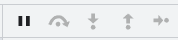

### console调试技巧

console对象提供了浏览器控制台调试的接口，我们可以从任何全局对象中访问到它

#### 基本打印

##### console.log()

> console.log()就是最基本、最常用的用法了。它可以用在JavaScript代码的任何地方，然后就可以浏览器的控制台中看到打印的信息。其基本使用方法如下:
>
> ```js
> let name = "xx";                   // xx
> console.log(`my name is: ${name}`)   // xx
> console.log(name)         // xx  
> ```
>
> 此外还支持**占位符**的形式，这里将后面的变量赋值给了前面的占位符的位置，他们是——对应的。
>
> > 支持的占位符的格式如下：
> >
> > * 字符串:%s
> > * 整数:%d
> > * 浮点数:%f
> > * 对象:%o或%O
> > * CSS样式:%c
>
> ```js
> let name = "xx";
> let age = 18;
> console.log('Name: %s, Age: %d', name, age)     // Name: xx, Age: 18
> ```
>
> 此外还支持定义css样式,这个样式打印可能有用的地方就是打印图片，用来查看图片是否正确
>
> > 严格地说，console.log()并不支持打印图片，但是可以使用CSS的背景图来打印图片，不过并不能直接打印，因为是不支持设置图片的宽高属性，所以就需要使用line-heigh和padding来撑开图片，使其可以正常显示出来。
>
> ```js
> let name = "xx";
> console.log('My Name is %cxx', 'color: skyblue; font-size: 30px;') 
> ```
>
> 

##### console.warn()

> console.warn()方法用于在控制台输出警告信息。它的用法和console.log是完全一样的，只是显示的样式不太一样，信息最前面加一个黄色三角，表示警告:
>
> ```js
> const app = ["facebook", "google", "twitter"];
> console.warn(app);
> ```
>
> 
>
> 

##### console.error()

> console.error)可以用于在控制台输出错误信息。它和上面的两个方法的用法是一样的，只是显示样式不一样，有一个小红色的×
>
> 需要注意，console.exception()是console.error()的别名，它们功能是相同的。
>
> 当然,console.error()还有一个console.log()不具备的功能，那就是打印函数的调用栈，当然，console对象提供了专门的方法来打印函数的调用栈(console.trace())
>
> ```js
> const app = ["facebook", "google", "twitter"];
> console.error(app);
> ```
>
> 

##### console.info()

> console.info()可以用来打印资讯类说明信息，它和console.log0)的用法一致，打印出来的效果也是一样的

#### 打印时间

##### console.time()&console.timeEnd()

> 如果我们想要获取一段代码的执行时间，就可以使用console对象的console.time()和console.timeEnd()方法
>
> 它们都可以传递一个参数，该参数是一个字符串，用来标记唯一的计时器。如果页面只有一个计时器时，就不需要传这个参数，如果有多个计时器，就需要使用这个标签来标记每一个计时器:
>
> ```js
> console.time("timer1");
> console.time("timer2");
> 
> setTimeout(() => {
> 	console.timeEnd("timer1");
> }, 1000);
> 
> setTimeout(() => {
> 	console.timeEnd("timer2");
> }, 2000);
> 
> // 控制台的打印：
> // timer1: 1003.876220703125 ms
> // timer2: 2002.433837890625 ms
> ```
>
> 

##### console.timeLog()

> 这里的console.timeLog)上面的console.timeEnd()类似，但是也有一定的差别。他们都需要使用console.time()来启动一个计时器。然后console.timeLog()就是打印计时器当前的时间，而console.timeEnd()是打印计时器，直到结束的时间。
>
> ```js
> console.time("timer");
> 
> setTimeout(() => {
>   console.timeEnd("timer")
> 	setTimeout(() => {
> 	    console.timeLog("timer");
>     }, 2000);
> }, 1000);
> ```
>
> 
>
> 两者的区别就在于，是否会终止当前的计时

#### 打印计次

##### console.count()

> 可以使用使用console.count()来获取当前执行的次数，
>
> 它也可传一个参数来进行标记(如果为空，则为默认标签default)，比如示例里面，如果 console.count('h')，那么输出：h：1等
>
> 这个方法主要用于一些比较复杂的场景，有时候一个函数被多个地方调用，就可以使用这个方法来确定是否少调用或者重复调用了该方法。
>
> ```js
> for (i = 0; i < 5; i++) {
>     console.count();
> }
> 
> // 输出结果如下
> default: 1
> default: 2
> default: 3
> default: 4
> default: 5
> ```
>
> 

##### console.countReset()

> 顾名思义，console.countReset()就是重置计算器，它会需要配合上面的console.count()方法使用。它有一个可选的参数label:
>
> * 如果提供了参数label，此函数会重置与label关联的计数，将count重置为0。
> * 如果省略了参数label，此函数会重置默认的计数器，将count重置为0。
>
> ```js
> console.count(); 
> console.count("a"); 
> console.count(); 
> 
>   
> console.countReset(); 
> console.countReset("a"); 
>   
> console.count(); 
> console.count("a"); 
> 
> // 输出以下内容 
> default: 1
> a: 1
> default: 2
> default: 1
> a: 1
> ```
>
> 

#### 分组打印

##### console.group()&console.groupEnd()

> 这两个方法用于在控制台创建一个信息分组。一个完整的信息分组以console.group()开始，console.groupEnd()结束。来看下面的例子:
>
> ```js
> console.group();
>   console.log('First Group');
>   console.group();
>     console.log('Second Group')
>   console.groupEnd();
> console.groupEnd();
> ```
>
> 

##### console.groupCollapsed()

> console.groupCollapsed()方法类似于console.group()，它们都需要使用console.groupEnd()来结束分组。不同的是，该方法默认打印的信息是折叠展示的，而group()是默认展开的。

#### 其它打印

##### console.table()

> 我们平时使用console.log较多，其实console对象还有很多属性可以使用，比如console.table()，使用它可以方便的打印数组对象的属性，打印结果是一个表格。
>
> console.table()方法有两个参数，第一个参数是需要打印的对象，第二个参数是需要打印的表格的标题，这里就是数组对象的属性值。
>
> 通过这种方式，可以更加清晰的看到数组对象中的指定属性。除此之外，还可以使用console.table()来打印数组元素。需要注意，console.table()只能处理最多1000行，因此它可能不适合所有数据集。但是也能适用于多数场景了。
>
> 来看下面的例子:
>
> ```js
> const users = [ 
>    { 
>       "first_name":"Harcourt",
>       "last_name":"Huckerbe",
>       "gender":"Male",
>       "city":"Linchen",
>       "birth_country":"China"
>    },
>    { 
>       "first_name":"Allyn",
>       "last_name":"McEttigen",
>       "gender":"Male",
>       "city":"Ambelókipoi",
>       "birth_country":"Greece"
>    },
>    { 
>       "first_name":"Sandor",
>       "last_name":"Degg",
>       "gender":"Male",
>       "city":"Mthatha",
>       "birth_country":"South Africa"
>    }
> ]
> 
> console.table(users, ['first_name', 'last_name', 'city']);
> ```
>
> 

##### console.clear()

> console.clear()顾名思义就是清除控制台的信息。当清空控制台之后，会打印一句:“Console was clered”,也可以使用控制台的清除键清除控制台

##### console.assert()

> console.assert()方法用于语句断言，当断言为false时，则在信息到控制台输出错误信息。
>
> ```js
> console.assert(expression, message)
> ```
>
> 该方法会在expression条件语句为false时，就会打印message信息。当在特定情况下才输出语句时，就可以使用console.assert()方法。
>
> ```js
> let a = 2;
> console.assert(a === 1, 'a的值为1')
> ```
>
> 

##### console.trace()

> console.trace()方法可以用于打印当前执行的代码在堆栈中的调用路径。它和上面的console.erroro)的功一致，不过打印的样式就和console.log()是一样的了。
>
> ```js
> function a() {
>   b();
> }
> function b() {
>   console.trace();
> }
> function c() {
>   a();
> }
> c();
> ```
>
> 
>
> 可以看到，这里输出了调用栈的信息:b-a-c，这个堆栈信息是从调用位置开始的。

##### console.dir()

> console.dir()方法可以在控制台中显示指定JavaScript对象的属性，并通过类似文件树样式的交互列表显示。

##### console.dirxml()

> console.dirxml()方法用于显示一个明确的XML/HTML元素的包括所有后代元素的交互树。如果无法作为一个element被显示，那么会以JavaScript对象的形式作为替代。它的输出是一个继承的扩展的节点列表，可以让你看到子节点的内容。其语法如下:
>
> ```js
> console.dirxml(object);
> ```
>
> 

##### console.memory

> console.memory是console对象的一个属性，而不是一个方法。它可以用来查看当前内存的使用情况，如果使用过多的console.log()会占用较多的内存，导致浏览器出现卡顿情况。
>
> 

### DevTools调试技巧

#### 功能简介

> Chrome DevTools由以下九部分组成:
>
> * Element元素面板:检查和调整页面，调式DOM，调试CSS 
> * Network网络面板:调试请求，了解页面静态资源分布以及网页性能的检测
> * Console控制台面板:调试JavaScript。查看Console log日志、交互式代码调试
> * Sources源代码资源面板:查看、调试客户端存储，如Cookie、LocalStorage、SessionStorage等
> * Performance性能面板:查看网页的细节，细粒度对网页载入进行性能优化
> * Memory内存面板: Javascript CPU分析器，内存堆分析器
> * Application：查看与调试Cookie、LocalStorage和SessionStorage
> * Security安全面板:查看网页安全及证书问题
> * LightHouse面板:进行性能分析，给出优化建议
> * 还可以调试移动设备，H5页面

#### Element调试DOM

> ##### 查看编辑HTML和DOM
>
> > 可以在页面中选中DOM，在DOM中反向定位到页面位置可以对HTML和DOM进行编辑操作:
> >
> > * 编辑内容
> > * 编辑属性。修改元素类型。调整DOM节点顺序
> > * 编辑HTML代码
> > * 删除、隐藏、增加、拷贝节点
>
> ##### 在console中访问节点
>
> ##### 在DOM中断点调试
>
> ##### 调试样式及css

#### Console和Sources调试JS

> 可以使用Console面板执行以下功能: 运行JavaScript代码，交互式编程。查看程序中打印的Log日志
>
> 主要的调试方法有以下四种，其中error和warn方法有特定的图标和颜色标识:
>
> * console.log():打印普通信息
> * console.info():打印提示性信息
> * console.error():打印错误信息
> * console.warn():打印警示信息

##### 调试JS基本流程和断点调试

> 对于JavaScript的调试主要有以下两种方式:
>
> * 传统的console.log或者是alert()打印运行时信息进行调试
> * JavaScript断点调试
>
> **1 使用debugger进行断点调试**
>
> > 断点调试，在需要断点的位置设置一个debugger,source面板:
> >
> > 
> >
> > 代码下面有一行工具栏，可以进行单步的调试:
> >
> > 
> >
> > 他们分别代表:
> >
> > * Resume script execution:恢复脚本的执行
> > * Step over next function call:跳过下一个函数的执行
> > * Step into next function call:进入到下一个函数的执行
> > * Step out of current function:跳出当前函数
> > * Step（(快捷键F9)︰单步执行
>
> **2 使用事件监听进行断点调试**
>
> 除了使用debugger 之外，还可以直接进行断点设置

#### Sources源代码面板简介

> sources面板包含了该网站的静态资源

#### Network面板

> 我们可以用Network面板来完成以下事情:
>
> * 查看网页资源请求预览，查看资源分布
> * 针对单一请求查看Request/Response或消耗时间等
> * 分析网页性能优化，使用工具代理页面请求数据等
>
> 我们可以看到执行一个操作之后，所有的网络请求数据: