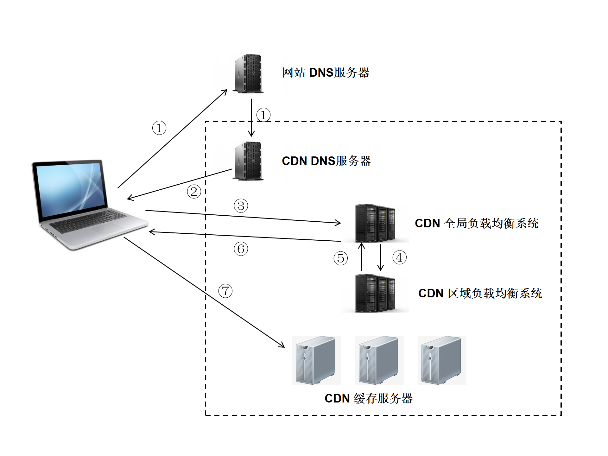
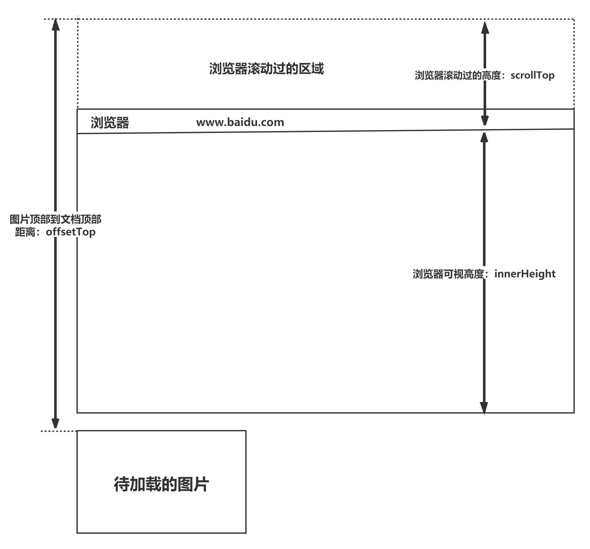

## CDN

### CDN的概念

> CDN（Content Delivery Network，**内容分发网络**）是指一种通过互联网互相连接的电脑网络系统，利用最靠近每位用户的服务器，更快、更可靠地将音乐、图片、视频、应用程序及其他文件发送给用户，来提供高性能、可扩展性及低成本的网络内容(传递)给用户。 - 维基百科，有点拗口，太官方了
>
> 以下几行参考：https://www.cloudflare.com/zh-cn/learning/cdn/what-is-a-cdn/
>
> > 内容分发网络（CDN）是指一组分布在不同地理位置的服务器，协同工作以提供互联网内容的`快速交付`。换句话说，它可以利用最靠近每位用户的服务器，更快、更可靠地将音乐、图片、视频、应用程序及其他文件发送给用户，来提供给用户高性能、可扩展性及低成本的网络内容。
> >
> > CDN 允许`快速传输加载`互联网内容所需的资源，包括 HTML 页面、javascript 文件、css样式表、图像和视频。 CDN 服务已得到不断普及。如今，大多数 web 流量都通过 CDN 提供服务，包括来自Facebook、Netflix 和亚马逊等主要网站的流量。
> >
> > 正确配置的 CDN 还可帮助保护网站免受某些常见的恶意攻击，例如[分布式拒绝服务（DDOS）攻击](https://www.cloudflare.com/learning/ddos/what-is-a-ddos-attack/)。
>
> > 内容分发网络就像前面提到的智能仓配网络 一样，解决了因分布、带宽、服务器性能带来的访问延迟问题，适用于站点加速、点播、直播等场景。使用户可就近取得所需内容，解决 Internet网络拥挤的状况，提高用户访问网站的响应速度和成功率。
> >
> > 边缘节点：离用户最近的节点，能快速响应用户请求，返回缓存信息。
> >
> > 中心节点：中心节点包括CDN网管中心和全局负载均衡DNS重定向解析系统，负责整个CDN网络的分发及管理。
>
> 典型的CDN系统由下面三个部分组成：
>
> - **分发服务系统：**最基本的工作单元就是Cache设备，cache（边缘cache）负责直接响应最终用户的访问请求，`把缓存在本地的内容快速地提供给用户`。同时cache还负责与源站点进行内容同步，把更新的内容以及本地没有的内容从源站点获取并保存在本地。Cache设备的数量、规模、总服务能力是衡量一个CDN系统服务能力的最基本的指标。
> - **负载均衡系统：**主要功能是负责对所有发起服务请求的用户进行访问调度，确定提供给用户的最终实际访问地址。两级调度体系分为全局负载均衡（GSLB）和本地负载均衡（SLB）。**全局负载均衡**主要根据用户就近性原则，通过对每个服务节点进行“最优”判断，确定向用户提供服务的cache的物理位置。**本地负载均衡**主要负责节点内部的设备负载均衡
> - **运营管理系统：**运营管理系统分为运营管理和网络管理子系统，负责处理业务层面的与外界系统交互所必须的收集、整理、交付工作，包含客户管理、产品管理、计费管理、统计分析等功能。

### CDN的作用 

> CDN一般会用来托管Web资源（包括文本、图片和脚本等），可供下载的资源（媒体文件、软件、文档等），应用程序（门户网站等）。使用CDN来加速这些资源的访问。
>
> （1）在性能方面，引入CDN的作用在于：
>
> - 用户收到的内容来自最近的数据中心，延迟更低，内容加载更快 - 用户角度
>- 部分资源请求分配给了CDN，减少了服务器的负载 - 服务器角度
> - 解决了因分布、带宽、服务器性能带来的访问延迟问题，适用于站点加速、点播、直播等场景。使用户可就近取得所需内容，解决 Internet网络拥挤的状况，提高用户访问网站的响应速度和成功率。
> 
>（2）在安全方面，CDN有助于防御DDoS、MITM等网络攻击：
> 
>- 针对DDoS：通过监控分析异常流量，限制其请求频率
> - 针对MITM：从源服务器到 CDN 节点到 ISP（Internet Service Provider），全链路 HTTPS 通信
> 
>除此之外，CDN作为一种基础的云服务，同样具有资源托管、按需扩展（能够应对流量高峰）等方面的优势。

### CDN的原理

> CDN和DNS有着密不可分的联系，先来看一下DNS的解析域名过程，在浏览器输入 www.test.com 的解析过程如下：
>
> （1） 检查浏览器缓存
>
> （2）检查操作系统缓存，常见的如hosts文件
>
> （3）检查路由器缓存
>
> （4）如果前几步都没没找到，会向ISP(网络服务提供商)的LDNS（本地DND）服务器查询
>
> （5）如果LDNS服务器没找到，会向根域名服务器(Root Server)请求解析，分为以下几步：
>
> - 根服务器返回顶级域名(TLD)服务器如`.com`，`.cn`，`.org`等的地址，该例子中会返回`.com`的地址
> - 接着向顶级域名服务器发送请求，然后会返回权威域名(SLD)服务器的地址，本例子会返回`.test`的地址
> - 接着向权威 域名服务器发送请求，然后会返回通过域名查询到的目标IP，本例子会返回`www.test.com`的地址
> - Local DNS Server会缓存结果，并返回给用户，缓存在系统中
>
> 
>
> **CDN的工作原理：**
>
> （1）用户未使用CDN缓存资源的过程：
>
> 1. 浏览器通过DNS对域名进行解析（就是上面的DNS解析过程），依次得到此域名对应的IP地址
> 2. 浏览器根据得到的IP地址，向域名的服务主机发送数据请求
> 3. 服务器向浏览器返回响应数据
>
> 
>
> （2）用户使用CDN缓存资源的过程：
>
> 1. **本地DNS系统**解析点击的URL，发现该URL对应的是一个CDN专用的DNS服务器，DNS系统就会将域名解析权交给CNAME指向的CDN专用的DNS服务器。
> 2. **CDN专用DNS服务器**将CDN的全局负载均衡设备IP地址返回给用户
> 3. **用户**向CDN的**全局负载均衡设备**发起数据请求（url）
> 4. **CDN的全局负载均衡设备**根据用户的IP地址，以及用户请求的内容URL，选择一台用户所属区域的区域负载均衡设备，告诉用户向这台设备发起请求
> 5. **区域负载均衡设备**选择一台合适的**CDN缓存服务器**来提供服务，将该缓存服务器的IP地址返回给全局负载均衡设备
> 6. **全局负载均衡设备**把缓存服务器的IP地址返回给用户
> 7. **用户**向该**缓存服务器**发起请求，缓存服务器响应用户的请求，将用户所需内容发送至用户终端。如果缓存服务器没有用户想要的内容，那么缓存服务器就会向它的上一级缓存服务器请求内容，以此类推，直到获取到需要的资源。最后如果还是没有，就会回到自己的服务器去获取资源。
>
> 
>
> CNAME（意为：别名 Canonical Name）：在域名解析中，实际上解析出来的指定域名对应的IP地址，或者该域名的一个CNAME，然后再根据这个CNAME来查找对应的IP地址。
>
> **真实名称记录**（英语：Canonical Name Record），即**`CNAME记录`**，是域名系统（[DNS](https://zh.m.wikipedia.org/zh-hans/DNS)）的一种记录。CNAME记录用于将一个[域名](https://zh.m.wikipedia.org/wiki/域名)（同名）映射到另一个域名（真实名称），[域名解析服务器](https://zh.m.wikipedia.org/wiki/域名解析服务器)遇到CNAME记录会以映射到的目标重新开始查询
>
> CNAME记录必须指向另一个域名，而不能是IP地址。

### CDN的使用场景

> - **使用第三方的CDN服务：**如果想要开源一些项目，可以使用第三方的CDN服务
> - **使用CDN进行静态资源的缓存：**将自己网站的静态资源放在CDN上，比如js、css、图片等。可以将整个项目放在CDN上，完成一键部署。
> - **直播传送：**直播本质上是使用流媒体进行传送，CDN也是支持流媒体传送的，所以直播完全可以使用CDN来提高访问速度。CDN在处理流媒体的时候与处理普通静态文件有所不同，普通文件如果在边缘节点没有找到的话，就会去上一层接着寻找，但是流媒体本身数据量就非常大，如果使用回源的方式，必然会带来性能问题，所以流媒体一般采用的都是主动推送的方式来进行。

## 懒加载

### 懒加载的概念

> 懒加载也叫做延迟加载、按需加载，指的是在长网页中延迟加载图片数据，是一种较好的网页性能优化的方式。在比较长的网页或应用中，如果图片很多，所有的图片都被加载出来，而用户只能看到可视窗口的那一部分图片数据，这样就浪费了性能。
>
> 如果使用图片的懒加载就可以解决以上问题。在滚动屏幕之前，可视化区域之外的图片不会进行加载，在滚动屏幕时才加载。这样使得网页的加载速度更快，减少了服务器的负载。懒加载适用于图片较多，页面列表较长（长列表）的场景中。

### 懒加载的特点

> - **减少无用资源的加载**：使用懒加载明显减少了服务器的压力和流量，同时也减小了浏览器的负担。
> - **提升用户体验**: 如果同时加载较多图片，可能需要等待的时间较长，这样影响了用户体验，而使用懒加载就能大大的提高用户体验。
> - **防止加载过多图片而影响其他资源文件的加载** ：会影响网站应用的正常使用。

### 懒加载的实现原理

> 图片的加载是由`src`引起的，当对`src`赋值时，浏览器就会请求图片资源。根据这个原理，我们使用HTML5 的`data-xxx`属性来储存图片的路径，在需要加载图片的时候，将`data-xxx`中图片的路径赋值给`src`，这样就实现了图片的按需加载，即懒加载。
>
> 懒加载的实现重点在于确定用户需要加载哪张图片，在浏览器中，可视区域内的资源就是用户需要的资源。所以当图片出现在可视区域时，获取图片的真实地址并赋值给图片即可。
>
> > 注意：data-xxx 属性用于存储页面或应用程序的私有自定义数据。`data-xxx` 中的`xxx`可以自定义，这里我们使用`data-src`来定义。
>
> 使用原生JavaScript实现懒加载：
>
> **知识点：**
>
> 我们需要提前知道几个值，一个是当前浏览器窗口的视口高度，另一个是每张图片距离视口顶部的距离，因为只有当图片距离顶部的距离小于我们的视口高度，那么就代表这张图片已经出现在我们的视口范围内了。
>
> （1）`window.innerHeight` 是浏览器可视区的高度
>
> （2）`document.body.scrollTop || document.documentElement.scrollTop` 是浏览器滚动的过的距离
>
> （3）`imgs.offsetTop` 是`元素`顶部距离文档顶部的高度（包括滚动条的距离）
>
> （4）图片加载条件：`img.offsetTop < window.innerHeight + document.body.scrollTop;`
>
> **图示：**
>
> 
>
> **代码实现：**
>
> ```javascript
><div class="container">
>   
>  
>   
>   
>      
>      
>    </div>
>    <script>
>    var imgs = document.querySelectorAll('img');
>    function lozyLoad(){
> 		var scrollTop = document.body.scrollTop || document.documentElement.scrollTop;
> 		var winHeight= window.innerHeight;
> 		for(var i=0;i < imgs.length;i++){
> 			if(imgs[i].offsetTop < scrollTop + winHeight ){
>                   // 给图片赋值真实的src，展示图片
> 				imgs[i].src = imgs[i].getAttribute('data-src');
> 			}
> 		}
> 	}
> window.onscroll = lozyLoad();
> </script>
> ```

### 懒加载与预加载的区别

> 这两种方式都是提高网页性能的方式，两者主要区别是一个是提前加载，一个是迟缓甚至不加载。懒加载对服务器前端有一定的缓解压力作用，预加载则会增加服务器前端压力。
>
> - **懒加载也叫延迟加载，指的是在长网页中延迟加载图片的时机，当用户需要访问时，再去加载**，这样可以提高网站的首屏加载速度，提升用户的体验，并且可以减少服务器的压力。它适用于图片很多，页面很长的电商网站的场景。懒加载的实现原理是，将页面上的图片的 src 属性设置为空字符串，将图片的真实路径保存在一个自定义属性中，当页面滚动的时候，进行判断，如果图片进入页面可视区域内，则从自定义属性中取出真实路径赋值给图片的 src 属性，以此来实现图片的延迟加载。
> - **预加载指的是将所需的资源提前请求加载到本地，这样后面在需要用到时就直接从缓存取资源。**通过预加载能够减少用户的等待时间，提高用户的体验。我了解的预加载的最常用的方式是使用 js 中的 image 对象，通过为 image 对象来设置 scr 属性，来实现图片的预加载。

## 回流与重绘

### 回流与重绘的概念及触发条件

> #### （1）回流
>
> 当渲染树中部分或者全部元素的尺寸、结构或者属性发生变化时，浏览器会重新渲染部分或者全部文档的过程就称为**回流**。
>
> 
>
> 下面这些操作会导致回流：
>
> - 页面的首次渲染
> - 浏览器的窗口大小发生变化
> - 元素的内容发生变化
> - 元素的尺寸或者位置发生变化
> - 元素的字体大小发生变化
> - 激活CSS伪类
> - 查询某些属性或者调用某些方法
> - 添加或者删除可见的DOM元素
>
> 
>
> 在触发回流（重排）的时候，由于浏览器渲染页面是基于流式布局的，所以当触发回流时，会导致周围的DOM元素重新排列，它的影响范围有两种：
>
> - 全局范围：从根节点开始，对整个渲染树进行重新布局
> - 局部范围：对渲染树的某部分或者一个渲染对象进行重新布局
>
> #### （2）重绘
>
> 当页面中某些元素的样式发生变化，但是不会影响其在文档流中的位置时，浏览器就会对元素进行重新绘制，这个过程就是**重绘**。
>
> 
>
> 下面这些操作会导致重绘：
>
> - color、background 相关属性：background-color、background-image 等
> - outline 相关属性：outline-color、outline-width 、text-decoration
> - border-radius、visibility、box-shadow
>
> 注意： **当触发回流时，一定会触发重绘，但是重绘不一定会引发回流。**

### 如何避免回流与重绘？

> **减少回流与重绘的措施：**
>
> - 操作DOM时，尽量在低层级的DOM节点进行操作
> - 避免频繁操作DOM，可以创建一个文档片段`documentFragment`，在它上面应用所有DOM操作，最后再把它添加到文档中
> - 将DOM的多个读操作（或者写操作）放在一起，而不是读写操作穿插着写。这得益于**浏览器的渲染队列机制**。
> - 不要使用`table`布局， 一个小的改动可能会使整个`table`进行重新布局
> - 使用CSS的表达式
> - 不要频繁操作元素的样式，对于静态页面，可以修改类名，而不是样式。
> - 使用absolute或者fixed，使元素脱离文档流，这样他们发生变化就不会影响其他元素
> - 将元素先设置`display: none`，操作结束后再把它显示出来。因为在display属性为none的元素上进行的DOM操作不会引发回流和重绘。
>
> 
>
> 浏览器针对页面的回流与重绘，进行了自身的优化——**渲染队列**
>
> 
>
> **浏览器会将所有的回流、重绘的操作放在一个队列中，当队列中的操作到了一定的数量或者到了一定的时间间隔，浏览器就会对队列进行批处理。这样就会让多次的回流、重绘变成一次回流重绘。**
>
> 上面，将多个读操作（或者写操作）放在一起，就会等所有的读操作进入队列之后执行，这样，原本应该是触发多次回流，变成了只触发一次回流。

### 如何优化动画？

> 对于如何优化动画，我们知道，一般情况下，动画需要频繁的操作DOM，就就会导致页面的性能问题，我们可以将动画的`position`属性设置为`absolute`或者`fixed`，将动画脱离文档流，这样他的回流就不会影响到页面了。

### documentFragment 是什么？用它跟直接操作 DOM 的区别是什么？

> MDN中对`documentFragment`的解释：
>
> DocumentFragment，文档片段接口，一个没有父对象的最小文档对象。它被作为一个轻量版的 Document使用，就像标准的document一样，存储由节点（nodes）组成的文档结构。与document相比，最大的区别是DocumentFragment不是真实 DOM 树的一部分，它的变化不会触发 DOM 树的重新渲染，且不会导致性能等问题。
>
> 
>
> 当我们把一个 DocumentFragment 节点插入文档树时，插入的不是 DocumentFragment 自身，而是它的所有子孙节点。在频繁的DOM操作时，我们就可以将DOM元素插入DocumentFragment，之后一次性的将所有的子孙节点插入文档中。和直接操作DOM相比，将DocumentFragment 节点插入DOM树时，不会触发页面的重绘，这样就大大提高了页面的性能。

## 节流与防抖

### 对节流与防抖的理解

> - 函数防抖是指在事件被触发 n 秒后再执行回调，如果在这 n 秒内事件又被触发，则重新计时。这可以使用在一些点击请求的事件上，避免因为用户的多次点击向后端发送多次请求。
> - 函数节流是指规定一个单位时间，在这个单位时间内，只能有一次触发事件的回调函数执行，如果在同一个单位时间内某事件被触发多次，只有一次能生效。节流可以使用在 scroll 函数的事件监听上，通过事件节流来降低事件调用的频率。
>
> 
>
> **防抖函数的应用场景：**
>
> - 按钮提交场景：防⽌多次提交按钮，只执⾏最后提交的⼀次 
> - 服务端验证场景：表单验证需要服务端配合，只执⾏⼀段连续的输⼊事件的最后⼀次，还有搜索联想词功能类似⽣存环境请⽤lodash.debounce 
>
> 
>
> **节流函数的**适⽤场景：
>
> - 拖拽场景：固定时间内只执⾏⼀次，防⽌超⾼频次触发位置变动 
> - 缩放场景：监控浏览器resize 
> - 动画场景：避免短时间内多次触发动画引起性能问题 

## 图片优化

### 如何对项目中的图片进行优化？

> 1. 不用图片。很多时候会使用到很多修饰类图片，其实这类修饰图片完全可以用 CSS 去代替。
>
> 2. 对于移动端来说，屏幕宽度就那么点，完全没有必要去加载原图浪费带宽。一般图片都用 CDN 加载，可以计算出适配屏幕的宽度，然后去请求相应裁剪好的图片。
>
> 3. 小图使用 base64 格式，二进制到文本（binary-to-text）的编码规则，可以保存在本地，不用请求数据
>
> 4. 将多个图标文件整合到一张图片中（雪碧图）
>
>    >  雪碧图的英文是**CSS Sprites**，也叫css精灵图。其目的是将多张比较小的图片，合并到一张大的图片上面，大的图片背景透明，使用的时候，通过把该张图片当做背景图片，通过不同的 `background-position`定位来展示的那部分图片。
>    >
>    > 好处：降低服务器压力，减少网络请求，页面渲染更快；
>    >
>    > 缺点：后期维护困难，添加一张图片需要重新制作、应用麻烦，每一张图都需要计算位置、使用图片有局限，只能用在背景图片background-image上，不能用    >
>    > 场景：**主用在网站的icon上面**，很多网站都有很多小图标，这些小图标如果都是单独请求网络，务必会消耗很多玩网络资源（每次请求都会有一个连接与断开的时间消耗），但是比较大的图片，就不建议用雪碧图，因为图片太大，一次请求获取的数据量大，拿到这个大图需要的时间就长，降低了网页的整体体验。
>
> 5. 选择正确的图片格式：
>
> - - 对于能够显示 WebP 格式的浏览器尽量使用 WebP 格式。因为 WebP 格式具有更好的图像数据压缩算法，能带来更小的图片体积，而且拥有肉眼识别无差异的图像质量，缺点就是兼容性并不好
>   - 小图使用 PNG，其实对于大部分图标这类图片，完全可以使用 SVG 代替
>   - 照片使用 JPEG

### 常见的图片格式及使用场景

> （1）**BMP**，是无损的、既支持索引色也支持直接色的点阵图。这种图片格式几乎没有对数据进行压缩，所以BMP格式的图片通常是较大的文件。
>
> 
>
> （2）**GIF**是无损的、采用索引色的点阵图。采用LZW压缩算法进行编码。文件小，是GIF格式的优点，同时，GIF格式还具有支持动画以及透明的优点。但是GIF格式仅支持8bit的索引色，所以GIF格式适用于对色彩要求不高同时需要文件体积较小的场景。
>
> 
>
> （3）**JPEG**是有损的、采用直接色的点阵图。JPEG的图片的优点是采用了直接色，得益于更丰富的色彩，JPEG非常适合用来存储照片，与GIF相比，JPEG不适合用来存储企业Logo、线框类的图。因为有损压缩会导致图片模糊，而直接色的选用，又会导致图片文件较GIF更大。
>
> 
>
> （4）**PNG-8**是无损的、使用索引色的点阵图。PNG是一种比较新的图片格式，PNG-8是非常好的GIF格式替代者，在可能的情况下，应该尽可能的使用PNG-8而不是GIF，因为在相同的图片效果下，PNG-8具有更小的文件体积。除此之外，PNG-8还支持透明度的调节，而GIF并不支持。除非需要动画的支持，否则没有理由使用GIF而不是PNG-8。
>
> 
>
> （5）**PNG-24**是无损的、使用直接色的点阵图。PNG-24的优点在于它压缩了图片的数据，使得同样效果的图片，PNG-24格式的文件大小要比BMP小得多。当然，PNG24的图片还是要比JPEG、GIF、PNG-8大得多。
>
> 
>
> （6）**SVG**是无损的矢量图。SVG是矢量图意味着SVG图片由直线和曲线以及绘制它们的方法组成。当放大SVG图片时，看到的还是线和曲线，而不会出现像素点。这意味着SVG图片在放大时，不会失真，所以它非常适合用来绘制Logo、Icon等。
>
> 
>
> （7）**WebP**是谷歌开发的一种新图片格式，WebP是同时支持有损和无损压缩的、使用直接色的点阵图。从名字就可以看出来它是为Web而生的，什么叫为Web而生呢？就是说相同质量的图片，WebP具有更小的文件体积。现在网站上充满了大量的图片，如果能够降低每一个图片的文件大小，那么将大大减少浏览器和服务器之间的数据传输量，进而降低访问延迟，提升访问体验。目前只有Chrome浏览器和Opera浏览器支持WebP格式，兼容性不太好。
>
> - 在无损压缩的情况下，相同质量的WebP图片，文件大小要比PNG小26%；
> - 在有损压缩的情况下，具有相同图片精度的WebP图片，文件大小要比JPEG小25%~34%；
> - WebP图片格式支持图片透明度，一个无损压缩的WebP图片，如果要支持透明度只需要22%的格外文件大小。

