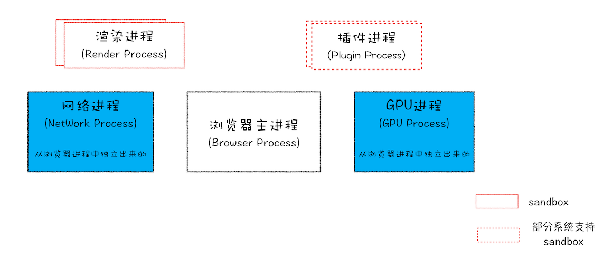
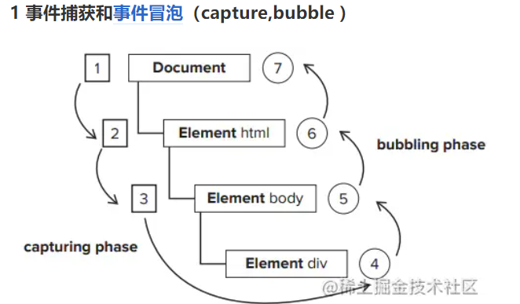
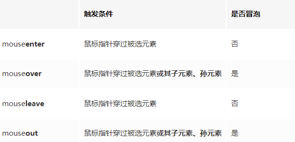
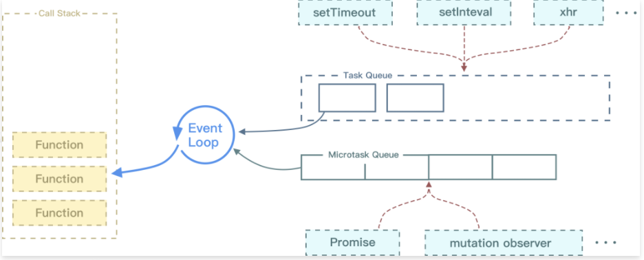
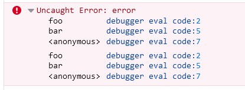
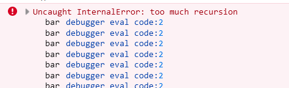
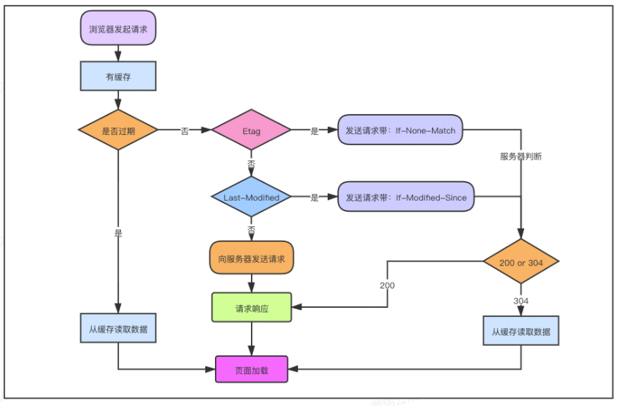
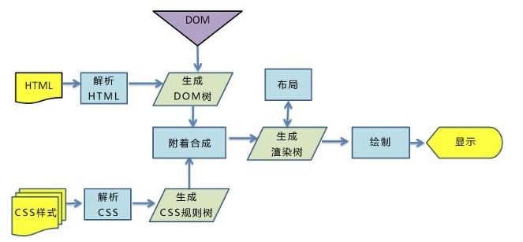

## 浏览器安全

###  什么是 XSS 攻击？

> https://tech.meituan.com/2018/09/27/fe-security.html

> #### 1）概念
>
> > 跨站脚本（Cross-site scripting，简称为：CSS, 但这会与层叠样式表（Cascading Style Sheets，CSS）的缩写混淆。因此，跨站脚本攻击缩写为XSS）是一种网站应用程序的安全漏洞攻击。
>
> XSS 攻击指的是跨站脚本攻击，是一种网站应用程序的安全漏洞攻击，通过代码注入来攻击。攻击者通过在`网站`注入恶意脚本，使之在`用户的浏览器`上运行，`利用`这些恶意脚本，攻击者可获取用户的敏感信息如 Cookie、SessionID 等，进而危害数据安全。
>
> XSS 的`本质`是因为网站没有对恶意代码进行过滤，与正常的代码混合在一起了，浏览器没有办法分辨哪些脚本是可信的，从而导致了恶意代码的执行。
>
> 而由于直接在用户的终端执行，恶意代码能够直接获取用户的信息，或者利用这些信息冒充用户向网站发起攻击者定义的请求。
>
> 在部分情况下，由于输入的限制，注入的恶意脚本比较短。但可以通过引入外部的脚本，并由浏览器执行，来完成比较复杂的攻击策略。
>
> 这里有一个问题：用户是通过哪种方法“注入”恶意脚本的呢？
>
> 不仅仅是业务上的“用户的 UGC 内容”可以进行注入，包括 URL 上的参数等都可以是攻击的来源。在处理输入时，以下内容都不可信：
>
> - 来自用户的 UGC 信息
>
> - 来自第三方的链接
>
> - URL 参数
>
> - POST 参数
>
> - Referer （可能来自不可信的来源）
>
>   ps:UGC 互联网术语，全称为User Generated Content，也就是用户生成内容，即用户原创内容。							
>
> 攻击者可以通过这种攻击方式可以进行以下操作：
>
> - 获取页面的数据，如DOM、cookie、localStorage；
> - DOS攻击，发送合理请求，占用服务器资源，从而使用户无法访问服务器；
> - 破坏页面结构；
> - 流量劫持（将链接指向某网站）；
>
> #### （2）攻击类型
>
> XSS 可以分为存储型、反射型和 DOM 型：
>
> - 存储型指的是恶意脚本会存储在目标服务器上，当浏览器请求数据时，脚本从服务器传回并执行。
> - 反射型指的是攻击者诱导用户访问一个带有恶意代码的 URL 后，服务器端接收数据后处理，然后把带有恶意代码的数据发送到浏览器端，浏览器端解析这段带有 XSS 代码的数据后当做脚本执行，最终完成 XSS 攻击。 
> - DOM 型指的通过修改页面的 DOM 节点形成的 XSS。
>
> 
>
> **1）存储型** **XSS** **的攻击步骤：** 
>
> 1. 攻击者将恶意代码提交到⽬标⽹站的数据库中。 
> 2. ⽤户打开⽬标⽹站时，⽹站服务端将恶意代码从数据库取出，拼接在 HTML 中返回给浏览器。 
> 3. ⽤户浏览器接收到响应后解析执⾏，混在其中的恶意代码也被执⾏。 
> 4. 恶意代码窃取⽤户数据并发送到攻击者的⽹站，或者冒充⽤户的⾏为，调⽤⽬标⽹站接⼝执⾏攻击者指定的操作。 
>
> 
>
> 这种攻击常⻅于带有⽤户保存数据的⽹站功能，如论坛发帖、商品评论、⽤户私信等。
>
> 
>
> **2）反射型** **XSS** **的攻击步骤：** 
>
> 1. 攻击者构造出特殊的 URL，其中包含恶意代码。 
> 2. ⽤户打开带有恶意代码的 URL 时，⽹站服务端将恶意代码从 URL 中取出，拼接在 HTML 中返回给浏览器。 
> 3. ⽤户浏览器接收到响应后解析执⾏，混在其中的恶意代码也被执⾏。 
> 4. 恶意代码窃取⽤户数据并发送到攻击者的⽹站，或者冒充⽤户的⾏为，调⽤⽬标⽹站接⼝执⾏攻击者指定的操作。 
>
> 
>
> 反射型 XSS 跟存储型 XSS 的区别是：存储型 XSS 的恶意代码存在数据库⾥，反射型 XSS 的恶意代码存在 URL ⾥。 
>
> 反射型 XSS 漏洞常⻅于通过 URL 传递参数的功能，如⽹站搜索、跳转等。
>
> 由于需要⽤户主动打开恶意的 URL 才能⽣效，攻击者往往会结合多种⼿段诱导⽤户点击。  
>
> POST 的内容也可以触发反射型 XSS，只不过其触发条件比较苛刻（需要构造表单提交页面，并引导用户点击），所以非常少见。
>
> 
>
> **3）DOM** **型** **XSS** **的攻击步骤：** 
>
> 1. 攻击者构造出特殊的 URL，其中包含恶意代码。 
> 2. ⽤户打开带有恶意代码的 URL。 
> 3. ⽤户浏览器接收到响应后解析执⾏，前端 JavaScript `取出 URL` 中的恶意代码并执⾏。 
> 4. 恶意代码窃取⽤户数据并发送到攻击者的⽹站，或者冒充⽤户的⾏为，调⽤⽬标⽹站接⼝执⾏攻击者指定的操作。 
>
> 
>
> DOM 型 XSS 跟前两种 XSS 的区别：DOM 型 XSS 攻击中，取出和执⾏恶意代码由`浏览器`端完成，属于前端`JavaScript` ⾃身的安全漏洞，⽽其他两种 XSS 都属于`服务端的安全漏洞`。 

### XSS 攻击的预防

> 通过前面的介绍可以得知，XSS 攻击有两大要素：
>
> 1. 攻击者提交恶意代码。
> 2. 浏览器执行恶意代码。
>
> 在用户提交时，由前端过滤输入，然后提交到后端。这样做是否可行呢？
>
> 答案是不可行，至少并非完全可靠。一旦攻击者绕过前端过滤，直接构造请求，就可以提交恶意代码了。
>
> ### 预防存储型和反射型 XSS 攻击
>
> 存储型和反射型 XSS 都是在服务端取出恶意代码后，插入到响应 HTML 里的，攻击者刻意编写的“数据”被内嵌到“代码”中，被浏览器所执行。
>
> 预防这两种漏洞，有两种常见做法：
>
> - 改成纯前端渲染，把代码和数据分隔开。
> - 对 HTML 做充分转义。
>
> #### 改成纯前端渲染，把代码和数据分隔开
>
> > 在纯前端渲染中，我们会明确的告诉浏览器：下面要设置的内容是文本（`.innerText`），还是属性（`.setAttribute`），还是样式（`.style`）等等。浏览器不会被轻易的被欺骗，执行预期外的代码了。
>
> #### 转义 HTML
>
> > 如果拼接 HTML 是必要的，就需要采用合适的转义库，对 HTML 模板各处插入点进行充分的转义。
> >
> > 常用的模板引擎，如 doT.js、ejs、FreeMarker 等，对于 HTML 转义通常只有一个规则，就是把 & < > " ' / 这几个字符转义掉，确 实能起到一定的 XSS 防护作用，但并不完善：
>
> #### 预防 DOM 型 XSS 攻击
>
> > DOM 型 XSS 攻击，实际上就是网站前端 JavaScript 代码本身不够严谨，把不可信的数据当作代码执行了。
> >
> > 在使用 `.innerHTML`、`.outerHTML`、`document.write()` 时要特别小心，不要把不可信的数据作为 HTML 插到页面上，而应尽量使用 `.textContent`、`.setAttribute()` 等。
> >
> > 如果用 Vue/React 技术栈，并且不使用 `v-html`/`dangerouslySetInnerHTML` 功能，就在前端 render 阶段避免 `innerHTML`、`outerHTML` 的 XSS 隐患
> >
> > DOM 中的内联事件监听器，如 `location`、`onclick`、`onerror`、`onload`、`onmouseover` 等，`<a>` 标签的 `href` 属性，JavaScript 的 `eval()`、`setTimeout()`、`setInterval()` 等，都能把字符串作为代码运行。如果不可信的数据拼接到字符串中传递给这些 API，很容易产生安全隐患，请务必避免。
>
> ### 如何防御 XSS 攻击？
>
> 可以看到XSS危害如此之大， 那么在开发网站时就要做好防御措施，具体措施如下：
>
> - 可以从浏览器的执行来进行预防，一种是使用纯前端的方式，不用服务器端拼接后返回（不使用服务端渲染）。另一种是对需要插入到 HTML 中的代码做好充分的转义。对于 DOM 型的攻击，主要是前端脚本的不可靠而造成的，对于数据获取渲染和字符串拼接的时候应该对可能出现的恶意代码情况进行判断。
> - 使用 CSP ，CSP 的本质是建立一个白名单，告诉浏览器哪些外部资源可以加载和执行，从而防止恶意代码的注入攻击。
>
> 1. CSP 指的是内容安全策略，它的本质是建立一个白名单，告诉浏览器哪些外部资源可以加载和执行。我们只需要配置规则，如何拦截由浏览器自己来实现。
> 2. 通常有两种方式来开启 CSP，一种是设置 HTTP 首部中的 Content-Security-Policy，一种是设置 meta 标签的方式 <meta http-equiv="Content-Security-Policy">
>
> - 对一些敏感信息进行保护，比如 cookie 使用 http-only，使得脚本无法获取。也可以使用验证码，避免脚本伪装成用户执行一些操作。
>
> ps:网页安全政策"（Content Security Policy），实质就是白名单制度，开发者明确告诉客户端，哪些外部资源可以加载和执行，等同于提供白名单。它的实现和执行全部由浏览器完成，开发者只需提供配置。
>
> 两种方法可以启用 CSP。一种是通过 HTTP 头信息的`Content-Security-Policy`的字段。
>
> 另一种是通过网页的`<meta>`标签。

### 什么是 CSRF 攻击？

> Cross-site request forgery

> https://tech.meituan.com/2018/10/11/fe-security-csrf.html

> #### （1）概念
>
> CSRF 攻击指的是**跨站请求伪造攻击**，攻击者诱导用户进入一个第三方网站，在第三方网站中，向被攻击网站发送跨站请求。如果用户在被攻击网站中保存了登录状态，那么攻击者就可以利用这个登录状态，绕过后台的用户验证，冒充用户向服务器执行一些操作。
>
> 跟跨网站脚本`XSS`相比，`XSS`利用的是用户对指定网站的信任，`CSRF`利用的是网站对用户浏览器的信任，浏览器对于同一`domain`下所有请求会自动携带`cookie`。
>
> CSRF 攻击的**本质是**攻击者欺骗用户去访问自己设置的地址
>
> 一个典型的CSRF攻击有着如下的流程：
>
> - 受害者登录a.com，并`保留了登录凭证（Cookie）`。
> - 攻击者引诱受害者访问了b.com。
> - b.com 向 a.com 发送了一个请求：a.com/act=xx。浏览器会`默认携带a.com的Cookie`。
> - a.com接收到请求后，对请求进行验证，并确认是受害者的凭证，误以为是受害者自己发送的请求。
> - a.com以受害者的名义执行了act=xx。
> - 攻击完成，攻击者在受害者不知情的情况下，冒充受害者，让a.com执行了自己定义的操作。
>
> #### （2）攻击类型
>
> 常见的 CSRF 攻击有三种：
>
> -  GET 类型的 CSRF 攻击，只需要一个HTTP请求
>    -  比如在网站中的一个 img 标签里构建一个HTTP请求，当用户打开这个网站的时候就会自动发起提交。
> -  POST 类型的 CSRF 攻击,通常使用的是一个自动提交的表单
>    -  比如构建一个表单，然后`隐藏`它，当用户进入页面时，自动提交这个表单。	
> -  链接类型的 CSRF 攻击,这种需要用户点击链接才会触发
>    - 比如在 a 标签的 href 属性里构建一个请求，然后诱导用户去点击。
>
> ### CSRF的特点
>
> - 攻击一般发起在`第三方网站`，而不是被攻击的网站。被攻击的网站无法防止攻击发生。
> - 攻击利用受害者在被攻击网站的登录凭证，冒充受害者提交操作；而不是直接窃取数据。
> - 整个过程攻击者并`不能获取`到受害者的登录凭证，仅仅是`“冒用”`。
> - 跨站请求可以用各种方式：图片URL、超链接、CORS、Form提交等等。部分请求方式可以直接嵌入在第三方论坛、文章中，难以进行追踪。
>
> CSRF通常是跨域的，因为外域通常更容易被攻击者掌控。但是如果本域下有容易被利用的功能，比如可以发图和链接的论坛和评论区，攻击可以直接在本域下进行，而且这种攻击更加危险。
>
> ### 防护策略
>
> CSRF通常从第三方网站发起，被攻击的网站无法防止攻击发生，只能通过增强自己网站针对CSRF的防护能力来提升安全性。
>
> - 阻止不明外域的访问
>   - 同源检测
>   - Samesite Cookie
> - 提交时要求附加本域才能获取的信息
>   - CSRF Token
>   - 双重Cookie验证

### 如何防御 CSRF 攻击？

> **CSRF 攻击可以使用以下方法来防护：**
>
> - **进行同源检测**
>   - 服务器根据 http 请求头中 origin 或者 referer 信息来判断请求是否为允许访问的站点，从而对请求进行过滤。当 origin 或者 referer 信息都不存在的时候，直接阻止请求。
>   - 这种方式的缺点是有些情况下 referer 可以被伪造，同时还会把搜索引擎的链接也给屏蔽了。所以一般网站会允许搜索引擎的页面请求，但是相应的页面请求这种请求方式也可能被攻击者给利用。（Referer 字段会告诉服务器该网页是从哪个页面链接过来的）
> - **使用 CSRF Token 进行验证**
>   - 服务器向用户返回一个随机数 Token ，当网站再次发起请求时，在请求参数中加入服务器端返回的 token ，然后服务器对这个 token 进行验证。这种方法解决了使用 cookie 单一验证方式时，可能会被冒用的问题
>   - 但是这种方法存在一个缺点就是，我们需要给网站中的所有请求都添加上这个 token，操作比较繁琐。还有一个问题是一般不会只有一台网站服务器，如果请求经过负载平衡转移到了其他的服务器，但是这个服务器的 session 中没有保留这个 token 的话，就没有办法验证了。这种情况可以通过改变 token 的构建方式来解决。
> - **对** **Cookie 进行双重验证**
>   - 服务器在用户访问网站页面时，向请求域名注入一个Cookie，内容为随机字符串，然后当用户再次向服务器发送请求的时候，从 cookie 中取出这个字符串，添加到 URL 参数中，然后服务器通过对 cookie 中的数据和参数中的数据进行比较，来进行验证。
>   - 使用这种方式是利用了攻击者只能利用 cookie，但是不能访问获取 cookie 的特点。并且这种方法比 CSRF Token 的方法更加方便，并且不涉及到分布式访问的问题。这种方法的缺点是如果网站存在 XSS 漏洞的，那么这种方式会失效。同时这种方式不能做到子域名的隔离。
> - **在设置 cookie 属性的时候设置 Samesite ，限制 cookie 不能作为被第三方使用**，从而可以避免被攻击者利用。Samesite 一共有两种模式，一种是严格模式，在严格模式下 cookie 在任何情况下都不可能作为第三方 Cookie 使用，在宽松模式下，cookie 可以被请求是 GET 请求，且会发生页面跳转的请求所使用。
>
> ps:为了从源头上解决这个问题，Google起草了一份草案来改进HTTP协议，那就是为Set-Cookie响应头新增Samesite属性，它用来标明这个 Cookie是个“同站 Cookie”，同站Cookie只能作为第一方Cookie，不能作为第三方Cookie，Samesite 有两个属性值，分别是 Strict 和 Lax

## 进程与线程

### 进程与线程的概念

> 从本质上说，进程和线程都是 CPU 工作时间片的一个描述：
>
> - 进程描述了 `CPU` 在`运行指令`及`加载和保存`上下文所需的时间，放在应用上来说就代表了一个程序。
> - 线程是进程中的更小单位，描述了执行一段指令所需的时间。
>
> 
>
> **进程是资源分配的最小单位，线程是CPU调度的最小单位。**
>
> 
>
> 一个进程就是一个程序的运行实例。详细解释就是，启动一个程序的时候，操作系统会为该程序创建一块内存，用来存放代码、运行中的数据和一个执行任务的主线程，我们把这样的一个运行环境叫**进程**。**进程是运行在虚拟内存上的，虚拟内存是用来解决用户对硬件资源的无限需求和有限的硬件资源之间的矛盾的。从操作系统角度来看，虚拟内存即交换文件；从处理器角度看，虚拟内存即虚拟地址空间。**
>
> 
>
> 如果程序很多时，内存可能会不够，操作系统为每个进程提供一套独立的虚拟地址空间，从而使得同一块物理内存在不同的进程中可以对应到不同或相同的虚拟地址，变相的增加了程序可以使用的内存。
>
> 
>
> 进程和线程之间的关系有以下四个特点：
>
> **（1）进程中的任意一线程执行出错，都会导致整个进程的崩溃。**
>
> **（2）线程之间共享进程中的数据。**
>
> **（3）当一个进程关闭之后，操作系统会回收进程所占用的内存，**当一个进程退出时，操作系统会回收该进程所申请的所有资源；即使其中任意线程因为操作不当导致内存泄漏，当进程退出时，这些内存也会被正确回收。
>
> **（4）进程之间的内容相互隔离。**进程隔离就是为了使操作系统中的进程互不干扰，每一个进程只能访问自己占有的数据，也就避免出现进程 A 写入数据到进程 B 的情况。正是因为进程之间的数据是严格隔离的，所以一个进程如果崩溃了，或者挂起了，是不会影响到其他进程的。如果进程之间需要进行数据的通信，这时候，就需要使用用于进程间通信的机制了。
>
> 
>
> **Chrome浏览器的架构图**：
>
> 
>
> 从图中可以看出，最新的 Chrome 浏览器包括：
>
> - 1 个浏览器主进程
> - 1 个 GPU 进程
> - 1 个网络进程
> - 多个渲染进程
> - 多个插件进程
>
> 这些进程的功能：
>
> - **浏览器进程**：主要负责界面显示、用户交互、子进程管理，同时提供存储等功能。
> - **渲染进程**：核心任务是将 HTML、CSS 和 JavaScript 转换为用户可以与之交互的网页，排版引擎 Blink 和 JavaScript 引擎 V8 都是运行在该进程中，默认情况下，Chrome 会为每个 Tab 标签创建一个渲染进程。出于安全考虑，渲染进程都是运行在沙箱模式下。
> - **GPU 进程**：其实， GPU 的使用初衷是为了实现 3D CSS 的效果，只是随后网页、Chrome 的 UI 界面都选择采用 GPU 来绘制，这使得 GPU 成为浏览器普遍的需求。最后，Chrome 在其多进程架构上也引入了 GPU 进程。
> - **网络进程**：主要负责页面的网络资源加载，之前是作为一个模块运行在浏览器进程里面的，直至最近才独立出来，成为一个单独的进程。
> - **插件进程**：主要是负责插件的运行，因插件易崩溃，所以需要通过插件进程来隔离，以保证插件进程崩溃不会对浏览器和页面造成影响。
>
> 
>
> 所以，**打开一个网页，最少需要四个进程**：1 个浏览器主进程、1 个网络进程、、1 个 GPU 进程以及 1 个渲染进程。如果打开的页面有运行插件的话，还需要再加上 1 个插件进程。
>
> 虽然多进程模型提升了浏览器的稳定性、流畅性和安全性，但同样不可避免地带来了一些问题：
>
> - **更高的资源占用**：因为每个进程都会包含公共基础结构的副本（如 JavaScript 运行环境），这就意味着浏览器会消耗更多的内存资源。
> - **更复杂的体系架构**：浏览器各模块之间耦合性高、扩展性差等问题，会导致现在的架构已经很难适应新的需求了。

### 进程和线程的区别

> - 进程可以看做独立应用，线程不能
> - 资源：进程是cpu`资源分配`的最小单位（是能拥有资源和独立运行的最小单位）；线程是cpu`调度`的最小单位（线程是建立在进程的基础上的一次程序运行单位，一个进程中可以有多个线程）。
> - 通信方面：线程间可以通过直接共享同一进程中的资源，而进程通信需要借助 进程间通信。
> - 调度：进程切换比线程切换的开销要大。线程是CPU调度的基本单位，线程的切换不会引起进程切换，但某个进程中的线程切换到另一个进程中的线程时，会引起进程切换。
> - 系统开销：由于创建或撤销进程时，系统都要为之分配或回收资源，如内存、I/O 等，其开销远大于创建或撤销线程时的开销。同理，在进行进程切换时，涉及当前执行进程 CPU 环境还有各种各样状态的保存及新调度进程状态的设置，而线程切换时只需保存和设置少量寄存器内容，开销较小。

### 进程间的通信方式

> **（1）管道通信**
>
> 管道是一种最基本的进程间通信机制。**管道就是操作系统在内核中开辟的一段缓冲区，进程1可以将需要交互的数据拷贝到这段缓冲区，进程2就可以读取了。**
>
> 管道的特点：
>
> - 只能单向通信
> - 只能血缘关系的进程进行通信
> - 依赖于文件系统
> - 生命周期随进程
> - 面向字节流的服务
> - 管道内部提供了同步机制
>
> **（2）消息队列通信**
>
> 消息队列就是一个消息的列表。用户可以在消息队列中添加消息、读取消息等。消息队列提供了一种从一个进程向另一个进程发送一个数据块的方法。
>
> 每个数据块都被认为含有一个类型，接收进程可以独立地接收含有不同类型的数据结构。可以通过发送消息来避免命名管道的同步和阻塞问题。但是消息队列与命名管道一样，每个数据块都有一个最大长度的限制。
>
> 使用消息队列进行进程间通信，可能会收到数据块最大长度的限制约束等，这也是这种通信方式的缺点。如果频繁的发生进程间的通信行为，那么进程需要频繁地读取队列中的数据到内存，相当于间接地从一个进程拷贝到另一个进程，这需要花费时间。
>
> **（3）信号量通信**
>
> 共享内存最大的问题就是多进程竞争内存的问题，就像类似于线程安全问题。我们可以使用信号量来解决这个问题。信号量的本质就是一个计数器，用来实现进程之间的互斥与同步。例如信号量的初始值是 1，然后 a 进程来访问内存1的时候，我们就把信号量的值设为 0，然后进程b 也要来访问内存1的时候，看到信号量的值为 0 就知道已经有进程在访问内存1了，这个时候进程 b 就会访问不了内存1。所以说，信号量也是进程之间的一种通信方式。
>
> **（4）信号通信**
>
> 信号（Signals ）是Unix系统中使用的最古老的进程间通信的方法之一。操作系统通过信号来通知进程系统中发生了某种预先规定好的事件（一组事件中的一个），它也是用户进程之间通信和同步的一种原始机制。
>
> **（5）共享内存通信**
>
> 共享内存就是映射一段能被其他进程所访问的内存，这段共享内存由一个进程创建，但多个进程都可以访问（使多个进程可以访问同一块内存空间）。共享内存是最快的 IPC 方式，它是针对其他进程间通信方式运行效率低而专门设计的。它往往与其他通信机制，如信号量，配合使用，来实现进程间的同步和通信。
>
> **（6）套接字通信**
>
> 上面我们说的共享内存、管道、信号量、消息队列，他们都是多个进程在一台主机之间的通信，那两个相隔几千里的进程能够进行通信吗？答是必须的，这个时候 Socket 这家伙就派上用场了，例如我们平时通过浏览器发起一个 http 请求，然后服务器给你返回对应的数据，这种就是采用 Socket 的通信方式了。

### 僵尸进程和孤儿进程是什么？

> - **孤儿进程**：父进程退出了，而它的一个或多个进程还在运行，那这些子进程都会成为孤儿进程。孤儿进程将被init进程(进程号为1)所收养，并由init进程对它们完成状态收集工作。
> - **僵尸进程**：子进程比父进程先结束，而父进程又没有释放子进程占用的资源，那么子进程的进程描述符仍然保存在系统中，这种进程称之为僵尸进程。

### 死锁产生的原因？ 如果解决死锁的问题？

> 所谓死锁，是指多个`进程`在运行过程中因`争夺资源`而造成的一种僵局，当进程处于这种僵持状态时，若无外力作用，它们都将`无法再向前推进`。
>
> 
>
> 系统中的资源可以分为两类：
>
> - 可剥夺资源，是指某进程在获得这类资源后，该资源可以再被其他进程或系统剥夺，CPU和主存均属于可剥夺性资源；
> - 不可剥夺资源，当系统把这类资源分配给某进程后，再不能强行收回，只能在进程用完后自行释放，如磁带机、打印机等。
>
> 
>
> **产生死锁的原因：**
>
> **（1）竞争资源**
>
> - 产生死锁中的竞争资源之一指的是**竞争不可剥夺资源**（例如：系统中只有一台打印机，可供进程P1使用，假定P1已占用了打印机，若P2继续要求打印机打印将阻塞）
> - 产生死锁中的竞争资源另外一种资源指的是**竞争临时资源**（临时资源包括硬件中断、信号、消息、缓冲区内的消息等），通常消息通信顺序进行不当，则会产生死锁
>
> **（2）进程间推进顺序非法**
>
> 若P1保持了资源R1，P2保持了资源R2，系统处于不安全状态，因为这两个进程再向前推进，便可能发生死锁。例如，当P1运行到P1：Request（R2）时，将因R2已被P2占用而阻塞；当P2运行到P2：Request（R1）时，也将因R1已被P1占用而阻塞，于是发生进程死锁
>
> 
>
> **产生死锁的必要条件：**
>
> - 互斥条件：进程要求对所分配的资源进行排它性控制，即在一段时间内某资源仅为一进程所占用。
> - 请求和保持条件：当进程因请求资源而阻塞时，对已获得的资源保持不放。
> - 不剥夺条件：进程已获得的资源在未使用完之前，不能剥夺，只能在使用完时由自己释放。
> - 环路等待条件：在发生死锁时，必然存在一个进程——资源的环形链。
>
> 
>
> **预防死锁的方法：**
>
> - 资源一次性分配：一次性分配所有资源，这样就不会再有请求了（破坏请求条件）
> - 只要有一个资源得不到分配，也不给这个进程分配其他的资源（破坏请保持条件）
> - 可剥夺资源：即当某进程获得了部分资源，但得不到其它资源，则释放已占有的资源（破坏不可剥夺条件）
> - 资源有序分配法：系统给每类资源赋予一个编号，每一个进程按编号递增的顺序请求资源，释放则相反（破坏环路等待条件）

## 浏览器事件机制

### 事件是什么？事件模型？

> https://zh.javascript.info/bubbling-and-capturing
>
> https://juejin.cn/post/7063434318902722597

> > 事件是用户操作网页时发生的`交互动作`，比如 click/move， 事件除了用户触发的动作外，还可以是文档加载，窗口滚动和大小调整。事件被封装成一个 event 对象，包含了该事件发生时的所有相关信息（ event 的属性）以及可以对事件进行的操作（ event 的方法）。
>>
> > 为一个元素添加事件监听函数，当这个元素的相应事件被触发那么其添加的事件监听函数就被调用：事件是javascript和HTML交互基础, 任何文档或者浏览器窗口发生的交互, 都要通过绑定事件进行交互;
>>
> > 每个可用的事件都会有一个**事件处理器**，也就是事件触发时会运行的代码块。当我们定义了一个用来回应事件被激发的代码块的时候，我们说我们**注册了一个事件处理器**。注意事件处理器有时候被叫做**事件监听器**
>
> 事件是用户操作网页时发生的交互动作或者网页本身的一些操作，现代浏览器一共有三种事件模型
>
> - **DOM0 级(原始事件)事件模型**，**通过元素属性来绑定事件**。这种模型不会传播，所以没有事件流的概念。缺点：一个dom节点只能绑定一个事件，再次绑定将会覆盖之前的事件。
>
>   - ```js
>     	const btn = document.getElementById('btn')
>       	btn.onclick = function(){
>       	    //do something
>       	}
>       	// 解除事件
>       	btn.onclick = null
>     ```
>
> - **IE 事件模型**，只支持`冒泡`，一次事件共有**两个阶段**，事件处理阶段和事件冒泡阶段。
>
>   - 事件处理阶段：事件在达到目标元素时，触发监听事件。
>
>   - 事件冒泡阶段，事件从目标元素冒泡到 document，并且依次检查各个节点是否绑定了监听函数，如果有则执行。
>
>   - 这种模型通过attachEvent 来添加监听函数，可以添加多个监听函数，会按顺序依次执行。
>
>   - ```js
>     // 绑定事件
>     el.attachEvent(eventType, handler)
>     
>     // 移除事件
>     el.detachEvent(eventType, handler)
>     
>     ```
>
> - **DOM2 级事件模型**，**新增冒泡和捕获的概念，并且支持一个元素节点绑定多个事件**，三个阶段。
>
>   - 事件捕获阶段。事件从 document 向下传播到目标元素，依次检查所有节点是否绑定了监听事件，如果有则执行。
>
>   - 事件处理阶段：事件在达到目标元素时，触发监听事件。
>
>   - 事件冒泡阶段：事件从目标元素冒泡到 document，并且依次检查各个节点是否绑定了监听函数，如果有则执行。
>
>   - ```js
>     	btn.addEventListener('click',function(){
>       	    console.log('btn')
>       	},true/false)
>     // 设置为true，则事件在捕获阶段执行，为false则在冒泡阶段执行。
>     
>     //解绑
>     element.removeEventListener('click',function(){},false)
>     ```
>
>   - 
>
>   ps: 
>
>   * js 代码只能执行捕获或者冒泡其中一个阶段（要么是捕获要么是冒泡）
>
>   * 阻止冒泡：stopPropagation()，终止事件在传播过程的捕获、目标处理或冒泡阶段进一步传播。调用该方法后，该节点上处理该事件的处理程序将被调用，事件不再被分派到其他节点。
>   * onblur(会在对象失去焦点时发生)、onfocus(对象获得焦点时发生)、onmouseenter、onmouseleave这些事件没有冒泡
>
>   
>
>   捕获和冒泡代码演示：
>
>   ```html
>   <style>
>     body * {
>       margin: 10px;
>       border: 1px solid blue;
>     }
>   </style>
>   
>   <form>FORM
>     <div>DIV
>       <p>P</p>
>     </div>
>   </form>
>   
>   <script>
>     for(let elem of document.querySelectorAll('*')) {
>       elem.addEventListener("click", e => alert(`Capturing: ${elem.tagName}`), true);
>       elem.addEventListener("click", e => alert(`Bubbling: ${elem.tagName}`));
>     }
>   </script>
>   ```
>
>   如果你点击了 `<p>`，那么顺序是：
>
>   1. `HTML` → `BODY` → `FORM` → `DIV`（捕获阶段第一个监听器）：
>   2. `P`（目标阶段，触发两次，因为我们设置了两个监听器：捕获和冒泡）
>   3. `DIV` → `FORM` → `BODY` → `HTML`（冒泡阶段，第二个监听器）。


### 如何阻止事件冒泡

> - 普通浏览器使用：event.stopPropagation() 
> - IE浏览器使用：event.cancelBubble = true;

### 对事件委托的理解

> #### （1）事件委托(代理)的概念
>
> 事件委托本质上是利用了**浏览器事件冒泡**的机制。因为事件在冒泡过程中会上传到父节点，父节点可以通过`事件对象`获取到目标节点，因此可以把子节点的监听函数定义在父节点上，由父节点的监听函数统一处理多个子元素的事件，这种方式称为事件委托（事件代理）。
>
> 使用事件委托可以`不必要`为每一个子元素`都`绑定一个监听事件，这样减少了内存上的消耗。
>
> 并且使用事件代理还可以实现事件的`动态绑定`，比如说新增了一个子节点，并不需要单独地为它添加一个监听事件，它绑定的事件会交给父元素中的监听函数来处理。
>
> #### （2）事件委托的特点
>
> -  **减少内存消耗**
>
> 如果有一个列表，列表之中有大量的列表项，需要在点击列表项的时候响应一个事件：
>
> ```html
> <ul id="list">
>   <li>item 1</li>
>   <li>item 2</li>
>   <li>item 3</li>
>   ......
>   <li>item n</li>
> </ul>
> ```
>
> 如果给每个列表项一一都绑定一个函数，那对于内存消耗是非常大的，效率上需要消耗很多性能。因此，比较好的方法就是把这个点击事件绑定到他的父层，也就是 ul 上，然后在执行事件时再去匹配判断目标元素，所以事件委托可以减少大量的内存消耗，提升效率。
>
> - **动态绑定事件**
>
> 给上述的例子中每个列表项都绑定事件，在很多时候，需要通过 AJAX 或者用户操作动态的增加或者去除列表项元素，那么在每一次改变的时候都需要重新给新增的元素绑定事件，给即将删去的元素解绑事件；如果用了事件委托就没有这种麻烦了，因为事件是绑定在父层的，和目标元素的增减是没有关系的，执行到目标元素是在真正响应执行事件函数的过程中去匹配的，所以使用事件在动态绑定事件的情况下是可以减少很多重复工作的。
>
> ```js
> // 来实现把 #list 下的 li 元素的事件代理委托到它的父层元素也就是 #list 上：
> // 给父层元素绑定事件
> document.getElementById('list').addEventListener('click', function (e) {
>   // 兼容性处理
>   var event = e || window.event;
>   var target = event.target || event.srcElement;
>   // 判断是否匹配目标元素
>   if (target.nodeName.toLocaleLowerCase === 'li') {
>     console.log('the content is: ', target.innerHTML);
>   }
> });
> ```
>
> 在上述代码中， target 元素则是在 #list 元素之下具体被点击的元素，然后通过判断 target 的一些属性（比如：nodeName，id 等等）可以更精确地匹配到某一类 #list li 元素之上；
>
> #### (3）局限性
>
> 当然，事件委托也是有局限的。比如 focus、blur、scroll 之类的事件没有事件冒泡机制，所以无法实现事件委托；mousemove、mouseout 这样的事件，虽然有事件冒泡，但是只能不断通过位置去计算定位，对性能消耗高，因此也是不适合于事件委托的。
>
> ps：
>
> 当然事件委托不是只有优点，它也是有**缺点**的，事件委托会影响页面性能，主要影响因素有：
>
> - 元素中，绑定事件委托的次数；
> - 点击的最底层元素，到绑定事件元素之间的`DOM`层数；
>
> 在必须使用事件委托的地方，可以进行如下的处理：
>
> - 只在必须的地方，使用事件委托，比如：`ajax`的局部刷新区域
> - 尽量的减少绑定的层级，不在`body`元素上，进行绑定
> - 减少绑定的次数，如果可以，那么把多个事件的绑定，合并到一次事件委托中去，由这个事件委托的回调，来进行分发。

### 事件委托的使用场景

> 场景：给页面的所有的a标签添加click事件，代码如下：
>
> ```js
> document.addEventListener("click", function(e) {
> 	if (e.target.nodeName == "A")
> 		console.log("a");
> }, false);
> ```

> 但是这些a标签可能包含一些像span、img等元素，如果点击到了这些a标签中的元素，就不会触发click事件，因为事件绑定上在a标签元素上，而触发这些内部的元素时，e.target指向的是触发click事件的元素（span、img等其他元素）。
>
> 这种情况下就可以使用事件委托来处理，将事件绑定在a标签的内部元素上，当点击它的时候，就会逐级向上查找，知道找到a标签为止，代码如下：
>
> ```js
> document.addEventListener("click", function(e) {
> 	var node = e.target;
> 	while (node.parentNode.nodeName != "BODY") {
> 		if (node.nodeName == "A") {
> 			console.log("a");
> 			break;
> 		}
> 		node = node.parentNode;
> 	}
> }, false);
> ```

### 同步和异步的区别

> - **同步**指的是当一个`进程`在执行某个`请求`时，如果这个请求`需要等待`一段时间才能返回，那么这个进程会`一直等待`下去，直到消息返回为止再继续向下执行。
> - **异步**指的是当一个`进程`在执行某个`请求`时，如果这个`请求需要等待`一段时间才能返回，这个时候进程会`继续`往下执行，不会阻塞等待消息的返回，当消息返回时系统再`通知进程`进行处理。

### 对事件循环的理解

#### 同步/异步任务

> JavaScript 执行主要包括同步任务和异步任务：
>
> **同步任务**：会放入到执行栈中，他们是要按顺序执行的任务；  
>
> **异步任务**：会放入到`任务队列`中，这些异步任务一定要等到执行栈清空后才会执行，也就是说异步任务一定是在同步任务之后执行的。
>
> JavaScript 事件循环机制，它主要与`异步任务`有关。

#### 进程和线程

> 进程和线程是操作系统中的两个概念：
>
> - `进程(process)`：计算机**已经运行的程序**，是操作系统管理程序的一种方式
> - `线程(thread)`：操作系统能够运行**运算调度的最小单位**，通常情况下它**包含在进程中**
>
> 通俗的说：
>
> - 进程：可以理解为启动一个应用程序，就会创建一个进程（或者多个进程）
> - 线程：每一个进程当中，都会至少创建一个线程用来执行程序中的代码，这个线程叫做**主线程**
> - 所以也可以说进程是线程的容器

####  操作系统的工作方式

> 操作系统是如何做到让多个进程同时工作的呢？
>
> - 这是因为 CPU 的运算速度非常快，它可以在多个进程之间迅速切换
> - 当我们**进程中的线程**获取到**时间片**时，就可以快速执行我们编写的代码
> - 对于用户来说是**感受不到这种切换**的
>
> 如果你使用的 CPU 是单核 CPU ，那么在正常运行时，CPU 就会在多个进程中切换

#### 浏览器中的 JS 线程

> 我们经常说 JS 是单线程的，但是 JS 的线程应该有自己的容器：浏览器进程或 Node 进程
>
> 而浏览器只有一个进程吗？
>
> - 现代浏览器中（特别是 Chrome），每个页面都有自己的渲染进程，每个进程中又会有很多线程，例如就会有执行 JS 代码的线程。
>
> `JS 的代码是在一个线程中执行的`：
>
> - 也就是说在同一时间 JS 只能做一件事
> - 如果这件事是十分耗时的，那么就会产生线程阻塞
>
> 所以`真正耗时的操作，都不是由 JS 线程去执行的`：
>
> - 浏览器的每个进程都是多线程的，那么其他线程就可以来完成这个耗时操作
> - 比如 网络请求、定时器 等等，我们只需要执行回调即可

#### 任务队列

> 浏览器内部维护着一个任务队列，其实任务队列分为 **宏任务队列（MarcotaskQueue** 和 **微任务队列（MircotaskQueue）**
>
> 事件循环`主要`与任务队列有关
>
> **宏任务**：
>
> * script 标签中的`整体`代码
>* setTimeout、setInterval、setImmediate、ajax
> * I/0、UI渲染 
> * MessageChannel（react的fiber用到）、
> * postMessage
> * 用户交互的回调等事件、
> 
> **微任务**：
>
> * process.nextTick（Node.js）、
>* Promise.then() .catch() .finally()等
> * async、await
> * MutationObserver（Node.js）
> * Object.observe（已经废弃了，用Proxy对象替代）
> * queueMircotask
> 
> **任务优先级**：process.nextTick > Promise.then > setTimeout > setImmediate
>
> 宏任务和微任务执行规范：**在执行任何宏任务之前，都要保证微任务队列已经被清空**，也就是说在执行任何一个宏任务时，都要先执行微任务队列中的所有微任务，也可以说宏任务是一次执行一个；微任务一次是执行全部

#### 浏览器事件循环

> 因为 js 是单线程运行的，在代码执行时，通过将不同函数的执行上下文压入执行栈中来保证代码的有序执行。在执行同步代码时，如果遇到异步事件，js 引擎并不会一直等待其返回结果，而是会将这个事件挂起，继续执行执行栈中的其他任务。当异步事件`返回结果`（执行完毕）后，再将异步事件对应的回调加入到一个任务队列中等待执行。任务队列可以分为宏任务队列和微任务队列，当前执行栈中的事件执行完毕后，js 引擎首先会判断微任务队列中是否有任务可以执行，如果有就将微任务队首的事件压入栈中执行。当微任务队列中的任务都执行完成后再去执行宏任务队列中的任务。
>
> 
>
> Event Loop 执行顺序如下所示：
>
> - 一开始整个脚本（script 标签中的整体代码）作为一个宏任务执行；
> - 执行过程中同步代码直接执行，宏任务进入宏任务队列，微任务进入微任务队列；
> - 当前宏任务执行完毕后，立即执行当前微任务队列中的`所有`微任务（依次执行）；
> - 当前宏任务执行完毕，开始检查渲染，然后 `GUI 线程`接管渲染（浏览器会在1两个宏任务交接期间，对页面进行重新渲染）；
> - 渲染完毕后，JavaScript 线程继续接管，开始下一个宏任务（从任务队列中获取），依此循环，直到宏任务和微任务队列都为空。
> - 说的通俗一点：微任务是小跟班，一直跟在**当前**宏任务后面：代码执行过程中，每当碰到一个微任务，就马上跟在当前宏任务后面；当碰到一个宏任务，那不好意思你排到下一次循环再说。
>
> ps：GUI，图形用户界面

#### async/await - 事件循环中注意

> 链接未看：https://juejin.cn/post/7007031572238958629

> 如果 await 的是 promise对象，`await 会暂停 async 函数内后面的代码，先执行 async 函数外的同步代码`（注意，promise 内的同步代码会先执行）

> 来源：https://juejin.cn/post/7067780709548720136#heading-2
>
> 参考：https://juejin.cn/post/7007031572238958629

> * #### `async` 关键词声明一个异步函数：
>
>   - `async` 是 `asynchronous` 的缩写，意为 异步、非同步
>   - `sync` 是 `synchronous` 的缩写，意为 同步
>
> * #### 异步函数和普通函数的区别
>
>   * 返回值不同：异步函数的返回值一定是一个 Promise 实例
>
> * #### await
>
>   * `async` 函数的另外一个特殊之处就是可以在它内部使用 `await` 关键字，普通函数是不可以的
>
>   * `await` 后面可以是 `Promise`实例 、`异步函数`、`thenable`、普通的值
>
>     * ```js
>       async function foo() {
>           return new Promise(resolve => {
>               setTimeout(() => {
>                   console.log('foo execute')
>                   resolve()
>               }, 2000)
>           })
>       }
>         
>       async function bar() {
>           // 在 foo 代码执行完毕前，后面的代码都不会执行
>           // 就像是所有的代码都是同步执行的
>           await foo()
>           console.log('bar execute')
>       }
>       
>       bar()
>       /* 
>           打印结果：
>               foo execute
>               bar execute
>       */
>       ```
>
>   * 如果 `await` 后面的 Promise 实例的状态是 `rejected`，那么将会作为 await 异步函数的 rejected 的值
>
>     * ```js
>       async function foo() {
>           return new Promise((resolve, reject) => {
>               setTimeout(() => {
>                   console.log('foo execute')
>                   reject('error')
>               }, 2000)
>           })
>       }
>       
>       async function bar() {
>           await foo()
>           // 下面这行就不会执行了，因为上面的代码是 rejected 的
>           console.log('bar execute')
>       }
>         
>       bar().catch(err => {
>           // reject 的值将会被传递到这里
>           console.log('err', err)
>       })
>         
>       /* 
>           输出：
>               foo execute
>               err error
>       
>       */
>       ```

#### 面试题-事件循环-经典

> 
>
> https://juejin.cn/post/7035985703573913630#heading-9
>
> 以下三题来源于以下参考链接：
>
> https://juejin.cn/post/7067780709548720136#heading-12
>
> `不管await后面跟着的是什么，await都会阻塞后面的代码(即加入微任务列表)`

##### 面试题1 - 常规

> ```js
> setTimeout(() => {
>        console.log('setTimeout1')
>        new Promise(resolve => {
>            resolve()
>        }).then(() => {
>            new Promise(resolve => {
>                resolve()
>            }).then(() => {
>                console.log('then4')
>            })
>            console.log('then2')
>        })
>   })
> 
> new Promise(resolve => {
>        console.log('promise1')
>        resolve()
>   }).then(() => {
>        console.log('then1')
>   })
> 
> setTimeout(() => {
>        console.log('setTimeout2')
>   })
> 
> console.log(2)
> 
> queueMicrotask(() => {
>        console.log('queueMicrotask1')
>   })
> 
> new Promise(resolve => {
>        resolve()
>   }).then(() => {
>        console.log('then3')
>   })
> // 结果
> // promise1 2 then1 queueMircotask1 then3 setTimeout1 then2 then4 setTiemout2
> ```

##### 面试题2 - await/async

> ```js
>  //执行顺序
>  async function async1() {
>        console.log('async1 start')
>        await async2();
>        console.log('async1 end')
> }
> 
> async function async2() {
>        console.log('async2')
> }
> 
> console.log('script start')
> 
> setTimeout(function() {
>        console.log('setTimeout')
> }, 0)
> 
> async1();
> 
> new Promise(function(resolve) {
>        console.log('promise1')
>        resolve();
>    }).then(function() {
>        console.log('promise2')
>    })
>    console.log('script end')
>    //输出：
>    script start
> async1 start
> async2      
> promise1    
> script end  
> async1 end
> promise2
> setTimeout
> ```
> 
> 解析:
> 
>同步任务无脑原则 script start  async1 start已经输出 setTimeout加入到宏任务队列
> 
>`await相当于promise then` 是微任务（？） 执行async2 输出 aysnc2 注意的是await的是一个promise对象，所以先不执行async1函数内的其他内容，要完成其他所有的同步任务，那接下来就输出promise1,script end 执行完后 再执行async1函数的其他内容 输出aysnc1 end 紧接着执行promise的then 方法输出promise2 最后执行宏任务的回调 输出setTimeout

##### 面试题3 - 微任务延迟

> ```js
> Promise.resolve().then(() => { // then1
>       console.log(0)
>        return Promise.resolve(4)
>    }).then(res => { // then2
>       console.log(res) // 4
>   })
>    
>   Promise.resolve().then(() => { // then3
>     console.log(1)
> }).then(() => { // then4
>       console.log(2)
>    }).then(() => { // then5
>       console.log(3)
>   }).then(() => { // then6
>        console.log(5)
>   }).then(() => { // then7
>       console.log(6)
>    })
>   //  0 1 2 3 4 5 6
>   ```
>    
>   由于在 then 的时候 return 了一个非普通的值即 `Promise.resolve(4)` ，延迟了一次微任务，由于 Promise.resolve(4) 又延迟了一次微任务，因此一共延迟了两个微任务。
>   
>    为什么会有推迟这个操作呢？如果返回的是一个普通的值，那么就不会有复杂的情况，但是如果返回的是 thenable 或者 Promise，那么可能此函数中存在有大量的计算，立刻执行就有可能会阻塞下面的微任务的执行，因此就将其推迟到了下一次的微任务中。
>   
> 实际上，上述的操作在 Promises/A+ 中并没有类似的规范，因此在做类似的面试题时还是要实际操作一下。

#### 什么是执行栈

> 可以把执行栈认为是一个存储函数调用的**栈结构**，遵循先进后出的原则。
>
> 当开始执行 JS 代码时，根据先进后出的原则，后执行的函数会先弹出栈，可以看到，`foo` 函数后执行，当执行完毕后就从栈中弹出了。
>
> 平时在开发中，可以在报错中找到执行栈的痕迹：
>
> ```js
> function foo() {
>       throw new Error('error')
> }
> function bar() {
>       foo()
> }
> bar()
> ```
>
> 
>
> 可以看到报错在 `foo` 函数，`foo` 函数又是在 `bar` 函数中调用的。当使用递归时，因为栈可存放的函数是有**限制**的，一旦存放了过多的函数且没有得到释放的话，就会出现爆栈的问题
>
> ```js
> function bar() {
>       bar()
> }
> bar()
> ```
>
> 

#### node事件循环

> 未看
>
> https://juejin.cn/post/7067780709548720136#heading-16

## 浏览器缓存

### 浏览器缓存的全过程：

> ps:https://juejin.cn/post/6944333740755648520#heading-14

> - 浏览器第一次加载资源，服务器返回 200，浏览器从服务器`下载`资源文件，并`缓存`资源文件与 response header，以供下次加载时对比使用；
> - 下一次加载资源时，由于强制缓存优先级较高，先比较当前时间与上一次返回 200 时的时间差，如果没有超过 cache-control 设置的 max-age，则没有过期，并命中强缓存，直接从本地读取资源。如果浏览器不支持HTTP1.1，则使用 expires 头判断是否过期；
> - 如果资源已过期，则表明强制缓存没有被命中，则开始协商缓存(发送请求询问该资源是否可以用），向服务器发送带有 If-None-Match 和 If-Modified-Since 的请求；
> - 服务器收到请求后，优先根据 If-None-Match的tag值判断被请求的文件有没有做修改，Etag 值一致则没有修改，命中协商缓存，返回 304；如果不一致则有改动，直接返回新的资源文件带上新的 Etag 值并返回 200；
> - 如果服务器收到的请求没有 Etag 值，则将 If-Modified-Since 和被请求文件的最后修改时间做比对，一致则命中协商缓存，返回 304；不一致则返回新的 last-modified 和文件并返回 200；
>
> 
>
> #### **Last-Modified、If-Modified-Since字段有什么作用？**
>
> > 俩个都表示资源的最后修改时间
>
> > Last-Modified 则是 是由服务器发送给客户端的HTTP请求头标签
>
> > If-Modified-Since 则是由客户端发送给服务器的HTTP请求头标签
>
> #### Etag和If-None-Match字段有什么作用？
>
> > Etag相当于给资源生成了一个独一无二的标识，当资源被修改了，Etag就会改变。 作用和 Last-Modified 类似。
> >
> > Etag：服务器响应请求时，告诉浏览器当前资源在服务器的唯一标识（生成规则由服务器决定）。
> >
> > If-None-Match：再次请求服务器时，通过此字段通知服务器客户端缓存数据的唯一标识。
>
> ### Cache-Control: max-age=3600是什么意思？
>
> > 就是服务器告诉浏览器，这个资源在本地缓存下来，如果再次需要该资源并且是在3600秒内，那么就不要发请求而直接使用该资源，如果超过3600秒，则发送请求向服务器询问是否能够继续使用。
>
> 很多网站的资源后面都加了版本号，这样做的目的是：每次升级了 JS 或 CSS 文件后，为了防止浏览器进行缓存，强制改变版本号，客户端浏览器就会重新下载新的 JS 或 CSS 文件 ，以保证用户能够及时获得网站的最新更新。

> http://blog.tianzhen.tech/2020/03/09/2020/%E7%90%86%E8%A7%A3%E6%B5%8F%E8%A7%88%E5%99%A8%E7%BC%93%E5%AD%98/

### 浏览器资源缓存的位置有哪些？

> 资源缓存的位置一共有 3 种，按优先级从高到低分别是：
>
> 1. **Service Worker：**Service Worker 运行在 JavaScript 主线程之外，虽然由于脱离了浏览器窗体无法直接访问 DOM，但是它可以完成离线缓存、消息推送、网络代理等功能。它可以让我们**自由控制**缓存哪些文件、如何匹配缓存、如何读取缓存，并且**缓存是持续性的**。当 Service Worker 没有命中缓存的时候，需要去调用 `fetch` 函数获取  数据。也就是说，如果没有在 Service Worker 命中缓存，会根据缓存查找优先级去查找数据。**但是不管是从 Memory Cache 中还是从网络请求中获取的数据，浏览器都会显示是从 Service Worker 中获取的内容。**
> 2. **Memory Cache：**Memory Cache 就是内存缓存，它的效率最快，**但是内存缓存虽然读取高效，可是缓存持续性很短，会随着进程的释放而释放。**一旦我们关闭 Tab 页面，内存中的缓存也就被释放了。
> 3. **Disk Cache：**Disk Cache 也就是存储在硬盘中的缓存，读取速度慢点，但是什么都能存储到磁盘中，比之 Memory Cache **胜在容量和存储时效性上。**在所有浏览器缓存中，Disk Cache 覆盖面基本是最大的。它会根据 HTTP Herder 中的字段判断哪些资源需要缓存，哪些资源可以不请求直接使用，哪些资源已经过期需要重新请求。**并且即使在跨站点的情况下，相同地址的资源一旦被硬盘缓存下来，就不会再次去请求数据。**
>
> 
>
> **Disk Cache：**Push Cache 是 HTTP/2 中的内容，当以上三种缓存都没有命中时，它才会被使用。**并且缓存时间也很短暂，只在会话（Session）中存在，一旦会话结束就被释放。**其具有以下特点：
>
> - 所有的资源都能被推送，但是 Edge 和 Safari 浏览器兼容性不怎么好
> - 可以推送 `no-cache` 和 `no-store` 的资源
> - 一旦连接被关闭，Push Cache 就被释放
> - 多个页面可以使用相同的 HTTP/2 连接，也就是说能使用同样的缓存
> - Push Cache 中的缓存只能被使用一次
> - 浏览器可以拒绝接受已经存在的资源推送
> - 可以给其他域名推送资源

### 协商缓存和强缓存的区别

> #### （1）强缓存
>
> 使用强缓存策略时，如果缓存资源有效，则直接使用缓存资源，不必再向服务器发起请求。这时对应的请求会返回状态码200 。
>
> 强缓存策略可以通过两种方式来设置，分别是 http 头信息中的 `Expires` 属性和 `Cache-Control` 属性。
>
> ### Expires
>
> 服务器通过在**响应头**中添加 Expires 属性，来指定资源的过期时间。在过期时间以内，该资源可以被缓存使用，不必再向服务器发送请求。这个时间是一个绝对时间，它是服务器的时间，因此可能存在这样的问题，就是客户端的时间和服务器端的时间不一致，或者用户可以对客户端时间进行修改的情况，这样就可能会影响缓存命中的结果。
>
> Expires 是 http1.0 中的方式，因为它的一些缺点，在 HTTP 1.1 中提出了一个新的头部属性就是 Cache-Control 属性，它提供了对资源的缓存的更精确的控制。它有很多不同的值，
>
> ### Cache-Control
>
> 这个字段在HTTP/1.1中生效，这也是浏览器默认的协议版本，它可以在**请求头**或**响应头**中配置。如果 Cache-Control 与 Expires 同时存在，**那么 Cache-Control 的优先级更高，只有 Cache-Control 会生效**
>
> `Cache-Control`可设置的字段：
>
> - `public`：设置了该字段值的资源表示可以被任何对象（包括：发送请求的客户端、代理服务器等等）缓存。这个字段值不常用，一般还是使用max-age=来精确控制；
> - `private`：设置了该字段值的资源只能被用户浏览器缓存，不允许任何代理服务器缓存。在实际开发当中，对于一些含有用户信息的HTML，通常都要设置这个字段值，避免代理服务器(CDN)缓存；
> - `no-cache`：设置了该字段需要先和服务端确认返回的资源是否发生了变化，如果资源未发生变化，则直接使用缓存好的资源；
> - `no-store`：设置了该字段表示禁止任何缓存，每次都会向服务端发起新的请求，拉取最新的资源；
> - `max-age=`：设置缓存的最大有效期，单位为秒；
> - `s-maxage=`：优先级高于max-age=，仅适用于共享缓存(CDN)，优先级高于max-age或者Expires头；
> - `max-stale[=]`：设置了该字段表明客户端愿意接收已经过期的资源，但是不能超过给定的时间限制。
>
> 一般来说只需要设置其中一种方式就可以实现强缓存策略，当两种方式一起使用时，Cache-Control 的优先级要高于 Expires。
>
> **no-cache和no-store很容易混淆：**
>
> - no-cache 是指先要和服务器确认是否有资源更新，在进行判断。也就是说没有强缓存，但是会有协商缓存；
> - no-store 是指不使用任何缓存，每次请求都直接从服务器获取资源。
>
> #### （2）协商缓存
>
> 强缓存只依赖本地的信息来判断缓存是否有效，有时我们需要由服务端来决定是否使用缓存，这时候就要用到协商缓存。
>
> 如果命中强制缓存，我们无需发起新的请求，直接使用缓存内容，如果没有命中强制缓存，如果设置了协商缓存，这个时候协商缓存就会发挥作用了。
>
> 上面已经说到了，命中协商缓存的条件有两个：
>
> - `max-age=xxx` 过期了
> - 值为`no-cache`
>
> 使用协商缓存策略时，会先向服务器发送一个请求，如果资源没有发生修改，则返回一个 304 状态，让浏览器使用本地的缓存副本。如果资源发生了修改，则返回修改后的资源。
>
> > 状态码304并不是一种错误，而是告诉客户端有缓存，直接使用缓存中的数据。返回页面的只有头部信息，是没有内容部分的，这样在一定程度上提高了网页的性能。
>
> 协商缓存主要由 **Last-Modified / If-Modified-Since 和 Etag / If-None-Match** 字段控制。
>
> ### Last-Modified（服务端）/ If-Modified-Since（客户端）
>
> （1）
>
> 服务器通过在响应头中添加 Last-Modified 属性来指出资源最后一次修改的时间，`例如：last-modifiled: Mon, Mar 09 2020 23:11:29 GMT` 
>
> 当`浏览器`下一次发起请求时，会在请求头中添加一个 If-Modified-Since 的属性，属性值为上一次资源返回时的 Last-Modified 的值。
>
> 当请求发送到服务器后,`服务器`会通过这个属性来和资源的最后一次的修改时间来进行比较，以此来判断资源是否做了修改。
>
> ​	如果资源没有修改，那么返回 304 状态，让客户端使用本地的缓存。
>
> ​	如果资源已经被修改了(服务器上资源的修改时间大于 If-Modified-Since)，则返回修改后的资源。
>
> 使用这种方法有一个缺点，就是 Last-Modified 标注的最后修改时间`只能精确到秒级`，如果某些文件在1秒钟以内，被修改多次的话，那么文件已将改变了但是 Last-Modified 却没有改变，这样会造成缓存命中的不准确。
>
> ### Etag（服务端）/ If-None-Match（客户端）
>
> （2）因为 Last-Modified 的这种可能发生的不准确性，http 中提供了另外一种方式，那就是 If-None-Match/Etag 属性。
>
> 服务器在返回资源的时候，在头信息中添加了 Etag 属性，这个属性是资源生成的唯一标识符，当资源发生改变的时候，这个值也会发生改变。
>
> 在下一次资源请求时，`浏览器`会在请求头中添加一个 If-None-Match 属性，这个属性的值就是上次返回的资源的 Etag 的值。
>
> `服务器`接收到请求后会根据这个值来和资源当前的 Etag 的值来进行比较，以此来判断资源是否发生改变，是否需要返回资源。
>
> 通过这种方式，比 Last-Modified 的方式更加精确。
>
> 当 Last-Modified 和 Etag 属性同时出现的时候，Etag 的优先级更高。使用协商缓存的时候，服务器需要考虑负载平衡的问题，因此多个服务器上资源的 Last-Modified 应该保持一致，因为每个服务器上 Etag 的值都不一样，因此在考虑负载平衡时，最好不要设置 Etag 属性。
>

### 如何判断是否使用了缓存

> 打开浏览器的开发者工具，可以直观地观察缓存的启用，这里以chrome的dev-tool为例。
>
> **memory cache**是指缓存保存在内存中，关闭浏览器时缓存就释放掉了，一般脚本，图片是这种方式缓存的，还有一种存储方式是 **disk cache**，说明缓存保存在硬盘中，关闭浏览器后缓存不会释放，一般css会用这种方式缓存：
>

### 如何合理利用浏览器缓存

> #### 针对频繁变动的资源
>
> 在请求头中带上 `Cache-Control: no-cache` 来避免频繁变动的资源命中缓存。
>
> #### 针对几乎不会变的资源
>
> 配置 `Cache-Control: max-age=31536000` 来强制使用缓存，一般jquery等第三方库引入时，可以用这个方法，如果要更新版本，直接更新url即可，例如 `jquery-1.9.0.min.js`。
>
> #### 控制index.html的缓存
>
> index.html可以配置meta标签来控制缓存：
>
> ```js
> <head>
>   <!-- 关闭index.html的缓存 -->
>   <meta http-equiv="Cache-control" content="no-cache">
> <head>
> ```
>
> #### 拼接查询参数丢弃缓存
>
> script标签中的src，link标签中的href，都可以在路径后面拼上 `?xxx`，拼接参数不会影响资源访问，但可以起到改变url丢弃缓存的目的。
>
> ### 用户如何丢弃缓存
>
> 如果你是一个用户，可以用以下任意一种方法来丢弃缓存：
>
> 1. 在chrome中按 `ctrl+F5` 强制刷新
> 2. 打开 dev-tool 工具，鼠标左键长按浏览器的刷新按钮，选择 `清空缓存并进行硬刷新`
> 3. 在浏览器设置中清除缓存
>
> **总结：**
>
> 强缓存策略和协商缓存策略在缓存命中时都会直接使用本地的缓存副本，区别只在于协商缓存会向服务器发送一次请求。它们缓存不命中时，都会向服务器发送请求来获取资源。在实际的缓存机制中，强缓存策略和协商缓存策略是一起合作使用的。浏览器首先会根据请求的信息判断，强缓存是否命中，如果命中则直接使用资源。如果不命中则根据头信息向服务器发起请求，使用协商缓存，如果协商缓存命中的话，则服务器不返回资源，浏览器直接使用本地资源的副本，如果协商缓存不命中，则浏览器返回最新的资源给浏览器。

### 点击刷新按钮或者按 F5、按 Ctrl+F5 （强制刷新）、地址栏回车有什么区别？

> - **点击刷新按钮或者按 F5：**浏览器直接对本地的缓存文件过期，但是会带上If-Modifed-Since，If-None-Match，这就意味着服务器会对文件检查新鲜度，返回结果可能是 304，也有可能是 200。
> - **用户按 Ctrl+F5（强制刷新）：**浏览器不仅会对本地文件过期，而且不会带上 If-Modifed-Since，If-None-Match，相当于之前从来没有请求过，返回结果是 200。
> - 地址栏回车： 浏览器发起请求，按照正常流程，本地检查是否过期，然后服务器检查新鲜度，最后返回内容。

### 前端判断页面卡顿的方法

## 浏览器组成

### 对浏览器内核的理解

> 浏览器内核主要分成两部分：
>
> - 渲染引擎的职责就是渲染，即在浏览器窗口中显示所请求的内容。默认情况下，渲染引擎可以显示 html、xml 文档及图片，它也可以借助插件显示其他类型数据，例如使用 PDF 阅读器插件，可以显示 PDF 格式。
> - JS 引擎：解析和执行 javascript 来实现网页的动态效果。
>
> 
>
> 最开始渲染引擎和 JS 引擎并没有区分的很明确，后来 JS 引擎越来越独立，内核就倾向于只指渲染引擎。

### 常见浏览器所用内核

>  （1） `IE` 浏览器内核：`Trident` 内核，也是俗称的 IE 内核；
>
>  （2） `Chrome` 浏览器内核：统称为 Chromium 内核或 Chrome 内核，以前是 `Webkit` 内核，现在是 `Blink`内核；
>
>  （3） `Firefox` 浏览器内核：`Gecko` 内核，俗称 Firefox 内核；
>
>  （4） Safari 浏览器内核：`Webkit` 内核；
>
>  （5） Opera 浏览器内核：最初是自己的 Presto 内核，后来加入谷歌大军，从 Webkit 又到了 Blink 内核；
>
>  （6） 360浏览器、猎豹浏览器内核：`IE + Chrome` 双内核；
>
>  （7） 搜狗、遨游、QQ 浏览器内核：Trident（兼容模式）+ Webkit（高速模式）；
>
>  （8） 百度浏览器、世界之窗内核：`IE` 内核；
>
>  （9） 2345浏览器内核：好像以前是 IE 内核，现在也是 IE + Chrome 双内核了；
>
>  （10）UC 浏览器内核：这个众口不一，UC 说是他们自己研发的 U3 内核，但好像还是基于 Webkit 和 Trident ，还有说是基于火狐内核。

## 浏览器渲染原理

### 浏览器的渲染过程

> 浏览器渲染主要有以下步骤：
>
> - 首先解析收到的文档，根据文档定义构建一棵 DOM 树，DOM 树是由 DOM 元素及属性节点组成的。
> - 然后对 CSS 进行解析，生成 CSSOM 规则树。
> - 根据 DOM 树和 CSSOM 规则树构建渲染树(render tree)。渲染树的节点被称为渲染对象，渲染对象是一个包含有颜色和大小等属性的矩形，渲染对象和 DOM 元素相对应，但这种对应关系不是一对一的，不可见的 DOM 元素不会被插入渲染树。还有一些 DOM元素对应几个可见对象，它们一般是一些具有复杂结构的元素，无法用一个矩形来描述。
> - 当渲染对象被创建并添加到树中，它们并没有位置和大小，所以当浏览器生成渲染树以后，就会根据渲染树来进行布局（也可以叫做回流Layout/重排）。这一阶段浏览器要做的事情是要弄清楚各个节点在页面中的确切位置和大小。通常这一行为也被称为“自动重排”。
> - // 据渲染树以及回流得到的几何信息，得到节点的绝对像素(重绘Painting)
> - 布局阶段结束后是绘制阶段(重绘Painting)，遍历渲染树并调用渲染对象的 paint 方法将它们的内容显示在屏幕上，绘制使用 UI 基础组件。
>
>  
>
> 大致过程如图所示：
>
> 
>
> **注意：**这个过程是逐步完成的，为了更好的用户体验，渲染引擎将会尽可能早的将内容呈现到屏幕上，并不会等到所有的html 都解析完成之后再去构建和布局 render 树。它是解析完一部分内容就显示一部分内容，同时，可能还在通过网络下载其余内容。

### 浏览器渲染优化

> **（1）针对JavaScript：**JavaScript既会阻塞HTML的解析，也会阻塞CSS的解析。因此我们可以对JavaScript的加载方式进行改变，来进行优化：
>
> （1）尽量将JavaScript文件放在body的最后
>
> （2） body中间尽量不要写`<script>`标签
>
> （3）`<script>`标签的引入资源方式有三种，有一种就是我们常用的直接引入，还有两种就是使用 async 属性和 defer 属性来异步引入，两者都是去异步加载外部的JS文件，不会阻塞DOM的解析（尽量使用异步加载）。三者的区别如下：
>
> - **script** 立即停止页面渲染去加载资源文件，当资源加载完毕后立即执行js代码，js代码执行完毕后继续渲染页面；
> - **async** 是在下载完成之后，立即异步加载，加载好后立即执行，多个带async属性的标签，不能保证加载的顺序；
> - **defer** 是在下载完成之后，立即异步加载。加载好后，如果 DOM 树还没构建好，则先等 DOM 树解析好再执行；如果DOM树已经准备好，则立即执行。多个带defer属性的标签，按照顺序执行。
>
> 
>
> **（2）针对CSS：**使用CSS有三种方式：使用**link、@import、内联样式**，其中link和@import都是导入外部样式。它们之间的区别：
>
> - **link**：浏览器会派发一个新等线程(HTTP线程)去加载资源文件，与此同时GUI渲染线程会继续向下渲染代码
> - **@import**：GUI渲染线程会暂时停止渲染，去服务器加载资源文件，资源文件没有返回之前不会继续渲染(阻碍浏览器渲染)
> - **style**：GUI直接渲染
>
> 
>
> 外部样式如果长时间没有加载完毕，浏览器为了用户体验，会使用浏览器会默认样式，确保首次渲染的速度。所以CSS一般写在header中，让浏览器尽快发送请求去获取css样式。
>
> 
>
> 所以，在开发过程中，导入外部样式使用link，而不用@import。如果css少，尽可能采用内嵌样式，直接写在style标签中。
>
> 
>
> **（3）针对DOM树、CSSOM树：**
>
> 可以通过以下几种方式来减少渲染的时间：
>
> - HTML文件的代码层级尽量不要太深
> - 使用语义化的标签，来避免不标准语义化的特殊处理
> - 减少CSS代码的层级，因为选择器是从左向右进行解析的
>
> 
>
> **（4）减少回流与重绘：**
>
> - 操作DOM时，尽量在低层级的DOM节点进行操作
> - 不要使用`table`布局， 一个小的改动可能会使整个`table`进行重新布局
> - 使用CSS的表达式
> - 不要频繁操作元素的样式，对于静态页面，可以修改类名，而不是样式。
> - 使用absolute或者fixed，使元素脱离文档流，这样他们发生变化就不会影响其他元素，比如动画效果的设置
> - 避免频繁操作DOM，可以创建一个文档片段`documentFragment`，在它上面应用所有DOM操作，最后再把它添加到文档中
> - 将元素先设置`display: none`，操作结束后再把它显示出来。因为在display属性为none的元素上进行的DOM操作不会引发回流和重绘。
> - 将DOM的多个读操作（或者写操作）放在一起，而不是读写操作穿插着写。这得益于**浏览器的渲染队列机制**。
>
> 
>
> 浏览器针对页面的回流与重绘，进行了自身的优化——**渲染队列**
>
> 
>
> **浏览器会将所有的回流、重绘的操作放在一个队列中，当队列中的操作到了一定的数量或者到了一定的时间间隔，浏览器就会对队列进行批处理。这样就会让多次的回流、重绘变成一次回流重绘。**
>
> 
>
> 将多个读操作（或者写操作）放在一起，就会等所有的读操作进入队列之后执行，这样，原本应该是触发多次回流，变成了只触发一次回流。

## 浏览器本地存储

### 浏览器本地存储方式及使用场景

> #### （1）Cookie
>
> Cookie是最早被提出来的`本地`存储方式，在此之前，服务端是无法判断网络中的两个请求是否是同一用户发起的，为解决这个问题，Cookie就出现了。Cookie的大小只有4kb，它是一种`字符串形式`的纯文本文件，每次发起HTTP请求都会携带Cookie。
>
> > 原理:web服务器通过在http响应`消息头`增加Set-Cookie响应头字段将Cookie信息发送给浏览器，浏览器则通过在http请求消息中增加Cookie`请求头`字段将Cookie回传给web服务器。
>
> 由于**HTTP是一种无状态的协议**，服务器单从网络连接上是无法知道客户身份的。这时候服务器就需要给客户端颁发一个cookie，用来确认用户的身份。
>
> 简单的说，cookie就是客户端保存用户信息的一种机制，用来记录用户的一些信息。
>
> **Cookie的特性：**
>
> - Cookie一旦创建成功，名称就无法修改
> - Cookie是无法跨域名的，也就是说a域名和b域名下的cookie是无法共享的，这也是由Cookie的隐私安全性决定的，这样就能够阻止非法获取其他网站的Cookie
> - 每个域名下Cookie的数量不能超过20个，每个Cookie的大小不能超过4kb
> - 有安全问题，如果Cookie被拦截了，那就可获得session的所有信息，即使加密也于事无补，无需知道cookie的意义，只要转发cookie就能达到目的
> - Cookie在请求一个新的页面的时候都会被发送过去
>
> 
>
> 如果需要域名之间跨域共享Cookie，有两种方法：
>
> 1. 使用Nginx反向代理
> 2. 在一个站点登陆之后，往其他网站写Cookie。服务端的Session存储到一个节点，Cookie存储sessionId
>
> 
>
> **Cookie的使用场景：**
>
> - 最常见的使用场景就是Cookie和session结合使用，我们将sessionId存储到Cookie中，每次发请求都会携带这个sessionId，这样服务端就知道是谁发起的请求，从而响应相应的信息。
> - 可以用来统计页面的点击次数
>
> > ## session
> >
> > 什么是session?
> >
> > Session是另一种记录客户状态的机制，不同的是Cookie保存在客户端浏览器中，而Session保存在服务器上。客户端浏览器访问服务器的时候，服务器把客户端信息以某种形式记录在服务器上。
> >
> > 客户端浏览器再次访问时只需要从该Session中查找该客户的状态就可以了
> >
> > session的工作步骤
> >
> > 因为HTTP协议是无状态的，Session不能依据HTTP连接来判断是否为同一个用户。于是乎：服务器向用户浏览器发送了一个名为JESSIONID的Cookie，它的值是Session的id值。其实Session依据Cookie来识别是否是同一个用户。
> >
> > 简单来说：Session 之所以可以识别不同的用户，依靠的就是Cookie，**所以说session是基于cookie的**
> >
> > 该Cookie是服务器自动颁发给浏览器的，不用我们手工创建的。该Cookie的maxAge值默认是-1，也就是说仅当前浏览器使用，不将该Cookie存在硬盘中，并且各浏览器窗口间不共享，关闭浏览器就会失效。
> >
> > **工作步骤：**
> >
> > 将客户端称为 client，服务端称为 server
> >
> > 1. 产生 sessionID：session 是基于 cookie 的一种方案，所以，首先要产生 cookie。client 第一次访问 server，server 生成一个随机数，命名为 sessionID，并将其放在响应头里，以 cookie 的形式返回给 client，client 以处理其他 cookie 的方式处理这段 cookie。大概是这样：cookie：sessionID=135165432165
> > 2. 保存 sessionID： server 将要保存的数据保存在相对应的 sessionID 之下，再将 sessionID 保存到服务器端的特定的保存 session 的内存中（如 一个叫 session 的哈希表）
> > 3. 使用 session： client 再次访问 server，会带上首次访问时获得的 值为 sessionID 的cookie，server 读取 cookie 中的 sessionID，根据 sessionID 到保存 session 的内存寻找与 sessionID 匹配的数据，若寻找成功就将数据返回给 client。
>
> #### （2）LocalStorage
>
> LocalStorage是HTML5新引入的特性，由于有的时候我们存储的信息较大，Cookie就不能满足我们的需求，这时候LocalStorage就派上用场了。
>
> localStorage 是 HTML5 提供的一个 API，他本质上是一个hash（哈希表），是一个存在于浏览器上的 hash（哈希表）。
>
> **LocalStorage的优点：**
>
> - 不同的浏览器，对每个域名 localStorage 的最大存储量的规定不一样，超出存储量会被拒绝。最大存5M 超过5M的数据就会丢失。而 Chrome 10MB 左右
> - 常用来记录一些不敏感的信息
> - LocalStorage是持久储存，并不会随着页面的关闭而消失，除非主动清理，不然会永久存在
> - 仅储存在本地，不像Cookie那样每次HTTP请求都会被携带
> - 只有相同域名的页面才能互相读取 localStorage，同源策略与 cookie 一致
>
> 
>
> **LocalStorage的缺点：**
>
> - 存在浏览器兼容问题，IE8以下版本的浏览器不支持
> - 如果浏览器设置为隐私模式，那我们将无法读取到LocalStorage
> - LocalStorage受到同源策略的限制，即端口、协议、主机地址有任何一个不相同，都不会访问
>
> **LocalStorage的常用API**：
>
> ```js
> // 保存数据到 localStorage
> localStorage.setItem('key', 'value');
> 
> // 从 localStorage 获取数据
> let data = localStorage.getItem('key');
> 
> // 从 localStorage 删除保存的数据
> localStorage.removeItem('key');
> 
> // 从 localStorage 删除所有保存的数据
> localStorage.clear();
> 
> // 获取某个索引的Key
> localStorage.key(index)
> ```
>
> **LocalStorage的**`使用场景`：
>
> - 有些网站有换肤的功能，这时候就可以将换肤的信息存储在本地的LocalStorage中，当需要换肤的时候，直接操作LocalStorage即可
> - 在网站中的用户浏览信息也会存储在LocalStorage中，还有网站的一些不常变动的个人信息等也可以存储在本地的LocalStorage中
>
> #### 3）SessionStorage
>
> SessionStorage和LocalStorage都是在HTML5才提出来的存储方案，SessionStorage 主要用于`临时保存同一窗口`(或标签页)的数据，`刷新`页面时`不会`删除，`关闭`窗口或标签页之后将`会删除`这些数据。
>
> 
>
> **SessionStorage****与LocalStorage对比：**
>
> * 大小一般也是5M
>
> - SessionStorage和LocalStorage都在**本地进行数据存储**；
> - SessionStorage也有同源策略的限制，但是SessionStorage有一条更加严格的限制，SessionStorage**只有在同一浏览器的同一窗口下才能够共享**；
> - LocalStorage和SessionStorage**都不能被爬虫爬取**；
>
> 
>
> SessionStorage的常用API：
>
> ```js
> // 保存数据到 sessionStorage
> sessionStorage.setItem('key', 'value');
> 
> // 从 sessionStorage 获取数据
> let data = sessionStorage.getItem('key');
> 
> // 从 sessionStorage 删除保存的数据
> sessionStorage.removeItem('key');
> 
> // 从 sessionStorage 删除所有保存的数据
> sessionStorage.clear();
> 
> // 获取某个索引的Key
> sessionStorage.key(index)
> ```
>
> **SessionStorage的**使用场景
>
> - 由于SessionStorage具有时效性，所以可以用来存储一些网站的游客登录的信息，还有临时的浏览记录的信息。当关闭网站之后，这些信息也就随之消除了。

### Cookie、LocalStorage、SessionStorage区别

> https://zhuanlan.zhihu.com/p/88499420

> 浏览器端常用的存储技术是 cookie 、localStorage 和 sessionStorage。
>
> - **cookie：**其实最开始是服务器端用于记录用户状态的一种方式，由服务器设置，在客户端存储，然后每次发起同源请求时，发送给服务器端。cookie 最多能存储 4 k 数据，它的生存时间由 `expires` /`max-age`属性指定，并且 cookie 只能被同源的页面访问共享。
> - **sessionStorage：**html5 提供的一种浏览器本地存储的方法，它借鉴了服务器端 session 的概念，代表的是一次会话中所保存的数据。它一般能够存储 5M 或者更大的数据，它在当前窗口关闭后就失效了，并且 sessionStorage 只能被同一个窗口的同源页面所访问共享。
> - **localStorage：**html5 提供的一种浏览器本地存储的方法，它一般也能够存储 5M 或者更大的数据。它和 sessionStorage 不同的是，除非手动删除它，否则它不会失效，并且 localStorage 也只能被同源页面所访问共享。
>
> ps:max-age: 与expires作用相同，用来告诉浏览器此cookie多久过期（单位是秒），而不是一个固定的时间点。正常情况下，max-age的优先级高于expires。
>
> 
>
> 上面三种方式都是存储少量数据的时候的存储方式，当需要在本地存储大量数据的时候，我们可以使用浏览器的 indexDB 这是浏览器提供的一种本地的数据库存储机制。它不是关系型数据库，它内部采用`对象仓库`的形式存储数据，它更接近 NoSQL 数据库。
>
> 
>
> **Web Storage 和 cookie 的区别总结如下：**
>
> - Web Storage是为了更大容量存储设计的。Cookie 的大小是受限的，并且每次你请求一个新的页面的时候 Cookie 都会被发送过去，这样无形中浪费了带宽；
> - cookie 需要指定作用域，不可以跨域调用；
> - Web Storage 拥有 setItem,getItem,removeItem,clear 等方法，不像 cookie 需要前端开发者自己封装 setCookie，getCookie；
> - Cookie 也是不可以或缺的：Cookie 的作用是与服务器进行交互，作为 HTTP 规范的一部分而存在 ，而 Web Storage 仅仅是为了在本地“存储”数据而生。

### 前端储存的⽅式有哪些？

> - cookies： 在HTML5标准前本地储存的主要⽅式，优点是兼容性好，请求头⾃带cookie⽅便，缺点是⼤⼩只有4k，⾃动请求头加⼊cookie浪费流量，每个domain限制20个cookie，使⽤起来麻烦，需要⾃⾏封装；
> - localStorage：HTML5加⼊的以键值对(Key-Value)为标准的⽅式，优点是操作⽅便，永久性储存（除⾮⼿动删除），⼤⼩为5M，兼容IE8+ ；
> - sessionStorage：与localStorage基本类似，区别是sessionStorage当⻚⾯关闭后会被清理，⽽且与cookie、localStorage不同，他不能在所有同源窗⼝中共享，是会话级别的储存⽅式； 
> - Web SQL：2010年被W3C废弃的本地数据库数据存储⽅案，但是主流浏览器（⽕狐除外）都已经有了相关的实现，web sql类似于SQLite，是真正意义上的`关系型数据库`，⽤sql进⾏操作，当我们⽤JavaScript时要进⾏转换，较为繁琐； 
> - IndexedDB： 是被正式纳⼊HTML5标准的数据库储存⽅案，它是NoSQL数据库，⽤键值对进⾏储存，可以进⾏快速读取操作，⾮常适合web场景，同时⽤JavaScript进⾏操作会⾮常便。 
>
> ps:
>
> > 现有的浏览器数据储存方案，都不适合储存大量数据：Cookie 的大小不超过4KB，且每次请求都会发送回服务器；LocalStorage 在 2.5MB 到 10MB 之间（各家浏览器不同），而且不提供搜索功能，不能建立自定义的索引。所以，需要一种新的解决方案，这就是 IndexedDB 诞生的背景。
> >
> > 通俗地说，IndexedDB 就是浏览器提供的本地数据库，它可以被网页脚本创建和操作。IndexedDB 允许储存大量数据，提供查找接口，还能建立索引。这些都是 LocalStorage 所不具备的。就数据库类型而言，IndexedDB 不属于关系型数据库（不支持 SQL 查询语句），更接近 NoSQL 数据库。
> >
> > IndexedDB 具有以下特点。
> >
> > **（1）键值对储存。** IndexedDB 内部采用`对象仓库`（object store）存放数据。所有类型的数据都可以直接存入，包括 JavaScript 对象。对象仓库中，数据以"键值对"的形式保存，每一个数据记录都有对应的主键，主键是独一无二的，不能有重复，否则会抛出一个错误。
> >
> > **（2）异步。** IndexedDB 操作时不会锁死浏览器，用户依然可以进行其他操作，这与 LocalStorage 形成对比，后者的操作是同步的。异步设计是为了防止大量数据的读写，拖慢网页的表现。
> >
> > **（3）支持事务。** IndexedDB 支持事务（transaction），这意味着一系列操作步骤之中，只要有一步失败，整个事务就都取消，数据库回滚到事务发生之前的状态，不存在只改写一部分数据的情况。
> >
> > **（4）同源限制** IndexedDB 受到同源限制，每一个数据库对应创建它的域名。网页只能访问自身域名下的数据库，而不能访问跨域的数据库。
> >
> > **（5）储存空间大** IndexedDB 的储存空间比 LocalStorage 大得多，一般来说不少于 250MB，甚至没有上限。
> >
> > **（6）支持二进制储存。** IndexedDB 不仅可以储存字符串，还可以储存二进制数据（ArrayBuffer 对象和 Blob 对象）。

## 浏览器同源策略

### 什么是同源策略

> ##### `http://www.example.com:80/path/to/myfile.html?key1=value1&key2=value2#SomewhereInTheDocument`
>
> - `http`是**协议**，它表明了浏览器需要使用哪种协议，通常都是`http`协议或者是更加安全的`https`，还有其他的协议，比如处理文件传输`ftp`和打开邮件客户端`mailto`。
> - `www.example.com`是**域名**，它表明正在请求哪个Web服务器。
> - `www`是**主机**，如果被省略，http默认主机是www
> - `:80`是**端口**，它用来访问网络服务器上资源 的技术“门”，如果使用的协议的默认端口，那么这段将会被删除。（`http`是80，`https`是443）
> - `/path/to/myfile.html`是网络服务器上**资源的路径**。在Web的早期阶段，这样的路径指的是Web服务器上的物理文件地址。
> - `?key1=value1&key2=value2`是客户端提供给Web服务器的**额外参数**。这些参数是使用`&`连接起来的键值对列表。这些参数可以让服务器返回参数之前有额外的操作。
> - `#SomewhereInTheDocument`是资源本身的一些**锚点**，相当于书签的形式。

> 跨域问题其实就是浏览器的同源策略造成的。
>
> 同源指的是：**协议**、**域名**、**端口号**必须一致。同源策略限制了从`同一个源`加载的文档或脚本如何与`另一个源`的资源进行交互。这是浏览器的一个用于`隔离潜在恶意文件`的重要的安全机制。
>
> 下表给出了与 URL http://store.company.com/dir/page.html 的源进行对比的示例:
>
> | URL                                             | 是否跨域 | 原因                             |
> | ----------------------------------------------- | -------- | -------------------------------- |
> | http://store.company.com/dir/page.html          |          |                                  |
> | http://store.company.com/dir/page.html          | 同源     | 完全相同                         |
> | http://store.company.com/dir/inner/another.html | 同源     | 只有路径不同                     |
> | https://store.company.com/secure.html           | 跨域     | 协议不同                         |
> | http://store.company.com:81/dir/etc.html        | 跨域     | 端口不同 ( http:// 默认端口是80) |
> | http://news.company.com/dir/other.html          | 跨域     | 主机不同                         |
>
> **同源策略：protocol（协议）、domain（域名）、port（端口）三者必须一致。**
>
> 
>
> **同源政策主要限制了三个方面：**
>
> - 当前域下的 js 脚本不能够访问其他域下的 cookie、localStorage 和 indexDB。
> - 当前域下的 js 脚本不能够操作访问操作其他域下的 DOM。
> - 当前域下 ajax 无法发送跨域请求。
>
> 
>
> 同源政策的目的主要是为了保证用户的信息安全，它只是对 js 脚本的一种限制，并不是对浏览器的限制，对于一般的 img、或者script 脚本请求都不会有跨域的限制，这是因为这些操作都不会通过响应结果来进行可能出现安全问题的操作。
>
> ps:浏览器允许发起跨域请求，但是，跨域请求回来的数据，会被浏览器拦截，无法被页面获取到！

### 如何解决跨越问题

> #### （1）CORS
>
> #### （2）JSONP
>
> #### （3）postMessage 跨域
>
> #### （4）nginx代理跨域
>
> #### （5）nodejs 中间件代理跨域
>
> #### （6）document.domain + iframe跨域
>
> #### （7）location.hash + iframe跨域
>
> #### （8）window.name + iframe跨域
>
> #### （9）WebSocket协议跨域

#### （1）CORS

> 下面是MDN对于CORS的定义：
>
> > 跨域资源共享(CORS) 是一种机制，它使用额外的 HTTP 头来告诉浏览器  让运行在一个 origin (domain)上的`Web应用`被准许访问来自`不同源服务器`上的指定的资源。当一个资源从与该资源本身所在的服务器不同的域、协议或端口请求一个资源时，资源会发起一个跨域HTTP 请求。
>
> CORS需要浏览器和服务器同时支持，整个CORS过程都是浏览器完成的，无需用户参与。因此实现**CORS的关键就是服务器，只要服务器实现了CORS请求**，就可以跨源通信了。
>
> 浏览器将CORS分为**简单请求**和**非简单请求**：
>
> 
>
> 简单请求不会触发`CORS预检请求`。若该请求满足以下两个条件，就可以看作是简单请求：
>
> **1）请求方法是以下三种方法之一：**
>
> - HEAD
> - GET
> - POST
>
> **2）HTTP的头信息不超出以下几种字段：**
>
> - Accept
> - Accept-Language
> - Content-Language
> - Last-Event-ID
> - Content-Type：只限于三个值application/x-www-form-urlencoded、multipart/form-data、text/plain
>
> 若不满足以上条件，就属于非简单请求了
>
> **（1）简单请求过程：**
>
> 对于简单请求，浏览器会直接发出CORS请求，它会在请求的头信息中增加一个Orign字段，该字段用来说明本次请求来自哪个源（协议+端口+域名），服务器会根据这个值来决定是否同意这次请求。如果Orign指定的域名在许可范围之内，服务器返回的响应就会多出以下信息头：
>
> ```js
> Access-Control-Allow-Origin: http://api.bob.com  // 和Orign一直
> Access-Control-Allow-Credentials: true   // 表示是否允许发送Cookie
> Access-Control-Expose-Headers: FooBar   // 指定返回其他字段的值
> Content-Type: text/html; charset=utf-8   // 表示文档类型
> ```
>
> 如果Orign指定的域名不在许可范围之内，服务器会返回一个正常的HTTP回应，浏览器发现没有上面的Access-Control-Allow-Origin头部信息，就知道出错了。这个错误无法通过状态码识别，因为返回的状态码可能是200。
>
> **在简单请求中，在服务器内，至少需要设置字段：**`**Access-Control-Allow-Origin**`
>
> **2）非简单请求过程**
>
> 非简单请求是对服务器有特殊要求的请求，比如请求方法为DELETE或者PUT等。非简单请求的CORS请求会在正式通信之前进行一次HTTP查询请求，**称为预检请求**。
>
> 浏览器会询问服务器，当前所在的网页是否在服务器允许访问的范围内，以及可以使用哪些HTTP请求方式和头信息字段，只有得到肯定的回复，才会进行正式的HTTP请求，否则就会报错。
>
> 预检请求使用的**请求方法是OPTIONS**，表示这个请求是来询问的。他的头信息中的关键字段是Orign，表示请求来自哪个源。除此之外，头信息中还包括两个字段：
>
> - **Access-Control-Request-Method**：该字段是必须的，用来列出浏览器的CORS请求会用到哪些HTTP方法。
> - **Access-Control-Request-Headers**： 该字段是一个逗号分隔的字符串，指定浏览器CORS请求会额外发送的头信息字段。
>
> 服务器在收到浏览器的预检请求之后，会根据头信息的三个字段来进行判断，如果返回的头信息在中有Access-Control-Allow-Origin这个字段就是允许跨域请求，如果没有，就是不同意这个预检请求，就会报错。
>
> 服务器回应的CORS的字段如下：
>
> ```javascript
> Access-Control-Allow-Origin: http://api.bob.com  // 允许跨域的源地址
> Access-Control-Allow-Methods: GET, POST, PUT // 服务器支持的所有跨域请求的方法
> Access-Control-Allow-Headers: X-Custom-Header  // 服务器支持的所有头信息字段
> Access-Control-Allow-Credentials: true   // 表示是否允许发送Cookie
> Access-Control-Max-Age: 1728000  // 用来指定本次预检请求的有效期，单位为秒
> ```
>
> 只要服务器通过了预检请求，在以后每次的CORS请求都会自带一个Origin头信息字段。服务器的回应，也都会有一个Access-Control-Allow-Origin头信息字段。
>
> **在非简单请求中，至少需要设置以下字段：**
>
> ```javascript
> 'Access-Control-Allow-Origin'  
> 'Access-Control-Allow-Methods'
> 'Access-Control-Allow-Headers'
> ```
>
> ##### 减少OPTIONS请求次数：
>
> OPTIONS请求次数过多就会损耗页面加载的性能，降低用户体验度。所以尽量要减少OPTIONS请求次数，可以后端在请求的返回头部添加：Access-Control-Max-Age：number。它表示预检请求的返回结果可以被缓存多久，单位是秒。该字段只对完全一样的URL的缓存设置生效，所以设置了缓存时间，在这个时间范围内，再次发送请求就不需要进行预检请求了。
>
> 
>
> ##### CORS中Cookie相关问题：
>
> 在CORS请求中，如果想要传递Cookie，就要满足以下三个条件：
>
> - **在请求中设置** `withCredentials`
>
>   - ps:是XMLHttpRequest的一个属性，表示跨域请求是否提供凭据信息(cookie、HTTP认证及客户端SSL证明等)
>
>     实际中用途就是跨域请求是要不要携带cookie
>
> 默认情况下在跨域请求，浏览器是不带 cookie 的。但是我们可以通过设置 withCredentials 来进行传递 cookie.
>
> ```javascript
> // 原生 xml 的设置方式
> var xhr = new XMLHttpRequest();
> xhr.withCredentials = true;
> // axios 设置方式
> axios.defaults.withCredentials = true;
> ```
>
> - **Access-Control-Allow-Credentials 设置为 true**
> - **Access-Control-Allow-Origin 设置为非** *

#### （2）JSONP

> **jsonp**的原理就是利用`<script>`标签没有跨域限制，通过`<script>`标签src属性，发送带有callback参数的GET请求，服务端将接口返回数据拼凑到callback函数中，返回给浏览器，浏览器解析执行，从而前端拿到callback函数返回的数据。
>
> 缺点：
>
> > * 由于 JSONP 是通过 <script> 标签的 src 属性，来实现跨域数据获取的，所以，JSONP 只支持 GET 数据请求，不支持 POST 请求。
> >
> > - 不安全，可能会遭受XSS攻击
> >
> > 注意：**JSONP** **和** **Ajax** **之间没有任何关系**，不能把 JSONP 请求数据的方式叫做 Ajax，因为 JSONP 没有用到 XMLHttpRequest 这个对象。
>
> * 原生js实现
> * jquery实现
> * vue axios实现

原生js实现：

```js
<script>
    var script = document.createElement('script');
    script.type = 'text/javascript';
    // 传参一个回调函数名给后端，方便后端返回时执行这个在前端定义的回调函数
    script.src = 'http://www.domain2.com:8080/login?user=admin&callback=handleCallback';
    document.head.appendChild(script);
    // 回调执行函数
    function handleCallback(res) {
        alert(JSON.stringify(res));
    }
 </script>
```

服务端返回如下（返回时即执行全局函数）：

```js
handleCallback({"success": true, "user": "admin"})
```

#### （3）postMessage 跨域

> postMessage是HTML5 XMLHttpRequest Level 2中的API，且是为数不多可以跨域操作的window属性之一，它可用于解决以下方面的问题：
>
> - 页面和其打开的新窗口的数据传递
> - 多窗口之间消息传递
> - 页面与嵌套的iframe消息传递
> - 上面三个场景的跨域数据传递
>
> 
>
> 用法：postMessage(data,origin)方法接受两个参数：
>
> - **data**： html5规范支持任意基本类型或可复制的对象，但部分浏览器只支持字符串，所以传参时最好用JSON.stringify()序列化。
> - **origin**： 协议+主机+端口号，也可以设置为"*"，表示可以传递给任意窗口，如果要指定和当前窗口同源的话设置为"/"。

#### （4）nginx代理跨域

> nginx代理跨域，实质和CORS跨域原理一样，通过配置文件设置请求响应头Access-Control-Allow-Origin…等字段。
>
> 
>
> 1）nginx配置解决iconfont跨域
>
> 浏览器跨域访问js、css、img等常规静态资源被同源策略许可，但iconfont字体文件(eot|otf|ttf|woff|svg)例外，此时可在nginx的静态资源服务器中加入以下配置。
>
> ```js
> location / {
>   add_header Access-Control-Allow-Origin *;
> }
> ```
>
> 2）nginx反向代理接口跨域
>
> 跨域问题：同源策略仅是针对浏览器的安全策略。服务器端调用HTTP接口只是使用HTTP协议，不需要同源策略，也就不存在跨域问题。
>
> 实现思路：通过Nginx配置一个代理服务器域名与domain1相同，端口不同）做跳板机，反向代理访问domain2接口，并且可以顺便修改cookie中domain信息，方便当前域cookie写入，实现跨域访问。

#### （5）nodejs 中间件代理跨域

> node中间件实现跨域代理，原理大致与nginx相同，都是通过启一个代理服务器，实现数据的转发，也可以通过设置cookieDomainRewrite参数修改响应头中cookie中域名，实现当前域的cookie写入，方便接口登录认证。

#### （9）WebSocket协议跨域

> WebSocket protocol是HTML5一种新的协议。它实现了浏览器与服务器全双工通信，同时允许跨域通讯，是server push技术的一种很好的实现。
>
> 
>
> 原生WebSocket API使用起来不太方便，我们使用Socket.io，它很好地封装了webSocket接口，提供了更简单、灵活的接口，也对不支持webSocket的浏览器提供了向下兼容。