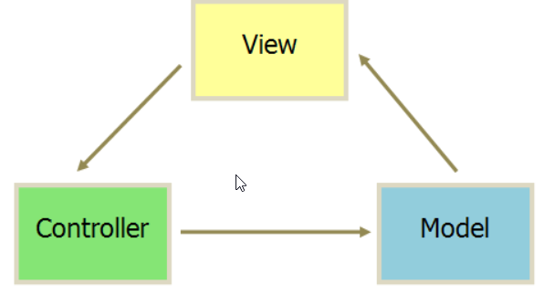
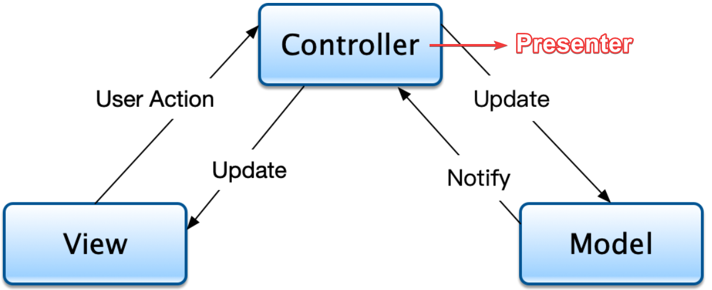
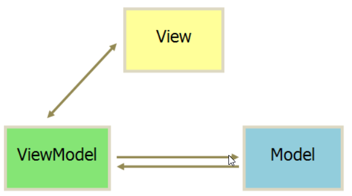
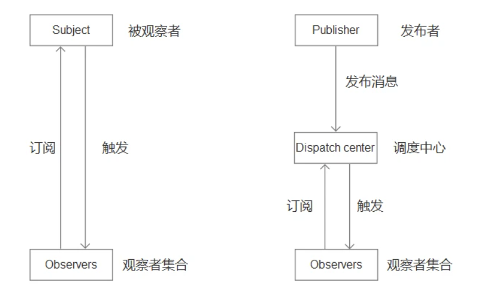

## 架构模式

参考链接：https://www.cnblogs.com/guanghe/p/15186487.html

> 　　复杂的软件必须有清晰合理的架构，否则无法开发和维护。为了将业务和视图的实现代码分离，目前比较流行三种前端架构：
>
> 　　MVC = Model-View-Controller
>
> 　　MVP = Model-View-Presenter
>
> 　　MVVM = Model-View-ViewModel
>
> 　　Model 为模型层，主要管理业务模型的数据和行为；
>
> 　　View 为展示层，其职责就是管理用户界面。
>
> 　　三个架构模式目的都是为了解耦 Model 和 View，主要不同点就在于三者实现解耦的方案不同。

### MVC

> MVC = Model-View-Controller，
>
> - 视图（View）：用户界面。
> - 控制器（Controller）：业务逻辑，将用户的操作反馈给Model，通知其进行数据更新，业务逻辑的中心。
> - 模型（Model）：数据保存
>
> 　　各部分之间的通信方式如下，所有通信都是单向的。
>
> 　  View会接收用户的交互请求并展示数据信息给用户。在 MVC 里，View 被设计为可嵌套的，使用了组合(Composite)模式来实现。比如，列表视图(ListView)或表格视图(TableView)由每个 Item 组成，每个 Item 又可以由图片、文本、按钮等组成。View 是倾向于可复用的，因此，在实际应用中，倾向于将 View 开发成相对通用的组件。
>
> 　　Controller 层主要担任 Model 与 View 之间的桥梁，用于控制程序的流程。Controller 负责确保 View 可以访问到需要显示的 Model 对象数据，并充当 View 了解 Model 更改的渠道。View 接收到用户的交互请求之后，会将请求转发给 Controller，Controller 解析用户的请求之后，数据就会交给对应的 Model。
>
> 　　Model在前端框架中就是数据的存储。在传统后端开发中习惯把业务层归入Model，而对前端框架来说，通常不这样划分。
>
> 
>

### MVP

> MVP 模式将 Controller 改名为 Presenter，同时改变了通信方向。
>
> Controller层变成了**Presenter**（中介者）层，Presenter层既能将页面操作告知Model进行数据更新，又能在数据更新时负责通知View进行更新视图，使View层与Model层解耦。
>
> MVP有以下三个特点：
>
> 1. 各部分之间的通信，都是双向的。
>
> 2. View 与 Model 不发生联系，都通过 Presenter 传递。
>
> 3. View 非常薄，不部署任何业务逻辑，称为"被动视图"（Passive View），即没有任何主动性，而 Presenter非常厚，所有逻辑都部署在那里。
>
> 
>

### MVVM

> MVVM 模式将 Presenter 改名为 ViewModel，MVP 很相似，最大的不同在于 View 和 ViewModel 之间主要是通过数据绑定的方案来实现交互的。
>
> ​	MVVM采用双向绑定（data-binding）：View的变动，自动反映在 ViewModel，反之亦然。AngularJS 和 Vue 都采用这种模式构。　　
>
> 　　要实现数据绑定，通常都采用发布者-订阅者模式进行实现，但这部分工作如果由开发人员自己来写代码实现，其实还是挺复杂的，因此，各大平台都提供了各自的内部实现。比如 Vue 和 AngularJS 自身都实现了数据绑定，Android 目前最主流的方案就是采用 Jetpack，iOS 最常用的方案则是结合 ReactiveCocoa（RAC）实现。
>
> 　　MVP 和 MVVM 都是为了解决界面和数据的分离问题，两者只是采用了不同的实现方案。MVP 之间的交互主要是通过接口实现的，其主要弊端就是需要编写大量接口。而 MVVM 则是通过数据绑定的方式实现交互，虽然其实现需要依赖具体的一些框架工具，但明显大大减少了开发者需要编写的代码量。
>
> MVVM 可以当作是 MVP 的进化，它在前端领域中有着广泛的应用，它不但解决了 MV 耦合的问题，还同时解决了作为中间层当应用规模增加的时候需要维护二者映射关系而产生的大量繁杂代码的问题，提高了开发效率，可读性和维护性。同时，随着对 MV 层的优化（虚拟 DOM，diff 算法，模板编译），还保持了优越的性能。
>
> 
>
> 

### react是哪种模式

> 官方本身没有定论，因为react说到底只是一个js库。它是一个函数 ui = render (data) 的模型。最多算一个 m→v 架构。
>
> 没有所谓的状态管理，只有数据到视图。而所有的数据管理，都是后来社区加上去的。甚至到现在都还没有统一。MVVM一个最显著的特征：双向绑定。
> React没有这个。React是一个单向数据流的库，状态驱动视图。
> State --> View --> New State --> New View
>
> 如果非要说它属于哪种架构模式，算是mvvm架构模式：
>
> 1） M(odel)：对应组件的方法或生命周期函数中实现的`业务逻辑`和`this.state中保存的本地数据`，如果React集成了redux +react-redux，那么组件中的业务逻辑和本地数据可以完全被解耦出来单独存放当做M层，如业务逻辑放在Reducer和Action中。
> 2） View：对应框架在浏览器中`基于虚拟DOM生成的真实DOM`（并不需要我们自己书写）以及我们书写的CSS
>
> 3)  V(iew)-M(odel)：对应组件中的`JSX，它实质上是Virtual DOM的语法糖`。React负责维护 Virtual DOM以及对其进行diff运算，而React-dom 会把Virtual DOM渲染成浏览器中的真实DOM

> **vue**
>
> 个人认为，这是毫无争议的一个MVVM框架，对MVVM理念的贯彻也是最显而易见的。
>
> Model层：接口层，原始数据模型。
>
> View层：视图层，template中的html代码。
>
> ViewModel层：基于一个html元素构建的vue实例。将Model中的原始数据模型，构建成一份View层可以使用的视图模型。这个时候，Model层、View层完全解耦。开发者已经完全不需要顾及View的展示更新了，只需要专注业务逻辑以及ViewModel层与Model的交互逻辑就ok。

## 发布-订阅者模式

https://segmentfault.com/a/1190000020169229

https://www.cnblogs.com/onepixel/p/10806891.html

> #### 1.定义
>
> > **发布-订阅**是一种[消息](https://link.segmentfault.com/?enc=u60NW6C6vDxMYdkX7SrylA%3D%3D.2pqFXM8HFWCq%2BY7VcimcQNWO5yA0vHztw3AoCZ%2BXZcuFwCWKlxdMQfGQ4%2BqK6fcdN0G8uISUxiJzEr4b%2F5Z8TA%3D%3D)[范式](https://link.segmentfault.com/?enc=Hwsc%2FCdqQwhLlWTu9bws2A%3D%3D.L5p7NpHntfj34S3O2FkIB1sFyAH4SCzoFrr41Yqd8lR0SJpwEzn3NR0aeKhG8jcucouGrrqhE5r2FENJQPU1AA%3D%3D)，消息的发送者（称为发布者）不会将消息直接发送给特定的接收者（称为订阅者）。而是将发布的消息分为不同的类别，无需了解哪些订阅者（如果有的话）可能存在。同样的，订阅者可以表达对一个或多个类别的兴趣，只接收感兴趣的消息，无需了解哪些发布者（如果有的话）存在。
>
> 完成订阅发布整个流程需要三个角色：
>
> - **发布者**
> - **事件中心**
> - **订阅者**
>
> **订阅者在订阅事件的时候，只关注事件本身，而不关心谁会发布这个事件；发布者在发布事件的时候，只关注事件本身，而不关心谁订阅了这个事件。**
>
> > 通俗来讲，**`订阅者`**（Subscriber）把自己想订阅的事件**注册**（Subscribe）到**`调度中心`**（Event Channel），当**`发布者`**（Publisher）发布该**事件**（Publish Event）到调度中心，也就是该事件触发时，由调度中心统一调度（Fire Event）订阅者注册到调度中心的处理代码。
> >
> > 例子：
> >
> > 比如我们很喜欢看某个公众号号的文章，但是我们不知道什么时候发布新文章，要不定时的去翻阅；这时候，我们可以关注该公众号，当有文章推送时，会有消息及时通知我们文章更新了。
> >
> > 上面一个看似简单的操作，其实是一个典型的发布订阅模式，公众号属于发布者，用户属于订阅者；用户将订阅公众号的事件注册到调度中心，公众号作为发布者，当有新文章发布时，公众号发布该事件到调度中心，调度中心会及时发消息告知用户。
>
> #### 优点
>
> - 对象之间解耦
> - 异步编程中，可以更松耦合的代码编写
>
> #### 缺点
>
> * 容易造成代码不好维护，在使用不当的情况下，容易造成数据流混乱，(所以才有了 React 提出的单项数据流思想，就是为了解决数据流混乱的问题)
>
> - 性能消耗更大，订阅发布模式需要维护事件列队，订阅的事件越多，内存消耗越大。
> - 虽然可以弱化对象之间的联系，多个发布者和订阅者嵌套一起的时候，程序难以跟踪维护

## 观察者模式

> ### 观察者模式（Observer）
>
> > **观察者模式**定义了一种一对多的依赖关系，让多个**观察者**对象同时监听某一个目标对象，当这个目标对象的状态发生变化时，会通知所有**观察者**对象，使它们能够自动更新。
>
> 观察者模式有完成整个流程需要两个角色：
>
> - 目标
> - 观察者
>
> > 例子：一个班里的学生们都在听老师讲课，当老师布置任务时，会通知学生们都去执行。
>
> #### 优点
>
> * 响应式。目标变化就会通知观察者，这是观察者最大的有点，也是因为这个优点，观察者模式在前端才会这么出名。
>
> #### 缺点
>
> * 不灵活。相比订阅发布模式，由于目标和观察者是耦合在一起的，所以观察者模式需要同时引入目标和观察者才能达到响应式的效果。而订阅发布模式只需要引入事件中心，订阅者和发布者可以不再一处。

## 发布-订阅 观察者之间差异

> **`观察者模式`**：观察者（Observer）直接订阅（Subscribe）主题（Subject），而当主题被激活的时候，会触发（Fire Event）观察者里的事件。
>
> **`发布订阅模式`**：订阅者（Subscriber）把自己想订阅的事件注册（Subscribe）到`调度中心`（Event Channel），当发布者（Publisher）发布该事件（Publish Event）到调度中心，也就是该事件触发时，由调度中心统一调度（Fire Event）订阅者注册到调度中心的处理代码。
>
> 
>
> **`差异`**：
>
> * 从角色角度来看，订阅发布模式需要三种角色，发布者、事件中心和订阅者。观察者模式需要两种角色，目标和观察者，无事件中心负责通信。
> * 从耦合度上来看，订阅发布模式是一个事件中心调度模式，订阅者和发布者是没有直接关联的，通过事件中心进行关联，两者是**解耦**的。而观察者模式中目标和观察者是直接关联的，**耦合在一起**（有些观念说观察者是解耦，解耦的是业务代码，不是目标和观察者本身）。
>
> - 在观察者模式中，观察者是知道 Subject 的，Subject 一直保持对观察者进行记录。然而，在发布订阅模式中，发布者和订阅者不知道对方的存在。它们只有通过消息代理进行通信。
> - 在发布订阅模式中，组件是松散耦合的，正好和观察者模式相反。
> - 观察者模式大多数时候是同步的，比如当事件触发，Subject 就会去调用观察者的方法。而发布-订阅模式大多数时候是异步的（使用消息队列）。
> - 观察者模式需要在单个应用程序地址空间中实现，而发布-订阅更像交叉应用模式。