## HTTP协议

### GET和POST的请求的区别 

> 一个HTTP方法是**幂等**的，指的是同样的请求被执行一次与`连续`执行多次的效果是一样的，服务器的状态也是一样的
>
> `GET`方法请求一个指定资源的表示形式，使用GET的请求应该只被用于获取数据
>
> `POST`方法用于将实体提交到指定的资源，通常导致在服务器上的状态变化或**副作用**
>
> 本质上都是`TCP`链接，并无差别
>
> 但是由于`HTTP`的规定和浏览器/服务器的限制，导致他们在应用过程中会体现出一些区别

> Post 和 Get 是 HTTP 请求的两种方法，其区别如下：
>
> - **应用场景：**GET 请求是一个幂等的请求，一般 Get 请求用于对服务器资源不会产生影响的场景，比如说请求一个网页的资源。而 Post 不是一个幂等的请求，一般用于对服务器资源会产生影响的情景，比如注册用户这一类的操作。
> - **是否缓存：**因为两者应用场景不同，浏览器一般会对 Get 请求缓存，但很少对 Post 请求缓存。
> - **发送的报文格式：**Get 请求的报文中实体部分为空，Post 请求的报文中实体部分一般为向服务器发送的数据。
> - **安全性：**Get 请求可以将请求的参数放入 url 中向服务器发送，这样的做法相对于 Post 请求来说是不太安全的，因为请求的 url 会被保留在历史记录中。
> - **请求长度：**浏览器由于对 url 长度的限制，所以会影响 get 请求发送数据时的长度。这个限制是浏览器规定的，并不是 RFC 规定的。
> - **参数类型：**post 的参数传递支持更多的数据类型。GET只接受ASCII字符
>
> > 协议并没有规定数据必须 **使用什么编码方式** ,开发者可以自己决定。https://segmentfault.com/a/1190000014343759

### 常见的HTTP请求方法

> - GET: 向服务器获取数据；
> - POST：将实体提交到指定的资源，通常会造成服务器资源的修改；
> - PUT：上传文件，更新数据；
> - DELETE：删除服务器上的对象；
> - HEAD：获取`报文首部`，与GET相比，不返回报文主体部分；
> - OPTIONS：询问支持的请求方法，用来跨域请求；
> - CONNECT：要求在与`代理服务器`通信时建立隧道，使用隧道进行TCP通信；
> - TRACE: `回显服务器`收到的请求，主要⽤于测试或诊断。

### HTTP 1.0 和 HTTP 1.1 之间有哪些区别？

> **HTTP 1.0和 HTTP 1.1** **有以下区别**：
>
> - **`连接`方面**，http1.0 默认使用`非持久连接`，而 http1.1 默认使用`持久连接`。http1.1 通过使用持久连接来使`多个` http 请求`复用`同一个 `TCP 连接`，以此来`避免`使用非持久连接时每次需要`建立连接的时延`。
> - **`资源请求`方面**，在 http1.0 中，存在一些`浪费带宽`的现象，例如客户端只是需要某个`对象`的一部分，而服务器却将整个对象送过来了，并且不支持`断点续传`功能，http1.1 则在请求头引入了 `range 头域`，它允许只请求资源的某个部分，即返回码是 `206`（Partial Content），这样就方便了开发者自由的选择以便于充分利用带宽和连接。
> - **`缓存`方面**，在 http1.0 中主要使用 header 里的 `If-Modified-Since`、`Expires` 来做为缓存判断的标准，http1.1 则引入了更多的缓存控制策略，例如 Etag、If-Unmodified-Since、If-Match、If-None-Match 等更多可供选择的缓存头来`控制缓存策略`。
> - http1.1 中**新增了 `host` 字段**，用来`指定`服务器的`域名`。http1.0 中认为每台服务器都绑定一个唯一的 IP 地址，因此，请求消息中的 URL 并没有传递主机名（hostname）。但随着虚拟主机技术的发展，在一台物理服务器上可以存在多个虚拟主机，并且它们共享一个IP地址。因此有了 host 字段，这样就可以将请求发往到同一台服务器上的不同网站。
> - http1.1 相对于 http1.0 还新增了很多**`请求方法`**，如 PUT、HEAD、OPTIONS 等。

### HTTP 1.1 和 HTTP 2.0 的区别

> - **`二进制协议`**：HTTP/2 是一个二进制协议。在 HTTP/1.1 版中，报文的头信息必须是文本（ASCII 编码），数据体可以是文本，也可以是二进制。HTTP/2 则是一个彻底的二进制协议，头信息和数据体都是二进制，并且`统称为"帧"`，可以分为头信息帧和数据帧。 帧的概念是它实现多路复用的基础。
> - **多路复用：**HTTP/2 实现了`多路复用`，HTTP/2 仍然复用` TCP 连接`，但是在`一个连接里`，`客户端和服务器都可以同时`发送多个请求或回应，而且不用按照顺序一一发送，这样就避免了"队头堵塞"【1】的问题。
> - **数据流：**HTTP/2 使用了`数据流`的概念，因为 HTTP/2 的数据包是不按顺序发送的，同一个连接里面连续的`数据包`，可能属于不同的请求。因此，必须要对数据包做标记，指出它属于哪个请求。HTTP/2 将每个请求或回应的`所有数据包，称为一个数据流`。每个数据流都有一个独一无二的编号。数据包发送时，都必须标记数据流 ID ，用来区分它属于哪个数据流。
> - **头信息压缩：**HTTP/2 实现了`头信息压缩`，由于 HTTP 1.1 协议不带状态，每次请求`都必须附上所有信息`。所以，请求的很多字段都是重复的，比如 `Cookie` 和 `User Agent` ，一模一样的内容，每次请求都必须附带，这会浪费很多带宽，也影响速度。HTTP/2 对这一点做了优化，引入了`头信息压缩机制`。一方面，头信息使用 gzip 或 compress 压缩后再发送；另一方面，客户端和服务器`同时维护一张头信息表`，所有字段都会存入这个表，生成一个索引号，以后就不发送同样字段了，只发送索引号，这样就能提高速度了。
> - **服务器推送：**HTTP/2 允许服务器未经请求，`主动向客户端发送资源`，这叫做服务器推送。使用服务器推送提前给客户端推送必要的资源，这样就可以相对减少一些延迟时间。这里需要注意的是 http2 下服务器主动推送的`是静态资源`，和 WebSocket 以及使用 SSE 等方式向客户端发送即时数据的推送是不同的
>
> **【1】队头堵塞：**
>
> 队头阻塞是由 HTTP 基本的“请求 - 应答”模型所导致的。HTTP 规定报文必须是“一发一收”，这就形成了一个先进先出的“串行”队列。队列里的请求是没有优先级的，只有入队的先后顺序，排在最前面的请求会被最优先处理。如果队首的请求因为处理的太慢耽误了时间，那么队列里后面的所有请求也不得不跟着一起等待，结果就是其他的请求承担了不应有的时间成本，造成了队头堵塞的现象。

### HTTP和HTTPS协议的区别

> HTTP和HTTPS协议的主要区别如下：
>
> - HTTP协议是超文本传输协议，信息是`明文传输`的，HTTPS则是具有安全性的`SSL加密传输协议`；
> - 使用不同的连接方式，`端口`也不同，HTTP协议端口是80，HTTPS协议端口是443；
> - HTTP协议连接很简单，是`无状态`的；HTTPS协议是有`SSL和HTTP协议`构建的可进行`加密传输`、`身份认证`的网络协议，比HTTP更加安全。
> - HTTPS协议需要`CA证书`，费用较高；而HTTP协议不需要；
>
> ps SSL:安全套接字协议,在[传输层](https://baike.baidu.com/item/传输层/4329536)与[应用层](https://baike.baidu.com/item/应用层/16412033)之间对网络连接进行加密。

### 当在浏览器中输入 Google.com 并且按下回车之后发生了什么？

> （1）**解析URL：**首先会对 URL 进行解析，分析所需要使用的`传输协议`和`请求的资源的路径`。
>
> ​		如果输入的 URL 中的`协议`或者`主机名`不合法，将会把地址栏中输入的内容传递给搜索引擎。
>
> ​		如果没有问题，浏览器会检查 URL 中是否出现了`非法字符`
>
> ​		如果存在非法字符，则对非法字符进行转义后再进行下一过程。
>
> （2）**缓存判断：**浏览器会判断所请求的资源`是否在缓存`里，
>
> ​		如果请求的资源在缓存里并且没有失效，那么就直接使用，
>
> ​		`否则`向服务器`发起新的请求`。
>
> （3）**DNS解析：**下一步首先需要`获取`的是输入的 URL 中的`域名`的 `IP 地址`，
>
> ​		首先会判断`本地`是否有该域名的 IP 地址的缓存，如果有则使用，如果没有则向`本地 DNS 服务器`发起请求。
>
> ​		本地 DNS 服务器也会先检查是否存在缓存，如果没有就会先向`根域名服务器`发起请求，
>
> ​		获得负责的`顶级域名服务器`的地址后，`再`向顶级域名服务器请求，然后获得负责的`权威域名服务器`的地址后，再向权威域名服务器发起请求，
>
> ​		最终获得域名的 IP 地址后，本地 DNS 服务器再将这个 IP 地址`返回`给请求的用户。
>
> ​		用户（浏览器）向本地 DNS 服务器发起请求属于递归请求，本地 DNS 服务器向各级域名服务器发起请求属于迭代请求。
>
> （4）**获取MAC地址：**当浏览器得到 IP 地址后，数据传输还需要知道目的主机 MAC 地址
>
> ​		因为`应用层`下发数据给`传输层`，TCP 协议会指定`源端口号`和`目的端口号`，然后下发给`网络层`。网络层会将本机地址作为`源地址`，获取的 IP 地址作为`目的地址`。然后将下发给`数据链路层`，数据链路层的发送需要加入通信双方的 `MAC 地址`，本机的 MAC 地址作为源 MAC 地址，目的 MAC 地址需要分情况处理。
>
> ​		通过将 IP 地址与本机的子网掩码相与，可以判断是否与请求主机在同一个子网里：
>
> ​		如果在同一个子网里，可以使用 APR 协议获取到目的主机的 MAC 地址，
>
> ​		如果不在一个子网里，那么请求应该`转发`给网关，由它代为转发，此时同样可以通过 ARP(根据IP地址获取物理地址的TCP/IP协议) 协议来获取网关的 MAC 地址，此时目的主机的 MAC 地址应该为`网关`的`地址`。
>
> （5）**TCP三次握手：**下面是 TCP 建立连接的三次握手的过程，
>
> ​		首先客户端向服务器发送一个 SYN 连接请求报文段和一个随机序号，
>
> ​		服务端接收到请求后向服务器端发送一个 SYN ACK报文段，确认连接请求，并且也向客户端发送一个随机序号。
>
> ​		客户端接收服务器的确认应答后，进入连接建立的状态，同时向服务器也发送一个ACK 确认报文段，服务器端接收到确认后，也进入连接建立状态，此时双方的连接就建立起来了。
>
> （6）**HTTPS握手：**如果使用的是 HTTPS 协议，在通信前还存在 TLS(传输层安全) 的一个`四次握手`的过程。
>
> 1. clientHello，首先由客户端向服务器端发送  客户端支持的`协议版本`、`加密算法`、`压缩方法`和 `随机数 R1`。
> 2. SeverHello，服务器端收到后，确认使用的`加密通信协议版本`、`加密算法`。发送给客户端自己的`数字证书`、`加密公钥`和`随机数 R2`。
> 3. 客户端收到后，首先`检查`数字证书是否有效，如果有效，则再生成一个`随机数 R3`。此时浏览器根据3个随机数，通过一定算法生成会话秘钥（这个秘钥就是接下来双方进行**对称加密解密**使用的密钥）。接下来会话都会加密，客户端发送握手结束通知（一个前面所有内容的 hash 值供服务器端检验）
> 4. 服务器收到客户端的第三个随机数之后，使用同样的算法计算出 “会话密钥” ，通知编码变更，通知握手结束，同时向客户端发送一个前面所有内容的 hash 值供客户端检验。
>
> 至此，整个握手阶段全部结束。接下来，客户端与服务器进入加密通信，就完全是使用普通的 HTTP 协议，只不过用 “会话密钥” 加密内容。（**非对称加密解密将不再使用，接下来完全由对称加密接手了，因为密钥已经安全的传送给了通信的双方**）
>
> （7）**返回数据：**当页面请求发送到服务器端后，服务器端会返回一个 html 文件作为响应，浏览器接收到响应后，开始对 html 文件进行解析，开始页面的渲染过程。
>
> （8）**页面渲染：**浏览器首先会根据 html 文件构建 DOM 树，根据解析到的 css 文件构建 CSSOM 树，
>
> ​			如果遇到 script 标签，则判断是否含有 defer 或者 async 属性，要不然 script 的加载和执行会造成页面的渲染的阻塞。
>
> ​			当 DOM 树和 CSSOM 树建立好后，根据它们来构建渲染树。渲染树构建好后，会根据渲染树来进行布局。布局完成后，最后使用浏览器的 UI 接口对页面进行绘制。这个时候整个页面就显示出来了。
>
> （9）**TCP四次挥手：**最后一步是 TCP 断开连接的四次挥手过程。若客户端认为数据发送完成，则它需要向服务端发送连接释放请求。服务端收到连接释放请求后，会告诉应用层要释放 TCP 链接。然后会发送 ACK 包，并进入 CLOSE_WAIT 状态，此时表明客户端到服务端的连接已经释放，不再接收客户端发的数据了。但是因为 TCP 连接是双向的，所以服务端仍旧可以发送数据给客户端。服务端如果此时还有没发完的数据会继续发送，完毕后会向客户端发送连接释放请求，然后服务端便进入 LAST-ACK 状态。客户端收到释放请求后，向服务端发送确认应答，此时客户端进入 TIME-WAIT 状态。该状态会持续 2MSL（最大段生存期，指报文段在网络中生存的时间，超时会被抛弃） 时间，若该时间段内没有服务端的重发请求的话，就进入 CLOSED 状态。当服务端收到确认应答后，也便进入 CLOSED 状态。

### TCP的三次握手和四次挥手

> #### （1）三次握手
>
> 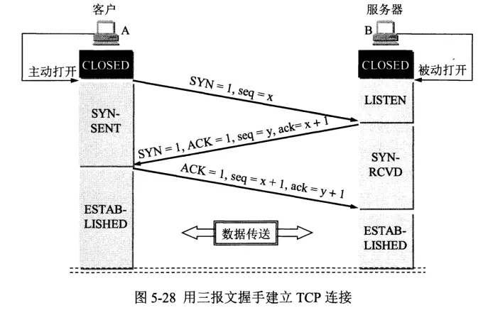
>
> 三次握手（Three-way Handshake）其实就是指建立一个TCP连接时，需要客户端和服务器总共发送3个包。进行三次握手的`主要作用`就是为了确认双方的`接收能力`和`发送能力`是否正常、指定自己的初始化序列号为后面的可靠性传送做准备。`实质上`其实就是连接服务器指定端口，建立TCP连接，并同步连接双方的序列号和确认号，交换TCP窗口大小信息。
>
> ps:SYN为同步,用于启动和建立连接时，同步设备之间的序列号，
>
> ACK为确认,向另一端确认已经收到 SYN，数值为收到 SYN 增一。
>
>    ` 初始化序列号ISN <==> 初始序号seq`    `ACK的值 <==>确认号ack`

> 刚开始客户端处于 Closed 的状态，服务端处于 Listen 状态。
>
> - 第一次握手：客户端给服务端发一个 `SYN 报文`，并指明客户端的初始化序列号 ISN，此时客户端处于 SYN_SEND 状态。
>
>   > 首部的同步位SYN=1，`初始序号`seq=x，SYN=1的报文段`不能携带数据，但要消耗掉一个序号。`
>
> - 第二次握手：服务器收到客户端的 SYN 报文之后，会以自己的 `SYN 报文`作为应答，并且也是指定了自己的初始化序列号 ISN。同时会把客户端的 ISN + 1 作为ACK 的值，表示自己已经收到了客户端的 SYN，此时服务器处于 SYN_REVD 的状态。
>
>   > 在确认报文段中SYN=1，ACK=1，初始序号seq=y，确认号ack=x+1
>
> - 第三次握手：客户端收到 SYN 报文之后，会发送一个 `ACK 报文`，当然，也  是一样把服务器的 ISN + 1 作为 ACK 的值，表示已经收到了服务端的 SYN 报文，此时客户端处于 ESTABLISHED 状态。服务器收到 ACK 报文之后，也处于 ESTABLISHED 状态，此时，双方已建立起了连接。
>
>   > 确认报文段ACK=1，序号seq=x+1（初始为seq=x，第二个报文段所以要+1），确认号ack=y+1，，`ACK报文段可以携带数据，不携带数据则不消耗序号。`
>
> 
>
> **那为什么要三次握手呢？两次不行吗？**
>
> - 为了确认双方的接收能力和发送能力都正常
> - 如果是用两次握手，则会出现下面这种情况：
>
> 如客户端发出连接请求，但因连接请求报文丢失而未收到确认，于是客户端再重传一次连接请求。后来收到了确认，建立了连接。数据传输完毕后，就释放了连接，客户端共发出了两个连接请求报文段，其中第一个丢失，第二个到达了服务端，但是第一个丢失的报文段只是在某些网络结点长时间滞留了，延误到连接释放以后的某个时间才到达服务端，此时服务端误认为客户端又发出一次新的连接请求，于是就向客户端发出确认报文段，同意建立连接，不采用三次握手，只要服务端发出确认，就建立新的连接了，此时客户端忽略服务端发来的确认，也不发送数据，则服务端一直等待客户端发送数据，浪费资源。
>
> 
>
> **简单来说就是以下三步：**
>
> - **第一次握手：**客户端向服务端发送连接请求报文段。该报文段中包含自身的数据通讯初始序号。请求发送后，客户端便进入 SYN-SENT 状态。
> - **第二次握手：**服务端收到连接请求报文段后，如果同意连接，则会发送一个应答，该应答中也会包含自身的数据通讯初始序号，发送完成后便进入 SYN-RECEIVED 状态。
> - **第三次握手：**当客户端收到连接同意的应答后，还要向服务端发送一个确认报文。客户端发完这个报文段后便进入 ESTABLISHED 状态，服务端收到这个应答后也进入 ESTABLISHED 状态，此时连接建立成功。
>
> 
>
> TCP 三次握手的建立连接的过程就是相互确认初始序号的过程，告诉对方，什么样序号的报文段能够被正确接收。 `第三次握手的作用是客户端对服务器端的初始序号的确认`。如果只使用两次握手，那么服务器就没有办法知道自己的序号是否 已被确认。同时这样也是为了防止失效的请求报文段被服务器接收，而出现错误的情况。
>
> > [参考](https://github.com/pro648/tips/blob/master/sources/%E4%B8%89%E6%AC%A1%E6%8F%A1%E6%89%8B%E3%80%81%E4%B8%83%E6%AC%A1%E6%8F%A1%E6%89%8B%E3%80%81%E5%9B%9B%E6%AC%A1%E6%8C%A5%E6%89%8B.md)
> >
> > TCP 连接的双方通过三次握手确定 TCP 连接的初始序列号、窗口大小以及最大数据段，这样通信双方就能利用连接中的初始序列号保证双方数据段的不重不漏，通过窗口大小控制流量，并使用最大数据段避免 IP 协议对数据包分片。
> >
> > 换个角度看为什么需要三次握手？客户端和服务端通信前要进行连接，三次握手就是为了确保自己和对方的收发能力是正常的。
> >
> > 1. 第一次握手：客户端发送、服务端接收网络包，服务端可以得出：客户端发送能力、服务端接收能力是正常的。
> > 2. 第二次握手：服务端发送、客户端接收网络包。从客户端的视角来看，我接收到了服务端发送的响应数据包，说明服务端收到了第一次握手时我发出的网络包，且收到请求后进行了响应，这说明服务端的接收、发送能力正常，我的发送、接收能力正常。
> > 3. 第三次握手：客户端发送、服务端接收网络包，这样服务端就能得出结论：客户端的接收、发送能力正常，服务端的发送、接收能力正常。第一次、二次握手后，服务端并不知道客户端的接收能力，以及自己的发送能力是否正常。第三次握手后，这些能力才得以确认。
> >
> > 三次握手后，客户端、服务端才确认了自己的接收、发送能力均是正常的
>
> #### （2）四次挥手
>
> 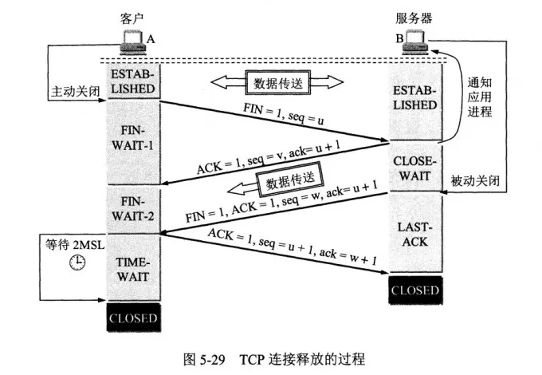
>
> 刚开始双方都处于 ESTABLISHED 状态，假如是客户端先发起关闭请求。四次挥手的过程如下：

> - 第一次挥手： 客户端会发送一个 FIN 报文，报文中会指定一个序列号。此时客户端处于 FIN_WAIT1 状态。
>
>   > 即发出`连接释放报文段`（FIN=1，序号seq=u），并停止再发送数据，主动关闭TCP连接，进入FIN_WAIT1（终止等待1）状态，等待服务端的确认。
>
> - 第二次挥手：服务端收到 FIN 之后，会发送 ACK 报文，且把客户端的`序列号值` +1 作为 `ACK` 报文的序列号值，表明已经收到客户端的报文了，此时服务端处于 CLOSE_WAIT 状态。
>
>   > 即服务端收到连接释放报文段后即发出`确认报文段`（ACK=1，确认号ack=u+1，序号seq=v），服务端进入CLOSE_WAIT（关闭等待）状态，此时的TCP处于半关闭状态，客户端到服务端的连接释放。客户端收到服务端的确认后，进入FIN_WAIT2（终止等待2）状态，等待服务端发出的连接释放报文段。
>
> - 第三次挥手：如果服务端也想断开连接了，和客户端的第一次挥手一样，发给 FIN 报文，且指定一个序列号。此时服务端处于 LAST_ACK 的状态。
>
>   > 即服务端没有要向客户端发出的数据，服务端发出`连接释放报文段`（FIN=1，ACK=1，序号seq=w，确认号ack=u+1），服务端进入LAST_ACK（最后确认）状态，等待客户端的确认。
>
> - 第四次挥手：客户端收到 FIN 之后，一样发送一个 ACK 报文作为应答，且把服务端的序列号值 +1 作为自己 ACK 报文的序列号值，此时客户端处于 TIME_WAIT 状态。需要过一阵子以确保服务端收到自己的 ACK 报文之后才会进入 CLOSED 状态，服务端收到 ACK 报文之后，就处于关闭连接了，处于 CLOSED 状态。
>
>   > 即客户端收到服务端的连接释放报文段后，对此发出`确认报文段`（ACK=1，seq=u+1，ack=w+1），客户端进入TIME_WAIT（时间等待）状态。此时TCP未释放掉，需要经过时间等待计时器设置的时间`2MSL`(最长报文段寿命)后，客户端才进入CLOSED状态。服务端收到确认应答后，也便进入 CLOSED 状态。

> **那为什么需要四次挥手呢？**
>
> 因为当服务端收到客户端的SYN连接请求报文后，可以直接发送SYN+ACK报文。其中ACK报文是用来应答的，SYN报文是用来同步的。但是关闭连接时，当服务端收到FIN报文时，很可能并不会立即关闭SOCKET，所以只能先回复一个ACK报文，告诉客户端，“你发的FIN报文我收到了”。只有等到我服务端所有的报文都发送完了，我才能发送FIN报文，因此不能一起发送，故需要四次挥手。
>
> 
>
> **简单来说就是以下四步：**
>
> - **第一次****挥手****：**若客户端认为数据发送完成，则它需要向服务端发送连接释放请求。
> - **第二次****挥手**：服务端收到连接释放请求后，会告诉应用层要释放 TCP 链接。然后会发送 ACK 包，并进入 CLOSE_WAIT 状态，此时表明客户端到服务端的连接已经释放，不再接收客户端发的数据了。但是因为 TCP 连接是双向的，所以服务端仍旧可以发送数据给客户端。
> - **第三次挥手**：服务端如果此时还有没发完的数据会继续发送，完毕后会向客户端发送连接释放请求，然后服务端便进入 LAST-ACK 状态。
> - **第四次****挥手****：**客户端收到释放请求后，向服务端发送确认应答，此时客户端进入 TIME-WAIT 状态。该状态会持续 2MSL（最大段生存期，指报文段在网络中生存的时间，超时会被抛弃） 时间，若该时间段内没有服务端的重发请求的话，就进入 CLOSED 状态。当服务端收到确认应答后，也便进入 CLOSED 状态。
>
> 
>
> TCP 使用四次挥手的原因是因为 TCP 的连接是全双工的，所以需要双方分别释放到对方的连接，单独一方的连接释放，只代表不能再向对方发送数据，连接处于的是半释放的状态。
>
> 
>
> 最后一次挥手中，客户端会等待一段时间再关闭的原因，是为了防止发送给服务器的确认报文段丢失或者出错，从而导致服务器 端不能正常关闭。

### 对 WebSocket 的理解

> **背景**：我们知道HTTP协议是半双工通信的，同一时刻数据只能单向流动，而且只能是客户端向服务器发起请求，服务器返回请求结果，服务器不能主动向服务端推送信息。
>
> WebSocket是HTML5提供的一种浏览器与服务器进行**全双工通讯**的网络技术，属于应用层协议。它基于TCP传输协议，并复用HTTP的握手通道。浏览器和服务器只需要完成一次握手，两者之间就直接可以创建持久性的连接， 并进行双向数据传输。
>
> WebSocket 的出现就解决了半双工通信的弊端。它最大的特点是：**服务器可以向客户端主动推动消息，客户端也可以主动向服务器推送消息。**
>
> **WebSocket原理**：客户端向 WebSocket 服务器通知（notify）一个带有`所有接收者ID`（recipients IDs）的事件（event），服务器接收后立即通知所有活跃的（active）客户端，只有ID在接收者ID序列中的客户端才会处理这个事件。
>
> **WebSocket 特点的如下：**
>
> - 支持双向通信，实时性更强
> - 可以发送文本，也可以发送二进制数据
> - 建立在TCP协议之上，服务端的实现比较容易
> - 数据格式比较轻量，性能开销小，通信高效
> - 没有同源限制，客户端可以与任意服务器通信
> - 协议标识符是ws（如果加密，则为wss），服务器网址就是 URL
> - 与 HTTP 协议有着良好的兼容性。默认端口也是80和443，并且握手阶段采用 HTTP 协议，因此握手时不容易屏蔽，能通过各种 HTTP 代理服务器。
>
> **Websocket的使用方法如下：**
>
> 客户端：
>
> > 可以看到 WebSocket 实例的 API 很容易理解，简单好用，通过 send() 方法可以发送消息，onmessage 事件用来接收消息，然后对消息进行处理显示在页面上。当 onerror 事件（监听连接失败）触发时，最好进行执行重连，以保持连接不中断。
>
> ```js
> function connectWebsocket() {
>     ws = new WebSocket('ws://localhost:9000');
>     // 监听连接成功
>     ws.onopen = () => {
>         console.log('连接服务端WebSocket成功');
>         ws.send(JSON.stringify(msgData));	// send 方法给服务端发送消息
>     };
> 
>     // 监听服务端消息(接收消息)
>     ws.onmessage = (msg) => {
>         let message = JSON.parse(msg.data);
>         console.log('收到的消息：', message)
>         elUl.innerHTML += `<li class="b">小秋：${message.content}</li>`;
>     };
> 
>     // 监听连接失败
>     ws.onerror = () => {
>         console.log('连接失败，正在重连...');
>         connectWebsocket();
>     };
> 
>     // 监听连接关闭
>     ws.onclose = () => {
>     	console.log('连接关闭');
>     };
> };
> connectWebsocket();
> ```
>
> 服务端 Node: （这里使用 ws 库）
>
> ```js
> const path = require('path');
> const express = require('express');
> const app = express();
> const server = require('http').Server(app);
> const WebSocket = require('ws');
> 
> const wss = new WebSocket.Server({ server: server });
> 
> wss.on('connection', (ws) => {
> 
>   // 监听客户端发来的消息
>   ws.on('message', (message) => {
>     console.log(wss.clients.size);
>     let msgData = JSON.parse(message);
>     if (msgData.type === 'open') {
>       // 初始连接时标识会话
>       ws.sessionId = `${msgData.fromUserId}-${msgData.toUserId}`;
>     } else {
>       let sessionId = `${msgData.toUserId}-${msgData.fromUserId}`;
>       wss.clients.forEach(client => {
>         if (client.sessionId === sessionId) {
>           client.send(message);	 // 给对应的客户端连接发送消息
>         }
>       })
>     }
>   })
> 
>   // 连接关闭
>   ws.on('close', () => {
>     console.log('连接关闭');
>   });
> });
> ```
>
> **WebSocket的API**
>
> * WebSocket构造函数
>
>   WebSocket对象作为一个构造函数，用于新建webSocket实例:
>
>   ```js
>   let ws = new WebSocket('ws://localhost:9999');
>   ```
>
>   执行上面的语句之后，就会与服务器进行连接。
>
> * webSocket.readyState
>
>   readyState属性会返回实例对象的当前状态，其值共有四种:
>
>   * CONNECTING:值为0，表示正在连接。
>   * OPEN:值为1，表示连接成功，可以通信了。
>   * CLOSING:值为2，表示连接正在关闭。
>   * CLOSED:值为3，表示连接已经关闭，或者打开连接失败。
>
> * webSocket.onopen
>
>   实例对象的onopen属性用于指定连接成功之后的回调函数，建立连接后触发
>
>   如果需要指定多个回调函数，可以使用addEventListener方法（下面都一样）
>
> * webSocket.onclose
>
>   实例对象的onclose属性用于指定关闭连接之后的回调函数
>
> * webSocket.onmessage
>
>   实例对象的onmessage属性用于指定接收到服务器数据后的回调函数
>
> * webSocket.send();
>
>   实例对象的send()方法用于向服务器发送数据
>
> * webSocket.bufferesAmount
>
>   实例对象的bufferedAmount属性，表示还有多少字节的二进制数据没有发送出去。它可以用来判断发送是否结束:
>
> * webSocket.onerror
>
>   实例对象的onerror属性用于指定报错时的回调函数:

### 即时通讯的实现：短轮询、长轮询、SSE 和 WebSocket 间的区别？

> 短轮询和长轮询的目的都是用于实现客户端和服务器端的一个即时通讯。
>
> **短轮询的基本思路：**浏览器每隔一段时间向服务器发送 http 请求，服务器端在收到请求后，不论是否有数据更新，都直接进行响应。这种方式实现的即时通信，本质上还是浏览器发送请求，服务器接受请求的一个过程，通过让客户端不断的进行请求，使得客户端能够模拟实时地收到服务器端的数据的变化。这种方式的优点是比较简单，易于理解。缺点是这种方式由于需要不断的建立 http 连接，`严重浪费了服务器端和客户端的资源`。当用户增加时，服务器端的压力就会变大，这是很不合理的。
>
> **长轮询的基本思路：**首先由客户端向服务器发起请求，当服务器收到客户端发来的请求后，服务器端不会直接进行响应，而是先将这个请求挂起，然后判断服务器端数据是否有更新。如果有更新，则进行响应，如果一直没有数据，则到达一定的时间限制才返回。客户端 JavaScript 响应处理函数会在处理完服务器返回的信息后，再次发出请求，重新建立连接。长轮询和短轮询比起来，它的优点是明显减少了很多不必要的 http 请求次数，相比之下节约了资源。长轮询的缺点在于，连接挂起也会导致资源的浪费。
>
> **SSE 的基本思想：**(Server-Sent Events)服务器使用流信息向浏览器推送信息。严格地说，http 协议无法做到服务器主动推送信息。但是，有一种变通方法，就是服务器向客户端声明，接下来要发送的是流信息。也就是说，发送的不是一次性的数据包，而是一个数据流，会连续不断地发送过来。这时，客户端不会关闭连接，会一直等着服务器发过来的新的数据流，视频播放就是这样的例子。SSE 就是利用这种机制，使用流信息向浏览器推送信息。它基于 http 协议，目前除了 IE/Edge，其他浏览器都支持。它相对于前面两种方式来说，不需要建立过多的 http 请求，相比之下节约了资源。
>
> **WebSocket** 是 HTML5 定义的一个新协议，与传统的 http 协议不同，该协议允许由服务器主动的向客户端推送信息。使用 WebSocket 协议的缺点是在服务器端的配置比较复杂。WebSocket 是一个全双工的协议，也就是通信双方是平等的，可以相互发送消息，而 SSE 的方式是单向通信的，只能由服务器端向客户端推送信息，如果客户端需要发送信息就是属于下一个 http 请求了。
>
> **WebSocket 特点的如下：**
>
> - 支持双向通信，实时性更强
> - 可以发送文本，也可以发送二进制数据
> - 建立在TCP协议之上，服务端的实现比较容易
> - 数据格式比较轻量，性能开销小，通信高效
> - 没有同源限制，客户端可以与任意服务器通信
> - 协议标识符是ws（如果加密，则为wss），服务器网址就是 URL
> - 与 HTTP 协议有着良好的兼容性。默认端口也是80和443，并且握手阶段采用 HTTP 协议，因此握手时不容易屏蔽，能通过各种 HTTP 代理服务器。
>
> 
>
> **上面的四个通信协议，前三个都是基于HTTP协议的。**
>
> 对于这四种即使通信协议，从性能的角度来看：
>
> **WebSocket > 长连接（SEE） > 长轮询 > 短轮询**
>
> 但是，我们如果考虑浏览器的兼容性问题，顺序就恰恰相反了：
>
> **短轮询 > 长轮询 > 长连接（SEE） > WebSocket**
>
> 所以，还是要根据具体的使用场景来判断使用哪种方式。

### HTTP请求报文的是什么样的？

> 请求报⽂有4部分组成: 
>
> - 请求行 
> - 请求头部 
> - 空行
> - 请求体 
>
> 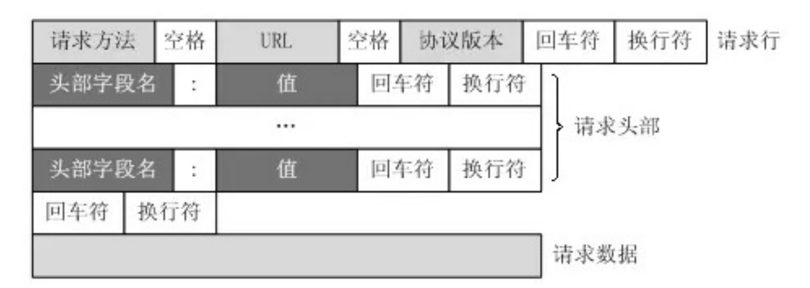
>
> **其中：**
>
> （1）请求⾏包括：请求⽅法字段、URL字段、HTTP协议版本字段。它们⽤空格分隔。例如，GET /index.html HTTP/1.1。 
>
> （2）请求头部:请求头部由关键字/值对组成，每⾏⼀对，关键字和值⽤英⽂冒号“:”分隔  
>
> - User-Agent：产⽣请求的浏览器类型。 
> - Accept：客户端可识别的内容类型列表。 
> - Host：请求的主机名，允许多个域名同处⼀个IP地址，即虚拟主机。 
>
> （3）请求体: post put等请求携带的数据 
>
> 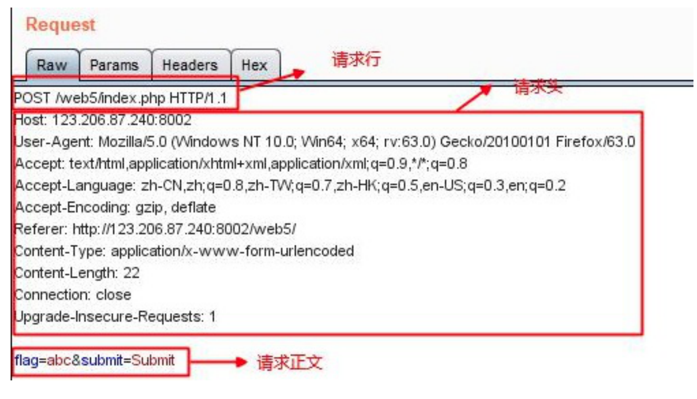

### HTTP响应报文的是什么样的？

> 响应报⽂有4部分组成: 
>
> - 响应⾏ 
> - 响应头 
> - 空⾏
> - 响应体 
>
> 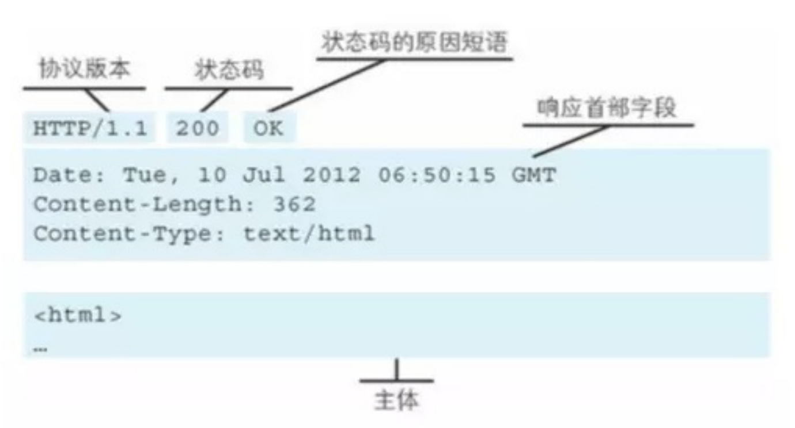
>
> - 响应⾏：由网络协议版本，状态码和状态码的原因短语组成，例如 HTTP/1.1 200 OK 。 
> - 响应头：响应部⾸组成 ，比如日期Date，Content-Type
> - 响应体：服务器响应的数据 

## HTTPS协议

### 什么是HTTPS协议？

> 超文本传输安全协议（Hypertext Transfer Protocol Secure，简称：HTTPS）是一种通过计算机网络进行`安全通信`的传输协议。HTTPS经由HTTP进行通信，利用SSL/TLS来加密数据包。HTTPS的主要目的是提供对网站服务器的`身份认证`，保护交换数据的`隐私`与`完整性`。
>
> 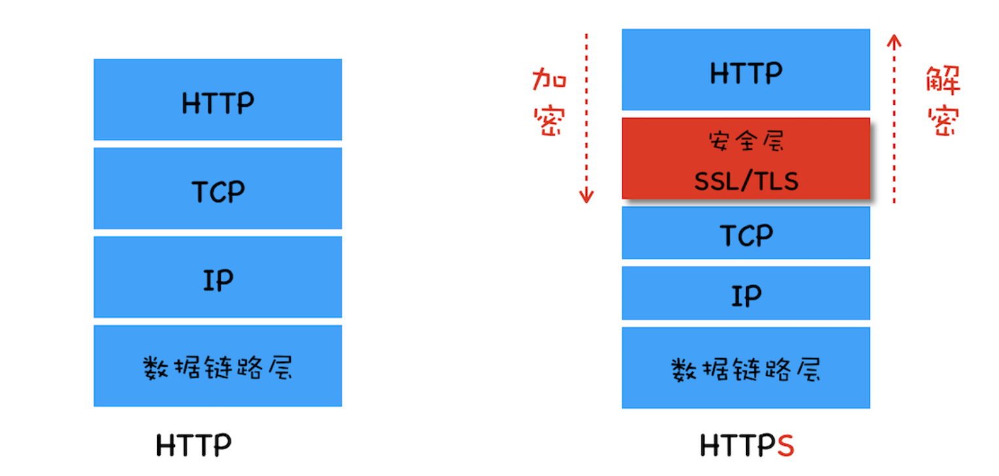
>
> HTTP协议采用**明文传输**信息，存在**信息`窃听`**、**信息`篡改`**和**信息`劫持`**的风险，而协议TLS/SSL具有**身份验证**、**信息加密**和**完整性校验**的功能，可以避免此类问题发生。
>
> 安全层的主要职责就是**对发起的HTTP请求的数据进行加密操作** 和 **对接收到的HTTP的内容进行解密操作**。

### TLS/SSL之间关系

> #### 2.4 SSL （Secure Sockets Layer）协议
>
> SSL 协议由 Netscape 团队设计，于1995年发布 SSL 2.0版本，之后发布了 SSL 3.0版本，IETF 已于2015年不推荐使用 SSL 3.0。
>
> `目前，TLS 协议已经替代了 SSL 协议，SSL 协议已不再使用。`
>
> > 当我们说 SSL 时，事实上说的是 TLS。SSL 证书实质上是 TLS 证书，SSL v3.1、SSL v4 是 TLS 1.0+ 的别称。
>
> #### 2.5 TLS（Transport Security Layer）协议
>
> TLS 是旨在提供安全通信的加密协议，使用 TLS 可以加密与服务器的所有通信。当前使用最广的是 TLS 1.2、TLS 1.3。
>
> TLS 1.3 发布于2018年，是对 TLS 1.2 的全面修订，在性能和安全性方面都有很大提升，并且减少了建立安全连接所需的握手次数。
>
> TLS 1.3 只支持 Diffie-Hellman 非对称加密算法，移除了 RSA 算法。

### TLS/SSL的工作原理

> **TLS/SSL**全称**安全传输层协议**（Transport Layer Security）, 是介于TCP和HTTP之间的一层安全协议，不影响原有的TCP协议和HTTP协议，所以使用HTTPS基本上不需要对HTTP页面进行太多的改造。
>
> > TCP 三次握手建立连接后，使用 TLS 握手建立安全连接，后续使用协商的加密算法先对数据进行加密，再通过 HTTP 传输。
> >
> > 数据加密后，中间人即使获得了数据，也无法读取数据内容，进而避免了中间人攻击（man-in-the-middle-attack）。
> >
> > HTTP 协议和 TLS 协议一起使用时，称为 HTTPS 协议。App 想要使用 TLS 加密通信，只需网址使用 https:// 前缀即可。
> >
> > 要了解 TLS 工作原理，需先了解加密的工作原理，以及各种加密算法。加密就是将数据从一种格式编码为另一种格式，编码时使用一些数学算法、秘密参数。使用相同算法、参数，可以解密数据，这个过程中的参数称为密钥（key）。
>
> TLS/SSL的功能实现主要依赖三类基本算法：**散列函数hash**、**对称加密**、**非对称加密**。这三类算法的作用如下：
>
> - 基于散列函数验证信息的完整性
> - 对称加密算法采用协商的秘钥对数据加密
> - 非对称加密实现身份认证和秘钥协商
>
> 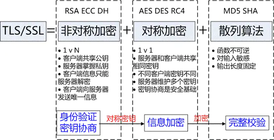
>
> #### （1）散列函数hash
>
> 常见的散列函数有MD5、SHA1、SHA256。该函数的特点是单向不可逆，`对输入数据非常敏感，输出的长度固定，任何数据的修改都会改变散列函数的结果`，可以用于`防止信息篡改`并验证`数据的完整性`。
>
> **特点：**在信息传输过程中，散列函数不能都实现信息防篡改，由于传输是明文传输，中间人可以修改信息后重新计算信息的摘要，所以需要对传输的信息和信息摘要进行加密。
>
> #### （2）对称加密
>
> 对称加密的方法是，双方使用同一个秘钥对数据进行加密和解密。但是对称加密的存在一个问题，就是如何保证秘钥传输的安全性，因为秘钥还是会通过网络传输的，一旦秘钥被其他人获取到，那么整个加密过程就毫无作用了。 这就要用到非对称加密的方法。
>
> 最流行的对称加密算法是 AES
>
> 常见的对称加密算法有AES-CBC、DES、3DES、AES-GCM等。相同的秘钥可以用于信息的加密和解密。掌握秘钥才能获取信息，防止信息窃听，其通讯方式是一对一。
>
> **特点：**对称加密的优势就是信息传输使用一对一，需要共享相同的密码，密码的安全是保证信息安全的基础，服务器和N个客户端通信，需要维持N个密码记录且不能修改密码。
>
> #### （3）非对称加密
>
> * 非对称加密的方法是，我们拥有两个秘钥，一个是公钥，一个是私钥。公钥是公开的，私钥是保密的。
>
> * 用公钥加密的数据，只有对应的私钥才能解密。
> * 我们可以将公钥公布出去，任何想和我们通信的客户， 都可以使用我们提供的公钥对数据进行加密，这样我们就可以使用私钥进行解密，这样就能保证数据的安全了。
> * 但是非对称加密有一个缺点就是加密的过程很慢，因此如果每次通信都使用非对称加密的方式的话，反而会造成等待时间过长的问题。
> * 最流行的非对称加密算法是 RSA 加密算法，广泛用于密钥交换和数字签名验证。但现在正逐步迁移至更安全高效的 Diffie-Hellman （缩写为 D-H）算法。
> * 非对称加密用于传输对称加密密钥。
>
> 常见的非对称加密算法有RSA、ECC、DH等。秘钥成对出现，一般称为公钥（公开）和私钥（保密）。公钥加密的信息只有私钥可以解开，私钥加密的信息只能公钥解开，因此掌握公钥的不同客户端之间不能相互解密信息，只能和服务器进行加密通信，服务器可以实现一对多的的通信，客户端也可以用来验证掌握私钥的服务器的身份。
>
> **特点：**非对称加密的特点就是信息一对多，服务器只需要维持一个私钥就可以和多个客户端进行通信，但服务器发出的信息能够被所有的客户端解密，且该算法的计算复杂，加密的速度慢。
>
> 综合上述算法特点，`TLS/SSL的工作方式`就是客户端使用非对称加密与服务器进行通信，实现身份的验证并协商对称加密使用的秘钥。对称加密算法采用协商秘钥对信息以及信息摘要进行加密通信，不同节点之间采用的对称秘钥不同，从而保证信息只能通信双方获取。这样就解决了两个方法各自存在的问题。

### HTTPS四次握手

> 参考链接：[链接1](https://www.cxybb.com/article/u013568373/96742394) [链接2](https://github.com/pro648/tips/blob/master/sources/%E4%B8%89%E6%AC%A1%E6%8F%A1%E6%89%8B%E3%80%81%E4%B8%83%E6%AC%A1%E6%8F%A1%E6%89%8B%E3%80%81%E5%9B%9B%E6%AC%A1%E6%8C%A5%E6%89%8B.md)

> 1. 首先由客户端向服务器端发送  客户端支持的`协议版本`、`加密算法`、`压缩方法`和 `随机数 R1`。
> 2. 服务器端收到后，确认使用的`加密通信协议版本`、`加密算法`。发送给客户端自己的`数字证书`、`加密算法`和`随机数 R2`。
> 3. 客户端收到后，首先`检查`数字证书是否有效，如果有效，则再生成一个`随机数 R3`。此时浏览器根据3个随机数，通过加密算法生成会话秘钥（这个秘钥就是接下来双方进行**对称加密解密**使用的密钥）。客户端根据服务端公钥加密随机数R3，发送给服务端
> 4. 服务端用私钥获取客户端发送的R3，根据加密算法使用R1，R2，R3生成会话密钥
>
> ==由于计算机的随机数是伪随机数，因此TLS协议不信任主机能产生完全随机的随机数，因此为了防止R3被猜出来，使用三个随机数来达到真随机的效果==
>
> 至此，整个握手阶段全部结束。接下来，客户端与服务器进入加密通信，就完全是使用普通的 HTTP 协议，只不过用 “会话密钥” 加密内容。（**非对称加密解密将不再使用，接下来完全由对称加密接手了，因为密钥已经安全的传送给了通信的双方**）

### **HTTPS**是如何保证安全的？ 

> 先理解两个概念：
>
> - 对称加密：`即通信的双⽅都使⽤同⼀个秘钥进⾏加解密`，对称加密虽然很简单性能也好，但是⽆法解决⾸次把秘钥发给对⽅的问题，很容易被⿊客拦截秘钥。 
> - ⾮对称加密： 
>
> 1. `私钥 + 公钥= 密钥对 `
>
> 2. `⽤公钥加密的数据,只有对应的私钥才能解 `
>
> 3. 因为通信双⽅的⼿⾥都有⼀套⾃⼰的密钥对,通信之前双⽅会先把⾃⼰的公钥都先发给对⽅ 
>
> 4. 然后对⽅再拿着这个公钥来加密数据响应给对⽅,等到到了对⽅那⾥,对⽅再⽤⾃⼰的私钥进⾏解密 
>
> ⾮对称加密虽然安全性更⾼，但是带来的问题就是速度很慢，影响性能。 
>
> **解决⽅案：** 
>
> 结合两种加密⽅式，将`对称加密的密钥`使⽤`⾮对称加密的公钥`进⾏加密，然后发送出去，接收⽅使⽤私钥进⾏解密得到`对称加密的密钥`，然后双⽅可以使⽤对称加密来进⾏沟通。 
>
> 此时⼜带来⼀个问题，中间⼈问题： 
>
> 如果此时在客户端和服务器之间存在⼀个中间⼈,这个中间⼈只需要把原本双⽅通信互发的公钥,换成⾃⼰的公钥,这样中间⼈就可以轻松解密通信双⽅所发送的所有数据。 
>
> 所以这个时候需要⼀个安全的第三⽅颁发证书（CA），证明身份的身份，防⽌被中间⼈攻击。 证书中包括：签发者、证书⽤途、使⽤者公钥、使⽤者私钥、使⽤者的HASH算法、证书到期时间等。
>
> 但是问题来了，如果中间⼈篡改了证书，那么身份证明是不是就⽆效了？这个证明就⽩买了，这个时候需要⼀个新的技术，数字签名。 
>
> 数字签名就是⽤CA⾃带的HASH算法对证书的内容进⾏HASH得到⼀个摘要，再⽤CA的私钥加密，最终组成数字签名。当别⼈把他的证书发过来的时候,我再⽤同样的Hash算法,再次⽣成消息摘要，然后⽤CA的公钥对数字签名解密,得到CA创建的消息摘要,两者⼀⽐,就知道中间有没有被⼈篡改了。这个时候就能最⼤程度保证通信的安全了。 

## HTTP状态码

> 状态码的类别：
>
> | **类别** | **原因**                        | **描述**                   |
> | -------- | ------------------------------- | -------------------------- |
> | 1xx      | Informational(信息性状态码)     | 接受的请求正在处理         |
> | 2xx      | S·uccess(成功状态码)            | 请求正常处理完毕           |
> | 3xx      | Redirection(重定向状态码)       | 需要进行附加操作一完成请求 |
> | 4xx      | Client Error (客户端错误状态码) | 服务器`无法处理请求`       |
> | 5xx      | Server Error(服务器错误状态码)  | 服务器`处理请求出错`       |
>
> ### 总结
>
> **（1）2XX 成功**
>
> - 200 OK，表示从客户端发来的请求在服务器端被正确处理
> - 204 No content，表示请求成功，但响应报文不含实体的主体部分（没有返回内容）
> - 205 Reset Content，表示请求成功，但响应报文不含实体的主体部分，但是与 204 响应不同在于`要求请求方重置内容`
> - 206 Partial Content，进行范围请求（1.1协议的部分请求）
>
> **（2）3XX 重定向**
>
> - 301 moved permanently，永久性重定向，表示资源已被分配了新的 URL
>
> - 302 found，临时性重定向，表示资源临时被分配了新的 URL
>
> - 307 temporary redirect，临时重定向，和302含义类似，但是期望客户端`保持请求方法不变`向新的地址发出请求
>
> - 303 see other，表示资源存在着另一个 URL，应使用 `GET` 方法获取资源
>
> - `304` not modified，表示`服务器允许访问资源`，但发生请求未满足条件的情况，返回时，不包含任何响应的主体部分
>
>   > 状态码304并不是一种错误，而是告诉客户端有缓存，直接使用缓存中的数据。返回页面的只有头部信息，是没有内容部分的，这样在一定程度上提高了网页的性能。
>
> ps：在http1.1版本的时候为了细化302状态码⼜出来了两个303和307
>
> **（3）4XX 客户端错误**
>
> - 400 bad request，请求报文存在`语法错误`
> - 401 unauthorized，表示发送的请求`需要有通过 HTTP 认证的认证信息`
> - 403 forbidden，表示对请求资源的访问`被服务器拒绝`
> - 404 not found，表示在服务器上`没有找到请求的资源`
>
> **（4）5XX 服务器错误**
>
> - 500 internal sever error，表示服务器端在`执行请求时发生了错误`
> - `501` Not Implemented，表示服务器`不支持当前请求所需要的某个功能`
> - 503 service unavailable，表明服务器暂时处于`超负载或正在停机维护`，无法处理请求
>
> 
>
> ### 1. 2XX (Success 成功状态码)
>
> 状态码2XX表示请求被正常处理了。
>
> #### （1）200 OK
>
> 200 OK表示客户端发来的请求被服务器端正常处理了。
>
> #### （2）204 No Content
>
> 该状态码表示客户端发送的请求已经在服务器端正常处理了，但是没有返回的内容，响应报文中不包含实体的主体部分。一般在只需要从客户端往服务器端发送信息，而服务器端不需要往客户端发送内容时使用。
>
> #### （3）206 Partial Content
>
> 该状态码表示客户端进行了范围请求，而服务器端执行了这部分的 GET 请求。响应报文中包含由 Content-Range 指定范围的实体内容。
>
> ### 2. 3XX (Redirection 重定向状态码)
>
> 3XX 响应结果表明浏览器需要执行某些特殊的处理以正确处理请求。
>
> #### （1）301 Moved Permanently
>
> **永久重定向。**
>
> 该状态码表示请求的资源已经被分配了新的 URI，以后应使用资源指定的 URI。新的 URI 会在 HTTP 响应头中的 Location 首部字段指定。若用户已经把原来的URI保存为书签，此时会按照 Location 中新的URI重新保存该书签。同时，搜索引擎在抓取新内容的同时也将旧的网址替换为重定向之后的网址。
>
> 
>
> **使用场景：**
>
> - 当我们想换个域名，旧的域名不再使用时，用户访问旧域名时用301就重定向到新的域名。其实也是告诉搜索引擎收录的域名需要对新的域名进行收录。
> - 在搜索引擎的搜索结果中出现了不带www的域名，而带www的域名却没有收录，这个时候可以用301重定向来告诉搜索引擎我们目标的域名是哪一个。
>
> #### （2）302 Found
>
> **临时重定向。**
>
> 该状态码表示请求的资源被分配到了新的 URI，希望用户（本次）能使用新的 URI 访问资源。和 301 Moved Permanently 状态码相似，但是 302 代表的资源不是被永久重定向，只是临时性质的。也就是说已移动的资源对应的 URI 将来还有可能发生改变。若用户把 URI 保存成书签，但不会像 301 状态码出现时那样去更新书签，而是仍旧保留返回 302 状态码的页面对应的 URI。同时，搜索引擎会抓取新的内容而保留旧的网址。因为服务器返回302代码，搜索引擎认为新的网址只是暂时的。
>
> 
>
> **使用场景：**
>
> - 当我们在做活动时，登录到首页自动重定向，进入活动页面。
> - 未登陆的用户访问用户中心重定向到登录页面。
> - 访问404页面重新定向到首页。
>
> #### （3）303 See Other
>
> 该状态码表示由于请求对应的资源存在着另一个 URI，应使用 GET 方法定向获取请求的资源。
>
> 303 状态码和 302 Found 状态码有着相似的功能，但是 303 状态码明确表示客户端应当采用 GET 方法获取资源。
>
> 
>
> 303 状态码通常作为 PUT 或 POST 操作的返回结果，它表示重定向链接指向的不是新上传的资源，而是另外一个页面，比如消息确认页面或上传进度页面。而请求重定向页面的方法要总是使用 GET。
>
> 
>
> 注意：
>
> - 当 301、302、303 响应状态码返回时，几乎所有的浏览器都会把 POST 改成GET，并删除请求报文内的主体，之后请求会再次自动发送。
> - 301、302 标准是禁止将 POST 方法变成 GET方法的，但实际大家都会这么做。
>
> #### （4）304 Not Modified
>
> **浏览器缓存相关。**
>
> 该状态码表示客户端发送附带条件的请求时，服务器端允许请求访问资源，但未满足条件的情况。304 状态码返回时，不包含任何响应的主体部分。304 虽然被划分在 3XX 类别中，但是和重定向没有关系。
>
> 
>
> 带条件的请求（Http 条件请求）：使用 Get方法 请求，请求报文中包含（`if-match`、`if-none-match`、`if-modified-since`、`if-unmodified-since`、`if-range`）中任意首部。
>
> 
>
> 状态码304并不是一种错误，而是告诉客户端有缓存，直接使用缓存中的数据。返回页面的只有头部信息，是没有内容部分的，这样在一定程度上提高了网页的性能。
>
> #### （5）307 Temporary Redirect
>
> **307表示临时重定向。**该状态码与 302 Found 有着相同含义，尽管 302 标准禁止 POST 变成 GET，但是实际使用时还是这样做了。
>
> 
>
> 307 会遵守浏览器标准，**不会从 POST 变成 GET**。但是对于处理请求的行为时，不同浏览器还是会出现不同的情况。规范要求浏览器继续向 Location 的地址 POST 内容。规范要求浏览器继续向 Location 的地址 POST 内容。
>
> ### 3. 4XX (Client Error 客户端错误状态码)
>
> 4XX 的响应结果表明客户端是发生错误的原因所在。
>
> #### （1）400 Bad Request
>
> 该状态码表示请求报文中存在语法错误。当错误发生时，需修改请求的内容后再次发送请求。另外，浏览器会像 200 OK 一样对待该状态码。
>
> #### （2）401 Unauthorized
>
> 该状态码表示发送的请求需要有通过 HTTP 认证(BASIC 认证、DIGEST 认证)的认证信息。若之前已进行过一次请求，则表示用户认证失败
>
> 
>
> 返回含有 401 的响应必须包含一个适用于被请求资源的 WWW-Authenticate 首部用以质询(challenge)用户信息。当浏览器初次接收到 401 响应，会弹出认证用的对话窗口。
>
> 
>
> 以下情况会出现401：
>
> - 401.1 - 登录失败。
> - 401.2 - 服务器配置导致登录失败。
> - 401.3 - 由于 ACL 对资源的限制而未获得授权。
> - 401.4 - 筛选器授权失败。
> - 401.5 - ISAPI/CGI 应用程序授权失败。
> - 401.7 - 访问被 Web 服务器上的 URL 授权策略拒绝。这个错误代码为 IIS 6.0 所专用。
>
> #### （3）403 Forbidden
>
> 该状态码表明请求资源的访问被服务器拒绝了，服务器端没有必要给出详细理由，但是可以在响应报文实体的主体中进行说明。进入该状态后，不能再继续进行验证。该访问是永久禁止的，并且与应用逻辑密切相关。
>
> 
>
> IIS 定义了许多不同的 403 错误，它们指明更为具体的错误原因：
>
> - 403.1 - 执行访问被禁止。
> - 403.2 - 读访问被禁止。
> - 403.3 - 写访问被禁止。
> - 403.4 - 要求 SSL。
> - 403.5 - 要求 SSL 128。
> - 403.6 - IP 地址被拒绝。
> - 403.7 - 要求客户端证书。
> - 403.8 - 站点访问被拒绝。
> - 403.9 - 用户数过多。
> - 403.10 - 配置无效。
> - 403.11 - 密码更改。
> - 403.12 - 拒绝访问映射表。
> - 403.13 - 客户端证书被吊销。
> - 403.14 - 拒绝目录列表。
> - 403.15 - 超出客户端访问许可。
> - 403.16 - 客户端证书不受信任或无效。
> - 403.17 - 客户端证书已过期或尚未生效
> - 403.18 - 在当前的应用程序池中不能执行所请求的 URL。这个错误代码为 IIS 6.0 所专用。
> - 403.19 - 不能为这个应用程序池中的客户端执行 CGI。这个错误代码为 IIS 6.0 所专用。
> - 403.20 - Passport 登录失败。这个错误代码为 IIS 6.0 所专用。
>
> #### （4）404 Not Found
>
> 该状态码表明服务器上无法找到请求的资源。除此之外，也可以在服务器端拒绝请求且不想说明理由时使用。
>
> 以下情况会出现404：
>
> - 404.0 -（无） – 没有找到文件或目录。
> - 404.1 - 无法在所请求的端口上访问 Web 站点。
> - 404.2 - Web 服务扩展锁定策略阻止本请求。
> - 404.3 - MIME 映射策略阻止本请求。
>
> #### （5）405 Method Not Allowed
>
> 该状态码表示客户端请求的方法虽然能被服务器识别，但是服务器禁止使用该方法。GET 和 HEAD 方法，服务器应该总是允许客户端进行访问。客户端可以通过 OPTIONS 方法（预检）来查看服务器允许的访问方法, 如下
>
> ```javascript
> Access-Control-Allow-Methods: GET,HEAD,PUT,PATCH,POST,DELETE
> ```
>
> ### 4. 5XX (Server Error 服务器错误状态码)
>
> 5XX 的响应结果表明服务器本身发生错误.
>
> #### （1）500 Internal Server Error
>
> 该状态码表明服务器端在执行请求时发生了错误。也有可能是 Web 应用存在的 bug 或某些临时的故障。
>
> #### （2）502 Bad Gateway
>
> 该状态码表明扮演网关或代理角色的服务器，从上游服务器中接收到的响应是无效的。注意，502 错误通常不是客户端能够修复的，而是需要由途经的 Web 服务器或者代理服务器对其进行修复。以下情况会出现502：
>
> - 502.1 - CGI （通用网关接口）应用程序超时。
> - 502.2 - CGI （通用网关接口）应用程序出错。
>
> #### （3）503 Service Unavailable
>
> 该状态码表明服务器暂时处于超负载或正在进行停机维护，现在无法处理请求。如果事先得知解除以上状况需要的时间，最好写入 RetryAfter 首部字段再返回给客户端。
>
> 
>
> **使用场景：**
>
> - 服务器停机维护时，主动用503响应请求；
> - nginx 设置限速，超过限速，会返回503。
>
> #### （4）504 Gateway Timeout
>
> 该状态码表示网关或者代理的服务器无法在规定的时间内获得想要的响应。他是HTTP 1.1中新加入的。
>
> 
>
> 使用场景：代码执行时间超时，或者发生了死循环。
>
> ### 5. 
>
> ### 6. 同样是重定向，**307**，**303**，**302**的区别？ 
>
> 302是http1.0的协议状态码，在http1.1版本的时候为了细化302状态码⼜出来了两个303和307。 303明确表示客户端应当采⽤get⽅法获取资源，他会把POST请求变为GET请求进⾏重定向。 307会遵照浏览器标准，不会从post变为get。

## DNS协议介绍

### DNS 协议是什么

> **概念**： DNS 是域名系统 (Domain Name System) 的缩写，提供的是一种主机名到 IP 地址的转换服务，就是我们常说的域名系统。能够使人更方便的访问互联网，而不用去记住能够被机器直接读取的IP数串。
>
> > 它是一个由分层的 DNS 服务器组成的分布式数据库，是定义了`主机如何查询这个分布式数据库的方式的应用层协议`。
>
> **作用**： 将域名解析为IP地址，客户端向DNS服务器（DNS服务器有自己的IP地址）发送域名查询请求，DNS服务器告知客户机Web服务器的 IP 地址。	 	

### DNS完整的查询过程

> DNS服务器解析域名的过程：
>
> - 首先会在**浏览器的缓存**中查找对应的IP地址，如果查找到直接返回，若找不到继续下一步
> - 将请求发送给**本地DNS服务器**，在本地域名服务器缓存中查询，如果查找到，就直接将查找结果返回，若找不到继续下一步
> - 本地DNS服务器向**根域名服务器**发送请求，根域名服务器会返回一个所查询域的顶级域名服务器地址
> - 本地DNS服务器向**顶级域名服务器**发送请求，接受请求的服务器查询自己的缓存，如果有记录，就返回查询结果，如果没有就返回相关的下一级的权威域名服务器的地址
> - 本地DNS服务器向**权威域名服务器**发送请求，域名服务器返回对应的结果
> - 本地DNS服务器将返回结果`保存在缓存`中，便于下次使用
> - 本地DNS服务器将返回结果`返回给浏览器`
>
> > 用户（浏览器）向本地 DNS 服务器发起请求属于递归请求，本地 DNS 服务器向各级域名服务器发起请求属于迭代请求。
>
> 比如要查询 [www.baidu.com](http://www.baidu.com/) 的 IP 地址。
>
> 1. 首先会在浏览器的缓存中查找是否有该域名的缓存，如果有，直接返回结果，如果不存在就将请求发送到本地的 DNS 服务器中；
> 2. 本地DNS服务器会判断是否存在该域名的缓存，如果不存在，则`向根域名服务器发送一个请求`，根域名服务器返回负责` .com 的顶级`域名服务器的 IP 地址的列表。
> 3. 然后本地 DNS 服务器再向其中一个负责 .com 的`顶级域名服务器`发送一个请求，负责 .com 的顶级域名服务器返回负责 .baidu 的`权威`域名服务器的 IP 地址列表。
> 4. 然后本地 DNS 服务器再向其中一个`权威域名服务器`发送一个请求，最后权威域名服务器返回一个对应的主机名的 IP 地址列表。

## 网络模型

### OSI七层模型

> `ISO`为了更好的使网络应用更为普及，推出了`OSI`参考模型。
>
> 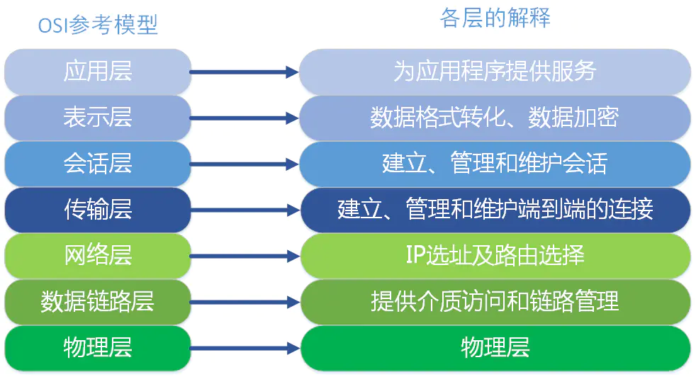
>
> #### （1）应用层 为计算机用户提供`应用接口` `HTTP`，`HTTPS`，`FTP`
>
> `OSI`参考模型中最靠近用户的一层，是为计算机用户提供`应用接口`，也为用户直接提供各种`网络服务`。我们常见应用层的网络服务协议有：`HTTP`，`HTTPS`，`FTP`，`POP3`、`SMTP`等。
>
> - 在客户端与服务器中经常会有数据的请求，这个时候就是会用到`http(hyper text transfer protocol)(超文本传输协议)`或者`https`.在后端设计数据接口时，我们常常使用到这个协议。
> - `FTP`是文件传输协议，在开发过程中，个人并没有涉及到，但是我想，在一些资源网站，比如`百度网盘``迅雷`应该是基于此协议的。
> - `SMTP`是`simple mail transfer protocol（简单邮件传输协议）`。在一个项目中，在用户邮箱验证码登录的功能时，使用到了这个协议。
>
> #### （2）表示层 应用层数据的编码和转换功能
>
> 表示层提供各种用于应用层数据的编码和转换功能,确保一个系统的应用层发送的数据能被另一个系统的应用层识别。如果必要，该层可提供一种标准表示形式，用于将计算机内部的多种数据格式转换成通信中采用的标准表示形式。数据压缩和加密也是表示层可提供的转换功能之一。
>
> 
>
> 在项目开发中，为了方便数据传输，可以使用`base64`对数据进行编解码。如果按功能来划分，`base64`应该是工作在表示层。
>
> #### （3）会话层 建立、管理和终止表示层实体之间的通信会话
>
> 会话层就是负责建立、管理和终止表示层实体之间的通信会话。该层的通信由不同设备中的应用程序之间的服务请求和响应组成。
>
> #### （4）传输层 `TCP` `UDP ` 为上层协议提供端到端的可靠和透明的数据传输服务
>
> 传输层建立了主机端到端的链接，传输层的作用是为上层协议提供端到端的可靠和透明的数据传输服务，包括处理差错控制和流量控制等问题。该层向高层屏蔽了下层数据通信的细节，使高层用户看到的只是在两个传输实体间的一条主机到主机的、可由用户控制和设定的、可靠的数据通路。我们通常说的，`TCP` `UDP`就是在这一层。端口号既是这里的“端”。
>
> #### （5）网络层 `IP`寻址来建立两个节点之间的连接
>
> 本层通过`IP`寻址来建立两个节点之间的连接，为源端的运输层送来的分组，选择合适的路由和交换节点，正确无误地按照地址传送给目的端的运输层。就是通常说的`IP`层。这一层就是我们经常说的`IP`协议层。`IP`协议是`Internet`的基础。我们可以这样理解，网络层规定了数据包的传输路线，而传输层则规定了数据包的传输方式。
>
> #### （6）数据链路层 使用MAC地址  传输路线
>
> 将比特组合成字节,再将字节组合成帧,使用链路层地址 (以太网使用MAC地址)来访问介质,并进行差错检测。
>
> 网络层与数据链路层的对比，通过上面的描述，我们或许可以这样理解，网络层是规划了数据包的传输路线，而数据链路层就是传输路线。不过，在数据链路层上还增加了差错控制的功能。
>
> #### （7）物理层 过物理介质 中继器、调制解调器、网线
>
> 实际最终信号的传输是通过物理层实现的。通过物理介质传输比特流。规定了电平、速度和电缆针脚。常用设备有（各种物理设备）集线器、中继器、调制解调器、网线、双绞线、同轴电缆。这些都是物理层的传输介质。
>
> 
>
> **OSI七层模型通信特点：对等通信**
>
> 对等通信，为了使数据分组从源传送到目的地，源端OSI模型的每一层都必须与目的端的对等层进行通信，这种通信方式称为对等层通信。在每一层通信过程中，使用本层自己协议进行通信。

### TCP/IP五层协议

> `TCP/IP`五层协议和`OSI`的七层协议对应关系如下：
>
> 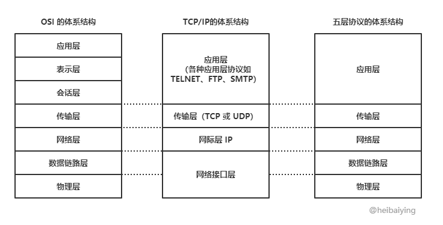
>
> - **应用层 (application layer)**：`直接为应用进程提供服务`。应用层协议定义的是`应用进程间通讯和交互的规则`，不同的应用有着不同的应用层协议，如 HTTP协议（万维网服务）、FTP协议（文件传输）、SMTP协议（电子邮件）、DNS（域名查询）。
> - **传输层 (transport layer)**：有时也译为运输层，此层确定源端，目的端端口号，它负责`为两台主机`中的`进程`提供通信服务。该层主要有以下两种协议：
>
> - - 传输控制协议 (Transmission Control Protocol，TCP)：提供面向连接的、可靠的数据传输服务，数据传输的基本单位是`报文段`（segment）；
>   - 用户数据报协议 (User Datagram Protocol，UDP)：提供无连接的、尽最大努力的数据传输服务，但不保证数据传输的可靠性，数据传输的基本单位是`用户数据报`。
>
> - **网络层 (internet layer)**：有时也译为网际层，它负责`为两台主机提供通信服务`，确定源端，目的端IP地址，并通过选择合适的`路由`将数据传递到`目标主机`。ICMP协议
> - **数据链路层 (data link layer)**：负责确定源端，目的端Mac地址，将网络层交下来的 `IP 数据报封装成帧`，并在链路的`两个相邻节点间传送帧`，每一帧都包含数据和必要的控制信息（如同步信息、地址信息、差错控制等）。CSMA/CA协议
> - **物理层 (physical Layer)**：确保数据可以在各种物理媒介上进行传输，为数据的传输提供可靠的环境。
>
> > ps:ARP协议在TCP/IP模型中属于IP层（网络层），在OSI模型中属于链路层。
>
> 从上图中可以看出，`TCP/IP`模型比`OSI`模型更加简洁，它把`应用层/表示层/会话层`全部整合为了`应用层`。
>
> 
>
> 在每一层都工作着不同的设备，比如我们常用的交换机就工作在数据链路层的，一般的路由器是工作在网络层的。
>
> 
>
> 在每一层实现的协议也各不同，即每一层的服务也不同，下图列出了每层主要的传输协议：
>
> 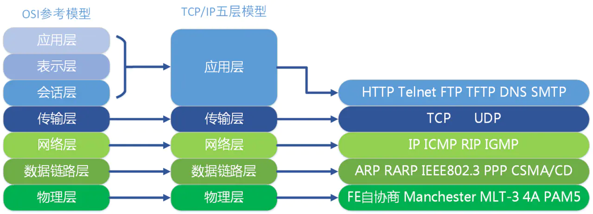
>
> 
>
> 同样，`TCP/IP`五层协议的通信方式也是对等通信：
>
> 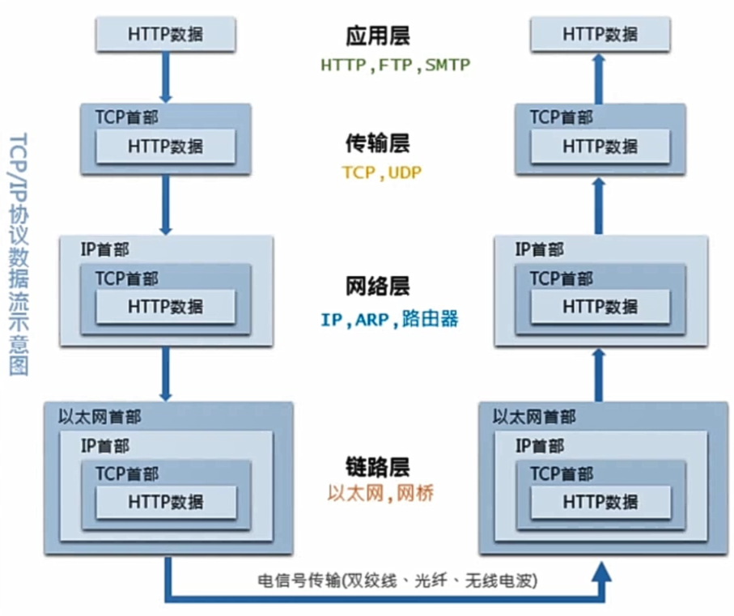

## TCP与UDP

### TCP 和 UDP的概念及特点

> TCP 和 UDP 都是传输层协议，他们都属于TCP/IP协议族：
>
> **（1）UDP**
>
> UDP的全称是**用户数据报协议**，在网络中它与TCP协议一样用于处理数据包，是一种无连接的协议。在OSI模型中，在传输层，处于IP协议的上一层。UDP有`不提供数据包分组`、`组装`和`不能对数据包进行排序`的缺点，也就是说，当报文发送之后，是无法得知其是否安全完整到达的。基本单位是数据包。
>
> 它的特点如下：
>
> **1）面向无连接**
>
> 首先 UDP 是不需要和 TCP一样在发送数据前进行三次握手建立连接的，想发数据就可以开始发送了。并且也只是数据报文的`搬运工`，`不会`对数据报文进行任何`拆分和拼接`操作。
>
> 具体来说就是：
>
> - 在发送端，应用层将数据传递给传输层的 UDP 协议，UDP 只会给数据增加一个 UDP 头，标识下是 UDP 协议，然后就传递给网络层了
>- 在接收端，网络层将数据传递给传输层，UDP 只去除 IP 报文头就传递给应用层，不会任何拼接操作
> 
> **2）有单播，多播，广播的功能**
>
> UDP 不止支持一对一的传输方式，同样支持一对多，多对多，多对一的方式，也就是说 UDP 提供了单播，多播，广播的功能。
>
> **3）面向报文**
>
> 发送方的UDP对应用程序交下来的报文，在添加首部后就向下交付IP层。UDP对应用层交下来的报文，既不合并，也不拆分，而是保留这些报文的边界。因此，应用程序必须选择合适大小的报文
>
> **4）不可靠性**
>
> 首先不可靠性体现在无连接上，通信都不需要建立连接，想发就发，这样的情况肯定不可靠。
>
> 并且收到什么数据就传递什么数据，并且也不会备份数据，发送数据也不会关心对方是否已经正确接收到数据了。
>
> 再者网络环境时好时坏，但是 UDP 因为没有拥塞控制，一直会以恒定的速度发送数据。即使网络条件不好，也不会对发送速率进行调整。这样实现的弊端就是在网络条件不好的情况下可能会导致丢包，但是优点也很明显，在某些实时性要求高的场景（比如电话会议）就需要使用 UDP 而不是 TCP。
>
> **5）头部开销小，传输数据报文时是很高效的。**
>
> 
>
> UDP 头部包含了以下几个数据：
>
> - 两个十六位的端口号，分别为源端口（可选字段）和目标端口
>- 整个数据报文的长度
> - 整个数据报文的检验和（IPv4 可选字段），该字段用于发现头部信息和数据中的错误
> 
> 
>
> 因此 UDP 的头部开销小，只有`8字节`，相比 `TCP` 的`至少20字节`要少得多，在传输数据报文时是很高效的。
>
> **（2）TCP**
>
> TCP的全称是传输控制协议，是一种面向连接的、可靠的、基于字节流的传输层通信协议。TCP 是面向连接的、可靠的流协议（流就是指不间断的数据结构）。基本单位是报文段。
>
> 
>
> 它有以下几个特点：
>
> **1）面向连接**
>
> 面向连接，是指发送数据之前必须在两端建立连接。建立连接的方法是“三次握手”，这样能建立可靠的连接。建立连接，是为数据的可靠传输打下了基础。
>
> **2）仅支持单播传输**
>
> 每条TCP传输连接只能有两个端点，只能进行点对点的数据传输，不支持多播和广播传输方式。
>
> **3）面向字节流**
>
> TCP不像UDP一样那样一个个报文独立地传输，而是在不保留报文边界的情况下以字节流方式进行传输。
>
> **4）可靠传输**
>
> 对于可靠传输，判断丢包、误码靠的是TCP的段编号以及确认号。TCP为了保证报文传输的可靠，就给每个包一个序号，同时序号也保证了传送到接收端实体的包的按序接收。然后接收端实体对已成功收到的字节发回一个相应的确认(ACK)；如果发送端实体在合理的往返时延(RTT)内未收到确认，那么对应的数据（假设丢失了）将会被重传。
>
> **5）提供拥塞控制**
>
> 当网络出现拥塞的时候，TCP能够减小向网络注入数据的速率和数量，缓解拥塞。
>
> **6）提供全双工通信**
>
> TCP允许通信双方的应用程序在任何时候都能发送数据，因为TCP连接的两端都设有缓存，用来临时存放双向通信的数据。当然，TCP可以立即发送一个数据段，也可以缓存一段时间以便一次发送更多的数据段（最大的数据段大小取决于MSS）

### TCP和UDP的区别

> |              | UDP                                        | TCP                                                  |
> | ------------ | ------------------------------------------ | ---------------------------------------------------- |
> | 是否连接     | 无连接                                     | 面向连接                                             |
> | 是否可靠     | 不可靠传输，不使用流量控制和拥塞控制       | 可靠传输（数据顺序和正确性），使用流量控制和拥塞控制 |
> | 连接对象个数 | 支持一对一，一对多，多对一和多对多交互通信 | 只能是一对一通信                                     |
> | 传输方式     | 面向报文                                   | 面向字节流                                           |
> | 首部开销     | 首部开销小，仅8字节                        | 首部最小20字节，最大60字节                           |
> | 适用场景     | 适用于实时应用，例如视频会议、直播         | 适用于要求可靠传输的应用，例如文件传输               |

### TCP和UDP的使用场景

> - **TCP应用场景：** 效率要求相对低，但对准确性要求相对高的场景。因为传输中需要对数据确认、重发、排序等操作，相比之下效率没有UDP高。例如：文件传输（准确高要求高、但是速度可以相对慢）、接受邮件、远程登录。
> - **UDP应用场景：** 效率要求相对高，对准确性要求相对低的场景。例如：QQ聊天、在线视频、网络语音电话（即时通讯，速度要求高，但是出现偶尔断续不是太大问题，并且此处完全不可以使用重发机制）、广播通信（广播、多播）。