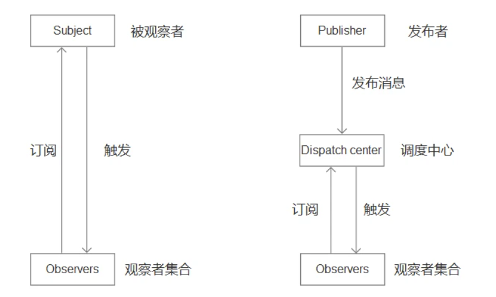

### 什么是设计模式

> **背景**：设计模式出现的背景，是软件设计的复杂度日益飙升。软件设计越来越复杂的“罪魁祸首”，就是变化。
>
> **设计模式**：在软件工程中，设计模式是对软件设计中普遍存在的各种问题所提出的解决方案。
>
> > 设计模式是一套被反复使用、多数人知晓、经过分类编目的、代码设计经验的总结。它是为了可重用代码，让代码更容易的被他人理解并保证代码的可靠性。
>
> **核心思想**：将变与不变分离，确保变化的部分灵活，不变的部分稳定

### 设计模式原则

> 设计原则是设计模式的指导理论，它可以帮助我们规避不良的软件设计。设计模式遵循SOLID原则，SOLID 指代的五个基本原则分别是:
>
> * **单一职责原则**(Single Responsibility Principle)。
>   * 应该有且仅有一个原因引起类的变更。这个原则很好理解，一个类代码量越多，功能就越复杂，维护成本也就越高。遵循单一职责原则可以有效地控制类的复杂度。
> * **开放封闭原则**(Opened Closed Principle)。
>   * 开放封闭原则指的就是对扩展开放、对修改关闭。编写代码的时候不可避免地会碰到修改的情况，而遵循开闭原则就意味着当代码需要修改时，可以通过编写新的代码来扩展已有的代码，而不是直接修改已有代码本身。
> * **里式替换原则**(Liskov Substitution Principle)
>   * 里氏替换原则是指在使用父类的地方可以用它的任意子类进行替换。里氏替换原则是对类的继承复用作出的要求，要求子类可以随时替换掉其父类，同时功能不被破坏，父类的方法仍然能被使用。
> * **接口隔离原则**(Interface Segregation Principle)
>   * 不应该依赖它不需要的接口，也就是说一个类对另一个类的依赖应该建立在最小的接口上。目的就是为了降低代码之间的耦合性，方便后续代码修改。
> * **依赖反转原则**(Dependency Inversion Principle)
>   * 准确说应该是避免依赖倒置，好的依赖关系应该是类依赖于抽象接口，不应依赖于具体实现。这样设计的好处就是当依赖发生变化时，只需要传入对应的具体实例即可。
> * **最少知识原则**(The Least Knowledge Principle)
>   * 一个类对于其他类知道得越少越好，就是说一个对象应当对其他对象尽可能少的了解。这一条原则要求任何一个对象或者方法只能调用该对象本身和内部创建的对象实例，如果要调用外部的对象，只能通过参数的形式传递进来。这一点和纯函数的思想相似。

### 设计模式分类

> 
>
> * 创建型
>   * 抽象工厂模式
>   * 构造器模式
>   * 工厂模式
>   * 原型模式
>   * 单例模式
> * 结构型
>   * 适配器模式
>   * 桥接模式
>   * 组合模式
>   * 装饰器模式
>   * 外观模式
>   * 享元模式
>   * 代理模式
> * 行为型
>   * 责任链模式
>   * 命令模式
>   * 策略模式
>   * 解释器模式
>   * 迭代器模式
>   * 中介者模式
>   * 备忘录模式
>   * 观察者模式
>   * 状态模式
>   * 访问者模式
>   * 模板方法模式

### 前端常用的模式

> * 单例模式
> * 工厂模式
> * 观察者 发布订阅模式
> * 策略模式
> * 代理模式
> * 装饰器模式
> * 原型模式
> * 状态模式
> * 适配器模式
> * 迭代器模式

### 单例模式

> #### 定义
>
> 单例模式(Singleton Pattern)，创建型模式，保证一个类只有**一个实例**，并提供一个访问它的**全局访问点**。也就是说，第二次使用同一个类创建新对象的时候，应该得到与第一次创建的对象完全相同的对象。
>
> > 举一个例子，我们在玩单机游戏时，晚上关闭电脑。第二天再打开时，希望还能接着之前的游戏进度继续玩，这里就用到了存档，拿到存档就可以继续玩，这就是一个单例模式的实例。它符合单例的模式的特征:在第二次创建实例的时候与第一次创建完全相同的对象。
>
> #### 如何实现
>
> * 在`javascript`中，实现一个单例模式可以用一个变量来标志当前的类已经创建过对象，如果下次获取当前类的实例时，直接返回之前创建的对象即可
> * 使用闭包也能够实现
>
> #### 优缺点
>
> **优点**
>
> * 节约开支，提高性能：单例模式在创建后在内存中只存在一个实例，节约了内存开支和实例化时的性能开支，特别是需要重复使用一个创建开销比较大的类时，比起实例不断地销毁和重新实例化，单例能节约更多资源，比如数据库连接;
> * 解决资源多重占用：单例模式可以解决对资源的多重占用，比如写文件操作时，因为只有一个实例，可以避免对一个文件进行同时操作;
> * 提高系统流畅度：只使用一个实例，也可以减小垃圾回收机制GC (Garbage Collecation)的压力，表现在浏览器中就是系统卡顿减少，操作更流畅，CPU资源占用更少;
>
> **缺点**
>
> * 对扩展不友好：一般不容易扩展，因为单例模式一般自行实例化，没有接口;
> * 与单一职责原则冲突：一个类应该只关心内部逻辑，而不关心外面怎么样来实例化;
>
> #### 应用场景
>
> * 当一个类的实例化过程消耗的资源过多，可以使用单例模式来避免性能浪费;
> * 当项目中需要一个公共的状态，那么需要使用单例模式来保证访问一致性;
>
> * 例如页面存在一个模态框的时候，只有用户点击的时候才会创建，而不是加载完成之后再创建弹窗和隐藏，并且保证弹窗全局只有一个
> * `Vuex`、`redux`全局态管理库也应用单例模式的思想
> * 很多第三方库都是单例模式，多次引用只会使用同一个对象，如`jquery`、`lodash`、`moment`
>
> ps:
>
> `moment`是一个JavaScript 日期处理类库，用于解析、检验、操作、以及显示日期.
>
> `jquery`是一个简化JS的开发或者DOM操作的函数式库
>
> `Lodash` 是一个一致性、模块化、高性能的JavaScript 实用工具库。 

### 工厂模式

> #### 概念
>
> 创建型模式，工厂模式是用来创建对象的一种最常用的设计模式，不暴露创建对象的具体逻辑，而是将逻辑封装在一个函数中，那么这个函数就可以被视为一个工厂
>
> #### 分类
>
> 工厂模式根据抽象程度的不同可以分为：
>
> - 简单工厂模式（Simple Factory）：用来创建某一种产品对象的实例，用来创建单一对象
> - 工厂方法模式（Factory Method）：将创建实例推迟到子类中进行
> - 抽象工厂模式（Abstract Factory）：对类的工厂抽象用来创建产品类簇，不负责创建某一类产品的实例
>
> ##### 1 简单工厂模式
>
> **理解**：简单工厂模式也叫静态工厂模式，用一个工厂对象创建 同一种 对象类的实例
>
> **优点**：只需要一个参数，就可以获得所需的对象，无需知道对象创建的具体细节。
>
> **缺点**：容易造成代码庞大，难以维护，因为在函数内部包含了对象所有的创建逻辑，和判断逻辑的代码，如果判断逻辑很多，或者代码逻辑很复杂。
>
> **适合场景**：创建的对象数量较小，逻辑不是很复杂
>
> 例子：假设我们要开发一个公司岗位及其工作内容的录入信息，不同岗位的工作内容不一致。`Factory`就是一个简单工厂。当我们调用工厂函数时，只需要传递name、age、career就可以获取到包含用户工作内容的实例对象
>
> ##### 2 工厂方法模式
>
> **理解**：工厂方法模式本意是将实际创建对象的工作放在子类中，这样核心类就变成了抽象类。换句话说，可以把具体的产品放到了工厂函数的`prototype`中
>
> 工厂方法可以看做是一个实例化对象的工厂，它需要做的就是实例化对象。
>
> ##### 3 抽象工厂模式
>
> **理解**：上述两种都是直接生成实例，但是抽象工厂模式不同，抽象工厂模式并不直接生成实例，而是用于对产品类簇的创建
>
> 通俗点来讲就是：简单工厂和工厂方法模式的工作是生产产品，那么抽象工厂模式的工作就是生产工厂的
>
> #### 优缺点
>
> **优点**
>
> * 良好的封装，代码结构清晰，访问者无需知道对象的创建流程，特别是创建比较复杂的情况下;
> * 扩展性优良，通过工厂方法隔离了用户和创建流程隔离，符合开放封闭原则;
> * 解耦了高层逻辑和底层产品类，符合最少知识原则，不需要的就不要去交流;
>
> **缺点**
>
> * 带来了额外的系统复杂度，增加了抽象性;
>
> #### 场景应用
>
> * 对象的创建比较复杂，而访问者无需知道创建的具体流程;
> * 处理大量具有相同属性的小对象;
>
> * vue中的vNode
> * vue中的vue-router

### 观察者模式

> **行为型模式**
>
> > **观察者模式**定义了一种一对多的依赖关系，让多个**观察者**对象同时监听某一个目标对象，当这个目标对象的状态发生变化时，会通知所有**观察者**对象，使它们能够自动更新。
>
> 观察者模式有完成整个流程需要两个角色：
>
> - 目标
> - 观察者
>
> > 例子：一个班里的学生们都在听老师讲课，当老师布置任务时，会通知学生们都去执行。
>
> #### 优点
>
> * **响应式**。目标变化就会通知观察者，这是观察者最大的优点，也是因为这个优点，观察者模式在前端才会这么出名。
>
> #### 缺点
>
> * 不灵活。相比订阅发布模式，由于目标和观察者是耦合在一起的，所以观察者模式需要同时引入目标和观察者才能达到响应式的效果。而订阅发布模式只需要引入事件中心，订阅者和发布者可以不再一处。

### 发布-订阅者模式

https://segmentfault.com/a/1190000020169229

https://www.cnblogs.com/onepixel/p/10806891.html

> #### 1.定义
>
> 行为型
>
> > **发布-订阅**是一种[消息](https://link.segmentfault.com/?enc=u60NW6C6vDxMYdkX7SrylA%3D%3D.2pqFXM8HFWCq%2BY7VcimcQNWO5yA0vHztw3AoCZ%2BXZcuFwCWKlxdMQfGQ4%2BqK6fcdN0G8uISUxiJzEr4b%2F5Z8TA%3D%3D)[范式](https://link.segmentfault.com/?enc=Hwsc%2FCdqQwhLlWTu9bws2A%3D%3D.L5p7NpHntfj34S3O2FkIB1sFyAH4SCzoFrr41Yqd8lR0SJpwEzn3NR0aeKhG8jcucouGrrqhE5r2FENJQPU1AA%3D%3D)，消息的发送者（称为发布者）不会将消息直接发送给特定的接收者（称为订阅者）。而是将发布的消息分为不同的类别，无需了解哪些订阅者（如果有的话）可能存在。同样的，订阅者可以表达对一个或多个类别的兴趣，只接收感兴趣的消息，无需了解哪些发布者（如果有的话）存在。
>
> 完成订阅发布整个流程需要三个角色：
>
> - **发布者**
> - **事件中心**
> - **订阅者**
>
> **订阅者在订阅事件的时候，只关注事件本身，而不关心谁会发布这个事件；发布者在发布事件的时候，只关注事件本身，而不关心谁订阅了这个事件。**
>
> > 通俗来讲，**`订阅者`**（Subscriber）把自己想订阅的事件**注册**（Subscribe）到**`调度中心`**（Event Channel），当**`发布者`**（Publisher）发布该**事件**（Publish Event）到调度中心，也就是该事件触发时，由调度中心统一调度（Fire Event）订阅者注册到调度中心的处理代码。
> >
> > 例子：
> >
> > 比如我们很喜欢看某个公众号号的文章，但是我们不知道什么时候发布新文章，要不定时的去翻阅；这时候，我们可以关注该公众号，当有文章推送时，会有消息及时通知我们文章更新了。
> >
> > 上面一个看似简单的操作，其实是一个典型的发布订阅模式，公众号属于发布者，用户属于订阅者；用户将订阅公众号的事件注册到调度中心，公众号作为发布者，当有新文章发布时，公众号发布该事件到调度中心，调度中心会及时发消息告知用户。
>
> #### 优点
>
> - 对象之间解耦
> - 异步编程中，可以更松耦合的代码编写
>
> #### 缺点
>
> * 容易造成代码不好维护，在使用不当的情况下，容易造成数据流混乱，(所以才有了 React 提出的单项数据流思想，就是为了解决数据流混乱的问题)
>
> - 性能消耗更大，订阅发布模式需要维护事件列队，订阅的事件越多，内存消耗越大。
> - 虽然可以弱化对象之间的联系，多个发布者和订阅者嵌套一起的时候，程序难以跟踪维护

### 发布-订阅 观察者之间差异

> **`观察者模式`**：观察者（Observer）直接订阅（Subscribe）主题（Subject），而当主题被激活的时候，会触发（Fire Event）观察者里的事件。
>
> **`发布订阅模式`**：订阅者（Subscriber）把自己想订阅的事件注册（Subscribe）到`调度中心`（Event Channel），当发布者（Publisher）发布该事件（Publish Event）到调度中心，也就是该事件触发时，由调度中心统一调度（Fire Event）订阅者注册到调度中心的处理代码。
>
> 
>
> **`差异`**：
>
> * 从角色角度来看，订阅发布模式需要三种角色，发布者、事件中心和订阅者。观察者模式需要两种角色，目标和观察者，无事件中心负责通信。
> * 从耦合度上来看，订阅发布模式是一个事件中心调度模式，订阅者和发布者是没有直接关联的，通过事件中心进行关联，两者是**解耦**的。而观察者模式中目标和观察者是直接关联的，**耦合在一起**（有些观念说观察者是解耦，解耦的是业务代码，不是目标和观察者本身）。
>
> - 在观察者模式中，观察者是知道 Subject 的，Subject 一直保持对观察者进行记录。然而，在发布订阅模式中，发布者和订阅者不知道对方的存在。它们只有通过消息代理进行通信。
> - 在发布订阅模式中，组件是松散耦合的，正好和观察者模式相反。
> - 观察者模式大多数时候是同步的，比如当事件触发，Subject 就会去调用观察者的方法。而发布-订阅模式大多数时候是异步的（使用消息队列）。
> - 观察者模式需要在单个应用程序地址空间中实现，而发布-订阅更像交叉应用模式。

### 策略模式

> #### **理解**
>
> 行为型，策略模式（Strategy Pattern）指的是定义一系列的算法，把它们一个个封装起来，目的就是将算法的使用与算法的实现分离开来
>
> 一个基于策略模式的程序至少由两部分组成：
>
> - 策略类，策略类封装了具体的算法，并负责具体的计算过程
> - 环境类Context，Context 接受客户的请求，随后 把请求委托给某一个策略类
>
> #### **例子实现**
>
> 某个电商网站，通过打折促销来销售库存物品，有的商品满100减30，有的商品满200减80，有的商品直接8折出售，这样的逻辑该去实现呢。 一开始的逻辑可能是很多个if条件，根据不同产品设置不同打折方式，**但缺点很明显**：
>
> 1. 随着折扣类型增多，代码会很臃肿
> 2. 如果增加了新的折扣类型或者折扣类型的算法有所改变，那么需要更改 priceCalculate函数的实现，这是违反**开放-封闭原则**的
> 3. 可复用性差，如果在其他的地方也有类似这样的算法，但规则不一样，上述代码不能复用;、
>
> 下面来改造一下，将**计算折扣的算法部分**提取出来保存为一个**对象**，**折扣的类型**作为**key**，这样索引的时候通过对象的键值索引调用具体的算法，这样算法的实现和算法的使用就被分开了，想添加新的算法也变得十分简单，外部 . 来添加。
>
> 如果希望计算算法隐藏起来，那么可以借助IIFE使用闭包的方式，这时需要添加增加策略的入口，以方便扩展
>
> #### **策略模式中主要有下面概念**
>
> 1. Context  封装上下文，根据需要调用需要的策略，屏蔽外界对策略的直接调用，只对外提供一个接口，根
>    据需要调用对应的策略;
>
> 2. Strategy 策略，含有具体的算法，其方法的外观相同，因此可以互相代替;
> 3. StrategyMap 所有策略的合集，供封装上下文调用;
>
> #### **优缺点**
>
> 策略模式将算法的实现和使用拆分
>
> **优点**
>
> 1. 策略之间相互独立，但**策略可以自由切换**，这个策略模式的特点给策略模式带来很多灵活性，也提高了策略的复用率;
> 2. 如果不采用策略模式，那么在选策略时一般会采用多重的条件判断，采用策略模式可以**避免多重条件判断**，增加可维护性；
> 3. **可扩展性好**，策略可以很方便的进行扩展;
>
> **缺点**
>
> 1. 策略相互独立，因此一些复杂的算法逻辑**无法共享**，造成一些资源浪费;
> 2. 如果用户想采用什么策略，必须了解策略的实现，因此所有策略都需向外暴露，这是违背迪米特法则/最少知
>    识原则的，也增加了用户对策略对象的使用成本。
>
> #### 适用场景
>
> * 多个算法**只在行为上稍有不同**的场景，这时可以使用策略模式来动态选择算法
> * 算法需要**自由切换**的场景
> * 有时**需要多重条件判断**，那么可以使用策略模式来规避多重条件判断的情况;

### 代理模式

> #### 理解
>
> 结构型，代理模式(Proxy Pattern)又称委托模式，它为目标对象创造了一个**代理对象**，以控制对目标对象的访问.
>
> 代理模式把代理对象插入到访问者和目标对象之间，从而为访问者对目标对象的访问引入一定的**间接性**。正是这种间接性，给了代理对象**很多操作空间**，比如在调用目标对象前和调用后进行一些**预操作和后操作**，从而实现新的功能或者扩展目标的功能。
>
> 例如我们现在如果有租房、买房的需求，更多的是去找贝壳等房屋中介机构，而不是直接寻找想卖房或出租房的人谈。此时，贝壳起到的作用就是代理的作用
>
> #### 使用
>
> 在`ES6`中，存在`proxy`构建函数能够让我们轻松使用代理模式：
>
> ```js
> const proxy = new Proxy(target, handler);
> ```
>
> 参数中target是被代理对象，handler用来设置代理行为。
>
> 而按照功能来划分，`javascript`代理模式常用的有：
>
> - 缓存代理：为一些开销大的运算结果提供暂时的存储，在下次运算时，如果传递进来的参数跟之前一致，则可以直接返回前面存储的运算结果，比如求乘积的函数，加入缓存代理，避免计算之前计算过得值
> - 虚拟代理：把一些开销很大的对象，延迟到真正需要它的时候才去创建
>
> #### 优缺点
>
> **优点**
>
> 1. 代理对象在访问者与目标对象之间可以起到中介和保护目标对象的作用;
> 2. 代理对象可以扩展目标对象的功能;
> 3. 代理模式能将访问者与目标对象分离，在一定程度上降低了系统的耦合度，如果我们希望适度扩展目标对象的一些功能，通过修改代理对象就可以了，符合开闭原则;
>
> **缺点**
>
> 1. 增加了系统的复杂度，要斟酌当前场景是不是真的需要引入代理模式
>
> #### 应用场景
>
> * **拦截器**，比如我们在项目中经常使用Axios的实例来进行HTTP的请求，使用拦截器interceptor可以提前对request请求和response返回进行一些预处理，比如:request请求头的设置，和Cookie信息的设置;
> * **缓存代理**，将复杂计算的结果缓存起来，下次传参一致时直接返回之前缓存的计算结果。
> * **保护代理**，当一个对象可能会收到大量请求时，可以设置保护代理，通过一些条件判断对请求进行过滤
> * **虚拟代理**，在程序中可以能有一些代价昂贵的操作，此时可以设置虚拟代理，虚拟代理会在适合的时候才执行操作。

### 装饰器模式

> #### 理解
>
> 在不改变原对象的基础上，通过对其进行包装拓展，使得原有对象可以动态具有更多功能，从而满足用户的更复杂需求。
>
> **特点**
>
> * 装饰不影响原有的功能，原有功能可以照常使用;
>
> * 装饰可以增加多个，共同给目标对象添加额外功能。
>
> **例子**
>
> 给手机买手机壳，装上手机壳之后，手机就变得更加耐磨，耐摔，更加好看等，但是并没有改变手机的功能，只是对其进行了装饰。
>
> **优点**
>
> * 可维护性高，继承的方式实现功能拓展，会带来复杂的继承关系，而装饰器模式允许用户在不引起子类数量暴增的前提下动态地修饰对象松耦合
> * 灵活性好，可以使用装饰器动态地增加和撤销功能，
> * 复用性高，
> * 多样性，组合不同装饰器，创造不同功能的结合体
>
> **缺点**
>
> * 使用装饰器模式时会产生很多细粒度的装饰器对象
> * 由于更大的灵活性，也就更容易出错，特别是对于多级装饰的场景，错误定位会更加繁琐
>
> #### 使用场景
>
> * 给浏览器事件添加新功能，，比如在onload上增加新的事件，或在原来的事件绑定函数上增加新的功能，或者在原本的操作上增加用户行为埋点
> * 如果不希望系统中增加很多子类，那么可以考虑使用装饰器模式;
>   需要通过对现有的一组基本功能进行排列组合而产生非常多的功能时，采用继承关系很难实现，这时采用装饰器模式可以很好实现;
> * 当对象的功能要求可以动态地添加，也可以动态地撤销，可以考虑使用装饰器模式;

### 迭代器模式

> **理解**
>
> 迭代器模式(lterator Pattern)用于顺序地访问聚合对象内部的元素，又无需知道对象内部结构。使用了迭代器之后，使用者不需要关心对象的内部构造，就可以按序访问其中的每个元素。
>
> **例子**
>
> 银行里的点钞机就是一个迭代器，放入点钞机的钞票里有不同版次的人民币，每张钞票的冠字号也不一样，但当一沓钞票被放入点钞机中，使用者并不关心这些差别，只关心钞票的数量，以及是否有假币。js点钞如下：
>
> ```js
> const bills = ['MCK013840031', 'MCK013840032', 'MCK013840033', 'MCK013840034', 'MCK013840035']
> 
> bills.forEach(function(bill) {
>     console.log('当前钞票的冠字号为 ' + bill)
> })
> ```
>
> 由于JavaScript已经内置了迭代器的实现，所以实现起来非常简单。
>
> #### 迭代器简单实现
>
> 前面的forEach方法是在IE9之后才原生提供的，那么在IE9之前的时代里，如何实现一个迭代器呢，可以使用for循环自己实现一个forEach :
>
> ```js
> var forEach = function(arr, cb) {
>     for (var i = 0; i < arr.length; i++) {
>         cb.call(arr[i], arr[i], i, arr)
>     }
> }
> forEach(['hello', 'world', '!'], function(currValue, idx, arr) {
>     console.log('当前值 ' + currValue + '，索引为 ' + idx)
> })
> // 输出： 当前值 hello，索引为 0
> // 输出： 当前值 world，索引为 1
> // 输出： 当前值 !    ，索引为 2
> ```
>
> #### js原生支持
>
> 随着JavaScript的ECMAScript 标准每年的发展，给越来越多好用的API提供了支持，比如Array上的 filter 、 forEach 、 reduce 、 flat等，还有Map、Set、String 等数据结构，也提供了原生的迭代器支持，给开发提供了很多便利。
>
> Javascript 中还有很多类数组结构，比如:
> - arguments :函数接受的所有参数构成的类数组对象;
> - NodeList :是querySelector接口族返回的数据结构;
> - HTMLCollection:是getElementsBy接口族返回的数据结构;
>
> 转换成数组之后，就可以使用JavaScript在Array上提供的各种方法了。
>
> #### ES6中的迭代器
>
> * ES6规定，默认的迭代器部署在对应数据结构的Symbol.iterator属性上，如果一个数据结构具有Symbol.iterator属性，就被视为可遍历的，就可以用for . ..of循环遍历它的成员。也就是说， for ...of 循环内部调用的是数据结构的Symbol.iterator方法。
> * for-of循环可以使用的范围包括Array、Set、Map结构、上文提到的类数组结构、Generator对象，以及字符串。
> * 通过for-of可以使用Symbol.iterator这个属性提供的迭代器可以遍历对应数据结构，如果对没有提供Symbol.iterator的目标使用for-of则会抛错:
>
> ```js
> var foo = { a: 1 }
> for (var key of foo) {
>     console.log(key)
> }
> // 输出： Uncaught TypeError: foo is not iterable
> // ps：可以用 for in 访问 key属性
> ```
>
> * 可以给一个对象设置一个迭代器，让一个对象也可以使用for-of循环
>
> ```js
> var bar = {
>     a: 1,
>     [Symbol.iterator]: function() {
>         var valArr = [
>             { value: 'hello', done: false },
>             { value: 'world', done: false },
>             { value: '!', done: false },
>             { value: undefined, done: true }
>         ]
>         return {
>             next: function() {
>                 return valArr.shift()
>             }
>         }
>     }
> }
> for (var key of bar) {
>     console.log(key)
> }
> // 输出： hello
> // 输出： world
> // 输出： !
> ```
>
> 可以看到for-of循环连bar对象自己的属性都不遍历了，遍历获取的值只和Symbol.iterator方法实现有关。
>
> #### 迭代器模式总结
>
> 迭代器模式早已融入我们的日常开发中，在使用filter 、reduce 、 map等方法的时候，不要忘记这些便捷的方法就是迭代器模式的应用。当使用迭代器方法处理一个对象时，可以关注与处理的逻辑，而不必关心对象的内部结构，侧面将对象内部结构和使用者之间解耦，也使得代码中的循环结构变得紧凑而优美。