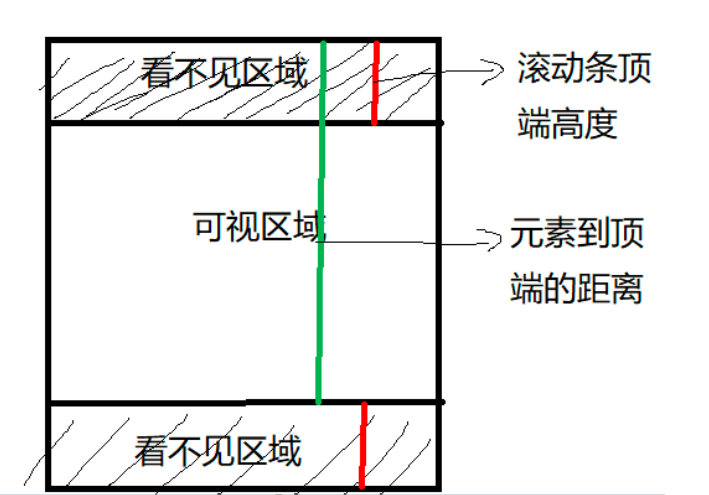
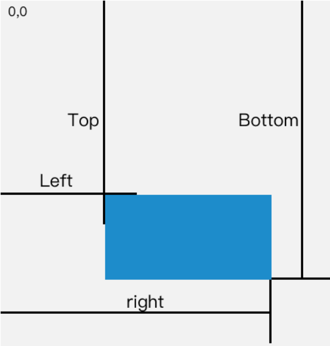

### js 

#### 浅谈实现浅拷贝，以及实现浅拷贝思路

### css

#### 说说定位有哪几种

#### 三栏布局

### 算法

#### 两个数组去重之后的交集

> 大数组[1,1,3,5,6,4,2,5,7]，小数组[4,4,2,1,3,8,11]，输出大数组和小数组的去重后的交集[1,3,4,2]
>
> ```js
> let arr1 = [1,1,3,5,6,4,2,5,7]
> let arr2 = [4,4,2,1,3,8,11]
> 
> function getRes(arr1, arr2) {
>     let res1 = new Set(arr1);
>     let res2 = new Set(arr2);
>     let newArr = [...res1].filter(ele => res2.has(ele));
>     return newArr
> }
> 
> console.log(getRes(arr1, arr2));
> ```

### 数组拉平

> 

### 场景题

#### 1

> 页面在用户每天第一次打开时alert("wellcome")，当天再次打开就不再alert

#### 2 

> 触底加载和下拉刷新

#### 如果发送多个请求loading，防止提前取消怎么设置

> 设置axios拦截器：这个拦截器的功能是在请求前打开 loading，请求结束或出错时关闭 loading。
>
> 如果每次只有一个请求，这样运行是没问题的。但同时有多个请求并发，就会有问题了。
>
> > 假如现在同时发起两个请求，在请求前，拦截器 `this.isShowLoading = true` 将 loading 打开。
> >
> > 现在有一个请求结束了。`this.isShowLoading = false` 拦截器关闭 loading，但是另一个请求由于某些原因并没有结束。
> >
> > 造成的后果就是页面请求还没完成，loading 却关闭了，用户会以为页面加载完成了，结果页面不能正常运行，导致用户体验不好。
> >
> > **解决方法**
> >
> > 增加一个 `loadingCount` 变量，用来计算请求的次数。
> >
> > 再增加两个方法，来对 `loadingCount` 进行增减操作。
> >
> > 这个拦截器的功能是：
> >
> > 每当发起一个请求，打开 loading，同时 `loadingCount` 加1。
> >
> > 每当一个请求结束， `loadingCount` 减1，并判断 `loadingCount` 是否为 0，如果为 0，则关闭 loading。
> >
> > 这样即可解决，多个请求下有某个请求提前结束，导致 loading 关闭的问题。

#### 移动端的适配方案

#### 多个请求，如何实现返回第一个成功请求

#### 手写发布订阅模式，订阅，触发，移除

#### 如何判断元素出现在可视区域

> https://github.com/febobo/web-interview/issues/84
>
> 在日常开发中，我们经常需要判断目标元素是否在视窗之内或者和视窗的距离小于一个值（例如 100 px），从而实现一些常用的功能，例如：
>
> - 图片的懒加载
> - 列表的无限滚动
> - 计算广告元素的曝光情况
> - 可点击链接的预加载
>
> 
>
> 常用三种方法
>
> - offsetTop、scrollTop
> - getBoundingClientRect
> - IntersectionObserver
>
> **offsetTop、scrollTop**
>
> 原理：图片距离顶部的距离小于我们的视口高度
>
> `window.innerHeight` 是浏览器可视区的高度
>
> `offsetTop` 是元素顶部距离文档顶部的高度（包括滚动条的距离）
>
> `document.body.scrollTop || document.documentElement.scrollTop` 是浏览器滚动的过的距离
>
> 图片加载条件：`img.offsetTop < window.innerHeight + document.body.scrollTop;`
>
> ```js
> function isInViewPortOfOne (el) {
>     // viewPortHeight 兼容所有浏览器写法
>     const viewPortHeight = window.innerHeight || document.documentElement.clientHeight || document.body.clientHeight 
>     const offsetTop = el.offsetTop
>     const scrollTop = document.documentElement.scrollTop
>     const top = offsetTop - scrollTop
>     return top <= viewPortHeight
> }
> ```
>
> 
>
> **getBoundingClientRect**
>
> 返回值是一个 `DOMRect`对象，拥有`left`, `top`, `right`, `bottom`, `x`, `y`, `width`, 和 `height`属性
>
> ```js
> const target = document.querySelector('.target');
> const clientRect = target.getBoundingClientRect();
> console.log(clientRect);
> 
> // {
> //   bottom: 556.21875,
> //   height: 393.59375,
> //   left: 333,
> //   right: 1017,
> //   top: 162.625,
> //   width: 684
> // }
> ```
>
> 属性对应的关系图如下所示：
>
> 
>
> 当页面发生滚动的时候，`top`与`left`属性值都会随之改变
>
> 如果一个元素在视窗之内的话，那么它一定满足下面四个条件：
>
> - top 大于等于 0
> - left 大于等于 0
> - bottom 小于等于视窗高度
> - right 小于等于视窗宽度
>
> ```js
> function isInViewPort(element) {
>   const viewWidth = window.innerWidth || document.documentElement.clientWidth;
>   const viewHeight = window.innerHeight || document.documentElement.clientHeight;
>   const {
>     top,
>     right,
>     bottom,
>     left,
>   } = element.getBoundingClientRect();
> 
>   return (
>     top >= 0 &&
>     left >= 0 &&
>     right <= viewWidth &&
>     bottom <= viewHeight
>   );
> }
> ```
>
> **IntersectionObserver**
>
> `IntersectionObserver` 即重叠观察者，从这个命名就可以看出它用于判断两个元素是否重叠，因为不用进行事件的监听，性能方面相比`getBoundingClientRect `会好很多
>
> 使用步骤主要分为两步：创建观察者和传入被观察者