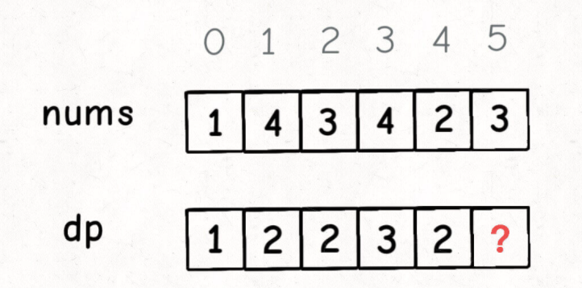
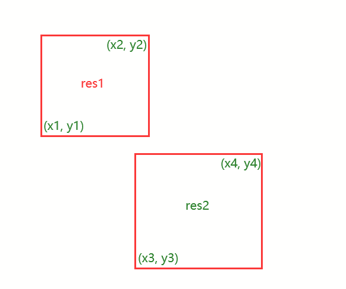

### [3. 无重复字符的最长子串](https://leetcode-cn.com/problems/longest-substring-without-repeating-characters/)

> 滑动窗口思路
>
> ```js
> var lengthOfLongestSubstring = function(s) {
>     let res = 0;
>     let window = {};
>     let left = right = 0;
>     while (right < s.length) {
>         let intoStr = s[right];
>         right++;
>         window[intoStr] = (window[intoStr] || 0) + 1;
>         while (window[intoStr] > 1) {
>             let removeStr = s[left];
>             left++;
>             window[removeStr]--;
>         }
>         res = Math.max(res, right - left);
>     }
>     return res;
> };
> ```
>
> 

### [88. 合并两个有序数组](https://leetcode-cn.com/problems/merge-sorted-array/)

> ```js
> var merge = function(nums1, m, nums2, n) {
>     let k = m + n - 1;
>     m--;    // 注意！！！一定要先--，因为这代表长度
>     n--;
>     while(k >= 0) {
>         if (m < 0) {
>             nums1[k--] = nums2[n--];
>         } else if (n < 0) {
>             nums1[k--] = nums1[m--];
>         } else if (nums1[m] > nums2[n]) {
>             nums1[k--] = nums1[m--];
>         } else {
>             nums1[k--] = nums2[n--];
>         }
>     }
>     return nums2;
> };
> ```

### [53. 最大子数组和](https://leetcode-cn.com/problems/maximum-subarray/)

> 动态规划入门
>
> 以 nums[i] 为结尾的「最大子数组和」为 dp[i]
> 假设我们已经算出了 dp[i-1]，如何推导出 dp[i]
> dp[i] 有两种「选择」，要么与前面的相邻子数组连接，形成一个和更大的子数组；要么不与前面的子数组连接，自成一派，自己作为一个子数组
> 想得到整个 nums 数组的「最大子数组和」，不能直接返回 dp[n-1]，而需要遍历整个 dp 数组求dp里面的最大值
>
> ```js
> var maxSubArray = function(nums) {
>     if (nums.length == 0) return 0;
>     let len = nums.length;
>     let dp = new Array(len).fill(0);
>     dp[0] = nums[0];
>     for (let i = 1; i < nums.length; i++) {            // ------一定要注意！！！是从1开始循环
>         dp[i] = Math.max(nums[i], nums[i] + dp[i - 1]);
>     }
>     return Math.max(...dp);
> };
> 
> ```
>
> 空间和时间复杂度都为o(n)
>
> 优化空间：**注意到 `dp[i]` 仅仅和 `dp[i-1]` 的状态有关**，那么我们可以施展前文 [动态规划的降维打击](https://labuladong.gitee.io/algo/3/24/74/) 讲的技巧进行进一步优化，将空间复杂度降低：
>
> ```js
> var maxSubArray = function(nums) {
>     if (nums.length == 0) return 0;
>     let len = nums.length;
>     let dp_0 = nums[0];
>     let dp_1;
>     let res = dp_0;
>     for (let i = 1; i < len; i++) {
>         // dp[i] = Math.max(nums[i], nums[i] + dp[i - 1]);
>         dp_1 = Math.max(nums[i], nums[i] + dp_0);
>         dp_0 = dp_1;
>         // 顺便计算最大结果
>         res = Math.max(res, dp_1);
>     }
>     return res;
> };
> ```
>
> 时间复杂度o(n),空间o(1)

### [300. 最长递增子序列](https://leetcode-cn.com/problems/longest-increasing-subsequence/)

> 注意「子序列」和「子串」这两个名词的区别，子串一定是连续的，而子序列不一定是连续的。
>
> **`dp[i]` 表示以 `nums[i]` 这个数结尾的最长递增子序列的长度**。
>
>  base case：`dp[i]` 初始值为 1，因为以 `nums[i]` 结尾的最长递增子序列起码要包含它自己。
>
> 根据刚才我们对 `dp` 数组的定义，现在想求 `dp[5]` 的值，也就是想求以 `nums[5]` 为结尾的最长递增子序列。
>
> 
>
> **`nums[5] = 3`，既然是递增子序列，我们只要找到前面那些结尾比 3 小的子序列，然后把 3 接到这些子序列末尾，就可以形成一个新的递增子序列，而且这个新的子序列长度加一**。
>
> `nums[5]` 前面有哪些元素小于 `nums[5]`？这个好算，用 for 循环比较一波就行了。
>
> 以这些元素为结尾的最长递增子序列的长度是多少？回顾一下我们对 `dp` 数组的定义，它记录的正是以每个元素为末尾的最长递增子序列的长度。
>
> 以我们举的例子来说，`nums[0]` 和 `nums[4]` 都是小于 `nums[5]` 的，然后对比 `dp[0]` 和 `dp[4]` 的值，我们让 `nums[5]` 和更长的递增子序列结合，得出 `dp[5] = 3`：
>
> ```js
> var lengthOfLIS = function(nums) {
>     let dp = new Array(nums.length).fill(1);   // 注意，必须填充1
>     // dp[0] = 1;
>     for (let i = 0; i < nums.length; i++) {
>         // // i与i前面的元素比较
>         for (let j = 0; j < i; j++) {
>             // 找比i小的元素，找到一个，就更新当前dp[i]，是否让当前序列的最长子序列长度加1
>             if (nums[i] > nums[j]) {
>                 dp[i] = Math.max(dp[i], dp[j] + 1);
>             }
>         }
>     }
>     return Math.max(...dp);
> };
> ```

### [354. 俄罗斯套娃信封问题](https://leetcode-cn.com/problems/russian-doll-envelopes/)

> 先对宽度w进行升序排序，
>
> 如果遇到w相同的情况，则按照高度h降序排序。
>
> 之后把所有的h作为一个数组，
>
> 在这个数组上计算 LIS(最长递增子序列) 的长度就是答案。
>
> ```js
> var maxEnvelopes = function(envelopes) {
>  // 将信封宽度按照升序排列，同宽度的话，那就高度降序
>  // 然后用一维数组保存排序好的高度值，找出最长递增子序列
>  let nums = envelopes.sort((a, b) => a[0] != b[0] ? a[0] - b[0] : b[1] - a[1]).map(ele => ele[1]);
>  let dp = new Array(nums.length).fill(1);
>  dp[0] = 1;
>  for (let i = 0; i < nums.length; i++) {
>      for (let j = 0; j < i; j++) {
>          if (nums[j] < nums[i]) {
>              dp[i] = Math.max(dp[i], dp[j] + 1);
>          }
>      }
>  }
>  return Math.max(...dp);
> };
> ```
>
> 

### [165. 比较版本号](https://leetcode-cn.com/problems/compare-version-numbers/)

> 解法1，时间复杂度：O(n+m),空间复杂度：O(n+m)
>
> ```js
> var compareVersion = function(version1, version2) {
>     let arr1 = version1.split('.');
>     let arr2 = version2.split('.');
>     for (let i = 0; i < arr1.length || i < arr2.length; i++) {
>         let x = 0, y = 0;
>         if (i < arr1.length) {
>             x = parseInt(arr1[i]);
>         }
>         if (i < arr2.length) {
>             y = parseInt(arr2[i]);
>         }
>         if (x !== y) {
>             return x > y ? 1 : -1;
>         }
>     }
>     return 0;
> };	
> ```
>
> 解法2，双指针，时间复杂度：O(n+m)，空间复杂度：O(1)
>
> ```js
> // 双指针解法
> var compareVersion = function(version1, version2) {
>     let i = 0, j = 0;
>     let m = version1.length, n = version2.length;
>     while(i < m || j < n) {
>         let x = 0;
>         for (; i < m && version1[i] != '.'; i++) {     //-------一定要注意，判别条件要加上 i < m
>             x = x * 10 + version1[i].charCodeAt() - '0'.charCodeAt();
>         }
>         i++; // 跳过'.'
>         let y = 0;
>         for (; j < n && version2[j] != '.'; j++) {
>             y = y * 10 + version2[j].charCodeAt() - '0'.charCodeAt();
>         }
>         j++;
>         if (x !== y) {
>             return x > y ? 1 : -1;
>         }
>     }
>     return 0;
> };
> ```
>
> ps:赋值那里`x * 10 + version1[i].charCodeAt() - '0'.charCodeAt()`;，乘以10是为了进位，减去`'0'.charCodeAt()`是为了消除前导0的影响。

### [129. 求根节点到叶节点数字之和](https://leetcode-cn.com/problems/sum-root-to-leaf-numbers/)

> - 让我们获取所有路径数字之和，那我们递归遍历一遍二叉树，沿路记录下来路径上的数字，到叶子节点的时候求和
>
> ```js
> var sumNumbers = function(root) {
>     const dfs = (root, path) => {
>         if (root == null) return 0;
>         path = path * 10 + root.val;
>         if (root.left == null && root.right == null) return path;
>         return dfs(root.left, path) + dfs(root.right, path);
>     }
>     return dfs(root, 0);
> };
> ```
>

### [20. 有效的括号](https://leetcode-cn.com/problems/valid-parentheses/)

> 栈题目，
>
> * 判断是左括号就入栈
> * 如果不是左括号，就从把当前元素与栈顶元素匹配:
>   * 如果匹配，则表示匹配，栈顶元素出栈；
>   * 如果不匹配，则直接退出返回false了
> * 循环完字符串所有字符后，判断stack.length:都匹配，那是否是有效的括号就取决于是否栈中有剩余的左括号了，如果没有则为有效括号
>
> `巧妙点`：用map对象来匹配左右对应的括号
>
> ```js
> var isValid = function(s) {
>     let stack = [];
>     const map = {
>         '(' : ')',
>         '{' : '}',
>         '[' : ']'
>     }
>     for (let ele of s) {
>         let len = stack.length;
>         if (ele == '(' || ele == '[' || ele == '{') {  // 如果ele是左括号，入栈
>             stack.push(ele);
>         } else {										// ele是右括号：判断是否对应
>             if (ele == map[stack[len - 1]]) {       	// 栈顶如果是是ele对应的右括号，出栈顶
>                 stack.pop();
>             } else {									// 栈顶右扩号不和ele对应，直接false
>                 return false;
>             }
>         }
>     }
>     return !stack.length;
> };
> ```
>
> 简洁版，如果ele是栈顶对应的右括号，出栈顶元素，否则一律入栈（入栈的是错误的话在最后return的时候会暴露出来，也就是说stack长度一定非0）
>
> ```js
> var isValid = function(s) {
>     let stack = [];
>     const map = {
>         '(' : ')',
>         '{' : '}',
>         '[' : ']'
>     }
>     for (let ele of s) {
>         let len = stack.length;
>         if (ele === map[stack[len - 1]]) {
>             stack.pop();
>         } else {
>             stack.push(ele);
>         }
>     }
>     return !stack.length;
> };
> ```

> [1. 两数之和](https://leetcode-cn.com/problems/two-sum/)
>
> 思路：
>
> * Map()存储
> * 整体遍历nums[i]
>   * 如果target-nums[i]在map中，两数为nums[i]和target-nums[i]，利用map输出下标
>   * 否则，map.set(nums[i], i)
>
> ```js
> 
> ```

### [剑指 Offer 22. 链表中倒数第k个节点](https://leetcode-cn.com/problems/lian-biao-zhong-dao-shu-di-kge-jie-dian-lcof/)

> 快慢双指针，让fast先走k步，然后slow和fast同时走，直到fast走到头，此时，slow指向倒数第k个
>
> 技巧：使用虚拟头结点，可以简化许多非空代码的判定
>
> ```js
> var getKthFromEnd = function(head, k) {
>     let dummy = new ListNode(0, head);
>     let slow = dummy, fast = dummy;
>     while(fast && k) {
>         fast = fast.next;
>         k--;
>     }
>     while (fast) {
>         slow = slow.next;
>         fast = fast.next;
>     }
>     return slow;
> };
> ```
>
> 

> 常规解法，先求出长度，然后找第 len - k + 1个节点
>
> ```js
> var getKthFromEnd = function(head, k) {
>     let len = 0;
>     let t = head;
>     while (head) {
>         len++;
>         head = head.next;
>     }
>     // 输出第len - k 下一个
>     let i = len - k;
>     while (i--) {
>         t = t.next;
>     }
>     return t;
> };
> ```

### [131. 分割回文串](https://leetcode-cn.com/problems/palindrome-partitioning/)

> 回溯思想

> ```js
> var partition = function(s) {
>  // 结果集
>  let res = [];
>  // 存放切割后回文的子串
>  let path = [];
>  let len = s.length;
>  backtrack(0);
>  return res;
>  function backtrack(startIndex) {
>      //  结束条件；起始位置大于长度，说明找到了一种切割方案，加入结果集
>      if (startIndex >= len) {
>          res.push(Array.from(path));
>          return;
>      }
>      for (let i = startIndex; i < len; i++) {
>          if (isPalindrome(s, startIndex, i)) {  // 是回文子串时，将此子串加入path
>              path.push(s.slice(startIndex, i + 1));  
>          } else {
>              continue;                           // 不是回文子串，跳过本轮循环
>          }
>          backtrack(i + 1);                       // 寻找i + 1位起始位置的子串
>          path.pop();                             // 回溯过程，弹出本次已经填入的子串
>      }
>  }
> };
> 
> // 判断回文串
> function isPalindrome(s, start, end) {
>  for (let i = start, j = end; i < j ; i++, j--) {
>      if (s[i] != s[j]) {
>          return false;
>      }
>  }
>  return true;
> }
> ```

### [93. 复原 IP 地址](https://leetcode-cn.com/problems/restore-ip-addresses/)

> 回溯

> ```js
> var restoreIpAddresses = function(s) {
>     const res = [], path = [];
>     backtrack(0);
>     return res;
>     function backtrack(startIndex) {
>         // 终止条件：找到了四段合法字符串，并且startIndex达到终点，添加'.'
>         if (4 == path.length && startIndex == s.length) {
>             res.push(path.join('.'));
>             return;
>         }
>         for (let i = startIndex; i < s.length; i++) {
>             // 判断是否合法，不合法时结束本 层 循环
>             let str = s.slice(startIndex, i + 1);
>             if (str.length > 3 || Number(str) > 255) break;
>             if (str.length > 1 && str[0] == '0') break;
>             path.push(str);     // 推入path中
>             backtrack(i + 1);  //找下一个起始点
>             path.pop();   // 回溯
>         }
>     }
> };
> ```

### [112. 路径总和](https://leetcode-cn.com/problems/path-sum/)

> > 题目的意思是否有从「根节点」到某个「叶子节点」经过的路径上的节点之和等于目标和
> > 采用深度优先搜索的方式，从根节点到当前节点的值之和为 val，我们可以将这个大问题转化为一个小问题：是否存在从当前节点的子节点到叶子的路径，满足其路径和为 sum - val
> >
> > * 如果节点为空则不需要再递归了 直接返回false
> > * 遍历到叶子节点  如果逐步减少的目标值为零则表明找到一条满足条件的路径
> > * 当前递归问题 拆解成 两个子树的问题，只要左右子树当中任何一个有满足条件的就行
>
> ```js
> var hasPathSum = function(root, targetSum) {
>     if (root == null) return false;
>     if (!root.left && !root.right) return targetSum - root.val == 0;
>     return (
>         hasPathSum(root.left, targetSum - root.val) ||
>         hasPathSum(root.right, targetSum - root.val)
>     );
> };
> ```

### [113. 路径总和 II](https://leetcode-cn.com/problems/path-sum-ii/)

> 题目的意思是找到所有满足从「根节点」到某个「叶子节点」经过的路径上的节点之和等于目标和的路径
> 用深度优先搜索的方式，枚举每一条从根节点到叶子节点的路径。当我们遍历到叶子节点，且此时路径和恰为目标和时，我们就找到了一条满足条件的路径
> 为了维护经过的路径，在进入递归的时候要在 path 列表添加节点，结束递归的时候删除节点，跟回溯算法差不多类似的套路
>
> 
>
> ```js
> var pathSum = function(root, targetSum) {
>     let path = [];
>     let res = [];
>     const dfs = (root, target) => {
>         // 如果节点为空则不需要再递归了
>         if (root == null) return;
>         // 把当前节点的值加入路径中
>         path.push(root.val);
>         // 由于路径中加入了当前节点，那目标值就少了
>         target -= root.val;
>         if (!root.left && !root.right && target == 0) {
>             // 如果到达叶子节点 并且目标值满足，注意，用concat()返回一个新数组，不过也是浅拷贝
>             res.push(path.concat());
>         }
>         dfs(root.left, target);
>         dfs(root.right, target);
>         // 左右子节点都递归完了，把当前节点从路径中删除，可走下一条路径
>         path.pop();
>     }
>     dfs(root, targetSum);
>     return res;
> };
> ```

### [415. 字符串相加](https://leetcode-cn.com/problems/add-strings/)

> 思路 
>
> 
>
> 1.尾部对齐，开始相加 ：取到各自长度，再-- 
>
> 2.当i，j，余数不为空时，继续加 ,unshift()，头部加
>
> 3.转为字符串，return
>
> ```js
> var addStrings = function(num1, num2) {
>  let i = num1.length - 1;
>  let j = num2.length - 1;
>  let carry = 0;
>  let res = [];
>  while (i >= 0 || j >= 0 || carry) {
>      let sum1 = num1[i] ? num1[i] - 0 : 0;
>      let sum2 = num2[j] ? num2[j] - 0 : 0;
>      let cur = sum1 + sum2 + carry;
>      res.push(cur % 10);
>      carry = Math.floor(cur / 10);
>      i--;
>      j--;
>  }
>  return res.reverse().join("");
> };
> ```

### 15 三数之和

> ```js
> var threeSum = function(nums) {
>     nums.sort((a, b) => a - b);
>     let res = [];
>     let len = nums.length;
>     for (let i = 0; i < len; i++) {
>         let tuples = twoSum(nums, i + 1, 0 - nums[i]);
>         for (let arr of tuples) {
>             arr.push(nums[i]);
>             res.push(arr);
>         }
>         while (i < len - 1 && nums[i] == nums[i + 1]) i++;
>     }
>     return res;
> };
> 
> function twoSum(nums, start, target) {
>     let left = start, right = nums.length - 1;
>     let res = [];
>     while (left < right) {
>         let res1 = nums[left], res2 = nums[right];
>         let sum = res1 + res2;
>         if (sum > target) {
>             while (left < right && res2 == nums[right]) right--;
>         } else if (sum < target) {
>             while (left < right && res1 == nums[left]) left++;
>         } else {
>             res.push([res1, res2]);
>             while (left < right && res2 == nums[right]) right--;
>             while (left < right && res1 == nums[left]) left++;
>         }
>     }
>     return res;
> }
> ```
>

#### [215. 数组中的第K个最大元素](https://leetcode-cn.com/problems/kth-largest-element-in-an-array/)

> api投机取巧方法
>
> ```js
> var findKthLargest = function(nums, k) {
>     return nums.sort((a, b) => b - a)[k - 1];
> };
> ```
>
> https://leetcode-cn.com/problems/kth-largest-element-in-an-array/solution/li-yong-kuai-su-pai-xu-de-partitionfen-q-8qng/

### 洗牌算法-对数组乱序输出

> 思路：**每次从原数组中随机取一个元素，然后把该元素跟最后一个元素交换，即数组的尾部放的是已经处理过的元素**
>
> ```js
> function shuffle(arr) {
>     let len = arr.length, random;
>     while (len) {
>         random = parseInt(Math.random() * len--);
>         [arr[len], arr[random]] = [arr[random], arr[len]];
>     }
>     return arr;
> }
> console.log(shuffle([1, 2, 3, 4, 5])); // [ 5, 1, 4, 2, 3 ]
> ```

### [215. 数组中的第K个最大元素](https://leetcode-cn.com/problems/kth-largest-element-in-an-array/)

> 利用快排的partition思想来寻找第k个最大元素
>
> * 在长度为n的排序数组中，第k大的数字的下标是n-k
> * 用快速排序的函数partition对数组分区，如果函数partition选取的中间值在分区之后的下标正好是n-k，分区后左边的的值都比中间值小，右边的值都比中间值大，即使整个数组不是排序的，中间值也肯定是第k大的数字
> * 如果函数partition选取的中间值在分区之后的下标大于n-k，那么第k大的数字一定位于中间值的左侧，于是再对中间值的左侧的子数组分区
> * 如果函数partition选择的中间值在分区之后的下标小于n-k，那么第k大的数字一定位于中间值的右侧，于是再对中间值的右侧的子数组分区
>
> ```js
> var findKthLargest = function(nums, k) {
>     let low = 0, high = nums.length - 1;
>     // 找到数组升序排列中，第k个最大元素的数组下标--我们所求目标值的数组下标
>     let targetIndex = nums.length - k;
>     while (low <= high) {
>         // 在 nums[low...high] 中选一个分界点
>         let index = partition(nums, low, high);
>         if (index > targetIndex) {
>             high = index - 1;
>         } else if (index < targetIndex) {
>             low = index + 1;
>         } else {
>             return nums[targetIndex];
>         }
>     }
>     return -1;
> };
> 
> function partition(nums, low, high) {
>     // 取第一个元素作为基准元素
>     let pivot = nums[low];
>     let i = low + 1, j = high;
>     while (i <= j) {
>         while (i < high && nums[i] <= pivot) {     // i往右走，直到指向大于pivot的元素，停止，等待交换
>             i++;
>         }
>         while (j > low && nums[j] > pivot) {       // j往左走，直到指向小于pivot的元素，停止，等待交换
>             j--;
>         }
>         if (i >= j) {                              // 此时j指向的是已经排好位置的索引
>             break;
>         }
>         [nums[i], nums[j]] = [nums[j], nums[i]];  // 交换i,j指向的元素，保证以pivot基准，左小右大
>     }
>     // 将pivot放到合适位置，即pivot左边元素较小，右边元素较大
>     [nums[low], nums[j]] = [nums[j], nums[low]]
>     return j;
> }
> ```

### 912.排序数组 

#### 快排

> https://mp.weixin.qq.com/s/8ZTMhvHJK_He48PpSt_AmQ
>
> ps：加洗牌算法后，速度快了很多

> ```js
> var sortArray = function(nums) {
>     // 洗牌算法，最大限度避免极端情况
>     shuffle(nums);
>     quickSort(nums, 0, nums.length - 1);
>     return nums;
> };
> 
> function quickSort(nums, low, high) {
>     if (low >= high) {
>         return;
>     }
>     // 对 nums[low..high] 进行切分
>     // 使得 nums[low..sureIndex] <= nums[sureIndex] < nums[sureIndex+1..high]
>     let sureIndex = partition(nums, low, high);
>     quickSort(nums, low, sureIndex - 1);
>     quickSort(nums, sureIndex + 1, high);
> }
> // 快排核心算法,对 nums[low..high] 进行切分
> function partition(nums, low, high) {
>     let i = low + 1, j = high;
>     let pivot = nums[low];
>     // 关于区间的边界控制需格外小心，稍有不慎就会出错
>     while (i <= j) {
>         while (i < high && nums[i] <= pivot) { // 注意！！！ 加 = // i往右走，直到指向大于pivot的元素，停止，等待交换
>             i++;
>         }
>         while (j > low && nums[j] > pivot) {   // j往左走，直到指向小于pivot的元素，停止，等待交换
>             j--;
>         }
>         if (i >= j) {                           // 此时j指向的是已经排好位置的索引
>             break;
>         }
>         [nums[i], nums[j]] = [nums[j], nums[i]];  // 交换i,j指向的元素，保证以pivot基准，左小右大
>     }
>     // 将 pivot(nums[low]) 放到合适的位置，即 pivot 左边元素较小，右边元素较大
>     [nums[j], nums[low]] = [nums[low], nums[j]];
>     return j;                                  
> }
> 
> // 洗牌算法 实现数组乱序  --- 优化，要不要都行
> function shuffle(nums) {
>     let len = nums.length, random;
>     while(len) {
>         random = parseInt(Math.random() * len--);
>         [nums[len], nums[random]] = [nums[random], nums[len]];
>     }
> }
> ```

#### 归并

> https://mp.weixin.qq.com/s?__biz=MzAxODQxMDM0Mw==&mid=2247495989&idx=1&sn=30e34ac75dd1c724205e9c8b0f488e35&scene=21#wechat_redirect

#### 堆排序

> dd

### [121. 买卖股票的最佳时机](https://leetcode-cn.com/problems/best-time-to-buy-and-sell-stock/)

> - 思路很简单，用一个变量保存价格最低，然后在之后的天里面找哪天价最高，最高价减去最低价就是最大利润
>
> ```js
> var maxProfit = function(prices) {
>   let profit = 0; // 初始利润设为0
>   let min = prices[0]; // 确定一个股票中的最小值
>   for (let i = 1; i < prices.length; i++) {
>     if (prices[i] < min) {
>       // 遍历时进行最小值赋值
>       min = prices[i];
>     } else if (prices[i] - min > profit) {
>       // 如果出现比最大利润还要大的就进行重新赋值
>       profit = prices[i] - min;
>     }
>   }
>   return profit;
> };
> ```

### [122. 买卖股票的最佳时机 II](https://leetcode-cn.com/problems/best-time-to-buy-and-sell-stock-ii/)

> 贪心算法的解题思路
> 既然题目没有限制我们交易的次数，使用贪心算法的思路就是，只要今天比昨天的价格高，就应该在昨天买进今天卖出
> 最后求和即可：计算这一系列买进卖出操作后的营利之和
>
> ```js
> var maxProfit = function(prices) {
>     let res = 0;
>     for (let i = 1; i < prices.length; i++) {
>         res += Math.max(0, prices[i] - prices[i - 1]);
>     }
>     return res;
> };
> ```
>
> 

### [230. 二叉搜索树中第K小的元素](https://leetcode-cn.com/problems/kth-smallest-element-in-a-bst/)

> 中序
>
> ```js
> var kthSmallest = function(root, k) {
>     let count = 0;
>     let res = 0;
>     function traverse(root) {
>         if (root == null) return;
>         traverse(root.left);
>         count++;
>         if (k == count) {
>             res = root.val;
>             return;
>         }
>         traverse(root.right);
>     }
>     traverse(root);
>     return res;
> };
> ```
>

### [171. Excel 表列序号](https://leetcode-cn.com/problems/excel-sheet-column-number/)

> 思路：就是一个进制转换题目，只不过本题转换的是26进制
>
> 我们先来看一下如果是十进制该怎么转换：假设存在某个十进制数字，编码为 ABCD*A**B**C**D*（字母与数字的映射关系与本题相同）
>
> > ans = 0
> > ans = ans * 10 + 1ans=ans∗10+1 => A
> > ans = ans * 10 + 2ans=ans∗10+2 => B
> > ans = ans * 10 + 3ans=ans∗10+3 => C
> > ans = ans * 10 + 4ans=ans∗10+4 => D
>
> 同理，本题只是将 `10 进制`换成 `26 进制`。
>
> ```js
> var titleToNumber = function(columnTitle) {
>     let res = 0;
>     for (let i = 0; i < columnTitle.length; i++) {
>         res = res * 26 + (columnTitle[i].charCodeAt() - 'A'.charCodeAt() + 1);
>     }
>     return res;
> };
> ```

### [836. 矩形重叠](https://leetcode-cn.com/problems/rectangle-overlap/)

> 矩形以列表 [x1, y1, x2, y2] 的形式表示，其中 (x1, y1) 为左下角的坐标，(x2, y2) 是右上角的坐标。矩形的上下边平行于 x 轴，左右边平行于 y 轴。
>
> 如果相交的面积为 正 ，则称两矩形重叠。需要明确的是，只在角或边接触的两个矩形不构成重叠。
>
> 给出两个矩形 rec1 和 rec2 。如果它们重叠，返回 true；否则，返回 false 。
>

> 
>
> 思路：
>
> 矩形如果不重叠，从x轴和y轴上看两个矩形就变成了`两条线段`，这两条线段肯定是不相交的
>
> 也就是说`左边`的矩形的`最右边`**小于**`右边`矩形的`最左边`，
>
> 也就是:x1 > x4 || x3 > x2
>
> y轴同理，`下面`的矩形的`最上边`**小于**`上面`矩形的`最下边`，
>
> 也就是:y1 > y4 || y3 > y2
>
> 因为题目要求只在边重叠算相离，所以加上=，最后取反
>
> ```js
> var isRectangleOverlap = function(rec1, rec2) {
>     // 解构赋值
>     const [x1, y1, x2, y2] = rec1;
>     const [x3, y3, x4, y4] = rec2;
>     return !(x1 >= x4 || x3 >= x2 || y1 >= y4 || y3 >= y2);
> };
> ```

### [230. 二叉搜索树中第K小的元素](https://leetcode-cn.com/problems/kth-smallest-element-in-a-bst/)

> 中序遍历，在中序位置开始做一些操作

> ```js
> var kthSmallest = function(root, k) {
>     let res = 0;
>     let count = 0;
>     traverse(root);
>     return res;
> 
>     function traverse(root) {
>         if (root == null) {
>             return;
>         }
>         traverse(root.left);
>         count++;
>         if (count == k) {
>             res = root.val;
>         }
>         traverse(root.right);
>     }
> };
> ```

### [102. 二叉树的层序遍历](https://leetcode-cn.com/problems/binary-tree-level-order-traversal/)

> ```js
> var levelOrder = function(root) {
>     let res = [];
>     if (root == null) return res;
>     let queue = [root];
>     while (queue.length) {
>         let len = queue.length;
>         let level = [];
>         for (let i = 0; i < len; i++) {
>             let cur = queue.shift();
>             level.push(cur.val);
>             if (cur.left) queue.push(cur.left);
>             if (cur.right) queue.push(cur.right);
>         }
>         res.push(level);
>     }
>     return res;
> };
> ```
>

### [剑指 Offer 46. 把数字翻译成字符串](https://leetcode-cn.com/problems/ba-shu-zi-fan-yi-cheng-zi-fu-chuan-lcof/)

> 解法1，回溯思想，把输入Number类型的数字看有多少种分法，其中每种分法判断下是否合法（必须保证在0-25之间）
>
> 类似 93 复原ip地址 一题的思路
>
> `注意`：输入的num是个Number类型，要进行toString()的一个转换
>
> ```js
> var translateNum = function(num) {
>     let res = [];   // res保存了所有合法的分法
>     let path = [];
>     let strNum = num.toString();
>     backtrack(0);
>     return res.length;
> 
>     function backtrack(start) {
>         if (start == strNum.length) {
>             res.push(path.concat());
>             return;
>         }
>          // 每次取 1 - 2 位即可，这里可以优化
>         for (let i = start; i < strNum.length; i++) {
>             if (i - start > 2) break;  // 优化，每次取1 -2 位即可
>             const translateRes = translate(strNum.slice(start, i + 1));
>             if (!translateRes) break;
>             path.push(translateRes);
>             backtrack(i + 1);
>             path.pop();
>         }
>     }
> };
> 
> // 看下这种分法是否合法
> function translate(num) {
>     let res = '';
>     if (num >= 0 && num <= 25) {
>         const chars = Array.from('abcdefghijklmnopqrstuvwxyz')
>         res = chars[num];
>     }
>     return res;
> }
> ```
>
> #### 更应该用dp来做

### [509. 斐波那契数](https://leetcode-cn.com/problems/fibonacci-number/)

> ```js
> var fib = function(n) {
>  if (n === 0) return 0;
>  let dp = new Array(n + 1).fill(0);
>  //base case
>  dp[0] = 0;
>  dp[1] = 1;
>  //状态转移
>  for (let i = 2; i <= n; i++) {
>      dp[i] = dp[i - 1] + dp[i - 2];
>  }
>  return dp[n];
> };
> ```
>
> 
>
> ```js
> 变量命名dp_i_1什么的，这样来命名更好理解
> var fib = function(n) {
>  if (n == 0 || n == 1) return n;
>  let pre = 0, cur = 1;
>  for (let i = 2; i <= n; i++) {
>      let sum = pre + cur;
>      pre = cur;
>      cur = sum;
>  }
>  return cur;
> };
> ```
>
> 

### [剑指 Offer 10- II. 青蛙跳台阶问题](https://leetcode-cn.com/problems/qing-wa-tiao-tai-jie-wen-ti-lcof/)

> 设跳上 nn 级台阶有 f(n) 种跳法。在所有跳法中，青蛙的最后一步只有两种情况： 跳上 1 级或 2 级台阶。
> 	当为 1 级台阶： 剩 n-1 个台阶，此情况共有 f(n−1) 种跳法；
> 	当为 2 级台阶： 剩 n-2个台阶，此情况共有 f(n−2) 种跳法。
> f(n) 为以上两种情况之和，即 `f(n)=f(n-1)+f(n-2)` ，以上递推性质为斐波那契数列。本题可转化为 求斐波那契数列第 n 项的值 ，与 面试题10- I. 斐波那契数列 等价，唯一的不同在于起始数字不同。
> 	青蛙跳台阶问题： f(0)=1 , f(1)=1 , f(2)=2 ；
> 	斐波那契数列问题： f(0)=0 , f(1)=1 , f(2)=1 。
>
> ```js
> var numWays = function(n) {
>     if (!n || n == 1) return 1;
>     let arr = [1, 1];
>     for (let i = 2; i <= n; i++) {
>         arr[i] = (arr[i - 1] + arr[i - 2]) % 1000000007;
>     }
>     return arr[n];
> };
> ```
>
> `上面代码好理解，但是额外使用了数组，空间复杂度o(n)，接下来不用数组，优化一下`
>
> ```js
> var numWays = function(n) {
>     if (n == 0 || n == 1) return 1;
>     let a = 1, b = 1, sum;
>     for (let i = 2; i <= n; i++) {
>         sum = (a + b) % 1000000007;
>         a = b;
>         b = sum;
>     }
>     return b;
> };
> ```

### 	[70. 爬楼梯](https://leetcode-cn.com/problems/climbing-stairs/)

> ```js
> var climbStairs = function(n) {
>     if (n == 0 && n == 1) return n;
>     let dp_0 = 1;
>     let dp_1 = 1;
>     let res;
>     for (let i = 2; i <= n; i++) {
>         res = dp_0 + dp_1;
>         dp_0 = dp_1;
>         dp_1 = res;
>     }
>     return dp_1;
> };
> ```
>
> 

### [40. 组合总和 II](https://leetcode-cn.com/problems/combination-sum-ii/)

> ```js
> 
> ```

> 
>
> ### [3. 无重复字符的最长子串](https://leetcode-cn.com/problems/longest-substring-without-repeating-characters/)
>
> > 滑动窗口思路
> >
> > ```js
> > var lengthOfLongestSubstring = function(s) {
> >  let res = 0;
> >  let window = {};
> >  let left = right = 0;
> >  while (right < s.length) {
> >      let intoStr = s[right];
> >      right++;
> >      window[intoStr] = (window[intoStr] || 0) + 1;
> >      while (window[intoStr] > 1) {
> >          let removeStr = s[left];
> >          left++;
> >          window[removeStr]--;
> >      }
> >      res = Math.max(res, right - left);
> >  }
> >  return res;
> > };
> > ```
> >
> > 
>
> ### [88. 合并两个有序数组](https://leetcode-cn.com/problems/merge-sorted-array/)
>
> > ```js
> > var merge = function(nums1, m, nums2, n) {
> >  let k = m + n - 1;
> >  m--;    // 注意！！！一定要先--，因为这代表长度
> >  n--;
> >  while(k >= 0) {
> >      if (m < 0) {
> >          nums1[k--] = nums2[n--];
> >      } else if (n < 0) {
> >          nums1[k--] = nums1[m--];
> >      } else if (nums1[m] > nums2[n]) {
> >          nums1[k--] = nums1[m--];
> >      } else {
> >          nums1[k--] = nums2[n--];
> >      }
> >  }
> >  return nums2;
> > };
> > ```
>
> ### [53. 最大子数组和](https://leetcode-cn.com/problems/maximum-subarray/)
>
> > 动态规划入门
> >
> > 以 nums[i] 为结尾的「最大子数组和」为 dp[i]
> > 假设我们已经算出了 dp[i-1]，如何推导出 dp[i]
> > dp[i] 有两种「选择」，要么与前面的相邻子数组连接，形成一个和更大的子数组；要么不与前面的子数组连接，自成一派，自己作为一个子数组
> > 想得到整个 nums 数组的「最大子数组和」，不能直接返回 dp[n-1]，而需要遍历整个 dp 数组求dp里面的最大值
> >
> > ```js
> > var maxSubArray = function(nums) {
> >  if (nums.length == 0) return 0;
> >  let len = nums.length;
> >  let dp = new Array(len).fill(0);
> >  dp[0] = nums[0];
> >  for (let i = 1; i < nums.length; i++) {            // ------一定要注意！！！是从1开始循环
> >      dp[i] = Math.max(nums[i], nums[i] + dp[i - 1]);
> >  }
> >  return Math.max(...dp);
> > };
> > 
> > ```
> >
> > 空间和时间复杂度都为o(n)
> >
> > 优化空间：**注意到 `dp[i]` 仅仅和 `dp[i-1]` 的状态有关**，那么我们可以施展前文 [动态规划的降维打击](https://labuladong.gitee.io/algo/3/24/74/) 讲的技巧进行进一步优化，将空间复杂度降低：
> >
> > ```js
> > var maxSubArray = function(nums) {
> >  if (nums.length == 0) return 0;
> >  let len = nums.length;
> >  let dp_0 = nums[0];
> >  let dp_1;
> >  let res = dp_0;
> >  for (let i = 1; i < len; i++) {
> >      // dp[i] = Math.max(nums[i], nums[i] + dp[i - 1]);
> >      dp_1 = Math.max(nums[i], nums[i] + dp_0);
> >      dp_0 = dp_1;
> >      // 顺便计算最大结果
> >      res = Math.max(res, dp_1);
> >  }
> >  return res;
> > };
> > ```
> >
> > 时间复杂度o(n),空间o(1)
>
> ### [300. 最长递增子序列](https://leetcode-cn.com/problems/longest-increasing-subsequence/)
>
> > 注意「子序列」和「子串」这两个名词的区别，子串一定是连续的，而子序列不一定是连续的。
> >
> > **`dp[i]` 表示以 `nums[i]` 这个数结尾的最长递增子序列的长度**。
> >
> > base case：`dp[i]` 初始值为 1，因为以 `nums[i]` 结尾的最长递增子序列起码要包含它自己。
> >
> > 根据刚才我们对 `dp` 数组的定义，现在想求 `dp[5]` 的值，也就是想求以 `nums[5]` 为结尾的最长递增子序列。
> >
> > 
> >
> > **`nums[5] = 3`，既然是递增子序列，我们只要找到前面那些结尾比 3 小的子序列，然后把 3 接到这些子序列末尾，就可以形成一个新的递增子序列，而且这个新的子序列长度加一**。
> >
> > `nums[5]` 前面有哪些元素小于 `nums[5]`？这个好算，用 for 循环比较一波就行了。
> >
> > 以这些元素为结尾的最长递增子序列的长度是多少？回顾一下我们对 `dp` 数组的定义，它记录的正是以每个元素为末尾的最长递增子序列的长度。
> >
> > 以我们举的例子来说，`nums[0]` 和 `nums[4]` 都是小于 `nums[5]` 的，然后对比 `dp[0]` 和 `dp[4]` 的值，我们让 `nums[5]` 和更长的递增子序列结合，得出 `dp[5] = 3`：
> >
> > ```js
> > var lengthOfLIS = function(nums) {
> >  let dp = new Array(nums.length).fill(1);   // 注意，必须填充1
> >  // dp[0] = 1;
> >  for (let i = 0; i < nums.length; i++) {
> >      // // i与i前面的元素比较
> >      for (let j = 0; j < i; j++) {
> >          // 找比i小的元素，找到一个，就更新当前dp[i]，是否让当前序列的最长子序列长度加1
> >          if (nums[i] > nums[j]) {
> >              dp[i] = Math.max(dp[i], dp[j] + 1);
> >          }
> >      }
> >  }
> >  return Math.max(...dp);
> > };
> > ```
>
> ### [354. 俄罗斯套娃信封问题](https://leetcode-cn.com/problems/russian-doll-envelopes/)
>
> > 先对宽度w进行升序排序，
> >
> > 如果遇到w相同的情况，则按照高度h降序排序。
> >
> > 之后把所有的h作为一个数组，
> >
> > 在这个数组上计算 LIS(最长递增子序列) 的长度就是答案。
> >
> > ```js
> > var maxEnvelopes = function(envelopes) {
> > // 将信封宽度按照升序排列，同宽度的话，那就高度降序
> > // 然后用一维数组保存排序好的高度值，找出最长递增子序列
> > let nums = envelopes.sort((a, b) => a[0] != b[0] ? a[0] - b[0] : b[1] - a[1]).map(ele => ele[1]);
> > let dp = new Array(nums.length).fill(1);
> > dp[0] = 1;
> > for (let i = 0; i < nums.length; i++) {
> >   for (let j = 0; j < i; j++) {
> >       if (nums[j] < nums[i]) {
> >           dp[i] = Math.max(dp[i], dp[j] + 1);
> >       }
> >   }
> > }
> > return Math.max(...dp);
> > };
> > ```
> >
> > 
>
> ### [165. 比较版本号](https://leetcode-cn.com/problems/compare-version-numbers/)
>
> > 解法1，时间复杂度：O(n+m),空间复杂度：O(n+m)
> >
> > ```js
> > var compareVersion = function(version1, version2) {
> >  let arr1 = version1.split('.');
> >  let arr2 = version2.split('.');
> >  for (let i = 0; i < arr1.length || i < arr2.length; i++) {
> >      let x = 0, y = 0;
> >      if (i < arr1.length) {
> >          x = parseInt(arr1[i]);
> >      }
> >      if (i < arr2.length) {
> >          y = parseInt(arr2[i]);
> >      }
> >      if (x !== y) {
> >          return x > y ? 1 : -1;
> >      }
> >  }
> >  return 0;
> > };	
> > ```
> >
> > 解法2，双指针，时间复杂度：O(n+m)，空间复杂度：O(1)
> >
> > ```js
> > // 双指针解法
> > var compareVersion = function(version1, version2) {
> >  let i = 0, j = 0;
> >  let m = version1.length, n = version2.length;
> >  while(i < m || j < n) {
> >      let x = 0;
> >      for (; i < m && version1[i] != '.'; i++) {     //-------一定要注意，判别条件要加上 i < m
> >          x = x * 10 + version1[i].charCodeAt() - '0'.charCodeAt();
> >      }
> >      i++; // 跳过'.'
> >      let y = 0;
> >      for (; j < n && version2[j] != '.'; j++) {
> >          y = y * 10 + version2[j].charCodeAt() - '0'.charCodeAt();
> >      }
> >      j++;
> >      if (x !== y) {
> >          return x > y ? 1 : -1;
> >      }
> >  }
> >  return 0;
> > };
> > ```
> >
> > ps:赋值那里`x * 10 + version1[i].charCodeAt() - '0'.charCodeAt()`;，乘以10是为了进位，减去`'0'.charCodeAt()`是为了消除前导0的影响。
>
> ### [129. 求根节点到叶节点数字之和](https://leetcode-cn.com/problems/sum-root-to-leaf-numbers/)
>
> > - 让我们获取所有路径数字之和，那我们递归遍历一遍二叉树，沿路记录下来路径上的数字，到叶子节点的时候求和
> >
> > ```js
> > var sumNumbers = function(root) {
> >     const dfs = (root, path) => {
> >         if (root == null) return 0;
> >         path = path * 10 + root.val;
> >         if (root.left == null && root.right == null) return path;
> >         return dfs(root.left, path) + dfs(root.right, path);
> >     }
> >     return dfs(root, 0);
> > };
> > ```
>
> ### [20. 有效的括号](https://leetcode-cn.com/problems/valid-parentheses/)
>
> > 栈题目，
> >
> > * 判断是左括号就入栈
> > * 如果不是左括号，就从把当前元素与栈顶元素匹配:
> >   * 如果匹配，则表示匹配，栈顶元素出栈；
> >   * 如果不匹配，则直接退出返回false了
> > * 循环完字符串所有字符后，判断stack.length:都匹配，那是否是有效的括号就取决于是否栈中有剩余的左括号了，如果没有则为有效括号
> >
> > `巧妙点`：用map对象来匹配左右对应的括号
> >
> > ```js
> > var isValid = function(s) {
> >     let stack = [];
> >     const map = {
> >         '(' : ')',
> >         '{' : '}',
> >         '[' : ']'
> >     }
> >     for (let ele of s) {
> >         let len = stack.length;
> >         if (ele == '(' || ele == '[' || ele == '{') {  // 如果ele是左括号，入栈
> >             stack.push(ele);
> >         } else {										// ele是右括号：判断是否对应
> >             if (ele == map[stack[len - 1]]) {       	// 栈顶如果是是ele对应的右括号，出栈顶
> >                 stack.pop();
> >             } else {									// 栈顶右扩号不和ele对应，直接false
> >                 return false;
> >             }
> >         }
> >     }
> >     return !stack.length;
> > };
> > ```
> >
> > 简洁版，如果ele是栈顶对应的右括号，出栈顶元素，否则一律入栈（入栈的是错误的话在最后return的时候会暴露出来，也就是说stack长度一定非0）
> >
> > ```js
> > var isValid = function(s) {
> >     let stack = [];
> >     const map = {
> >         '(' : ')',
> >         '{' : '}',
> >         '[' : ']'
> >     }
> >     for (let ele of s) {
> >         let len = stack.length;
> >         if (ele === map[stack[len - 1]]) {
> >             stack.pop();
> >         } else {
> >             stack.push(ele);
> >         }
> >     }
> >     return !stack.length;
> > };
> > ```
>
> > [1. 两数之和](https://leetcode-cn.com/problems/two-sum/)
> >
> > 思路：
> >
> > * Map()存储
> > * 整体遍历nums[i]
> >   * 如果target-nums[i]在map中，两数为nums[i]和target-nums[i]，利用map输出下标
> >   * 否则，map.set(nums[i], i)
> >
> > ```js
> > 
> > ```
>
> ### [剑指 Offer 22. 链表中倒数第k个节点](https://leetcode-cn.com/problems/lian-biao-zhong-dao-shu-di-kge-jie-dian-lcof/)
>
> > 快慢双指针，让fast先走k步，然后slow和fast同时走，直到fast走到头，此时，slow指向倒数第k个
> >
> > 技巧：使用虚拟头结点，可以简化许多非空代码的判定
> >
> > ```js
> > var getKthFromEnd = function(head, k) {
> >  let dummy = new ListNode(0, head);
> >  let slow = dummy, fast = dummy;
> >  while(fast && k) {
> >      fast = fast.next;
> >      k--;
> >  }
> >  while (fast) {
> >      slow = slow.next;
> >      fast = fast.next;
> >  }
> >  return slow;
> > };
> > ```
> >
> > 
>
> > 常规解法，先求出长度，然后找第 len - k + 1个节点
> >
> > ```js
> > var getKthFromEnd = function(head, k) {
> >  let len = 0;
> >  let t = head;
> >  while (head) {
> >      len++;
> >      head = head.next;
> >  }
> >  // 输出第len - k 下一个
> >  let i = len - k;
> >  while (i--) {
> >      t = t.next;
> >  }
> >  return t;
> > };
> > ```
>
> ### [131. 分割回文串](https://leetcode-cn.com/problems/palindrome-partitioning/)
>
> > 回溯思想
>
> > ```js
> > var partition = function(s) {
> > // 结果集
> > let res = [];
> > // 存放切割后回文的子串
> > let path = [];
> > let len = s.length;
> > backtrack(0);
> > return res;
> > function backtrack(startIndex) {
> >   //  结束条件；起始位置大于长度，说明找到了一种切割方案，加入结果集
> >   if (startIndex >= len) {
> >       res.push(Array.from(path));
> >       return;
> >   }
> >   for (let i = startIndex; i < len; i++) {
> >       if (isPalindrome(s, startIndex, i)) {  // 是回文子串时，将此子串加入path
> >           path.push(s.slice(startIndex, i + 1));  
> >       } else {
> >           continue;                           // 不是回文子串，跳过本轮循环
> >       }
> >       backtrack(i + 1);                       // 寻找i + 1位起始位置的子串
> >       path.pop();                             // 回溯过程，弹出本次已经填入的子串
> >   }
> > }
> > };
> > 
> > // 判断回文串
> > function isPalindrome(s, start, end) {
> > for (let i = start, j = end; i < j ; i++, j--) {
> >   if (s[i] != s[j]) {
> >       return false;
> >   }
> > }
> > return true;
> > }
> > ```
>
> ### [93. 复原 IP 地址](https://leetcode-cn.com/problems/restore-ip-addresses/)
>
> > 回溯
>
> > ```js
> > var restoreIpAddresses = function(s) {
> >  const res = [], path = [];
> >  backtrack(0);
> >  return res;
> >  function backtrack(startIndex) {
> >      // 终止条件：找到了四段合法字符串，并且startIndex达到终点，添加'.'
> >      if (4 == path.length && startIndex == s.length) {
> >          res.push(path.join('.'));
> >          return;
> >      }
> >      for (let i = startIndex; i < s.length; i++) {
> >          // 判断是否合法，不合法时结束本 层 循环
> >          let str = s.slice(startIndex, i + 1);
> >          if (str.length > 3 || Number(str) > 255) break;
> >          if (str.length > 1 && str[0] == '0') break;
> >          path.push(str);     // 推入path中
> >          backtrack(i + 1);  //找下一个起始点
> >          path.pop();   // 回溯
> >      }
> >  }
> > };
> > ```
>
> ### [112. 路径总和](https://leetcode-cn.com/problems/path-sum/)
>
> > > 题目的意思是否有从「根节点」到某个「叶子节点」经过的路径上的节点之和等于目标和
> > > 采用深度优先搜索的方式，从根节点到当前节点的值之和为 val，我们可以将这个大问题转化为一个小问题：是否存在从当前节点的子节点到叶子的路径，满足其路径和为 sum - val
> > >
> > > * 如果节点为空则不需要再递归了 直接返回false
> > > * 遍历到叶子节点  如果逐步减少的目标值为零则表明找到一条满足条件的路径
> > > * 当前递归问题 拆解成 两个子树的问题，只要左右子树当中任何一个有满足条件的就行
> >
> > ```js
> > var hasPathSum = function(root, targetSum) {
> >     if (root == null) return false;
> >     if (!root.left && !root.right) return targetSum - root.val == 0;
> >     return (
> >         hasPathSum(root.left, targetSum - root.val) ||
> >         hasPathSum(root.right, targetSum - root.val)
> >     );
> > };
> > ```
>
> ### [113. 路径总和 II](https://leetcode-cn.com/problems/path-sum-ii/)
>
> > 题目的意思是找到所有满足从「根节点」到某个「叶子节点」经过的路径上的节点之和等于目标和的路径
> > 用深度优先搜索的方式，枚举每一条从根节点到叶子节点的路径。当我们遍历到叶子节点，且此时路径和恰为目标和时，我们就找到了一条满足条件的路径
> > 为了维护经过的路径，在进入递归的时候要在 path 列表添加节点，结束递归的时候删除节点，跟回溯算法差不多类似的套路
> >
> > 
> >
> > ```js
> > var pathSum = function(root, targetSum) {
> >  let path = [];
> >  let res = [];
> >  const dfs = (root, target) => {
> >      // 如果节点为空则不需要再递归了
> >      if (root == null) return;
> >      // 把当前节点的值加入路径中
> >      path.push(root.val);
> >      // 由于路径中加入了当前节点，那目标值就少了
> >      target -= root.val;
> >      if (!root.left && !root.right && target == 0) {
> >          // 如果到达叶子节点 并且目标值满足，注意，用concat()返回一个新数组，不过也是浅拷贝
> >          res.push(path.concat());
> >      }
> >      dfs(root.left, target);
> >      dfs(root.right, target);
> >      // 左右子节点都递归完了，把当前节点从路径中删除，可走下一条路径
> >      path.pop();
> >  }
> >  dfs(root, targetSum);
> >  return res;
> > };
> > ```
>
> ### [415. 字符串相加](https://leetcode-cn.com/problems/add-strings/)
>
> > 思路 
> >
> > 
> >
> > 1.尾部对齐，开始相加 ：取到各自长度，再-- 
> >
> > 2.当i，j，余数不为空时，继续加 ,unshift()，头部加
> >
> > 3.转为字符串，return
> >
> > ```js
> > var addStrings = function(num1, num2) {
> > let i = num1.length - 1;
> > let j = num2.length - 1;
> > let carry = 0;
> > let res = [];
> > while (i >= 0 || j >= 0 || carry) {
> >   let sum1 = num1[i] ? num1[i] - 0 : 0;
> >   let sum2 = num2[j] ? num2[j] - 0 : 0;
> >   let cur = sum1 + sum2 + carry;
> >   res.push(cur % 10);
> >   carry = Math.floor(cur / 10);
> >   i--;
> >   j--;
> > }
> > return res.reverse().join("");
> > };
> > ```
>
> ### 15 三数之和
>
> > ```js
> > var threeSum = function(nums) {
> >  nums.sort((a, b) => a - b);
> >  let res = [];
> >  let len = nums.length;
> >  for (let i = 0; i < len; i++) {
> >      let tuples = twoSum(nums, i + 1, 0 - nums[i]);
> >      for (let arr of tuples) {
> >          arr.push(nums[i]);
> >          res.push(arr);
> >      }
> >      while (i < len - 1 && nums[i] == nums[i + 1]) i++;
> >  }
> >  return res;
> > };
> > 
> > function twoSum(nums, start, target) {
> >  let left = start, right = nums.length - 1;
> >  let res = [];
> >  while (left < right) {
> >      let res1 = nums[left], res2 = nums[right];
> >      let sum = res1 + res2;
> >      if (sum > target) {
> >          while (left < right && res2 == nums[right]) right--;
> >      } else if (sum < target) {
> >          while (left < right && res1 == nums[left]) left++;
> >      } else {
> >          res.push([res1, res2]);
> >          while (left < right && res2 == nums[right]) right--;
> >          while (left < right && res1 == nums[left]) left++;
> >      }
> >  }
> >  return res;
> > }
> > ```
>
> #### [215. 数组中的第K个最大元素](https://leetcode-cn.com/problems/kth-largest-element-in-an-array/)
>
> > api投机取巧方法
> >
> > ```js
> > var findKthLargest = function(nums, k) {
> >  return nums.sort((a, b) => b - a)[k - 1];
> > };
> > ```
> >
> > https://leetcode-cn.com/problems/kth-largest-element-in-an-array/solution/li-yong-kuai-su-pai-xu-de-partitionfen-q-8qng/
>
> ### 洗牌算法-对数组乱序输出
>
> > 思路：**每次从原数组中随机取一个元素，然后把该元素跟最后一个元素交换，即数组的尾部放的是已经处理过的元素**
> >
> > ```js
> > function shuffle(arr) {
> >  let len = arr.length, random;
> >  while (len) {
> >      random = parseInt(Math.random() * len--);
> >      [arr[len], arr[random]] = [arr[random], arr[len]];
> >  }
> >  return arr;
> > }
> > console.log(shuffle([1, 2, 3, 4, 5])); // [ 5, 1, 4, 2, 3 ]
> > ```
>
> ### [215. 数组中的第K个最大元素](https://leetcode-cn.com/problems/kth-largest-element-in-an-array/)
>
> > 利用快排的partition思想来寻找第k个最大元素
> >
> > * 在长度为n的排序数组中，第k大的数字的下标是n-k
> > * 用快速排序的函数partition对数组分区，如果函数partition选取的中间值在分区之后的下标正好是n-k，分区后左边的的值都比中间值小，右边的值都比中间值大，即使整个数组不是排序的，中间值也肯定是第k大的数字
> > * 如果函数partition选取的中间值在分区之后的下标大于n-k，那么第k大的数字一定位于中间值的左侧，于是再对中间值的左侧的子数组分区
> > * 如果函数partition选择的中间值在分区之后的下标小于n-k，那么第k大的数字一定位于中间值的右侧，于是再对中间值的右侧的子数组分区
> >
> > ```js
> > var findKthLargest = function(nums, k) {
> >     let low = 0, high = nums.length - 1;
> >     // 找到数组升序排列中，第k个最大元素的数组下标--我们所求目标值的数组下标
> >     let targetIndex = nums.length - k;
> >     while (low <= high) {
> >         // 在 nums[low...high] 中选一个分界点
> >         let index = partition(nums, low, high);
> >         if (index > targetIndex) {
> >             high = index - 1;
> >         } else if (index < targetIndex) {
> >             low = index + 1;
> >         } else {
> >             return nums[targetIndex];
> >         }
> >     }
> >     return -1;
> > };
> > 
> > function partition(nums, low, high) {
> >     // 取第一个元素作为基准元素
> >     let pivot = nums[low];
> >     let i = low + 1, j = high;
> >     while (i <= j) {
> >         while (i < high && nums[i] <= pivot) {     // i往右走，直到指向大于pivot的元素，停止，等待交换
> >             i++;
> >         }
> >         while (j > low && nums[j] > pivot) {       // j往左走，直到指向小于pivot的元素，停止，等待交换
> >             j--;
> >         }
> >         if (i >= j) {                              // 此时j指向的是已经排好位置的索引
> >             break;
> >         }
> >         [nums[i], nums[j]] = [nums[j], nums[i]];  // 交换i,j指向的元素，保证以pivot基准，左小右大
> >     }
> >     // 将pivot放到合适位置，即pivot左边元素较小，右边元素较大
> >     [nums[low], nums[j]] = [nums[j], nums[low]]
> >     return j;
> > }
> > ```
>
> ### 912.排序数组 
>
> #### 快排
>
> > https://mp.weixin.qq.com/s/8ZTMhvHJK_He48PpSt_AmQ
> >
> > ps：加洗牌算法后，速度快了很多
>
> > ```js
> > var sortArray = function(nums) {
> >  // 洗牌算法，最大限度避免极端情况
> >  shuffle(nums);
> >  quickSort(nums, 0, nums.length - 1);
> >  return nums;
> > };
> > 
> > function quickSort(nums, low, high) {
> >  if (low >= high) {
> >      return;
> >  }
> >  // 对 nums[low..high] 进行切分
> >  // 使得 nums[low..sureIndex] <= nums[sureIndex] < nums[sureIndex+1..high]
> >  let sureIndex = partition(nums, low, high);
> >  quickSort(nums, low, sureIndex - 1);
> >  quickSort(nums, sureIndex + 1, high);
> > }
> > // 快排核心算法,对 nums[low..high] 进行切分
> > function partition(nums, low, high) {
> >  let i = low + 1, j = high;
> >  let pivot = nums[low];
> >  // 关于区间的边界控制需格外小心，稍有不慎就会出错
> >  while (i <= j) {
> >      while (i < high && nums[i] <= pivot) { // 注意！！！ 加 = // i往右走，直到指向大于pivot的元素，停止，等待交换
> >          i++;
> >      }
> >      while (j > low && nums[j] > pivot) {   // j往左走，直到指向小于pivot的元素，停止，等待交换
> >          j--;
> >      }
> >      if (i >= j) {                           // 此时j指向的是已经排好位置的索引
> >          break;
> >      }
> >      [nums[i], nums[j]] = [nums[j], nums[i]];  // 交换i,j指向的元素，保证以pivot基准，左小右大
> >  }
> >  // 将 pivot(nums[low]) 放到合适的位置，即 pivot 左边元素较小，右边元素较大
> >  [nums[j], nums[low]] = [nums[low], nums[j]];
> >  return j;                                  
> > }
> > 
> > // 洗牌算法 实现数组乱序  --- 优化，要不要都行
> > function shuffle(nums) {
> >  let len = nums.length, random;
> >  while(len) {
> >      random = parseInt(Math.random() * len--);
> >      [nums[len], nums[random]] = [nums[random], nums[len]];
> >  }
> > }
> > ```
>
> #### 归并
>
> > https://mp.weixin.qq.com/s?__biz=MzAxODQxMDM0Mw==&mid=2247495989&idx=1&sn=30e34ac75dd1c724205e9c8b0f488e35&scene=21#wechat_redirect
>
> #### 堆排序
>
> > dd
>
> ### [121. 买卖股票的最佳时机](https://leetcode-cn.com/problems/best-time-to-buy-and-sell-stock/)
>
> > - 思路很简单，用一个变量保存价格最低，然后在之后的天里面找哪天价最高，最高价减去最低价就是最大利润
> >
> > ```js
> > var maxProfit = function(prices) {
> >   let profit = 0; // 初始利润设为0
> >   let min = prices[0]; // 确定一个股票中的最小值
> >   for (let i = 1; i < prices.length; i++) {
> >     if (prices[i] < min) {
> >       // 遍历时进行最小值赋值
> >       min = prices[i];
> >     } else if (prices[i] - min > profit) {
> >       // 如果出现比最大利润还要大的就进行重新赋值
> >       profit = prices[i] - min;
> >     }
> >   }
> >   return profit;
> > };
> > ```
>
> ### [122. 买卖股票的最佳时机 II](https://leetcode-cn.com/problems/best-time-to-buy-and-sell-stock-ii/)
>
> > 贪心算法的解题思路
> > 既然题目没有限制我们交易的次数，使用贪心算法的思路就是，只要今天比昨天的价格高，就应该在昨天买进今天卖出
> > 最后求和即可：计算这一系列买进卖出操作后的营利之和
> >
> > ```js
> > var maxProfit = function(prices) {
> >  let res = 0;
> >  for (let i = 1; i < prices.length; i++) {
> >      res += Math.max(0, prices[i] - prices[i - 1]);
> >  }
> >  return res;
> > };
> > ```
> >
> > 
>
> ### [230. 二叉搜索树中第K小的元素](https://leetcode-cn.com/problems/kth-smallest-element-in-a-bst/)
>
> > 中序
> >
> > ```js
> > var kthSmallest = function(root, k) {
> >  let count = 0;
> >  let res = 0;
> >  function traverse(root) {
> >      if (root == null) return;
> >      traverse(root.left);
> >      count++;
> >      if (k == count) {
> >          res = root.val;
> >          return;
> >      }
> >      traverse(root.right);
> >  }
> >  traverse(root);
> >  return res;
> > };
> > ```
>
> ### [171. Excel 表列序号](https://leetcode-cn.com/problems/excel-sheet-column-number/)
>
> > 思路：就是一个进制转换题目，只不过本题转换的是26进制
> >
> > 我们先来看一下如果是十进制该怎么转换：假设存在某个十进制数字，编码为 ABCD*A**B**C**D*（字母与数字的映射关系与本题相同）
> >
> > > ans = 0
> > > ans = ans * 10 + 1ans=ans∗10+1 => A
> > > ans = ans * 10 + 2ans=ans∗10+2 => B
> > > ans = ans * 10 + 3ans=ans∗10+3 => C
> > > ans = ans * 10 + 4ans=ans∗10+4 => D
> >
> > 同理，本题只是将 `10 进制`换成 `26 进制`。
> >
> > ```js
> > var titleToNumber = function(columnTitle) {
> >     let res = 0;
> >     for (let i = 0; i < columnTitle.length; i++) {
> >         res = res * 26 + (columnTitle[i].charCodeAt() - 'A'.charCodeAt() + 1);
> >     }
> >     return res;
> > };
> > ```
>
> ### [836. 矩形重叠](https://leetcode-cn.com/problems/rectangle-overlap/)
>
> > 矩形以列表 [x1, y1, x2, y2] 的形式表示，其中 (x1, y1) 为左下角的坐标，(x2, y2) 是右上角的坐标。矩形的上下边平行于 x 轴，左右边平行于 y 轴。
> >
> > 如果相交的面积为 正 ，则称两矩形重叠。需要明确的是，只在角或边接触的两个矩形不构成重叠。
> >
> > 给出两个矩形 rec1 和 rec2 。如果它们重叠，返回 true；否则，返回 false 。
>
> > 
> >
> > 思路：
> >
> > 矩形如果不重叠，从x轴和y轴上看两个矩形就变成了`两条线段`，这两条线段肯定是不相交的
> >
> > 也就是说`左边`的矩形的`最右边`**小于**`右边`矩形的`最左边`，
> >
> > 也就是:x1 > x4 || x3 > x2
> >
> > y轴同理，`下面`的矩形的`最上边`**小于**`上面`矩形的`最下边`，
> >
> > 也就是:y1 > y4 || y3 > y2
> >
> > 因为题目要求只在边重叠算相离，所以加上=，最后取反
> >
> > ```js
> > var isRectangleOverlap = function(rec1, rec2) {
> >  // 解构赋值
> >  const [x1, y1, x2, y2] = rec1;
> >  const [x3, y3, x4, y4] = rec2;
> >  return !(x1 >= x4 || x3 >= x2 || y1 >= y4 || y3 >= y2);
> > };
> > ```
>


### [62. 不同路径](https://leetcode-cn.com/problems/unique-paths/)

> > 一个机器人位于一个 m x n 网格的左上角 （起始点在下图中标记为 “Start” ）。
> >
> > 机器人每次只能`向下`或者`向右`移动一步。机器人试图达到网格的右下角（在下图中标记为 “Finish” ）。
> >
> > 问总共有多少条不同的路径？
>
> > 由于题目说明机器人每次只能向下或者向右移动一步
> > dp函数的定义：从 (0, 0) 到 (x, y) 有 dp(x, y) 条路径
> > 状态转移方程：到达 (x, y) 的路径数等于到达 (x - 1, y) 和 (x, y - 1) 路径数之和
> > base case是当处理(0 y) 或者 (x, 0)点的时候，只有1种路径，如果越界了则啥也操作不了，路径为0
> >
> > ```js
> > var uniquePaths = function(m, n) {
> >  // dp[x][y] :从(0, 0)到达(x, y)有dp[x][y]条路径
> >  let dp = new Array(m).fill(0).map(() => new Array(n).fill(0));
> >  for (let i = 0; i < m; i++) {
> >      for(let j = 0; j < n; j++) {
> >          // base case
> >          if (i == 0 || j == 0) {
> >              dp[i][j] = 1;
> >          } else {
> >              dp[i][j] = dp[i - 1][j] + dp[i][j - 1]; 
> >          }
> >      }
> >  }
> >  // 因为题目是从1开始计数，因此需要减去1
> >  return dp[m - 1][n - 1];
> > };
> > ```
> >
> > 

### [104. 二叉树的最大深度](https://leetcode-cn.com/problems/maximum-depth-of-binary-tree/)

> ```js
> var maxDepth = function(root) {
>     if (root == null) {
>         return 0;
>     }
>     let leftMax = maxDepth(root.left);
>     let rightMax = maxDepth(root.right);
>     return Math.max(leftMax, rightMax) + 1;
> };  
> ```

### [5. 最长回文子串](https://leetcode-cn.com/problems/longest-palindromic-substring/)

> * 解决该问题的核心是**从中心向两端扩散的双指针技巧**。
> * 对于字符串来说，每一个字符都可以作为回文串的中心点（回文串的中心点的意思是从中间向两边扩散开来）
> * 既然每个一字符都可以作为回文串的中心点，回文串又有奇数回文串和偶数回文串
> * 遍历字符串的每个字符，分别对奇数回文串和偶数回文串取最长的
>
> ```js
> var longestPalindrome = function(s) {
>     let res = '';
>     for (let i = 0; i < s.length; i++) {
>         // 以s[i]为中心的最长回文串
>         let s1 = palindrome(s, i, i);
>         // 以s[i]和s[i + 1]为中心的最长回文串
>         let s2 = palindrome(s, i, i + 1);
>         res = res.length > s1.length ? res : s1;
>         res = res.length > s2.length ? res : s2; 
>     }
>     return res;
> };
> 
> function palindrome(s, left, right) {
>     //  向两边展开，找本轮最长回文串
>     // 注意边界条件，left和right的取值
>     while (left >= 0 && right < s.length && s[left] == s[right]) {
>             left--;
>             right++;
>     }
>     // 返回以 s[l] 和 s[r] 为中心的最长回文串，注意是 l+1，因为上面while循环里面left--了
>     return s.slice(left + 1, right);
> }
> ```
>

### [226. 翻转二叉树](https://leetcode-cn.com/problems/invert-binary-tree/)

> ```js
> var invertTree = function(root) {
>     if (root == null) return null;
>     [root.left, root.right] = [root.right, root.left];
>     invertTree(root.left);
>     invertTree(root.right);
>     return root;
> };
> ```

### [150. 逆波兰表达式求值](https://leetcode-cn.com/problems/evaluate-reverse-polish-notation/)

### [227. 基本计算器 II](https://leetcode-cn.com/problems/basic-calculator-ii/)

> ```js
> var calculate = function(s) {
>     s = s.trim();
>     let len = s.length;
>     let stack = [];
>     // 记录算式中的数字
>     let num = 0;
>     // 记录 num 前的符号，初始化为 +
>     let sign = '+';
>     for (let i = 0; i < len; i++) {
>         let cur = s[i];
>         // 如果是数字，连续读取到 num，注意对空格的判断，Number(' ')会返回0
>         if (Number.isFinite(Number(cur)) && cur != ' ') {
>             num = num * 10 + cur.charCodeAt() - '0'.charCodeAt(); // num = num * 10 + Number(cur);
>         }  
>         // 如果不是数字，就遇到下一个符号
>         // 之前的数字和符号就要存入栈中
>         // ps:当 i 走到了算式的尾部，也应该将前面的数字入栈
>         // 头一个判断同时去掉空格
>         if ((!Number.isFinite(Number(cur))) || i == len - 1) {
>             switch (sign) {
>                 case '+' :
>                     stack.push(num); break;
>                 case '-' :
>                     stack.push(-num); break;
>                 case '*' :
>                     stack.push(stack.pop() * num);   // 取出栈顶元素和num相乘，将其结果压入栈中
>                     break;
>                 case '/' :
>                     stack.push(stack.pop() / num | 0);  // 除法同理
>                     break;
>             }
>             // 更新符号为当前符号，数字清零
>             sign = cur;
>             num = 0;
>         }
>     }
>     // 将栈中结果求和
>     let res = stack.reduce((a, b) => a + b, 0);
>     return res;
> };
> ```
>

### [322. 零钱兑换](https://leetcode-cn.com/problems/coin-change/)

> ```js
> var coinChange = function(coins, amount) {
>     //dp 数组的定义，当目标金额为i时，至少需要dp[i]枚硬币凑出
>     //dp[i]: 表示总金额为 i 的时候最优解法的硬币数，随便填入一个初始值
>     let dp = new Array(amount + 1).fill(amount + 1);
>     //base case
>     dp[0] = 0;
>     //外层for循环遍历所有状态（金额）的所有取值
>     for (let i = 0; i < dp.length; i++) {
>         //内层for循环求出所有选择的最小值：遍历给出的所有硬币
>         for (let coin of coins) {
>             //子问题无解，跳过
>             //i:当前的金额，coin:当前硬币，金额小于硬币，无解
>             if (i - coin < 0) continue;
>             dp[i] = Math.min(dp[i], 1 + dp[i - coin]);
>         }
>     }
>     return dp[amount] == amount + 1 ? -1 : dp[amount];
> };
> ```

### [48. 旋转图像](https://leetcode-cn.com/problems/rotate-image/)

> 思路：先沿着左上-右下对角线翻转，然后再对每一行翻转
>
> ```js
> var rotate = function(matrix) {
>     let n = matrix.length;
>     for (let i = 0; i < n; i++) {
>         for (let j = i; j < n; j++) {
>             [matrix[i][j], matrix[j][i]] = [matrix[j][i], matrix[i][j]];
>         }
>     }
>     for (let i = 0; i < n; i++) {
>         matrix[i].reverse();
>     }
>     return matrix;
> };
> ```

### [剑指 Offer 38. 字符串的排列](https://leetcode-cn.com/problems/zi-fu-chuan-de-pai-lie-lcof/)

> 属于可重不可复
>
> 注意，字符串的排序，用charCodeAt()

> ```js
> var permutation = function(s) {
>     s = s.split('').sort((a, b) => a.charCodeAt() - b.charCodeAt());
>     console.log(s)
>     let path = [];
>     let res = [];
>     let used = new Array(s.length).fill(false);
>     backtrack();
>     return res;
> 
>     function backtrack() {
>         if (path.length == s.length) {
>             res.push(path.join(''));
>             return;
>         }
>         for (let i = 0; i < s.length; i++) {
>             if (used[i]) {
>                 continue;
>             }
>             if (i > 0 && s[i] == s[i - 1] && !used[i - 1]) {
>                 continue;
>             }
>             used[i] = true;
>             path.push(s[i]);
>             backtrack();
>             used[i] = false;
>             path.pop();
>         }
>     }
> };
> ```

### [415. 字符串相加](https://leetcode-cn.com/problems/add-strings/)

> ```js
> var addStrings = function(num1, num2) {
>     let carry = 0;
>     let m = num1.length - 1;
>     let n = num2.length - 1;
>     let res = [];
>     while (m >= 0 || n >= 0 || carry) {
>         let n1 = Number(num1[m]) ? Number(num1[m]) : 0;
>         let n2 = Number(num2[n]) ? Number(num2[n]) : 0;
>         let total = n1 + n2 + carry;
>         res.unshift(total % 10);
>         carry = Math.floor(total / 10);
>         m--;
>         n--;
>     }
>     return res.join('');
> };
> ```

### [2. 两数相加](https://leetcode-cn.com/problems/add-two-numbers/)

> 注意题目给的相加方式

> ```js
> var addTwoNumbers = function(l1, l2) {
>     let p1 = l1, p2 = l2;
>     let dummy = new ListNode(-1);
>     let p = dummy;
>     let carry = 0;
>     while (p1 || p2 || carry) {
>         let total = 0;
>         // p1非空时加上val
>         if (p1) {
>             total += p1.val;
>             p1 = p1.next;
>         }
>         // p2非空时加上val
>         if (p2) {
>             total += p2.val;
>             p2 = p2.next;
>         }
>         // 加进位
>         total += carry;
>         p.next = new ListNode(total % 10);
>         // 更新进位
>         carry = Math.floor(total / 10);
>         // p往后走
>         p = p.next;
>         
>     }
>     // 尾指针置为空
>     p.next = null;
>     return dummy.next;
> };
> ```

### [445. 两数相加 II](https://leetcode-cn.com/problems/add-two-numbers-ii/)

> 用栈来保存两个链表的值
>
> 然后就套用字符串相加的思路
>
> 注意是返回链表，所以需要构建链表

> ```js
> var addTwoNumbers = function(l1, l2) {
>     let stack1 = [], stack2 = [];
>     let p1 = l1, p2 = l2;
>     // 虚拟头结点，方便处理
>     let dummy = new ListNode(-1);
>     let p = dummy;
>     while (p1) {
>         stack1.push(p1.val);
>         p1 = p1.next;
>     }
>     while (p2) {
>         stack2.push(p2.val);
>         p2 = p2.next;
>     }
>     let carry = 0;
>     while (carry || stack1.length || stack2.length) {
>         let n1 = stack1.length ? stack1.pop() : 0;
>         let n2 = stack2.length ? stack2.pop() : 0;
>         let total = n1 + n2 + carry;
>         carry = Math.floor(total / 10);
>         // 头插法
>         let curNode = new ListNode(total % 10);
>         curNode.next = p.next;
>         p.next = curNode;
>     }
>     return dummy.next;
> };
> ```
>
> 