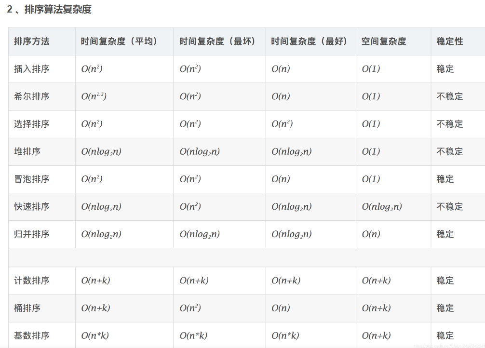

### [3. 无重复字符的最长子串](https://leetcode.cn/problems/longest-substring-without-repeating-characters/)

> 滑动窗口
>
> ```js
> var lengthOfLongestSubstring = function(s) {
>        let window = {};
>        let left = 0, right = 0;
>        let res = 0;
>        while (right < s.length) {
>            let cur = s[right++];
>            window[cur] = (window[cur] || 0) + 1;
>            while (window[cur] > 1) {
>                let willRemove = s[left++];
>                window[willRemove]--;
>            }
>            res = Math.max(res, right - left);
>        }
>        return res;
> };
> ```

### [46. 全排列](https://leetcode.cn/problems/permutations/)

> 回溯专题
>
> ```js
> var permute = function(nums) {
>        let path = [];
>        let res = [];
>        let used = new Array(nums.length).fill(false);
>        const backtrack = path => {
>            if (path.length === nums.length) {
>                res.push(Array.from(path));
>            }
>            for (let i = 0; i < nums.length; i++) {
>                if (used[i]) {
>                    continue;
>                }
>                path.push(nums[i]);
>                used[i] = true;
>                backtrack(path);
>                path.pop();
>                used[i] = false;
>            }
>        }
>        backtrack(path);
>        return res;
> };
> ```

### [165. 比较版本号](https://leetcode.cn/problems/compare-version-numbers/)

> 双指针，时间复杂度：O(n+m)，空间复杂度：O(1)
>
> charCodeAt() 方法可返回指定位置的字符的Unicode 编码，返回值是0 - 65535 之间的整数
>
> ps:赋值那里`x * 10 + version1[i].charCodeAt() - '0'.charCodeAt()`;，乘以10是为了进位，减去`'0'.charCodeAt()`是为了消除前导0的影响。
>
> ```js
> // 双指针解法
> var compareVersion = function(version1, version2) {
>        let i = 0, j = 0;
>        let m = version1.length, n = version2.length;
>        while (i < m || j < n) {
>            let x = 0;
>            for (; i < m && version1[i] != '.'; i++) {     //-------一定要注意，判别条件要加上 i < m
>                x = x * 10 + version1[i].charCodeAt() - '0'.charCodeAt();
>            }
>            i++; // 跳过'.'
>            let y = 0;
>            for (; j < n && version2[j] != '.'; j++) {
>                y = y * 10 + version2[j].charCodeAt() - '0'.charCodeAt();
>            }
>            j++;
>            if (x !== y) {
>                return x > y ? 1 : -1;
>            }
>        }
>        return 0;
> };
> ```
>
> 解法2，时间复杂度：O(n+m),空间复杂度：O(n+m)
>
> ```js
> var compareVersion = function(version1, version2) {
>        let arr1 = version1.split('.');
>        let arr2 = version2.split('.');
>        for (let i = 0; i < arr1.length || i < arr2.length; i++) {
>            let x = 0, y = 0;
>            if (i < arr1.length) {
>                x = parseInt(arr1[i]);
>            }
>            if (i < arr2.length) {
>                y = parseInt(arr2[i]);
>            }
>            if (x !== y) {
>                return x > y ? 1 : -1;
>            }
>        }
>        return 0;
> };	
> ```
>

### 洗牌算法-对数组乱序输出

> https://github.com/ccforward/cc/issues/44
>
> 思路：**每次从未处理的数组中随机取一个元素，然后把该元素放到数组的尾部，即数组的尾部放的就是已经处理过的元素**，这是一种原地打乱的算法，每个元素随机概率也相等，时间复杂度从 Fisher 算法的 O(n2)提升到了 O(n)
>
> 1. 选取数组(长度n)中最后一个元素(arr[length-1])，将其与n个元素中的任意一个交换，此时最后一个元素已经确定
> 2. 选取倒数第二个元素(arr[length-2])，将其与n-1个元素中的任意一个交换
> 3. 重复第 1 2 步，直到剩下1个元素为止
>
> ```js
> function shuffle(arr) {
>     let len = arr.length, random;
>     while (len) {
>         random = Math.floor(Math.random() * len--);
>         [arr[len], arr[random]] = [arr[random], arr[len]];
>     }
>     return arr;
> }
> console.log(shuffle([1, 2, 3, 4, 5])); // [ 5, 1, 4, 2, 3 ]
> ```
>
> ```js
> function shuffle(arr) {
>     let n = arr.length, random;
>     while (0 != n) {
>         random =  (Math.random() * n--) >>> 0; // 无符号右移位运算符向下取整
>         [arr[n], arr[random]] = [arr[random], arr[n]] // ES6的结构赋值实现变量互换
>     }
>     return arr;
> }
> ```
>
> > ps:>>>0 正数向下取整，https://www.cnblogs.com/mtl-key/p/13150674.html

### 912.排序数组-快排&归并 

> https://mp.weixin.qq.com/s/8ZTMhvHJK_He48PpSt_AmQ
>
> ps：加洗牌算法后，速度快了很多
>
> partition` 函数， `partition` 函数的作用是在 `nums[lo..hi]` 中寻找一个分界点 `p`，通过交换元素使得 `nums[lo..p-1]` 都小于等于 `nums[p]`，且 `nums[p+1..hi]` 都大于 `nums[p]，总结来讲，`partition` 函数干的事情，其实就是把 `nums[p]` 这个元素排好序。



> #### 快排实现
>
> > *快速排序的最坏运行情况是 O(n²)，比如说顺序数列的快排。但它的平摊期望时间是 O(nlogn)，且 O(nlogn) 记号中隐含的常数因子很小，比复杂度稳定等于 O(nlogn) 的归并排序要小很多。所以，对绝大多数顺序性较弱的随机数列而言，快速排序总是优于归并排序。*
>
> ```js
> var sortArray = function(nums) {
>     // 洗牌算法，最大限度避免极端情况
>     shuffle(nums);
>     quickSort(nums, 0, nums.length - 1);
>     return nums;
> };
> 
> function quickSort(nums, low, high) {
>     if (low >= high) {
>         return;
>     }
>     // 对 nums[low..high] 进行切分
>     // 使得 nums[low..sureIndex] <= nums[sureIndex] < nums[sureIndex+1..high]
>     let sureIndex = partition(nums, low, high);
>     quickSort(nums, low, sureIndex - 1);
>     quickSort(nums, sureIndex + 1, high);
> }
> // 快排核心算法,对 nums[low..high] 进行切分
> function partition(nums, low, high) {
>     let i = low + 1, j = high;
>     let pivot = nums[low];
>     // 关于区间的边界控制需格外小心，稍有不慎就会出错
>     while (i <= j) {
>         while (i < high && nums[i] <= pivot) { // 注意！！！ 加 = // i往右走，直到指向大于pivot的元素，停止，等待交换
>             i++;
>         }
>         while (j > low && nums[j] > pivot) {   // j往左走，直到指向小于pivot的元素，停止，等待交换
>             j--;
>         }
>         if (i >= j) {                           // 此时j指向的是已经排好位置的索引
>             break;
>         }
>         [nums[i], nums[j]] = [nums[j], nums[i]];  // 交换i,j指向的元素，保证以pivot基准，左小右大
>     }
>     // 将 pivot(nums[low]) 放到合适的位置，即 pivot 左边元素较小，右边元素较大
>     [nums[j], nums[low]] = [nums[low], nums[j]];
>     return j;                                  
> }
> 
> // 洗牌算法 实现数组乱序  --- 优化，要不要都行
> function shuffle(nums) {
>     let len = nums.length, random;
>     while(len) {
>         random = Math.floor(Math.random() * len--);
>         [nums[len], nums[random]] = [nums[random], nums[len]];
>     }
> }
> ```
>
> #### 归并排序实现
>
> 归并排序是建立在归并操作上的一种有效，稳定的排序算法，该算法是采用分治法（Divide and Conquer）的一个非常典型的应用。 将已有序的子序列合并，得到完全有序的序列；即先使每个子序列有序，再使子序列段间有序。 若将两个有序表合并成一个有序表，称为二路归并。
>
> > https://leetcode.cn/problems/sort-an-array/solution/js-kuai-su-pai-xu-by-bertil-c3u4/
> >
> > https://labuladong.gitee.io/algo/2/21/41/
>
> ```js
> var sortArray = function(nums) {
>     const len = nums.length;
>     if (len < 2) {
>         return nums;
>     }
>     const middle = Math.floor(len / 2);
>     let left = nums.slice(0, middle);
>     let right = nums.slice(middle);
>     return merge(sortArray(left), sortArray(right));
> };
> 
> // 合并两个有序数组，放入left中返回，不开辟新空间
> function merge(left, right) {
>     // 接下来三个数字作为下标使用，下标从0开始的，要注意
>     let m = left.length - 1;
>     let n = right.length - 1;
>     let k = m + n + 1;
>     // 从尾部开始，将数组排序，放入left中 
>     while (k >= 0) {
>         if (n < 0 || left[m] > right[n]) {
>             left[k--] = left[m--]; // right遍历完 or left当前值大一些，就取left的值
>         } else {
>             left[k--] = right[n--] // 否则存放right的值
>         }
>     }
>     return left;
> }
> ```
>
> 时间复杂度：O(n log n)  空间复杂度：n(n)

### [215. 数组中的第K个最大元素](https://leetcode.cn/problems/kth-largest-element-in-an-array/)

> 利用快排的partition思想来寻找第k个最大元素
>
> * 在长度为n的排序数组中，第k大的数字的下标是n-k
> * 用快速排序的函数partition对数组分区，如果函数partition选取的中间值在分区之后的下标正好是n-k，分区后左边的的值都比中间值小，右边的值都比中间值大，即使整个数组不是排序的，中间值也肯定是第k大的数字
> * 如果函数partition选取的中间值在分区之后的下标大于n-k，那么第k大的数字一定位于中间值的左侧，于是再对中间值的左侧的子数组分区
> * 如果函数partition选择的中间值在分区之后的下标小于n-k，那么第k大的数字一定位于中间值的右侧，于是再对中间值的右侧的子数组分区
>
> ```js
> var findKthLargest = function(nums, k) {
>     let low = 0, high = nums.length - 1;
>     // 找到数组升序排列中，第k个最大元素的数组下标--我们所求目标值的数组下标
>     let targetIndex = nums.length - k;
>     while (low <= high) {
>         // 在 nums[low...high] 中选一个分界点
>         let index = partition(nums, low, high);
>         if (index > targetIndex) {
>             high = index - 1;
>         } else if (index < targetIndex) {
>             low = index + 1;
>         } else {
>             return nums[targetIndex];
>         }
>     }
>     return -1;
> };
> 
> function partition(nums, low, high) {
>     // 取第一个元素作为基准元素
>     let pivot = nums[low];
>     let i = low + 1, j = high;
>     while (i <= j) {
>         while (i < high && nums[i] <= pivot) {     // i往右走，直到指向大于pivot的元素，停止，等待交换
>             i++;
>         }
>         while (j > low && nums[j] > pivot) {       // j往左走，直到指向小于pivot的元素，停止，等待交换
>             j--;
>         }
>         if (i >= j) {                              // 此时j指向的是已经排好位置的索引
>             break;
>         }
>         [nums[i], nums[j]] = [nums[j], nums[i]];  // 交换i,j指向的元素，保证以pivot基准，左小右大
>     }
>     // 将pivot放到合适位置，即pivot左边元素较小，右边元素较大
>     [nums[low], nums[j]] = [nums[j], nums[low]]
>     return j;
> }
> ```

### [104. 二叉树的最大深度](https://leetcode.cn/problems/maximum-depth-of-binary-tree/)

> 分解问题思路的递归
>
> ```js
> var maxDepth = function(root) {
>        if (root === null) {
>            return 0;
>        }
>        const leftDepth = maxDepth(root.left);
>        const rightDepth = maxDepth(root.right);
>        return Math.max(leftDepth, rightDepth) + 1;
> };
> ```
>
> 回溯版思路的递归 遍历一遍的思路
>
> ```js
> var maxDepth = function(root) {
>        let res = 0;
>        let depth = 0;
>        const traverse = root => {
>            if (root === null) {
>                res = Math.max(res, depth);
>                return;
>            }
>            depth++;
>            traverse(root.left);
>            traverse(root.right);
>            depth--;
>        }
>        traverse(root);
>        return res;
> };
> ```

### [70. 爬楼梯](https://leetcode.cn/problems/climbing-stairs/)

> ```js
> var climbStairs = function(n) {
>        // dp[i]：到第i阶楼梯有dp[i]种方法
>        let dp = new Array(n).fill(0);
>        dp[1] = 1;
>        dp[2] = 2;
>        for (let i = 3; i <= n; i++) {
>            dp[i] = dp[i - 1] + dp[i - 2];
>        }
>        return dp[n];
> };
> ```
>
> - 时间复杂度：$O(n)$
> - 空间复杂度：$O(n)$
>
> 空间优化版本
>
> ```js
> var climbStairs = function(n) {
>     if (n <= 2) return n;
>     let dp_0 = 1;
>     let dp_1 = 2;
>     for (let i = 3; i <= n; i++) {
>         let sum = dp_1 + dp_0;
>         dp_0 = dp_1;
>         dp_1 = sum;
>     }
>     return dp_1;
> };
> ```

### [50. Pow(x, n)](https://leetcode.cn/problems/powx-n/)

> [思路](https://leetcode.cn/problems/powx-n/#)
>
> 难度中等1005
>
> 实现 [pow(*x*, *n*)](https://www.cplusplus.com/reference/valarray/pow/) ，即计算 `x` 的整数 `n` 次幂函数（即，`xn` ）。
>
>  
>
> **示例 1：**
>
> ```
> 输入：x = 2.00000, n = 10
> 输出：1024.00000
> ```

> #### 方法1，分治思想
>
> - 思路
>   - base case：n是0的 return 1
>   - n是负数，x的n次方 等于 1除以x的 -n 次方
>   - 当n是正偶数的时候，对n进行分治，拆解为`x*x`的`n/2`的次方
>   - 当n为正奇数的时候拆分成`x * myPow(x,n-1)`
> - 复杂度分析：时间复杂度：`O(logn)`， n是进行二进制拆分的时间复杂度。空间复杂度：`O(logn)`, n为递归深度
>
> ```js
> var myPow = function(x, n) {
>     if (n === 0) return 1; // base case
>     // 负数
>     if (n < 0) {
>         return 1 / myPow(x, -n);
>     }
>     // 正奇数
>     if (n % 2) {
>         return x * myPow(x, n - 1);
>     } else {
>         // 正偶数
>         return myPow(x * x, n / 2);
>     }
> };
> ```
>
> #### 二进制方法
>
> https://xiaochen1024.com/courseware/60b4f11ab1aa91002eb53b18/61964285c1553b002e57bf1a
>
> - 思路：对n的二进制不断右移动，判断n的二进制最后一位是否是1， 如果是1则将结果乘以x。
> - 复杂度分析：时间复杂度`O(logn)`： n为对 n 进行二进制拆分的时间复杂度，空间复杂度`O(1)`
>
> ```js
> var myPow = function (x, n) {
>     if (n < 0) {
>         x = 1 / x;
>         n = -n;
>     }
>     let result = 1;
>     while (n) {
>         if (n & 1) result *= x;  //判断n的二进制最后一位是否是1， 如果是1则将结果乘以x
>         x *= x;
>         n >>>= 1; //进行无符号右移1位，此处不能使用有符号右移（>>）
>     }
>     return result;
> }
> ```

### [26. 删除有序数组中的重复项](https://leetcode.cn/problems/remove-duplicates-from-sorted-array/)

> 双指针-快慢指针
>
> ```js
> var removeDuplicates = function(nums) {
>        let slow = 0, fast = 0;
>        while (fast < nums.length) {
>            if (nums[fast] !== nums[slow]) {
>                slow++;
>                nums[slow] = nums[fast];
>            }
>            fast++;
>        }
>        return nums.length = slow + 1;
> };
> ```
>
> > ps：为什么返回值 slow要+1，举个极端例子，nums=[0]时，不会进入if循环，slow为0，但数组长度为1

### [剑指 Offer 29. 顺时针打印矩阵](https://leetcode.cn/problems/shun-shi-zhen-da-yin-ju-zhen-lcof/)

> 模拟法，上，右，下，左，同时注意边界条件
>
> ```js
> var spiralOrder = function(matrix) {
>        if (matrix.length === 0) return [];
>        const m = matrix.length, n = matrix[0].length;
>        let top = 0, right = n - 1;
>        let bottom = m - 1, left = 0;
>        let res = [];
>        while (res.length < m * n) {
>            if (top <= bottom) {
>                for (let i = left; i <= right; i++) {
>                    res.push(matrix[top][i]);
>                }
>                top++;
>            }
>            if (left <= right) {
>                for (let i = top; i <= bottom; i++) {
>                    res.push(matrix[i][right]);
>                }
>                right--;
>            }
>            if (top <= bottom) {
>                for (let i = right; i >= left; i--) {
>                    res.push(matrix[bottom][i]);
>                }
>                bottom--;
>            }
>            if (left <= right) {
>                for (let i = bottom; i >= top; i--) {
>                    res.push(matrix[i][left]);
>                }
>                left++;
>            }
>        }
>        return res;
> };
> ```

### [88. 合并两个有序数组](https://leetcode.cn/problems/merge-sorted-array/)

> 一定要从尾向头开始合并！！！因为从头开始，会覆盖原本的元素
>
> ```js
> var merge = function(nums1, m, nums2, n) {
>        let k = m + n - 1;
>        m--;
>        n--;
>        while (k >= 0) {
>            if (n < 0) {
>                nums1[k--] = nums1[m--];
>            } else if (m < 0) {
>                nums1[k--] = nums2[n--];
>            } else if (nums1[m] > nums2[n]) {
>                nums1[k--] = nums1[m--];
>            } else {
>                nums1[k--] = nums2[n--];
>            }
>        }
>        return nums1;
> };
> ```
>
> #### 简单写法-逻辑合并了
>
> ```js
> var merge = function(nums1, m, nums2, n) {
>        let k = m + n - 1;
>        m--;
>        n--;
>        while (k >= 0) {
>            if (n < 0 || nums1[m] > nums2[n]) {
>                nums1[k--] = nums1[m--];
>            } else {
>                nums1[k--] = nums2[n--];
>            }
>        }
>        return nums1;
> };
> ```

### [剑指 Offer 10- II. 青蛙跳台阶问题](https://leetcode.cn/problems/qing-wa-tiao-tai-jie-wen-ti-lcof/)

> ```js
> var numWays = function(n) {
>        if (n === 0) return 1;
>        const mode = 1000000007;
>        let dp = new Array(n).fill(0);
>        dp[1] = 1;
>        dp[2] = 2;
>        for (let i = 3; i <= n; i++) {
>            dp[i] = (dp[i - 1] + dp[i - 2]) % mode;
>        }
>        return dp[n];
> };
> ```
>
> 状态压缩
>
> ```js
> var numWays = function(n) {
>        if (n === 0 || n === 1) return 1;
>        const mode = 1000000007;
>        let dp_0 = 1;
>        let dp_1 = 2;
>        for (let i = 3; i <= n; i++) {
>            let sum = (dp_0 + dp_1) % mode;
>            dp_0 = dp_1;
>            dp_1 = sum;
>        }
>        return dp_1;
> };
> ```

### [1143. 最长公共子序列](https://leetcode.cn/problems/longest-common-subsequence/)

> dp，详见dp章节
>
> ```js
> var longestCommonSubsequence = function(text1, text2) {
>        // dp[i][j]：text1长度为[0, i - 1]，text2长度为[0, j - 1]时，最长公共子序列的长度
>        let dp = new Array(text1.length + 1).fill(0).map(() => new Array(text2.length + 1).fill(0));
>        // 初始化
>        // 递推公式
>        let res = 0;
>        for (let i = 1; i <= text1.length; i++) {
>            for (let j = 1; j <= text2.length; j++) {
>                if (text1[i - 1] === text2[j - 1]) {
>                    dp[i][j] = dp[i - 1][j - 1] + 1;
>                } else {
>                    dp[i][j] = Math.max(dp[i][j - 1], dp[i - 1][j]);
>                }
>                res = Math.max(dp[i][j], res);
>            }
>        }
>        return res;
> };
> ```

### [234. 回文链表](https://leetcode.cn/problems/palindrome-linked-list/)

> * 双指针快慢找到中间节点，偶数时，找到第二个中间节点，如果为奇数个节点，slow需要再前进一步-也可以不前进
>   * 奇数时，slow指向中间节点，偶数时，slow指向中间第一个节点
>   * 奇数时，不前进也是可以的
>     * 比如说 1->2->1  前进反转之后，left为1->2   right为1->2  
>     * 1->2->2->1 反转之后，left为1->2->2   right为2->1 ，但是终止条件是right===null，所以left虽然多了一个，但是不影响判断
> * 反转后半部分链表
> * 比较左右链表
>
> ```js
> var isPalindrome = function(head) {
>     let slow = head, fast = head;
>     while (fast !== null && fast.next !== null) {
>         fast = fast.next.next;
>         slow = slow.next;
>     }
>     let left = head, right = reverse(slow);
>     while (right) {
>         if (left.val !== right.val) {
>             return false;
>         }
>         left = left.next;
>         right = right.next;
>     }
>     return true;
> };
> 
> function reverse(head) {
>     let pre = null, cur = head, tmp = null;
>     while (cur) {
>         tmp = cur.next;
>         cur.next = pre;
>         pre = cur;
>         cur = tmp;
>     }
>     return pre;
> }
> 
> ```

### [15. 三数之和](https://leetcode.cn/problems/3sum/)

> ```js
> var threeSum = function(nums) {
>        nums.sort((a, b) => a - b);
>        let res = [];
>        for (let i = 0; i < nums.length; i++) {
>            let twoSum = twoS(nums, i + 1, 0 - nums[i]);
>            for (let arr of twoSum) {
>                arr.push(nums[i]);
>                res.push(arr);
>            }
>            while (i < nums.length - 1 && nums[i] === nums[i + 1]) i++;
>        }
>        return res;
> };
> 
> function twoS(nums, start, target) {
>        let left = start, right = nums.length - 1;
>        let res = [];
>        while (left < right) {
>            const res1 = nums[left], res2 = nums[right];
>            const sum = res1 + res2;
>            if (sum > target) {
>                right--;
>            } else if (sum < target) {
>                left++;
>            } else {
>                res.push([res1, res2]);
>                while (left < right && nums[left] === res1) left++;
>                while (left < right && nums[right] === res2) right--;
>            }
>        }
>        return res;
> }
> ```

### [16. 最接近的三数之和](https://leetcode.cn/problems/3sum-closest/)

> ```js
> var threeSumClosest = function(nums, target) {
>        let res = Infinity;
>        nums.sort((a, b) => a - b);
>        for (let i = 0; i < nums.length; i++) {
>            let left = i + 1, right = nums.length - 1;
>            while (left < right) {
>                let sum = nums[i] + nums[left] + nums[right];
>                if (Math.abs(sum - target) < Math.abs(res - target)) {
>                    res = sum;
>                }
>                if (sum > target) {
>                    right--;
>                } else if (sum < target) {
>                    left++;
>                } else {
>                    return sum;
>                }
>            }
>        }
>        return res;
> };
> ```

### [剑指 Offer 04. 二维数组中的查找](https://leetcode.cn/problems/er-wei-shu-zu-zhong-de-cha-zhao-lcof/)

> ```js
> var findNumberIn2DArray = function(matrix, target) {
>        const m = matrix.length, n = matrix[0]?.length; // ?. 可选链操作符，不必验证有效
>        let row = 0, col = n - 1;
>        while (row <= m - 1 && col >= 0) {
>            const num = matrix[row][col]; // 以右上角元素为基准
>            if (num > target) {
>                col--;
>            } else if (num < target) {
>                row++;
>            } else {
>                return true;
>            }
>        }
>        return false;
> };
> ```

### [470. 用 Rand7() 实现 Rand10()](https://leetcode.cn/problems/implement-rand10-using-rand7/)

> https://leetcode.cn/problems/implement-rand10-using-rand7/solution/zhe-yi-lei-ti-de-tong-yong-fang-fa-bu-ka-cuqu/
>
> ```js
> 
> ```

### [148. 排序链表](https://leetcode.cn/problems/sort-list/)-归并排序

> https://leetcode.cn/problems/sort-list/solution/dai-ma-jian-ji-de-jie-fa-jsban-ben-by-it-rids/

> ```js
> var sortList = function(head) {
>        if (head === null || head.next === null) return head;
>        // 快慢指针找出链表中间节点，若偶数个节点，返回第1个中间节点
>        let fast = head.next, slow = head; // 注意fast和slow的赋值
>        while (fast && fast.next) {
>            fast = fast.next.next;
>            slow = slow.next;
>        }
>        // 分割左右链表
>        let rightList = slow.next;
>        slow.next = null;
>        let left = head; // 左边链表
>        let right = rightList; // 右边链表，取原链表中间的第二个节点为队头
>        // 继续分割到只有一个时，传入合并方法Merge
>        return merge(sortList(left), sortList(right));
> };
> 
> // 合并两个有序链表
> function merge(list1, list2) {
>        let dummy = new ListNode(-1, null);
>        let p = dummy;
>        while (list1 && list2) {
>            if (list1.val < list2.val) {
>                p.next = list1;
>                list1 = list1.next;
>            } else {
>                p.next = list2;
>                list2 = list2.next;
>            }
>            p = p.next;
>        }
>        // 最后把没有遍历完的拼接上去
>        p.next = list1 ? list1 : list2;
>        return dummy.next;
> }
> ```

### [41. 缺失的第一个正数](https://leetcode.cn/problems/first-missing-positive/)

> https://xiaochen1024.com/courseware/60b4f11ab1aa91002eb53b18/6196d3adc1553b002e57bf2a
>
> 思路：将所有元素按照 `下标0放1，下标1放2，下标2放3 ...` 这种规律，然后找到第一个没有按这种规律的，就是要找的了。
>
> * 循环nums，如果当前元素在(0, nums.length]之间，并且nums[nums[i] - 1] !== nums[i]，则交换位置
>
>   > ps：当nums[nums[i] - 1] === nums[i]，时，说明 1 在nums[0] 上，2 在nums[1] 上，意思是说，元素在他该在的位置，反过来不相等就是在他不该在的位置，那么就要交换位置了
>
> * 然后循环交换位置之后的数组，判断第一个缺失的数组
> * 如果数组本身是 [1, 2, 3, 4]这种，那么就要返回 nums.length + 1;
> * 复杂度：时间复杂度`O(n)`，空间复杂度`O(1)`
>
> ##### 注意！！！ 不能用解构赋值交换元素，会陷入死循环，比如输入 [3, 4, -1, 1]
>
> ```js
> var firstMissingPositive = function(nums) {
>     // 判断当前元素是否在它该在的位置上，比如 [1, 2, 3]，要尽量这种
>     for (let i = 0; i < nums.length; i++) {
>         while (nums[i] > 0 && nums[i] <= nums.length && nums[i] !== nums[nums[i] - 1]) {
>             const temp = nums[nums[i]-1]; // 不要用解构赋值
>             nums[nums[i]-1] = nums[i];
>             nums[i] = temp;
>         }
>     }
>     // 循环交换位置之后的数组，判断第一个缺失的正数
>     for (let i = 0; i < nums.length; i++) {
>         if (nums[i] !== i + 1) {
>             return i + 1;
>         }
>     }
>     return nums.length + 1;
> };
> ```
>
> 
>
> 
>
> 没看懂：https://leetcode.cn/problems/first-missing-positive/solution/dai-ma-jian-ji-de-jie-fa-jsban-ben-by-it-pe3n/
>
> ```js
> var firstMissingPositive = function(nums) {
>     for (let num of nums) {
>         if (typeof nums[+num - 1] !== 'undefined') {
>             nums[+num - 1] = '' + nums[+num - 1];
>         }
>     }
>     for (let i = 0; i < nums.length; i++) {
>         if (typeof nums[i] === 'number') {
>             return i + 1;
>         }
>     }
>     return nums.length + 1;
> };
> ```
>

### [53. 最大子数组和](https://leetcode.cn/problems/maximum-subarray/)

> dp
>
> ```js
> var maxSubArray = function(nums) {
>        // dp[i]：下标范围[0, i]元素的最大子数组和为 dp[i]
>        let dp = new Array(nums.length).fill(0);
>        dp[0] = nums[0];
>        for (let i = 1; i < nums.length; i++) {
>            dp[i] = Math.max(dp[i - 1] + nums[i], nums[i]);
>        }
>        // 注意返回值，返回dp里面的最大值
>        return Math.max(...dp);
> };
> ```
>

### [673. 最长递增子序列的个数](https://leetcode.cn/problems/number-of-longest-increasing-subsequence/)

> ```js
> var findNumberOfLIS = function(nums) {
>        // dp[i]：i之前（包括i）最长递增子序列的长度为dp[i]
>        // count[i]：以nums[i]为结尾的字符串，最长递增子序列的个数为count[i]
>        let dp = new Array(nums.length).fill(1);
>        let count = new Array(nums.length).fill(1);
>        for (let i = 1; i < nums.length; i++) {
>            for (let j = 0; j < i; j++) {
>                if (nums[i] > nums[j]) {
>                    if (dp[i] < dp[j] + 1) {
>                        dp[i] = dp[j] + 1;
>                        count[i] = count[j];
>                    } else if (dp[i] === dp[j] + 1) {
>                        count[i] += count[j];
>                    }
>                }
>            }
>        }
>        let maxLen = Math.max(...dp); // 找出最长递增子序列的长度
>        let res = 0;
>        for (let i = 0; i < nums.length; i++) {
>            if (maxLen === dp[i]) { // 看dp里面有多少个 maxLen
>                res += count[i]; // maxLen出现的次数存储在 对应count[i] 中，都找出来加上去
>            }
>        }
>        // 找到最长递增子序列的长度
>        return res;
> };
> ```
>
> ps：找到res的过程不好理解，举例，比如 
>
> 输入为   [ 1, 3, 5, 4, 7 ]
>
> dp为    [ 1, 2, `3`, `3`, 4 ]
>
> count为  [ 1, 1, `1`, `1`, 2 ]    => 所以找出所有dp中 3 对应的 1 ，相加为 2

### [509. 斐波那契数](https://leetcode.cn/problems/fibonacci-number/)

> dp
>
> ```js
> var fib = function(n) {
>        if (n === 0 || n === 1) return n;
>        let dp = new Array(n + 1).fill(0);
>        dp[0] = 0;
>        dp[1] = 1;
>        for (let i = 2; i <= n; i++) {
>            dp[i] = dp[i - 1] + dp[i - 2];
>        }
>        return dp[n];
> };
> ```
>
> dp-空间压缩
>
> ```js
> var fib = function(n) {
>        if (n === 0 || n === 1) return n;
>        dp_0 = 0;
>        dp_1 = 1;
>        for (let i = 2; i <= n; i++) {
>            let sum = dp_0 + dp_1;
>            dp_0 = dp_1;
>            dp_1 = sum;
>        }
>        return dp_1;
> };
> ```

### [剑指 Offer 10- I. 斐波那契数列](https://leetcode.cn/problems/fei-bo-na-qi-shu-lie-lcof/)

> dp
>
> ```js
> var fib = function(n) {
>        if (n === 0 || n === 1) return n;
>        const MODE = 1000000007;
>        let dp = new Array(n + 1).fill(0);
>        dp[0] = 0;
>        dp[1] = 1;
>        for (let i = 2; i <= n; i++) {
>            dp[i] = (dp[i - 1] + dp[i - 2]) % MODE;
>        }
>        return dp[n];
> };
> ```
>
> 空间压缩
>
> ```js
> var fib = function(n) {    
>        if (n === 0 || n === 1) return n;
>        const MODE = 1000000007;
>        dp_0 = 0;
>        dp_1 = 1;
>        for (let i = 2; i <= n; i++) {
>            let sum = (dp_0 + dp_1) % MODE;
>            dp_0 = dp_1;
>            dp_1 = sum;
>        }
>        return dp_1;
> };
> ```

### [5. 最长回文子串](https://leetcode.cn/problems/longest-palindromic-substring/)

> 双指针
>
> ```js
> var longestPalindrome = function(s) {
>        let res = '';
>        for (let i = 0; i < s.length; i++) {
>            let res1 = palindRome(s, i, i);
>            let res2 = palindRome(s, i, i + 1);
>            res = res.length > res1.length ? res : res1;
>            res = res.length > res2.length ? res : res2;
>        }
>        return res;
> };
> 
> // 返回以 left, right 为中间点的最长回文串
> function palindRome(s, i, j) {
>        let left = i, right = j;
>        while (left >= 0 && right <= s.length - 1) { // 左右判断逻辑保持一致
>            if (s[left] === s[right]) {
>                left--;
>                right++;
>            } else {
>                break;
>            }
>        }
>        return s.slice(left + 1, right); // slice是左闭右开
> }
> ```

### [20. 有效的括号](https://leetcode.cn/problems/valid-parentheses/)

> 栈的应用
>
> ```js
> var isValid = function(s) {
>        let map = {
>            '[': ']',
>            '(': ')',
>            '{': '}',
>        };
>        let stack = [];
>        for (let a of s) {
>            if (a === '[' || a === '(' || a === '{') {
>                stack.push(a);
>            } else {
>                if (map[stack[stack.length - 1]] === a) {
>                    stack.pop();
>                } else {
>                    return false;
>                }
>            }
>        }
>        return !stack.length;
> };
> ```

### [141. 环形链表](https://leetcode.cn/problems/linked-list-cycle/)

> 快慢指针
>
> ```js
> var hasCycle = function(head) {
>        let slow = head, fast = head;
>        while (fast && fast.next) {
>            fast = fast.next.next;
>            slow = slow.next;
>            if (fast === slow) {
>                return true;
>            }
>        }
>        return false;
> };
> ```

### [1. 两数之和](https://leetcode.cn/problems/two-sum/)

> ```js
> var twoSum = function(nums, target) {
>        let map = {};
>        for (let i = 0; i < nums.length; i++) {
>            if (map[target - nums[i]]!== undefined) {
>                return [i, map[target - nums[i]]];
>            } else {
>                map[nums[i]] = i;
>            }
>        }
> };
> ```

### [剑指 Offer 25. 合并两个排序的链表](https://leetcode.cn/problems/he-bing-liang-ge-pai-xu-de-lian-biao-lcof/)

> 双指针
>
> ```js
> var mergeTwoLists = function(l1, l2) {
>        const dummy = new ListNode(-1, null);
>        let p = dummy;
>        while (l1 && l2) {
>            if (l1.val <= l2.val) {
>                p.next = l1;
>                l1 = l1.next;
>            } else {
>                p.next = l2;
>                l2 = l2.next;
>            }
>            p = p.next;
>        }
>        p.next = l1 || l2; // 注意！！！是 p.next
>        return dummy.next;
> };
> ```

