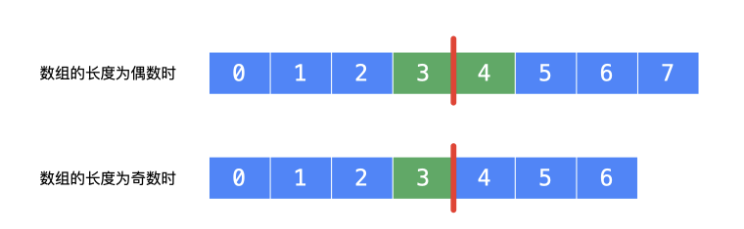
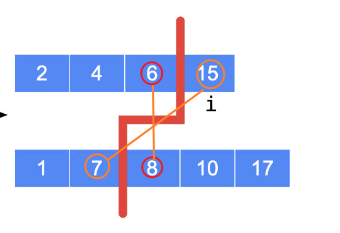
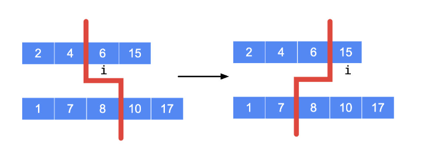
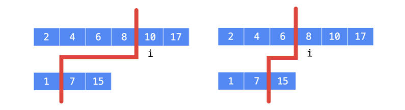
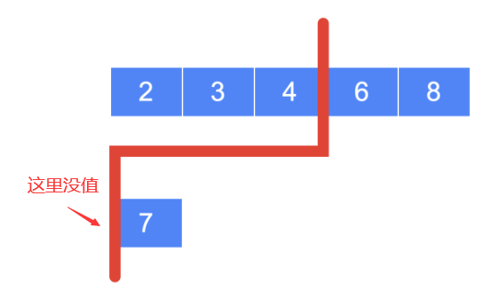
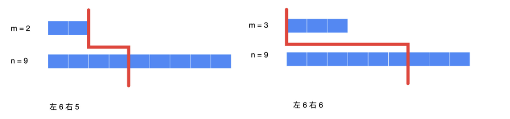
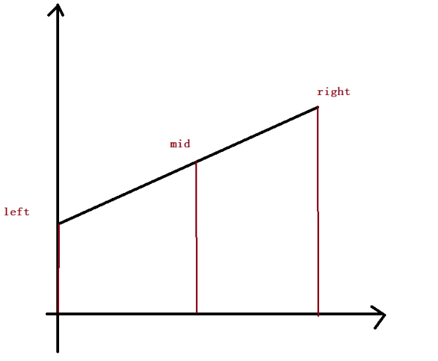
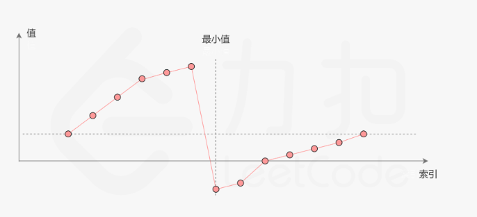
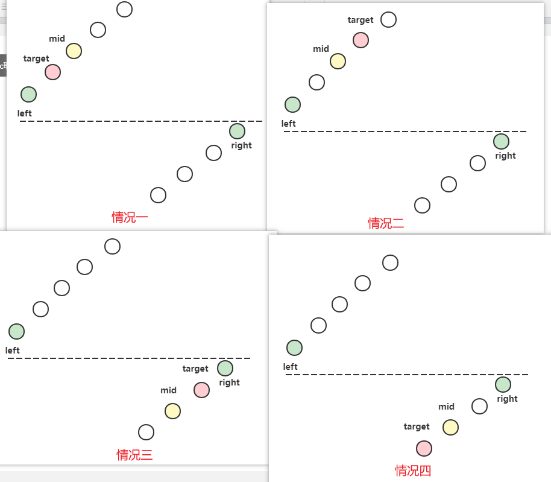

 

### 写在前面 二分法

* 二分法的重点不是单调性，单调性的可以从二分法思考，但是二分法也可以用来做非单调性的。

* 二分法的本质是找到边界

力扣二分查找详解：

**https://leetcode-cn.com/problems/search-insert-position/solution/te-bie-hao-yong-de-er-fen-cha-fa-fa-mo-ban-python-/**

二分法算法模板:

*  找出左边界，查找数组左边起第一个小于等于target的数组下标  
*  区间[l, r]被划分成[l, mid]和[mid + 1, r]时使用：

```js
function check(x) {} // 检查x是否满足某种性质

var binarySearch1 = function(nums, target) {
    let left = 0;
    let right = nums.length - 1;
    while (left < right) {  // 表示当 left 与 right 重合的时候，搜索终止
        // let mid = left + Math.floor((right - left) / 2);
        let mid = (left + right) >> 1;
        if (check(mid)) {
            right = mid;
        } else {
            left = mid + 1;
        }
    }
    return nums[left] === target ? left : -1;
}
```

* 找出右边界，查找数组右边起第一个小于等于target的数组下标
  区间[l, r]被划分成[l, mid - 1]和[mid, r]时使用

```js
var binarySearch2 = function(nums, target) {
    let left = 0;
    let right = nums.length - 1;
    while (left < right) {
        let mid = (right + left + 1) >> 1; // 注意这里要 +1
        if (check(mid)) {
            left = mid;
        } else {
            right = mid - 1;
        }
    }
    if (nums[left] !== target) return -1;
    return left;
}
```

### [704. 二分查找](https://leetcode.cn/problems/binary-search/)

给定一个 `n` 个元素有序的（升序）整型数组 `nums` 和一个目标值 `target` ，写一个函数搜索 `nums` 中的 `target`，如果目标值存在返回下标，否则返回 `-1`。
**示例 1:**

```
输入: nums = [-1,0,3,5,9,12], target = 9
输出: 4
解释: 9 出现在 nums 中并且下标为 4
```

左边界法：

```js
// 左边界,查找数组左边起第一个大于等于target的数组下标 
var search = function(nums, target) {
    let left = 0;
    let right = nums.length - 1;
    while (left < right) {
        let mid = (left + right) >> 1;
        if (nums[mid] >= target) {
            right = mid;
        } else {
            left = mid + 1;
        }
    }
    // 如果 target 不在数组里，此时 l === r
	// target大于数组最大值时，l==r==nums.length-1(如果第四行 right == nums.length,则此时为nums.length)
	// target小于数组最小值时，l==r==0  
    if(nums[left] !== target) return -1;
    return left;
}
```

右边界法:

```js
 // 右边界，查找数组右边起第一个小于等于target的数组下标
var search = function(nums, target) {
    let left = 0, right = nums.length - 1;
    while (left < right) {
        // 需要注意的是，这里的mid需要加1因为是向下取整,
        // 当循环走到 l==r-1 时,如果不加1，执行:
        // l=mid=(r-1+r)/2=r-1/2=r-1（向下取整）
        // 那么l的值还是为r-1，没有改变，陷入死循环。
        // let mid = left + Math.floor((right - left + 1)/2)
        let mid = (right + left + 1) >> 1;
        if(nums[mid] <= target) {
            left = mid;
        } else {
            right = mid - 1;
        }
    }
    if(nums[left] !== target) return -1;
    return left;
};
```

### [35. 搜索插入位置](https://leetcode.cn/problems/search-insert-position/)

给定一个排序数组和一个目标值，在数组中找到目标值，并返回其索引。如果目标值不存在于数组中，返回它将会被按顺序插入的位置。

请必须使用时间复杂度为 `O(log n)` 的算法。

**示例 1:**

```
输入: nums = [1,3,5,6], target = 5
输出: 2
```


```js
//右边界
var searchInsert = function(nums, target) {
    // //排除小于整个数组的情况
    if(nums[0] > target) return 0;
    let l = 0, r = nums.length - 1;
    //查找右边起第一个小于等于target的下标
    while(l < r) {
        let mid = (l + r + 1) >> 1;
        if(nums[mid] <= target) {
            l = mid;
        } else {
            r = mid - 1;
        }
    }
    return nums[l]===target? l : l+1;

};
```

```js
// 左边界
var searchInsert = function(nums, target) {
    //排除大于整个数组的情况
    if(nums[nums.length-1] < target) return nums.length;
    let l = 0, r = nums.length - 1;
    //查找第一个大于等于target的下标
    while(l < r) {
        let mid = (l + r) >> 1;
        if(nums[mid] >= target) {
            r = mid;
        } else {
            l = mid + 1;
        }
    }
    return l;

};
```

> 鉴于 `len` 也有可能是答案，可以在初始化的时候，把 `right` 设置成 `len`，在一开始的时候就不需要特殊判断了。
>
> ```js
> var searchInsert = function(nums, target) {
>     let left = 0;
>     let right = nums.length;
>     while (left < right) {
>         const mid = left + Math.floor((right - left) / 2);
>         if (nums[mid] >= target) {
>             right = mid;
>         } else {
>             left = mid + 1;
>         }
>     }
>     return left;
> };
> ```
>
> 

### [34. 在排序数组中查找元素的第一个和最后一个位置](https://leetcode.cn/problems/find-first-and-last-position-of-element-in-sorted-array/)

给你一个按照非递减顺序排列的整数数组 `nums`，和一个目标值 `target`。请你找出给定目标值在数组中的开始位置和结束位置。

如果数组中不存在目标值 `target`，返回 `[-1, -1]`。

你必须设计并实现时间复杂度为 `O(log n)` 的算法解决此问题。

 

**示例 1：**

```
输入：nums = [5,7,7,8,8,10], target = 8
输出：[3,4]
```

```js
给定一个按照升序排列的整数数组 nums，和一个目标值 target。找出给定目标值在数组中的开始位置和结束位置。

如果数组中不存在目标值 target，返回 [-1, -1]。

链接：https://leetcode-cn.com/problems/find-first-and-last-position-of-element-in-sorted-array
```

```js
var searchRange = function(nums, target) {
    //查找左边界：第一个大于等于target的数组下标
    const binarySearch1 = (nums, target) => {
        let l = 0, r = nums.length - 1;
        while(l < r) {
            let mid = (l + r) >> 1;
            if(nums[mid] >= target){
                r = mid;
            } else {
                l = mid + 1;
            }
        }
        if(nums[l] !== target) return -1;
        return l;
    }
    //查找右边界，第一个小于等于target的数组下标
    const binareSearch2 = (nums, target) => {
        let l = 0, r = nums.length - 1;
        while(l < r) {
            let mid = (l + r + 1) >> 1; 
            if(nums[mid] <= target) {
                l = mid;
            } else {
                r = mid - 1
            }
        }
        if(nums[l] !== target) return -1;
        return l;
    }
    const l = binarySearch1(nums, target);
    const r = binareSearch2(nums, target);
    return [l, r]
};
```


### [69. x 的平方根 ](https://leetcode.cn/problems/sqrtx/)

给你一个非负整数 `x` ，计算并返回 `x` 的 **算术平方根** 。

由于返回类型是整数，结果只保留 **整数部分** ，小数部分将被 **舍去 。**

**注意：**不允许使用任何内置指数函数和算符，例如 `pow(x, 0.5)` 或者 `x ** 0.5` 。

 

**示例 1：**

```
输入：x = 4
输出：2
```

```js
给你一个非负整数 x ，计算并返回 x 的 算术平方根 。

由于返回类型是整数，结果只保留 整数部分 ，小数部分将被 舍去 。

注意：不允许使用任何内置指数函数和算符，例如 pow(x, 0.5) 或者 x ** 0.5 。

链接：https://leetcode-cn.com/problems/sqrtx
```

用右边界，找右边第一个`平方小于等于x`的，

左边界不合适，它是大于等于，最后还需要判断一下,（判断是大于还是等于，比如当x=8，左边界找的话，找到2之后，2的平方是4,3的平方是9，这个时候就需要判断）

`注意！！！ 不能写成mid = (l+r+1)>>1，会计算出负值` 原因暂且不明

```js
var mySqrt = function(x) {
    let l = 0, r = x;
    while (l < r) {
        let mid = l + Math.floor((r - l + 1) / 2)
        if(mid ** 2 <= x) {
            l = mid;
        } else{
            r = mid - 1;
        }
    }
    return l;
};
```

### [367. 有效的完全平方数](https://leetcode.cn/problems/valid-perfect-square/)

给定一个 **正整数** `num` ，编写一个函数，如果 `num` 是一个完全平方数，则返回 `true` ，否则返回 `false` 。

**进阶：不要** 使用任何内置的库函数，如 `sqrt` 。

 

**示例 1：**

```
输入：num = 16
输出：true
```

完全平方数：一个数能表示成某个整数的平方的形式

```js
var isPerfectSquare = function(num) {
    let left = 0, right = num;
    while(left < right){
        const mid = left + Math.floor((right - left + 1) / 2);
        //用右边界，找小于等于目标值
        if(mid ** 2 <= num) {
            left = mid;
        } else {
            right = mid - 1;
        }
    }
    if(left ** 	2 === num) return true;
    return false;
};
```

### [4. 寻找两个正序数组的中位数](https://leetcode.cn/problems/median-of-two-sorted-arrays/)-难题

给定两个大小分别为 `m` 和 `n` 的正序（从小到大）数组 `nums1` 和 `nums2`。请你找出并返回这两个正序数组的 **中位数** 。

算法的时间复杂度应该为 `O(log (m+n))` 。

**示例 1：**

```js
输入：nums1 = [1,3], nums2 = [2]
输出：2.00000
```

> ### 二分法
>
> https://leetcode.cn/problems/median-of-two-sorted-arrays/solution/he-bing-yi-hou-zhao-gui-bing-guo-cheng-zhong-zhao-/
>
> 来一步步分析
>
> ### 1. 只有一个有序数组的时候中位数的性质
>
> 从中位数的定义出发。根据暴力法的分析，在`只有一个有序数组`的时候：
>
> * 如果数组的元素个数是`偶数`，此时我们可以想象有一条分界线，把数组分成两个部分，中位数就是介于这个分界线两边的两个元素的平均值；
>
> * 如果数组的元素个数是`奇数`，此时我们也可以想象有一条分界线，把数组分成两个部分，此时我们让分割线左边多一个元素，此时分割线的左边的那个元素就是这个有序数组的中位数。
>
>   
>
> ### 2. 两个有序数组的时候中位数的性质
>
> 接下来看两个有序数组的时候，依然可以用这种画分界线的方式来找中位数。这条`分割线的特点`是：
>
> * 当数组的`总长度为偶数`的时候，分割线左右的数字个数总和相等；
> * 当数组的`总长度为奇数`的时候，分割线左数字个数比右边仅仅多 1；
> * 分割线左边的所有元素都小于等于（`不大于`）分割线右边的所有元素。
>
> > ps：那么问题来了，如何根据分割线求中位数呢？看下方讲解
>
> 如果这条分割线可以找到，那么中位数就可以确定下来，同样得分奇偶性：
>
> * 当数组的`总长度为偶数`的时候，中位数就是`分割线左边的最大值与分割线右边的最小值的平均数`；
> * 当数组的`总长度为奇数`的时候，中位数就是`分割线左边的最大值`。
> * 因此，在`数组长度是奇数`的时候，中位数就是分割线左边的所有数的最大值。
>
> >  ps:这就是我们让分割线左边在整个数组长度是奇数的时候，多 1 个数的原因。即：让引入分割线定义的中位数在 1 个数组和 2 个数组的时候统一起来。
>
> 因为两个数组本别是有序数组，因此，我们只需要判定`交叉的关系`中，`是否满足左边依然小于等于右边`即可，即
>
> 第1个数组分割线 左边的第1个数 小于等于 第2个数组分割线 右边的第1个数；
> 第2个数组分割线 左边的第1个数 小于等于 第1个数组分割线 右边的第1个数。
>
> 示例如图：
>
> 
>
> ### 3. 通过不断缩减搜索区间确定分割线的位置
>
> 接下来，我们就来看一下分割线怎么割，需要在第 1 个数组上划一刀，再在第 2 个数组上划一刀。
>
> 但事实上，分割线左边的元素总数是固定的，因此我们只要能确定 1 个数组上元素的位置，另一个位置自然就可以确定下来。它们之间的关系其实很简单，我们刚刚也已经分析过了。
>
> 把其中一个数组称之为 nums1（长度为len1) ，另一个数组称之为 nums2（长度为len2）
>
> * 当数组的总长度为偶数的时候，左边一共有 `(len1 + len2) / 2` 个元素；
>
> * 当数组的总长度为奇数的时候，左边一共有 `(len1 + len2) / 2` 个元素；
>
> > 优化公式：我们仔细观察一下这两个表达式，发现奇数的时候，因为除以 2 是下取整，所以计算左边元素总数的时候，就得 ++1。事实上，我们可以修改这个下取整的行为，让它`上取整`。上面这两种情况就可以统一起来，在计算左边元素个数的时候，可以用一个统一的式子，即：`(len1 + len2 + 1) / 2`
> >
> > > ps:这里用到了一个小技巧，把下取整，修改为上取整的时候，只需要在被除数的部分，加上除数减 1 即可，这里除数是 2 ，因此被除数加 1 即可。大家可以自行验证一下，就拿我们上面举出的例子来验证一下这个事实：
>
> ### 4. 再次提炼问题、细化算法流程
>
> 确定分割线的问题解决以后，问题就转化为我们在其中一个数组找到 i 个元素，则另一个数组的元素个数就一定是 `(len1 + len2 + 1)/2 - i` 。于是怎么找 i 的位置，就是我们要解决的问题。
>
> 找 i 个元素，我们通常的做法是找索引为 i 的元素，因为下标是从 0 开始编号，因此编号为 i 的元素，就刚刚好前面有 i 个元素。因此，i 就是第 1 个数组分割线的右边的第 1 个元素。
>
> 下面我们来看怎么找 i，需要分类讨论。
>
> 情况 1：如下图所示，此时分割线左边的元素总数比右边多 1，但是第1个数组分割线右边第1个数 6 `小于`第2个数组分割线左边第 1 个数 8。说明，第 1 个数组左边的数少了，`第一个数组分割线要右移`。同时，总数组左边必须满足共有 (len1 + len2 + 1)/2 个元素，所以`第二个数组分割线要左移`
>
> 
>
> 情况 2：如下图所示，此时分割线左边的元素总数比右边多 1，但是第1个数组分割线左边第1个数 8 大于第2个数组分割线左边第1个数 7。说明，第 1 个数组左边的数多了，第一个数组分割线要左移。同时，要保证分割线左边总长度为 (len1+len2+1)/2，所以第二个数组分割线要右移。
>
> 
>
> 就是在这种不断缩小搜索范围的方法中，定位我们要找的 `i` 是多少。
>
> 5. 考虑极端情况
> 这里要注意一个问题，那就是`我们要在一个短的数组上搜索 i` 。在搜索的过程中，我们会比较分割线左边和右边的数，即 nums[i]、 nums[i - 1]、 nums[j]、 nums[j - 1]，因此 这几个数的下标不能越界。
>
> 一个比较极端的情况如下：
>
> 
>
> 此时，分割线在第 2 个数组的左边没有值，会导致 nums2[j - 1] 访问越界。因此我们`必须在短的数组上搜索 i` 。`i 的定义是分割线的右边，而它的左边一定有值`(为什么）。这样就能保证，分割线在第 2 个数组的左右两边一定有元素，即分割线一定可以在第 22 个数组的中间切一刀。
>
> 下面就是这个题目的最后一个细节，那就是即使我在短数组上搜索边界 i ，还真就可能遇到 i 或者 j 的左边或者右边取不到元素的情况，它们一定出现在退出循环的时候。
>
> 
>
> 最后，我们把关心的「边界线」两旁的 4 个数的极端情况都考虑一下：
>
> * 考虑 nums1：
>   * 当 i = 0 的时候，对应上图右边，此时数组 nums1 在红线左边为空，可以设置 nums1_left_max = 负无穷。
>     这样在最终比较的时候，因为左边粉色部分要选择出最大值，它一定不会被选中，于是能兼容其它情况；
>   * 当 i = m 的时候，对应上图左边，此时数组 nums1 在红线右边为空，可以设置 nums1_right_min = 正无穷。
>     这样在最终比较的时候，因为右边蓝色部分要选择出最小值，它一定不会被选中，于是能兼容其它情况。
> * 考虑 nums2：
>   * 当 j = 0 的时候，对应上图左边，此时数组 nums2 在红线左边为空，可以设置 nums2_left_max = 负无穷。
>     这样在最终比较的时候，因为左边粉色部分要选择出最大值，它一定不会被选中，于是能兼容其它情况；
>   * 当 j = n 的时候，对应上图右边，此时数组 nums2 在红线右边为空，可以设置 nums2_right_min = 正无穷。
>     这样在最终比较的时候，因为右边蓝色部分要选择出最小值，它一定不会被选中，于是能兼容其它情况。

> 代码逻辑：
>
> 1. 永远保持 nums1 数组的长度m最短，nums2长度为n 
>
> 2. 确定分割线左边长度总和totalLeft
>
> 3. 二分法求出nums1分割线位置，顺便确定了nums2分割线位置
>
>    > `找到nums1数组右边，第一个小于等于 nums[mid2]的元素下标left-1，它就是分割线左边第一个元素`
>
> 4. 考虑极端情况，nums1 nums2的分割线左右两边可能没值，赋值 正负无穷
>
> 5. 根据奇偶长度，奇则分割线左边最大/偶则分割线左大和右小的平均值，输出结果

> ```js
> var findMedianSortedArrays = function(nums1, nums2) {
>   if (nums1.length > nums2.length) {
>       [nums1, nums2] = [nums2, nums1];
>   }
>   let m = nums1.length;
>   let n = nums2.length;
>    
>   // 分割线左边的所有元素需要满足的个数，其实就是(m + n + 1) / 2
>   // +1 是为了统一奇偶长度
>   let totalLeft = Math.floor((m + n + 1) / 2);
> 
>   // 在 nums1 的区间 [0, m] 里查找恰当的分割线，
>   // 使得 nums1[i - 1] <= nums2[j] && nums2[j - 1] <= nums1[i]
>   let left = 0;
>   let right = m;
> 
>   // 区间[l，r]被划分成[l， mid - 1]和[mid，r]时使用:
>   while (left < right) {
>       let mid1 = left + Math.floor((right - left + 1) / 2); // +1防止left为right-1造成死循环
>       let mid2 = totalLeft - mid1;
>       // 找到nums1数组右边，第一个小于等于 nums[mid2]的元素下标left-1，它就是分割线左边第一个元素
>       if (nums1[mid1 - 1] <= nums2[mid2]) {
>           // 下一轮搜索区间 [mid1, right]
>           left = mid1;
>       } else {
>           // 下一轮搜索区间 [left, mid1 - 1]
>           right = mid1 - 1;
>       }
>   }
> 
>   let i = left;
>   let j = totalLeft - i;
> 
>   let nums1LeftMax = i === 0 ? -Infinity : nums1[i - 1];
>   let nums1RightMin = i === m ? Infinity : nums1[i];
>   let num2LeftMax = j === 0 ? -Infinity : nums2[j - 1];
>   let num2RightMin = j === n ? Infinity : nums2[j];
> 
>   if ((m + n) % 2 === 1) {
>       return Math.max(nums1LeftMax, num2LeftMax);
>   } else {
>       return (Math.max(nums1LeftMax, num2LeftMax) + Math.min(nums1RightMin, num2RightMin)) / 2;
>   }
> };
> ```
>
> 

### [153. 寻找旋转排序数组中的最小值](https://leetcode.cn/problems/find-minimum-in-rotated-sorted-array/)-无重复

难度中等783

已知一个长度为 `n` 的数组，预先按照升序排列，经由 `1` 到 `n` 次 **旋转** 后，得到输入数组。例如，原数组 `nums = [0,1,2,4,5,6,7]` 在变化后可能得到：

- 若旋转 `4` 次，则可以得到 `[4,5,6,7,0,1,2]`
- 若旋转 `7` 次，则可以得到 `[0,1,2,4,5,6,7]`

注意，数组 `[a[0], a[1], a[2], ..., a[n-1]]` **旋转一次** 的结果为数组 `[a[n-1], a[0], a[1], a[2], ..., a[n-2]]` 。

给你一个元素值 **互不相同** 的数组 `nums` ，它原来是一个升序排列的数组，并按上述情形进行了多次旋转。请你找出并返回数组中的 **最小元素** 。

你必须设计一个时间复杂度为 `O(log n)` 的算法解决此问题。

**示例 1：**

```js
输入：nums = [3,4,5,1,2]
输出：1
解释：原数组为 [1,2,3,4,5] ，旋转 3 次得到输入数组。
```


思路，若mid值比right值小，则mid在min右边，往左边查找（r=mid)，否则，则mid在min右边，往右边查找(l=mid+1)

最后l与r相遇，就是最小值

> 可以参考：https://leetcode.cn/problems/find-minimum-in-rotated-sorted-array/solution/by-lin-xia-5-1jb9/

> 思路详解：
>
> 分为两种情况：1 没有进行旋转；2 进行了旋转。对这两种来进行讨论
>
> 1. 没有进行旋转
>
> 单调递增情况非常简单，直接缩减区间找到最小值
>
> - `nums[mid] < nums[right]`则向左 min值在`[left, mid]`， 直接不断缩减区间，直到`left == right` 即找到最小值
>
> 
>
> 2. 进行了旋转
>
> * 无论何时，以`最大值`为界，左边区域所有元素全部大于右边。因此 mid 只可能有以下三种情况
>
>   * nums[mid] > nums[right] 去掉左区域 `min值`在 [mid + 1, right]
>
>   * nums[mid] < nums[right] 去掉右区域 `min值`在[left, mid] // 因为有可能此时的mid时最小值
>
>   * num[mid] === nums[right] ：不可能出现此情况，因为数组`不包含重复元素`，只要区间长度不为1，就永远不会出现重合的情况，而当区间长度等于1，就可以结束二分查找了。
>
>   * >  区间不断缩减，直到left == right时（也就是情况三）`跳出循环`剩下的最后一元素 nums[left]就是我们的最小值
>
>   
>
> > 总结：上面两种情况的缩减区域方式是一样的，因此不用分情况写

```js
var findMin = function(nums) {
    let left = 0, right = nums.length - 1;
    while(left < right){
        const mid = left + Math.floor((right - left) / 2);
        if(nums[mid] < nums[right]) {
            right = mid;
        } else {
            left = mid + 1;
        }
    }
    return nums[left];
};
```


### [154. 寻找旋转排序数组中的最小值 II](https://leetcode.cn/problems/find-minimum-in-rotated-sorted-array-ii/)-有重复值

已知一个长度为 `n` 的数组，预先按照升序排列，经由 `1` 到 `n` 次 **旋转** 后，得到输入数组。例如，原数组 `nums = [0,1,4,4,5,6,7]` 在变化后可能得到：

- 若旋转 `4` 次，则可以得到 `[4,5,6,7,0,1,4]`
- 若旋转 `7` 次，则可以得到 `[0,1,4,4,5,6,7]`

注意，数组 `[a[0], a[1], a[2], ..., a[n-1]]` **旋转一次** 的结果为数组 `[a[n-1], a[0], a[1], a[2], ..., a[n-2]]` 。

给你一个可能存在 **重复** 元素值的数组 `nums` ，它原来是一个升序排列的数组，并按上述情形进行了多次旋转。请你找出并返回数组中的 **最小元素** 。

你必须尽可能减少整个过程的操作步骤。

**示例 1：**

```
输入：nums = [1,3,5]
输出：1
```

> 
>
> 上图为情况一：nums[mid] < nums[right]，最小值在mid值左边，忽略右半部分：right = mid
>
> 
>
> 上图为情况二：nums[mid] > nums[right]，最小值在mid值右边，忽略左半部分 left = mid + 1；
>
> 
>
> 上图为情况三(**`难点`**)：nums[mid] === nums[right]，此时最小值和mid值位置不明确，所以不知道忽略左部分还是右部分，唯一可以知道的是，由于nums[mid]和nums[right]的值相同，`所以无论 nums[right] 是不是最小值，都有一个它的「替代品」nums[mid]`，因此我们可以忽略二分查找区间的右端点。right = right - 1；
>
> > 1. 这个操作不会越界:right>left>=0
> >
> > 2. 这个操作会一直尝试收缩右边界间接缩小mid直至[mid,right]跳出相等范围序列
> >
> >    而被收缩的原本的nums[right]必定不是唯一的最小值,换句话说有效范围依然合法
> >
> >    
> >
> > ​    反证:nums[right]是唯一最小值,left<right && mid<right(地板除)
> > ​    因此不可能出现nums[mid]==nums[right]与题设矛盾
> > ​     有以下几种情况:[3,4,2,2,2,2];[3,2,2,2,2,2];[2,2,2,2,2,2]
> > ​     都可以正确求出最小值索引
> > ​     最后left==right直接返回nums[left]即可
> >
> > ```
> >  如果nums[mid] == nums[right],细分为三种情况。
> >         情况一：[1,1,1,1,1,1,1,1]
> >         情况二：[4,5,6,7,1,1,1,1,1,1]
> >         情况二：[4,5,6,7,0,1,1,1,1,1]
> >     取right--便可
> > ```

```js
var findMin = function(nums) {
    let left = 0, right = nums.length - 1;
    while(left < right) {
        const mid = left + Math.floor((right - left) / 2)
        if(nums[mid] < nums[right]) { // 忽略右部分
            right = mid;
        } else if(nums[mid] > nums[right]){ // 忽略左部分
            left = mid + 1;
        } else { // 无法判断忽略哪里，但由于mid和right相等，于是可以用mid来代替，忽略右端点right
            right = right - 1
        }
    }
    return nums[left];
};
```

### [33. 搜索旋转排序数组](https://leetcode.cn/problems/search-in-rotated-sorted-array/)

整数数组 `nums` 按升序排列，数组中的值 **互不相同** 。

在传递给函数之前，`nums` 在预先未知的某个下标 `k`（`0 <= k < nums.length`）上进行了 **旋转**，使数组变为 `[nums[k], nums[k+1], ..., nums[n-1], nums[0], nums[1], ..., nums[k-1]]`（下标 **从 0 开始** 计数）。例如， `[0,1,2,4,5,6,7]` 在下标 `3` 处经旋转后可能变为 `[4,5,6,7,0,1,2]` 。

给你 **旋转后** 的数组 `nums` 和一个整数 `target` ，如果 `nums` 中存在这个目标值 `target` ，则返回它的下标，否则返回 `-1` 。

你必须设计一个时间复杂度为 `O(log n)` 的算法解决此问题。

**示例 1：**

```
输入：nums = [4,5,6,7,0,1,2], target = 0
输出：4
```

> #### 解法一
>
> 先二分法找到旋转的数组下标，用左边界的那个二分，然后找到旋转下标后，左右两边都有序，就可以和旋转的值比较一下，再二分了
>
> - 二分查找算法看到的中间元素 `nums[mid]` 的值和左边界 `nums[left]` 的值比较；

```js
var search = function(nums, target) {
    // 先找到最小值的数组下标
    let left = 0, right = nums.length - 1;
    while (left < right) {
        const mid = left + Math.floor((right - left) / 2);
        if (nums[mid] < nums[right]) {
            right = mid;
        } else {
            left = mid + 1;
        }
    }
    // 此时的 left/right 即为最小值下标
    // 以 left 为界，左右分别有序
    // 将 target 与 nums[nums.length - 1] 作比较：target小一些则在右半部分，大一些则左边
    if (nums[nums.length - 1] >= target) {
        right = nums.length - 1;
    } else {
        left = 0;
        right = right - 1;
    } 
    while (left < right) {
        const mid = left + Math.floor((right - left) / 2);
        if (nums[mid] >= target) {
            right = mid;
        } else {
            left = mid + 1;
        }
    }
    return target === nums[left] ? left : -1;
};
```

> #### 解法2
>
> 参考链接：https://leetcode.cn/problems/search-in-rotated-sorted-array/solution/yi-wen-jie-jue-4-dao-sou-suo-xuan-zhuan-pai-xu-s-2/
>
> 一次二分，四种情况，选取left，mid，right点，以mid点来看，要么left-mid有序，要么mid-right有序，总之必然有一边有序
>
> * 数组的[left, mid]有序
>   * 情况一，target在[left, mid]中，收缩 right = mid;
>   * 情况二，target在[mid + 1, right]中，收缩 left = mid + 1;
> * 数组的[mid, right]有序
>   * 情况三，target在[mid, right]中，收缩 left = mid;
>   * 情况四，target在[left, mid - 1]中，收缩 right = mid - 1
>
> 

```js
var search = function(nums, target) {
    let left = 0;
    let right = nums.length - 1;
    while (left < right) {
        const mid = left + Math.floor((right - left) / 2);
        if (nums[mid] >= nums[left]) {                         // 1. 数组的[left, mid]有序
            if (target >= nums[left] && target <= nums[mid]) {   // 1.1 target在[left, mid]中
                right = mid;
            } else {                                             // 1.2 target在[mid + 1, right]中
                left = mid + 1;
            }
        } else {                                               // 2. 数组的[mid, right]有序
            if (target >= nums[mid] && target <= nums[right]) {  // 2.1 target在[mid, right]中
                left = mid;
            } else {                                             // 2.2 target在[left, mid - 1]中
                right = mid - 1; 
            }
        }
    }
    return target === nums[left] ? left : -1;
};
```

### [81. 搜索旋转排序数组 II](https://leetcode.cn/problems/search-in-rotated-sorted-array-ii/)

难度中等621

已知存在一个按非降序排列的整数数组 `nums` ，数组中的值不必互不相同。

在传递给函数之前，`nums` 在预先未知的某个下标 `k`（`0 <= k < nums.length`）上进行了 **旋转** ，使数组变为 `[nums[k], nums[k+1], ..., nums[n-1], nums[0], nums[1], ..., nums[k-1]]`（下标 **从 0 开始** 计数）。例如， `[0,1,2,4,4,4,5,6,6,7]` 在下标 `5` 处经旋转后可能变为 `[4,5,6,6,7,0,1,2,4,4]` 。

给你 **旋转后** 的数组 `nums` 和一个整数 `target` ，请你编写一个函数来判断给定的目标值是否存在于数组中。如果 `nums` 中存在这个目标值 `target` ，则返回 `true` ，否则返回 `false` 。

你必须尽可能减少整个操作步骤。

**示例 1：**

```
输入：nums = [2,5,6,0,0,1,2], target = 0
输出：true
```

> https://leetcode.cn/problems/search-in-rotated-sorted-array-ii/solution/er-fen-cha-zhao-by-liweiwei1419/
>
> 思路：有重复元素情况下，当mid值和第一个或最后一个元素比较时，无法判断它是在前半段还是后半段，此时可以通过缩小区间left++/right++
>
> 本文采用缩小区间left
>
> 注意，下面代码的else if中出现了“在写二分搜索的时候,不要有分支逻辑和中位数取法不匹配的做法”，就是说逻辑不太合理，详见参考链接评论区
>
> 另外，nums[left] === nums[mid]的判断，也要注意判断左边界有可能是目标元素

```js
var search = function(nums, target) {
    let left = 0;
    let right = nums.length - 1;
    while (left < right) {
        const mid = left + Math.floor((right - left) / 2);
        if (nums[mid] > nums[left]) {   
            if (target >= nums[left] && target <= nums[mid]) {
                right = mid;
            } else {
                left = mid + 1;
            }
        } else if (nums[mid] < nums[left]) {
            if (target >= nums[mid] && target <= nums[right]) {
                left = mid;
            } else {
                right = mid - 1;
            }
        } else {  // 重点！此时是 nums[mid] === nums[left] 的情况，此时在排除左边界之前，判断一下左边界是不是目标值
            if (nums[left] === target) {
                return true;
            } else {
                left++;
            }
        }
    }
    return target === nums[left];
};
```

