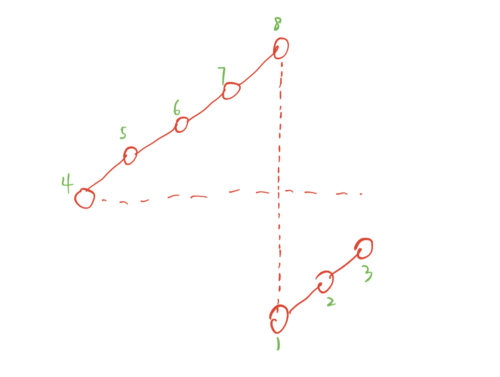
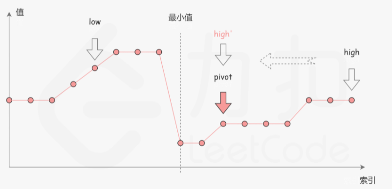
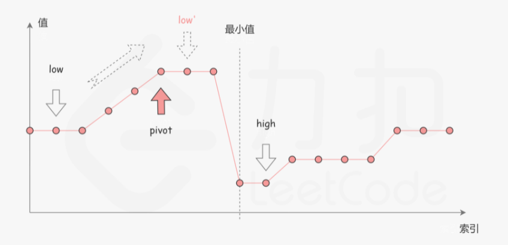
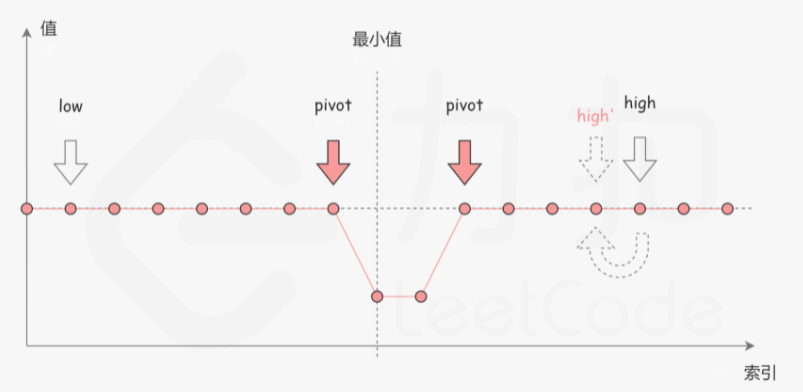

 

### 写在前面 二分法

* 二分法的重点不是单调性，单调性的可以从二分法思考，但是二分法也可以用来做非单调性的。

* 二分法的本质是找到边界

力扣二分查找详解：

**https://leetcode-cn.com/problems/search-insert-position/solution/te-bie-hao-yong-de-er-fen-cha-fa-fa-mo-ban-python-/**

二分法算法模板:

*  找出左边界，查找数组左边起第一个小于等于target的数组下标  
*  区间[l, r]被划分成[l, mid]和[mid + 1, r]时使用：

```js
function check(x) {} // 检查x是否满足某种性质

var binarySearch1 = function(nums, target) {
    let left = 0;
    let right = nums.length - 1;
    while (left < right) {
        // let mid = left + Math.floor((right - left) / 2);
        let mid = (left + right) >> 1;
        if (check(mid)) {
            right = mid;
        } else {
            left = mid + 1;
        }
    }
    return nums[left] === target ? left : -1;
}
```

* 找出右边界，查找数组右边起第一个小于等于target的数组下标
  区间[l, r]被划分成[l, mid - 1]和[mid, r]时使用

```js
var binarySearch2 = function(nums, target) {
    let left = 0;
    let right = nums.length - 1;
    while (left < right) {
        let mid = (right + left + 1) >> 1; // 注意这里要 +1
        if (check(mid)) {
            left = mid;
        } else {
            right = mid - 1;
        }
    }
    if (nums[left] !== target) return -1;
    return left;
}
```

### [704. 二分查找](https://leetcode.cn/problems/binary-search/)

给定一个 `n` 个元素有序的（升序）整型数组 `nums` 和一个目标值 `target` ，写一个函数搜索 `nums` 中的 `target`，如果目标值存在返回下标，否则返回 `-1`。
**示例 1:**

```
输入: nums = [-1,0,3,5,9,12], target = 9
输出: 4
解释: 9 出现在 nums 中并且下标为 4
```

左边界法：

```js
// 左边界,查找数组左边起第一个大于等于target的数组下标 
var search = function(nums, target) {
    let left = 0;
    let right = nums.length - 1;
    while (left < right) {
        let mid = (left + right) >> 1;
        if (nums[mid] >= target) {
            right = mid;
        } else {
            left = mid + 1;
        }
    }
    // 如果 target 不在数组里，此时 l === r
	// target大于数组最大值时，l==r==nums.length-1(如果第四行 right == nums.length,则此时为nums.length)
	// target小于数组最小值时，l==r==0  
    if(nums[left] !== target) return -1;
    return left;
}
```

右边界法:

```js
 // 右边界，查找数组右边起第一个小于等于target的数组下标
var search = function(nums, target) {
    let left = 0, right = nums.length - 1;
    while (left < right) {
        // 需要注意的是，这里的mid需要加1因为是向下取整,
        // 当循环走到 l==r-1 时,如果不加1，执行:
        // l=mid=(r-1+r)/2=r-1/2=r-1（向下取整）
        // 那么l的值还是为r-1，没有改变，陷入死循环。
        // let mid = left + Math.floor((right - left + 1)/2)
        let mid = (right + left + 1) >> 1;
        if(nums[mid] <= target) {
            left = mid;
        } else {
            right = mid - 1;
        }
    }
    if(nums[left] !== target) return -1;
    return left;
};
```

### [35. 搜索插入位置](https://leetcode.cn/problems/search-insert-position/)

给定一个排序数组和一个目标值，在数组中找到目标值，并返回其索引。如果目标值不存在于数组中，返回它将会被按顺序插入的位置。

请必须使用时间复杂度为 `O(log n)` 的算法。

**示例 1:**

```
输入: nums = [1,3,5,6], target = 5
输出: 2
```


```js
//右边界
var searchInsert = function(nums, target) {
    // //排除小于整个数组的情况
    if(nums[0] > target) return 0;
    let l = 0, r = nums.length - 1;
    //查找右边起第一个小于等于target的下标
    while(l < r) {
        let mid = (l + r + 1) >> 1;
        if(nums[mid] <= target) {
            l = mid;
        } else {
            r = mid - 1;
        }
    }
    return nums[l]===target? l : l+1;

};
```

```js
// 左边界
var searchInsert = function(nums, target) {
    //排除大于整个数组的情况
    if(nums[nums.length-1] < target) return nums.length;
    let l = 0, r = nums.length - 1;
    //查找第一个大于等于target的下标
    while(l < r) {
        let mid = (l + r) >> 1;
        if(nums[mid] >= target) {
            r = mid;
        } else {
            l = mid + 1;
        }
    }
    return l;

};
```


### [34. 在排序数组中查找元素的第一个和最后一个位置](https://leetcode.cn/problems/find-first-and-last-position-of-element-in-sorted-array/)

给你一个按照非递减顺序排列的整数数组 `nums`，和一个目标值 `target`。请你找出给定目标值在数组中的开始位置和结束位置。

如果数组中不存在目标值 `target`，返回 `[-1, -1]`。

你必须设计并实现时间复杂度为 `O(log n)` 的算法解决此问题。

 

**示例 1：**

```
输入：nums = [5,7,7,8,8,10], target = 8
输出：[3,4]
```

```js
给定一个按照升序排列的整数数组 nums，和一个目标值 target。找出给定目标值在数组中的开始位置和结束位置。

如果数组中不存在目标值 target，返回 [-1, -1]。

链接：https://leetcode-cn.com/problems/find-first-and-last-position-of-element-in-sorted-array
```

```js
var searchRange = function(nums, target) {
    //查找左边界：第一个大于等于target的数组下标
    const binarySearch1 = (nums, target) => {
        let l = 0, r = nums.length - 1;
        while(l < r) {
            let mid = (l + r) >> 1;
            if(nums[mid] >= target){
                r = mid;
            } else {
                l = mid + 1;
            }
        }
        if(nums[l] !== target) return -1;
        return l;
    }
    //查找右边界，第一个小于等于target的数组下标
    const binareSearch2 = (nums, target) => {
        let l = 0, r = nums.length - 1;
        while(l < r) {
            let mid = (l + r + 1) >> 1; 
            if(nums[mid] <= target) {
                l = mid;
            } else {
                r = mid - 1
            }
        }
        if(nums[l] !== target) return -1;
        return l;
    }
    const l = binarySearch1(nums, target);
    const r = binareSearch2(nums, target);
    return [l, r]
};
```


### [69. x 的平方根 ](https://leetcode.cn/problems/sqrtx/)

给你一个非负整数 `x` ，计算并返回 `x` 的 **算术平方根** 。

由于返回类型是整数，结果只保留 **整数部分** ，小数部分将被 **舍去 。**

**注意：**不允许使用任何内置指数函数和算符，例如 `pow(x, 0.5)` 或者 `x ** 0.5` 。

 

**示例 1：**

```
输入：x = 4
输出：2
```

```js
给你一个非负整数 x ，计算并返回 x 的 算术平方根 。

由于返回类型是整数，结果只保留 整数部分 ，小数部分将被 舍去 。

注意：不允许使用任何内置指数函数和算符，例如 pow(x, 0.5) 或者 x ** 0.5 。

链接：https://leetcode-cn.com/problems/sqrtx
```

用右边界，找右边第一个`平方小于等于x`的，

左边界不合适，它是大于等于，最后还需要判断一下,（判断是大于还是等于，比如当x=8，左边界找的话，找到2之后，2的平方是4,3的平方是9，这个时候就需要判断）

`注意！！！ 不能写成mid = (l+r+1)>>1，会计算出负值` 原因暂且不明

```js
var mySqrt = function(x) {
    let l = 0, r = x;
    while (l < r) {
        let mid = l + Math.floor((r - l + 1) / 2)
        if(mid ** 2 <= x) {
            l = mid;
        } else{
            r = mid - 1;
        }
    }
    return l;
};
```

### [367. 有效的完全平方数](https://leetcode.cn/problems/valid-perfect-square/)

给定一个 **正整数** `num` ，编写一个函数，如果 `num` 是一个完全平方数，则返回 `true` ，否则返回 `false` 。

**进阶：不要** 使用任何内置的库函数，如 `sqrt` 。

 

**示例 1：**

```
输入：num = 16
输出：true
```

完全平方数：一个数能表示成某个整数的平方的形式

```js
var isPerfectSquare = function(num) {
    let left = 0, right = num;
    while(left < right){
        const mid = left + Math.floor((right - left + 1) / 2);
        //用右边界，找小于等于目标值
        if(mid ** 2 <= num) {
            left = mid;
        } else {
            right = mid - 1;
        }
    }
    if(left ** 	2 === num) return true;
    return false;
};
```

### [153. 寻找旋转排序数组中的最小值](https://leetcode.cn/problems/find-minimum-in-rotated-sorted-array/)

难度中等783

已知一个长度为 `n` 的数组，预先按照升序排列，经由 `1` 到 `n` 次 **旋转** 后，得到输入数组。例如，原数组 `nums = [0,1,2,4,5,6,7]` 在变化后可能得到：

- 若旋转 `4` 次，则可以得到 `[4,5,6,7,0,1,2]`
- 若旋转 `7` 次，则可以得到 `[0,1,2,4,5,6,7]`

注意，数组 `[a[0], a[1], a[2], ..., a[n-1]]` **旋转一次** 的结果为数组 `[a[n-1], a[0], a[1], a[2], ..., a[n-2]]` 。

给你一个元素值 **互不相同** 的数组 `nums` ，它原来是一个升序排列的数组，并按上述情形进行了多次旋转。请你找出并返回数组中的 **最小元素** 。

你必须设计一个时间复杂度为 `O(log n)` 的算法解决此问题。

**示例 1：**

```js
输入：nums = [3,4,5,1,2]
输出：1
解释：原数组为 [1,2,3,4,5] ，旋转 3 次得到输入数组。
```



思路，若mid值比right值小，则mid在min右边，往左边查找（r=mid)，否则，则mid在min右边，往右边查找(l=mid+1)

最后l与r相遇，就是最小值

> 可以参考：https://leetcode.cn/problems/find-minimum-in-rotated-sorted-array/solution/by-lin-xia-5-1jb9/

```js
var findMin = function(nums) {
    let left = 0, right = nums.length - 1;
    while(left < right){
        const mid = left + Math.floor((right - left) / 2);
        if(nums[mid] < nums[right]) {
            right = mid;
        } else {
            left = mid + 1;
        }
    }
    return nums[left];
};
```


### 8.寻找旋转数组中的最小值(有重复)---力扣154

```js
已知一个长度为 n 的数组，预先按照升序排列，经由 1 到 n 次 旋转 后，得到输入数组。例如，原数组 nums = [0,1,4,4,5,6,7] 在变化后可能得到：
若旋转 4 次，则可以得到 [4,5,6,7,0,1,4]
若旋转 7 次，则可以得到 [0,1,4,4,5,6,7]
注意，数组 [a[0], a[1], a[2], ..., a[n-1]] 旋转一次 的结果为数组 [a[n-1], a[0], a[1], a[2], ..., a[n-2]] 。

给你一个可能存在 重复 元素值的数组 nums ，它原来是一个升序排列的数组，并按上述情形进行了多次旋转。请你找出并返回数组中的 最小元素 。

链接：https://leetcode-cn.com/problems/find-minimum-in-rotated-sorted-array-ii
```

> 
>
> 上图为情况一：nums[mid] < nums[right]，最小值在mid值左边，忽略右半部分
>
> 
>
> 上图为情况二：nums[mid] > nums[right]，最小值在mid值右边，忽略左半部分
>
> 
>
> 上图为情况三：nums[mid] === nums[right]，此时最小值和mid值位置不明确，所以不知道忽略左部分还是右部分，唯一可以知道的是，由于nums[mid]和nums[right]的值相同，所以无论 nums[right] 是不是最小值，都有一个它的「替代品」nums[mid]，因此我们可以忽略二分查找区间的右端点。
>

```js
var findMin = function(nums) {
    let left = 0, right = nums.length - 1;
    while(left < right) {
        const mid = left + Math.floor((right - left) / 2)
        if(nums[mid] < nums[right]) { //忽略右部分
            right = mid;
        } else if(nums[mid] > nums[right]){ //忽略左部分
            left = mid + 1;
        } else {						//无法判断忽略哪里，但由于mid和right相等，于是可以用mid来代替，忽略右端点right
            right = right - 1
        }
    }
    return nums[left];
};
```


### 9.搜索旋转排序数组---力扣33

```js
整数数组 nums 按升序排列，数组中的值 互不相同 。

在传递给函数之前，nums 在预先未知的某个下标 k（0 <= k < nums.length）上进行了 旋转，使数组变为 [nums[k], nums[k+1], ..., nums[n-1], nums[0], nums[1], ..., nums[k-1]]（下标 从 0 开始 计数）。例如， [0,1,2,4,5,6,7] 在下标 3 处经旋转后可能变为 [4,5,6,7,0,1,2] 。

给你 旋转后 的数组 nums 和一个整数 target ，如果 nums 中存在这个目标值 target ，则返回它的下标，否则返回 -1 。

链接：https://leetcode-cn.com/problems/search-in-rotated-sorted-array
```

```js
思路一，先二分法找到旋转的数组下标，用左边界的那个二分，然后找到旋转下标后，左右两边都有序，就可以和旋转的值比较一下，再二分了
```

```js
var search = function(nums, target) {
    //先找到旋转的数组下标，左边界
    let l = 0, r = nums.length - 1;
    while(l < r) {
        const mid = l + Math.floor((r - l) / 2);
        if(nums[mid] < nums[r]) {
            r = mid;
        } else {
            l = mid + 1;
        }
    }
    //判断是在旋转下标的左边还是右边，此时左右都有序
    if(nums[nums.length - 1] >= target) r = nums.length - 1;
    else  { l = 0, r = r - 1 }
    
    while(l < r) {
        const mid = l + Math.floor((r - l) / 2);
        if(nums[mid] >= target) {
            r = mid;
        } else {
            l = mid + 1;
        }
    }
    if(nums[l] === target) return l;
    return -1
    
};
```

```js
思路2：选取l，mid，r点，以mid点来看，要么l-mid有序，要么mid-right有序，总之必然有一边有序
那么，不管哪边有序，对有序的那边进行二分查找
*l<=right时
	**左边有序
		***target在有序边，收缩右边界
		***否则，收缩左边界
	**右边有序
		***target在有序边，收缩左边界
		***否则，收缩右边界
注意：左边加上=,边界判断要把握好，头疼。。。
```

```js
var search = function(nums, target) {
    let left = 0, right = nums.length - 1;
    if(nums.length === 0) return -1;
    while(left <= right){
        const mid = left + Math.floor((right - left) / 2);
        if(nums[mid] === target) return mid;
        //左边有序的情况，注意大于等于要写在左边，[3,1] 1
        if(nums[mid] >= nums[left]) {
            //mid不写等于，因为前面if单独拎出来判断了nums[mid]和target的关系
            //target在左边:[left, mid)
            if(nums[left] <= target && nums[mid] > target) {
                right = mid - 1;
            //target在右边
            } else {
                left = mid + 1;
            }
        //反之就是右边有序的情况，因为nums[mid]划分后，一定有一边是有序的
        } else {
            //target在右边:(mid, right]
            if(nums[mid] < target && nums[right] >= target) {
                left = mid + 1;
            //target在左边
            } else {
                right = mid - 1;
            }
        }
    }
    return -1;
};
```

或者这样也可以，先用nums[right]判断右半部分，等于号就不用写了

```js
var search = function(nums, target) {
    let left = 0, right = nums.length - 1;
    if(nums.length === 0) return -1;
    while(left <= right){
        const mid = left + Math.floor((right - left) / 2);
        if(nums[mid] === target) return mid;
        if(nums[mid] < nums[right]){
            if(nums[mid] < target && nums[right] >= target){
                left = mid + 1;
            }else{
                right = mid - 1;
            }
            
        }else{
            if(nums[left] <= target && nums[mid] > target){
                right = mid - 1;
            }else{
                left = mid + 1;
            }
        }
    }
    return -1;
};
```


### 10.搜索旋转排序数组(重复元素)

```js
思路：有重复元素情况下，当mid值和第一个或最后一个元素比较时，无法判断它是在前半段还是后半段，此时可以通过缩小区间left++/right++
```

```js
var search = function(nums, target) {
    let left = 0, right = nums.length - 1;
    if(nums.length === 0) return -1;
    while(left <= right){
        const mid = left + Math.floor((right - left) / 2);
        if(nums[mid] === target) return mid;
        //以下的if判断条件用来      处理重复元素
        if(nums[mid]==nums[right]){
                right--;
                continue;
            }
       if(nums[mid] < nums[right]){
            if(nums[mid] < target && nums[right] >= target){
                left = mid + 1;
            }else{
                right = mid - 1;
            }       
        }else{
            if(nums[left] <= target && nums[mid] > target){
                right = mid - 1;
            }else{
                left = mid + 1;
            }
        }
    }
    return -1;
};
```


### 11.寻找两个正序数组的中位数---力扣4

```js
给定两个大小分别为 m 和 n 的正序（从小到大）数组 nums1 和 nums2。请你找出并返回这两个正序数组的 中位数 。

算法的时间复杂度应该为 O(log (m+n)) 。

链接：https://leetcode-cn.com/problems/median-of-two-sorted-arrays
```


```js

```


