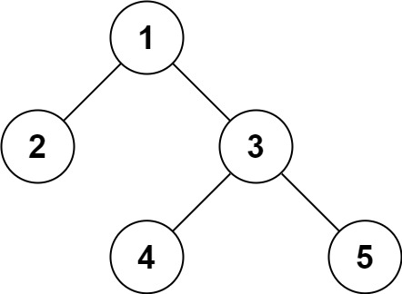

# 写在前面

## js定义变量注意事项

> 1. root判断中，用  ===  代替 ！  来书写
> 2. 定义最大最小整数用：Number.MAX_SAFE_INTEGER/Number.MIN_SAFE_INTEGER，不要用Number.MIN_VALUE，出现过报错：process exited with signal SIGSEGV，具体原因未知。
> 3. 不要忘记返回return
>

**群聊面经**

> 阿里云前端一面：两道算法题：算法题是数组题
> 
> 二面：项目强相关（推测是跟本人项目经历精彩有关），八股文很少，实际场景题：检测视频完播率（结合鼠标事件DOM和数据结构），
>
> 面试者本人：两个项目，看视频和实验室项目，第二个目前国内没有用但是效果好：类似云游戏，数字孪生和三维可视化
>
> 学习：html，css，js自学的文档 ajax promise axios es6 react vue webpack
>
> 找个项目跟着做做，了解一下实际环境中的语法
>
> 找内推去牛客网
>
> 其他人：算法题：leetcode41，要求O(n)，O(1），还有个最长递增子序列，要求O(nlong)的做法，两原题，

**关于new Map**

> ES6中的Map()，可以通过此方法使得不重复保存值
>
> 大致思路：
>
> 1. new一个Map，一个数组用来保存结果
>
> ```js
> mome = new Map(),空数组 const res = [],
> ```
>
> 
>
> 下面循环执行：
>
> 1. 新到来一个key1，用get方法判断memo里是否有key1，记录对应value值count：{值：出现次数}
>
>    ```js
>    let count = memo.get(key) || 0
>    ```
>
> 2. 判断if(count === 1) 出现了一次，存入res中，res.unshift(key1)
>
>    ```js
>    if(freq === 1) {
>       res.unshift(node);
>    }
>    ```
>
>    
>
> 3. key1每出现一次，count+1
>
>    ```js
>    meme.set(key1, count + 1)
>    ```
>

**js 初始化长度为n的二维数组**

```js
let memo = new Array(n).fill(0).map(() => new Array(n).fill(0));
```


## 二叉树

### 二叉树遍历方式

> 二叉树主要有两种遍历方式：
>
> 1. 深度优先遍历：先往深走，遇到叶子节点再往回走。
> 2. 广度优先遍历：一层一层的去遍历。
>
> **这两种遍历是图论中最基本的两种遍历方式**。
>
> 那么从深度优先遍历和广度优先遍历进一步拓展，才有如下遍历方式：
>
> - 深度优先遍历
>   - 前序遍历（递归法，迭代法）
>   - 中序遍历（递归法，迭代法）
>   - 后序遍历（递归法，迭代法）
> - 广度优先遍历
>   - 层次遍历（迭代法）
>
> **前中后，其实指的就是中间节点的遍历顺序**

### 二叉树定义

> ```js
> function TreeNode(val, left, right) {
>        this.val = (val === undefined ? 0 : val);
>        this.left = (left === undefined ? null : val);
>        this.right = (right === undefined ? null : right)
> }
> ```

### 二叉树递归遍历框架

> ```js
> function traverse(root) {
>        if (root === null) {
>            return;
>        }
>        //前序位置
>        traverse(root.left);
>        //中序位置
>        traverse(root.right);
>        //后序位置
> }
> ```

### 两种解题思路

你只需要思考每一个节点应该做什么，其他的不用你管，抛给二叉树遍历框架，递归会对所有节点做相同的操作。

**二叉树的所有问题，就是让你在前中后序位置注入巧妙的代码逻辑，去达到自己的目的**。

> * **遍历一遍二叉树得出答案**   ---回溯算法核心框架
> * **通过分解问题计算出答案**   ---动态规划核心框架
>
> 见如下104题的例子

# 二叉树

## 144. 94. 145.  二叉树前中后序遍历

> 给你二叉树的根节点 `root` ，返回它节点值的 **前序** 遍历。
>
>  
>
> **示例 1：**
>
> 
>
> ```js
> //前序
> 输入：root = [1,null,2,3]
> 输出：[1,2,3]
> //中序
> 输入：root = [1,null,2,3]
> 输出：[1,3,2]
> //后序
> 输入：root = [1,null,2,3]
> 输出：[3,2,1]
> ```

### 递归

**遍历的思路**

> ```js
> var preorderTraversal = function(root) {
>        let res = [];
>        function dfs(root) {
>            if(root === null) return;
>            //res.push(root.val); // 前序位置
>            dfs(root.left);
>            //res.push(root.val); // 中序位置
>            dfs(root.right);
>            //res.push(root.val); // 后序位置
>        }
>        dfs(root);
>        return res;
> };
> ```

**分解问题的思路**

**前序**：前序遍历的特点是，根节点的值排在首位，接着是左子树的前序遍历结果，最后是右子树的前序遍历结果：


那这不就可以分解问题了么，**一棵二叉树的前序遍历结果 = 根节点 + 左子树的前序遍历结果 + 右子树的前序遍历结果**。

> 中序和后序遍历也是类似的，只要把 `add(root.val)` 放到中序和后序对应的位置就行了。
>
> **中序**，上图的中序顺序：[5, 2, 6, 4, 7, 1, 8, 3, 9]
>
> **后序**，上图的后序顺序：[5, 6, 7, 4, 2, 8, 9, 3, 1]

```js
var preorderTraversal = function(root) {
    // 定义：输入一个节点，返回以该节点为根的二叉树的前序遍历结果
    let res = [];
    if (root === null) return res;
    // 前序遍历结果特点：第一个是根节点的值，接着是左子树，最后是右子树
    res.push(root.val); // 前序位置
    res.push(...preorderTraversal(root.left));
    // res.push(root.val); // 中序位置
    res.push(...preorderTraversal(root.right));
    // res.push(root.val); // 后序位置
    return res;
};
```

> ps:这个解法短小精干，但不常见，因为“**这个算法的复杂度不好把控**，比较依赖语言特性”

### 迭代 - 用栈实现

* **前序遍历 - 迭代版**

> 前序遍历是中左右，每次先处理的是中间节点，那么先将根节点放入栈中，然后将右孩子加入栈，再加入左孩子。
>
> 为什么要先加入 右孩子，再加入左孩子：因为这样出栈的时候才是中左右的顺序。
>
> ```js
> // 入栈 右 -> 左
> // 出栈 中 -> 左 -> 右
> var preorderTraversal = function(root) {
>     if (root === null) return [];
>     let stack = [];
>     let res = [];
>     stack.push(root);
>     while (stack.length) {
>         const cur = stack.pop(); // 根节点
>         res.push(cur.val);
>         cur.right && stack.push(cur.right); // 右节点，非空则入栈
>         cur.left && stack.push(cur.left); // 左节点，非空则入栈
>     }
>     return res;
> };
> ```

* **中序遍历 - 迭代版**

> **中序遍历的处理顺序和访问顺序是不一致的。**那么**在使用迭代法写中序遍历，就需要借用指针的遍历来帮助访问节点，栈则用来处理节点上的元素。**
>
> 思路就是，往左走到尽头，然后访问根节点，然后往右走。

> ```js
> // 入栈 左 -> 右
> // 出栈 左 -> 中 -> 右
> 
> var inorderTraversal = function(root) {
>     let stack = [];
>     let res = [];
>     let cur = root;
>     while (stack.length || cur) {
>         if (cur) { // cur指针来访问节点，访问到最底层
>             stack.push(cur); // 将访问的节点放入栈中
>             cur = cur.left; // 左
>         } else {
>             cur = stack.pop(); // 从栈里弹出的数据，就是要处理的数据（放进result数组里的数据）
>             res.push(cur.val);
>             cur = cur.right; // 右
>         }
>     }
>     return res;
> };
> ```

* **后序遍历 - 迭代版**

> ```js
> // 先序遍历的顺序 中左右， 后序遍历的顺序 左右中
> // 把先序遍历的顺序  改成中右左，然后再翻转，就变成了左右中
> var postorderTraversal = function(root) {
>     if (root === null) return [];
>     let res = [];
>     let stack = [root];
>     while (stack.length) {
>         const cur = stack.pop();
>         res.push(cur.val);
>         cur.left && stack.push(cur.left); // 注意，先左，再右进栈
>         cur.right && stack.push(cur.right);
>     }
>     return res.reverse(); // res原本是 中右左，反转一下就变成 左右中了
> };
> ```
>
> 
>
> 

## 145. 二叉树的后序遍历

> 

## [104. 二叉树的最大深度](https://leetcode-cn.com/problems/maximum-depth-of-binary-tree/)

> [labuladong 题解](https://labuladong.gitee.io/plugin-v3/?qno=104&target=gitee&_=1645779923445)[思路](https://leetcode-cn.com/problems/maximum-depth-of-binary-tree/#)
>
> 给定一个二叉树，找出其最大深度。
>
> 二叉树的深度为根节点到最远叶子节点的最长路径上的节点数。
>
> **说明:** 叶子节点是指没有子节点的节点。
>
> **示例：**
> 给定二叉树 `[3,9,20,null,null,15,7]`，
>
> ```
>     3
>    / \
>   9  20
>     /  \
>    15   7
> ```
>
> 返回它的最大深度 3

**第一类解题思路：遍历一遍二叉树得出答案 - 遍历二叉树计算答案的思路**

思路核心：即遍历一遍二叉树，用一个外部变量记录每个节点所在的深度，取最大值就可以得到最大深度

> ```js
> //遍历二叉树计算答案的思路
> var maxDepth = function(root) {
>        //记录最大深度
>        let maxDepth = 0;
>        //记录当前遍历到的节点深度
>        let depth = 0;
>        //二叉树遍历框架
>        function traverse(root) {
>            if (root === null) {
>                //到达叶子节点，更新最大深度
>                maxDepth = Math.max(maxDepth, depth);
>                return;
>            }
>            //前序位置，此时刚进入一个节点，深度加一
>            depth++;
>            traverse(root.left);
>            traverse(root.right);
>            //后续位置，此时准备离开节点，深度减一
>            depth--;
>        }
>        //闭包调用
>        traverse(root);
>        return maxDepth;
> };
> ```

**第二类解题思路：分解问题计算答案**

思路核心：确实可以通过子树的最大深度推导出原树的深度，所以当然要首先利用递归函数的定义算出左右子树的最大深度，然后推出原树的最大深度，主要逻辑自然放在后序位置。

即一棵二叉树的最大深度可以通过子树的最大高度推导出来

> ```js
> //定义：输入根节点，返回这棵二叉树的最大深度
> var maxDepth = function(root) {
>      if(root === null) {
>            return 0
>      }
>      //计算左右子树的最大深度
>      const leftMax = maxDepth(root.left);
>      const rightMax = maxDepth(root.right);
>      //整棵树的最大深度等于左右子树的深度最大值，
>      //然后，再加上根节点自己
>      return Math.max(leftMax, rightMax) + 1;
> };
> ```
>
> 但是有一个问题就是：为什么主要的代码逻辑集中在后序位置？
>
> 因为核心在于：确实可以通过子树的最大高度推导出原树的高度，但首先要利用递归函数的定义算出`左右子树`的最大深度，然后推出原树的最大深度，因此主要逻辑放在`后序位置`
>
> 后序位置是有`特殊之处`的。前序自顶向下，后序位置的代码执行是自底向上。
>
> **前序位置的代码只能从函数参数中获取父节点传递来的数据，而后序位置的代码不仅可以获取参数数据，还可以获取到子树通过函数返回值传递回来的数据**。
>
> 也就是说，只有后序位置才能通过返回值获取子树的信息。
>
> 那么自然而然可以想到：**一旦你发现题目和子树有关，那大概率要给函数设置合理的定义和返回值，在后序位置写代码了**。
>
> 这也解释了为什么分解问题的思路求最大深度需要把代码逻辑放在后序位置，因为用到了左右子树。

## [543. 二叉树的直径](https://leetcode-cn.com/problems/diameter-of-binary-tree/)

**思路：遇到子树问题，首先想到的是给函数设置返回值，然后在后序位置做文章。**

> [labuladong 题解](https://labuladong.gitee.io/plugin-v3/?qno=543&target=gitee&_=1645835759873)[思路](https://leetcode-cn.com/problems/diameter-of-binary-tree/#)
>
> 给定一棵二叉树，你需要计算它的直径长度。一棵二叉树的直径长度是任意两个结点路径长度中的最大值。这条路径可能穿过也可能不穿过根结点。
>
>  
>
> **示例 :**
> 给定二叉树
>
> ```
>           1
>          / \
>         2   3
>        / \     
>       4   5    
> ```
>
> 返回 **3**, 它的长度是路径 [4,2,1,3] 或者 [5,2,1,3]。

> **思路一**：遍历一遍二叉树得出答案：遍历整棵树中的每个节点，然后通过每个节点的左右子树的最大深度算出每个节点的「直径」，最后把所有「直径」求个最大值即可。主函数将代码逻辑放在前序位置。
>
> ```js
> var diameterOfBinaryTree = function(root) {
>        let maxDiameter = 0;    
>        //遍历二叉树
>        function traverse(root) {
>            if(root === null) return;
>            //对每个节点计算直径:求出节点左子树和右子树的最大高度，然后将高度相加
>            //紧接着更新最大直径
>            const leftMax = maxDepth(root.left);
>            const rightMax = maxDepth(root.right);
>            let curDiameter = leftMax + rightMax;
>            maxDiameter = Math.max(maxDiameter, curDiameter)
>            traverse(root.left);
>            traverse(root.right);
>        }
>        traverse(root);
>        return maxDiameter;
> };
> 
> //计算以root为根节点的二叉树最大深度
> function maxDepth(root) {
>        if(root === null) {
>            return 0
>        }
>        const leftDepth = maxDepth(root.left);
>        const rightDepth = maxDepth(root.right);
>        return Math.max(leftDepth, rightDepth) + 1;
> }
> ```
>
> **优化**
>
> 上面复杂度为n*2，因为**前序位置无法获取子树信息，所以只能让每个节点调用 `maxDepth` 函数去算子树的深度**。
>
> 优化方式：把计算「直径」的逻辑放在后序位置，准确说应该是放在 `maxDepth` 的后序位置，因为 `maxDepth` 的后序位置是知道左右子树的最大深度的。
>
> ```js
> var diameterOfBinaryTree = function(root) {
>        let maxDiameter = 0;
>        function maxDepth(root) {
>            if(root === null) return 0;
>            const leftMax = maxDepth(root.left);
>            const rightMax = maxDepth(root.right);
>            let curDiameter = leftMax + rightMax;
>            maxDiameter = Math.max(maxDiameter, curDiameter);
>            return Math.max(leftMax, rightMax) + 1;
>        }
>        maxDepth(root);
>        return maxDiameter;
> };
> ```

## [226. 翻转二叉树](https://leetcode-cn.com/problems/invert-binary-tree/)

> [labuladong 题解](https://labuladong.gitee.io/plugin-v3/?qno=226&target=gitee&_=1645854901941)[思路](https://leetcode-cn.com/problems/invert-binary-tree/#)
>
> 难度简单1182
>
> 给你一棵二叉树的根节点 `root` ，翻转这棵二叉树，并返回其根节点。
>
> 
>
> **示例 1：**
>
> 
>
> ```
> 输入：root = [4,2,7,1,3,6,9]
> 输出：[4,7,2,9,6,3,1]
> ```
>
> 思路：遍历二叉树所有节点，对每个节点实施`交换子节点`的操作 return null 条件为：!root
>
> 可以用前序或者后序，不能用中序。  
>
> **「遍历」的思维模式解决**：写一个 `traverse` 函数遍历每个节点，让每个节点的左右子节点颠倒过来就行了。
>
> **分解问题的思维**：核心在于你要给递归函数一个合适的定义，然后用函数的定义来解释你的代码；如果你的逻辑成功自恰，那么说明你这个算法是正确的。
>
> 本题引发的思考：**二叉树题目的一个难点就是，如何把题目的要求细化成每个节点需要做的事情**
>
> ```js
> // 遍历问题的思维模式
> var invertTree = function(root) {
>     function traverse(root) {
>         if (root === null) {
>             return null;
>         }
>         [root.left, root.right] = [root.right, root.left];
>         traverse(root.left);
>         traverse(root.right);
>     }
>     traverse(root);
>     return root;
> };
> 
> // 分解问题的思维模式
> var invertTree = function(root) {
>     if (root === null) {
>         return null;
>     }
>     [root.left, root.right] = [root.right, root.left];
>     invertTree(root.left);
>     invertTree(root.right);
>     return root;
> };
> ```

## [116. 填充每个节点的下一个右侧节点指针](https://leetcode-cn.com/problems/populating-next-right-pointers-in-each-node/)

> [labuladong 题解](https://labuladong.gitee.io/plugin-v3/?qno=116&target=gitee&_=1645856638281)[思路](https://leetcode-cn.com/problems/populating-next-right-pointers-in-each-node/#)
>
> 给定一个 **完美二叉树** ，其所有叶子节点都在同一层，每个父节点都有两个子节点。二叉树定义如下：
>
> ```
> struct Node {
>   int val;
>   Node *left;
>   Node *right;
>   Node *next;
> }
> ```
>
> 填充它的每个 next 指针，让这个指针指向其下一个右侧节点。如果找不到下一个右侧节点，则将 next 指针设置为 `NULL`。
>
> 初始状态下，所有 next 指针都被设置为 `NULL`。
>
>  
>
> **示例 1：**
>
> 
>
> ```
> 输入：root = [1,2,3,4,5,6,7]
> 输出：[1,#,2,3,#,4,5,6,7,#]
> 解释：给定二叉树如图 A 所示，你的函数应该填充它的每个 next 指针，以指向其下一个右侧节点，如图 B 所示。序列化的输出按层序遍历排列，同一层节点由 next 指针连接，'#' 标志着每一层的结束。
> ```

> 题目的意思就是把二叉树的每一层节点都用 `next` 指针连接起来.除了最右侧的节点 `next` 指针会指向 `null`，其他节点的右侧一定有相邻的节点。
>
> 思路：「将每一层二叉树节点连接起来」可以细化成「将每两个相邻节点都连接起来」
>
> `connectTwoNode` 函数不断递归，可以无死角覆盖整棵二叉树，将所有相邻节点都连接起来。
>
> ```js
> var connect = function(root) {
>        if(root === null) return null;
>        connectTwoNode(root.left, root.right);
>        return root;
> };
> function connectTwoNode(node1, node2) {
>        if(node1 === null || node2 === null) return;
> 
>        //在前序遍历位置，将传入的两个节点连接
>        node1.next = node2;
> 
>        //连接相同父节点的两个子节点，注意节点1和节点2都要连接
>        connectTwoNode(node1.left, node1.right);
>        connectTwoNode(node2.left, node2.right);
>        //连接跨越父节点的两个子节点:节点1的右节点和节点2的左节点
>        connectTwoNode(node1.right, node2.left);        
> }
> ```

## [114. 二叉树展开为链表](https://leetcode-cn.com/problems/flatten-binary-tree-to-linked-list/)

> [labuladong 题解](https://labuladong.gitee.io/plugin-v3/?qno=114&target=gitee&_=1645857556883)[思路](https://leetcode-cn.com/problems/flatten-binary-tree-to-linked-list/#)
>
> 给你二叉树的根结点 `root` ，请你将它展开为一个单链表：
>
> - 展开后的单链表应该同样使用 `TreeNode` ，其中 `right` 子指针指向链表中下一个结点，而左子指针始终为 `null` 。
> - 展开后的单链表应该与二叉树 [**先序遍历**](https://baike.baidu.com/item/先序遍历/6442839?fr=aladdin) 顺序相同。
>
>  
>
> **示例 1：**
>
> 
>
> ```
> 输入：root = [1,2,5,3,4,null,6]
> 输出：[1,null,2,null,3,null,4,null,5,null,6]
> ```

> 属于分解子问题的类型，自然用后序位置的遍历
>
> 思路：1，将`root`的左子树和右子树拉平； 2，将 `root` 的右子树接到左子树下方，然后将整个左子树作为右子树。
>
> 
>
> 
>
> 问题来了，如何拉平root的左右子树：按照 `flatten` 函数的定义，对 `root` 的左右子树递归调用 `flatten` 函数即可。
>
> **给** **`flatten`** **函数输入一个节点** **`root`**，那么以 **`root`** **为根的二叉树就会被拉平为一条链表**。
>
> ```js
> var flatten = function(root) {
>        // base case
>        if (root === null) return;
>        flatten(root.left);
>        flatten(root.right);
>        // 后序位置写核心代码
>        // 1，此时默认左右子树都已被拉平成一条链表
>        const left = root.left; //保存左右子树
>        const right = root.right;
>        // 2，将左子树作为右子树
>        root.left = null; //左子树置为空，将其保存到右子树上
>        root.right = left;
>        // 3，将原右子树接到当前右子树的末端
>        let p = root;
>        while (p.right !== null) {  // 将p移动到现右子树末尾
>            p = p.right;
>        }
>        p.right = right;
> };
> ```
>
> 这就是递归的魅力，你说 `flatten` 函数是怎么把左右子树拉平的？说不清楚，但是只要知道 `flatten` 的定义如此，相信这个定义，让 `root` 做它该做的事情，然后 `flatten` 函数就会按照定义工作。另外注意递归框架是`后序遍历`，因为我们要`先拉平左右子树`才能进行后续操作。
>
> 归纳：
>
> * 递归算法的关键要明确函数的定义，相信这个定义，而不要跳进递归细节。
> * 写二叉树的算法题，都是基于递归框架的，我们先要搞清楚 `root` 节点它自己要做什么，然后根据题目要求选择使用前序，中序，后续的递归框架。
> * 二叉树题目的难点在于如何通过题目的要求思考出每一个节点需要做什么，这个只能通过多刷题进行练习了。

## [654. 最大二叉树](https://leetcode-cn.com/problems/maximum-binary-tree/)

> [labuladong 题解](https://labuladong.gitee.io/plugin-v3/?qno=654&target=gitee&_=1645860142461)[思路](https://leetcode-cn.com/problems/maximum-binary-tree/#)
>
> 难度中等375
>
> 给定一个不重复的整数数组 `nums` 。 **最大二叉树** 可以用下面的算法从 `nums` 递归地构建:
>
> 1. 创建一个根节点，其值为 `nums` 中的最大值。
> 2. 递归地在最大值 **左边** 的 **子数组前缀上** 构建左子树。
> 3. 递归地在最大值 **右边** 的 **子数组后缀上** 构建右子树。
>
> 返回 *`nums` 构建的* **最大二叉树** 。
>
>  
>
> **示例 1：**
>
> 
>
> ```
> 输入：nums = [3,2,1,6,0,5]
> 输出：[6,3,5,null,2,0,null,null,1]
> ```

> 分解子问题的类型
>
> 分析：树的算法，关键思路是**把题目的要求细化，搞清楚根节点应该做什么，然后剩下的事情抛给前/中/后序的遍历框架就行了**，千万不要跳进递归细节。
>
> 本题中先明确根节点做什么：**对于构造二叉树的问题，根节点要做的就是把想办法把自己构造出来**。
>
> 详细一点说，就是**对于每个根节点，只需要找到当前 `nums` 中的最大值和对应的索引，然后递归调用左右数组构造左右子树即可**。
>
> ```js
> var constructMaximumBinaryTree = function(nums) {
>        return build(nums, 0, nums.length - 1);
> };
> //将nums[low...high]构造成符合条件的树，返回根节点
> function build(nums, low, high) {
>        if(low > high) {
>            return null;
>        }
>        //找到数组中最大值和对应的索引
>        let maxValue = Number.MIN_SAFE_INTEGER;  //注意！！！这里不能写成Number.MIN_VALUE，会报错,要写成Number.MIN_SAFE_INTEGER，最小安全整数
>        let index = -1;
>        for (let i = low; i <= high; i++) {
>            if (nums[i] > maxValue) {
>                index = i;
>                maxValue = nums[i]
>            }
>        }
>        const root = new TreeNode(maxValue);
>        //递归调用构造左右子树
>        root.left = build(nums, low, index - 1);
>        root.right = build(nums, index + 1, high)
>        return root;
> }
> ```

## [105. 从前序与中序遍历序列构造二叉树](https://leetcode-cn.com/problems/construct-binary-tree-from-preorder-and-inorder-traversal/)

> [labuladong 题解](https://labuladong.gitee.io/plugin-v3/?qno=105&target=gitee&_=1645865301206)[思路](https://leetcode-cn.com/problems/construct-binary-tree-from-preorder-and-inorder-traversal/#)
>
> 给定两个整数数组 `preorder` 和 `inorder` ，其中 `preorder` 是二叉树的**先序遍历**， `inorder` 是同一棵树的**中序遍历**，请构造二叉树并返回其根节点。
>
>  
>
> **示例 1:**
>
> 
>
> ```
> 输入: preorder = [3,9,20,15,7], inorder = [9,3,15,20,7]
> 输出: [3,9,20,null,null,15,7]
> ```

> 思路类似上一题：
>
> 1. 想办法确定根节点的值
> 2. 递归构造左右子树
>
> 细节难点：
>
> 1. 找出根节点：前序序列中：preoreder[preStart]
> 2. 确定根节点在中序序列中的位置：for循环，找出下标index
> 3. 前中序列中对应的左右子树起止点:preorder[preStart...preEnd],inorder[inStart...inEnd]，如何找？看图
>
> 
>
> 4. 确定递归终止条件  if(preStart > preEnd) return null
>
> ```js
> var buildTree = function(preorder, inorder) {
>     return build(preorder, 0, preorder.length - 1,
>                  inorder, 0, inorder.length - 1);
> };
> 
> /*
>     若前序遍历数组为preorder[preStart...preEnd]，
>     中序遍历数组为inorder[inStart...inEnd]
>     构造二叉树，返回根节点    
> */
> function build(preorder, preStart, preEnd, inorder, inStart, inEnd) {
>     if(preStart > preEnd) {
>         return null;
>     }
>     //先找到根节点，前序遍历的第一个元素
>     const rootVal = preorder[preStart];
>     //找到根节点rootVal在中序遍历数组中的索引index
>     let index = 0;
>     for(let i = inStart; i <= inEnd; i++) {
>         if(inorder[i] === rootVal) {
>             index = i;
>             break;
>         }
>     }
>     //构造二叉树的根节点
>     const root = new TreeNode(rootVal);
>     //求出此root的左子树节点数量leftSize
>     const leftSize = index - inStart;
>     //递归构造左子树，右子树
>     
>     root.left = build(preorder, preStart + 1, preStart + leftSize, inorder, inStart, index - 1);
>     root.right = build(preorder, preStart + leftSize + 1, preEnd, inorder, index + 1, inEnd)
> 
>     return root;
> }
> ```
>
> `注意`,涉及的变量比较多，pre，in，start，end什么的一定要细心，看仔细想明白了再写上去。

### 优化代码书写,

**但是这个性能不好，内存消耗是上面的三倍**

> 代码书写方式可以优化。可以用数组中新增的indexOf方法：`indexOf`方法返回给定元素在数组中第一次出现的位置，如果没有出现则返回`-1`。
>
> shift：`弹出array的第一个数组` slice(start， end)：提取start-end，不包扩end；
>
> 优化之后，对于preorder:leftChild[0...index-1],rightChild[index...]，inorder[0...index-1],rightChild[index+1]
>
> 优化之后代码（写代码一定要画图，找出index在中序，先序中的位置，确定起始）：
>
> ```js
> var buildTree = function(preorder, inorder) {
>         if(!preorder.length) return null
>         //  利用preorde找到头节点，shift弹出，preodrder数组改变
>         const rootVal = preorder.shift();
>         //  找到头节点在inouder中的索引index
>          const index = inorder.indexOf(rootVal);
>         //  构造节点
>         const root = new TreeNode(rootVal);
>         
>         //递归构造左子树，右子树，注意左子树的rootVal被弹出，所以从0开始
>         root.left = buildTree(preorder.slice(0, index), inorder.slice(0, index));
>         root.right = buildTree(preorder.slice(index), inorder.slice(index + 1));
>         
>         return root;
> };
> ```

## [106. 从中序与后序遍历序列构造二叉树](https://leetcode-cn.com/problems/construct-binary-tree-from-inorder-and-postorder-traversal/)

> [labuladong 题解](https://labuladong.gitee.io/plugin-v3/?qno=106&target=gitee&_=1645924896842)[思路](https://leetcode-cn.com/problems/construct-binary-tree-from-inorder-and-postorder-traversal/#)
>
> 给定两个整数数组 `inorder` 和 `postorder` ，其中 `inorder` 是二叉树的中序遍历， `postorder` 是同一棵树的后序遍历，请你构造并返回这颗 *二叉树* 。
>
>  
>
> **示例 1:**
>
> 
>
> ```
> 输入：inorder = [9,3,15,20,7], postorder = [9,15,7,20,3]
> 输出：[3,9,20,null,null,15,7]
> ```

**写法一：**

> ```js
> var buildTree = function(inorder, postorder) {
>        const build = (inStart, inEnd, postStart, postEnd)=> {
>            if(inStart > inEnd) return null;
>            // 找到根节点，后序遍历最后一个元素
>            const rootVal = postorder[postEnd];
>            // 找到rootVal在inorder的index
>            const index = inorder.indexOf(rootVal);
>            // 构造根节点
>            const root = new TreeNode(rootVal);
>            // 左子树节点数量
>            const leftSize = index - inStart;
>            root.left = build(inStart, index - 1, postStart, postStart + leftSize - 1);
>            root.right = build(index + 1, inEnd, postStart + leftSize, postEnd - 1);
>            return root;
>        }
>        return build(0, inorder.length - 1, 0, postorder.length - 1);
> };
> ```
>
> 

**写法二**

> ```js
> var buildTree = function(inorder, postorder) {
>        if (inorder.length === 0) return null;
>        // 通过postorder找到根节值,postordera数组值改变
>        const rootVal = postorder.pop();
>        // 找到rootVal在inorder的index
>        const index = inorder.indexOf(rootVal);
>        // 构建根节点
>        const root = new TreeNode(rootVal);
>        // 递归构造左子树，右子树, 注意，左子树节点数量leftSize = index + 1；
>        root.left = buildTree(inorder.slice(0, index), postorder.slice(0, index));
>        root.right = buildTree(inorder.slice(index + 1), postorder.slice(index));
>        return root;
> };
> ```

## [889. 根据前序和后序遍历构造二叉树](https://leetcode-cn.com/problems/construct-binary-tree-from-preorder-and-postorder-traversal/)

> [labuladong 题解](https://labuladong.gitee.io/plugin-v3/?qno=889&target=gitee&_=1645926547862)[思路](https://leetcode-cn.com/problems/construct-binary-tree-from-preorder-and-postorder-traversal/#)
>
> 给定两个整数数组，`preorder` 和 `postorder` ，其中 `preorder` 是一个具有 **无重复** 值的二叉树的前序遍历，`postorder` 是同一棵树的后序遍历，重构并返回二叉树。
>
> 如果存在多个答案，您可以返回其中 **任何** 一个。
>
>  
>
> **示例 1：**
>
> 
>
> ```
> 输入：preorder = [1,2,4,5,3,6,7], postorder = [4,5,2,6,7,3,1]
> 输出：[1,2,3,4,5,6,7]
> ```

> 思路(以示例1为例)：
>
> 1. 根据前序或者后序确定根节点的值：`1`
> 2. 把前序遍历结果的第二个元素作为左子树的根节点的值：`2`
> 3. 在后序遍历中找到`2`的位置，从而确定左子树的索引边界`index`，进而确定右子树的索引边界
> 4. 递归构造左右子树
>
> 终止条件的时候要`注意`：因为第二步用到了preStart之后的第二个元素，因此当preStart === preEnd时，数组里面只有一个元素，此时直接返回此值的节点，不需要递归了，不然会出错

> ```js
> var constructFromPrePost = function(preorder, postorder) {
>        const build = (preStart, preEnd, postStart, postEnd)=> {
>            // 终止条件
>            if (preStart > preEnd) return null;
>            // 这里也要判断！！！
>            if (preStart === preEnd) return new TreeNode(preorder[preStart]);
>            // 确定根节点的值
>            const rootVal = preorder[preStart];
>            // 确定左节点值：左子树根节点
>            const leftVal = preorder[preStart + 1];
>            // 确定左节点在postorder的索引index
>            const index = postorder.indexOf(leftVal);
>            // 左子树节点数量
>            const leftSize = index - postStart + 1;
>            // 构造根节点
>            const root = new TreeNode(rootVal);
>            // 递归构造左右子树
>            root.left = build(preStart + 1, preStart + leftSize, postStart, index);
>            root.right = build(preStart + leftSize + 1, preEnd, index + 1, postEnd - 1);
> 
>            return root;
>        }
>        return build(0, preorder.length - 1, 0, postorder.length - 1)
> };
> ```
>
> 再总结：**做二叉树的问题，关键是把题目的要求细化，搞清楚根节点应该做什么，然后剩下的事情抛给前/中/后序的遍历框架就行了**。

## [652. 寻找重复的子树](https://leetcode-cn.com/problems/find-duplicate-subtrees/)

> [labuladong 题解](https://labuladong.gitee.io/plugin-v3/?qno=652&target=gitee&_=1645937947599)[思路](https://leetcode-cn.com/problems/find-duplicate-subtrees/#)
>
> 给定一棵二叉树 `root`，返回所有**重复的子树**。
>
> 对于同一类的重复子树，你只需要返回其中任意**一棵**的根结点即可。
>
> 如果两棵树具有**相同的结构**和**相同的结点值**，则它们是**重复**的。
>
>  
>
> **示例 1：**
>
> 
>
> ```
> 输入：root = [1,2,3,4,null,2,4,null,null,4]
> 输出：[[2,4],[4]]
> ```

> 对于某一个节点，应该做什么？
>
> 必须知道以当前节点为根的这颗二叉树长什么样，还需要知道以其它节点为根的二叉树长什么样才能比较
>
> * 以当前节点为根的二叉树长什么样
>   * 序列化结构--后序遍历(因为要知道以自己为根的子树长什么样，需要知道左右子树)
>     * 拼接字符串的方式序列化二叉树：后序遍历，空节点用"#"
> * 以其它节点为根的二叉树长什么样
>   * 把序列化二叉树结构的结果存起来
>     * new Map():键值对，键key为当前节点序列化结果，value为此结果出现的次数count，===1时记录到res[]中，避免重复记录

> ```js
> var findDuplicateSubtrees = function(root) {
>        // Map用来记录所有以此节点为根的序列化结果以及出现的次数 {子树：出现次数} <==> {subTree: count}
>        const memo = new Map();
>        // 保存结果，不能重复保存（不能重复通过Map实现）
>        const res = [];
>        const traverse = node => {
>            if (node === null) return "#";
>            // 设置子树生成唯一标识，也是序列化结果
>            const leftString = traverse(node.left)
>            const rightString = traverse(node.right)
>            const subTree = node.val + "," + leftString + ',' + rightString;
>            // 当前节点为根构造的序列的出现次数,未出现赋值为0
>            const count = memo.get(subTree) || 0;
>            // 多次重复也只会被加入结果集一次，===1记录的是重复至少两次 ---扩展：如果===2记录的是重复至少三次
>            if (count === 1) {
>                res.push(node)
>            }
>            // 当前节点为根的序列每出现一次，就加一
>            memo.set(subTree, count + 1);
>            return subTree;
>        }
>        traverse(root);
>        return res;
> };
> ```

## [297. 二叉树的序列化与反序列化](https://leetcode-cn.com/problems/serialize-and-deserialize-binary-tree/)

> [labuladong 题解](https://labuladong.gitee.io/plugin-v3/?qno=297&target=gitee&_=1646032227812)[思路](https://leetcode-cn.com/problems/serialize-and-deserialize-binary-tree/#)
>
> 序列化是将一个数据结构或者对象转换为连续的比特位的操作，进而可以将转换后的数据存储在一个文件或者内存中，同时也可以通过网络传输到另一个计算机环境，采取相反方式重构得到原数据。
>
> 请设计一个算法来实现二叉树的序列化与反序列化。这里不限定你的序列 / 反序列化算法执行逻辑，你只需要保证一个二叉树可以被序列化为一个字符串并且将这个字符串反序列化为原始的树结构。
>
> **提示:** 输入输出格式与 LeetCode 目前使用的方式一致，详情请参阅 [LeetCode 序列化二叉树的格式](https://leetcode-cn.com/faq/#binary-tree)。你并非必须采取这种方式，你也可以采用其他的方法解决这个问题。
>
>  
>
> **示例 1：**
>
> 
>
> ```
> 输入：root = [1,2,3,null,null,4,5]
> 输出：[1,2,3,null,null,4,5]
> ```

### 前序遍历解法

> ```js
> var serialize = function(root) {
>        if (root === null) {                           //遍历到null节点
>            return '#';
>        }
>        const left = serialize(root.left);            //左右子树的序列化结果
>        const right = serialize(root.right);
>        return root.val + ',' + left + ',' + right;   //按 根 左 右 前序的方式拼接字符串
> };
> 
> /**
>  * Decodes your encoded data to tree.
>  *
>  * @param {string} data
>  * @return {TreeNode}
>  */
> var deserialize = function(data) {
>     const list = data.split(',');             //将data 给split成数组
>     const buildTree = (list) => {             //基于list构建当前子树
>         const nodeVal = list.shift();         //从数组头部弹出节点，为根节点
>         if (nodeVal === '#') {
>             return null;                      //如果节点值为#，代表为空节点，返回null
>         }      
>         const root = new TreeNode(nodeVal);   //节点不为空，开始创建根节点
>         root.left = buildTree(list);          //递归创建左右子树，并返回创建好的root
>         root.right = buildTree(list);
>         return root;
>     }
>     return buildTree(list);
> };
> ```

### 后序遍历解法

> ```js
> var serialize = function(root) {
>        if(root === null) {
>            return "#";
>        }
>        const left = serialize(root.left);
>        const right = serialize(root.right);
>        return left + "," + right + "," + root.val;  //后序要按照 左 右 根 的顺序来拼接字符串
> };
> 
> /**
>  * Decodes your encoded data to tree.
>  *
>  * @param {string} data
>  * @return {TreeNode}
>  */
> var deserialize = function(data) {
>     const list = data.split(",");    //split分割成数组  
>     const buildTree = (list) => {
>         const nodeVal = list.pop();         //尾部节点为根节点 pop()
>         if(nodeVal === "#") {               //node为#，空节点，直接return
>             return null;
>         }
>         const root = new TreeNode(nodeVal);
>         root.right = buildTree(list);       //这里注意，一定要先right再left，因为最后一个元素是右子树的根节点
>         root.left = buildTree(list);
>         return root;
>     }
>     return buildTree(list);
> };
> ```
>
> 

### 层级遍历解法

# 二叉搜索树BST

## [230. 二叉搜索树中第K小的元素](https://leetcode-cn.com/problems/kth-smallest-element-in-a-bst/)

> [labuladong 题解](https://labuladong.gitee.io/plugin-v3/?qno=230&target=gitee&_=1645944026776)[思路](https://leetcode-cn.com/problems/kth-smallest-element-in-a-bst/#)
>
> 给定一个二叉搜索树的根节点 `root` ，和一个整数 `k` ，请你设计一个算法查找其中第 `k` 个最小元素（从 1 开始计数）。
>
>  
>
> **示例 1：**
>
> 
>
> ```
> 输入：root = [3,1,4,null,2], k = 1
> 输出：1
> ```

> 思路：中序遍历可以得到二叉树从小到大的顺序
>
> 维护一个变量count=0，每次递归加一，直到count === k，则找到第k大节点，直接return；
>
> ```js
> var kthSmallest = function(root, k) {
>     let count = 0;
>     let res = 0;
>     const traverse = (root)=> {
>         if(root === null) return;
>         traverse(root.left);
>         count++;
>         if(k === count) {
>             res = root.val;
>             return;
>         }
>         traverse(root.right);
>     }
>     traverse(root);
>     return res;
> };
> ```

## [538. 把二叉搜索树转换为累加树](https://leetcode-cn.com/problems/convert-bst-to-greater-tree/)

> [labuladong 题解](https://labuladong.gitee.io/plugin-v3/?qno=538&target=gitee&_=1645945338850)[思路](https://leetcode-cn.com/problems/convert-bst-to-greater-tree/#)
>
> 给出二叉 **搜索** 树的根节点，该树的节点值各不相同，请你将其转换为累加树（Greater Sum Tree），使每个节点 `node` 的新值等于原树中大于或等于 `node.val` 的值之和。
>
> 示例 1：
>
> 
>
> 输入：[4,1,6,0,2,5,7,null,null,null,3,null,null,null,8]
> 输出：[30,36,21,36,35,26,15,null,null,null,33,null,null,null,8]

> 按照二叉树的通用思路，本题很难想到什么解决方法。
>
> 但既然BST左小右大，利用这个信息，反过来思考
>
> 中序遍历：左中右，可以遍历从小到大
>
> 那么右中左，就可以遍历从大到小
>
> 所以我们可以：降序遍历BST节点的值，维护一个外部变量sum，把sum赋值给BST中每一个节点，就将BST转换成了累加树
>
> ```js
> var convertBST = function(root) {
>     //左大右小遍历，维护累加和
>     let sum = 0;
>     const traverse = (root)=> {
>         if(root === null) return;
>         //先遍历右子树
>         traverse(root.right);
>         sum += root.val;
>         root.val = sum;
>         //后遍历左子树
>         traverse(root.left);
>     }
>     traverse(root);
>     return root;
> };
> ```

## [98. 验证二叉搜索树](https://leetcode-cn.com/problems/validate-binary-search-tree/)

> [labuladong 题解](https://labuladong.gitee.io/plugin-v3/?qno=98&target=gitee&_=1645960997596)[思路](https://leetcode-cn.com/problems/validate-binary-search-tree/#)
>
> 给你一个二叉树的根节点 `root` ，判断其是否是一个有效的二叉搜索树。
>
> **有效** 二叉搜索树定义如下：
>
> - 节点的左子树只包含 **小于** 当前节点的数。
> - 节点的右子树只包含 **大于** 当前节点的数。
> - 所有左子树和右子树自身必须也是二叉搜索树。
>
>  
>
> **示例 1：**
>
> 
>
> ```
> 输入：root = [2,1,3]
> 输出：true
> ```

> 题目分析，容易有坑的地方：
>
> **对于每一个节点 `root`，不仅要检查它的左右孩子节点是否符合左小右大的原则；还要根据 BST 的定义，`root` 的整个左子树都要小于 `root.val`，整个右子树都要大于 `root.val`**。 
>
> **即：minNode.val < root.val < maxNode.val**
>
> 可难题是对于root节点，如何把root的约束传递给左右子树?
>
> **通过使用辅助函数，增加函数参数列表，在参数中携带额外信息，将这种约束传递给子树的所有节点.这也是二叉树算法的一个小技巧吧**。
>
> ```js
> var isValidBST = function(root) {
>     return isValid(root, null, null);
> };
> //参数传入最大节点，最小节点，调用时左树最大节点是root，右树最小节点是root
> const isValid = (root, minNode, maxNode)=> {
>     if(root === null) return true;
>     if(minNode !== null && minNode.val >= root.val) return false;
>     if(maxNode !== null && maxNode.val <= root.val) return false;
>     return (isValid(root.left, minNode, root) && isValid(root.right, root, maxNode))
> }
> ```
>
> 

## [700. 二叉搜索树中的搜索](https://leetcode-cn.com/problems/search-in-a-binary-search-tree/)

> [labuladong 题解](https://labuladong.gitee.io/plugin-v3/?qno=700&target=gitee&_=1645947674103)[思路](https://leetcode-cn.com/problems/search-in-a-binary-search-tree/#)
>
> 给定二叉搜索树（BST）的根节点 `root` 和一个整数值 `val`。
>
> 你需要在 BST 中找到节点值等于 `val` 的节点。 返回以该节点为根的子树。 如果节点不存在，则返回 `null` 。
>
>  
>
> **示例 1:**
>
> 
>
> ```
> 输入：root = [4,2,7,1,3], val = 2
> 输出：[2,1,3]
> ```

> 思路：，根据 `val` 和 `root.val` 的大小比较，就能排除一边
>
> ```js
> var searchBST = function(root, val) {
>     if(root === null) return null;
>     //左子树搜索
>     if(val < root.val) return searchBST(root.left, val);
>     //右子树搜索
>     if(val > root.val) return searchBST(root.right, val);
>     return root;
> };
> ```

## [701. 二叉搜索树中的插入操作](https://leetcode-cn.com/problems/insert-into-a-binary-search-tree/)

> [labuladong 题解](https://labuladong.gitee.io/plugin-v3/?qno=701&target=gitee&_=1645948555953)[思路](https://leetcode-cn.com/problems/insert-into-a-binary-search-tree/#)
>
> 给定二叉搜索树（BST）的根节点 `root` 和要插入树中的值 `value` ，将值插入二叉搜索树。 返回插入后二叉搜索树的根节点。 输入数据 **保证** ，新值和原始二叉搜索树中的任意节点值都不同。
>
> **注意**，可能存在多种有效的插入方式，只要树在插入后仍保持为二叉搜索树即可。 你可以返回 **任意有效的结果** 。
>
>  
>
> **示例 1：**
>
> 
>
> ```
> 输入：root = [4,2,7,1,3], val = 5
> 输出：[4,2,7,1,3,5]
> 解释：另一个满足题目要求可以通过的树是：
> ```

> 对于代码有一个`疑问`，为什么要接收root.left = ? 和root.right = ?
>
> ```js
> var insertIntoBST = function(root, val) {
>     if(root === null) return new TreeNode(val);
>     if(val < root.val) root.left = insertIntoBST(root.left, val);
>     if(val > root.val) root.right = insertIntoBST(root.right, val);
>     return root;
> };
> ```

## [450. 删除二叉搜索树中的节点](https://leetcode-cn.com/problems/delete-node-in-a-bst/)

> [labuladong 题解](https://labuladong.gitee.io/plugin-v3/?qno=450&target=gitee&_=1645953236460)[思路](https://leetcode-cn.com/problems/delete-node-in-a-bst/#)难度中等647
>
> 给定一个二叉搜索树的根节点 **root** 和一个值 **key**，删除二叉搜索树中的 **key** 对应的节点，并保证二叉搜索树的性质不变。返回二叉搜索树（有可能被更新）的根节点的引用。
>
> 一般来说，删除节点可分为两个步骤：
>
> 1. 首先找到需要删除的节点；
> 2. 如果找到了，删除它。
>
>  
>
> **示例 1:**
>
> 
>
> ```
> 输入：root = [5,3,6,2,4,null,7], key = 3
> 输出：[5,4,6,2,null,null,7]
> 解释：给定需要删除的节点值是 3，所以我们首先找到 3 这个节点，然后删除它。
> 一个正确的答案是 [5,4,6,2,null,null,7], 如下图所示。
> 另一个正确答案是 [5,2,6,null,4,null,7]。
> ```

> 本题框架：
>
> ```js
> function deleteNode(root, key) {
>     if (root.val === key) {
>         // 找到啦，进行删除
>     } else if (root.val > key) {
>         // 去左子树找
>         root.left = deleteNode(root.left, key);
>     } else if (root.val < key) {
>         // 去右子树找
>         root.right = deleteNode(root.right, key);
>     }
>     return root;
> }
> ```
>
> 难点是删除节点A的时候分三种情况
>
> 1. 叶子节点：直接return null
> 2. 只要左/右孩子其中一个的节点：让非空孩子接替自己的位置
> 3. 左右子树都有的节点：必须找到`左子树`中`最大`的那个节点，或者`右子树`中`最小`的那个节点来接替自己。本文右子树最大讲解。

> ```js
> var deleteNode = function(root, key) {
>     //如果为空，直接return null
>     if(root === null) return null;
>     //找到目的节点
>     if(key === root.val) {
>         //情况一：叶子节点；情况二：只有left/right其中一个子树
>         //ps：下面两个if同时处理这两种情况
>         if(root.left === null) return root.right;
>         if(root.right === null) return root.left;
>         //情况三，root同时拥有左右节点
>         //找到并保存root为根的右子树中最小节点
>         const rightMin = getMinNode(root.right);
>         //删除它：依据对应节点值递归删除
>         root.right = deleteNode(root.right, rightMin.val);
>         //ps:此种删除方式删除了rightMin，root还是存在，详解见labuladong
>         //将root的right/left赋给rightMin，然后再整体给root：未改变val
>         rightMin.left = root.left;
>         rightMin.right = root.right;
>         root = rightMin;
>     } else if(key < root.val) {  //往左子树找
>         root.left = deleteNode(root.left, key);
>     } else {					//往右子树找
>         root.right = deleteNode(root.right, key);
>     }
>     return root;
> };
> 
> //找出BST中有最小值的节点
> const getMinNode = (root)=> {
>     while(root.left !== null) root = root.left;
>     return root;
> }
> ```
>

## [96. 不同的二叉搜索树](https://leetcode-cn.com/problems/unique-binary-search-trees/)

> [labuladong 题解](https://labuladong.gitee.io/plugin-v3/?qno=96&target=gitee&_=1646010709610)[思路](https://leetcode-cn.com/problems/unique-binary-search-trees/#)
>
> 给你一个整数 `n` ，求恰由 `n` 个节点组成且节点值从 `1` 到 `n` 互不相同的 **二叉搜索树** 有多少种？返回满足题意的二叉搜索树的种数。
>
>  
>
> **示例 1：**
>
> 
>
> ```
> 输入：n = 3
> 输出：5
> ```

> 思路：明确每个根节点需要做什么
>
> 比如给算法输入`n = 5`，也就是说用`{1,2,3,4,5}`这些数字去构造 BST.
>
> 首先这棵 BST 的根节点显然有 5 种情况，因为每个数字都可以作为根节点。
>
> 比如说我们固定`3`作为根节点，这个前提下能有几种不同的 BST ：`2*2`种.
>
> 因为：**左子树的组合数和右子树的组合数乘积**就是`3`作为根节点时的 BST 个数。
>
> 依次思路：
>
> 1. 定义一个递归函数，计算闭区间[low, high]区间组成的BST个数。
> 2. 这题存在`重叠子问题`，可以通过`备忘录`的方式消除冗余计算。`动态规划`的知识，还未学习。
>
> ```js
> var numTrees = function(n) {
>     //备忘录初始化为0，从1开始，初始长度设置为n+1
>     let memo = new Array(n+1).fill(0).map(() => new Array(n+1).fill(0));
> 
>     const count = (low, high)=> {
>         //base case，当low>high，[low, high]是个空区间，对应空节点null
>         //空节点也是一种情况，要返回1
>         if(low > high) return 1;
>         //查备忘录，备忘录必须在base case前判断，不然会越界
>         if( memo[low][high] !== 0) return memo[low][high];
>         let res = 0;
>         for(let mid = low; mid <= high; mid++) {
>             //mid的值作为根节点
>             const left = count(low, mid - 1);
>             const right = count(mid + 1, high)
>             //左右子树乘积是当前节点为根的BST总数
>             res += left * right;
>         }
>         //将结果存入备忘录中
>         memo[low][high] = res;
>         //
>         return res;
>     }
>     return count(1, n);
> };
> ```

## [95. 不同的二叉搜索树 II](https://leetcode-cn.com/problems/unique-binary-search-trees-ii/)

> [labuladong 题解](https://labuladong.gitee.io/plugin-v3/?qno=95&target=gitee&_=1646013625272)[思路](https://leetcode-cn.com/problems/unique-binary-search-trees-ii/#)
>
> 给你一个整数 `n` ，请你生成并返回所有由 `n` 个节点组成且节点值从 `1` 到 `n` 互不相同的不同 **二叉搜索树** 。可以按 **任意顺序** 返回答案。
>
>  
>
> **示例 1：**
>
> 
>
> ```
> 输入：n = 3
> 输出：[[1,null,2,null,3],[1,null,3,2],[2,1,3],[3,1,null,null,2],[3,2,null,1]]
> ```

> 思路
>
> 1、穷举`root`节点的所有可能。
>
> 2、递归构造出左右子树的所有合法 BST。
>
> 3、给`root`节点穷举所有左右子树的组合。
>
> 性能上增加了备忘录优化

> ```js
> var generateTrees = function(n) {
>     if(n === 0) return [];
>     //备忘录，避免重复计算
>     let memo = new Map();
>     //构造区间[low, high] 组成的BST
>     const build = (low, high) => {
>         let res = [];
>         //base case,显然当low > high，闭区间[low, high]肯定是个空区间，也就对应着空节点null
>         if(low > high) {
>             res.push(null);
>             return res;
>         }
>         let memoKey = `${low}&${high}`;
>         //如果memo中存在，直接取，并返回
>         if (memo.has(memoKey)) return memo.get(memoKey);
>         //1,穷举root节点的所有可能
>         for (let mid = low; mid <= high; mid++) {
>             //2，递归构造出左右子树的所有合法BST
>             const leftTree = build(low, mid - 1);
>             const rightTree = build(mid + 1, high);
>             //给root节点穷举所有左右子树的组合
>             for (let left of leftTree) {   //c++写法： for (TreeNode left : leftTree)
>                 for (let right of rightTree) {
>                     res.push(new TreeNode(mid, left, right));
>                 }
>             }
>         }
>         //将结果集放入缓存中
>         memo.set(memoKey, res);
>         return res;
>     }
>     //构造闭区间[l, n]组成的BST
>     return build(1, n);
> };
> ```

## [1373. 二叉搜索子树的最大键值和](https://leetcode-cn.com/problems/maximum-sum-bst-in-binary-tree/)

> [labuladong 题解](https://labuladong.gitee.io/plugin-v3/?qno=1373&target=gitee&_=1646014104604)[思路](https://leetcode-cn.com/problems/maximum-sum-bst-in-binary-tree/#)
>
> 给你一棵以 `root` 为根的 **二叉树** ，请你返回 **任意** 二叉搜索子树的最大键值和。
>
> 二叉搜索树的定义如下：
>
> - 任意节点的左子树中的键值都 **小于** 此节点的键值。
> - 任意节点的右子树中的键值都 **大于** 此节点的键值。
> - 任意节点的左子树和右子树都是二叉搜索树。
>
>  
>
> **示例 1：**
>
> 
>
> ```
> 输入：root = [1,4,3,2,4,2,5,null,null,null,null,null,null,4,6]
> 输出：20
> 解释：键值为 3 的子树是和最大的二叉搜索树。
> ```

> 题目分析：
>
> * 给定的二叉树里面肯定有BST，因为单个的叶子节点就是一个BST
> * 二叉树最核心思路就是明确当前节点需要做什么
> * 本题计算子树中BST最大和，`当前节点`的任务：
>   * 判断1：首先判断`左右子树`是否为合法`BST`
>     * 判断2：如果左右子树都是合法BST，进一步判断左右子树`再加上自己`是否为合法BST：leftMax < root.val < rightMin
>       * 开始记录节点值之和:成功通过前两个判断，此节点为根的树是BST，此时就要知道这颗BST所有节点值之和，用来和其它BST比较
> * 因此当前节点需要知道的信息：
>   1. 左右子树是否为BST，用来进行判断1
>   2. 左子树最大值和右子树最小值，用来进行判断2
>   3. 左右子树节点值之和，用来比较求结果。
>
> 思考：**如果当前节点要做的事情需要通过左右子树的计算结果推导出来，就要用到后序遍历**
>
> **我们要尽可能避免递归函数中调用其他递归函数**，如果出现这种情况，大概率是代码实现有瑕疵，可以进行类似本文的优化来避免递归套递归。

> ```js
> var maxSumBST = function(root) {
>     //全局变量，用来记录BST最大节点之和
>     let maxSum = 0;
>     const traverse = (root) => {
>         //base case
>         if(root === null) {
>             return [1, Number.MAX_SAFE_INTEGER, Number.MIN_SAFE_INTEGER, 0];
>         }
> 
>         //递归计算左右子树
>         const left = traverse(root.left);
>         const right = traverse(root.right);
> 
>         /* 后序遍历位置 */
>         const res = [];
>         //if判断以root为根的二叉树是不是BST
>         if(left[0] === 1 && right[0] === 1 && root.val > left[2] && root.val < right[1]) {
>             //以root为根的这棵二叉树是BST
>             res[0] = 1;
>             //计算以root为根的这棵BST的最小值
>             res[1] = Math.min(left[1], root.val);
>             //计算以root为根的这棵BST的最大值
>             res[2] = Math.max(right[2], root.val)
>             //计算以root为根的这棵BST所有节点之和
>             res[3] = left[3] + right[3] + root.val
>             //更新全局变量为BST中最大键值和
>             maxSum = Math.max(res[3], maxSum);
>         } else {
>             //以root为根的二叉树不是BST
>             res[0] = 0;
>             //其它值不用计算，非BST后其它值用不到
>         }
>         return res;
> 
>     }
>     traverse(root);
>     return maxSum;
> };
> ```
>
> 以下代码用对象{}返回，思路完全一样，return值稍有不同
>
> ```js
> /**
>  * Definition for a binary tree node.
>  * function TreeNode(val, left, right) {
>  *     this.val = (val===undefined ? 0 : val)
>  *     this.left = (left===undefined ? null : left)
>  *     this.right = (right===undefined ? null : right)
>  * }
>  */
> /**
>  * @param {TreeNode} root
>  * @return {number}
>  */
> var maxSumBST = function(root) {
>     //记录最大值
>     let maxSum = 0;
>     const traverse = (root) => {
>         if(root === null) {
>             return {
>                 isBST: true,
>                 min: Infinity,
>                 max: -Infinity,
>                 sum: 0
>             }
>         }
>         //递归遍历左右子树
>         const left = traverse(root.left);
>         const right = traverse(root.right);
> 
>         /* 后序位置开始判断是否为BST，计算BST键值，更新最大键值 */
>         //满足if，则以root为根节点的树为BST
>         if(left.isBST && right.isBST && left.max < root.val && root.val < right.min) {
>             let sum = root.val + left.sum + right.sum;
>             maxSum = Math.max(sum, maxSum);
>             return {
>                 isBST: true,
>                 min: Math.min(root.val, left.min),
>                 max: Math.max(root.val, right.max),
>                 sum,
>             }
>         } else {
>                 return {
>                     isBST: false
>                 }
>         }
>     }
>     traverse(root);
>     return maxSum;
> 
> };
> ```
>

## [236. 二叉树的最近公共祖先](https://leetcode-cn.com/problems/lowest-common-ancestor-of-a-binary-tree/)

> [labuladong 题解](https://labuladong.gitee.io/plugin-v3/?qno=236&target=gitee&_=1646180997728)[思路](https://leetcode-cn.com/problems/lowest-common-ancestor-of-a-binary-tree/#)
>
> 给定一个二叉树, 找到该树中两个指定节点的最近公共祖先。
>
> [百度百科](https://baike.baidu.com/item/最近公共祖先/8918834?fr=aladdin)中最近公共祖先的定义为：“对于有根树 T 的两个节点 p、q，最近公共祖先表示为一个节点 x，满足 x 是 p、q 的祖先且 x 的深度尽可能大（**一个节点也可以是它自己的祖先**）。”
>
>  
>
> **示例 1：**
>
> 
>
> ```
> 输入：root = [3,5,1,6,2,0,8,null,null,7,4], p = 5, q = 1
> 输出：3
> 解释：节点 5 和节点 1 的最近公共祖先是节点 3 。
> ```

> 任何递归题型，思考三个问题：
>
> 1. 这个函数是干嘛的？
> 2. 这个函数参数中的变量是什么？
> 3. 得到函数的递归结果，应该干什么？
>
> 第一个问题，函数定义，会返回一个节点，分三种情况：
>
> * 情况一，如果`p`和`q`都在以`root`为根的树中，函数返回的即是`p`和`q`的最近公共祖先节点。
> * 情况二，如果`p`和`q`都不在以`root`为根的树中，函数返回`null`。
> * 情况三，如果`p`和`q`只有一个存在于`root`为根的树中，函数就会返回那个节点。
>
> 第二个问题，函数中的参数变量是什么：
>
> * 调用root.left,root.right,p和q不变
>
> 第三个问题，得到递归结果后应该干嘛：
>
> * 先思考base case
>   * 如果root===null，返回null
>   * 如果root本身为p或q
>     * 比如root为p时，如果q存在以root为根的树中，root是最近公共祖先。
>     * q即使不存在以root为根的树中，按照情况三定义，也应该返回root（p）
>
> 递归调用的结果left和right如何使用，转过头看问题1的三种情况
>
> * 情况1:，如果`p`和`q`都在以`root`为根的树中，那么`left`和`right`一定分别是`p`和`q`（从 base case 看出来的）。
>   * （**因为要用到左子树和右子树结果，所以这里是用二叉树的后序遍历**，从下往上走，好比p和q出发往上走，第一次相交的节点就是root）
> * 情况 2，如果`p`和`q`都不在以`root`为根的树中，直接返回`null`。
> * 
> * 情况 3，如果`p`和`q`只有一个存在于`root`为根的树中，函数返回该节点。
>
> ```js
> var lowestCommonAncestor = function(root, p, q) {
>     //base case
>     if (root === null) return null
>     if (root === p || root === q) return root;
> 
>     const left = lowestCommonAncestor(root.left, p, q);
>     const right = lowestCommonAncestor(root.right, p, q);
>     //情况1：p，q都在以root为根的树中，不为空就代表在，因为后序遍历特性，第一次相交就是root
>     if (left !== null && right !== null)  {
>         return root;
>     }
>     //情况2：p，q都不在以root为根的树中
>     if (left === null && right === null) {
>         return null;
>     }
>     //情况3：p，q只有一个在以root为根的树中，，返回该节点
>     return left === null ? right : left;
>     
> };
> ```
>
> 


