## 动态规划（Dynamic Programming）

## labuladong

### [509. 斐波那契数](https://leetcode-cn.com/problems/fibonacci-number/)

> [labuladong 题解](https://labuladong.gitee.io/plugin-v3/?qno=509&target=gitee&_=1646724807451)[思路](https://leetcode-cn.com/problems/fibonacci-number/#)
>
> **斐波那契数** （通常用 `F(n)` 表示）形成的序列称为 **斐波那契数列** 。该数列由 `0` 和 `1` 开始，后面的每一项数字都是前面两项数字的和。也就是：
>
> ```
> F(0) = 0，F(1) = 1
> F(n) = F(n - 1) + F(n - 2)，其中 n > 1
> ```
>
> 给定 `n` ，请计算 `F(n)` 。
>
>  
>
> **示例 1：**
>
> ```
> 输入：n = 2
> 输出：1
> 解释：F(2) = F(1) + F(0) = 1 + 0 = 1
> ```

> 1,暴力递归解法
>
> ```js
> 
> ```
>
> 
>
> 2,带备忘录的递归解法
>
> ```js
> var fib = function(n) {
>     //用一个备忘录来记录是否计算过
>     let memo = new Array(n + 1).fill(0);
>     const dfs = (n) => {
>         if (n === 0 || n === 1) return n;
>         //判断是否已经计算过
>         if (memo[n] !== 0) return memo[n];
>         memo[n] = dfs(n - 1) + dfs(n - 2);
>         return memo[n];
>     }
>     return dfs(n);
> };
> ```
>
> 3,**`dp` 数组的迭代（递推）解法** --动态规划
>
> ```js
> var fib = function(n) {
>     if (n === 0) return 0;
>     let dp = new Array(n + 1).fill(0);
>     //base case
>     dp[0] = 0;
>     dp[1] = 1;
>     //状态转移
>     for (let i = 2; i <= n; i++) {
>         dp[i] = dp[i - 1] + dp[i - 2];
>     }
>     return dp[n];
> };
> ```
>
> 4,动态规划精简版，状态压缩
>
> ```js
> var fib = function(n) {
>     if (n == 0 || n == 1) return n;
>     //分别代表dp[i - 1] 和dp[i - 2]
>     let dp_i_1 = 1, dp_i_2 = 0;
>     for (let i = 2; i <= n; i++) {
>         let dp_i = dp_i_1 + dp_i_2;
>         //滚动更新
>         dp_i_2 = dp_i_1;
>         dp_i_1 = dp_i;
>     }
>     return dp_i_1;
> };
> 
> ---------------------------------------
> 变量命名dp_i_1什么的，这样来命名更好理解
> var fib = function(n) {
>     if (n == 0 || n == 1) return n;
>     let pre = 0, cur = 1;
>     for (let i = 2; i <= n; i++) {
>         let sum = pre + cur;
>         pre = cur;
>         cur = sum;
>     }
>     return cur;
> };
> ```

### [322. 零钱兑换](https://leetcode-cn.com/problems/coin-change/)

> [labuladong 题解](https://labuladong.gitee.io/plugin-v3/?qno=322&target=gitee&_=1646729887056)[思路](https://leetcode-cn.com/problems/coin-change/#)
>
> 给你一个整数数组 `coins` ，表示不同面额的硬币；以及一个整数 `amount` ，表示总金额。
>
> 计算并返回可以凑成总金额所需的 **最少的硬币个数** 。如果没有任何一种硬币组合能组成总金额，返回 `-1` 。
>
> 你可以认为每种硬币的数量是无限的。
>
>  
>
> **示例 1：**
>
> ```
> 输入：coins = [1, 2, 5], amount = 11
> 输出：3 
> 解释：11 = 5 + 5 + 1
> ```

> 1，暴力解法，超出时间限制
>
> ```js
> var coinChange = function(coins, amount) {
>     //题目要求的最终结果是dp(amount)
>     return dp(coins, amount);
> };
> 
> function dp(coins, amount) {
>     //base case
>     if (amount == 0) return 0;
>     if (amount < 0) return -1;
> 
>     let res = Number.MAX_SAFE_INTEGER;
>     //遍历coins中的值
>     for (let coin of coins) {
>         //计算子问题的结果，每选择一枚硬币，就相当于减少了目标金额，注意这个减去的coin，下文会+1补回来
>         let subProblem = dp(coins, amount - coin);
>         //子问题无解则跳过
>         if (subProblem == -1) continue;
>         //在子问题中选择最优解，然后加一
>         //ps：加一，不是说有一元的硬币，而是有刚刚子问题里面减去的coin，是指这枚硬币
>         res = Math.min(res, subProblem + 1);
>     }
>     return res === Number.MAX_SAFE_INTEGER ? -1 : res;
> }
> ```
>
> 2,带备忘录的解法，依旧超出时间限制。。。
>
> ```js
> var coinChange = function(coins, amount) {
>     let memo = new Map();
>     const dp = amount => {
>         if (memo.has(amount)) return memo.get(amount);
>         //base case
>         if (amount == 0) return 0;
>         if (amount < 0) return -1;
>         //求最小值，初始化为正无穷
>         let res = Number.MAX_SAFE_INTEGER;
>         //做选择，选择需要硬币最少的那个结果
>         for (let coin of coins) {
>             let subproblem = dp(amount - coin);
>             //子问题无解，跳过
>             if (subproblem == -1) continue;
>             res = Math.min(res, subproblem + 1);
>         }
>         memo[amount] = (res === Number.MAX_SAFE_INTEGER ? -1 : res);
>         return memo[amount];
>     }
>     return dp(amount);
> };
> ```
>
> 3,动态规划法
>
> > [思路参考](https://leetcode-cn.com/problems/coin-change/solution/js-xiang-jie-dong-tai-gui-hua-de-si-xiang-yi-bu-da/)：
> >
> > - 假设给出的不同面额的硬币是[1, 2, 5]，目标是 120，问最少需要的硬币个数？
> >
> > - 我们要分解子问题，分层级找最优子结构，
> >
> > - 这里我们使用「自顶向下」思想来考虑这个题目，然后用「自底向上」的方法来解题，
> >   体验算法的冰火两重天。
> >
> > - dp[i]: 表示总金额为 i 的时候最优解法的硬币数
> >
> > - 我们想一下：求总金额 120 有几种方法？
> >   一共有 3 种方式，因为我们有 3 种不同面值的硬币。
> >   1.拿一枚面值为 1 的硬币 + 总金额为 119 的最优解法的硬币数量
> >     这里我们只需要假设总金额为 119 的最优解法的硬币数有人已经帮我们算好了，
> >     不需要纠结于此。
> >     即：dp[119] + 1
> >   2.拿一枚面值为 2 的硬币 + 总金额为 118 的最优解法的硬币数
> >     这里我们只需要假设总金额为 118 的最优解法的硬币数有人已经帮我们算好了
> >     即：dp[118] + 1
> >   3.拿一枚面值为 5 的硬币 + 总金额为 115 的最优解法的硬币数
> >     这里我们只需要假设总金额为 115 的最优解法的硬币数有人已经帮我们算好了
> >     即：dp[115] + 1
> >   - 所以，总金额为 120 的最优解法就是上面这三种解法中最优的一种，也就是硬币数最少
> >     的一种，我们下面试着用代码来表示一下：
> >   - dp[120] = Math.min(dp[119] + 1, dp[118] + 1, dp[115] + 1);
> >   - 推导出「状态转移方程」：
> >     dp[i] = Math.min(dp[i - coin] + 1, dp[i - coin] + 1, ...)
> >     其中 coin 有多少种可能，我们就需要比较多少次，那么我们到底需要比较多少次呢？
> >     当然是 coins 数组中有几种不同面值的硬币，就是多少次了~ `遍历 coins 数组`，
> >     分别去对比即可
> >   - 上面方程中的 dp[119]，dp[118]，dp[115] 我们继续用这种思想去分解，
> >     这就是动态规划了，把这种思想，思考问题的方式理解了，这一类型的题目
> >     问题都不会太大。
> >
> > 代码：
> >
> > * 定义dp[i]
> > * base case dp[0] = 0;
> > * 自底向下开始从0-amount`遍历`所有状态(金额)取值
> >   * 遍历硬币coins数组，即遍历每种面值硬币，找出最小的可能
> >     * 子问题无解：i < coin，跳过
> >     * 有解，取出最小解给当前dp[i]：Math.min(dp[i], 1 + dp[i - coin])
> > * 返回dp[amount]
> >
> > PS：为啥 `dp` 数组初始化为 `amount + 1` 呢，因为凑成 `amount` 金额的硬币数最多只可能等于 `amount`（全用 1 元面值的硬币），所以初始化为 `amount + 1` 就相当于初始化为正无穷，便于后续取最小值。
>
> ```js
> var coinChange = function(coins, amount) {
>     //dp 数组的定义，当目标金额为i时，至少需要dp[i]枚硬币凑出
>     //dp[i]: 表示总金额为 i 的时候最优解法的硬币数，随便填入一个初始值
>     let dp = new Array(amount + 1).fill(amount + 1);
>     //base case
>     dp[0] = 0;
>     //外层for循环遍历所有状态（金额）的所有取值
>     for (let i = 0; i < dp.length; i++) {
>         //内层for循环求出所有选择的最小值：遍历给出的所有硬币
>         for (let coin of coins) {
>             //子问题无解，跳过
>             //i:当前的金额，coin:当前硬币，金额小于硬币，无解
>             if (i - coin < 0) continue;
>             dp[i] = Math.min(dp[i], 1 + dp[i - coin]);
>         }
>     }
>     return dp[amount] == amount + 1 ? -1 : dp[amount];
> };
> ```
>

### [300. 最长递增子序列](https://leetcode-cn.com/problems/longest-increasing-subsequence/)

> 注意「子序列」和「子串」这两个名词的区别，子串一定是连续的，而子序列不一定是连续的。
>
> **`dp[i]` 表示以 `nums[i]` 这个数结尾的最长递增子序列的长度**。
>
> `dp[i]` 初始值为 1，因为以 `nums[i]` 结尾的最长递增子序列起码要包含它自己。
>
> base case：`dp[i]` 初始值为 1，因为以 `nums[i]` 结尾的最长递增子序列起码要包含它自己。
>
> 根据刚才我们对 `dp` 数组的定义，现在想求 `dp[5]` 的值，也就是想求以 `nums[5]` 为结尾的最长递增子序列。
>
> 
>
> **`nums[5] = 3`，既然是递增子序列，我们只要找到前面那些结尾比 3 小的子序列，然后把 3 接到这些子序列末尾，就可以形成一个新的递增子序列，而且这个新的子序列长度加一**。
>
> `nums[5]` 前面有哪些元素小于 `nums[5]`？这个好算，用 for 循环比较一波就行了。
>
> 以这些元素为结尾的最长递增子序列的长度是多少？回顾一下我们对 `dp` 数组的定义，它记录的正是以每个元素为末尾的最长递增子序列的长度。
>
> 以我们举的例子来说，`nums[0]` 和 `nums[4]` 都是小于 `nums[5]` 的，然后对比 `dp[0]` 和 `dp[4]` 的值，我们让 `nums[5]` 和更长的递增子序列结合，得出 `dp[5] = 3`：
>
> ```js
> var lengthOfLIS = function(nums) {
>  let dp = new Array(nums.length).fill(1);   // 注意，必须填充1
>  // dp[0] = 1;
>  for (let i = 0; i < nums.length; i++) {
>      // // i与i前面的元素比较
>      for (let j = 0; j < i; j++) {
>          // 找比i小的元素，找到一个，就更新当前dp[i]，是否让当前序列的最长子序列长度加1
>          if (nums[i] > nums[j]) {
>              dp[i] = Math.max(dp[i], dp[j] + 1);
>          }
>      }
>  }
>  return Math.max(...dp);
> };
> ```

### [354. 俄罗斯套娃信封问题](https://leetcode-cn.com/problems/russian-doll-envelopes/)

> 先对宽度w进行升序排序，
>
> 如果遇到w相同的情况，则按照高度h降序排序。
>
> 之后把所有的h作为一个数组，
>
> 在这个数组上计算 LIS(最长递增子序列) 的长度就是答案。

> 下面这个n平方的复杂度竟然会超时？？？！！！

> ```js
> var maxEnvelopes = function(envelopes) {
>     // 将信封宽度按照升序排列，同宽度的话，那就高度降序
>     // 然后用一维数组保存排序好的高度值，找出最长递增子序列
>     let nums = envelopes.sort((a, b) => a[0] != b[0] ? a[0] - b[0] : b[1] - a[1]).map(ele => ele[1]);
>     let dp = new Array(nums.length).fill(1);
>     dp[0] = 1;
>     for (let i = 0; i < nums.length; i++) {
>         for (let j = 0; j < i; j++) {
>             if (nums[j] < nums[i]) {
>                 dp[i] = Math.max(dp[i], dp[j] + 1);
>             }
>         }
>     }
>     return Math.max(...dp);
> };
> ```

> 复杂度nlog(n)的方法：二分
>
> https://leetcode-cn.com/problems/russian-doll-envelopes/solution/js-zhuan-hua-wei-lisqiu-jie-by-jin-hei-v7xc/

## 代码随想录

### 写在前面-dp五部曲

1. 确定dp数组（dp table）以及下标的含义
2. 确定递推公式
3. dp数组如何初始化
4. 确定遍历顺序
5. 举例推导dp数组

### [509. 斐波那契数](https://leetcode-cn.com/problems/fibonacci-number/)

> [labuladong 题解](https://labuladong.github.io/article/?qno=509)[思路](https://leetcode-cn.com/problems/fibonacci-number/#)
>
> 难度简单455
>
> **斐波那契数** （通常用 `F(n)` 表示）形成的序列称为 **斐波那契数列** 。该数列由 `0` 和 `1` 开始，后面的每一项数字都是前面两项数字的和。也就是：
>
> ```
> F(0) = 0，F(1) = 1
> F(n) = F(n - 1) + F(n - 2)，其中 n > 1
> ```
>
> 给定 `n` ，请计算 `F(n)` 。
>
>  
>
> **示例 1：**
>
> ```
> 输入：n = 2
> 输出：1
> 解释：F(2) = F(1) + F(0) = 1 + 0 = 1
> ```
>
> > 五部曲：
> >
> > 1. dp[i]的定义为：第i个数的斐波那契数值是dp[i]
> > 2. **状态转移方程 dp[i] = dp[i - 1] + dp[i - 2];**
> > 3. dp数组如何初始化：dp[0] = 0; dp[1] = 1;
> > 4. 确定遍历顺序：前往后
> > 5. 举例推导dp数组：N为10时，dp数组为[0 1 1 2 3 5 8 13 21 34 55]
>
> ```js
> var fib = function(n) {
>     let dp = new Array(n + 1).fill(0);
>     dp[0] = 0;
>     dp[1] = 1;
>     for (let i = 2; i <= n; i++) {
>         dp[i] = dp[i - 1] + dp[i - 2];
>     }
>     return dp[n]
> };
> ```
>
> - 时间复杂度：O(n)
> - 空间复杂度：O(n)
>
> ---
>
> 优化—状态压缩
>
> - 时间复杂度：O(n)
> - 空间复杂度：O(1)
>
> 只需要维护两个数值就可以了，不需要记录整个序列。
>
> ```js
> var fib = function(n) {
>     if (n <= 1) return n;
>     let dp_0 = 0;
>     let dp_1 = 1;
>     for (let i = 2; i <= n; i++) {
>         let sum = dp_0 + dp_1;
>         dp_0 = dp_1;
>         dp_1 = sum;
>     }
>     return dp_1;
> };
> ```

### [70. 爬楼梯](https://leetcode-cn.com/problems/climbing-stairs/)

> [思路](https://leetcode-cn.com/problems/climbing-stairs/#)
>
> 难度简单2405
>
> 假设你正在爬楼梯。需要 `n` 阶你才能到达楼顶。
>
> 每次你可以爬 `1` 或 `2` 个台阶。你有多少种不同的方法可以爬到楼顶呢？
>
> 
>
> **示例 1：**
>
> ```
> 输入：n = 2
> 输出：2
> 解释：有两种方法可以爬到楼顶。
> 1. 1 阶 + 1 阶
> 2. 2 阶
> ```
>
> > dp五部曲：
> >
> > 1. dp[i]： 爬到第i层楼梯，有dp[i]种方法
> >
> > 2. 递推公式：dp[i] = dp[i - 1] + dp[i - 2]
> >
> > 3. dp数组如何初始化:不考虑dp[0]，如果初始化，只初始化dp[1] = 1，dp[2] = 2，然后从i = 3开始递推，这样才符合dp[i]的定义。
> >
> > 4. 确定遍历顺序，从递推公式看，从前往后
> >
> > 5. 举例推导dp数组，n为5时，
> >
> >    
>
> **此时大家应该发现了，这不就是斐波那契数列么！**
>
> ```js
> var climbStairs = function(n) {
>     let dp = new Array(n + 1).fill(0);
>     dp[1] = 1;
>     dp[2] = 2;
>     for (let i = 3; i <= n; i++) {
>         dp[i] = dp[i - 1] + dp[i - 2];
>     }
>     return dp[n];
> };
> ```
>
> - 时间复杂度：$O(n)$
> - 空间复杂度：$O(n)$
> - 
>
> ---
>
> 优化-空间压缩
>
> - 时间复杂度：$O(n)$
> - 空间复杂度：$O(1)$
>
> ```js
> var climbStairs = function(n) {
>     if (n <= 2) return n;
>     let dp_1 = 1;
>     let dp_2 = 2;
>     for (let i = 3; i <= n; i++) {
>         let sum = dp_1 + dp_2;
>         dp_1 = dp_2;
>         dp_2 = sum;
>     }
>     return dp_2;
> };
> ```

### [746. 使用最小花费爬楼梯](https://leetcode-cn.com/problems/min-cost-climbing-stairs/)

> 给你一个整数数组 `cost` ，其中 `cost[i]` 是从楼梯第 `i` 个台阶向上爬需要支付的费用。一旦你支付此费用，即可选择向上爬一个或者两个台阶。
>
> 你可以选择从下标为 `0` 或下标为 `1` 的台阶开始爬楼梯。
>
> 请你计算并返回达到楼梯顶部的最低花费。
>
>  
>
> **示例 1：**
>
> ```
>     输入：cost = [10,15,20]
> 输出：15
> 解释：你将从下标为 1 的台阶开始。
> - 支付 15 ，向上爬两个台阶，到达楼梯顶部。
> 总花费为 15 。
> ```
>
> > dp五部曲
> >
> > 1. **dp[i]的定义：到达第i个台阶所花费的最少体力为dp[i]**。（==注意这里认为是第一步一定是要花费==）
> >
> > 2. 确定递推公式
> >
> >    **有两个途径得到dp[i]，一个是dp[i-1] 一个是dp[i-2]**，选最小的，所以dp[i] = min(dp[i - 1], dp[i - 2]) + cost[i]
> >
> >    **加cost[i]：因为题目中说了：每当你爬上一个阶梯你都要花费对应的体力值**
> >
> > 3. 只初始化dp[0]和dp[1]就够了，其他的最终都是dp[0]dp[1]推出。
> >
> >    dp[0] = cost[0];
> >    dp[1] = cost[1];
> >
> > 4. 本题的遍历顺序其实比较简单，前往后，难度大一点的遍历顺序不好确定
> >
> > 5. 举例推导dp数组，拿示例2：cost = [1, 100, 1, 1, 1, 100, 1, 1, 100, 1] ，来模拟一下dp数组的状态变化，如下：
> >
> >    

> ==注意最后一步可以理解为不用花费，所以取倒数第一步和倒数第二步的最小值==
>
> ```js
> var minCostClimbingStairs = function(cost) {
>     let dp = new Array(cost.length).fill(0);
>     dp[0] = cost[0];
>     dp[1] = cost[1];
>     for (let i = 2; i < cost.length; i++) {
>         dp[i] = Math.min(dp[i - 1], dp[i - 2]) + cost[i];
>     }
>     // 注意最后一步可以理解为不用花费，所以取倒数第一步和倒数第二步的最小值
>     return Math.min(dp[cost.length - 1], dp[cost.length - 2]);
> };
> ```
>
> - 时间复杂度：O(n)
> - 空间复杂度：O(n)
>
> ---
>
> 优化-空间压缩
>
> ```js
> var minCostClimbingStairs = function(cost) {
>     let dp_0 = cost[0];
>     let dp_1 = cost[1];
>     for (let i = 2; i < cost.length; i++) {
>         let sum = Math.min(dp_0, dp_1) + cost[i];
>         dp_0 = dp_1;
>         dp_1 = sum;
>     }
>     return Math.min(dp_0, dp_1);
> };
> ```

### 62. 不同路径

> 难度中等1401
>
> 一个机器人位于一个 `m x n` 网格的左上角 （起始点在下图中标记为 “Start” ）。
>
> 机器人每次只能向下或者向右移动一步。机器人试图达到网格的右下角（在下图中标记为 “Finish” ）。
>
> 问总共有多少条不同的路径？
>
>  
>
> **示例 1：**
>
> 
>
> ```
> 输入：m = 3, n = 7
> 输出：28
> ```

> dp五部曲
>
> 1. 确定dp数组（dp table）以及下标的含义
>
>    `dp[i][j] `：表示从（0 ，0）出发，到(i, j) 有`dp[i][j]`条不同的路径。
>
> 2. 递推公式
>
>    想要求dp[i][j]，只能有两个⽅向来推导出来，即`dp[i - 1][j] 和 dp[i][j - 1]。`
>
>    `dp[i][j] =  dp[i - 1][j] + dp[i][j - 1]，因为dp[i][j]只有这两个⽅向过来。`
>
> 3. dp数组初始化：`dp[i][0]⼀定都是1，因为从(0, 0)的位置到(i, 0)的路径只有⼀条，那么dp[0][j]也同`
>    理。
>
>    ```js
>    for (int i = 0; i < m; i++) dp[i][0] = 1;
>    for (int j = 0; j < n; j++) dp[0][j] = 1;
>    ```
>
> 4. 遍历顺序
>
>    根据递推公式，`dp[i][j]`从上方和左方推导而来，就是说从左到右一层层遍历而来，
>
> 5. 举例推导数组
>
>    
>
>    
>
> ```js
> var uniquePaths = function(m, n) {
>     let dp = new Array(m).fill(0).map(() => new Array(n).fill(0));
>     for (let i = 0; i < m; i++) {
>         dp[i][0] = 1;
>     }
>     for (let j = 0; j < n; j++) {
>         dp[0][j] = 1;
>     }
>     for (let i = 1; i < m; i++) {
>         for (let j = 1; j < n; j++) {
>             dp[i][j] = dp[i - 1][j] + dp[i][j - 1];
>         }
>     }
>     return dp[m - 1][n - 1];
> };
> ```

### [63. 不同路径 II](https://leetcode-cn.com/problems/unique-paths-ii/)

> [思路](https://leetcode-cn.com/problems/unique-paths-ii/#)
>
> 一个机器人位于一个 `m x n` 网格的左上角 （起始点在下图中标记为 “Start” ）。
>
> 机器人每次只能向下或者向右移动一步。机器人试图达到网格的右下角（在下图中标记为 “Finish”）。
>
> 现在考虑网格中有障碍物。那么从左上角到右下角将会有多少条不同的路径？
>
> 网格中的障碍物和空位置分别用 `1` 和 `0` 来表示。
>
>  
>
> **示例 1：**
>
> 
>
> ```
> 输入：obstacleGrid = [[0,0,0],[0,1,0],[0,0,0]]
> 输出：2
> 解释：3x3 网格的正中间有一个障碍物。
> 从左上角到右下角一共有 2 条不同的路径：
> 1. 向右 -> 向右 -> 向下 -> 向下
> 2. 向下 -> 向下 -> 向右 -> 向右
> ```

> dp五部曲
>
> 1. `dp[i][j]` ：表示从（0 ，0）出发，到(i, j) 有dp[i][j]条不同的路径。
>
> 2. 递推公式：`dp[i][j] = dp[i - 1][j] + dp[i][j - 1]`。
>
>    但是有一点要注意：因为有了障碍，(i, j)如果就是障碍的话应该就保持初始状态（初始状态为0）。
>
>    所以此逻辑的代码为：
>
>    ```js
>    if (obstacleGrid[i][j] == 0) { // 当(i, j)没有障碍的时候，再推导dp[i][j]
>        dp[i][j] = dp[i - 1][j] + dp[i][j - 1];
>    }
>    ```
>
> 3. 因为从(0, 0)的位置到(i, 0)的路径只有一条，所以`dp[i][0]`一定为1，`dp[0][j]`也同理。
>
>    dp数组初始化，同样要考虑有障碍的情况：
>
>    如果(i, 0) 这条边==有了障碍之后==，障碍之后（包括障碍）都是走不到的位置了，所以**障碍之后**的`dp[i][0]`应该还是初始值0。(j, 0)同理
>
>    
>
>    此逻辑的代码为：
>
>    ```js
>    for (int i = 0; i < m && obstacleGrid[i][0] == 0; i++) dp[i][0] = 1;
>    for (int j = 0; j < n && obstacleGrid[0][j] == 0; j++) dp[0][j] = 1;
>    ```
>
> 4. 确定遍历顺序：根据递推公式，左到右，上到下一层一层遍历
>
> 5. 举例：根据题目例子
>
> ```js
> var uniquePathsWithObstacles = function(obstacleGrid) {
>     let m = obstacleGrid.length;
>     let n = obstacleGrid[0].length;
>     let dp = new Array(m).fill(0).map(() => new Array(n).fill(0));
>     for (let i = 0; i < m && obstacleGrid[i][0] == 0; i++) {
>         dp[i][0] = 1;
>     }
>     for (let j = 0; j < n && obstacleGrid[0][j] == 0; j++) {
>         dp[0][j] = 1;
>     }
>     for (let i = 1; i < m; i++) {
>         for (let j = 1; j < n; j++) {
>             if (obstacleGrid[i][j] == 0) {
>                 dp[i][j] = dp[i - 1][j] + dp[i][j - 1];
>             }
>         }
>     }
>     return dp[m - 1][n - 1];
> };
> ```

> #### [343. 整数拆分](https://leetcode-cn.com/problems/integer-break/)
>
> 给定一个正整数 `n` ，将其拆分为 `k` 个 **正整数** 的和（ `k >= 2` ），并使这些整数的乘积最大化。
>
> 返回 *你可以获得的最大乘积* 。
>
>  
>
> **示例 1:**
>
> ```
> 输入: n = 2
> 输出: 1
> 解释: 2 = 1 + 1, 1 × 1 = 1。
> ```
>
> dp五部曲
>
> 1. dp[i]：分拆数字i，可以得到的最大乘积为dp[i]。（ps：每一步都要牢记dp的定义）
>
> 2. 递推公式:
>
>    如何得到dp[i]?
>
>    首先想到的是从1开始for循环遍历到j，这个过程中有两个渠道可以得到dp[i]
>
>    第一种是直接相乘：j * (i - j)  第二种是拆分(i-j)：j * dp[i - j] -> 想不通的话回顾一下dp的定义
>
>    疑问1：j为什么不拆分？因为for循环从1->j的过程中已经拆分j了
>
>    也可以这么理解：第一种是单纯拆分成两个数，第二种是拆分成两个数以及两个以上相乘
>
>    因此递推公式：dp[i] = max({dp[i], (i - j) * j, dp[i - j] * j});
>
>    疑问2：为什么还要比较dp[i]，因为dp[i]代表的是最大值呀，当然有资格进行最大值的最终比较	
>
> 3. 初始化：
>
>    dp[0] = 1，dp[1] = 1的初始化，解释牵强，无意义，而且题目要求n>=2
>
>    因此这里只初始化：dp[2] = 1
>
> 4. 遍历顺序：
>
>    根据递推公式，i是从3开始，从前往后遍历，枚举j的时候，从1开始，到i- 2结束
>
>    ```js
>    for (int i = 3; i <= n ; i++) {
>        for (int j = 1; j < i - 1; j++) { // 这里让j < i - 1，可能是因为 i - j == 1时相乘没有太大意义，j < i也可以通过
>            dp[i] = max(dp[i], max((i - j) * j, dp[i - j] * j));
>        }
>    }
>    ```
>
> 5. 举例推导
>
>    
>
> ```js
> var integerBreak = function(n) {
>     let dp = new Array(n + 1).fill(0);
>     dp[2] = 1;
>     for (let i = 3; i <= n; i++) {
>         for (let j = 1; j < i - 1 ; j++) {
>             dp[i] = Math.max(dp[i], dp[i - j] * j, (i - j) * j)
>         }
>     }
>     return dp[n];
> };
> ```

## 背包问题（0-1 & 完全）

### [96. 不同的二叉搜索树](https://leetcode-cn.com/problems/unique-binary-search-trees/)-未完成

> [labuladong 题解](https://labuladong.github.io/article/?qno=96)[思路](https://leetcode-cn.com/problems/unique-binary-search-trees/#)
>
> 给你一个整数 `n` ，求恰由 `n` 个节点组成且节点值从 `1` 到 `n` 互不相同的 **二叉搜索树** 有多少种？返回满足题意的二叉搜索树的种数。
>
>  
>
> **示例 1：**
>
> 
>
> ```
> 输入：n = 3
> 输出：5
> ```

### 0-1背包理论基础-二维数组

> 背包问题的经典资料当然是：背包九讲
>
> 对于面试的话，其实掌握01背包，和完全背包，就够用了，最多可以再来一个多重背包。
>
> 

> 有n件物品和一个最多能背重量为w 的背包。第i件物品的重量是weight[i]，得到的价值是value[i] 。**每件物品只能用一次**，求解将哪些物品装入背包里物品价值总和最大。
>
> 例子：背包最大重量为4。以下所讲以这个为例。+
>
> 物品为：
>
> |       | 重量 | 价值 |
> | ----- | ---- | ---- |
> | 物品0 | 1    | 15   |
> | 物品1 | 3    | 20   |
> | 物品2 | 4    | 30   |

> 二维dp数组01背包
>
> dp五部曲：
>
> 1. **`dp[i][j]` 表示从下标为[0-i]的物品里任意取，放进容量为j的背包，价值总和最大是多少**。
>
>    ps：如果感到迷糊，随时回顾一下`dp[i][j]`
>
>    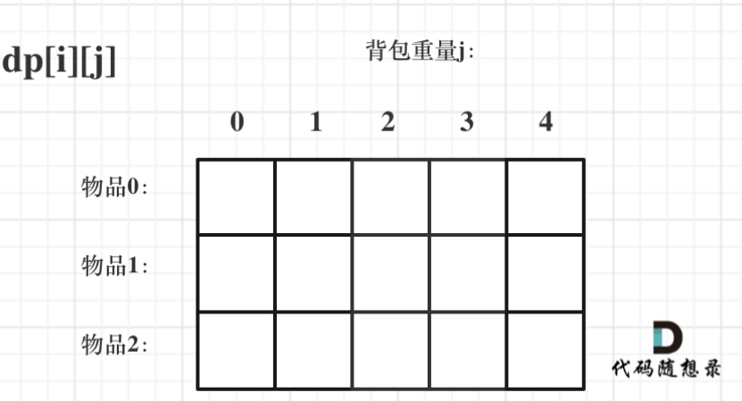
>
> 2. 回顾dp定义，`dp[i][j]`可以由两个方向递推出来：
>
> * 不放物品i:由`dp[i - 1][j]`推出，即背包容量为j，里面不放物品i的最大价值，`此时dp[i][j]就是dp[i - 1][j]`。(其实就是当物品i的重量大于背包j的重量时，物品i无法放进背包中，所以被背包内的价值依然和前面相同。)
> * 放物品i：``由dp[i - 1][j - weight[i]]推出，dp[i - 1][j - weight[i]] 为背包容量为j - weight[i]的时候不放物品i的最大价值，那么dp[i - 1][j - weight[i]] + value[i] （物品i的价值），就是背包放物品i得到的最大价值``
> * 因此：`dp[i][j] = max(dp[i - 1][j], dp[i - 1][j - weight[i]] + value[i])`
>
> 3. 初始化dp：只初始化第一行
>
>    * 从`dp[i][j]`的定义出发，如果背包容量j为0的话，即`dp[i][0]`，无论是选取哪些物品，背包价值总和一定为0.
>
>    * 再看其他情况:
>
>      * 状态转移方程 `dp[i][j] = max(dp[i - 1][j], dp[i - 1][j - weight[i]] + value[i])`; 可以看出i 是由 i-1 推导出来，那么i为0的时候就一定要初始化。
>
>      * `dp[0][j]`，即：i为0，存放编号0的物品的时候，各个容量的背包所能存放的最大价值。
>
>        那么很明显
>
>        * 当 j < weight[0]的时候，`dp[0][j]` 应该是 0，因为背包容量比编号0的物品重量还小。
>
>        * 当j >= weight[0]时，`dp[0][j]` 应该是value[0]，因为背包容量放足够放编号0物品。
>
>      ```js
>      for (int j = 0 ; j < weight[0]; j++) {  // 当然这一步，如果把dp数组预先初始化为0了，这一步就可以省略，但很多同学应该没有想清楚这一点。
>          dp[0][j] = 0;
>      }
>      // 正序遍历
>      for (int j = weight[0]; j <= bagweight; j++) {
>          dp[0][j] = value[0];
>      }
>      ```
>
>    
>
>    `dp[0][j] 和 dp[i][0]` 都已经初始化了，那么其他下标应该初始化多少呢？
>
>    其实从递归公式： `dp[i][j] = max(dp[i - 1][j], dp[i - 1][j - weight[i]] + value[i])`; 可以看出`dp[i][j] `是由左上方数值推导出来了，那么 其他下标初始为什么数值都可以，因为`都会被覆盖`。
>
>    **初始-1，初始-2，初始100，都可以！**
>
>    但只不过一开始就统一把dp数组统一初始为0，更方便一些。
>
>    最后，初始化代码如下：
>
>    ```js
>    // 初始化 dp
>    vector<vector<int>> dp(weight.size(), vector<int>(bagweight + 1, 0));
>    for (int j = weight[0]; j <= bagweight; j++) {
>        dp[0][j] = value[0];
>    }
>    ```
>
> 4. 确定遍历顺序
>
>    在如下图中，可以看出，有两个遍历的维度：物品与背包重量
>
>    
>
>    那么问题来了，**先遍历 物品还是先遍历背包重量呢？**
>
>    **其实都可以！！ 但是先遍历物品更好理解**。
>
>    先遍历物品，再遍历背包重量的代码：
>
>    ```js
>    // weight数组的大小 就是物品个数
>    for(int i = 1; i < weight.size(); i++) { // 遍历物品
>        for(int j = 0; j <= bagweight; j++) { // 遍历背包容量
>            if (j < weight[i]) dp[i][j] = dp[i - 1][j]; 
>            else dp[i][j] = max(dp[i - 1][j], dp[i - 1][j - weight[i]] + value[i]);
>    
>        }
>    }
>    ```
>
> 5. 举例推导：
>
>    
>
>    ​	
>
> ```js
> let weight = [1, 3, 4];
> let value = [15, 20, 30];
> let bagWeight = 4;
> 
> console.log(weightProblem(weight, value, bagWeight));
> 
> function weightProblem(weight, value, bagWeight) {
>     let len = weight.length;
>     // dp二维数组： 表示从下标为[0-i]的物品里任意取，放进容量为j的背包，价值总和最大是多少。
>     let dp = new Array(len).fill(0).map(() => new Array(bagWeight + 1).fill(0));
> 
>     // 注意：dp数组预先初始化为0，所以省略了j < weight[0]的初始化
>     // 对于dp的第一排：背包容量大于weight[0]的时候，背包可以放value[0]，注意dp的定义
>     for (let j = weight[0]; j <= bagWeight; j++) {
>         dp[0][j] = value[0];
>     }
> 
>     // weight 数组的大小，就是物品的个数
>     for (let i = 1; i < len; i++) { // 遍历物品
>         for (let j = 0; j <= bagWeight; j++) { // 遍历背包容量
>             if (j < weight[i]) {
>                 dp[i][j] = dp[i - 1][j];
>             } else {
>                 dp[i][j] = Math.max(
>                     dp[i - 1][j],
>                     dp[i - 1][j - weight[i]] + value[i]
>                 )
>             }
>         }
>     }
>     console.log(dp);
>     return dp[len - 1][bagWeight];
> }
> ```
>

### 0-1背包理论基础-一维数组-滚动数组

> 题目同上，但是注意value的值要保证都是正整数

> dp五部曲
>
> 1. `dp[j]`：容量为j的背包，所背的物品价值最大为dp[j]
>
> 2. 递推公式
>
>    dp[j]可以通过dp[j - weight[i]]推导出来，
>
>    dp[j - weight[i]]表示容量为j - weight[i]的背包所背的最大价值。
>
>    dp[j - weight[i]] + value[i] 表示 容量为 j - 物品i重量 的背包 加上 物品i的价值。（也就是容量为j的背包，放入物品i了之后的价值即：dp[j]）
>
>    此时dp[j]有两个选择，一个是取自己dp[j] 相当于 二维dp数组中的`dp[i-1][j]`，即不放物品i，一个是取dp[j - weight[i]] + value[i]，即放物品i，指定是取最大的，毕竟是求最大价值
>
>    `dp[j] = max(dp[j], dp[j - weight[i]] + value[i]);`
>
> 3. 一维初始化
>
>    依据dp[j]的定义，dp[0]为0
>
>    如果题目给的价值都是正整数那么非0下标都	初始化为0就可以了。**这样才能让dp数组在递归公式的过程中取的最大的价值，而不是被初始值覆盖了**。
>
> 4. 遍历顺序
>
>    先遍历物品，再遍历背包容量，`不可颠倒` ，因为背包容量要倒序遍历，如果遍历背包容量放在上一层，那么每个dp[j]就只会放入一个物品，即：背包里只放入了一个物品。
>
>    遍历背包容量要`从后往前`，保证物品i只被放一次
>
> 5. 举例
>
>    
>
> ```js
> let weight = [1, 3, 4];
> let value = [15, 20, 30];
> let bagWeight = 4;
> 
> console.log(weightProblem(weight, value, bagWeight));
> 
> function weightProblem(weight, value, bagWeight) {
>     let dp = new Array(bagWeight + 1).fill(0);
> 
>     for (let i = 0; i < weight.length; i++) { // 先遍历物品
>         for (let j = bagWeight; j >= weight[i]; j--) { // 再遍历背包容量，顺序不能乱，而且必须倒序遍历
>             dp[j] = Math.max(dp[j], dp[j - weight[i]] + value[i]);
>         }
>     }
>     console.log(dp);
>     return dp[bagWeight];
> }
> ```
>

### [416. 分割等和子集](https://leetcode.cn/problems/partition-equal-subset-sum/)

> [labuladong 题解](https://labuladong.github.io/article/?qno=416)[思路](https://leetcode.cn/problems/partition-equal-subset-sum/#)
>
> 给你一个 **只包含正整数** 的 **非空** 数组 `nums` 。请你判断是否可以将这个数组分割成两个子集，使得两个子集的元素和相等。
>
>  
>
> **示例 1：**
>
> ```
> 输入：nums = [1,5,11,5]
> 输出：true
> 解释：数组可以分割成 [1, 5, 5] 和 [11] 。
> ```

> 这题可以用回溯，会超时，直接考虑01背包，为什么是01背包：
>
> **即一个商品如果可以重复多次放入是完全背包，而只能放入一次是01背包，写法还是不一样的。**
>
> 本题中商品只使用一次，所以就是01背包
>
> 当然，本题有解的条件是集合里要出现总和为sum/2的子集
>
> > - 背包的体积为sum / 2
> > - 背包要放入的商品（集合里的元素）`重量`为 元素的数值，`价值也`为元素的数值
> > - 背包如果正好装满，说明找到了总和为 sum / 2 的子集。
> > - 背包中每一个元素是不可重复放入。
>
> dp五部曲：
>
> > 1. dp[j]：背包容量为j时，所背的最大价值
> >
> > 2. 递推公式
> >
> >    01背包递推公式：`dp[j] = max(dp[j], dp[j - weight[i]] + value[i]);`
> >
> >    本题重量和价值都是nums[i]，所以
> >
> >    `dp[j] = max(dp[j], dp[j - nums[i]] + nums[i])`;
> >
> > 3. 初始化：
> >
> >    从dp[j]的定义来看，首先dp[0]一定是0。
> >
> >    如果题目给的价值都是正整数那么非0下标都初始化为0就可以了，如果题目给的价值有负数，那么非0下标就要初始化为负无穷。
> >
> >    **这样才能让dp数组在递归公式的过程中取的最大的价值，而不是被初始值覆盖了**。
> >
> >    本题题目中 只包含正整数的非空数组，所以非0下标的元素初始化为0就可以
> >
> > 4. 遍历顺序：
> >
> >    上一节说过：如果使用一维dp数组，物品遍历的for循环放在外层，遍历背包的for循环放在内层，且内层for循环倒序遍历！
> >
> > 5. 举例推导：
> >
> >    dp[j]的数值一定是小于等于j的。
> >
> >    **如果dp[j] == j 说明，集合中的子集总和正好可以凑成总和j，理解这一点很重要。**
> >
> >    用例1，输入[1,5,11,5] 为例，如图：
> >
> >    
> >
> >    

> ```js
> var canPartition = function(nums) {
>     // 对数组求和
>     let total = nums.reduce((a, b) => a + b, 0);
>     // 判断和是否为偶数
>     if (total % 2 == 1) return false;
>     let taget = total / 2;
>     // dp[j]：背包容量为j时，所背的最大价值，价值===重量
>     let dp = new Array(taget + 1).fill(0);
>     // 开始01背包，先物品，后背包重量（倒序避免重复）
>     for (let i = 0; i < nums.length; i++) {
>         for (let j = taget; j >= nums[i]; j--) {
>             dp[j] = Math.max(dp[j], dp[j - nums[i]] + nums[i]);
>         }
>     }
>     return dp[taget] == taget; 
> };
> ```

### [1049. 最后一块石头的重量 II](https://leetcode.cn/problems/last-stone-weight-ii/)

> 有一堆石头，用整数数组 `stones` 表示。其中 `stones[i]` 表示第 `i` 块石头的重量。
>
> 每一回合，从中选出**任意两块石头**，然后将它们一起粉碎。假设石头的重量分别为 `x` 和 `y`，且 `x <= y`。那么粉碎的可能结果如下：
>
> - 如果 `x == y`，那么两块石头都会被完全粉碎；
> - 如果 `x != y`，那么重量为 `x` 的石头将会完全粉碎，而重量为 `y` 的石头新重量为 `y-x`。
>
> 最后，**最多只会剩下一块** 石头。返回此石头 **最小的可能重量** 。如果没有石头剩下，就返回 `0`。
>
>  
>
> **示例 1：**
>
> ```
> 输入：stones = [2,7,4,1,8,1]
> 输出：1
> 解释：
> 组合 2 和 4，得到 2，所以数组转化为 [2,7,1,8,1]，
> 组合 7 和 8，得到 1，所以数组转化为 [2,1,1,1]，
> 组合 2 和 1，得到 1，所以数组转化为 [1,1,1]，
> 组合 1 和 1，得到 0，所以数组转化为 [1]，这就是最优值。
> ```

> 本题就是尽量让石头分成重量相同的两堆，相撞之后剩下的石头最小，这样就可以化解为01背包问题
>
> 重量为 stones[i]，物品价值也为stones[i]，对应01背包里的weight[i]和values[i]
>
> dp五部曲
>
> > 1. dp[j]：容量（或者说重量）为j的背包，最多可以背dp[j]这么重的石头
> >
> > 2. 递推公式：**dp[j] = max(dp[j], dp[j - stones[i]] + stones[i]);**
> >
> > 3. 初始化：
> >
> >    把石头遍历一遍，计算出石头总重量 然后除2，得到dp数组的大小。
> >
> >    如何初始化dp[j]呢，因为重量都不会是负数，所以dp[j]都初始化为0就可以了，这样在递归公式dp[j] = max(dp[j], dp[j - stones[i]] + stones[i]);中dp[j]才不会初始值所覆盖。
> >
> > 4. 确定遍历顺序：
> >
> >    如果使用一维dp数组，物品遍历的for循环放在外层，遍历背包容量的for循环放在内层，且内层for循环倒序遍历！
> >
> > 5. 举例推导dp数组
> >
> >    输入：[2,4,1,1]，此时target = (2 + 4 + 1 + 1)/2 = 4 ，dp数组状态图如下：
> >
> >    
> >
> > 6. 最后dp[target]里是容量为target的背包所能背的最大重量。
> >
> >    那么分成两堆石头，一堆石头的总重量是dp[target]，另一堆就是sum - dp[target]。
> >
> >    **在计算target的时候，target = sum / 2 因为是向下取整，所以sum - dp[target] 一定是大于等于dp[target]的**。
> >
> >    那么相撞之后剩下的最小石头重量就是 (sum - dp[target]) - dp[target]。

### [494. 目标和](https://leetcode.cn/problems/target-sum/)

> [labuladong 题解](https://labuladong.github.io/article/?qno=494)[思路](https://leetcode.cn/problems/target-sum/#)
>
> 给你一个整数数组 `nums` 和一个整数 `target` 。
>
> 向数组中的每个整数前添加 `'+'` 或 `'-'` ，然后串联起所有整数，可以构造一个 **表达式** ：
>
> - 例如，`nums = [2, 1]` ，可以在 `2` 之前添加 `'+'` ，在 `1` 之前添加 `'-'` ，然后串联起来得到表达式 `"+2-1"` 。
>
> 返回可以通过上述方法构造的、运算结果等于 `target` 的不同 **表达式** 的数目。
>
>  
>
> **示例 1：**
>
> ```
> 输入：nums = [1,1,1,1,1], target = 3
> 输出：5
> 解释：一共有 5 种方法让最终目标和为 3 。
> -1 + 1 + 1 + 1 + 1 = 3
> +1 - 1 + 1 + 1 + 1 = 3
> +1 + 1 - 1 + 1 + 1 = 3
> +1 + 1 + 1 - 1 + 1 = 3
> +1 + 1 + 1 + 1 - 1 = 3
> ```

> 解法1，回溯
>
> 这题可以用回溯去解决，这里暂时略过

> 解法2，动态规划
>
> 动态规划之前需要先分析一下题意，即如何转换成01背包问题
>
> * 假设加法的总和为 left ，减法的总和为 right，那么 lfet + right 恒等于 数组nums的总和sum
>
> * 题目需要求得是 left - right == target 的组合数
>
> * 即：left - （sum - left）== target => left = （target + sum）/ 2
>
> * 问题就转换成了，装满容量为left的背包，共有多少种方案
>
> * 但是，有个需要担心的地方就是：（target + sum）必须能够被2整除 && target 的绝对值不能大于 sum，这两种都是没有方案的
>
>   ```js
>   if ((target + sum) % 2 == 1) return 0; // 此时没有方案
>   if (Math.abs(target) > sum) return 0; // 此时同样没有方案
>   ```
>
> 为什么说是01背包问题呢？因为每个物品（就是题目中每个数字）只用一次，不过这次背包问题有其特殊之处，之前求的是容量为j的背包能装多少
>
> 本题则求的是装满有几种方法。其实就是组合问题了。
>
> dp五部曲开始
>
> > 1. 确定dp数组的下标及其含义：dp[j] ,表示填满j（包括j）这么大容积的包，有dp[j]种方法
> >
> > 2. 确定递推公式
> >
> >    思考一下哪些来源可以推出dp[j]?
> >
> >    不考虑nums[i]的情况下，填满容量为j - nums[i] 的背包，有dp[i - nums[i]]中方法
> >
> >    那么只要知道nums[i]的话，凑成dp[j]，就有dp[i - nums[i]]中方法。
> >
> >    例如：dp[j]，j为5
> >
> >    - 已经有一个1（nums[i]） 的话，有 dp[4]种方法 凑成 dp[5]。
> >    - 已经有一个2（nums[i]） 的话，有 dp[3]种方法 凑成 dp[5]。
> >    - 已经有一个3（nums[i]） 的话，有 dp[2]中方法 凑成 dp[5]
> >    - 已经有一个4（nums[i]） 的话，有 dp[1]中方法 凑成 dp[5]
> >    - 已经有一个5 （nums[i]）的话，有 dp[0]中方法 凑成 dp[5]
> >
> >    那么凑整dp[5]有多少方法呢，也就是把 所有的 dp[j - nums[i]] 累加起来。
> >
> >    所以求组合类问题的公式，都是类似这种：
> >
> >    ```js
> >    dp[j] += dp[j - nums[i]]
> >    ```
> >
> > 3. dp数组如何初始化
> >
> >    从递归公式可以看出，在初始化的时候dp[0] 一定要初始化为1，因为dp[0]是在公式中一切递推结果的起源，如果dp[0]是0的话，递归结果将都是0。
> >
> >    dp[0] = 1，理论上也很好解释，装满容量为0的背包，有1种方法，就是装0件物品。
> >
> >    dp[j]其他下标对应的数值应该初始化为0，从递归公式也可以看出，dp[j]要保证是0的初始值，才能正确的由dp[j - nums[i]]推导出来。
> >
> > 4. 遍历顺序
> >
> >    对于01背包问题一维dp的遍历，nums放在外循环，target在内循环，且内循环倒序。
> >
> > 5. 举例
> >
> >    输入：nums: [1, 1, 1, 1, 1], S: 3
> >
> >    bagSize = (S + sum) / 2 = (3 + 5) / 2 = 4
> >
> >    dp数组状态变化如下：
> >
> >    
>
> ```js
> var findTargetSumWays = function(nums, target) {
>     let sum = nums.reduce((a, b) => a + b, 0);
>     // left - (sum - left) == target
>     // left == (target + sum) / 2
>     if ((target + sum) % 2 == 1) return 0;
>     if (Math.abs(target) > sum) return 0;
>     let bagWeight = Math.floor((target + sum) / 2); 
>     // dp[j]：填满j这么大容量的包，有dp[j]种方法
>     let dp = new Array(bagWeight + 1).fill(0);
>     dp[0] = 1;
>     for (let i = 0; i < nums.length; i++) {
>         for (let j = bagWeight; j >= nums[i]; j--) {
>             dp[j] += dp[j - nums[i]];
>         }
>     }
>     return dp[bagWeight];
> };
> ```
>

### [474. 一和零](https://leetcode.cn/problems/ones-and-zeroes/)

> 难度中等721
>
> 给你一个二进制字符串数组 `strs` 和两个整数 `m` 和 `n` 。
>
> 请你找出并返回 `strs` 的最大子集的长度，该子集中 **最多** 有 `m` 个 `0` 和 `n` 个 `1` 。
>
> 如果 `x` 的所有元素也是 `y` 的元素，集合 `x` 是集合 `y` 的 **子集** 。
>
>  
>
> **示例 1：**
>
> ```
> 输入：strs = ["10", "0001", "111001", "1", "0"], m = 5, n = 3
> 输出：4
> 解释：最多有 5 个 0 和 3 个 1 的最大子集是 {"10","0001","1","0"} ，因此答案是 4 。
> 其他满足题意但较小的子集包括 {"0001","1"} 和 {"10","1","0"} 。{"111001"} 不满足题意，因为它含 4 个 1 ，大于 n 的值 3 。
> ```
>
> 不好想，完全没有联想到可以用01背包来做
>
> str数组里的元素就是物品，每一个物品都是一个（符合01背包特征）
>
> m和n相当于是一个背包，，两个维度的背包，一个m一个n，不同长度的字符串就是不同大小的待装物品
>
> 开始dp五部曲
>
> > 1. 确定`dp[i][j]`的含义：最多有i个0和j个1的strs的最大子集的大小为`dp[i][j]`
> >
> > 2. 确定递推公式：
> >
> >    `dp[i][j]`可以由前一个strs里的字符串推导出来，strs里的字符串有zeroNum个0，oneNum个1
> >
> >    `dp[i][j]`就可以是`dp[i - zeroNum][j - oneNum] + 1`
> >
> >    然后在遍历过程中，取`dp[i][j]`的最大值
> >
> >    所以递推公式就是 `dp[i][j] = Math.max(dp[i][j], dp[i - zeroNum][j - oneNum] + 1)`
> >
> >    ps:对比一下01背包的递推公式：`dp[j] = max(dp[j], dp[j - weight[i]] + value[i]);`
> >
> >    对比可以发现，字符串的zeroNum和oneNum就相当于物品的重量weight[i]，字符串本身的个数相当于物品的价值value[i]
> >
> > 3. 初始化，物品价值不会是负数，初始为0，保证递推的时候`dp[i][j]`不会被初始值覆盖
> >
> > 4. 遍历顺序，在01背包滚动数组中，01背包中外层for遍历物品，内层for遍历`背包容量`而且`从后往前`遍历
> >
> >    本题也是，物品就是str中的字符串，**背包容量就是题目描述中的m和n**，m和n顺序没有讲究，都可以，要注意的每个物品（字符串）的0
> >
> >    和1的数量是不一样的
> >
> > 5. 举例推导dp数组:
> >
> >    以输入：["10","0001","111001","1","0"]，m = 3，n = 3为例
> >
> >    
>
> ```js
> var findMaxForm = function(strs, m, n) {
>     // dp[i][j]：最多有i个0和j个1的strs的最大子集的大小为dp[i][j]
>     let dp = new Array(m + 1).fill(0).map(() => new Array(n + 1).fill(0));
>     let zeroNum, oneNum;
>     for (let str of strs) { // 遍历物品
>         zeroNum = 0, oneNum = 0;
>         for (let cur of str) {
>             cur == '0' ? zeroNum++ : oneNum++;
>         }
>         for (let i = m; i >= zeroNum; i--) { // 遍历背包容量，两个维度遍历，而且都是从后往前遍历
>             for (let j = n; j >= oneNum; j--) {
>                 dp[i][j] = Math.max(dp[i][j], dp[i - zeroNum][j - oneNum] + 1)
>             }
>         }
>     }
>     return dp[m][n];
> };
> ```

### 完全背包理论基础-物品数量有限制

> 有N件物品和一个最多能背重量为W的背包。
>
> 第i件物品的重量是weight[i]，得到的价值是value[i] 。**每件物品都有无限个（也就是可以放入背包多次）**，求解将哪些物品装入背包里物品价值总和最大。
>
> **完全背包和01背包问题唯一不同的地方就是，每种物品有无限件**。
>
> 同样leetcode上没有纯完全背包问题，都是需要完全背包的各种应用，需要转化成完全背包问题，所以我这里还是以纯完全背包问题进行讲解理论和原理。
>
> 例子：
>
> 背包最大重量为4。
>
> 物品为：
>
> |       | 重量 | 价值 |
> | ----- | ---- | ---- |
> | 物品0 | 1    | 15   |
> | 物品1 | 3    | 20   |
> | 物品2 | 4    | 30   |
>
> **每件商品都有无限个！**
>
> 问背包能背的物品最大价值是多少？

> 分析：
>
> 01背包和完全背包唯一不同就是体现在遍历顺序上，所以本文就不去做动规五部曲了，直接针对遍历顺序经行分析！
>
> 01背包的核心代码：
>
> ```js
> for(int i = 0; i < weight.size(); i++) { // 遍历物品
>     for(int j = bagWeight; j >= weight[i]; j--) { // 遍历背包容量
>         dp[j] = max(dp[j], dp[j - weight[i]] + value[i]);
>     }
> }
> ```
>
> **01背包内嵌的循环是从大到小遍历，为了保证每个物品仅被添加一次**。
>
> **而完全背包的物品是可以添加多次的，所以要从小到大去遍历，即：**
>
> ```js
> // 先遍历物品，再遍历背包
> for(int i = 0; i < weight.size(); i++) { // 遍历物品
>     for(int j = weight[i]; j <= bagWeight ; j++) { // 遍历背包容量
>         dp[j] = max(dp[j], dp[j - weight[i]] + value[i]);
> 
>     }
> }
> ```
>
> > 这里要注意，为什么遍历物品在外层循环，遍历背包容量在外层循环？
> >
> > **在完全背包中，对于一维dp数组来说，其实两个for循环嵌套顺序同样无所谓！**
> >
> > 因为dp[j] 是根据 下标j之前所对应的dp[j]计算出来的	。 只要保证下标j之前的dp[j]都是经过计算的就可以了。
> >
> > 这里默认用外层物品，内层背包容量的顺序
>
> 
>
> ```js
> /**
>  * 多重背包
>  * 每个物品无限个
>  */
> 
> let weight = [1, 3, 4];
> let value = [15, 20, 30];
> let bagWeight = 4;
> 
> console.log(weightProblem(weight, value, bagWeight));
> 
> function weightProblem(weight, value, bagWeight) {
>     // dp[j]：容量为j的背包最多能装的价值为dp[j]
>     let dp = new Array(bagWeight + 1).fill(0);
>     for (let i = 0; i < weight.length; i++) {
>         for (let j = weight[i]; j <= bagWeight; j++) {
>             dp[j] = Math.max(dp[j], dp[j - weight[i]] + value[i]);
>         }
>     }
>     console.log(dp);
>     return dp[bagWeight];
> }
> ```

### [518. 零钱兑换 II](https://leetcode.cn/problems/coin-change-2/)

> [labuladong 题解](https://labuladong.github.io/article/?qno=518)[思路](https://leetcode.cn/problems/coin-change-2/#) 
>
> 给你一个整数数组 `coins` 表示不同面额的硬币，另给一个整数 `amount` 表示总金额。
>
> 请你计算并返回可以凑成总金额的硬币组合数。如果任何硬币组合都无法凑出总金额，返回 `0` 。
>
> 假设每一种面额的硬币有无限个。 
>
> 题目数据保证结果符合 32 位带符号整数。
>
>  
>
> 
>
> **示例 1：**
>
> ```
> 输入：amount = 5, coins = [1, 2, 5]
> 输出：4
> 解释：有四种方式可以凑成总金额：
> 5=5
> 5=2+2+1
> 5=2+1+1+1
> 5=1+1+1+1+1
> ```

> "钱币数量不限"---典型的完全背包问题
>
> 但和纯完全背包有不一样的地方：纯完全背包是否能凑成总金额，本题要求求凑成总金额的个数
>
> 另外要注意的是，题目描述的是凑成总金额的`硬币组合数`
>
> > ps:注意与排列的区分，组合不强调元素之间顺序，排列强调元素之间的顺序
>
> dp五部曲
>
> > 1. 确定dp[j]：凑成总金额j的货币组合数为dp[j]
> >
> > 2. 确定递推公式
> >
> >    dp[j]（考虑coins[i]的组合）就是所有的的dp[j - coins[i]]（不考虑coins[i]相加）
> >
> >    dp[j] += dp[j - coins[i]];
> >
> >    ps:**求装满背包有几种方法，一般公式都是：dp[j] += dp[j - nums[i]];**
> >
> > 3. dp数组初始化
> >
> >    首先dp[0]一定为1，此为递归公式的基础，含义上讲，dp[0]就是说凑成总金额0的货币组合数为1
> >
> > 4. 确定遍历顺序
> >
> >    外层遍历物品&&内层遍历背包  还是  外层遍历背包&&内层遍历物品 呢？
> >
> >    本题是要有固定顺序，不可以随意改变的！！！
> >
> >    因为纯完全背包求得是能否凑成总和，和凑成总和的元素有没有顺序没关系，即：有顺序也行，没有顺序也行！
> >
> >    而本题要求凑成**总和的组合数**，元素之间要求没有顺序。
> >
> >    所以纯完全背包是能凑成总和就行，不用管怎么凑的。
> >
> >    本题是**求凑出来的方案个数**，**且每个方案个数是为组合数**。
> >
> >    详解看代码随想录，举例说明，手动打印
> >
> > 5. 举例推导dp数组
> >
> >    输入: amount = 5, coins = [1, 2, 5] ，dp状态图如下：
> >
> >    
>
> ```js
> var change = function(amount, coins) {
>     // 凑成j总额有dp[j]种组合
>     let dp = new Array(amount + 1).fill(0);
>     dp[0] = 1;
>     for (let i = 0; i < coins.length; i++) { // 遍历顺序有讲究，先遍历物品
>         for (let j = coins[i]; j <= amount; j++) { // 后遍历背包容量
>             dp[j] += dp[j - coins[i]];
>         }
>     }
>     return dp[amount];
> };
> ```

### [377. 组合总和 Ⅳ](https://leetcode.cn/problems/combination-sum-iv/)-混淆视听，求的是排列！

> 难度中等638
>
> 给你一个由 **不同** 整数组成的数组 `nums` ，和一个目标整数 `target` 。请你从 `nums` 中找出并返回总和为 `target` 的元素组合的个数。
>
> 题目数据保证答案符合 32 位整数范围。
>
>  
>
> **示例 1：**
>
> ```
> 输入：nums = [1,2,3], target = 4
> 输出：7
> 解释：
> 所有可能的组合为：
> (1, 1, 1, 1)
> (1, 1, 2)
> (1, 2, 1)
> (1, 3)
> (2, 1, 1)
> (2, 2)
> (3, 1)
> 请注意，顺序不同的序列被视作不同的组合。
> ```
>
> 本题题目描述说是求组合，但`又说是可以元素相同顺序不同的组合算两个组合`，`**其实就是求排列！**`
>
> 弄清什么是组合，什么是排列很重要。
>
> 组合不强调顺序，(1,5)和(5,1)是同一个组合。
>
> 排列强调顺序，(1,5)和(5,1)是两个不同的排列。
>
> 本题求的是排列个数，如果需要列出排列，只能用回溯
>
> dp五部曲-完全背包
>
> > 1. dp[i]：凑成目标正整数为i的排列个数为dp[i]
> >
> > 2. 确定递推公式
> >
> >    dp[i]（考虑nums[j]）可以由 dp[i - nums[j]]（不考虑nums[j]） 推导出来。
> >
> >    因为只要得到nums[j]，排列个数dp[i - nums[j]]，就是dp[i]的一部分。
> >
> >    上面两题讲过，求装满背包有几种方法，递推公式一般都是dp[i] += dp[i - nums[j]];
> >
> >    本题一样
> >
> > 3. 初始化dp
> >
> >    dp递推公式的缘故，dp[0]要初始化为1，这样递归其他dp[i]的时候才会有数值基础。
> >
> >    至于dp[0] = 1 有没有意义呢？
> >
> >    **其实没有意义**，所以我也不去强行解释它的意义了，因为题目中也说了：给定目标值是正整数！ 所以dp[0] = 1是没有意义的，仅仅是为了推导递推公式。
> >
> >    至于非0下标的dp[i]应该初始为多少呢？
> >
> >    初始化为0，这样**才不会影响**dp[i]累加所有的dp[i - nums[j]]。
> >
> > 4. 确定遍历顺序
> >
> >    个数不限制使用，说明是个完全背包
> >
> >    得到的集合是排列，说明需要考虑元素之间的顺序
> >
> >    所以，**for循环的嵌套是有一个逻辑的**
> >
> >    **`如果求组合数就是外层for循环遍历物品，内层for遍历背包`**。
> >
> >    **`如果求排列数就是外层for遍历背包，内层for循环遍历物品`**。
> >
> >    所以本题遍历顺序最终遍历顺序：**target（背包）放在外循环，将nums（物品）放在内循环，`内循环从前到后`遍历**。
> >
> > 5. 举例推导
> >
> >    示例中的例子推导一下：
> >
> >    
> >
> >    ps:如果代码运行处的结果不是想要的结果，就把dp[i]都打出来，看看和我们推导的一不一样。
>
> ```js
> var combinationSum4 = function(nums, target) {
>     // dp[j]：凑成目标总数为j的排列个数为dp[j]
>     let dp = new Array(target + 1).fill(0);
>     dp[0] = 1;
>     // 对于组合（不在意先后顺序），先遍历物品，再遍历背包容量
>     // 对于排列（在意先后顺序），先遍历背包容量，再遍历物品
>     // j 代表的是容量，i代表的是物品
>     for (let j = 0; j <= target; j++) { // 先背包容量
>         for (let i = 0; i < nums.length; i++) { // 后物品
>             if (j >= nums[i]) { // 当背包容量大于等于物品重量时
>                 dp[j] += dp[j - nums[i]];
>             }
>         }
>     }
>     return dp[target];
> };
> ```

### [70. 爬楼梯](https://leetcode.cn/problems/climbing-stairs/)进阶-梅开二度-多重背包

> [思路](https://leetcode.cn/problems/climbing-stairs/#)
>
> 难度简单2424
>
> 假设你正在爬楼梯。需要 `n` 阶你才能到达楼顶。
>
> 每次你可以爬 `1` 或 `2` 个台阶。你有多少种不同的方法可以爬到楼顶呢？
>
>  
>
> **示例 1：**
>
> ```
> 输入：n = 2
> 输出：2
> 解释：有两种方法可以爬到楼顶。
> 1. 1 阶 + 1 阶
> 2. 2 阶
> ```

> 在爬楼梯的基础上，增加点难度：`改为：一步一个台阶，两个台阶，三个台阶，.......，直到 m个台阶。问有多少种不同的方法可以爬到楼顶呢？`
>
> 1阶，2阶，.... m阶就是物品，楼顶就是背包。
>
> 每一阶可以重复使用，例如跳了1阶，还可以继续跳1阶。
>
> 问跳到楼顶有几种方法其实就是问装满背包有几种方法。
>
> **此时大家应该发现这就是一个完全背包问题了！**
>
> 和377题几乎是一道题
>
> dp五部曲
>
> > 1. dp[i]：爬到有i个台阶的楼顶，有dp[i]种方法
> >
> > 2. 确定递推公式：
> >
> >    在前面讲过，求装满背包有几种方法，递推公式一般都是dp[i] += dp[i - nums[j]];
> >
> >    本题，dp[i]有几种来源，dp[i - 1]、dp[i - 2]、dp[i - 3]等等，即dp[i - j]
> >
> >    所以递推公式为dp[i] += dp[i - j]
> >
> > 3. dp数组初始化
> >
> >    既然递归公式是 dp[i] += dp[i - j]，那么dp[0] 一定为1，dp[0]是递归中一切数值的基础所在，如果dp[0]是0的话，其他数值都是0了。
> >
> >    下标非0的dp[i]初始化为0，因为dp[i]是靠dp[i-j]累计上来的，dp[i]本身为0这样才不会影响结果
> >
> > 4. 确定遍历顺序
> >
> >    这是背包里求`排列问题`，即：**1、2 步 和 2、1 步都是上三个台阶，但是这两种方法不一样！**
> >
> >    所以需将target（背包容量）放在外循环，将nums（物品重量）放在内循环。
> >
> >    每一步可以走多次，这是完全背包，内循环需要从前向后遍历。
> >
> > 5. 举例推导dp
> >
> >    和377几乎一样
>
> > ps:代码中weight表示最多可以爬weight个台阶，代码中把weight改成2就是本题70.爬楼梯可以AC的代码了。
>
> ```js
> var climbStairs = function(n) {
>     let dp = new Array(n + 1).fill(0);
>     let weight = [1, 2];
>     dp[0] = 1;
>     for (let i = 0; i <= n; i++) { // 先遍历背包
>         for (let j = 0; j < weight.length; j++) { // 再遍历物品
>             if (i >= weight[j]) {
>                 dp[i] += dp[i - weight[j]];
>             }
>         }
>     }
>     console.log(dp);
>     return dp[n];
> };
> 
> console.log(climbStairs(9));
> ```

### [322. 零钱兑换](https://leetcode.cn/problems/coin-change/)

> [labuladong 题解](https://labuladong.github.io/article/?qno=322)[思路](https://leetcode.cn/problems/coin-change/#)
>
> 给你一个整数数组 `coins` ，表示不同面额的硬币；以及一个整数 `amount` ，表示总金额。
>
> 计算并返回可以凑成总金额所需的 **最少的硬币个数** 。如果没有任何一种硬币组合能组成总金额，返回 `-1` 。
>
> 你可以认为每种硬币的数量是无限的。
>
>  
>
> **示例 1：**
>
> ```
> 输入：coins = [1, 2, 5], amount = 11
> 输出：3 
> 解释：11 = 5 + 5 + 1
> ```

> 这次是求零钱兑换所需的最少的硬币个数，硬币数量无线--物品数量无限 ： 典型的完全背包
>
> dp五部曲
>
> > 1. 确定dp数组的含义，dp[j]：凑成总和为j所需的最少硬币个数为dp[j]
> >
> > 2. 确定递推公式：
> >
> >    得到dp[j]，只有一个来源，dp[j - coins[i]]（没有考虑coins[i]）
> >
> >    凑足总额为j - coins[i]的最少个数为dp[j - coins[i]]，那么只需要加上一个钱币coins[i]即dp[j - coins[i]] + 1就是dp[j]（考虑coins[i]）
> >
> >    所以dp[j] 要取所有 dp[j - coins[i]] + 1 中最小的。
> >
> >    递推公式：dp[j] = min(dp[j - coins[i]] + 1, dp[j]);
> >
> > 3. dp数组初始化：
> >
> >    凑成总金额0所需钱币的个数一定是0，那么dp[0] = 0
> >
> >    其它下标呢？考虑递推特性，找的是最小的，所以dp数组要初始化成最大的数，避免影响到递推
> >
> >    即：dp[j]必须初始化为一个最大的数，否则就会在min(dp[j - coins[i]] + 1, dp[j])比较的过程中被初始值覆盖。
> >
> >    所以下标非0的元素都是应该是最大值。
> >
> > 4. 确定遍历顺序
> >
> >    求钱币的最小个数，那么钱币有顺序和没有顺序都可以，都不影响钱币的最小个数
> >
> >    所以不强调遍历顺序，按照惯例先物品后背包就可以了，内循环正序
> >
> >    再回顾一下：
> >
> >    **如果求组合数就是外层for循环遍历物品，内层for遍历背包**。
> >
> >    **如果求排列数就是外层for遍历背包，内层for循环遍历物品**。
> >
> >    综上所述，遍历顺序为：coins（物品）放在外循环，target（背包）在内循环。且内循环正序。
> >
> > 5. 举例推导dp数组
> >
> >    以输入：coins = [1, 2, 5], amount = 5为例
> >
> >    
>
> ```js
> var coinChange = function(coins, amount) {
>     // dp[j]：凑成总金额为j所需的最少钱币数为dp[j]
>     let dp = new Array(amount + 1).fill(Infinity);
>     dp[0] = 0;
>     for (let i = 0; i < coins.length; i++) { // 先遍历物品，为什么从0开始取？
>         for (let j = coins[i]; j <= amount; j++) { // 再遍历背包，为什么从coins[i]开始取？因为j是背包最大容量，coins[i]是物品重量
>             dp[j] = Math.min(dp[j], dp[j - coins[i]] + 1);
>         }
>     }
>     return dp[amount] == Infinity ? -1 : dp[amount];
> };
> ```

### [279. 完全平方数](https://leetcode.cn/problems/perfect-squares/)

> 给你一个整数 `n` ，返回 *和为 `n` 的完全平方数的最少数量* 。
>
> **完全平方数** 是一个整数，其值等于另一个整数的平方；换句话说，其值等于一个整数自乘的积。例如，`1`、`4`、`9` 和 `16` 都是完全平方数，而 `3` 和 `11` 不是。
>
>  
>
> **示例 1：**
>
> ```
> 输入：n = 12
> 输出：3 
> 解释：12 = 4 + 4 + 4
> ```

> 找出与完全背包的关联：
>
> **完全平方数就是物品（可以无限件使用），凑个正整数n就是背包，问凑满这个背包最少有多少物品？**
>
> 和322零钱兑换几乎一模一样
>
> dp五部曲
>
> > 1. 确定dp数组，dp[j]：和为j的完全平方数的最少数量为dp[j]
> > 2. 确定递推公式
> >
> > ​    dp[j] 可以由dp[j - i * i]推出， dp[j - i * i] + 1 便可以凑成dp[j]。
> >
> > ​    此时我们要选择最小的dp[j]，所以递推公式：dp[j] = min(dp[j - i * i] + 1, dp[j]);
> >
> > 3. dp数组初始化
> >
> >    dp[0]表示 和为0的完全平方数的最小数量，那么dp[0]一定是0。
> >
> >    但是有个疑问：0 * 0 也算是一种啊，为啥dp[0] 就是 0呢？
> >
> >    看题目描述，找到若干个完全平方数（比如 1, 4, 9, 16, ...），**题目描述中没说要从0开始**，dp[0]=0**完全是为了递推公式**。
> >
> >    非0下标的dp[j]应该是多少呢？
> >
> >    从递归公式dp[j] = min(dp[j - i * i] + 1, dp[j]);中可以看出每次dp[j]都要选最小的，**所以非0下标的dp[j]一定要初始为最大值，这样dp[j]在递推的时候才不会被初始值覆盖**。
> >
> > 4. 确定遍历顺序
> >
> >    组合的话，就是外层遍历物品，内层遍历背包
> >
> >    排列的话，就是外层遍历背包，内层遍历物品
> >
> >    本题都可以
> >
> > 5. 举例推导
> >
> >    已输入n为5例，dp状态图如下：
> >
> >    
>
> ```js
> var numSquares = function(n) {
>     // dp[j]：和为j的完全平方数的最少数量为dp[j]
>     let dp = new Array(n + 1).fill(Infinity);
>     dp[0] = 0; // 无意义，为了递推公式
>     for (let i = 1; i * i <= n; i++) { // 先物品，n大于0，所以物品大于0
>         for (let j = 1; j <= n; j++) { // 后背包，为什么从1开始取？容量不可能为0，题目要求的
>             if (j - i * i >= 0) {
>                 dp[j] = Math.min(dp[j], dp[j - i * i] + 1);
>             }
>         }
>     }
>     return dp[n];
> };
> ```
>

### [139. 单词拆分](https://leetcode.cn/problems/word-break/)

> [思路](https://leetcode.cn/problems/word-break/#)
>
> 给你一个字符串 `s` 和一个字符串列表 `wordDict` 作为字典。请你判断是否可以利用字典中出现的单词拼接出 `s` 。
>
> **注意：**不要求字典中出现的单词全部都使用，并且字典中的单词可以重复使用。
>
>  
>
> **示例 1：**
>
> ```
> 输入: s = "leetcode", wordDict = ["leet", "code"]
> 输出: true
> 解释: 返回 true 因为 "leetcode" 可以由 "leet" 和 "code" 拼接成。
> ```

> 解法1，可以用回溯，后续再看，主要学习dp
>
> 解法2，dp-完全背包
>
> 字典中的单词就是物品，字符串s就是背包，单词能否组成字符串，就是问物品能不能把背包装满
>
> 拆分时可以重复使用字典中的单词，说明是一个完全背包
>
> dp五部曲开始
>
> > 1. 确定dp数组及其下标含义
> >
> >    dp[i]：字符串长度为i的话，dp[i]为true则表示可以拆分为一个或多个在字典中出现的单词
> >
> > 2. 确定递推公式
> >
> >    j<i时，如果确定dp[j]是true，且[j, i]这个区间的子串出现在字典里，那么dp[i]一定为true
> >
> >    j的这个值就是 i - wordDic[j].length
> >
> >    所以递推公式是：
> >
> >    if([j, i]这个区间的子串出现在字典里 && dp[j]是true）
> >
> >    ​	dp[i] = true
> >
> > 3. dp数组初始化
> >
> >    从递推公式可以看出，dp[i]的状态依靠dp[j]，那么dp[0]就是递推的根基，dp[0]一定要为true，否则递归下去后面的都没有意义了
> >
> >    那么dp[0]有无意义？题目说了给定非空字符串，所以dp[0]初始化为true完全是为了推导公式
> >
> >    下标非0的dp[i]初始化为false，只要没有被覆盖说明都是不可拆分为一个或多个在字典中出现的单词。
> >
> > 4. 遍历顺序
> >
> >    再回顾一下经典判断
> >
> >    如果求组合数就是外层遍历物品，内层遍历背包
> >
> >    如果求排列数就是外层遍历背包，内层遍历物品
> >
> >    本题求是否都出现过，所以是组合还是排列都可以
> >
> >    **但**本题还有特殊性，因为是要求子串，最好是遍历背包放在外循环，将遍历物品放在内循环。
> >
> >    如果要是外层for循环遍历物品，内层for遍历背包，就需要把所有的子串都预先放在一个容器里。（如果不理解的话，可以自己尝试这么写一写就理解了）
> >
> >    **所以最终选择的遍历顺序为：遍历背包放在外循环，将遍历物品放在内循环。内循环从前到后**。
> >
> > 5. 举例推导dp[i]
> >
> >    以输入: s = "leetcode", wordDict = ["leet", "code"]为例，dp状态如图：
> >
> >    
>
> ```js
> var wordBreak = function(s, wordDict) {
>     // 字符串长度为i的话，dp[i]为true则表示
>     // 可以拆分为一个或多个在字典中出现的单词
>     let dp = new Array(s.length + 1).fill(false);
>     dp[0] = true;
>     for (let i = 0; i <= s.length; i++) { // 先遍历背包
>         for (let j = 0; j < wordDict.length; j++) { // 再遍历物品：wordDict中的一个个单词
>             if (i >= wordDict[j].length) {
>                 // slice(a, b)：截取a-b，不包括b
>                 let curWord = wordDict[j]
>                 if (s.slice(i - curWord.length, i) == curWord && dp[i - curWord.length]) {
>                     dp[i] = true;
>                 }
>             }
>         }
>     }
>     return dp[s.length];
> };
> ```
>
> - 时间复杂度：O(n^3)，因为slice返回子串的副本是O(n)的复杂度（这里的n是slice的长度）??这里有待考证
> - 空间复杂度：O(n)

### 多重背包理论基础-每种物品数量不同

> 有N种物品和一个容量为V 的背包。第i种物品最多有Mi件可用，每件耗费的空间是Ci ，价值是Wi 。求解将哪些物品装入背包可使这些物品的耗费的空间 总和不超过背包容量，且价值总和最大。
>
> 多重背包在力扣没有对应的题目，几乎不会出现
>
> 多重背包和01背包是非常像的， 为什么和01背包像?
>
> 每件物品最多有Mi件可用，`把Mi件摊开`，其实就是一个01背包问题了。
>
> 例如：
>
> 背包最大重量为10。
>
> 物品为：
>
> |       | 重量 | 价值 | 数量 |
> | ----- | ---- | ---- | ---- |
> | 物品0 | 1    | 15   | 2    |
> | 物品1 | 3    | 20   | 3    |
> | 物品2 | 4    | 30   | 2    |
>
> 问背包能背的物品最大价值是多少？
>
> 和如下情况有区别么？
>
> |       | 重量 | 价值 | 数量 |
> | ----- | ---- | ---- | ---- |
> | 物品0 | 1    | 15   | 1    |
> | 物品0 | 1    | 15   | 1    |
> | 物品1 | 3    | 20   | 1    |
> | 物品1 | 3    | 20   | 1    |
> | 物品1 | 3    | 20   | 1    |
> | 物品2 | 4    | 30   | 1    |
> | 物品2 | 4    | 30   | 1    |
>
> 毫无区别，这就转成了一个01背包问题了，且每个物品只用一次。
>
> 这种方式来实现多重背包的代码如下：
>
> ```js
> 
> ```
>

## 打家劫舍

### [198. 打家劫舍](https://leetcode.cn/problems/house-robber/)

> [labuladong 题解](https://labuladong.github.io/article/?qno=198)[思路](https://leetcode.cn/problems/house-robber/#)
>
> 难度中等2142
>
> 你是一个专业的小偷，计划偷窃沿街的房屋。每间房内都藏有一定的现金，影响你偷窃的唯一制约因素就是相邻的房屋装有相互连通的防盗系统，**如果两间相邻的房屋在同一晚上被小偷闯入，系统会自动报警**。
>
> 给定一个代表每个房屋存放金额的非负整数数组，计算你 **不触动警报装置的情况下** ，一夜之内能够偷窃到的最高金额。
>
>  
>
> **示例 1：**
>
> ```
> 输入：[1,2,3,1]
> 输出：4
> 解释：偷窃 1 号房屋 (金额 = 1) ，然后偷窃 3 号房屋 (金额 = 3)。
>      偷窃到的最高金额 = 1 + 3 = 4 。
> ```

> 打家劫舍是dp经典问题，让我们来经典一波
>
> 上dp五部曲
>
> 1. 确定dp数组含义，dp[j]：考虑下标j（包括j)以内的房屋，最多可以偷盗的金额为dp[j]
>
> 2. 确定递推公式
>
>    决定dp[i]的因素就是**偷还是不偷**
>
>    * 如果偷第i房间，那么`dp[i] = dp[i - 2] + nums[i]`1 ，即：第i-1房一定是不考虑的，找出 下标i-2（包括i-2）以内的房屋，最多可以偷窃的金额为dp[i-2] 加上第i房间偷到的钱。
>
>    * 如果不偷第i房间，那么`dp[i] = dp[i - 1]`，即考虑i-1房，（**注意这里是考虑，并不是一定要偷i-1房，这是很容易混淆的点，因为不管i-1房偷不偷，dp[i-1]的值肯定是已经确定了，回想dp[j]的定义**）
>
>      然后dp[i]取最大值，即`dp[i] = max(dp[i - 2] + nums[i], dp[i - 1])`;
>
> 3. dp数组初始化
>
>    从递推公式dp[i] = max(dp[i - 2] + nums[i], dp[i - 1]);可以看出，递推公式的基础就是dp[0] 和 dp[1]
>
>    从dp[i]的定义上来讲，dp[0] 一定是 nums[0]，dp[1]就是nums[0]和nums[1]的最大值即：dp[1] = max(nums[0], nums[1]);
>
> 4. 确定遍历顺序
>
>    dp[i] 是根据dp[i - 2] 和 dp[i - 1] 推导出来的，那么一定是`从前到后遍历`！
>
> 5. 举例推导
>
>    以示例二，输入[2,7,9,3,1]为例。
>
>    
>
>    红框dp[nums.size() - 1]为结果。
>
> ```js
> var rob = function(nums) {
>     let len = nums.length;
>     if (len == 1) return nums[0];
>     let dp = new Array(len).fill(0);
>     dp[0] = nums[0];
>     dp[1] = Math.max(nums[0], nums[1]);
>     for (let i = 2; i <= len; i++) {
>         // 第i个房间有两个选择，偷或者不投，比较两个选择的大小
>         dp[i] = Math.max(dp[i - 2] + nums[i], dp[i - 1]);
>     }
>     return dp[len - 1];
> };
> ```

### [213. 打家劫舍 II](https://leetcode.cn/problems/house-robber-ii/)-成环

> [labuladong 题解](https://labuladong.github.io/article/?qno=213)[思路](https://leetcode.cn/problems/house-robber-ii/#)
>
> 你是一个专业的小偷，计划偷窃沿街的房屋，每间房内都藏有一定的现金。这个地方所有的房屋都 **围成一圈** ，这意味着第一个房屋和最后一个房屋是紧挨着的。同时，相邻的房屋装有相互连通的防盗系统，**如果两间相邻的房屋在同一晚上被小偷闯入，系统会自动报警** 。
>
> 给定一个代表每个房屋存放金额的非负整数数组，计算你 **在不触动警报装置的情况下** ，今晚能够偷窃到的最高金额。
>
>  
>
> **示例 1：**
>
> ```
> 输入：nums = [2,3,2]
> 输出：3
> 解释：你不能先偷窃 1 号房屋（金额 = 2），然后偷窃 3 号房屋（金额 = 2）, 因为他们是相邻的。
> ```

> 同初代版本唯一不一样的是 本题数组成环了
>
> 所以，唯一需要考虑的是如何针对成环带来的不同情况进行区分和处理
>
> 从小偷盗窃角度来讲，对成环的头和尾，只可能有三种情况
>
> 1. 情况一：`考虑`必然不包含首尾元素
>
> 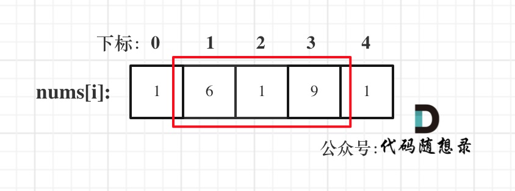
>
> - 情况二：`考虑`有阔能包含首元素，但必然不包含尾元素
>
> 
>
> - 情况三：`考虑`有阔能包含尾元素，但必然不包含首元素
>
> 
>
> **注意博主这里用的是"考虑"**，例如情况三，虽然是**考虑包含**尾元素，但**`不一定`要选尾部元素**！ 对于情况三，取nums[1] 和 nums[3]就是最大的。
>
> **`而情况二 和 情况三 都包含了情况一了，所以只考虑情况二和情况三就可以了`**。
>
> 分析到这里，本题其实比较简单了。 剩下的和[198.打家劫舍 ](https://programmercarl.com/0198.打家劫舍.html)就是一样的了。
>
> ```js
> var rob = function(nums) {
>     let len = nums.length;
>     if (len == 1) return nums[0];
>     // 情况1：必然不包含首和尾元素，但是情况1已经被包含在情况2和3中了
>     // 情况2：有阔能包含首元素，但必然不包含尾元素
>     let result1 = robRange(0, len - 1);
>     // 情况2：有阔能包含尾元素，但必然不包含首元素
>     let result2 = robRange(1, len);
>     return Math.max(result1, result2);
> 
>     // 常规打家劫舍处理逻辑
>     function robRange(start, end) {
>         let dp = new Array(end).fill(0);
>         dp[start] = nums[start];
>         dp[start + 1] = Math.max(nums[start], nums[start + 1]);
>         for (let i = start + 2; i <= end; i++) {
>             dp[i] = Math.max(dp[i - 2] + nums[i], dp[i - 1]);
>         }
>         return dp[end - 1];
>     }
> };
> ```
>

### [337. 打家劫舍 III](https://leetcode.cn/problems/house-robber-iii/)

> [labuladong 题解](https://labuladong.github.io/article/?qno=337)[思路](https://leetcode.cn/problems/house-robber-iii/#)
>
> 小偷又发现了一个新的可行窃的地区。这个地区只有一个入口，我们称之为 `root` 。
>
> 除了 `root` 之外，每栋房子有且只有一个“父“房子与之相连。一番侦察之后，聪明的小偷意识到“这个地方的所有房屋的排列类似于一棵二叉树”。 如果 **两个直接相连的房子在同一天晚上被打劫** ，房屋将自动报警。
>
> 给定二叉树的 `root` 。返回 ***在不触动警报的情况下** ，小偷能够盗取的最高金额* 。
>
>  
>
> **示例 1:**
>
> 
>
> ```
> 输入: root = [3,2,3,null,3,null,1]
> 输出: 7 
> 解释: 小偷一晚能够盗取的最高金额 3 + 3 + 1 = 7
> ```

> 解法有暴力递归，记忆化递推和dp，这里着重记录一下dp
>
> 动态规划其实就是使用状态转移容器来记录状态的变化，这里可以使用一个长度为2的数组，记录当前节点偷与不偷所得到的的最大金钱。
>
> **这道题目算是树形dp的入门题目，因为是在树上进行状态转移，我们在讲解二叉树的时候说过递归三部曲，那么下面以递归三部曲为框架，其中融合动规五部曲的内容来进行讲解**。
>
> 1. 确定递归函数和参数返回值
>
>    要求一个节点 偷与不偷的两个状态所得到的金钱，那么返回值就是一个长度为2的数组。
>
>    参数为当前节点，代码如下：
>
>    ```cpp
>    vector<int> robTree(TreeNode* cur) {
>    ```
>
>    `其实这里的返回数组就是dp数组`。
>
>    所以`dp数组（dp table）以及下标的含义`：下标为0记录不偷该节点所得到的的最大金钱，下标为1记录偷该节点所得到的的最大金钱。
>
>    **所以本题dp数组就是一个长度为2的数组！**
>
>    那么有同学可能疑惑，长度为2的数组怎么标记树中每个节点的状态呢？
>
>    **别忘了在递归的过程中，系统栈会保存每一层递归的参数**。
>
>    如果还不理解的话，就接着往下看，看到代码就理解了。
>
> 2. 确定终止条件
>
> 在遍历的过程中，如果遇到`空节点`的话，很明显，`无论偷还是不偷都是0`，所以就返回
>
> ```text
> if (cur == NULL) return vector<int>{0, 0};
> ```
>
> 这也相当于`dp数组的初始化`
>
> 3. 确定遍历顺序
>
> 首先明确的是使用`后序遍历`。 因为通过递归函数的返回值来做下一步计算。（用labuladong的话来说，我们需要根据左右子节点来计算当前节点，而只有后序才会得知左右子节点的信息）
>
> 通过递归左节点，得到`左节点偷与不偷`的金钱。
>
> 通过递归右节点，得到`右节点偷与不偷`的金钱。
>
> 代码如下：
>
> ```cpp
> // 下标0：不偷，下标1：偷
> vector<int> left = robTree(cur->left); // 左
> vector<int> right = robTree(cur->right); // 右
> // 中
> ```
>
> 4. 确定单层递归的逻辑
>
> 如果是`偷当前节点，那么左右孩子就不能偷`，`val1 = cur->val + left[0] + right[0]`; （**如果对下标含义不理解就在回顾一下dp数组的含义**）
>
> 如果`不偷当前节点，那么左右孩子就可以偷，至于到底偷不偷一定是选一个最大的`，所以：`val2 = max(left[0], left[1]) + max(right[0], right[1])`;
>
> 最后当前节点的状态就是{val2, val1}; 即：{不偷当前节点得到的最大金钱，偷当前节点得到的最大金钱}
>
> 代码如下：
>
> ```cpp
> vector<int> left = robTree(cur->left); // 左
> vector<int> right = robTree(cur->right); // 右
> 
> // 偷cur
> int val1 = cur->val + left[0] + right[0];
> // 不偷cur
> int val2 = max(left[0], left[1]) + max(right[0], right[1]);
> return {val2, val1};
> ```
>
> 5. 举例推导dp数组
>
> 以示例1为例，dp数组状态如下：（**注意用后序遍历的方式推导**）
>
> 
>
> **最后头结点就是` 取下标0 和 下标1的最大值就是偷得的最大金钱`**。
>
> ```js
> var rob = function(root) {
>     const res = postOrder(root);
>     // 返回最大值
>     return Math.max(...res);
> 
>     // 后序遍历函数
>     // 返回值一个长度为2的数组（相当于dp）：下标为0代表不偷当前节点得到的最大金钱，下标为1代表偷当前节点得到的最大金钱
>     function postOrder(node) {
>         // 递归出口
>         if (!node) return [0, 0];
>         // 遍历左子树
>         const left = postOrder(node.left);
>         // 遍历右子树
>         const right = postOrder(node.right);
>         // 情况1：不偷当前节点，左右子节点都可以偷或者不偷，取最大值
>         const DoNot = Math.max(left[0], left[1]) + Math.max(right[0], right[1]);
>         // 情况2：偷当前节点，左右子节点只能不偷，并且加上当前节点值代表偷了
>         const Do = node.val + left[0] + right[0];
>         // 不偷，偷
>         return [DoNot, Do];
>     }
> };
> ```

## 买卖股票

### [121. 买卖股票的最佳时机](https://leetcode.cn/problems/best-time-to-buy-and-sell-stock/)-只买卖一次

> [labuladong 题解](https://labuladong.github.io/article/?qno=121)[思路](https://leetcode.cn/problems/best-time-to-buy-and-sell-stock/#)
>
> 给定一个数组 `prices` ，它的第 `i` 个元素 `prices[i]` 表示一支给定股票第 `i` 天的价格。
>
> 你只能选择 **某一天** 买入这只股票，并选择在 **未来的某一个不同的日子** 卖出该股票。设计一个算法来计算你所能获取的最大利润。
>
> 返回你可以从这笔交易中获取的最大利润。如果你不能获取任何利润，返回 `0` 。
>
> **示例 1：**
>
> ```
> 输入：[7,1,5,3,6,4]
> 输出：5
> 解释：在第 2 天（股票价格 = 1）的时候买入，在第 5 天（股票价格 = 6）的时候卖出，最大利润 = 6-1 = 5 。
>      注意利润不能是 7-1 = 6, 因为卖出价格需要大于买入价格；同时，你不能在买入前卖出股票。
> ```

> 解法1，暴力解法，双重循环，找出最优区间
>
> - 时间复杂度：$O(n^2)$
> - 空间复杂度：$O(1)$
>
> 解法2，贪心
>
> 因为股票就买卖一次，那么贪心的想法很自然就是取最左最小值，取最右最大值，那么得到的差值就是最大利润。
>
> ```js
> var maxProfit = function(prices) {
>     let profit = 0;
>     let low = Infinity;
>     for (let i = 0; i < prices.length; i++) {
>         // 取最左最小价格
>         low = Math.min(low, prices[i]);
>         // 直接取最大区间利润
>         profit = Math.max(profit, prices[i] - low);
>     }
>     return profit;
> };
> ```
>
> - 时间复杂度：$O(n)$
> - 空间复杂度：$O(1)$
>
> 解法3，dp
>
> 1. 确定dp数组以及下标含义
>
>    `dp[i][0]`：表示第i天`持有股票`所得最多现金 ，**这里可能有同学疑惑，本题中只能买卖一次，持有股票之后哪还有现金呢？**
>
>    其实一开始现金是0，那么加入第i天买入股票现金就是 -prices[i]， 这是一个负数。
>
>    `dp[i][1]`：表示第i天`不持有股票`所得最多现金
>
>    **注意这里说的是“持有”，“持有”不代表就是当天“买入”！也有可能是昨天就买入了，今天保持持有的状态**
>
> 2. 确定递推公式
>
>    如果第i天持有股票即`dp[i][0]`， 那么可以由两个状态推出来（因为只能买卖一次，只要以下两个场景）：
>
>    - 第i-1天就持有股票，那么就保持现状，所得现金就是昨天持有股票的所得现金 即：`dp[i - 1][0]`
>    - 第i天买入股票，所得现金就是买入今天的股票后所得现金即：-prices[i]
>
>    那么`dp[i][0]`应该选所得现金最大的，所以`dp[i][0] = max(dp[i - 1][0], -prices[i])`;
>
>    如果第i天不持有股票即`dp[i][1]`， 也可以由两个状态推出来
>
>    - 第i-1天就不持有股票，那么就保持现状，所得现金就是昨天不持有股票的所得现金 即：`dp[i - 1][1]`
>    - 第i天卖出股票（本身持有股票），所得现金就是按照`今天`股票佳价格卖出后所得现金即：`prices[i] + dp[i - 1][0]`
>
>    同样`dp[i][1]`取最大的，`dp[i][1] = max(dp[i - 1][1], prices[i] + dp[i - 1][0])`;
>
>    这样递归公式我们就分析完了
>
> 3. 初始化dp数组
>
>    由递推公式 `dp[i][0] = max(dp[i - 1][0], -prices[i])`; 和 `dp[i][1] = max(dp[i - 1][1], prices[i] + dp[i - 1][0])`;可以看出
>
>    其基础都是要从`dp[0][0]`和`dp[0][1]`推导出来。
>
>    那么`dp[0][0]`表示第0天持有股票，此时的持有股票就一定是买入股票了，因为不可能有前一天推出来，所以`dp[0][0] = -prices[0]`;
>
>    `dp[0][1]`表示第0天不持有股票，不持有股票那么现金就是0，所以`dp[0][1] = 0`;
>
> 4. 确定遍历顺序
>
>    从递推公式可以看出dp[i]都是有dp[i - 1]推导出来的，那么一定是从前向后遍历。
>
> 5. 举例推导dp数组
>
>    以示例1，输入：[7,1,5,3,6,4]为例，dp数组状态如下：
>
>    
>
> ```js
> var maxProfit = function(prices) {
>     let dp = new Array(prices.length).fill([0, 0]);
>     // dp[i][0]：第i天持有股票所得最多现金
>     // dp[i][1]：第i天不持有股票所得最多现金
>     dp[0][0] = -prices[0];
>     dp[0][1] = 0;
>     for (let i = 1; i < prices.length; i++) {
>         // 第i天持有股票：1，昨天就持有了 2，今天才持有（要花钱买入）
>         dp[i][0] = Math.max(dp[i - 1][0], -prices[i]);
>         // 第i天不持有股票：1，昨天就不持有了 2，今天才不持有（昨天有+今天卖出）
>         dp[i][1] = Math.max(dp[i - 1][1], dp[i - 1][0] + prices[i]);
>     }
>     return dp[prices.length - 1][1];
> };
> ```
>
> - 时间复杂度：$O(n)$
> - 空间复杂度：$O(n)$
>
> #### 解法3，空间优化
>
> 从递推公式可以看出，`dp[i]只是依赖于dp[i - 1]的状态`。
>
> 那么我们只需要记录 当前天的dp状态和前一天的dp状态就可以了，可以使用滚动数组来节省空间，代码如下：
>
> ```js
> var maxProfit = function(prices) {
> var maxProfit = function(prices) {
>     // 下标0代表持有，下标1代表卖出
>     dp = [-prices[0], 0];
>     // 可以参考裴波那契的优化方式
>     // 注意下标从1开始，要遍历到第prices.length天
>     for (let i = 1; i < prices.length; i++) {
>         // 当天持有股票所得最多现金：前一天持有或当天买入，取最大值
>         dp[0] = Math.max(dp[0], -prices[i]); 
>         // 当天不持有股票所得最多现金：前一天已经不持有或一天持有+当天卖出，取最大值
>         dp[1] = Math.max(dp[1], dp[0] + prices[i]);
>     }  
>     return dp[1];
> };
> ```
>
> 
>
> - 时间复杂度：$O(n)$
> - 空间复杂度：$O(1)$

### [122. 买卖股票的最佳时机 II](https://leetcode.cn/problems/best-time-to-buy-and-sell-stock-ii/)-多次买卖一支股票

> [labuladong 题解](https://labuladong.github.io/article/?qno=122)[思路](https://leetcode.cn/problems/best-time-to-buy-and-sell-stock-ii/#)
>
> 给你一个整数数组 `prices` ，其中 `prices[i]` 表示某支股票第 `i` 天的价格。
>
> 在每一天，你可以决定是否购买和/或出售股票。你在任何时候 **最多** 只能持有 **一股** 股票。你也可以先购买，然后在 **同一天** 出售。
>
> 返回 *你能获得的 **最大** 利润* 。
>
>  
>
> **示例 1：**
>
> ```
> 输入：prices = [7,1,5,3,6,4]
> 输出：7
> 解释：在第 2 天（股票价格 = 1）的时候买入，在第 3 天（股票价格 = 5）的时候卖出, 这笔交易所能获得利润 = 5 - 1 = 4 。
>      随后，在第 4 天（股票价格 = 3）的时候买入，在第 5 天（股票价格 = 6）的时候卖出, 这笔交易所能获得利润 = 6 - 3 = 3 。
>      总利润为 4 + 3 = 7 。
> ```

> 解法1，贪心，前面做过
>
> 解法2，dp
>
> 本题和[121. 买卖股票的最佳时机 (opens new window)](https://programmercarl.com/0121.买卖股票的最佳时机.html)的唯一区别本题股票可以`买卖多次`了（注意`只有一只股票`，所以再次购买前要出售掉之前的股票）
>
> **在动规五部曲中，这个区别主要是体现`在递推公式上`，其他都和[121. 买卖股票的最佳时机 (opens new window)](https://programmercarl.com/0121.买卖股票的最佳时机.html)一样一样的**。
>
> 重点讲一下递推公式
>
> 重申一下dp数组含义：
>
> - `dp[i][0] `表示第i天持有股票所得最多现金。
> - `dp[i][1] `表示第i天不持有股票所得最多现金
>
> #### 1. 推导`dp[i][0]` ：持有
>
> - 情况一，第i-1天就持有股票，那么就保持现状，所得现金就是昨天持有股票的所得现金 即：`dp[i - 1][0]`
> - 情况二，第i天买入股票，所得现金就是昨天不持有股票的所得现金减去 今天的股票价格 即：`dp[i - 1][1] - prices[i]`
> - 注意！！！和上一题不同的地方在于,**推导`dp[i][0]`的时候，第i天买入股票的情况**。
>   - 上一题中，因为股票全程只能买卖一次，所以如果买入股票，那么第i天持有股票即`dp[i][0]`一定就是 -prices[i]。
>   - 本题，一只股票可以`买卖多次`，所以当第i天买入股票的时候，所持有的现金可能有之前买卖过的利润。
>   - 因此，情况二：`dp[i - 1][1] - prices[i]。`
>
> #### 2. 推导`dp[i][1]` ：不持有
>
> - 情况一，第i-1天就不持有股票，那么就保持现状，所得现金就是昨天不持有股票的所得现金 即：`dp[i - 1][1]`
> - 情况二，第i天卖出股票，所得现金就是按照今天股票佳价格卖出后所得现金即：`prices[i] + dp[i - 1][0]`
> - 情况二就和上题一样了，因为上题强调了，前一天已有收入可能是负值
>
> ```js
> var maxProfit = function(prices) {
>     // 0：已持有：昨天已持有；今天才持有：昨天未持有+今天买入的花费
>     // 1：未持有：昨天未持有；今天才未持有：昨天已持有+今天卖出所得
>     let dp = new Array(prices.length).fill([0, 0]);
>     dp[0][0] = -prices[0];
>     dp[0][1] = 0;
>     for (let i = 1; i < prices.length; i++) {
>         dp[i] = [
>             Math.max(dp[i - 1][0], dp[i - 1][1] - prices[i]),
>             Math.max(dp[i - 1][1], dp[i - 1][0] + prices[i])
>         ]
>     }
>     return dp[prices.length - 1][1];
> };
> ```
>
> 空间优化版:
>
> ```js
> var maxProfit = function(prices) {
>     dp = [-prices[0], 0];
>     for (let i = 1; i < prices.length; i++) {
>         dp = [
>             Math.max(dp[0], dp[1] - prices[i]),
>             Math.max(dp[1], dp[0] + prices[i])
>         ]
>     }
>     return dp[1];
> };
> ```

### [123. 买卖股票的最佳时机 III](https://leetcode.cn/problems/best-time-to-buy-and-sell-stock-iii/)-最多买卖两次-不能同时多笔交易

> [labuladong 题解](https://labuladong.github.io/article/?qno=123)[思路](https://leetcode.cn/problems/best-time-to-buy-and-sell-stock-iii/#)
>
> 难度困难1131
>
> 给定一个数组，它的第 `i` 个元素是一支给定的股票在第 `i` 天的价格。
>
> 设计一个算法来计算你所能获取的最大利润。你最多可以完成 **两笔** 交易。
>
> **注意：**你不能同时参与多笔交易（你必须在再次购买前出售掉之前的股票）。
>
>  
>
> **示例 1:**
>
> ```
> 输入：prices = [3,3,5,0,0,3,1,4]
> 输出：6
> 解释：在第 4 天（股票价格 = 0）的时候买入，在第 6 天（股票价格 = 3）的时候卖出，这笔交易所能获得利润 = 3-0 = 3 。
>      随后，在第 7 天（股票价格 = 1）的时候买入，在第 8 天 （股票价格 = 4）的时候卖出，这笔交易所能获得利润 = 4-1 = 3 
> ```

> 关键在于至多`买卖两次`，这意味着可以`买卖一次`，可以`买卖两次`，也可以`不买卖`。
>
> dp五部曲
>
> 1. 确定dp数组及其下标含义
>
>    一天一共就有五个`状态`，
>
>    0：没有操作
>
>    1：第一次买入
>
>    2：第一次卖出
>
>    3：第二次买入
>
>    4：第二次卖出
>
>    `dp[i][j]`中 i表示第i天，j为 [0 - 4] 五个状态，`dp[i][j]`表示第i天状态j所剩最大现金。
>
> 2. 确定递推公式
>
>       需要注意：`dp[i][1]`，**表示的是第i天，买入股票的状态，`并不是说一定要第i天买入股票`，这是容易陷入的误区的地方**。
>
>    a. 达到`dp[i][0]`状态：直接沿用上一个状态
>
>    b. 达到`dp[i][1]`状态，有两个具体操作：
>
>    - 操作一：第i天买入股票了，那么`dp[i][1] = dp[i-1][0] - prices[i]`
>    - 操作二：第i天没有操作，而是沿用前一天买入的状态，即：`dp[i][1] = dp[i - 1][1]`
>
>      那么`dp[i][1]`究竟选 `dp[i-1][0] - prices[i]`，还是`dp[i - 1][1]`呢？
>
>      一定是`选最大`的，所以 `dp[i][1] = max(dp[i-1][0] - prices[i], dp[i - 1][1])`;
>
>    c. 同理`dp[i][2]`也有两个操作：
>
>    - 操作一：第i天卖出股票了，那么`dp[i][2] = dp[i - 1][1] + prices[i]`
>    - 操作二：第i天没有操作，沿用前一天卖出股票的状态，即：`dp[i][2] = dp[i - 1][2]`
>
>    所以`dp[i][2] = max(dp[i - 1][1] + prices[i], dp[i - 1][2])`
>
>    d. 同理可推出剩下状态部分：
>
>    `dp[i][3] = max(dp[i - 1][3], dp[i - 1][2] - prices[i])`;
>
>    e. `dp[i][4] = max(dp[i - 1][4], dp[i - 1][3] + prices[i])`;
>
> 3. dp数组如何初始化
>
>    第0天没有操作，这个最容易想到，就是0，即：`dp[0][0] = 0`;
>
>    第0天做第一次买入的操作，`dp[0][1] = -prices[0]`;
>
>    第0天做第一次卖出的操作，这个初始值应该是多少呢？
>
>    从递推公式中可以看出每次是取最大值，那么既然是收获利润如果比0还小了就没有必要收获这个利润了。
>
>    所以`dp[0][2] = 0`;
>
>    第0天第二次买入操作，初始值应该是多少呢？应该不少同学疑惑，第一次还没买入呢，怎么初始化第二次买入呢？
>
>    第二次买入依赖于第一次卖出的状态，其实相当于第0天第一次买入了，第一次卖出了，然后在买入一次（第二次买入），那么现在手头上没有现金，只要买入，现金就做相应的减少。
>
>    所以第二次买入操作，初始化为：`dp[0][3] = -prices[0]`;
>
>    同理第二次卖出初始化`dp[0][4] = 0`;
>
> 4. 遍历顺序
>
>    从递归公式其实已经可以看出，一定是从前向后遍历，因为dp[i]，依靠dp[i - 1]的数值。
>
> 5. 举例推导dp数组
>
>    以输入[1,2,3,4,5]为例
>
>    
>
> 大家可以看到红色框为最后两次卖出的状态。
>
> 现在最大的时候一定是卖出的状态，而两次卖出的状态现金最大一定是最后一次卖出。---**为什么？？？**
>
> 所以最终最大利润是`dp[4][4]`
>
> ```js
> var maxProfit = function(prices) {
>     // 0：没有操作
>     // 1：第一次买入
>     // 2：第一次卖出
>     // 3：第二次买入
>     // 4：第二次卖出
>     // dp[i][j]：第i天在j状态下的所得最大收益
>     let dp = new Array(prices.length).fill(0).map(() => new Array(5).fill(0));
>     dp[0][1] = -prices[0];
>     dp[0][3] = -prices[0];
>     for (let i = 1; i < prices.length; i++) {
>         dp[i] = [
>             dp[i - 1][0],
>             Math.max(dp[i - 1][1], dp[i - 1][0] - prices[i]),
>             Math.max(dp[i - 1][2], dp[i - 1][1] + prices[i]),
>             Math.max(dp[i - 1][3], dp[i - 1][2] - prices[i]),
>             Math.max(dp[i - 1][4], dp[i - 1][3] + prices[i]),
>         ]
>     }
>     return dp[prices.length - 1][4];
> };
> ```
>
> - 时间复杂度：O(n)
> - 空间复杂度：O(n × 5)
>
> 空间压缩：
>
> ```js
> var maxProfit = function(prices) {
>     // 0：没有操作
>     // 1：第一次买入
>     // 2：第一次卖出
>     // 3：第二次买入
>     // 4：第二次卖出
>     // dp[i][j]：第i天在j状态下的所得最大收益
>     dp = [0, -prices[0], 0, -prices[0], 0];
>     for (let i = 1; i < prices.length; i++) {
>         dp = [
>             dp[0],
>             Math.max(dp[1], dp[0] - prices[i]),
>             Math.max(dp[2], dp[1] + prices[i]),
>             Math.max(dp[3], dp[2] - prices[i]),
>             Math.max(dp[4], dp[3] + prices[i])
>         ]
>     }
>     return dp[4];
> };
> ```
>
> - 时间复杂度：O(n)
> - 空间复杂度：O(1)

### [188. 买卖股票的最佳时机 IV](https://leetcode.cn/problems/best-time-to-buy-and-sell-stock-iv/)-最多买卖k次

> [labuladong 题解](https://labuladong.github.io/article/?qno=188)[思路](https://leetcode.cn/problems/best-time-to-buy-and-sell-stock-iv/#)
>
> 难度困难733
>
> 给定一个整数数组 `prices` ，它的第 `i` 个元素 `prices[i]` 是一支给定的股票在第 `i` 天的价格。
>
> 设计一个算法来计算你所能获取的最大利润。你最多可以完成 **k** 笔交易。
>
> **注意：**你不能同时参与多笔交易（你必须在再次购买前出售掉之前的股票）。
>
>  
>
> **示例 1：**
>
> ```
> 输入：k = 2, prices = [2,4,1]
> 输出：2
> 解释：在第 1 天 (股票价格 = 2) 的时候买入，在第 2 天 (股票价格 = 4) 的时候卖出，这笔交易所能获得利润 = 4-2 = 2 。
> ```

> 上一题的进阶版，最多要求k次交易
>
> dp五部曲
>
> 1. 确定dp数组以及下标的含义
>
>    使用二维数组 `dp[i][j]` ：第i天的状态为j，所剩下的最大现金是dp[i][j]
>
>    j的状态表示为：
>
>    - 0 表示不操作
>    - 1 第一次买入
>    - 2 第一次卖出
>    - 3 第二次买入
>    - 4 第二次卖出
>    - .....
>
>    **大家应该发现规律了吧 ，除了0以外，偶数就是卖出，奇数就是买入**。
>
>    题目要求是至多有K笔交易，那么j的范围就定义为 2 * k + 1 就可以了。
>
>    所以二维dp数组的C++定义为：
>
>    ```cpp
>    vector<vector<int>> dp(prices.size(), vector<int>(2 * k + 1, 0));
>    ```
>
> 2. 确定递推公式
>
> 还要强调一下：`dp[i][1]`，**表示的是第i天，买入股票的状态，`并不是说一定要第i天买入股票`，这是很多同学容易陷入的误区**。
>
> 达到`dp[i][1]`状态，有两个具体操作：
>
> - 操作一：第i天买入股票了，那么`dp[i][1] = dp[i - 1][0] - prices[i]`
> - 操作二：第i天没有操作，而是沿用前一天买入的状态，即：`dp[i][1] = dp[i - 1][1]`
>
> 选最大的，所以 `dp[i][1] = max(dp[i - 1][0] - prices[i], dp[i - 1][1])`;
>
> 同理`dp[i][2]`也有两个操作：
>
> - 操作一：第i天卖出股票了，那么`dp[i][2] = dp[i - 1][1] + prices[i]`
> - 操作二：第i天没有操作，沿用前一天卖出股票的状态，即：`dp[i][2] = dp[i - 1][2]`
>
> 所以`dp[i][2] = max(dp[i - 1][1] + prices[i], dp[i - 1][2])`
>
> 同理可以类比剩下的状态，代码如下：
>
> ```cpp
> for (int j = 0; j < 2 * k - 1; j += 2) {
>     dp[i][j + 1] = max(dp[i - 1][j + 1], dp[i - 1][j] - prices[i]);
>     dp[i][j + 2] = max(dp[i - 1][j + 2], dp[i - 1][j + 1] + prices[i]);
> }
> ```
>
> **本题和[动态规划：123.买卖股票的最佳时机III (opens new window)](https://programmercarl.com/0123.买卖股票的最佳时机III.html)最大的区别就是这里要类比j为奇数是买，偶数是卖的状态**。
>
> 3. dp数组如何初始化
>
> 第0天`没有操作`，这个最容易想到，就是0，即：`dp[0][0] = 0`;
>
> 第0天做`第一次买入的操作`，`dp[0][1] = -prices[0]`;
>
> 第0天做`第一次卖出的操作`，这个初始值应该是多少呢？
>
> 首先卖出的操作一定是收获利润，整个股票买卖最差情况也就是没有盈利即全程无操作现金为0，
>
> 从递推公式中可以看出每次是取最大值，那么既然是收获利润如果比0还小了就没有必要收获这个利润了。
>
> 所以`dp[0][2] = 0`;
>
> 第0天第二次买入操作，初始值应该是多少呢？
>
> 不用管第几次，现在手头上没有现金，只要买入，现金就做相应的减少。
>
> 第二次买入操作，初始化为：`dp[0][3] = -prices[0]`;
>
> **所以同理可以推出`dp[0][j]当j为奇数的时候都初始化为 -prices[0]`** `当j为偶数的时候都为0`
>
> **在初始化的地方同样要类比j为偶数是卖、奇数是买的状态**。
>
> 4. 确定遍历顺序
>
> 从递归公式其实已经可以看出，一定是从前向后遍历，因为dp[i]，依靠dp[i - 1]的数值。
>
> 5. 以输入[1,2,3,4,5]，k=2为例。
>
>    
>
> 最后一次卖出，一定是利润最大的，`dp[prices.size() - 1][2 * k]`即红色部分就是最后求解。
>
> ```js
> var maxProfit = function(k, prices) {
>     if (prices.length == 0) return 0;
>     // dp[i][j]：第i天状态为j所得的最大收入
>     let dp = new Array(prices.length).fill(0).map(() => new Array(2 * k + 1).fill(0));
>     // 第0天，奇数状态买入，初始化为 -prices[0]，偶数状态卖出，初始化为0
>     for (let j = 1; j < 2 * k; j += 2) {
>         dp[0][j] = -prices[0];
>     }
>     for (let i = 1; i < prices.length; i++) {
>         // 给第i天的偶数和奇数天赋值
>         for (let j = 0; j < 2 * k - 1; j += 2) {
>             // 奇数状态买入：昨天已经买入 or 今天才买入
>             dp[i][j + 1] = Math.max(dp[i - 1][j + 1], dp[i - 1][j] - prices[i]);
>             // 偶数状态卖出，昨天已经卖出 or 今天才卖出
>             dp[i][j + 2] = Math.max(dp[i - 1][j + 2], dp[i - 1][j + 1] + prices[i]);
>         }   
>     }
>     return dp[prices.length - 1][2 * k];
> };
> ```
>
> 状态压缩
>
> ```js
> var maxProfit = function(k, prices) {
>     if (prices.length == 0) return 0;
>     // dp[i][j]：第i天状态j下的最大收入
>     // j为0，不操作，0
>     // j为奇数状态，买入
>     // j为偶数状态，卖出
>     let dp = new Array(2 * k + 1).fill(0);
>     // 奇数状态赋初始值为 -prices[0]，偶数状态0
>     for (let i = 1; i < 2 * k + 1; i += 2) {
>         dp[i] = -prices[0];
>     }
>     for (let i = 1; i < prices.length; i++) {
>         for (let j = 1; j < 2 * k + 1; j++) {
>             // j为奇数状态，买入：前一天已经买入 or 今天才买入（上一个状态-今天买入花费）
>             if (j % 2) {
>                 dp[j] = Math.max(dp[j], dp[j - 1] - prices[i])
>             } else {
>             // j为偶数状态，卖出：前一天已经卖出 or 今天才卖出（上一个状态+今天卖出所得）
>                 dp[j] = Math.max(dp[j], dp[j - 1] + prices[i]);
>             }
>         }
>     }
>     return dp[2 * k];
> };
> ```
>

### [309. 最佳买卖股票时机-含冷冻期](https://leetcode.cn/problems/best-time-to-buy-and-sell-stock-with-cooldown/)

> [labuladong 题解](https://labuladong.github.io/article/?qno=309)[思路](https://leetcode.cn/problems/best-time-to-buy-and-sell-stock-with-cooldown/#)
>
> 难度中等1223
>
> 给定一个整数数组`prices`，其中第 `prices[i]` 表示第 `*i*` 天的股票价格 。
>
> 设计一个算法计算出最大利润。在满足以下约束条件下，你可以尽可能地完成更多的交易（多次买卖一支股票）:
>
> - 卖出股票后，你无法在第二天买入股票 (即冷冻期为 1 天)。
>
> **注意：**你不能同时参与多笔交易（你必须在再次购买前出售掉之前的股票）。
>
>  
>
> **示例 1:**
>
> ```
> 输入: prices = [1,2,3,0,2]
> 输出: 3 
> 解释: 对应的交易状态为: [买入, 卖出, 冷冻期, 买入, 卖出]
> ```

> 相比于上题，本题加入了冷冻期：**卖出股票后**，你无法在第二天买入股票 (即冷冻期为 1 天)。
>
> dp五部曲开始分析
>
> 1. 确定dp数组及其下标含义
>
> `dp[i][j]`，第i天状态为j，所剩的最多现金为`dp[i][j]`。
>
> 注意：出现冷冻期后，**状态其实是比较复杂度**，例如今天买入股票、今天卖出股票、今天是冷冻期，都是不能操作股票的。 
>
> j具体分为四个状态：
>
> - 买入股票状态
>
> - - **状态0**：今天买入股票，或者是之前就买入了股票然后没有操作
>
> - 卖出股票状态，这里就有两种卖出股票状态
>
> - - **状态1**：`最早两天前`就`已经卖出`了股票，度过了冷冻期，一直没操作，今天**保持卖出股票状态**
>   - **状态2**：今天卖出了股票
>
> - 冷冻期状态
>
> - - **状态3**：今天为冷冻期状态，但冷冻期状态不可持续，只有一天
>
> **注意这里的每一个状态，例如状态一，是买入股票状态并不是说今天已经就买入股票，而是说保存买入股票的状态即：可能是前几天买入的，**之后一直没操作，所以保持买入股票的状态。
>
> 2. 确定递推公式
>
> a. 达到买入股票状态（状态0）即：`dp[i][0]`，有两个具体操作：
>
> - 操作一：前一天就是持有股票状态（状态0），`dp[i][0] = dp[i - 1][0]`
>
> - 操作二：今天买入了，有两种情况
>
> - - 前一天是冷冻期（状态3），`dp[i - 1][3] - prices[i]`
>   - 前一天是保持卖出股票状态（状态1），`dp[i - 1][1] - prices[i]`
>
>    所以操作二取最大值，即：`max(dp[i - 1][3], dp[i - 1][1]) - prices[i]`
>
>    那么`dp[i][0] = max(dp[i - 1][0], max(dp[i - 1][3], dp[i - 1][1]) - prices[i])`;
>
> b. 达到**保持卖出股票状态**（状态1）即：`dp[i][1]`，有两个具体操作：
>
> - 操作一：前一天就是状态1
> - 操作二：前一天是冷冻期（状态3）
>
>    `dp[i][1] = max(dp[i - 1][1], dp[i - 1][3])`;
>
> c. 达到今天就卖出股票状态（状态2），即：`dp[i][2]` ，只有一个操作： ps，状态2需要关注一下，理解有点不清楚--只可能昨天是状态0
>
> - 操作一：昨天一定是买入股票状态（状态0，注意，并不一定是昨天买入的，而是买入的`状态`），今天卖出
>
>    即：`dp[i][2] = dp[i - 1][0] + prices[i]`;
>
> d. 达到冷冻期状态（状态3，只有一天），即：`dp[i][3]`，只有一个操作：
>
> - 操作一：昨天卖出了股票（状态2）
>
>    `dp[i][3] = dp[i - 1][2]`;
>
> 综上分析，递推代码如下：
>
> ```js
> dp[i][0] = max(dp[i - 1][0], max(dp[i - 1][3], dp[i - 1][1]) - prices[i]);
> dp[i][1] = max(dp[i - 1][1], dp[i - 1][3]);
> dp[i][2] = dp[i - 1][0] + prices[i];
> dp[i][3] = dp[i - 1][2];
> ```
>
> 
>
> 3. dp数组如何初始化
>
> 这里主要讨论一下第0天如何初始化。
>
> - 如果是持有股票状态（状态0）那么：`dp[0][0] = -prices[0]`，买入股票所剩现金为负数。
> - 保持卖出股票状态（状态1），第0天没有卖出`dp[0][1]`初始化为0就行，
> - 今天卖出了股票（状态2），同样`dp[0][2]`初始化为0，因为最少收益就是0，绝不会是负数。
> - 同理`dp[0][3]`也初始为0。
>
> 4. 确定遍历顺序
>
> 从递归公式上可以看出，dp[i] 依赖于 dp[i-1]，所以是从前向后遍历。
>
> 5. 举例推导dp数组
>
> 以 [1,2,3,0,2] 为例，dp数组如下：
>
> ​    
>
> 最后结果是取 状态1，状态2，和状态3的最大值，不少同学会把状态3忘了，状态3是冷冻期，最后一天如果是冷冻期也可能是最大值。
>
> ```js
> var maxProfit = function(prices) {
>     const len = prices.length;
>     let dp = new Array(len).fill(0).map(() => new Array(4).fill(0));
>     dp[0][0] = -prices[0];
>     for (let i = 1; i < len; i++) {
>         dp[i] = [
>             // 状态0-买入状态：昨天已经买入 || 今天才买入（昨天是冷冻期or昨天已经是保持卖出状态）
>             Math.max(dp[i - 1][0], Math.max(dp[i - 1][3], dp[i - 1][1]) - prices[i]),
>             // 状态1-过去已经卖出，现在保持卖出状态（今天不会收益）：昨天就是保持卖出状态 || 昨天是冷冻期
>             Math.max(dp[i- 1][1], dp[i - 1][3]),
>             // 状态2-今天卖出：昨天必然是买入状态（反证：昨天如果不是买入状态，今天再不卖的话，今天必不可能是状态2）
>             dp[i - 1][0] + prices[i],
>             // 状态3-冷冻期：昨天必然是状态2刚卖出，因为冷冻期仅有一天，出现在卖出之后
>             dp[i - 1][2]
>         ]
>     }
>     // 结果取状态1 2 3的最大值
>     return Math.max(dp[len - 1][1], dp[len - 1][2], dp[len - 1][3]);
> };
> ```
>

### [714. 买卖股票的最佳时机含手续费](https://leetcode.cn/problems/best-time-to-buy-and-sell-stock-with-transaction-fee/)

[labuladong 题解](https://labuladong.github.io/article/?qno=714)[思路](https://leetcode.cn/problems/best-time-to-buy-and-sell-stock-with-transaction-fee/#)

难度中等739

给定一个整数数组 `prices`，其中 `prices[i]`表示第 `i` 天的股票价格 ；整数 `fee` 代表了交易股票的手续费用。

你可以无限次地完成交易，但是你每笔交易都需要付手续费。如果你已经购买了一个股票，在卖出它之前你就不能再继续购买股票了。

返回获得利润的最大值。

**注意：**这里的一笔交易指买入持有并卖出股票的整个过程，每笔交易你只需要为支付一次手续费。

 

**示例 1：**

```
输入：prices = [1, 3, 2, 8, 4, 9], fee = 2
输出：8
解释：能够达到的最大利润:  
在此处买入 prices[0] = 1
在此处卖出 prices[3] = 8
在此处买入 prices[4] = 4
在此处卖出 prices[5] = 9
总利润: ((8 - 1) - 2) + ((9 - 4) - 2) = 8
```

> 本题和122多次买卖同一支股票几乎一样，只是本题需要在计算卖出操作的时候减去手续费，唯一差别在于递推公式，所以dp五部曲主要聚焦在递推公式
>
> dp五部曲
>
> > 1. 确定dp含义
> >
> > - `dp[i][0] `表示第i天持有股票所得最多现金。
> > - `dp[i][1] `表示第i天不持有股票所得最多现金
> >
> > 2. 确定递推公式
> >
> > * 如果第i天持有股票即`dp[i][0]`， 那么可以由两个状态推出来
> >
> >   * 第i-1天就持有股票，那么就保持现状，所得现金就是昨天持有股票的所得现金 即：`dp[i - 1][0]`
> >   * 第i天买入股票，所得现金就是昨天不持有股票的所得现金减去 今天的股票价格 即：`dp[i - 1][1] - prices[i]`
> >
> >   所以：`dp[i][0] = max(dp[i - 1][0], dp[i - 1][1] - prices[i])`;
> >
> > * 如果第i天不持有股票即dp[i][1]的情况， 依然可以由两个状态推出来
> >
> >   * 第i-1天就不持有股票，那么就保持现状，所得现金就是昨天不持有股票的所得现金 即：`dp[i - 1][1]`
> >   * 第i天卖出股票，所得现金就是按照今天股票价格卖出后所得现金，**注意这里需要有手续费了**即：`dp[i - 1][0] + prices[i] - fee`
> >
> >   所以：`dp[i][1] = max(dp[i - 1][1], dp[i - 1][0] + prices[i] - fee)`;
> >
> > 3. 初始化
> >
> > 4. 确定遍历顺序
> >
> > 5. 举例推导

```js
var maxProfit = function(prices, fee) {
    let dp = new Array(prices.length).fill([0, 0]);
    // dp[i][0]：第i天  持有  股票所得最大收入
    // dp[i][1]：第i天   不持有  股票所得最大收入
    dp[0][0] = -prices[0];
    for (let i = 1; i < prices.length; i++) {
        dp[i] = [
            Math.max(dp[i - 1][0], dp[i - 1][1] - prices[i]),
            Math.max(dp[i - 1][1], dp[i - 1][0] + prices[i] - fee)
        ]
    }
    return dp[prices.length - 1][1];
};
```


## [剑指 Offer II 091. 粉刷房子](https://leetcode.cn/problems/JEj789/)

难度中等64

假如有一排房子，共 `n` 个，每个房子可以被粉刷成红色、蓝色或者绿色这三种颜色中的一种，你需要粉刷所有的房子并且使其相邻的两个房子颜色不能相同。

当然，因为市场上不同颜色油漆的价格不同，所以房子粉刷成不同颜色的花费成本也是不同的。每个房子粉刷成不同颜色的花费是以一个 `n x 3` 的正整数矩阵 `costs` 来表示的。

例如，`costs[0][0]` 表示第 0 号房子粉刷成红色的成本花费；`costs[1][2]` 表示第 1 号房子粉刷成绿色的花费，以此类推。

请计算出粉刷完所有房子最少的花费成本。

 

**示例 1：**

```js
输入: costs = [[17,2,17],[16,16,5],[14,3,19]]
输出: 10
解释: 将 0 号房子粉刷成蓝色，1 号房子粉刷成绿色，2 号房子粉刷成蓝色。
     最少花费: 2 + 5 + 3 = 10。
```

## [300. 最长递增子序列](https://leetcode-cn.com/problems/longest-increasing-subsequence/)

1. labuladong

> 注意「子序列」和「子串」这两个名词的区别，子串一定是连续的，而子序列不一定是连续的。
>
> **`dp[i]` 表示以 `nums[i]` 这个数结尾的最长递增子序列的长度**。
>
> base case：`dp[i]` 初始值为 1，因为以 `nums[i]` 结尾的最长递增子序列起码要包含它自己。
>
> 根据刚才我们对 `dp` 数组的定义，现在想求 `dp[5]` 的值，也就是想求以 `nums[5]` 为结尾的最长递增子序列。
>
> 
>
> **`nums[5] = 3`，既然是递增子序列，我们只要找到前面那些结尾比 3 小的子序列，然后把 3 接到这些子序列末尾，就可以形成一个新的递增子序列，而且这个新的子序列长度加一**。
>
> `nums[5]` 前面有哪些元素小于 `nums[5]`？这个好算，用 for 循环比较一波就行了。
>
> 以这些元素为结尾的最长递增子序列的长度是多少？回顾一下我们对 `dp` 数组的定义，它记录的正是以每个元素为末尾的最长递增子序列的长度。
>
> 以我们举的例子来说，`nums[0]` 和 `nums[4]` 都是小于 `nums[5]` 的，然后对比 `dp[0]` 和 `dp[4]` 的值，我们让 `nums[5]` 和更长的递增子序列结合，得出 `dp[5] = 3`：
>
> ```js
> var lengthOfLIS = function(nums) {
>  let dp = new Array(nums.length).fill(1);   // 注意，必须填充1
>  // dp[0] = 1;
>  for (let i = 0; i < nums.length; i++) {
>      // i与i前面的元素比较
>      for (let j = 0; j < i; j++) {
>          // 找比i小的元素，找到一个，就更新当前dp[i]，是否让当前序列的最长子序列长度加1
>          if (nums[i] > nums[j]) {
>              dp[i] = Math.max(dp[i], dp[j] + 1);
>          }
>      }
>  }
>  return Math.max(...dp);
> };
> ```

2. 代码随想录

> 本题最关键的是要想到dp[i]由哪些状态可以推出来，并取最大值，那么很自然就能想到递推公式：dp[i] = max(dp[i], dp[j] + 1);
>
> 这里dp[i]是可以根据dp[j] （j < i）推导出来的
>
> dp五部曲
>
> > 1. dp[i]的定义
> >
> > **dp[i]表示i之前包括i的以nums[i]结尾`最长`上升子序列的长度**
> >
> > 2. 状态转移方程
> >
> > 位置i的最长升序子序列等于j从0到i-1各个位置的最长升序子序列 + 1 的最大值。
> >
> > 所以：if (nums[i] > nums[j]) dp[i] = max(dp[i], dp[j] + 1);
> >
> > **注意这里不是要dp[i] 与 dp[j] + 1进行比较，而是我们要取dp[j] + 1的最大值**。 // 啥意思？
> >
> > 3. dp[i]初始化
> >
> > 每一个i，对应的dp[i]（即最长上升子序列）起始大小至少都是1.
> >
> > 4. 确定遍历顺序
> >
> > dp[i] 是有0到i-1各个位置的最长升序子序列 推导而来，那么遍历i一定是从前向后遍历。
> >
> > j其实就是0到i-1，遍历i的循环在外层，遍历j则在内层
> >
> > 5. 举例推导dp数组
> >
> > 输入：[0,1,0,3,2]，dp数组的变化如下：
> >
> > 
> >
> > 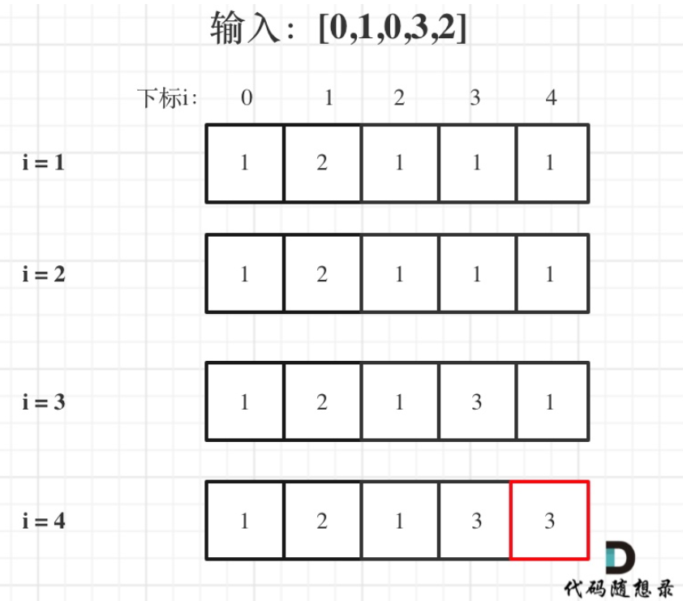
>
> ```js
> var lengthOfLIS = function(nums) {
>     let dp = new Array(nums.length).fill(1);
>     let res = 1;
>     for (let i = 1; i < nums.length; i++) {
>         for (let j = 0; j < i; j++) {
>             if (nums[i] > nums[j]) {
>                 dp[i] = Math.max(dp[i], dp[j] + 1);
>             }
>         }
>         res = Math.max(res, dp[i]);
>     }
>     return res;
> };
> ```

> ps：两种方法大同小异，代码随想录求 res 放在了for循环里面，还有就是对外层循环第一个i值的处理不一样

## [354. 俄罗斯套娃信封问题](https://leetcode-cn.com/problems/russian-doll-envelopes/)-同第300题

> 先对宽度w进行升序排序，
>
> 如果遇到w相同的情况，则按照高度h降序排序。  这里是比较巧妙的地方
>
> 之后把所有的h作为一个数组，
>
> 在这个数组上计算 LIS(最长递增子序列) 的长度就是答案。
>
> ```js
> var maxEnvelopes = function(envelopes) {
> // 将信封宽度按照升序排列，同宽度的话，那就高度降序
> // 然后用一维数组保存排序好的高度值，找出最长递增子序列
> let nums = envelopes.sort((a, b) => a[0] != b[0] ? a[0] - b[0] : b[1] - a[1]).map(ele => ele[1]);
> let dp = new Array(nums.length).fill(1);
> dp[0] = 1;
> for (let i = 0; i < nums.length; i++) {
>   for (let j = 0; j < i; j++) {
>       if (nums[j] < nums[i]) {
>           dp[i] = Math.max(dp[i], dp[j] + 1);
>       }
>   }
> }
> return Math.max(...dp);
> };
> ```
>

> ps：js在力扣上运行会超时，奇怪。时间复杂度是 nlogn 吧，空间复杂度应该是 n

## [674. 最长连续递增序列](https://leetcode.cn/problems/longest-continuous-increasing-subsequence/)

难度简单295

给定一个未经排序的整数数组，找到最长且 **连续递增的子序列**，并返回该序列的长度。

**连续递增的子序列** 可以由两个下标 `l` 和 `r`（`l < r`）确定，如果对于每个 `l <= i < r`，都有 `nums[i] < nums[i + 1]` ，那么子序列 `[nums[l], nums[l + 1], ..., nums[r - 1], nums[r]]` 就是连续递增子序列。

 

**示例 1：**

```
输入：nums = [1,3,5,4,7]
输出：3
解释：最长连续递增序列是 [1,3,5], 长度为3。
尽管 [1,3,5,7] 也是升序的子序列, 但它不是连续的，因为 5 和 7 在原数组里被 4 隔开。 
```

> 这题要求的是必须找到一个连续的，和第300题相比，前者子序列，后者连续递增序列，而且还要注意，后者的dp定义是最长的。。。，而本题的dp定义没有最长/最大
>
> dp五部曲
>
> > 1. 确定dp数组以及下标的含义
> >
> > dp[i]：`以下标i结尾的数组  的  连续递增的子序列长度为dp[i]`（一定以下标i为结尾，但并不一定以下标0为起始位置）
> >
> > 2. 确定递推公式
> >
> > 如果 nums[i + 1] > nums[i]，那么以 i+1 为结尾的数组的连续递增的子序列长度 一定等于 以i为结尾的数组的连续递增的子序列长度 + 1 。
> >
> > 即：dp[i + 1] = dp[i] + 1;
> >
> > **注意这里就体现出和[动态规划：300.最长递增子序列 (opens new window)](https://programmercarl.com/0300.最长上升子序列.html)的区别！**
> >
> > 因为本题要求连续递增子序列，所以就必要比较nums[i + 1]与nums[i]，而不用去比较nums[j]与nums[i] （j是在0到i之间遍历）。
> >
> > 既然不用j了，那么也不用两层for循环，本题一层for循环就行，比较nums[i + 1] 和 nums[i]。
> >
> > 3. dp数组初始化
> >
> > 以下标i为结尾的数组的连续递增的子序列的长度最少也应该是1，即 nums[i] 这个元素
> >
> > 所以应该初始化为1
> >
> > 4. 确定遍历顺序
> >
> > 从递推公式上看，dp[i + 1]依赖 dp[i]，所以就是从前向后遍历
> >
> > 5. 举例推导dp数组
> >
> > 已输入nums = [1,3,5,4,7]为例，dp数组状态如下：
> >
> > 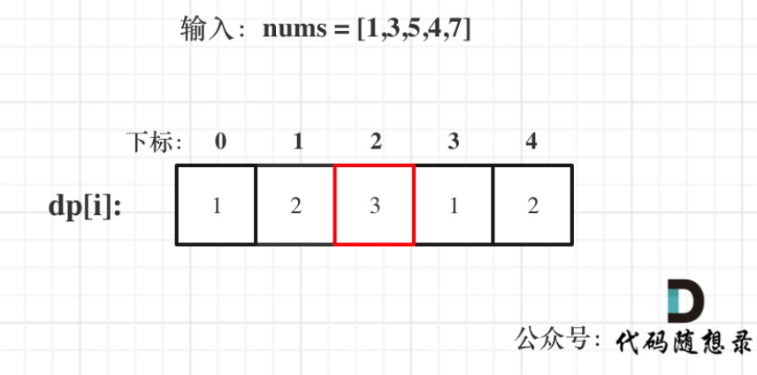
> >
> > **注意这里要取dp[i]的最大值，所以dp[2]才是最终结果**
>
> ```js
> var findLengthOfLCIS = function(nums) {
>     // dp[i]：以下标i为结尾的连续递增的子序列长度为dp[i]
>     let dp = new Array(nums.length).fill(1);
>     for (let i = 0; i < nums.length - 1; i++) {
>         if (nums[i] < nums[i + 1]) {
>             dp[i + 1] = dp[i] + 1;
>         }
>     }
>     return Math.max(...dp);
> };
> ```

## [718. 最长重复子数组](https://leetcode.cn/problems/maximum-length-of-repeated-subarray/)

给两个整数数组 `nums1` 和 `nums2` ，返回 *两个数组中 **公共的** 、长度最长的子数组的长度* 。

 

**示例 1：**

```
输入：nums1 = [1,2,3,2,1], nums2 = [3,2,1,4,7]
输出：3
解释：长度最长的公共子数组是 [3,2,1] 。
```

> 子数组就是连续子序列，dp经典应用
>
> dp五部曲
>
> > 1. dp及其下标的含义
> >
> > `dp[i][j]`：以下标 i-1 为结尾的 nums1 ，和以下标 j-1 为结尾的 nums2，最长重复子数组的长度为`dp[i][j]`
> >
> > 注意这里相差了一个 1 ， 那么`dp[0][0]`的含义是啥？
> >
> > --无含义，`dp[i][j]`的定义也就决定着，我们在遍历`dp[i][j]`的时候i 和 j都要从1开始。这样定义是为了方便 -- 方便在哪里？
> >
> > 2. 递推公式
> >
> > 根据`dp[i][j]`的定义，`dp[i][j]`的状态只能由`dp[i - 1][j - 1]`推导出来。
> >
> > 即当nums1[i - 1] 和nums2[j - 1]相等的时候，`dp[i][j] = dp[i - 1][j - 1] + 1`;
> >
> > 根据递推公式可以看出，遍历i 和 j 要从1开始！
> >
> > 3. dp数组如何初始化
> >
> > 根据`dp[i][j]`的定义，`dp[i][0]` 和`dp[0][j]`其实都是没有意义的！
> >
> > 但`dp[i][0]` 和`dp[0][j]`要初始值，因为 为了方便递归公式`dp[i][j] = dp[i - 1][j - 1] + 1`;
> >
> > 所以`dp[i][0]` 和`dp[0][j]`初始化为0。
> >
> > 举个例子nums1[0]如果和nums2[0]相同的话，`dp[1][1] = dp[0][0] + 1`，只有`dp[0][0]`初始为0，正好符合递推公式逐步累加起来。
> >
> > 4. 确定遍历顺序
> >
> > 外层for循环遍历nums1，内层for循环遍历nums2，反过来也可以
> >
> > 同时题目要求长度最长的子数组的长度，所以在遍历的时候顺便把`dp[i][j]`的最大值记录下来
> >
> > ```js
> > for (let i = 1; i <= nums1.length; i++) {
> >     for (let j = 1; j <= nums2.length; j++) {
> >         if (nums1[i - 1] == nums[j - 1]) {
> >             dp[i][j] = dp[i - 1][j - 1] + 1;
> >         }
> >         if (dp[i][j] > result) result = dp[i][j];
> >     }
> > }
> > ```
> >
> > 
> >
> > 5. 举例推导
> >
> > 拿示例1中，A: [1,2,3,2,1]，B: [3,2,1,4,7]为例，画一个dp数组的状态变化，如下：
> >
> > 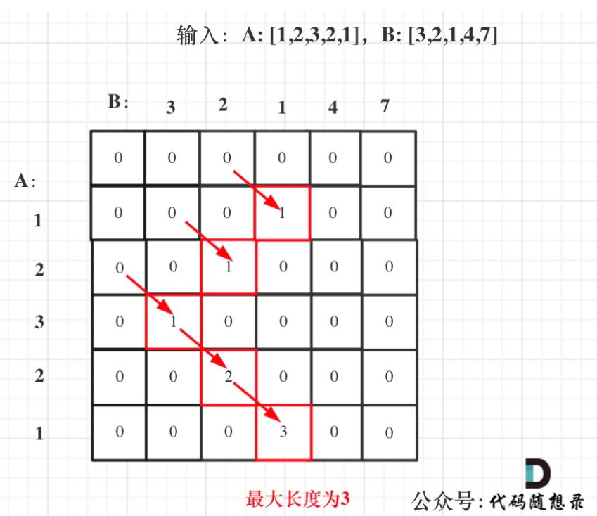
>
> ```js
> var findLength = function(nums1, nums2) {
>     // dp[i][j]：以下标 i-1 为结尾的nums1，和下标以j-1结尾的nums2，最长重复数组的长度
>     let dp = new Array(nums1.length + 1).fill(0).map(() => new Array(nums2.length + 1).fill(0));
>     // 初始化：对dp[i][0]和dp[0][j]进行初始化，配合递推公式
>     let res = 0;
>     for (let i = 1; i <= nums1.length; i++) {
>         for (let j = 1; j <= nums2.length; j++) {
>             if (nums1[i - 1] == nums2[j - 1]) {
>                 dp[i][j] = dp[i - 1][j - 1] + 1;
>             }
>             res = Math.max(res, dp[i][j]);
>         }
>     }
>     return res;
> };
> ```
>
> - 时间复杂度：$O(n × m)$，n 为A长度，m为B长度
> - 空间复杂度：$O(n × m)$
>
> 空间优化：滚动数组
>
> 我们可以看出`dp[i][j]`都是由`dp[i - 1][j - 1]`推出。那么压缩为一维数组，也就是dp[j]都是由dp[j - 1]推出。
>
> 也就是相当于可以把上一层`dp[i - 1][j]`拷贝到下一层`dp[i][j]`来继续用。
>
> **此时遍历B数组的时候，就要从后向前遍历，这样避免重复覆盖**。
>
> ps:num1和num2也可以反过来，对得上就行
>
> ```js
> var findLength = function(nums1, nums2) {
>     // dp[j]：以下标j-1结尾的nums2的最长重复数组的长度
>     let dp = new Array(nums2.length + 1).fill(0);
>     let res = 0;
>     for (let i = 1; i <= nums1.length; i++) {
>         for (let j = nums2.length; j > 0; j--) {
>             if (nums1[i - 1] === nums2[j - 1]) {
>                 dp[j] = dp[j - 1] + 1;
>             } else {
>                 dp[j] = 0; // 这里不相等时，必须要赋值为0  --- 为啥？
>             }
>             res = Math.max(res, dp[j]);
>         }
>     }
>     return res;
> };
> ```
>
> - 时间复杂度：$O(n × m)$，n 为A长度，m为B长度
> - 空间复杂度：$O(m)$

## [1143. 最长公共子序列](https://leetcode.cn/problems/longest-common-subsequence/)

[labuladong 题解](https://labuladong.github.io/article/?qno=1143)[思路](https://leetcode.cn/problems/longest-common-subsequence/#)

给定两个字符串 `text1` 和 `text2`，返回这两个字符串的最长 **公共子序列** 的长度。如果不存在 **公共子序列** ，返回 `0` 。

一个字符串的 **子序列** 是指这样一个新的字符串：它是由原字符串在不改变字符的相对顺序的情况下删除某些字符（也可以不删除任何字符）后组成的新字符串。

- 例如，`"ace"` 是 `"abcde"` 的子序列，但 `"aec"` 不是 `"abcde"` 的子序列。

两个字符串的 **公共子序列** 是这两个字符串所共同拥有的子序列。

**示例 1：**

```
输入：text1 = "abcde", text2 = "ace" 
输出：3  
解释：最长公共子序列是 "ace" ，它的长度为 3 。
```

> 本题和上题的区别在于不需要连续的了，但是要有`相对顺序`，即："ace" 是 "abcde" 的子序列，但 "aec" 不是 "abcde" 的子序列。
>
> dp五部曲
>
> > 1. 确定dp以及下标的含义
> >
> > `dp[i][j]`：长度为[0, i - 1]的字符串text1与长度为[0, j - 1]的字符串text2的最长公共子序列为`dp[i][j]`
> >
> > 为什么定义的时候需要相差 1 ， 因为这样定义是为了后面代码实现方便，如果非要定义为为长度为[0, i]的字符串text1也可以，比较麻烦（怎么个麻烦法，我现在也没有试过）
> >
> > 2. 确定递推公式
> >
> > 主要就是两大情况： text1[i - 1] 与 text2[j - 1]相同，text1[i - 1] 与 text2[j - 1]不相同
> >
> > 如果text1[i - 1] 与 text2[j - 1]相同，那么找到了一个公共元素，所以`dp[i][j] = dp[i - 1][j - 1] + 1`;
> >
> > 如果text1[i - 1] 与 text2[j - 1]不相同，那就看看text1[0, i - 2]与text2[0, j - 1]的最长公共子序列 和 text1[0, i - 1]与text2[0, j - 2]的最长公共子序列，取最大的。
> >
> > 即：`dp[i][j] = max(dp[i - 1][j], dp[i][j - 1])`;
> >
> > 3. dp数组初始化
> >
> > 先来确定`dp[i][0]`的值：test1[0, i-1]和空串的最长公共子序列是0，所以`dp[i][0] = 0`
> >
> > 同理，`dp[0][j]`也是0
> >
> > 其他下标都是随着递推公式逐步覆盖，初始为多少都可以，那么就统一初始为0。
> >
> > 4. 确定遍历顺序
> >
> > 从递推公式，可以看出，有三个方向可以推出`dp[i][j]`，如图：
> >
> > 
> >
> > 为了在递推的过程中，这三个方向都是经过计算的数值，所以要从前向后，从上到下来遍历这个矩阵。
> >
> > 5. 举例推导dp数组
> >
> > 以输入：text1 = "abcde", text2 = "ace" 为例，dp状态如图：
> >
> > 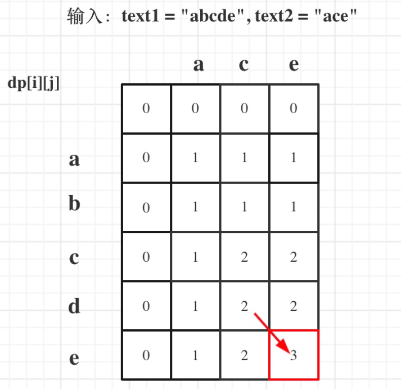
> >
> > 最后红框dp[text1.size()][text2.size()]为最终结果
>
> ```js
> var longestCommonSubsequence = function(text1, text2) {
>     // dp[i][j]：长度为[0, i -1]的字符串text1和长度为[0, j - 1]的字符串的最长公共子序列
>     let dp = new Array(text1.length + 1).fill(0).map(() => new Array(text2.length + 1).fill(0));
>     let res = 0;
>     for (let i = 1; i <= text1.length; i++) {
>         for (let j = 1; j <= text2.length; j++) {
>             if (text1[i - 1] === text2[j - 1]) {
>                 dp[i][j] = dp[i - 1][j - 1] + 1;
>             } else {
>                 dp[i][j] = Math.max(dp[i - 1][j], dp[i][j - 1]);
>             }
>             res = Math.max(res, dp[i][j]);
>         }
>     }
>     return res;
> };
> ```

## [1035. 不相交的线](https://leetcode.cn/problems/uncrossed-lines/)-思路同1143

难度中等326

在两条独立的水平线上按给定的顺序写下 `nums1` 和 `nums2` 中的整数。

现在，可以绘制一些连接两个数字 `nums1[i]` 和 `nums2[j]` 的直线，这些直线需要同时满足满足：

-  `nums1[i] == nums2[j]`
- 且绘制的直线不与任何其他连线（非水平线）相交。

请注意，连线即使在端点也不能相交：每个数字只能属于一条连线。

以这种方法绘制线条，并返回可以绘制的最大连线数。

 

**示例 1：**


```
输入：nums1 = [1,4,2], nums2 = [1,2,4]
输出：2
解释：可以画出两条不交叉的线，如上图所示。 
但无法画出第三条不相交的直线，因为从 nums1[1]=4 到 nums2[2]=4 的直线将与从 nums1[2]=2 到 nums2[1]=2 的直线相交。
```

> 这题的难点在于理解题目想要考察的东西，理解题目想求得是什么，之后发现就是求最长公共子序列。
>
> 题意分析：
>
> “绘制一些连接两个数字 A[i] 和 B[j] 的直线，只要 A[i] == B[j]，且直线不能相交！”
>
> --- 直线不能相交，说明在字符串A中找到一个与字符串B相同的子序列，且这个子序列不能改变相对顺序，只要相对顺序不改变，链接相同的数字的直线就不会相交。
>
> 比如例子1，就是说A和B的最长公共子序列是[1,4]，长度为2。 这个公共子序列指的是`相对顺序不变`（即数字4在字符串A中数字1的后面，那么数字4也应该在字符串B数字1的后面）
>
> 综上所述，**本题说是求绘制的最大连线数，其实就是求两个字符串的最长公共子序列的长度！**
>
> 因此和上一题的代码一模一样
>
> ```js
> var maxUncrossedLines = function(nums1, nums2) {
>     // dp[i][j]：以 i-1 下标结尾的nums1，以下标 j-1 结尾的nums2，它们的最长公共子序列长度
>     let dp = new Array(nums1.length + 1).fill(0).map(() => new Array(nums2.length + 1).fill(0));
>     let res = 0;
>     for (let i = 1; i <= nums1.length; i++) {
>         for (let j = 1; j <= nums2.length; j++) {
>             if (nums2[j - 1] === nums1[i - 1]) {
>                 dp[i][j] = Math.max(dp[i][j], dp[i - 1][j - 1] + 1);
>             } else {
>                 dp[i][j] = Math.max(dp[i - 1][j], dp[i][j - 1]);
>             }
>             res = Math.max(res, dp[i][j]);0
>         }
>     }
>     return res;
> };
> ```
>

## [53. 最大子数组和](https://leetcode.cn/problems/maximum-subarray/)

[labuladong 题解](https://labuladong.github.io/article/?qno=53)[思路](https://leetcode.cn/problems/maximum-subarray/#)

给你一个整数数组 `nums` ，请你找出一个具有最大和的连续子数组（子数组最少包含一个元素），返回其最大和。

**子数组** 是数组中的一个连续部分。

**示例 1：**

```
输入：nums = [-2,1,-3,4,-1,2,1,-5,4]
输出：6
解释：连续子数组 [4,-1,2,1] 的和最大，为 6 。
```

> 贪心也可以解，参见贪心专题
>
> dp五部曲
>
> > 1. 确定dp以及下标的含义
> >
> > dp[i]：包括下标i之前的数组的 最大连续子数组和
> >
> > 2. 确定递推公式
> >
> > dp[i]有两种「选择」，要么与前面的相邻子数组连接，形成一个和更大的子数组；要么不与前面的子数组连接，自成一派，自己作为一个子数组：
> >
> > - dp[i - 1] + nums[i]，即：nums[i]加入当前连续子序列和
> > - nums[i]，即：从头开始计算当前连续子序列和
> >
> > 一定是取最大的，所以dp[i] = max(dp[i - 1] + nums[i], nums[i]);
> >
> > 3. dp数组初始化
> >
> > 根据dp[i]的定义，很明显dp[0]应为nums[0]即dp[0] = nums[0]。
> >
> > 4. 确定遍历顺序
> >
> > 递推公式中dp[i]依赖于dp[i - 1]的状态，需要从前向后遍历。
> >
> > 5. 举例推导dp数组
> >
> > 以示例一为例，输入：nums = [-2,1,-3,4,-1,2,1,-5,4]，对应的dp状态如下：
> >
> > 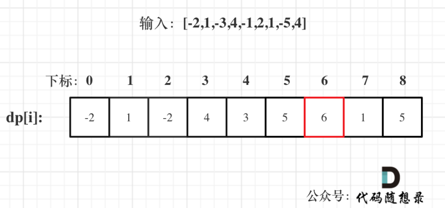
> >
> > ```js
> > var maxSubArray = function(nums) {
> >     // dp[i]，包括下标i之前的数组的最大连续子数组和
> >     let dp = new Array(nums.length).fill(0);
> >     dp[0] = nums[0];
> >     for (let i = 1; i < nums.length; i++) {
> >         dp[i] = Math.max(nums[i], dp[i - 1] + nums[i]);
> >     }
> >     return Math.max(...dp);
> > };
> > ```
> >
> > **注意最后的结果可不是dp[nums.size() - 1]！** ，而是dp[6]。
> >
> > 在回顾一下dp[i]的定义：包括下标i之前的最大连续子序列和为dp[i]。
> >
> > 那么我们要找最大的连续子序列，就应该找每一个i为终点的连续最大子序列。
> >
> > 所以在递推公式的时候，可以直接选出最大的dp[i]。
> >
> > 当然，因为是一维数组，也可以直接展开然后挑出最大值

## [392. 判断子序列](https://leetcode.cn/problems/is-subsequence/)

[labuladong 题解](https://labuladong.github.io/article/?qno=392)[思路](https://leetcode.cn/problems/is-subsequence/#)

难度简单671

给定字符串 **s** 和 **t** ，判断 **s** 是否为 **t** 的子序列。

字符串的一个子序列是原始字符串删除一些（也可以不删除）字符而不改变剩余字符相对位置形成的新字符串。（例如，`"ace"`是`"abcde"`的一个子序列，而`"aec"`不是）。

**`进阶`：**

如果有大量输入的 S，称作 S1, S2, ... , Sk 其中 k >= 10亿，你需要依次检查它们是否为 T 的子序列。在这种情况下，你会怎样改变代码？

**致谢：**

特别感谢 [@pbrother ](https://leetcode.com/pbrother/)添加此问题并且创建所有测试用例。

 

**示例 1：**

```js
输入：s = "abc", t = "ahbgdc"
输出：true
```

> （这道题可以用双指针的思路来实现，时间复杂度就是$O(n)$）
>
> 这道题应该算是编辑距离的入门题目，因为从题意中我们也可以发现，只需要计算删除的情况，不用考虑增加和替换的情况。
>
> **所以掌握本题也是对后面要讲解的编辑距离的题目打下基础**。
>
> dp五部曲
>
> > 1. 确定dp以及下标含义
> >
> > **`dp[i][j]` 表示以下标i-1为结尾的字符串s，和以下标j-1为结尾的字符串t，相同子序列的长度为`dp[i][j]`**。
> >
> > 注意这里是判断s是否为t的子序列。即t的长度是大于等于s的。
> >
> > 这里相差 1 ， 是为了方便书写表达，容易理解
> >
> > 2. 确定递推公式
> >
> > - if (s[i - 1] == t[j - 1])
> >   - t中找到了一个字符在s中也出现了
> > - if (s[i - 1] != t[j - 1])
> >   - 相当于t要删除元素，继续匹配
> >
> > if (s[i - 1] == t[j - 1])，那么`dp[i][j] = dp[i - 1][j - 1] + 1`;，因为找到了一个相同的字符，相同子序列长度自然要在`dp[i-1][j-1]`的基础上加1（**如果不理解，在回看一下`dp[i][j]`的定义**）
> >
> > if (s[i - 1] != t[j - 1])，此时相当于t要删除元素，t如果把当前元素t[j - 1]删除，那么`dp[i][j]` 的数值就是 看s[i - 1]与 t[j - 2]的比较结果了，即：`dp[i][j] = dp[i][j - 1]`;
> >
> > 3. 初始化dp
> >
> > 从递推公式可以看出`dp[i][j]`都是依赖于`dp[i - 1][j - 1]` 和 `dp[i][j - 1]`，所以`dp[0][0]`和`dp[i][0]`是一定要初始化的。
> >
> > 这里大家已经可以发现，在定义`dp[i][j]`含义的时候为什么要**表示以下标i-1为结尾的字符串s，和以下标j-1为结尾的字符串t，相同子序列的长度为`dp[i][j]`**。
> >
> > 因为这样的定义在dp二维矩阵中可以`留出初始化`的区间，如图：
> >
> > 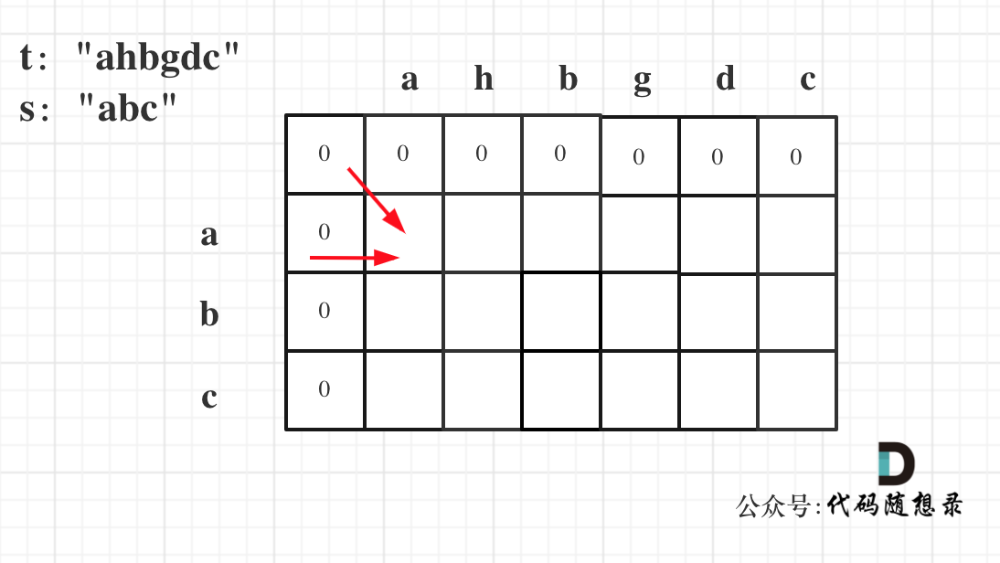
> >
> > 如果要是定义的`dp[i][j]`是以下标i为结尾的字符串s和以下标j为结尾的字符串t，初始化就比较麻烦了。
> >
> > `dp[i][0]` 表示以下标i-1为结尾的字符串，与空字符串的相同子序列长度，所以为0. `dp[0][j]`同理。
> >
> > **其实这里只初始化`dp[i][0]`就够了，但一起初始化也方便，所以就一起操作了**，代码如下：
> >
> > ```cpp
> > vector<vector<int>> dp(s.size() + 1, vector<int>(t.size() + 1, 0));
> > ```
> >
> > 4. 确定遍历顺序
> >
> > 从左往右，从前到后
> >
> > 如图所示：
> >
> > 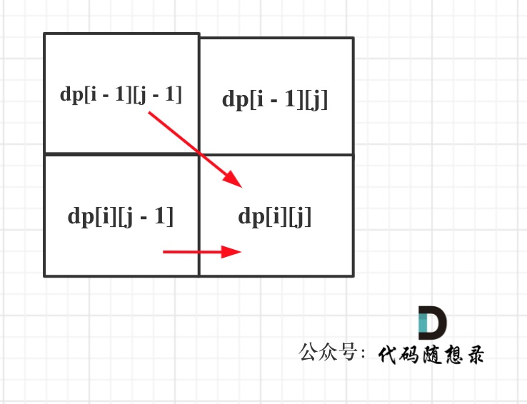
> >
> > 5. 举例推导
> >
> > 以示例一为例，输入：s = "abc", t = "ahbgdc"，dp状态转移图如下：
> >
> > 
> >
> > `dp[i][j]`表示以下标i-1为结尾的字符串s和以下标j-1为结尾的字符串t 相同子序列的长度，所以如果`dp[s.size()][t.size()]` 与 字符串s的长度相同说明：s与t的最长相同子序列就是s，那么s 就是 t 的子序列。
> >
> > 图中dp[s.size()][t.size()] = 3， 而s.size() 也为3。所以s是t 的子序列，返回true。
> >
> > ```js
> > var isSubsequence = function(s, t) {
> >     // dp[i][j]：以下标 i-1 结尾的字符串s 和 以下标 j-1 结尾的字符串t，相同子序列的长度
> >     let dp = new Array(s.length + 1).fill(0).map(() => new Array(t.length + 1).fill(0));
> >     for (let i = 1; i <= s.length; i++) {
> >         for (let j = 1; j <= t.length; j++) {
> >             if (s[i - 1] === t[i - 1]) {
> >                 dp[i][j] = dp[i - 1][j - 1] + 1;
> >             } else {
> >                 dp[i][j] = dp[i][j - 1];
> >             }
> >         }
> >     }
> >     return dp[s.length][t.length] === s.length ? true : false;
> > };
> > ```
> >
> > 
> >
> > - 时间复杂度：$O(n × m)$
> > - 空间复杂度：$O(n × m)$

## [115. 不同的子序列](https://leetcode.cn/problems/distinct-subsequences/)

[labuladong 题解](https://labuladong.github.io/article/?qno=115)[思路](https://leetcode.cn/problems/distinct-subsequences/#)

给定一个字符串 `s` 和一个字符串 `t` ，计算在 `s` 的子序列中 `t` 出现的个数。

字符串的一个 **子序列** 是指，通过删除一些（也可以不删除）字符且不干扰剩余字符相对位置所组成的新字符串。（例如，`"ACE"` 是 `"ABCDE"` 的一个子序列，而 `"AEC"` 不是）

题目数据保证答案符合 32 位带符号整数范围。

**示例 1：**

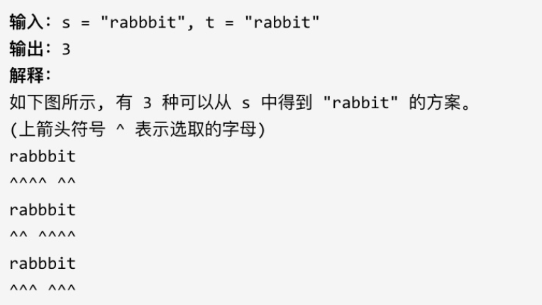

> dp五部曲
>
> > 1. 确定dp以及下标含义
> >
> > `dp[i][j]`：以 下标i-1 为结尾的s子序列中出现以 下标j-1 结尾的t的个数为 `dp[i][j]`
> >
> > 2. 确定递推公式
> >
> > 这一类问题，基本是要分析两种情况
> >
> > - s[i - 1] 与 t[j - 1]相等
> > - s[i - 1] 与 t[j - 1] 不相等
> >
> > 当s[i - 1] 与 t[j - 1]相等时，`dp[i][j]`可以有两部分组成。   ----  `没看懂`
> >
> > 一部分是用s[i - 1]来匹配，那么个数为`dp[i - 1][j - 1]`。
> >
> > 一部分是不用s[i - 1]来匹配，个数为`dp[i - 1][j]`。
> >
> > > 这里一开始没看懂，可以举例理解：
> > >
> > > 比如s:bagg，t:bag
> > >
> > > 当 i=4, j=3，即 s[i - 1] == t[j - 1]    =>    s[3] == t[2]
> > >
> > > （s可以不用s[3]来匹配，即用s[0]s[1]s[2]组成的bag。当然也可以用s[3]来匹配，即：s[0]s[1]s[3]组成的bag。）
> > >
> > > 则`dp[4][3]` = `dp[3][2]` + `dp[3][3]`
> > >
> > > 翻译过来就是：
> > >
> > > bagg 子序列中出现 bag 的个数 = bag 子序列中出现 `ba` 个数 + bag 子序列中出出现 `bag` 个数
> > >
> > > （s[i-1]与t[j-1]匹配了，即不需要考虑当前s子串和t子串的最后一位字母）
> >
> > s[i - 1] 与 t[j - 1]不相等时，`dp[i][j]`只有一部分组成，就是不用s[i - 1]来匹配，即：`dp[i - 1][j]`
> >
> > 所以递推公式为：`dp[i][j] = dp[i - 1][j]`;
> >
> > 3. 初始化dp数组
> >
> > 从递推公式`dp[i][j] = dp[i - 1][j - 1] + dp[i - 1][j]`; 和 `dp[i][j] = dp[i - 1][j]`; 中可以看出`dp[i][0]` 和`dp[0][j]`是一定要初始化的。
> >
> > 每次当初始化的时候，都要回顾一下`dp[i][j]`的定义，不要凭感觉初始化。
> >
> > `dp[i][0]`表示什么呢？
> >
> > `dp[i][0]` 表示：以i-1为结尾的s可以随便删除元素，出现空字符串的个数。
> >
> > 那么`dp[i][0]`一定都是1，因为也就是把以i-1为结尾的s，删除所有元素，出现空字符串的个数就是1。
> >
> > 再来看`dp[0][j]`，`dp[0][j]`：空字符串s可以随便删除元素，出现以j-1为结尾的字符串t的个数。
> >
> > 那么`dp[0][j]`一定都是0，s如论如何也变成不了t。
> >
> > 最后就要看一个特殊位置了，即：`dp[0][0]` 应该是多少。
> >
> > `dp[0][0]`应该是1，空字符串s，可以删除0个元素，变成空字符串t。
> >
> > 4. 确定遍历顺序
> >
> > 从递推公式`dp[i][j] = dp[i - 1][j - 1] + dp[i - 1][j]`; 和 `dp[i][j] = dp[i - 1][j]`; 中可以看出`dp[i][j]`都是根据左上方和正上方推出来的。
> >
> > 所以遍历的时候一定是从上到下，从左到右，这样保证`dp[i][j]`可以根据之前计算出来的数值进行计算。
> >
> > 5. 举例推导dp数组
> >
> > 以s："baegg"，t："bag"为例，推导dp数组状态如下：
> >
> > 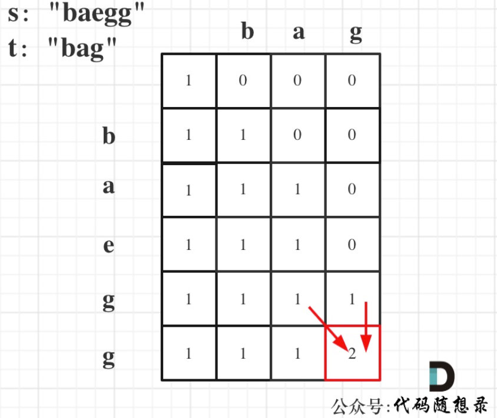
> >
> > ```js
> > var numDistinct = function(s, t) {
> >     // dp[i][j]：以下标 i-1 结尾的s的子序列出现 下标j-1 结尾的t的个数
> >     let dp = Array.from(Array(s.length + 1), () => Array(t.length + 1).fill(0));
> >     for (let i = 0; i <= s.length; i++) {
> >         dp[i][0] = 1;
> >     }
> >     for (let i = 1; i <= s.length; i++) {
> >         for (let j = 1; j <= t.length; j++) {
> >             if (s[i - 1] === t[j - 1]) {
> >                 dp[i][j] = dp[i - 1][j - 1] + dp[i - 1][j];
> >             } else {
> >                 dp[i][j] = dp[i - 1][j];
> >             }
> >         }
> >     }
> >     return dp[s.length][t.length];
> > };
> > ```
> >
> > ps:注意，学到了定义二维数组的新方式，Array.from()

## [583. 两个字符串的删除操作](https://leetcode.cn/problems/delete-operation-for-two-strings/)

[labuladong 题解](https://labuladong.github.io/article/?qno=583)[思路](https://leetcode.cn/problems/delete-operation-for-two-strings/#)

给定两个单词 `word1` 和 `word2` ，返回使得 `word1` 和 `word2` **相同**所需的**最小步数**。

**每步** 可以删除任意一个字符串中的一个字符。

**示例 1：**

```js
输入: word1 = "sea", word2 = "eat"
输出: 2
解释: 第一步将 "sea" 变为 "ea" ，第二步将 "eat "变为 "ea"
```

> 本题和[动态规划：115.不同的子序列 (opens new window)](https://programmercarl.com/0115.不同的子序列.html)相比，其实就是两个字符串都可以删除了，情况虽说复杂一些，但整体思路是不变的。
>
> 这次是两个字符串可以相互删了，这种题目也是用动态规划的思路来解，动规五部曲，分析如下：
>
> 第一种dp方法：
>
> > 1. 确定dp数组以及下标
> >
> > `dp[i][j]`：以i-1结尾的字符串word1，和以j-1结尾的字符串word2，想要达到相等，所需要删除的元素的最少次数
> >
> > 2. 确定递推公式
> >
> > - 当word1[i - 1] 与 word2[j - 1]相同的时候
> > - 当word1[i - 1] 与 word2[j - 1]不相同的时候
> >
> > 当word1[i - 1] 与 word2[j - 1]相同的时候，`dp[i][j] = dp[i - 1][j - 1]`;
> >
> > 当word1[i - 1] 与 word2[j - 1]不相同的时候，有三种情况：
> >
> > 情况一：删word1[i - 1]，最少操作次数为`dp[i - 1][j] + 1`
> >
> > 情况二：删word2[j - 1]，最少操作次数为`dp[i][j - 1] + 1`
> >
> > 情况三：同时删word1[i - 1]和word2[j - 1]，操作的最少次数为`dp[i - 1][j - 1] + 2`
> >
> > 那最后当然是取最小值，所以当word1[i - 1] 与 word2[j - 1]不相同的时候，递推公式：`dp[i][j] = min({dp[i - 1][j - 1] + 2, dp[i - 1][j] + 1, dp[i][j - 1] + 1})`;
> >
> > 3. dp数组如何初始化
> >
> > 从递推公式中，可以看出来，`dp[i][0]` 和 `dp[0][j]`是一定要初始化的。
> >
> > `dp[i][0]`：word2为空字符串，以i-1为结尾的字符串word1要删除多少个元素，才能和word2相同呢，很明显`dp[i][0] = i`。
> >
> > `dp[0][j]`的话同理
> >
> > 4. 确定遍历顺序
> >
> > 从递推公式 `dp[i][j] = min(dp[i - 1][j - 1] + 2, min(dp[i - 1][j], dp[i][j - 1]) + 1)`; 和`dp[i][j] = dp[i - 1][j - 1]`可以看出`dp[i][j]`都是根据左上方、正上方、正左方推出来的。
> >
> > 所以遍历的时候一定是从上到下，从左到右，这样保证`dp[i][j]`可以根据之前计算出来的数值进行计算。
> >
> > 5. 举例推导dp数组
> >
> > 以word1:"sea"，word2:"eat"为例，推导dp数组状态图如下：
> >
> > 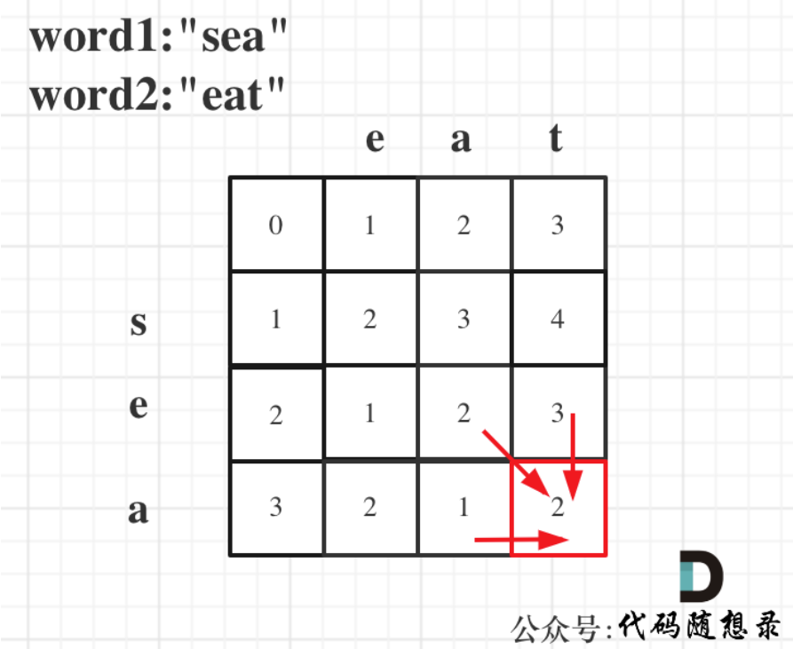
>
> ```js
> var minDistance = function(word1, word2) {
>     // dp[i][j]：以下标 i-1 结尾的word1，和以下标 j-1 结尾的word2，相等时所删除的最小字符个数
>     let dp = Array.from(Array(word1.length + 1), () => Array(word2.length + 1).fill(0));
>     // 初始化：dp[i][0] = i，dp[0][j] = j
>     for (let i = 0; i <= word1.length; i++) {
>         dp[i][0] = i;
>     }
>     for (let j = 0; j <= word2.length; j++) {
>         dp[0][j] = j;
>     }
>     for (let i = 1; i <= word1.length; i++) {
>         for (let j = 1; j <= word2.length; j++) {
>             if (word1[i - 1] === word2[j - 1]) {
>                 dp[i][j] = dp[i - 1][j - 1];
>             } else {
>                 dp[i][j] = Math.min(dp[i - 1][j] + 1, dp[i][j - 1] + 1, dp[i - 1][j - 1] + 2);
>             }
>         }
>     }
>     return dp[word1.length][word2.length];
> };
> ```
>
> 第二种dp思路：
>
> 本题和[动态规划：1143.最长公共子序列 (opens new window)](https://programmercarl.com/1143.最长公共子序列.html)基本相同
>
> 只要求出两个字符串的最长公共子序列长度即可
>
> 那么除了最长公共子序列之外的字符都是必须删除的
>
> 最后用两个字符串的总长度  减去  最长公共子序列的长度*2  就是  删除的最少步数。
>
> ```js
> var minDistance = function(word1, word2) {
>     // 先求出最长公共子序列，再用总长度减去最长公共子序列*2就是结果
>     const m = word1.length, n = word2.length;
>     // dp[i][j]：以下标 i-1 结尾的word1，以下标 j-1 结尾的word2，最长公共子序列的长度
>     let dp = new Array(m + 1).fill(0).map(() => new Array(n + 1).fill(0));
>     for (let i = 1; i <= m; i++) {
>         for (let j = 1; j <= n; j++) {
>             if (word1[i - 1] === word2[j - 1]) {
>                 dp[i][j] = dp[i - 1][j - 1] + 1;
>             } else {
>                 dp[i][j] = Math.max(dp[i - 1][j], dp[i][j - 1])
>             }
>         }
>     }
>     return m + n - dp[m][n] * 2;
> };
> ```
>

## [72. 编辑距离](https://leetcode.cn/problems/edit-distance/)

[labuladong 题解](https://labuladong.github.io/article/?qno=72)[思路](https://leetcode.cn/problems/edit-distance/#)

给你两个单词 `word1` 和 `word2`， *请返回将 `word1` 转换成 `word2` 所使用的最少操作数* 。

你可以对一个单词进行如下三种操作：

- 插入一个字符
- 删除一个字符
- 替换一个字符

**示例 1：**

```
输入：word1 = "horse", word2 = "ros"
输出：3
解释：
horse -> rorse (将 'h' 替换为 'r')
rorse -> rose (删除 'r')
rose -> ros (删除 'e')
```

> 编辑距离是用动规来解决的经典题目，这道题目看上去好像很复杂，但用动规可以很巧妙的算出最少编辑距离。
>
> dp五部曲
>
> > 1. 确定dp数组（dp table）以及下标的含义
> >
> > **`dp[i][j]` 表示以下标i-1为结尾的字符串word1，和以下标j-1为结尾的字符串word2，最近编辑距离为`dp[i][j]`**。
> >
> > 这里在强调一下：为啥要表示下标i-1为结尾的字符串呢，为啥不表示下标i为结尾的字符串呢？
> >
> > 用i来表示也可以！ 但我统一以下标i-1为结尾的字符串，在下面的递归公式中会容易理解一点。
> >
> > 2. 确定递推公式
> >
> > 最重要的一步，其实就是要考虑两大类的四种情况
> >
> > **在整个动规的过程中，最为关键就是正确理解`dp[i][j]`的定义！**
> >
> > ```js
> > if (word1[i - 1] == word2[j - 1])
> >     不操作
> > if (word1[i - 1] != word2[j - 1])
> >     增
> >     删
> >     换
> > ```
> >
> > * if (word1[i - 1] == word2[j - 1])，那么说明不用任何编辑，`dp[i][j]` 就应该是 `dp[i - 1][j - 1]`，即`dp[i][j] = dp[i - 1][j - 1];`
> >
> >   > 牢记`dp[i][j]`的定义：`word1[i - 1]` 与 `word2[j - 1]`相等了，那么就不用编辑了，以下标i-2为结尾的字符串word1和以下标j-2为结尾的字符串`word2`的最近编辑距离`dp[i - 1][j - 1]`就是 `dp[i][j]`了。
> >
> > * if (word1[i - 1] != word2[j - 1]
> >
> >   * 操作一：word1删除一个元素，那么就是以下标 i-2 为结尾的word1 与 j-1 为结尾的word2的最近编辑距离 再加上一个操作。
> >
> >     即 `dp[i][j] = dp[i - 1][j] + 1;`、
> >
> >   * 操作二：word2删除一个元素，那么就是以下标 i-1 为结尾的word1 与 j-2 为结尾的word2的最近编辑距离 再加上一个操作。
> >
> >     即 `dp[i][j] = dp[i][j - 1] + 1;`
> >
> >   > ps：怎么都是删除元素，添加元素去哪了。其实是这么理解：**word2添加一个元素，相当于word1删除一个元素**，那么**word2删除一个元素，相当于word1添加一个元素**
> >
> >   * 替换元素，`word1`替换`word1[i - 1]`，使其与`word2[j - 1]`相同，此时不用增加元素，那么以下标 `i-2` 为结尾的`word1` 与 `j-2` 为结尾的`word2`的最近编辑距离 加上一个替换元素的操作。
> >
> >     即 `dp[i][j] = dp[i - 1][j - 1] + 1;`
> >
> >   综上，当 `if (word1[i - 1] != word2[j - 1])` 时取最小的，即：`dp[i][j] = min({dp[i - 1][j - 1], dp[i - 1][j], dp[i][j - 1]}) + 1;`
> >
> > 3. 初始化
> >
> > 再回顾一下`dp[i][j]`的定义：
> >
> > **`dp[i][j]`表示以下标i-1为结尾的字符串word1，和以下标j-1为结尾的字符串word2，最近编辑距离为`dp[i][j]`**。
> >
> > 那么`dp[i][0]` 和 `dp[0][j]` 表示什么呢？
> >
> > `dp[i][0]` ：以下标i-1为结尾的字符串word1，和空字符串word2，最近编辑距离为`dp[i][0]`。
> >
> > 那么`dp[i][0]`就应该是i，对word1里的元素全部做删除操作，即：`dp[i][0] = i`;
> >
> > 同理`dp[0][j] = j`;
> >
> > 4. 确定遍历顺序
> >
> > 从如下四个递推公式：
> >
> > - `dp[i][j] = dp[i - 1][j - 1]`
> > - `dp[i][j] = dp[i - 1][j - 1] + 1`
> > - `dp[i][j] = dp[i][j - 1] + 1`
> > - `dp[i][j] = dp[i - 1][j] + 1`
> >
> > 可以看出`dp[i][j]`是依赖左方，上方和左上方元素的，如图：
> >
> > 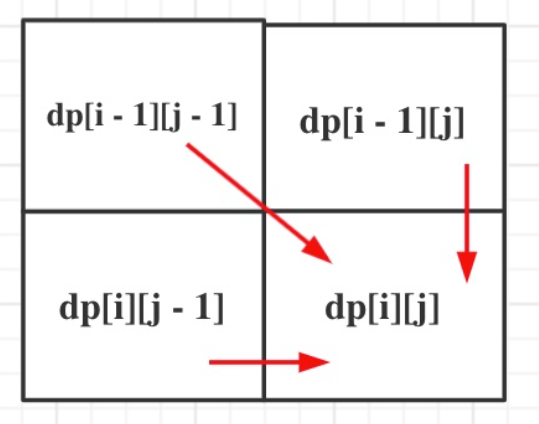
> >
> > 
> >
> > 所以在dp矩阵中一定是从左到右从上到下去遍历。
> >
> > 5. 举例推导
> >
> > 以示例1为例，输入：`word1 = "horse", word2 = "ros"`为例，dp矩阵状态图如下：
> >
> > 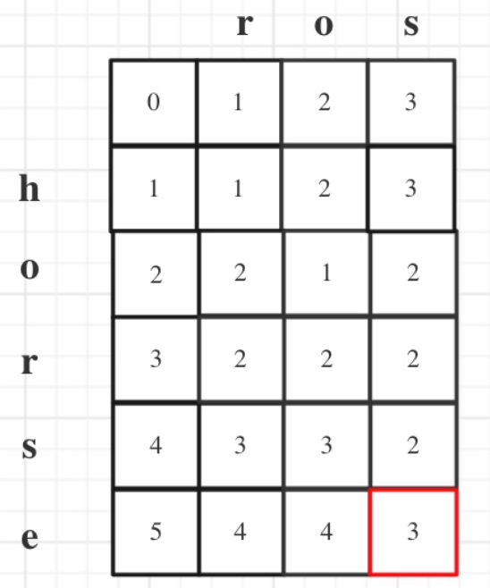
>
> ```js
> var minDistance = function(word1, word2) {
>     const m = word1.length, n = word2.length;
>     // dp[i][j]：以下标 i-1 结尾的word1，转换成以下标 j-1 结尾的word2，最小编辑距离
>     let dp = new Array(m + 1).fill(0).map(() => new  Array(n + 1).fill(0));
>     for (let i = 0; i <= m; i++) {
>         dp[i][0] = i;
>     };
>     for (let j = 0; j <= n; j++) {
>         dp[0][j] = j;
>     };
>     for (let i = 1; i <= m; i++) {
>         for (let j = 1; j <= n; j++) {
>             if (word1[i - 1] === word2[j - 1]) {
>                 dp[i][j] = dp[i - 1][j - 1];
>             } else {
>                 dp[i][j] = Math.min(dp[i - 1][j], dp[i][j - 1], dp[i - 1][j - 1]) + 1;
>             }
>         }
>     }
>     return dp[m][n];
> };
> ```

## [647. 回文子串](https://leetcode.cn/problems/palindromic-substrings/)-连续

给你一个字符串 `s` ，请你统计并返回这个字符串中 **回文子串** 的数目。

**回文字符串** 是正着读和倒过来读一样的字符串。

**子字符串** 是字符串中的由连续字符组成的一个序列。

具有不同开始位置或结束位置的子串，即使是由相同的字符组成，也会被视作不同的子串。

**示例 1：**

```
输入：s = "abc"
输出：3
解释：三个回文子串: "a", "b", "c"
```

> 第一种，暴力解法
>
> 两层for循环，遍历区间起始位置和终止位置，然后判断这个区间是不是回文。
>
> 时间复杂度：$O(n^3)$
>
> 第二种，dp
>
> 第三种，双指针
>
> dp五部曲
>
> > 1. 确定dp数组以及下标含义
> >
> > 布尔类型的`dp[i][j]`：表示区间范围[i,j] （注意是左闭右闭）的子串是否是回文子串，如果是`dp[i][j]`为true，否则为false。
> >
> > 2. 确定递推公式
> >
> > 在确定递推公式时，就要分析如下几种情况。
> >
> > 整体上是两种，就是s[i]与s[j]相等，s[i]与s[j]不相等这两种。
> >
> > 当s[i]与s[j]不相等，那没啥好说的了，`dp[i][j]`一定是false。
> >
> > 当s[i]与s[j]相等时，这就复杂一些了，有如下三种情况
> >
> > - 情况一：下标 i 与 j 相同，同一个字符例如a，当然是回文子串
> > - 情况二：下标 i 与 j 相差为1，例如aa，也是回文子串
> > - 情况三：下标：i 与 j 相差大于1的时候，例如cabac，此时s[i]与s[j]已经相同了，我们看i到j区间是不是回文子串就看aba是不是回文就可以了，那么aba的区间就是 i+1 与 j-1 区间，这个区间是不是回文就看`dp[i + 1][j - 1]`是否为true。
> >
> > 情况分析完毕，只不过还需要一个res来统计有多少个回文子串
> >
> > 3. dp数组初始化
> >
> > 全部初始化为false
> >
> > 4. 确定遍历顺序
> >
> > 本题遍历顺序有点不常规，遍历顺序取决于递推公式，根据情况三可以看到，是根据`dp[i + 1][j - 1]`是否为true，在对`dp[i][j]`进行赋值true的，而`dp[i + 1][j - 1]` 在 `dp[i][j]`的左下角
> >
> > **所以一定要从下到上，从左到右遍历，这样保证`dp[i + 1][j - 1]`都是经过计算的**。
> >
> > ps:有的代码实现是优先遍历列，然后遍历行，其实也是一个道理，都是为了保证`dp[i + 1][j - 1]`都是经过计算的。
> >
> > 5. 举例推导dp数组
> >
> > 举例，输入："aaa"，`dp[i][j]`状态如下：
> >
> > 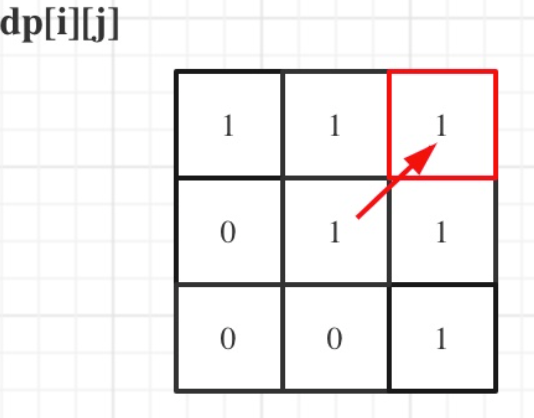
> >
> > 图中有6个true，所以就是有6个回文子串。
> >
> > **注意因为`dp[i][j]`的定义，所以j一定是大于等于i的，那么在填充`dp[i][j]`的时候一定是只填充右上半部分**。
>
> ```js
> var countSubstrings = function(s) {
>     // dp[i][j]：以下标i开头，下标j结尾的闭区间子串是否为回文串，bool值，true为是回文串
>     let dp = new Array(s.length).fill(false).map(() => new Array(s.length).fill(false));
>     let res = 0;
>     for (let i = s.length - 1; i >= 0; i--) {
>         for (let j = i; j < s.length; j++) {
>             if (s[i] === s[j] && (j - i <= 1 || dp[i + 1][j - 1])) {
>                 res++;
>                 dp[i][j] = true;
>             }
>         }
>     }
>     return res;
> };
> ```
>
> - 时间复杂度：$O(n^2)$
> - 空间复杂度：$O(n^2)$
>
> 双指针解法
>
> > dp复杂度偏高，双指针低一些，
> >
> > 首先确定一点，回文串：就是找中心然后向两边扩散看是不是对称的。
> >
> > 那么这个中心点分两种情况：一个元素可以作为中心点，两个元素也可以作为中心点。
> >
> > **这两种情况可以放在一起计算，但分别计算思路更清晰，代码随想录倾向于分别计算**，代码如下：
> >
> > 思路全在注释里面
>
> ```js
> var countSubstrings = function(s) {
>     let len = s.length;
>     let res = 0
>     for (let i = 0; i < len; i++) {
>         // 找出以 一个元素为中心点&两个元素为中心点 的s的子串为回文串的数量
>         res += extend(i, i);
>         res += extend(i, i + 1);
>     }
>     // 以 i j 为中心的s的子串中为回文子串的数量   
>     function extend(i, j) {
>         let res = 0;
>         while (i >= 0 && j < len && s[i] === s[j]) {
>             i--;
>             j++;
>             res++;
>         }
>         return res;
>     }
>     return res;
> };
> ```
>
> - 时间复杂度：$O(n^2)$
> - 空间复杂度：$O(1)$

## [5. 最长回文子串](https://leetcode.cn/problems/longest-palindromic-substring/)

[labuladong 题解](https://labuladong.github.io/article/?qno=5)[思路](https://leetcode.cn/problems/longest-palindromic-substring/#)

难度中等5397

给你一个字符串 `s`，找到 `s` 中最长的回文子串。

 

**示例 1：**

```
输入：s = "babad"
输出："bab"
解释："aba" 同样是符合题意的答案。
```

> 双指针做法：
>
> ```js
> var longestPalindrome = function(s) {
>     let len = s.length;
>     let res = '';
>     function extend(i, j) {
>         while (i >= 0 && j < len && s[i] === s[j]) {
>             i--;
>             j++;
>         }
>         return s.slice(i + 1, j); // i 和 j 在退出while之前多操作了一次，slice为左闭右开取值
>     }
>     for (let i = 0; i < len; i++) {
>        let s1 = extend(i, i);
>        let s2 = extend(i, i + 1);
>        res = res.length > s1.length ? res : s1;
>        res = res.length > s2.length ? res : s2;
>     }
>     return res;
> };
> ```

## [516. 最长回文子序列](https://leetcode.cn/problems/longest-palindromic-subsequence/)-可以不连续

[labuladong 题解](https://labuladong.github.io/article/?qno=516)[思路](https://leetcode.cn/problems/longest-palindromic-subsequence/#)

难度中等825

给你一个字符串 `s` ，找出其中最长的回文子序列，并返回该序列的长度。

子序列定义为：不改变剩余字符顺序的情况下，删除某些字符或者不删除任何字符形成的一个序列。

**示例 1：**

```
输入：s = "bbbab"
输出：4
解释：一个可能的最长回文子序列为 "bbbb" 。
```

> 上题 [动态规划：回文子串 (opens new window)](https://programmercarl.com/0647.回文子串.html)，求的是回文子串，而本题要求的是回文子序列， 要搞清楚这两者之间的区别：**回文子串是要连续的，回文子序列可不是连续的！** 回文子串，回文子序列都是动态规划经典题目。
>
> dp五部曲
>
> > 1. 确定dp以及下标含义
> >
> > **`dp[i][j]`：字符串s在[i, j]范围内最长的回文子序列的长度为`dp[i][j]`**。
> >
> > 2. 确定递推公式
> >
> > 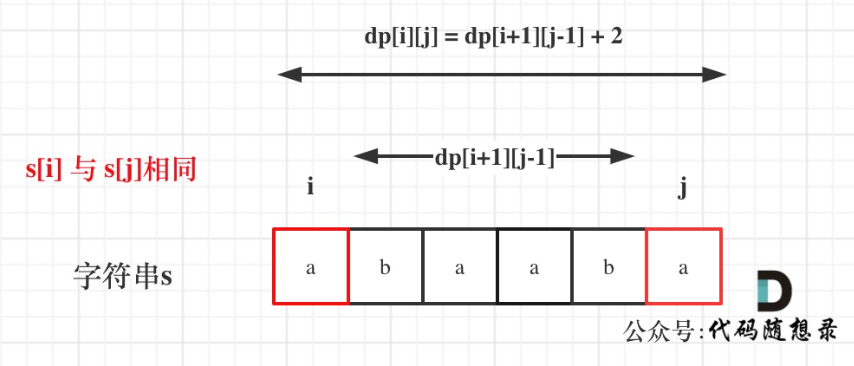
> >
> > 借助上图理解
> >
> > * 如果s[i]与s[j]相同
> >
> >   即 `dp[i][j] = dp[i + 1][j - 1] + 2`;
> >
> > * 如果s[i]与s[j]不相同，说明s[i]和s[j]同时加入s[i+1, j-1]中 并不能增加[i,j]区间回文子串的长度，那么就有两种尝试
> >
> >   * 只加入s[j]的回文子序列长度为`dp[i + 1][j]`
> >   * 只加入s[i]的回文子序列长度为`dp[i][j - 1]`
> >   * 什么都不加，直接pass，最后取最大值，什么都不加就少了很多机会，必然不会是它
> >
> >   即 `dp[i][j] = Math.max(dp[i + 1][j], dp[i][j - 1])`;
> >
> > 3. dp初始化
> >
> > 对`dp[i][j]`，i===j 的情况初始化
> >
> > 首先要考虑当i 和j 相同的情况，从递推公式：`dp[i][j] = dp[i + 1][j - 1] + 2`; 可以看出 递推公式是计算不到 i 和j相同时候的情况。
> >
> > 所以需要手动初始化一下，当i与j相同，那么`dp[i][j]`一定是等于1的，即：一个字符的回文子序列长度就是1。
> >
> > 其他情况`dp[i][j]`初始为0就行，这样递推公式：`dp[i][j] = max(dp[i + 1][j], dp[i][j - 1])`; 中`dp[i][j]`才不会被初始值覆盖。
> >
> > 4. 遍历顺序
> >
> > 也不是常规的，从递推公式可以看出，`dp[i][j]`是依赖于`dp[i + 1][j - 1]` 和 `dp[i + 1][j]`，
> >
> >  **所以遍历i的时候一定要从下到上遍历，这样才能保证，下一行的数据是经过计算的**。如图：
> >
> > 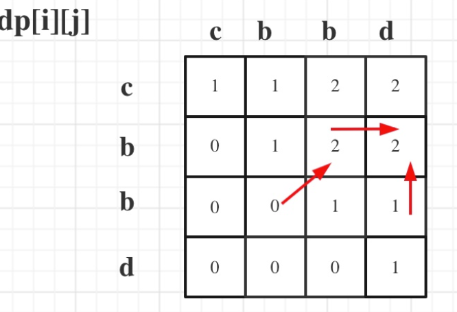
> >
> > 5. 举例推导
> >
> > 输入s:"cbbd" 为例，dp数组状态如图：
> >
> > 红色框即：`dp[0][s.size() - 1]`; 为最终结果。
> >
> > 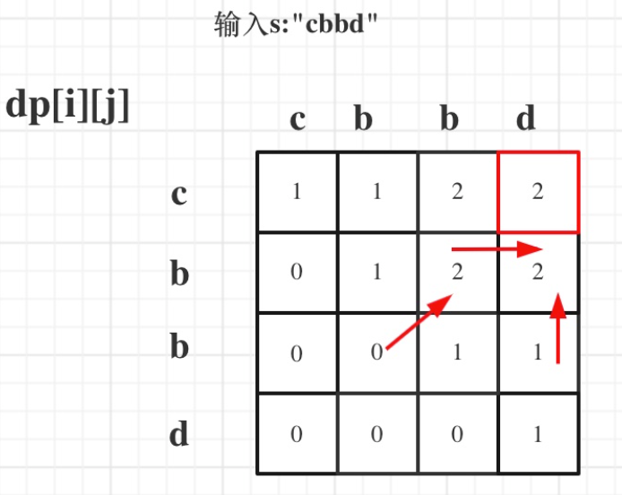

```js
var longestPalindromeSubseq = function(s) {
    const len = s.length;
    // dp[i][j]：以下标i开头，下标j结尾的闭区间的字符串的最长回文子序列的长度
    let dp = new Array(len).fill(0).map(() => new Array(len).fill(0));
    // 初始化：单个字符串dp为1
    for (let i = 0; i < len; i++) {
        dp[i][i] = 1;
    }
    for (let i = len - 1; i >= 0; i--) {
        for (let j = i + 1; j < len; j++) {
            if (s[i] === s[j]) {
                dp[i][j] = dp[i + 1][j - 1] + 2;
            } else {
                dp[i][j] = Math.max(dp[i + 1][j], dp[i][j - 1]);
            }
        }
    }
    return dp[0][len - 1];
};
```


