## [739. 每日温度](https://leetcode.cn/problems/daily-temperatures/)

给定一个整数数组 `temperatures` ，表示每天的温度，返回一个数组 `answer` ，其中 `answer[i]` 是指对于第 `i` 天，下一个更高温度出现在几天后。如果气温在这之后都不会升高，请在该位置用 `0` 来代替。

**示例 1:**

```
输入: temperatures = [73,74,75,71,69,72,76,73]
输出: [1,1,4,2,1,1,0,0]
```

> 解法1，双层暴力循环
>
> 解法2，单调栈
>
> 但是
>
> * 怎么能想到用单调栈呢？
> * 什么时候用单调栈呢？
>
> **通常是一维数组，要寻找任一个元素的右边或者左边第一个比自己大或者小的元素的位置，此时我们就要想到可以用单调栈了**。
>
> 时间复杂度为O(n)。
>
> 例如本题其实就是找到右边第一个比自己大的元素。
>
> 此时就应该想到用单调栈了。
>
> * 那么单调栈的原理是什么呢？
> * 为什么时间复杂度是O(n)就可以找到每一个元素的右边第一个比它大的元素位置呢？
>
> 单调栈的本质是`空间换时间`：因为在遍历的过程中需要用一个栈来记录右边第一个比当前元素高的元素，优点是只需要遍历一次。
>
> 在使用单调栈的时候首先要明确如下几点：
>
> 1. 单调栈里存放的元素是什么？
>
> 单调栈里只需要存放元素的下标i就可以了，如果需要使用对应的元素，直接T[i]就可以获取。
>
> 1. 单调栈里元素是递增呢？ 还是递减呢？
>
> **注意一下顺序为 从栈头到栈底的顺序**
>
> 这里我们要使用递增循序（再强调一下是指从栈头到栈底的顺序），`因为只有递增的时候，加入一个元素i，才知道栈顶元素在数组中右面第一个比栈顶元素大的元素是i`。
>
> 文字描述理解起来有点费劲，接下来画了一系列的图，来讲解单调栈的工作过程。
>
> 使用单调栈主要有三个判断条件。
>
> - 当前遍历的元素T[i]小于栈顶元素T[st.top()]的情况
> - 当前遍历的元素T[i]等于栈顶元素T[st.top()]的情况
> - 当前遍历的元素T[i]大于栈顶元素T[st.top()]的情况
>
> **把这三种情况分析清楚了，也就理解透彻了**。
>
> 接下来用temperatures = [73, 74, 75, 71, 71, 72, 76, 73]为例来逐步分析，输出应该是 [1, 1, 4, 2, 1, 1, 0, 0]。
>
> 1. 首先先将第一个遍历元素（下标）加入单调栈
>
> 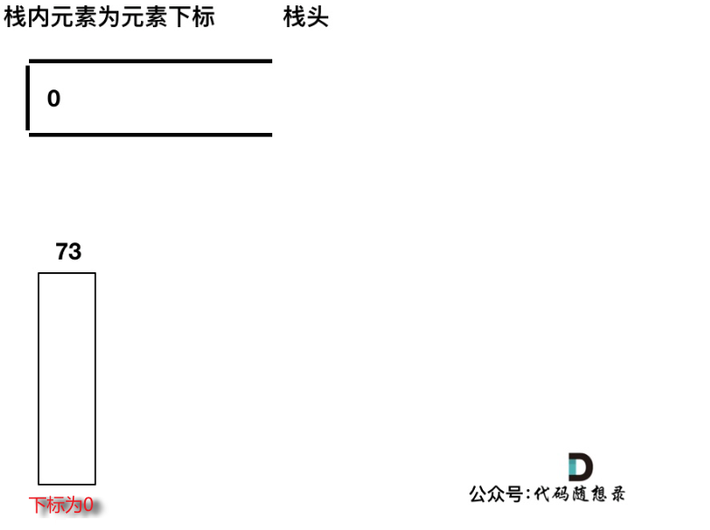
>
> 2. 加入T[1] = 74，因为T[1] > T[0]（当前遍历的元素T[i]大于栈顶元素T[st.top()]的情况），而我们要保持一个递增单调栈（从栈头到栈底），所以将T[0]弹出，T[1]加入，此时result数组可以记录了，result[0] = 1，即T[0]右面第一个比T[0]大的元素是T[1]。
>
>    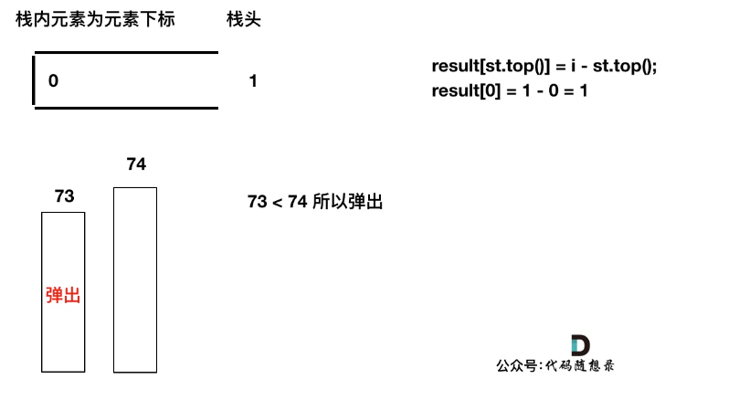
>
>    3. 加入T[2]，同理，T[1]弹出
>
>    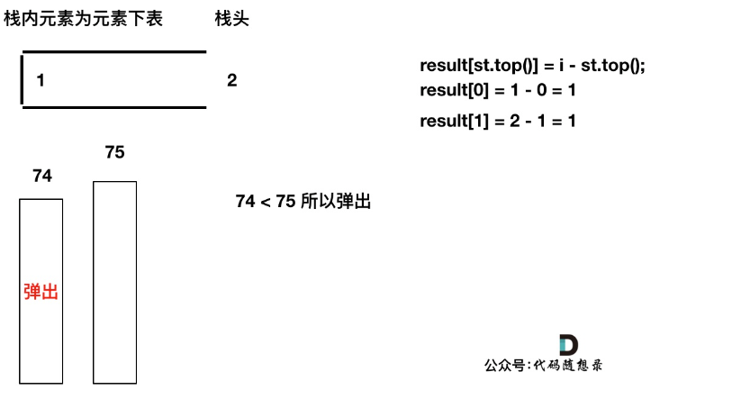
>
>    4. 加入T[3]，T[3] < T[2] （当前遍历的元素T[i]小于栈顶元素T[st.top()]的情况），加T[3]加入单调栈。
>
>       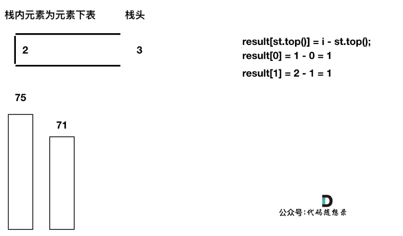
>
>    5. 加入T[4]，T[4] == T[3] （当前遍历的元素T[i]等于栈顶元素T[st.top()]的情况），此时依然要加入栈，不用计算距离，因为我们要求的是右面第一个大于本元素的位置，而不是大于等于！
>
>    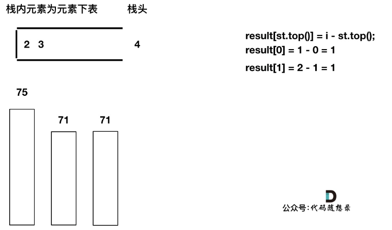
>
>    6. 加入T[5]，T[5] > T[4] （当前遍历的元素T[i]大于栈顶元素T[st.top()]的情况），将T[4]弹出，同时计算距离，更新result
>
>    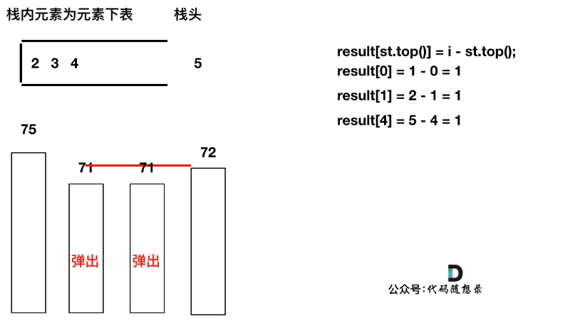
>
>    7. T[4]弹出之后， T[5] > T[3] （当前遍历的元素T[i]大于栈顶元素T[st.top()]的情况），将T[3]继续弹出，同时计算距离，更新result
>
>    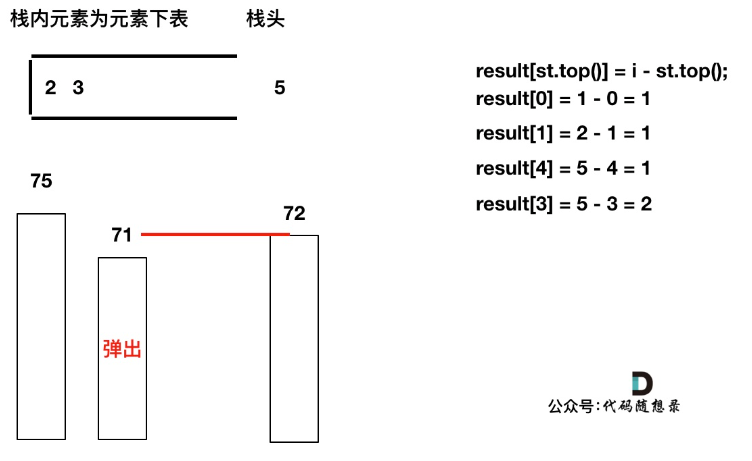
>
>    8. 直到发现T[5]小于T[st.top()]，终止弹出，将T[5]加入单调栈
>
>    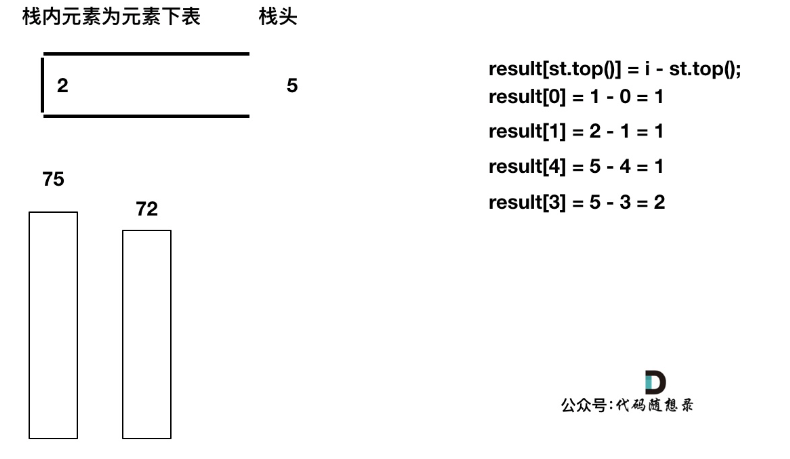
>
>    9. 加入T[6]，同理，需要将栈里的T[5]，T[2]弹出
>
>    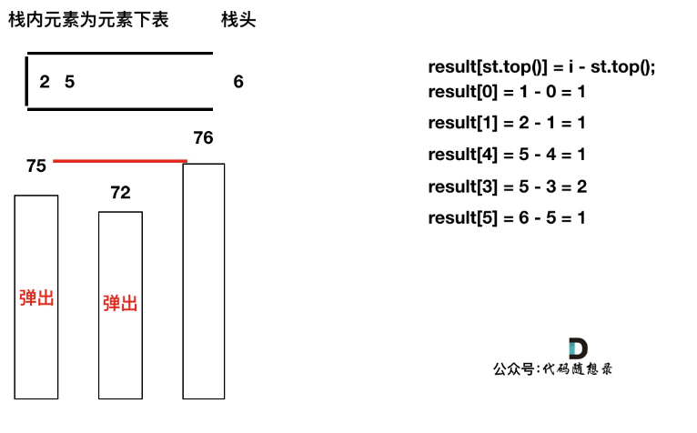
>
>    10. 同理，继续弹出
>
>    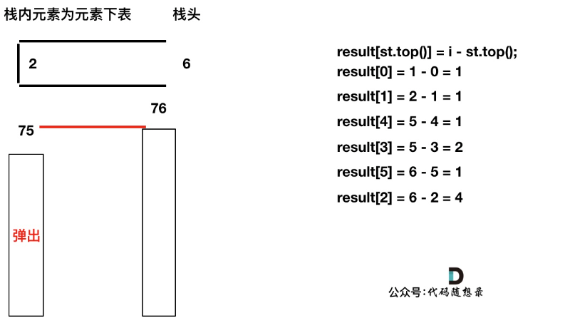
>
>    11. 此时栈里只剩下了T[6]
>
>    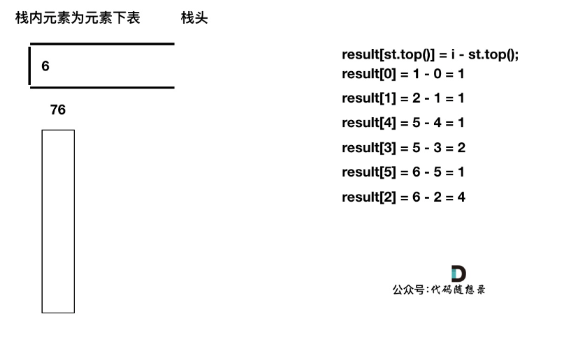
>
>    12. 加入T[7]， T[7] < T[6] 直接入栈，这就是最后的情况，result数组也更新完了。
>
>    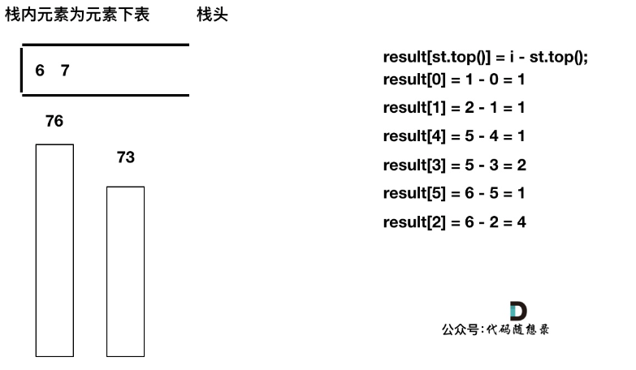
>
>    此时有可能就疑惑了，那result[6] , result[7]怎么没更新啊，元素也一直在栈里。
>
>    其实定义result数组的时候，就应该直接初始化为0，如果result没有更新，说明这个元素右面没有更大的了，也就是为0。
>
>    以上在图解的时候，已经把，这三种情况都做了详细的分析。
>
>    - 情况一：当前遍历的元素T[i]小于栈顶元素T[st.top()]的情况
>    - 情况二：当前遍历的元素T[i]等于栈顶元素T[st.top()]的情况
>    - 情况三：当前遍历的元素T[i]大于栈顶元素T[st.top()]的情况
>
> ```js
> var dailyTemperatures = function(temperatures) {
>     const n = temperatures.length;
>     const res = Array(n).fill(0);
>     const stack = []; // 递增栈，用于存储右边第一个比它大的元素
>     stack.push(0); // 先推入下标0
>     for (let i = 1; i < n; i++) {
>         // 栈顶元素，存的是温度数组的下标
>         const top = stack[stack.length - 1];
>         // 情况一，当前元素小于栈顶所代表的元素
>         if (temperatures[i] < temperatures[top]) {
>             stack.push(i);
>         // 情况二，等于
>         } else if (temperatures[i] === temperatures[top]) {
>             stack.push(i);
>         } else {
>         // 情况三，大于，此时要做操作，保证以栈顶递增
>             while (stack.length && temperatures[i] > temperatures[stack[stack.length - 1]]) {
>                 const top = stack.pop();
>                 res[top] = i - top;
>             }
>             stack.push(i);
>         }
>     }
>     return res;
> };
> ```
>
> - 时间复杂度：O(n)
> - 空间复杂度：O(n)
>
> 必须要先理解透上面代码，才可以精简代码版本：
>
> ```js
> var dailyTemperatures = function(temperatures) {
>     const n = temperatures.length;
>     const res = Array(n).fill(0);
>     const stack = [];
>     stack.push(0);
>     for (let i = 1; i < n; i++) {
>         while (stack.length && temperatures[i] > temperatures[stack[stack.length - 1]]) {
>             const top = stack.pop();
>             res[top] = i - top;
>         }
>         stack.push(i);
>     }
>     return res;
> };
> ```

## [496. 下一个更大元素 I](https://leetcode.cn/problems/next-greater-element-i/)

`nums1` 中数字 `x` 的 **下一个更大元素** 是指 `x` 在 `nums2` 中对应位置 **右侧** 的 **第一个** 比 `x` 大的元素。

给你两个 **没有重复元素** 的数组 `nums1` 和 `nums2` ，下标从 **0** 开始计数，其中`nums1` 是 `nums2` 的子集。

对于每个 `0 <= i < nums1.length` ，找出满足 `nums1[i] == nums2[j]` 的下标 `j` ，并且在 `nums2` 确定 `nums2[j]` 的 **下一个更大元素** 。如果不存在下一个更大元素，那么本次查询的答案是 `-1` 。

返回一个长度为 `nums1.length` 的数组 `ans` 作为答案，满足 `ans[i]` 是如上所述的 **下一个更大元素** 。

**示例 1：**

```
输入：nums1 = [4,1,2], nums2 = [1,3,4,2].
输出：[-1,3,-1]
解释：nums1 中每个值的下一个更大元素如下所述：
- 4 ，用加粗斜体标识，nums2 = [1,3,4,2]。不存在下一个更大元素，所以答案是 -1 。
- 1 ，用加粗斜体标识，nums2 = [1,3,4,2]。下一个更大元素是 3 。
- 2 ，用加粗斜体标识，nums2 = [1,3,4,2]。不存在下一个更大元素，所以答案是 -1 。
```

> **两题的比较**
>
> 在[739. 每日温度 (opens new window)](https://programmercarl.com/0739.每日温度.html)中是求每个元素下一个比当前元素大的元素的 位置下标。
>
> 本题则是说 nums1 是 nums2 的子集，找 nums1 中的元素在 nums2 中下一个比当前元素大的元素的 值。
>
> 本题相比上一题绕了一下，首先，要定义一个和nums1一样大小的数组result来存放结果，初始化为-1。
>
> **`本题要额外注意的思路`**
>
> 没有重复元素，我们就可以用map来做映射了。根据数值快速找到下标
>
> `思路`是这样的：
>
> > 1, 还是按照每日温度的思路，只不过在while循环里，我们不需要再求 位置下标 了，而是转用map来保存当前遍历元素的下一个比当前元素更大的元素。但要注意，不是所有元素都会进入while循环，只有满足 情况三 的才会进入while循环，所以对情况一和情况二，没有赋值，不过没关系，接下来给它们赋值 -1
> >
> > 2， 再用for循环遍历 nums1，利用map.get筛选需要的元素，同时，把get中没有的赋值为 -1，原因见上。
>
> >  关于`单调栈`，再重复一遍：
> >
> > 使用单调栈，首先要想单调栈是从大到小还是从小到大。
> >
> > 栈头到栈底的顺序，要从小到大，也就是保持栈里的元素为递增顺序。只要保持递增，才能找到右边第一个比自己大的元素。其实递减栈就是求右边第一个比自己小的元素了。	
>
> > 接下来就要分析如下`三种情况`，一定要分析清楚。
> >
> > 情况一：当前遍历的元素T[i]小于栈顶元素T[st.top()]的情况
> >
> > 此时满足递增栈（栈头到栈底的顺序），所以直接入栈。
> >
> > 情况二：当前遍历的元素T[i]等于栈顶元素T[st.top()]的情况
> >
> > 如果相等的话，依然直接入栈，因为我们要求的是右边第一个比自己大的元素，而不是大于等于！
> >
> > 情况三：当前遍历的元素T[i]大于栈顶元素T[st.top()]的情况
> >
> > 此时如果入栈就不满足递增栈了，这也是找到右边第一个比自己大的元素的时候。
> >
> > 判断栈顶元素是否在nums1里出现过，（注意栈里的元素是nums2的元素），如果出现过，开始记录结果。
> >
> > 记录结果这块逻辑有一点小绕，要清楚，此时栈顶元素在nums2中右面第一个大的元素是nums2[i]即当前
>
> ```js
> var nextGreaterElement = function(nums1, nums2) {
>     const stack = [];
>     stack.push(0);
>     const map = new Map();
>     for (let i = 1; i < nums2.length; i++) {
>         while (stack.length && nums2[i] > nums2[stack[stack.length - 1]]) {
>             const top = stack.pop();
>             map.set(nums2[top], nums2[i]);
>         }
>         stack.push(i);
>     }
>     const res = [];
>     for (let j = 0; j < nums1.length; j++) {
>         res[j] = map.get(nums1[j]) || -1;
>     }
>     return res;
> };
> ```
>
> - 时间复杂度：O(n)
> - 空间复杂度：O(n)

## [503. 下一个更大元素 II](https://leetcode.cn/problems/next-greater-element-ii/)

给定一个循环数组 `nums` （ `nums[nums.length - 1]` 的下一个元素是 `nums[0]` ），返回 *`nums` 中每个元素的 **下一个更大元素*** 。

数字 `x` 的 **下一个更大的元素** 是按数组遍历顺序，这个数字之后的第一个比它更大的数，这意味着你应该循环地搜索它的下一个更大的数。如果不存在，则输出 `-1` 。

**示例 1:**

```
输入: nums = [1,2,1]
输出: [2,-1,2]
解释: 第一个 1 的下一个更大的数是 2；
数字 2 找不到下一个更大的数； 
第二个 1 的下一个最大的数需要循环搜索，结果也是 2。
```

> 这道题和[739. 每日温度 (opens new window)](https://programmercarl.com/0739.每日温度.html)也几乎如出一辙。
>
> 不同的时候本题要`循环数组`了。
>
> 单调栈前面已经详解，略过。
>
> 本篇侧重说一说，如何处理循环数组。
>
> #### 第一种，拼接数组
>
> 直接把两个数组拼接在一起，然后使用单调栈求下一个最大值了。
>
> 两个nums数组拼接在一起，使用单调栈计算出每一个元素的下一个最大值，最后再把结果集即result数组截取一半大小就可以了。
>
> ```js
> var nextGreaterElements = function(nums) {
>  let nums1 = [...nums, ...nums];
>  let res = Array(nums1.length).fill(-1);
>  let stack = [];
>  stack.push(0);
>  for (let i = 1; i < nums1.length; i++) {
>      while (stack.length && nums1[i] > nums1[stack[stack.length - 1]]) {
>          const top = stack.pop();
>          res[top] = nums1[i];
>      }
>      stack.push(i);
>  }
>  return res.splice(0, nums.length);
> };
> ```
>
> #### 第二种
>
> 第一种写法确实比较直观，但做了很多无用操作，例如修改了nums数组，而且最后还要把result数组截取一半。
>
> 其实也可以不扩充nums，而是在遍历的过程中模拟走了两边nums。
>
> 具体表现就是：
>
> * for循环走两边
> * i的地方用 i % n 这样取余的方式来模拟两遍的循环
>
> ```js
> var nextGreaterElements = function(nums) {
>     const n = nums.length;
>     const res = Array(n).fill(-1);
>     const stack = [];
>     for (let i = 0; i < n * 2; i++) {
>         while (stack.length && nums[i % n] > nums[stack[stack.length - 1]]) {
>             const top = stack.pop();
>             res[top] = nums[i % n];
>         }
>         stack.push(i % n);
>     }
>     return res;
> };
> ```
>

## [42. 接雨水](https://leetcode.cn/problems/trapping-rain-water/)

难度困难3587收藏分享切换为英文接收动态反馈

给定 `n` 个非负整数表示每个宽度为 `1` 的柱子的高度图，计算按此排列的柱子，下雨之后能接多少雨水。

**示例 1：**

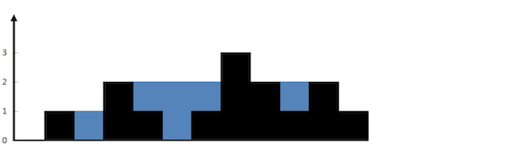

```
输入：height = [0,1,0,2,1,0,1,3,2,1,2,1]
输出：6
解释：上面是由数组 [0,1,0,2,1,0,1,3,2,1,2,1] 表示的高度图，在这种情况下，可以接 6 个单位的雨水（蓝色部分表示雨水）。 
```

> **大厂面试经典题目，接雨水！ 最常青藤的一道题，面试官百出不厌！**
>
> 接雨水问题在面试中还是常见题目的，有必要好好讲一讲。
>
> 本文深度讲解如下三种方法：
>
> - 双指针法
> - 动态规划
> - 单调栈
>
> ### 第一种，双指针法
>
> 首先要明确，要按照行来计算，还是按照列来计算。
>
> 按照行来计算如图：
>
> 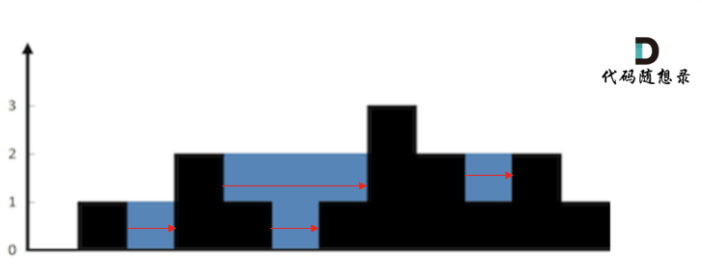
>
> 按照列来计算如图：
>
> 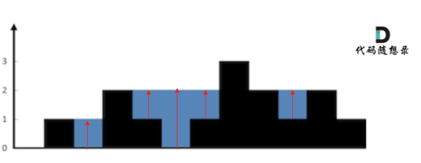
>
> 代码随想录倾向`按照列`来计算，比较容易理解，接下来看一下按照列如何计算。
>
> ##### 思路：
>
> 1. 首先，**如果按照列来计算的话，宽度一定是1了，我们再把每一列的雨水的高度求出来就可以了。**
> 2. `可以看出`每一列`雨水的高度，取决于，该列 `左侧最高的柱子和`右侧最高`的柱子中`最矮`的那个柱子的高度。
> 3. 举个例子来说明2，例如求列4的雨水高度，如图：
>
> 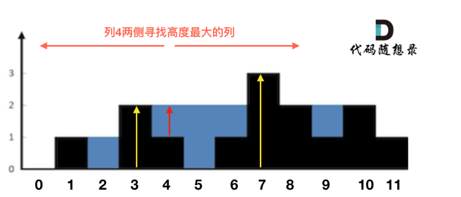
>
> * 列4 左侧最高的柱子是列3，高度为2（以下用lHeight表示）。
>
> * 列4 右侧最高的柱子是列7，高度为3（以下用rHeight表示）。
>
> * 列4 柱子的高度为1（以下用height表示）
>
> * 那么列4的雨水高度为 列3和列7的高度最小值减列4高度，即： min(lHeight, rHeight) - height。
>
> * 列4的雨水高度求出来了，宽度为1，相乘就是列4的雨水体积了。
>
> * 此时求出了列4的雨水体积。
>
> * 一样的方法，只要从头遍历一遍所有的列，然后求出每一列雨水的体积，相加之后就是总雨水的体积了。
>
> 4. 代码思路
>
> * 从头遍历所有的列，并且**要注意第一个柱子和最后一个柱子不接雨水**；
> * 在for循环中求左右两边最高柱子
> * 最后，计算该列的雨水高度
>
> ```js
> var trap = function(height) {
>     const n = height.length;
>     let sum = 0;
>     for (let i = 0; i < n; i++) {
>         // 第一个柱子和最后一个柱子不接水
>         if (i === 0 || i === n - 1) {
>             continue;
>         }
>         let lHeight = height[i]; // 找出当前列左边柱子最大高度
>         let rHeight = height[i]; // 找出当前列右边柱子最大高度
>         for (let l = i - 1; l >= 0; l--) {
>             lHeight = height[l] > lHeight ? height[l] : lHeight;
>         }
>         for (let r = i + 1; r < n; r++) {
>             rHeight = height[r] > rHeight ? height[r] : rHeight;
>         }
>         // 计算此列能接多少雨水之前，先判断能不能接住雨水
>         let h = Math.min(lHeight, rHeight) - height[i];
>         if (h > 0) {
>             sum += h;
>         }
>     }
>     return sum;
> };
> ```
>
> 因为每次遍历列的时候，还要向两边寻找最高的列，所以
>
> 时间复杂度为O(n^2) 
>
> 空间复杂度为O(1)
>
> ### 第二种，动态规划
>
> 总结来说就是，针对双指针法，对求每一列的左右最大高度 的算法进行优化。因为双指针法求最大高度时有重复。
>
> 1. 双指针解法中我们可以看到，当前列雨水面积：min(左边柱子的最高高度，记录右边柱子的最高高度) - 当前柱子高度。
>
> 2. 为了得到两边的最高高度，使用了双指针来遍历，每到一个柱子都向两边遍历一遍，这其实是有`重复计算`的。
>
>    我们把每一个位置的左边最高高度记录在一个数组上（maxLeft）
>
>    右边最高高度记录在一个数组上（maxRight）。
>
>    这样就避免了重复计算，这就用到了`动态规划`。
>
>    maxLeft[i]：第i个位置的左边最高高度，从前往后遍历，初始化maxLeft[0] = height[0]；
>
>    maxRight[i]：第i个位置的右边最高高度，从后往前遍历，初始化maxRight[len - 1] = height[len - 1]；
>
> 3. 如何动态规划：
>
>    当前位置，左边的最高高度是 `前一个位置的左边最高高度`和`本高度`的最大值
>
>    右边的最高高度是 是下一个位置的右边最高高度和本高度的最大值。
>
>    即从左向右遍历：maxLeft[i] = max(height[i], maxLeft[i - 1]);
>
>    从右向左遍历：maxRight[i] = max(height[i], maxRight[i + 1]);
>
> 4. ps：可以取消对首尾柱子不接水的判断，因为首尾柱子的Math.min(maxLeft[i], maxRight[i]) 必然为0，那么 h 值必然小于等于 0，本身也加不到sum里面去；
>
> ```js
> var trap = function(height) {
>     if (height.length <= 2) return 0;
>     const n = height.length;
>     // maxLeft：此列左边最最大值，maxRight：此列右边最大值
>     let maxLeft = Array(n).fill(0);
>     let maxRight = Array(n).fill(0);
>     // dp，分别计算每个柱子左右最大高度
>     maxLeft[0] = height[0];
>     for (let l = 1; l < n; l++) {
>         maxLeft[l] = Math.max(maxLeft[l - 1], height[l]);
>     }
>     maxRight[n - 1] = height[n - 1];
>     for (let r = n - 2; r >= 0; r--) {
>         maxRight[r] = Math.max(maxRight[r + 1], height[r]);
>     }
>     // 求和
>     let sum = 0;
>     for (let i = 0; i < n; i++) {
>         let h = Math.min(maxLeft[i], maxRight[i]) - height[i]; 
>         if (h > 0) {
>             sum += h;
>         }
>     }
>     return sum;
> };
> ```
>
> 时间复杂度为O(n) 
>
> 空间复杂度为O(n)
>
> ### 第三种，单调栈
>
> 这个解法`最不好理解`
>
> 单调栈就是`保持栈内元素有序`。和[栈与队列：单调队列 (opens new window)](https://programmercarl.com/0239.滑动窗口最大值.html)一样，需要我们自己维持顺序，没有现成的容器可以用。
>
> ##### 准备工作
>
> 先弄明白以下几个问题
>
> 1. 首先单调栈是按照`行方向`来计算雨水，前两种是按照列方向的。如图
>
> 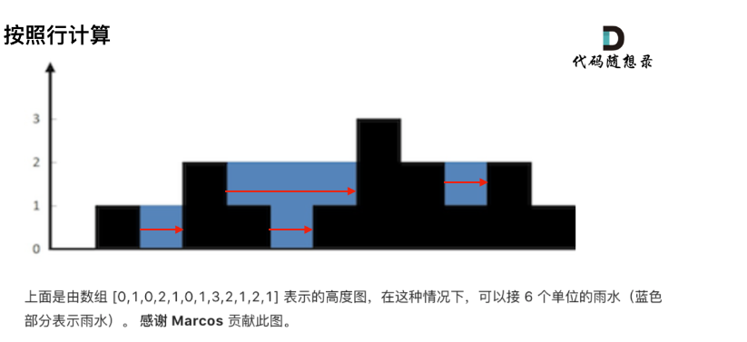
>
> 2. 使用单调栈内元素的顺序：栈头开始递增
>
> 从栈头（元素从栈头弹出）到栈底的顺序应该是从小到大的顺序。也就是栈头开始递增。
>
> 因为一旦发现添加的柱子高度大于栈头元素了，此时就出现凹槽了，`栈头元素`就是凹槽底部的柱子，`栈头第二个元素`就是凹槽左边的柱子，而`添加的元素`就是凹槽右边的柱子。如图：
>
> 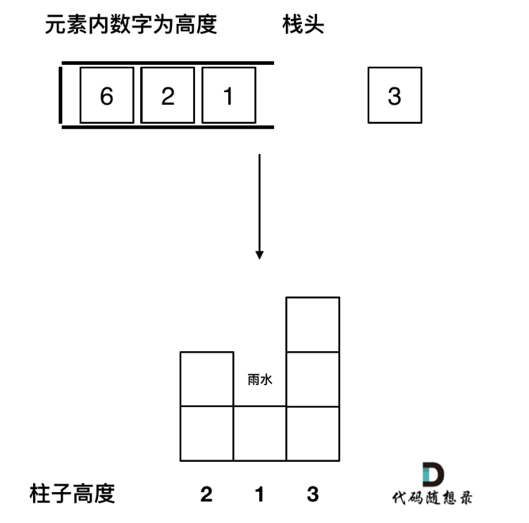
>
> 3. 遇到相同高度的柱子怎么办：更新
>
> 遇到相同的元素，更新栈内下标，就是将栈里元素（旧下标）弹出，将新元素（新下标）加入栈中。
>
> 例如 5 5 1 3 这种情况。如果添加`第二个5`的时候就应该将`第一个5`的下标弹出，把第二个5添加到栈中。
>
> **因为我们要求宽度的时候 如果遇到相同高度的柱子，需要使用最右边的柱子来计算宽度**。如图：
>
> 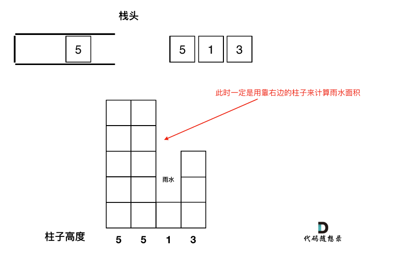
>
> 4. 栈里保存的数值：数组下标
>
> 是用单调栈，其实是通过 长 * 宽 来计算雨水面积的。
>
> 长就是通过`柱子的高度`来计算，宽是通过`柱子之间的下标`来计算，
>
> 那么栈里有没有必要存一个pair<int, int>类型的元素，同时保存柱子的高度和下标呢。
>
> 其实不用，栈里就存放int类型的元素就行了，`表示下标`，想要知道对应的高度，通过height[stack.length - 1] 就知道弹出的下标对应的高度了。
>
> 明确了如上几点，我们再来看处理逻辑。
>
> ##### `单调栈处理逻辑`
>
> 1. 先将下标0的柱子加入到栈中，`st.push(0);`。
>
> 2. 然后开始从下标1开始遍历所有的柱子，`for (let i = 1; i < height.size(); i++)`。
>
> 3. 第一种情况：如果当前遍历的元素（柱子）高度`小于`栈顶元素的高度，就把这个元素`加入`栈中，因为栈里本来就要`保持从小到大`的顺序（从栈头到栈底）。
>
> 4. 第二种情况：如果当前遍历的元素（柱子）高度`等于`栈顶元素的高度，要跟`更新`栈顶元素，因为遇到相相同高度的柱子，需要使用`最右边`的柱子来计算宽度。
>
> 5. 第三种情况：如果当前遍历的元素（柱子）高度`大于`栈顶元素的高度，此时就`出现凹槽`了，要计算接的雨水面积了，举例如图所示：
>
>    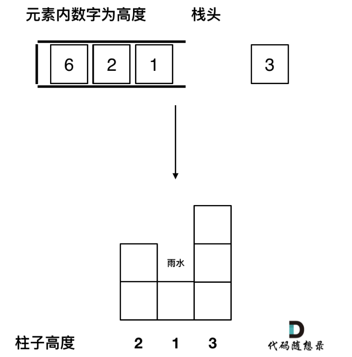
>
> * 取栈顶元素，将`栈顶元素弹出`，这个就是`凹槽的底部`，也就是中间位置，下标记为`mid`，对应的高度为`height[mid]`（就是图中的高度1）。
>
> * `此时的栈顶元素`st.top()，就是`凹槽的左边位置`，下标为`st.length - 1`，对应的高度为`height[st.top()]`（就是图中的高度2）。
>
> * `当前遍历的元素i`，就是`凹槽右边的位置`，下标为`i`，对应的高度为`height[i]`（就是图中的高度3）。
>
> * 此时大家应该可以发现其实就是**栈顶和栈顶的下一个元素以及要入栈的三个元素来接水！**
>
> * 那么雨水`高度`是 min(凹槽左边高度, 凹槽右边高度) - 凹槽底部高度，代码为：`let h = min(height[st.top()], height[i]) - height[mid];`
>
> * 雨水的`宽度`是 凹槽右边的下标 - 凹槽左边的下标 - 1（因为只求中间宽度），代码为：`let w = i - st.top() - 1 ;`
>
>   当前凹槽雨水的体积就是：`h * w`。
>
> 将上述逻辑翻译成代码：
>
> ```js
> var trap = function(height) {
>     if (height.length <= 2) return 0;
>     let stack = []; // 存下标，计算时使用下标对应的柱子高度
>     stack.push(0);
>     let sum = 0;
>     for (let i = 1; i < height.length; i++) {
>         // 情况一
>         if (height[i] < height[stack[stack.length - 1]]) {
>             stack.push(i);
>         // 情况二
>         } else if (height[i] === height[stack[stack.length - 1]]) {
>             stack.pop(); // 可以去掉，效果一样，加上是为了理清代码思路
>             stack.push(i);
>         } else {
>             // 情况三
>             while (stack.length && height[i] > height[stack[stack.length - 1]]) {
>                 // 要弹出栈顶元素，凹槽底部，mid
>                 let mid = stack.pop();  // 注意，情况三只有这里需要出栈，其它不需要
>                 if (stack.length) { // pop了一个元素，要再判断一下stack是否为空，注意是 if 判断
>                     // 此时凹槽左边是现在的栈顶，凹槽右边是正在遍历的元素，h取两者最小，最后减去mid对应的元素
>                     let h = Math.min(height[stack[stack.length - 1]], height[i]) - height[mid];
>                     let w = i - stack[stack.length - 1] - 1; // 注意减1，因为两边都不要
>                     sum += w * h;
>                 }
>             }
>             stack.push(i);
>         }
>     }
>     return sum;
> };
> ```
>
> 上述代码比较繁琐，但是每一种情况剖析的一清二楚，也可以精简，但是一定要弄懂上述三种情况再精简：
>
> ```js
> var trap = function(height) {
>     if (height.length <= 2) return 0;
>     let stack = [];
>     let sum = 0;
>     for (let i = 0; i < height.length; i++) {
>         while (stack.length && height[i] > height[stack[stack.length - 1]]) {
>             let mid = stack.pop();
>             if (stack.length) {
>                 let h = Math.min(height[stack[stack.length - 1]], height[i]) - height[mid];
>                 let w = i - stack[stack.length - 1] - 1;
>                 sum += w * h;
>             }
>         }
>         stack.push(i);
>     }
>     return sum;
> };
> ```

## [84. 柱状图中最大的矩形](https://leetcode.cn/problems/largest-rectangle-in-histogram/)

给定 *n* 个非负整数，用来表示柱状图中各个柱子的高度。每个柱子彼此相邻，且宽度为 1 。

求在该柱状图中，能够勾勒出来的矩形的最大面积。

**示例 1:**

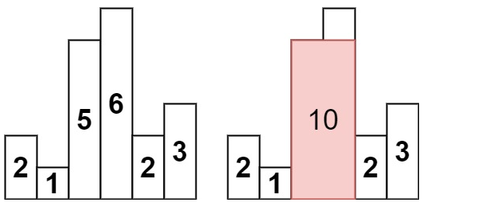

```text
输入：heights = [2,1,5,6,2,3]
输出：10
解释：最大的矩形为图中红色区域，面积为 10
```

> 本题和[42. 接雨水 (opens new window)](https://programmercarl.com/0042.接雨水.html)，是遥相呼应的两道题目，接雨水是左右最高柱子，本题求左右第一个比当前矮的柱子的下标
>
> 原理上有很多相同的地方，但细节上又有差异，更可以加深对单调栈的理解！
>
> 还是分为三种解法
>
> #### 双指针解法-超时
>
> 1. 遍历每个柱子
> 2. 找到左边第一个小于此柱子的柱子下标left
> 3. 找到右边第一个小于此柱子的柱子下标right
> 4. 宽就是 right-left-1，高就是此柱子
> 5. 每次都取面积最大值
>
> ```js
> var largestRectangleArea = function(heights) {
>     let sum = 0;
>     for (let i = 0; i < heights.length; i++) {
>         let left = i - 1;
>         let right = i + 1;
>         while (left >= 0 && heights[left] >= heights[i]) {
>             left--;
>         }
>         while (right < heights.length && heights[right] >= heights[i]) {
>             right++;
>         }
>         let w = right - left - 1;
>         let h = heights[i];
>         sum = Math.max(sum, w * h);
>     }
>     return sum;
> };
> ```
>
> 如上代码并不能通过leetcode，超时了，因为时间复杂度是$O(n^2)$。
>
> ### 动态规划
>
> 本题动态规划的写法整体思路和[42. 接雨水 (opens new window)](https://programmercarl.com/0042.接雨水.html)是一致的，但要难一些。
>
> 难就难在本题要记录每个柱子 左边第一个小于该柱子的`下标`，而不是左边第一个小于该柱子的高度。
>
> 所以需要循环查找，也就是下面在寻找的过程中使用了while
>
> > * 要注意的地方：
> >   * dp的初始化，对从左往右遍历的minLeftIndex，首元素初始化为 -1 从右往左遍历的maxRightIndex，尾元素初始化为 len
> >   * dp存储的是下标，这里下标的转换比较巧妙
>
> ```js
> var largestRectangleArea = function(heights) {
>     const len = heights.length;
>     // dp：左边/右边 第一个小于第i个柱子的下标
>     let minLeftIndex = Array(len).fill(0);
>     let minRightIndex = Array(len).fill(0);
>     // 记录每个柱子 左边第一个小于该柱子的下标
>     minLeftIndex[0] = -1; // 初始化，防止死循环
>     for (let i = 1; i < len; i++) {
>         let left = i - 1;
>         // 不用if，用while，不断向左寻找
>         while (left >= 0 && heights[left] >= heights[i]) {
>             // 既然heights[left]比当前柱子大，那就让当前柱子和左边小于heights[left]的元素比较
>             left = minLeftIndex[left];
>         }
>         // 找到了第一个比当前柱子矮的元素，更新dp
>         minLeftIndex[i] = left;
>     }
>     // 记录每个柱子 右边第一个小于该柱子的下标
>     minRightIndex[len - 1] = len; // 初始化，防止死循环
>     for (let i = len - 2; i >= 0; i--) {
>         let right = i + 1;
>         while (right < len && heights[right] >= heights[i]) {
>             right = minRightIndex[right];
>         }
>         minRightIndex[i] = right;
>     }   
>     // 求和
>     let sum = 0;
>     for (let i = 0; i < len; i++) {
>         let s = heights[i] * (minRightIndex[i] - minLeftIndex[i] - 1);
>         sum = Math.max(sum, s);
>     }
>     return sum;
> };
> ```
>
> ### 单调栈
>
> 本地单调栈的解法和接雨水的题目是遥相呼应的。
>
> 因为，[42. 接雨水 (opens new window)](https://programmercarl.com/0042.接雨水.html)是找每个柱子左右两边第一个大于该柱子高度的柱子，而本题是找每个柱子左右两边第一个小于该柱子的柱子。
>
> **这里就涉及到了单调栈很重要的性质，就是单调栈里的顺序，是从小到大还是从大到小**。
>
> 在上题接雨水的单调栈从栈头（元素从栈头弹出）到栈底的顺序应该是`从小到大`的顺序。
>
> 那么因为本题是要找每个柱子左右两边第一个小于该柱子的柱子，所以从栈头（元素从栈头弹出）到栈底的顺序应该是`从大到小`的顺序！
>
> 举一个例子，如图：
>
> 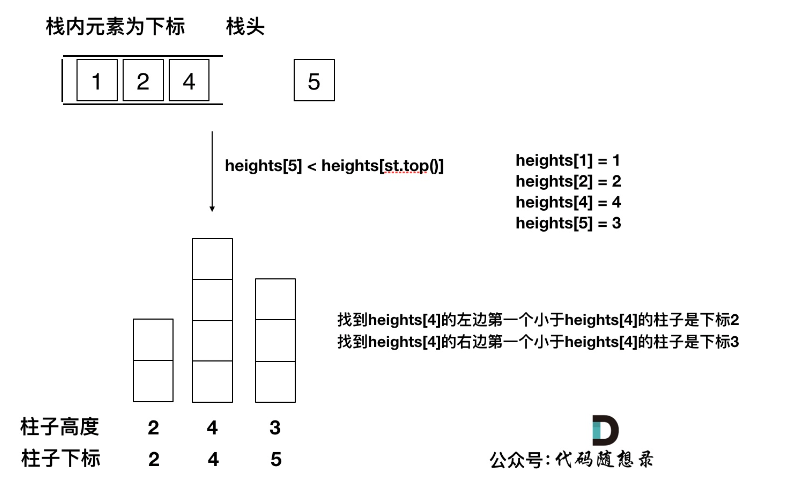
>
> 只有栈里`从大到小的`顺序，才能保证`栈顶元素`找到`左右两边第一个小于栈顶元素的柱子`。
>
> 所以本题单调栈的顺序正好与接雨水`反过来`。
>
> 可以发现其实就是  **栈顶**  和  **栈顶的下一个元素**  以及  **要入栈的**  三个元素组成了我们要求最大面积的高度和宽度
>
> 除了栈内元素顺序和接雨水不同，剩下的逻辑就都差不多了，在题解[42. 接雨水 (opens new window)](https://programmercarl.com/0042.接雨水.html)代码随想录已经对单调栈的各个方面做了详细讲解，这里就不赘述了。
>
> 剩下就是分析清楚如下三种情况：
>
> - 情况一：当前遍历的元素heights[i]小于栈顶元素heights[st.top()]的情况 计算面积
> - 情况二：当前遍历的元素heights[i]等于栈顶元素heights[st.top()]的情况 出栈再入栈，取最近的那个
> - 情况三：当前遍历的元素heights[i]大于栈顶元素heights[st.top()]的情况 入栈
>
> `注意`：柱子数组需要加在首尾加上，**因为与42.接雨水不同的是，本题原首尾的两个柱子可以作为核心柱进行最大面积尝试**
>
> height[i]才是即将要进去的元素
>
> ```js
>     var largestRectangleArea = function(heights) {
>         // 柱子数组需要加在首尾加上，因为与42.接雨水不同的是，
>         // 本题原首尾的两个柱子可以作为核心柱进行最大面积尝试
>         heights = [0, ...heights, 0];
>         const len = heights.length;
>         let stack = [];
>         stack.push(0);
>         let sum = 0;
>         for (let i = 1; i < len; i++) {
>             // 第三种情况，当前柱子大于，注意单调栈是栈头开始递减
>             if (heights[i] > heights[stack[stack.length - 1]]) {
>                 stack.push(i);
>             } else if (heights[i] === heights[stack[stack.length - 1]]) {
>                 // 第二种情况
>                 stack.pop();
>                 stack.push(i);
>             } else {
>                 // 第一种情况
>                 while (stack.length && heights[i] < heights[stack[stack.length - 1]]) {
>                     let mid = stack.pop(); // 以当前栈头柱子作为高，注意要弹出
>                     let w = i - stack[stack.length - 1] - 1; // 以新栈头作为宽的left，i是right
>                     sum = Math.max(sum, w * heights[mid]);
>                 }
>                 stack.push(i);
>             }
>         }
>         return sum;
>     };
> 
>     largestRectangleArea([2,1,5,6,2,3])
> ```
>
> 简洁版：
>
> ```js
>     var largestRectangleArea = function(heights) {
>         heights = [0, ...heights, 0];
>         let stack = [];
>         let sum = 0;
>         for (let i = 0; i < heights.length; i++) {
>             // 一定注意，heights[i]才是当前柱子
>             while (stack.length && heights[i] < heights[stack[stack.length - 1]]) {
>                 const mid = stack.pop();
>                 const w = i - stack[stack.length - 1] - 1;
>                 sum = Math.max(sum, heights[mid] * w);
>             }
>             stack.push(i);
>         }
>         return sum;
>     }
> ```
>
> 
>
> 