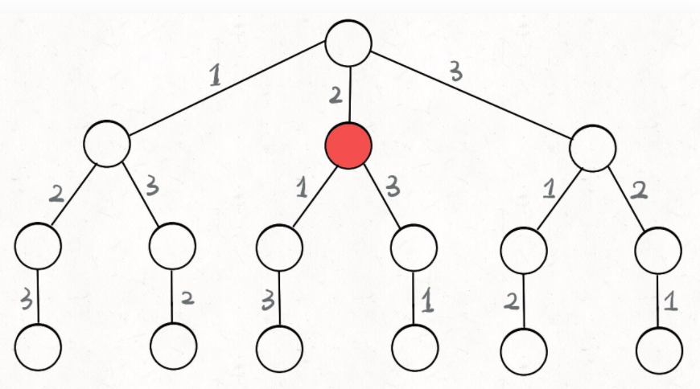
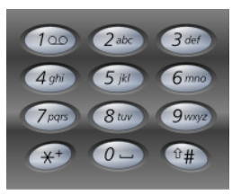

### 写在前面

> ```js
> n皇后里（28行判断语句）
> 	const stringBoard = board.slice();
>     for (let i = 0; i < board.length; i++) {
>         //将每一行拼成字符串 join(""):将所有数组成员连接为一个字符串返回
>         stringBoard[i] = stringBoard[i].join("");
> 	}
> 	res.push(stringBoard);
> 将：
> stringBoard ：
> [
>   [ '.', 'Q', '.', '.' ],
>   [ '.', '.', '.', 'Q' ],
>   [ 'Q', '.', '.', '.' ],
>   [ '.', '.', 'Q', '.' ]
> ]
> 转为res：
> [[ '.Q..', '...Q', 'Q...', '..Q.' ]]
> 要注意
> ```
>
> ```js
> 全排列中的res.push:拷贝一份path到res中
> res.push(path.slice())
> ```
>
> 

### 模板

> 废话不多说，直接上回溯算法框架。**解决一个回溯问题，实际上就是一个决策树的遍历过程**。你只需要思考 3 个问题：
>
> 1、路径：也就是已经做出的选择。
>
> 2、选择列表：也就是你当前可以做的选择。
>
> 3、结束条件：也就是到达决策树底层，无法再做选择的条件
>
> ```python
> result = []
> def backtrack(路径, 选择列表):
>     if 满足结束条件:
>         result.add(路径)
>         return
>     
>     for 选择 in 选择列表:
>         做选择
>         backtrack(路径, 选择列表)
>         撤销选择
> ```
>
> ```python
> for 选择 in 选择列表:
>     # 做选择
>     将该选择从选择列表移除
>     路径.add(选择)
>     backtrack(路径, 选择列表)
>     # 撤销选择
>     路径.remove(选择)
>     将该选择再加入选择列表
> ```
>
> 
>
> **其核心就是 for 循环里面的递归，在递归调用之前「做选择」，在递归调用之后「撤销选择」**，特别简单。

### [46. 全排列](https://leetcode-cn.com/problems/permutations/)

> [labuladong 题解](https://labuladong.gitee.io/plugin-v3/?qno=46&target=gitee&_=1646458843042)[思路](https://leetcode-cn.com/problems/permutations/#)
>
> 给定一个不含重复数字的数组 `nums` ，返回其 *所有可能的全排列* 。你可以 **按任意顺序** 返回答案。
>
>  
>
> **示例 1：**
>
> ```
> 输入：nums = [1,2,3]
> 输出：[[1,2,3],[1,3,2],[2,1,3],[2,3,1],[3,1,2],[3,2,1]]
> ```

> 思路：在递归之前做选择，在递归之后撤销刚才的选择
>
> 
>
> 上图举例，在本题中：`[2]` 就是「路径」，记录你已经做过的选择；`[1,3]` 就是「选择列表」，表示你当前可以做出的选择；「结束条件」就是遍历到树的底层，在这里就是选择列表为空的时候。

```js
//主函数，输入一组不重复的数字，返回它们的全排列
var permute = function(nums) {
    let res = [];
    //记录路径
    let path = [];
    //路径中元素会被标记为true，避免重复使用
    let used = new Array(nums.length).fill(false);
    const backtrack = (path) => {
        //触发结束条件
        if (path.length === nums.length) {
            //从路径中拷贝一份push到res中
            res.push(path.slice());
            return;  
        }
        for (let i = 0; i < nums.length; i++) {
            //排除不合法的选择
            if (used[i]) {
                //nums[i]已经在track中，跳过
                continue;
            }
            //做选择
            path.push(nums[i]);
            used[i] = true;
            //进入下一层决策树
            backtrack(path);
            //取消选择
            path.pop();
            used[i] = false;
        }
    };
    backtrack(path)
    return res;
};
```

### [51. N 皇后](https://leetcode-cn.com/problems/n-queens/)

> [labuladong 题解](https://labuladong.gitee.io/plugin-v3/?qno=51&target=gitee&_=1646461572945)[思路](https://leetcode-cn.com/problems/n-queens/#)
>
> **n 皇后问题** 研究的是如何将 `n` 个皇后放置在 `n×n` 的棋盘上，并且使皇后彼此之间不能相互攻击。
>
> 给你一个整数 `n` ，返回所有不同的 **n 皇后问题** 的解决方案。
>
> 每一种解法包含一个不同的 **n 皇后问题** 的棋子放置方案，该方案中 `'Q'` 和 `'.'` 分别代表了皇后和空位。
>
>  
>
> **示例 1：**
>
> 
>
> ```
> 输入：n = 4
> 输出：[[".Q..","...Q","Q...","..Q."],["..Q.","Q...","...Q",".Q.."]]
> 解释：如上图所示，4 皇后问题存在两个不同的解法。
> ```
>
> PS:皇后可以攻击同一行、同一列、左上左下右上右下四个方向的任意单位。横、竖、斜都可走一或七步

> 每一层表示棋盘上的每一行；每个节点可以做出的选择是，在该行的任意一列放置一个皇后。
>
> 路径：board 中小于 row 的那些行都已经成功放置了皇后
>
> 选择列表：第 row 行的所有列都是放置皇后的选择
>
> 结束条件：row 超过 board 的最后一行

> ```js
> //检查是否可以在board[row][col]中放置皇后
> //因为皇后是一行一行从上往下放的，所以左下方，右下方和正下方不用检查（还没放皇后）；因为一行只会放一个皇后，所以每行不用检查。也就是最后只用检查上面，左上，右上三个方向。
> const isValid = (board, row, col) => {
> let n = board.length;
> // 判断目标元素target的上方有没有Q
> for (let i = 0; i < n; i++) {
>   if (board[i][col] == "Q")
>       return false;
> }
> // 判断target的左上角有无Q
> for (let i = row - 1, j = col + 1; i >= 0 && j < n; i--, j++) {
>   if (board[i][j] == "Q")
>       return false;
> }
> // 判断target的右上角有无Q
> for (let i = row - 1, j = col - 1; i >= 0 && j >= 0; i--, j--) {
>   if (board[i][j] == "Q")
>       return false;
> }
> return true;
> }
> 
> var solveNQueens = function(n) {
> let res = [];
> //“.”表示空，“Q”表示皇后，初始化空棋盘
> let board = new Array(n).fill(0).map(() => new Array(n).fill("."));
> let backtrack = (board, row) => {
>   //触发结束条件
>   if (row == board.length) {
>       //拷贝一份board
>       const stringBoard = board.slice();
>       for (let i = 0; i < board.length; i++) {
>           //将每一行拼成字符串 join(""):将所有数组成员连接为一个字符串返回
>           stringBoard[i] = stringBoard[i].join("");
>       }
>       res.push(stringBoard);
>       return;
>       
>   }
>   // 获取列的长度，遍历此行的每一列
>   let colSize = board[row].length;
>   //选择列表，看一下第row行的每一列能不能放置皇后
>   for (let col = 0; col < colSize; col++) {
>       //排除不合法选择
>       if (!isValid(board, row, col)) {
>           continue;
>       }
>       //做选择
>       board[row][col] = "Q";
>       //进入下一行决策
>       backtrack(board, row + 1);
>       //撤销选择
>       board[row][col] = ".";
>   }
> }
> backtrack(board, 0);
> return res;
> };
> ```

### 52. N皇后 II

> 同上，只不过求解决方案数量
>
> 所以定义一个count，把结束条件里的关于res.push()操作，替换成count++，最后return count；

### [37. 解数独](https://leetcode-cn.com/problems/sudoku-solver/)

> 对于这种时间复杂度的计算，我们只能给出一个最坏情况，也就是 O(9^M)，其中 `M` 是棋盘中空着的格子数量。你想嘛，对每个空格子穷举 9 个数，结果就是指数级的。
>
> 为了减少复杂度，我们可以让 `backtrack` 函数返回值为 `boolean`，如果找到一个可行解就返回 true，这样就可以阻止后续的递归。只找一个可行解，也是题目的本意。 

> ```js
> var solveSudoku = function(board) {
>     backtrack(board, 0, 0);
> 
>     function backtrack(board, row, col) {
>         let m = 9, n = 9;
>         if (col == n) {
>             // 穷举到了最后一列，开始下一行
>             return backtrack(board, row + 1, 0);
>         }
>         if (row == m) {
>             // 找到了一个可行解，触发 base case
>             return true;
>         }
>         if (board[row][col] != '.') {
>             // 有预设数字，不需要穷举，开始下一个位置
>             return backtrack(board, row, col + 1);
>         }
>         for (let ele = 1; ele <= 9; ele++) {
>             // 遇到不合法的数字，跳过
>             if (!isValid(board, row, col, ele)) {
>                 continue;
>             }
>             board[row][col] = ele + '';
>             // 如果找到一个可行解，立即结束
>             if (backtrack(board, row, col + 1)) {
>                 return true;
>             }
>             board[row][col] = '.';
>         }
>         return false;
>     }
> };
> 
> // 判断board[row, col]是否可以填入 ele
> function isValid(board, row, col, ele) {
>     for (let i = 0; i < 9; i++) {
>         // 判断行是否重复
>         if (+board[row][i] == ele) return false;
>         // 判断列是否重复
>         if (+board[i][col] == ele) return false;
>     }
>     // 判断 3 * 3 方框是否存在重复
>     // 以下两个变量的作用是使其从3*3格子的左上角开始遍历
>     let startRow = Math.floor(row / 3) * 3;
>     let startCol = Math.floor(col / 3) * 3;
>     for (let i = startRow; i < startRow + 3; i++) {
>         for (let j = startCol; j < startCol + 3; j++) {
>             if (+board[i][j] == ele) return false;
>         }
>     }
>     return true;
> }
> ```
>
> 

### 子集/组合/排列

> labuladong:https://labuladong.gitee.io/algo/1/10/
>
> 无论是排列、组合还是子集问题，简单说无非就是让你从序列 nums 中以给定规则取若干元素，主要有以下几种变体：
>
> **Ⅰ、`元素无重不可复选`，即 nums中的元素都是唯一的，每个元素最多只能被使用一次，这也是最基本的形式**。
>
> 以组合为例，如果输入 nums = [2,3,6,7]，和为 7 的组合应该只有 [7]。
>
> **Ⅱ、`元素可重不可复选`，即 nums 中的元素可以存在重复，每个元素最多只能被使用一次**。
>
> 以组合为例，如果输入 nums = [2,5,2,1,2]，和为 7 的组合应该有两种 [2,2,2,1] 和 [5,2]。
>
> **Ⅲ、`元素无重可复选`，即 nums 中的元素都是唯一的，每个元素可以被使用若干次**。
>
> 以组合为例，如果输入 nums = [2,3,6,7]，和为 7 的组合应该有两种 [2,2,3] 和 [7]。
>
> **Ⅳ、`元素可重可复选`**
>
> 当然，也可以说有第四种形式，即`元素可重可复选`。但既然元素可复选，那又何必存在重复元素呢？元素去重之后就等同于形式三，所以这种情况不用考虑。
>
> **组合是不强调元素顺序的，排列是强调元素顺序**。
>
> 上面用组合问题举的例子，但排列、组合、子集问题都可以有这三种基本形式，所以共有 9 种变化。

### 

### ---Ⅰ 子集/组合/排列-元素无重不可复选

### [78. 子集](https://leetcode-cn.com/problems/subsets/)-元素无重不可复选

> 给你一个整数数组 `nums` ，数组中的元素 **互不相同** 。返回该数组所有可能的子集（幂集）。
>
> 解集 **不能** 包含重复的子集。你可以按 **任意顺序** 返回解集。
>
>  
>
> **示例 1：**
>
> ``` js
> 输入：nums = [1,2,3]
> 输出：[[],[1],[2],[1,2],[3],[1,3],[2,3],[1,2,3]]>>
> ```

> ```js
> var subsets = function(nums) {
>     // 记录递归路径
>     let path = [];
>     // 记录结果
>     let res = [];
>     backtrack(nums, 0);
>     return res;
> 
>     function backtrack(nums, start) {
>         // 前序位置，每个节点都是一个子集
>         res.push(path.concat());
>         
>         // 回溯核心框架
>         for (let i = start; i <nums.length; i++) {
>             // 做选择
>             path.push(nums[i]);
>             // 通过start参数控制树枝的遍历，避免产生重复子集
>             // 基于选的start递归，传入的是 i + 1
>             backtrack(nums, i + 1);
>             // 撤销选择
>             path.pop();
>         }
>     }
> };
> ```
>
> 注意：
>
> 使用 `start` 参数控制树枝的生长避免产生重复的子集，
>
> 用 `track` 记录根节点到每个节点的路径的值，同时在前序位置把每个节点的路径值收集起来，完成回溯树的遍历就收集了所有子集
>
> `backtrack` 函数开头看似没有 base case，会不会进入无限递归？
>
> 不会的，当 `start == nums.length` 时，叶子节点的值会被装入 `res`，但 for 循环不会执行，也就结束了递归。

### [77. 组合](https://leetcode-cn.com/problems/combinations/)-元素无重不可复选

> 给定两个整数 `n` 和 `k`，返回范围 `[1, n]` 中所有可能的 `k` 个数的组合。
>
> 你可以按 **任何顺序** 返回答案。
>
> **示例 1：**
>
> ```js
> 输入：n = 4, k = 2
> 输出：
> [
>   [2,4],
>   [3,4],
>   [2,3],
>   [1,2],
>   [1,3],
>   [1,4],
> ]
> ```

> 解析：本题是上一题的稍微变型。
>
> 上题求的是所有无重子集，本题求元素个数为k的无重子集。
>
> 大小为 k 的所有组合，不就是所有大小为 k 的子集嘛。
>
> **现在你只需要把第 k 层（根节点视为第 0 层）的节点收集起来，就是大小为 k 的所有组合**：
>
> 反映到代码上，只需要稍改 base case，控制算法仅仅收集第 `k` 层节点的值即可：
>
> ```js
> var combine = function(n, k) {
>     let res = [];
>     let path = [];
>     backtrack(1);
>     return res;
>     function backtrack(start) {
>         if (k == path.length) {
>             res.push([...path]);
>             return;
>         }
>         for (let i = start; i <= n; i++) {
>             path.push(i);
>             backtrack(i + 1);
>             path.pop();
>         }
>     }
> };
> ```

### [46. 排列](https://leetcode-cn.com/problems/permutations/)-元素无重不可复选

> 给定一个不含重复数字的数组 `nums` ，返回其 *所有可能的全排列* 。你可以 **按任意顺序** 返回答案。
>
>  
>
> **示例 1：**
>
> ```
> 输入：nums = [1,2,3]
> 输出：[[1,2,3],[1,3,2],[2,1,3],[2,3,1],[3,1,2],[3,2,1]]
> ```
>
> **排列问题本身就是让你穷举元素的位置，`nums[i]` 之后也可以出现 `nums[i]` 左边的元素，所以之前的那一套玩不转了，需要额外使用 `used` 数组来标记哪些元素还可以被选择**。

> ```js
> //主函数，输入一组不重复的数字，返回它们的全排列
> var permute = function(nums) {
>     let res = [];
>     //记录路径
>     let path = [];
>     //路径中元素会被标记为true，避免重复使用
>     let used = new Array(nums.length).fill(false);
>     backtrack()
>     return res;
> 
>     function backtrack () {
>         //触发结束条件
>         if (path.length === nums.length) {
>             //从路径中拷贝一份push到res中
>             res.push(path.slice());
>             return;  
>         }
>         for (let i = 0; i < nums.length; i++) {
>             //排除不合法的选择
>             if (used[i]) {
>                 //nums[i]已经在track中，跳过
>                 continue;
>             }
>             //做选择
>             path.push(nums[i]);
>             used[i] = true;
>             //进入下一层决策树
>             backtrack();
>             //取消选择
>             path.pop();
>             used[i] = false;
>         }
>     };  
> };
> ```

### 

### ---Ⅱ 子集/组合/排列-元素可重不可复选

### [90. 子集 II](https://leetcode-cn.com/problems/subsets-ii/)-元素可重不可复选

> 给你一个整数数组 `nums` ，其中可能包含重复元素，请你返回该数组所有可能的子集（幂集）。
>
> 解集 **不能** 包含重复的子集。返回的解集中，子集可以按 **任意顺序** 排列。
>
>  
>
> **示例 1：**
>
> ```
> 输入：nums = [1,2,2]
> 输出：[[],[1],[1,2],[1,2,2],[2],[2,2]]
> ```
>
> 思路：
>
> 因为两条值相同的相邻树枝会产生重，
>
> 所以我们需要进行剪枝，如果一个节点有多条值相同的树枝相邻，则只遍历第一条，剩下的都剪掉，不要去遍历
>
> **体现在代码上，需要先进行排序，让相同的元素靠在一起，如果发现 `nums[i] == nums[i-1]`，则跳过**：
>
> ```js
> var subsetsWithDup = function(nums) {
>     // 排序，让所有元素相同的值都排在一起，等一下方便剪枝
>     nums.sort((a, b) => a - b);
>     let res = [];
>     let path = [];
>     backtrack(nums, 0);
>     return res;
> 
>     function backtrack(nums, start) {
>         // 前序位置，每个节点的值都是一个子集
>         // 节点的值:每个节点和根节点之间树枝上的元素
>         res.push(path.concat());
>         
>         for (let i = start; i < nums.length; i++) {
>             // 对于相同的值，只遍历一次，注意，从第 start + 1个元素开始遍历,第一个元素不管
>             if (i > start && nums[i] == nums[i - 1]) {
>                 continue;
>             }
>             path.push(nums[i]);
>             backtrack(nums, i + 1);
>             path.pop();
>         }
> 
>     }
> };
> ```

### [40. 组合总和 II](https://leetcode-cn.com/problems/combination-sum-ii/)-元素可重不可复选

> 给定一个候选人编号的集合 `candidates` 和一个目标数 `target` ，找出 `candidates` 中所有可以使数字和为 `target` 的组合。
>
> `candidates` 中的每个数字在每个组合中只能使用 **一次** 。
>
> **注意：**解集不能包含重复的组合。 
>
> 
>
> **示例 1:**
>
> ```
> 输入: candidates = [10,1,2,7,6,1,5], target = 8,
> 输出:
> [
> [1,1,6],
> [1,2,5],
> [1,7],
> [2,6]
> ]
> ```
>
> ```js
> var combinationSum2 = function(candidates, target) {
>     let res = [];
>     let path = [];
>     // 这里需要记录路径里元素总和
>     let pathSum = 0;
>     // 排序，让相同的元素靠在一起
>     candidates.sort((a, b) => a - b);
>     backtrack(0);
>     return res;
> 
>     function backtrack(start) {
>         // base case 达到目标和，找到符合条件的组合
>         if (pathSum == target) {
>             res.push(path.concat());
>             return;
>         }
>         // base case，超过目标和，直接结束。这里避免无谓的递归
>         if (pathSum > target) {
>             return;
>         }
> 
>         for (let i = start; i < candidates.length; i++) {
>             // 剪枝逻辑，值相同的树枝，只遍历第一条
>             if (i > start && candidates[i] == candidates[i - 1]) {
>                 continue;
>             }
>             // 做选择
>             path.push(candidates[i]);
>             pathSum += candidates[i];
>             // 递归遍历下一层回溯树
>             backtrack(i + 1);
>             // 撤销选择
>             pathSum -= candidates[i];
>             path.pop();
>         }
>     }
> };
> ```

### [47. 排列 II](https://leetcode-cn.com/problems/permutations-ii/)-元素可重不可复选

> 给定一个可包含重复数字的序列 `nums` ，***按任意顺序*** 返回所有不重复的全排列。
>
> **示例 1：**
>
> ```
> 输入：nums = [1,1,2]
> 输出：
> [[1,1,2],
> [1,2,1],
> [2,1,1]]
> ```
>
> ```js
> var permuteUnique = function(nums) {
>  let res = [];
>  let path = [];
>  // 排序，相同元素靠在一起
>  nums.sort((a, b) => a - b);
>  // 给访问过的元素标记，避免复选
>  let used = new Array(nums.length).fill(false);
>  backtrack(path);
>  return res;
> 
>  function backtrack(path) {
>      if (path.length == nums.length) {
>          res.push(path.concat());
>          return;
>      }
>      for (let i = 0; i <nums.length; i++) {
>          if (used[i]) {
>              continue;
>          }
>          // 剪枝逻辑，相同元素只遍历第一个
>          // i>0表示从第二个开始，!uesd[i - 1]:固定相同的元素在res中的相对位置
>          if (i > 0 && nums[i] == nums[i - 1] && !used[i - 1]) {
>              continue;
>          }
>          // 做选择
>          path.push(nums[i]);
>          used[i] = true;
>          // 递归遍历
>          backtrack(path);
>          // 撤销选择
>          path.pop();
>          used[i] = false;
>      }
>  }
> };
> ```
>
> 解析：
>
> 对比一下之前的46标准全排列解法代码，这段解法代码只有两处不同：
>
> 1、对 `nums` 进行了排序。
>
> 2、添加了一句额外的剪枝逻辑。
>
> 3、backtrack()函数if那里没有return语句
>
> 解这么做都是为了防止出现重复结果。
>
> 但是注意排列问题的剪枝逻辑，和子集/组合问题的剪枝逻辑略有不同：新增了 `!used[i - 1]` 的逻辑判断。
>
> `!used[i - 1]`的作用：**保证相同元素在排列中的相对位置保持不变**
>
> 举例说明这个逻辑判断为什么这样写：
>
> 比如说  `nums = [1,2,2',2'']`，我只要保证重复元素 `2` 的`相对位置固定`，比如说 `2 -> 2' -> 2''`，也可以得到`无重复`的全排列结果。
>
> 所以如何保证相同元素的相对位置固定？ --- 就是利用used[i - 1]
>
> ```js
> // 新添加的剪枝逻辑，固定相同的元素在排列中的相对位置
> if (i > 0 && nums[i] == nums[i - 1] && !used[i - 1]) {
>  // 如果前面的相邻相等元素没有用过，则跳过
>  continue;
> }
> // 选择 nums[i]
> ```
>
> **当出现重复元素时，比如输入 `nums = [1,2,2',2'']`，`2'` 只有在 `2` 已经被使用的情况下才会被选择，同理，`2''` 只有在 `2'` 已经被使用的情况下才会被选择，这就保证了相同元素在排列中的相对位置保证固定**。
>
> #### 这就保证了相同元素在排列中的相对位置保证固定。

### 

### ---Ⅲ 子集/组合/排列-元素无重可复选

### [39. 组合(/子集)总和](https://leetcode-cn.com/problems/combination-sum/)-元素无重可复选

> 给你一个 **无重复元素** 的整数数组 `candidates` 和一个目标整数 `target` ，找出 `candidates` 中可以使数字和为目标数 `target` 的 *所有* **不同组合** ，并以列表形式返回。你可以按 **任意顺序** 返回这些组合。
>
> `candidates` 中的 **同一个** 数字可以 **无限制重复被选取** 。如果至少一个数字的被选数量不同，则两种组合是不同的。 
>
> 对于给定的输入，保证和为 `target` 的不同组合数少于 `150` 个。
>
>  
>
> **示例 1：**
>
> ```
> 输入：candidates = [2,3,6,7], target = 7
> 输出：[[2,2,3],[7]]
> 解释：
> 2 和 3 可以形成一组候选，2 + 2 + 3 = 7 。注意 2 可以使用多次。
> 7 也是一个候选， 7 = 7 。
> 仅有这两种组合。
> ```
>
> ```js
> var combinationSum = function(candidates, target) {
>     let res = [];
>     let path = [];
>     let pathSum = 0;
>     backtrack(0);
>     return res;
> 
>     function backtrack(start) {
>         // base case，找到目标和，记录结果
>         if (pathSum == target) {
>             res.push(path.concat());
>             return;
>         }
>         // base case，超过目标和，停止向下遍历
>         if (pathSum > target) {
>             return;
>         }
>         for (let i = start; i <candidates.length; i++) {
>             // 选择 nums[i]
>             path.push(candidates[i]);
>             pathSum += candidates[i];
>             // 递归遍历下一层回溯树
>             // 同一元素可重复使用，注意参数
>             backtrack(i);
>             // 撤销选择 nums[i]
>             path.pop();
>             pathSum -= candidates[i];
>         }
>     }
> };
> ```
>
> 这道题说是组合问题，实际上也是子集问题：`candidates` 的哪些子集的和为 `target`？
>
> **先思考思考，标准的子集/组合问题是如何保证不重复使用元素的**？
>
> 答案在于 `backtrack` 递归时输入的参数 `start`
>
> ```js
> // 无重组合的回溯算法框架
> void backtrack(int[] nums, int start) {
>     for (int i = start; i < nums.length; i++) {
>         // ...
>         // 递归遍历下一层回溯树，注意参数
>         backtrack(nums, i + 1);
>         // ...
>     }
> }
> ```
>
> 这个 `i` 从 `start` 开始，那么下一层回溯树就是从 `start + 1` 开始，从而保证 `nums[start]` 这个元素`不会被重复使用`：
>
> 那么反过来，如果我想让每个元素被重复使用，我只要把 `i + 1` 改成 `i` 即可：
>
> 这相当于给之前的回溯树添加了一条树枝，在遍历这棵树的过程中，一个元素可以被无限次使用：
>
> 当然，这样这棵回溯树会永远生长下去，所以我们的递归函数需要设置合适的 base case 以结束算法，即路径和大于 `target` 时就没必要再遍历下去了。

### 排列-元素无重可复选

> 力扣上没有类似的题目，我们不妨先想一下，`nums` 数组中的元素无重复且可复选的情况下，会有哪些排列？
>
> 比如输入 `nums = [1,2,3]`，那么这种条件下的全排列共有 3^3 = 27 种：
>
> ```js
> [
>   [1,1,1],[1,1,2],[1,1,3],[1,2,1],[1,2,2],[1,2,3],[1,3,1],[1,3,2],[1,3,3],
>   [2,1,1],[2,1,2],[2,1,3],[2,2,1],[2,2,2],[2,2,3],[2,3,1],[2,3,2],[2,3,3],
>   [3,1,1],[3,1,2],[3,1,3],[3,2,1],[3,2,2],[3,2,3],[3,3,1],[3,3,2],[3,3,3]
> ]
> ```
>
> **标准的全排列算法利用 `used` 数组进行剪枝，避免重复使用同一个元素。如果允许重复使用元素的话，直接放飞自我，去除所有 `used` 数组的剪枝逻辑就行了**。
>
> 那这个问题就简单了，代码如下：
>
> ```js
> //主函数，输入一组不重复的数字，返回它们的全排列
> var permute = function(nums) {
>     let res = [];
>     //记录路径
>     let path = [];
>     backtrack()
>     return res;
> 
>     function backtrack () {
>         //触发结束条件
>         if (path.length === nums.length) {
>             //从路径中拷贝一份push到res中
>             res.push(path.slice());
>             return;  
>         }
>         for (let i = 0; i < nums.length; i++) {	
>             //做选择
>             path.push(nums[i]);
>             //进入下一层决策树
>             backtrack();
>             //取消选择
>             path.pop();
>         }
>     };
> };
> ```

### 

### ---Ⅳ 元素可重可复选-把可重元素去重即可变成Ⅲ

### [17. 电话号码的字母组合](https://leetcode-cn.com/problems/letter-combinations-of-a-phone-number/)

> 给定一个仅包含数字 2-9 的字符串，返回所有它能表示的字母组合。答案可以按 任意顺序 返回。
>
> 给出数字到字母的映射如下（与电话按键相同）。注意 1 不对应任何字母。
>
> 
>
> 示例 1：
>
> 输入：digits = "23"
> 输出：["ad","ae","af","bd","be","bf","cd","ce","cf"]
>
> `注意`：要注意字符串和数组的相互转化
>
> labuladong模板
>
> ```js
> var letterCombinations = function(digits) {
>     let map  = ['', '', 'abc', 'def', 'ghi', 'jkl', 'mno', 'pqrs', 'tuv', 'wxyz'];
>     let res = [];
>     let path = [];
>     if (digits == null || !digits.length) return res;
>     backtrack(0, path);
>     return res;
> 
>     function backtrack(start, path) {
>         // 退出循环，因为到达回溯树底部
>         if (path.length == digits.length) {
>             res.push(path.join(''));
>             return;
>         }
>         // 回溯框架
>         for (let i = start; i < digits.length; i++) {
>             let arr = map[digits[start]].split('');
>             for (let ele of arr) {
>                 // 做选择
>                 path.push(ele);
>                 // 下一轮回溯
>                 backtrack(i + 1, path);
>                 // 撤销选择
>                 path.pop();
>             }
>         }
>     }
> };
> ```
>
> 改进：上述多了一层for循环，这层for可以去掉的
>
> ```js
> var letterCombinations = function(digits) {
>     let map  = ['', '', 'abc', 'def', 'ghi', 'jkl', 'mno', 'pqrs', 'tuv', 'wxyz'];
>     let res = [];
>     let path = [];
>     let len = digits.length;
>     if (!digits.length) return res;
>     backtrack(0, path);
>     return res;
> 
>     function backtrack(start, path) {
>         // 退出循环，因为到达回溯树底部
>         if (path.length == len) {
>             res.push(path.join(''));
>             return;
>         }
>         let arr = map[digits[start]].split('');
>         for (let i = 0; i < arr.length; i++) {
>             // 做选择
>             path.push(arr[i]);
>             // 下一轮回溯
>             backtrack(start + 1, path);
>             // 撤销选择
>             path.pop();
>         }
>         
>     }
> };
> ```

### [131. 分割回文串](https://leetcode-cn.com/problems/palindrome-partitioning/)

> 给你一个字符串 `s`，请你将 `s` 分割成一些子串，使每个子串都是 **回文串** 。返回 `s` 所有可能的分割方案。
>
> **回文串** 是正着读和反着读都一样的字符串。
>
>  
>
> **示例 1：**
>
> ```
> 输入：s = "aab"
> 输出：[["a","a","b"],["aa","b"]]
> ```
>
> ```js
> var partition = function(s) {
>     let path = [];
>     let res = [];
>     backtrack(0);
>     return res;
>     
>     function backtrack(start) {
>         if (start == s.length) {
>             res.push(path.concat());
>             return
>         }
>         for (let i = start; i < s.length; i++) {
>             if (isValid(s, start, i)) {
>                 path.push(s.slice(start, i + 1));
>                 backtrack(i + 1);
>                 path.pop();
>             }
>         }
>     }
> };
> 
> function isValid(s, start, end) {
>     for (let i = start, j = end; i < j; i++, j--) {
>         if (s[i] != s[j]) {
>             return false;
>         }
>     }
>     return true;
> }
> ```

### [93. 复原 IP 地址](https://leetcode-cn.com/problems/restore-ip-addresses/)

> #### [93. 复原 IP 地址](https://leetcode-cn.com/problems/restore-ip-addresses/)
>
> **有效 IP 地址** 正好由四个整数（每个整数位于 `0` 到 `255` 之间组成，且不能含有前导 `0`），整数之间用 `'.'` 分隔。
>
> - 例如：`"0.1.2.201"` 和` "192.168.1.1"` 是 **有效** IP 地址，但是 `"0.011.255.245"`、`"192.168.1.312"` 和 `"192.168@1.1"` 是 **无效** IP 地址。
>
> 给定一个只包含数字的字符串 `s` ，用以表示一个 IP 地址，返回所有可能的**有效 IP 地址**，这些地址可以通过在 `s` 中插入 `'.'` 来形成。你 **不能** 重新排序或删除 `s` 中的任何数字。你可以按 **任何** 顺序返回答案。
>
> **示例 1：**
>
> ```
> 输入：s = "25525511135"
> 输出：["255.255.11.135","255.255.111.35"]
> ```
>
> ps:不满足条件时用的`break`，效率更高
>
> ```js
> var restoreIpAddresses = function(s) {
>     let res = [];
>     let path = [];
>     backtrack(0);
>     return res;
> 
>     function backtrack(start) {
>         if (start == s.length && path.length == 4) {
>             res.push(path.join('.'));
>             return;
>         }
>         for (let i = start; i < s.length; i++) {
>             let str = s.slice(start, i + 1);
>             if (str.length > 3 || Number(str) > 255)  break;
>             if (str.length > 1 && str[0] == '0') break;
>             path.push(str);
>             backtrack(i + 1);
>             path.pop();
>         }
>     }
> };
> ```

### [491. 递增子序列](https://leetcode-cn.com/problems/increasing-subsequences/)

> 给你一个整数数组 `nums` ，找出并返回所有该数组中不同的递增子序列，递增子序列中 **至少有两个元素** 。你可以按 **任意顺序** 返回答案。
>
> 数组中可能含有重复元素，如出现两个整数相等，也可以视作递增序列的一种特殊情况。
>
>  
>
> **示例 1：**
>
> ```
> 输入：nums = [4,6,7,7]
> 输出：[[4,6],[4,6,7],[4,6,7,7],[4,7],[4,7,7],[6,7],[6,7,7],[7,7]]
> ```
>
> #### `注意`：本题不能用排序的方式 去重
>
> #### `本题判断递增的方式：在push之前判断尾部两个元素是否递增`
>
> 本题求自增子序列，是不能对原数组经行排序的，排完序的数组都是自增子序列了
>
> #### `所以可以使用object或者Set对每一层（即for循环）去重`
>
> {}去重的话，直接：
>
> ```js
> let map = {};
> if (map[nums[i]] == 1) continue;
> map[nums[i]] =  1;
> ```
>
> 
>
> ```js
> 
> 
> var findSubsequences = function(nums) {
>     if (nums.length == 1) return [];
>     let res = [];
>     let path = [];
>     backtrack(0);
>     return res;
> 
>     function backtrack(start) {
>         if (path.length >= 2 && start <= nums.length) {
>             // 比较path尾部的两个元素，验证是否为递增序列
>             if (path[path.length - 1] < path[path.length - 2]) return;
>             res.push(path.concat());
>         }
>         // 去重:同一层级，用过则忽略
>         let set = new Set();  // let map = {};
>         for (let i = start; i < nums.length; i++) {
>             if (set.has(nums[i])) {
>                 continue;
>             }
>             path.push(nums[i]);
>             set.add(nums[i]);
>             backtrack(i + 1);
>             path.pop();         
>         }
>     }
> };
> ```
>
> ​	

