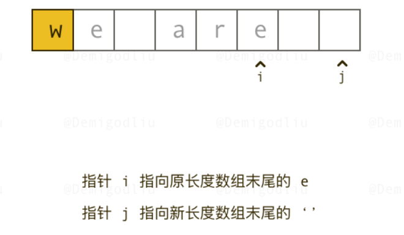

#### [344. 反转字符串](https://leetcode-cn.com/problems/reverse-string/)

> 编写一个函数，其作用是将输入的字符串反转过来。输入字符串以字符数组 `s` 的形式给出。
>
> 不要给另外的数组分配额外的空间，你必须**[原地](https://baike.baidu.com/item/原地算法)修改输入数组**、使用 O(1) 的额外空间解决这一问题。
>
> 思路：双指针，一前一后，交换数值
>
> ```js
> var reverseString = function(s) {
>     let left = 0, right = s.length - 1;
>     while (left < right) {
>         [s[left], s[right]] = [s[right], s[left]];
>         left++;
>         right--;
>     }
> };
> ```

#### [541. 反转字符串 II](https://leetcode-cn.com/problems/reverse-string-ii/)

> 给定一个字符串 `s` 和一个整数 `k`，从字符串开头算起，每计数至 `2k` 个字符，就反转这 `2k` 字符中的前 `k` 个字符。
>
> - 如果剩余字符少于 `k` 个，则将剩余字符全部反转。
> - 如果剩余字符小于 `2k` 但大于或等于 `k` 个，则反转前 `k` 个字符，其余字符保持原样。
>
> **示例 1：**
>
> ```
> 输入：s = "abcdefg", k = 2
> 输出："bacdfeg"
> ```
>
> 本题需要模拟，实现题目中规定的反转规则。
>
> 在遍历字符串的过程中，只要让 i += (2 * k)，i 每次移动 2 * k 就可以了，然后判断是否需要有反转的区间。
>
> 因为要找的也就是每2 * k 区间的起点，这样写，程序会高效很多。
>
> **所以当需要固定规律一段一段去处理字符串的时候，要想想在在for循环的表达式上做做文章。**
>
> 每轮反转，left的值和right的值要确定好：
>
> * left，直接就是i-1（-1，方便while里 ++ -- 的处理）
> * right，需要判断情况，如果left之后长度不够k了，就直接len，否则，加上k
> * `细节`：字符串转为数组(split(''))，在数组上面处理，在转为字符串输出（join(''))
>
> ```js
> var reverseStr = function(s, k) {
>     let res = s.split("");
>     const len = res.length;
>     for (let i = 0; i < len; i += 2 * k) {
>         let left = i - 1;
>         // 如果本轮循环里，从left起，长度不够k，则right为len（剩余长度），否则还为k
>         let right = i + k > len ? len : i + k;
>         while (++left < --right) {
>             [res[left], res[right]] = [res[right], res[left]];
>         }
>     }
>     return res.join("");
> };
> ```

#### [剑指 Offer 05. 替换空格](https://leetcode-cn.com/problems/ti-huan-kong-ge-lcof/)

> 请实现一个函数，把字符串 `s` 中的每个空格替换成"%20"。
>
> 1，取巧做法：
>
> ```js
> var replaceSpace = function(s) {
>     let res = s.split('');
>     let len = s.length;
>     for (let i = 0; i < len; i++) {
>         if(res[i] == ' ') {
>             res[i] = '%20';
>         }
>     }
>     return res.join('');
> };
> ------------------------
> var replaceSpace = function(s) {
>     return s.split(' ').join('%20');
> };
> ```
>
> 2，思路:
>
> * 将字符串转换为数组，然后统计其中的空格数量。
> * 根据空格数量和原有字符串有效字符长度，计算出刚好存放替换后的字符长度的数组。
> * 创建两个指针，j指新数组末尾，i指向原数组末尾，实现原地修改：
>   * 从后往前遍历，如果i指向的不为' '，将i指向的赋给j；
>   * 否则j-2:%,j-1:2,j-0:0,并且j = j - 2；
>
> 
>
> ```js
> var replaceSpace = function(s) {
>     let res = s.split('');
>     // 找出空格个数
>     let count = 0;
>     for (let a of s) {
>         if (a == ' ') count++;
>     }
>     // 原数组长度
>     oldLen = s.length;
>     // 计算新数组该有的长度
>     newLen = oldLen + count * 2;
>     // 从后往前遍历，降低复杂度
>     for (let j = newLen - 1, i = oldLen - 1; i >= 0; i--, j--) {
>         if (res[i] !== ' ') {
>             res[j] = res[i];
>         } else {
>             res[j - 2] = '%';
>             res[j - 1] = '2';
>             res[j - 0] = '0';
>             j -= 2;
>         }
>     }
>     return res.join('');
> };
> ```

#### [151. 颠倒字符串中的单词](https://leetcode-cn.com/problems/reverse-words-in-a-string/)

> 给你一个字符串 `s` ，颠倒字符串中 **单词** 的顺序。
>
> **单词** 是由非空格字符组成的字符串。`s` 中使用至少一个空格将字符串中的 **单词** 分隔开。
>
> 返回 **单词** 顺序颠倒且 **单词** 之间用单个空格连接的结果字符串。
>
> **注意：**输入字符串 `s`中可能会存在前导空格、尾随空格或者单词间的多个空格。返回的结果字符串中，单词间应当仅用单个空格分隔，且不包含任何额外的空格。
>
>  
>
> **示例 1：**
>
> ```
> 输入：s = "the sky is blue"
> 输出："blue is sky the"
> ```
>
> 方法1，利用API：去掉前后两端空格->正则表达式，空格处分开成数组->反转数组成员->转换成字符串，每个数组用空格分割
>
> ```js
> var reverseWords = function(s) {
>     return s.trim().split(/\s+/).reverse().join(' ');
> };
> ```
>
> 方法2，
>
> 1. 自己写一个`去掉首尾空`格，以及`中间重复空格`的函数（快慢指针），自己写一个`翻转函数`
>
> 2. 主函数里将字符串`转`为数组，对数组进行多余空格`去重`，然后`翻转`整个数组，
>
> 3. for循环遍历数组，看是否`遇见了空格`，或者到达`数组末尾`，部分翻转start-i-1
> 4. join('')，返回字符串
>
> ```js
> var reverseWords = function(s) {
>     let arr = Array.from(s);
>     // 去掉首尾和重复的空格：包括首尾以及中间部分重复的
>     removeExtraSpace(arr);
>     // 反转全部
>     rever(arr, 0, arr.length);
>     let start = 0;
>     // 注意是 <=，因为指针必须要到尾部之后一个，配合空格的反转（i指向空格时），对i-1进行rever调用
>     for (let i = 0; i <= arr.length; i++) {
>         if (arr[i] == ' ' || i == arr.length) {
>             rever(arr, start, i - 1);
>             start = i + 1;
>         }
>     }
>     return arr.join('');
> };
> 
> 
> // 去除多余的空格
> function removeExtraSpace(arr) {
>     let fast = 0, slow = 0;
>     // 去除首部和重复的空格，包括中间和末尾空格的重复
>     while (fast < arr.length) {
>         if (arr[fast] == ' ' && (fast === 0 || arr[fast - 1] == ' ')) {
>             fast++;
>         } else {
>             arr[slow++] = arr[fast++];
>         }
>     }
>     // 去除尾部空格，此时尾部最多一个空格
>     arr.length = arr[slow - 1] == ' ' ? slow - 1 : slow;
> }
> 
> // 反转字符串
> function rever(arr, start, end) {
>     while (start < end) {
>         [arr[start], arr[end]] = [arr[end], arr[start]];
>         start++;
>         end--;
>     }
> }
> ```

#### [剑指 Offer 58 - II. 左旋转字符串](https://leetcode-cn.com/problems/zuo-xuan-zhuan-zi-fu-chuan-lcof/)

> 字符串的左旋转操作是把字符串前面的若干个字符转移到字符串的尾部。请定义一个函数实现字符串左旋转操作的功能。比如，输入字符串"abcdefg"和数字2，该函数将返回左旋转两位得到的结果"cdefgab"。
>
> 
>
> **示例 1：**
>
> ```
> 输入: s = "abcdefg", k = 2
> 输出: "cdefgab"
> ```
>
> 方法一，API
>
> ```js
> // split转成字符，以k为中点，slice切割出左部分和右部分，左部分通过concat拼接到右部分，再join转成字符串
> var reverseLeftWords = function(s, n) {
>  let res = s.split('');
>  return res.slice(n).concat(res.slice(0, n)).join('')
> };
> -------------
> // splice改变原数组，返回被切割的部分，将切割的部分拼接到尾部
> var reverseLeftWords = function(s, n) {
>     let arr = s.split('');
>     let last = arr.splice(0, n);
>     return arr.concat(last).join('')
> };
> ```
>
> 方法二
>
> * 反转k的左部分
> * 反转k的右部分
> * 拼接在一起
>
> ```js
> var reverseLeftWords = function(s, n) {
>     let res = s.split('');
>     rever(res, 0, n - 1);
>     rever(res, n, res.length - 1);
>     rever(res, 0, res.length - 1);
>     return res.join('');
> };
> 
> function rever(arr, start, end) {
>     while (start < end) {
>         [arr[start], arr[end]] = [arr[end], arr[start]];
>         start++;
>         end--;
>     }
> }
> ```

#### KMP-[28. 实现 strStr()](https://leetcode-cn.com/problems/implement-strstr/)

> > 实现 strStr() 函数。
> >
> > 给你两个字符串 haystack 和 needle ，请你在 haystack 字符串中找出 needle 字符串出现的第一个位置（下标从 0 开始）。如果不存在，则返回  -1 。
> >
> > 说明：
> >
> > 当 needle 是空字符串时，我们应当返回什么值呢？这是一个在面试中很好的问题。
> >
> > 对于本题而言，当 needle 是空字符串时我们应当返回 0 。这与 C 语言的 strstr() 以及 Java 的 indexOf() 定义相符。
> >
> > 示例 1：
> >
> > 输入：haystack = "hello", needle = "ll"
> > 输出：2

> 解法1，暴力匹配
>
> 1. i <= m - n:文本串走不到它的尾部，而是要减去一个模式串的长度
> 2. 内层循环里，文本串每次的位置要加上j，因为内层里面i值未走，要匹配模式串的下一个，必须加j
> 3. 用一个标志位flag来标志
>
> ```js
> var strStr = function(haystack, needle) {
>     let m = haystack.length, n = needle.length;
>     for (let i = 0; i <= m - n; i++) {
>         let flag = true;
>         for (let j = 0; j < n; j++) {
>             if (haystack[j + i] != needle[j]) {
>                 flag = false;
>                 break;
>             }
>         }
>         if (flag) {
>             return i;
>         }
>     }
>     return -1;
> };
> ```
>
> 解法2，KMP，详解见：https://programmercarl.com/0028.%E5%AE%9E%E7%8E%B0strStr.html	
>
> ```js
> var strStr = function(haystack, needle) {
>     if (needle.length == 0) return 0;
>     let next = [];
>     getNext(next, needle);
>     let j = -1; // 因为next数组里记录的起始位置为-1
>     for (let i = 0; i < haystack.length; i++) { // i从0开始    ---------------注意！！！要加 .length 
>         while (j >= 0 && haystack[i] !== needle[j + 1]) { // 不匹配时
>             j = next[j]; // j寻找之前匹配的位置
>         }
>         if (haystack[i] == needle[j + 1]) { // 匹配，j和i同时向后移动
>             j++; // i的增加在for循环里
>         }
>         if (j == needle.length - 1) { // 文本串s里出现了模式串t     ----------注意！！！是 == 不是 =
>             return i - needle.length + 1;
>         }
>     }
>     return -1;
> };
> 
> function getNext(next, s) {
>     let j = -1; // 定义两个指针i和j，j指向前缀起始位置，i指向后缀起始位置。
>     next.push(j); // next[0] = j;
>     for (let i = 1; i < s.length; i++) { // i从1开始
>         while (j >= 0 && s[i] !== s[j + 1]) { // 前后缀不相同
>             j = next[j]; // 向前回退
>         }
>         if (s[i] == s[j + 1]) { //  找到相同的前后缀
>             j++;
>         }
>         next.push(j); // next[i] = j; // 将j（前缀的长度）赋给next[i]
>     }
> }
> ```

#### KMP-[459. 重复的子字符串](https://leetcode-cn.com/problems/repeated-substring-pattern/)

> 给定一个非空的字符串 `s` ，检查是否可以通过由它的一个子串重复多次构成。
>
> **示例 1:**
>
> ```
> 输入: s = "abab"
> 输出: true
> 解释: 可由子串 "ab" 重复两次构成。
> ```

> KMP:
>
> next 数组记录的就是`最长相同前后缀`
>
> 如果 next[len - 1] != -1，则说明字符串有最长相同的前后缀（就是字符串里的前缀子串和后缀子串相同的最长长度）。
>
> 最长相等前后缀的长度为：next[len - 1] + 1。(next数组是以统一减一的方式计算,因此加1)
>
> 数组长度为：len。
>
> 如果len % (len - (next[len - 1] + 1)) == 0 ，则说明 (数组长度-最长相等前后缀的长度) 正好可以被 数组的长度整除，说明有该字符串有重复的子字符串。
>
> **数组长度减去最长相同前后缀的长度相当于是第一个周期的长度，也就是一个周期的长度，如果这个周期可以被整除，就说明整个数组就是这个周期的循环。**
>
> ```js
> var repeatedSubstringPattern = function(s) {
>     if (s.length == 0) return false;
>     let next = [];
>     getNext(next, s);
>     let len = s.length;
>     if (next[len - 1] !== -1 && len % (len - (next[len - 1] + 1)) == 0) {
>         return true;
>     }
>     return false;
> };
> 
> function getNext(next, s) {
>     let j = -1;
>     next[0] = j;
>     for (let i = 1; i < s.length; i++) {
>         while (j >= 0 && s[i] != s[j + 1]) {
>             j = next[j];
>         }
>         if (s[j + 1] == s[i]) {
>             j++;
>         }
>         next[i] = j;
>     }
> }
> ```
>
> 