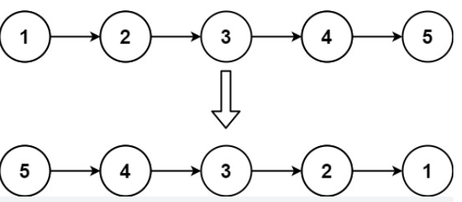
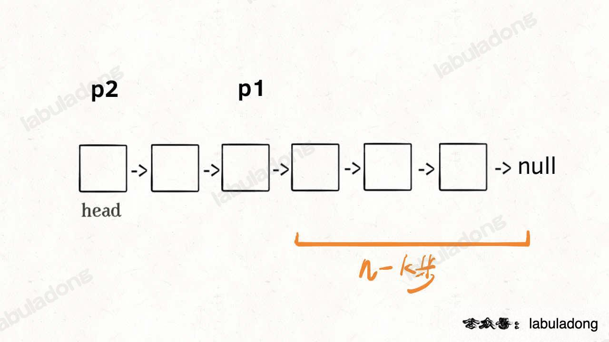
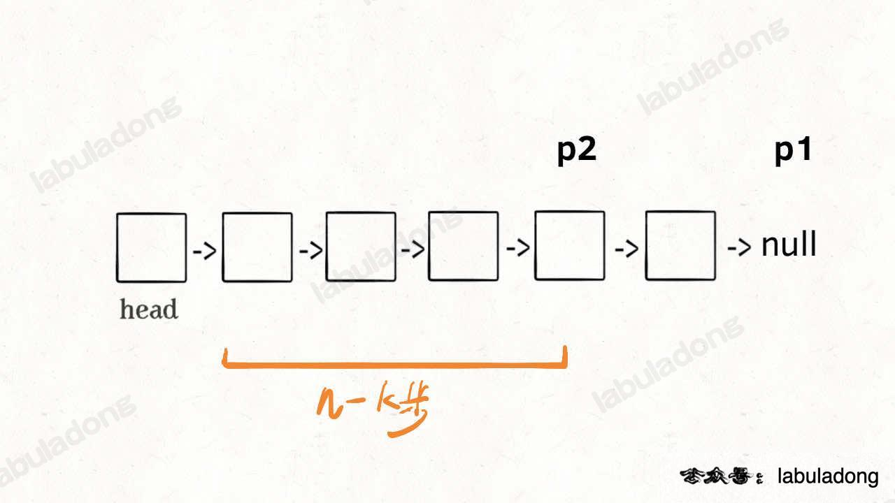
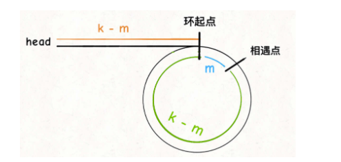
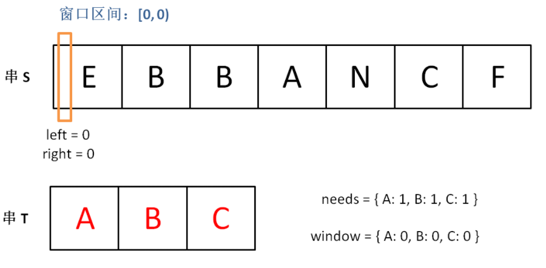
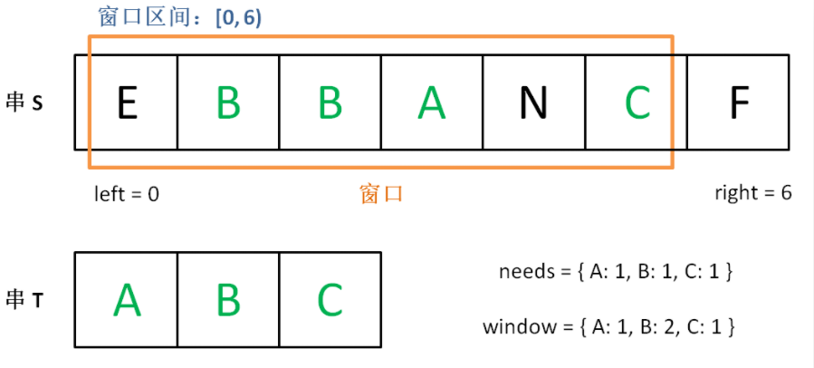
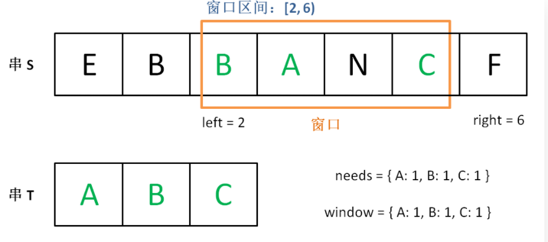
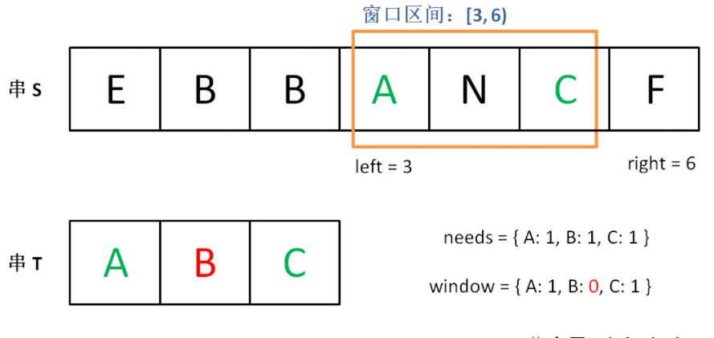
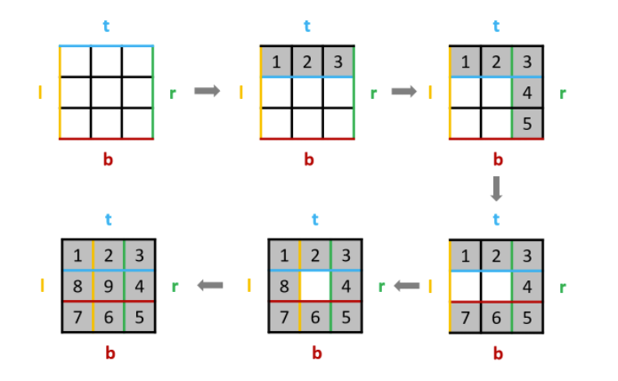

写在前面

# 解构赋值交换两个变量的原理：


> 解构模型
> 在解构中，有下面两部分参与：
> 解构的源，解构赋值[表达式](https://so.csdn.net/so/search?q=表达式&spm=1001.2101.3001.7020)的右边部分。
> 解构的目标，解构赋值表达式的左边部分。
> 其实解构只是左边的部分，右边的部分只是一个**数组**，即解构：解构目标=数组
>
> 所以：[a, b] = [b, a]`等同于`var arr=[b,a]; [a,b]=arr;  引用类型，存储的是地址
>
> 数组是不能储存变量的，arr=[b,a]是将此时变量b与a的值提取出来，存到数组arr里，后面再改变变量a与b，arr中的静态值也不会改变。
> 所以**右侧的数组就是第三个变量**，并不是没有第三个变量，但是**在代码书写上简洁且易读，语义更加清晰明了；**

## 前端博主：

https://xiaochen1024.com/courseware/60b4f11ab1aa91002eb53b18

# 1，数组理论基础

# 2、二分查找

# 3、双指针

## labuladong七道双指针数组题

### 快慢指针系列

### [26. 删除有序数组中的重复项](https://leetcode-cn.com/problems/remove-duplicates-from-sorted-array/)

> 给你一个有序数组 `nums` ，请你**[ 原地](http://baike.baidu.com/item/原地算法)** 删除重复出现的元素，使每个元素 **只出现一次** ，返回删除后数组的新长度。
>
> 不要使用额外的数组空间，你必须在 **[原地 ](https://baike.baidu.com/item/原地算法)修改输入数组** 并在使用 O(1) 额外空间的条件下完成。

> 思路:将快指针 fastIndex依次遍历从 1 到 n-1 的每个位置，对于每个位置，如果 nums[fastIndex] !== nums[fastIndex - 1]，说明 nums[fastIndex] 和之前的元素都不同，因此将 nums[fastIndex] 的值复制到 nums[**slowIndex**]，然后将 slowIndex 的值加 1，即指向下一个位置。
>
> ```JS
> var removeDuplicates = function(nums) {
>  let slowIndex = 1;
>  for(let fastIndex = 1; fastIndex < nums.length; fastIndex ++){
>      if(nums[fastIndex] !== nums[fastIndex - 1]){
>          nums[slowIndex++] = nums[fastIndex]
>      }
>  }
>  nums.length = slowIndex;
> };
> ```
>
> 解法2：
>
> 我们让慢指针 `slow` 走在后面，快指针 `fast` 走在前面探路，找到一个不重复的元素就赋值给 `slow` 并让 `slow` 前进一步。
>
> 这样，就保证了 `nums[0..slow]` 都是无重复的元素，当 `fast` 指针遍历完整个数组 `nums` 后，`nums[0..slow]` 就是整个数组去重之后的结果。
>
> > ps：为什么先slow++，因为，在不相等之前，fast和slow是相等的，slow不加1，就把slow的值覆盖了，而这个值是有用的。
>
> ```js
> var removeDuplicates = function(nums) {
>     let slow = 0;
>     for (let fast = 0; fast < nums.length; fast++) {
>         if (nums[slow] !== nums[fast]) {
>             slow++;
>             nums[slow] = nums[fast];
>         }
>     }
>     return slow + 1;
> };
> ```

### [83. 删除排序链表中的重复元素](https://leetcode.cn/problems/remove-duplicates-from-sorted-list/)

> [labuladong 题解](https://labuladong.github.io/article/?qno=83)[思路](https://leetcode.cn/problems/remove-duplicates-from-sorted-list/#)
>
> 难度简单822
>
> 给定一个已排序的链表的头 `head` ， *删除所有重复的元素，使每个元素只出现一次* 。返回 *已排序的链表* 。
>
>  
>
> **示例 1：**
>
> 
>
> ```
> 输入：head = [1,1,2]
> 输出：[1,2]
> ```

> 其实和数组去重是一模一样的，唯一的区别是把数组赋值操作变成操作指针而已，
>
> 根据指针和数组的存储方式不同处理，不过要先判断空链表
>
> ```js
> var deleteDuplicates = function(head) {
>     if (head === null) {
>         return null;
>     }
>     let slow = head, fast = head;
>     while (fast) {
>         if (slow.val !== fast.val) {
>             // 慢指针的next指向fast指向的不同值 <==> slow++
>             slow.next = fast;
>             // 更新慢指针，使其之下那个fast <==> nums[slow] = nums[fast]
>             slow = fast; // or slow = slow.next
>         }
>         // fast保存每一步都往下走
>         fast = fast.next;
>     }
>     // slow此时指向尾部，断开与重复元素连接
>     slow.next = null;
>     return head;
> };
> ```

### [27. 移除元素](https://leetcode-cn.com/problems/remove-element/)

> 给你一个数组 `nums` 和一个值 `val`，你需要 **[原地](https://baike.baidu.com/item/原地算法)** 移除所有数值等于 `val` 的元素，并返回移除后数组的新长度。
>
> 不要使用额外的数组空间，你必须仅使用 `O(1)` 额外空间并 **[原地 ](https://baike.baidu.com/item/原地算法)修改输入数组**。
>
> 元素的顺序可以改变。你不需要考虑数组中超出新长度后面的元素。
>
> **示例 1：**
>
> ```
> 输入：s = ["h","e","l","l","o"]
> 输出：["o","l","l","e","h"]
> ```

> 解法一：暴力解法，这个题目暴力的解法就是两层for循环，一个for循环遍历数组元素 ，第二个for循环更新数组。
>
> ```js
>  //暴力解法，双循环
>  //时间复杂度n平方
> var removeElement = function(nums, val) {
>     let len = nums.length;
>     for(let i = 0; i < len; i++){
>         //发现需要移除的元素，将数组集体向前移动一位
>         if(nums[i] === val){
>             for(let j = i + 1; j < len; j++){
>                 nums[j - 1] = nums[j] 
>             }
>             //此时数组大小减去一
>             len--;
>             //因为小标i以后的数值都向前移动了一位，所以i也向前移动一位
>             i--;
>         }
>     }
>     return len;
> };
> ```

> 解法二：双指针
>
> 双指针法（快慢指针法）： **通过一个快指针和慢指针在一个for循环下完成两个for循环的工作。**
>
> **双指针法（快慢指针法）在数组和链表的操作中是非常常见的，很多考察数组、链表、字符串等操作的面试题，都使用双指针法。**
>
> 双指针思想：快指针指向当前要处理的元素，慢指针指向下一个将要赋值的位置。
>
> ​	如果快指针指向的元素不等于val：
>
> ​		它一定是输出数组的一个元素我们就将快指针指向的元素复制到慢指针位置，然后将左右指针同时右移；
>
> ​	如果快指针指向的元素等于val：
>
> ​		它不能在输出数组里，此时慢指针不动，快指针右移一位。
>
> 整个过程保持不变的性质是：区间 [0,slowIndex) 中的元素都不等于val。当快慢指针遍历完输入数组以后，slowIndex 的值就是输出数组的长度。
>
> 这样的算法在最坏情况下（输入数组中没有元素等于val），左右指针各遍历了数组一次。
>
> ps：注意这里和有序数组去重的解法有一个细节差异，我们这里是先给 `nums[slow]` 赋值然后再给 `slow++`，这样可以保证 `nums[0..slow-1]` 是不包含值为 `val` 的元素的，最后的结果数组长度就是 `slow`。
>
> ```js
> var removeElement = function(nums, val) {
>     let slow = 0, fast = 0;
>     while (fast < nums.length) {
>         if (nums[fast] !== val) {
>             nums[slow] = nums[fast];
>             slow++;
>         }
>         fast++;
>     }
>     nums.length = slow;
> };
> ```
>
> 解法2改进：双指针法优化
>
> **使用双指针，两个指针初始时分别位于数组的首尾，向中间移动遍历该序列。**
>
> 如果左指针left指向的元素等于 val
>
> ​	此时将右指针 right 指向的元素复制到左指针left 的位置，然后右指针right 左移一位。
>
> ​		如果赋值过来的元素恰好也等于 val，
>
> ​			可以继续把右指针right指向的元素的值赋值过来（左指针left 指向的等于val的元素的位置继续被覆盖）
>
> 直到左指针指向的元素的值不等于  为止。
>
> 当左指针left 和右指针right 重合的时候，左右指针遍历完数组中所有的元素。
>
> ```js
> //双指针法改进
> var removeElement = function(nums, val) {
>  let left = 0, right = nums.length; // 注意这里的right取的是 length，没有减1
>  while(left < right){
>      if(nums[left] === val){
>          nums[left] = nums[right - 1];
>          right--;
>      } else{
>          left++;
>      }
>  }
>  return right;
> };
> ```

### [283. 移动零](https://leetcode-cn.com/problems/move-zeroes/)

> 给定一个数组 `nums`，编写一个函数将所有 `0` 移动到数组的末尾，同时保持非零元素的相对顺序。
>
> **示例:**
>
> ```
> 输入: [0,1,0,3,12]
> 输出: [1,3,12,0,0]
> ```
>
> **说明**:
>
> 1. 必须在原数组上操作，不能拷贝额外的数组。
> 2. 尽量减少操作次数。

> #### 快慢指针思路：
>
> 先利用27题代码，移除所有0，然后再在移除完的数组后面补上0
>
> ```js
> var moveZeroes = function(nums) {
>     let slow = 0, fast = 0;
>     // 复用 27.移除元素 代码
>     while (fast < nums.length) {
>         if (nums[fast] !== 0) {
>             nums[slow] = nums[fast];
>             slow++;
>         }
>         fast++;
>     }
>     // 在尾部补上0
>     for (; slow < nums.length; slow++) {
>         nums[slow] = 0;
>     }
>     return nums;
> };
> ```
>
> #### 左右指针思路：
>
> 左指针指向已处理好的元素尾部，右指针指向未处理的元素头部
>
> 右指针右移的过程中：
>
> ​	当右指针指向非零元素时：交换左右指针元素值，同时左指针右移
>
> ```js
> var moveZeroes = function(nums) {
>     let left = 0, right = 0;
>     while(right < nums.length){
>         if(nums[right] !== 0){
>             swap(nums, left, right);
>             left++;
>         }
>         right++;
>         return nums;
>     }
>     function swap(nums, left, right){
>         let tmp = nums[left];
>         nums[left] = nums[right];
>         nums[right] = tmp;
>     }
> };
> 
> 
> -------------------
> //利用js特性：
> var moveZeroes = function(nums) {
>     let left = 0, right = 0;
>     while (right < nums.length) {
>         if (nums[right] !== 0) {
>             [nums[left], nums[right]] = [nums[right], nums[left]];
>             left++;
>         }
>         right++
>     }
> };
> ```

### 左右指针系列

### 二分查找

### [167. 两数之和 II - 输入有序数组](https://leetcode.cn/problems/two-sum-ii-input-array-is-sorted/)

> [labuladong 题解](https://labuladong.github.io/article/?qno=167)
>
> 给你一个下标从 **1** 开始的整数数组 `numbers` ，该数组已按 **非递减顺序排列** ，请你从数组中找出满足相加之和等于目标数 `target` 的两个数。如果设这两个数分别是 `numbers[index1]` 和 `numbers[index2]` ，则 `1 <= index1 < index2 <= numbers.length` 。
>
> 以长度为 2 的整数数组 `[index1, index2]` 的形式返回这两个整数的下标 `index1` 和 `index2`。
>
> 你可以假设每个输入 **只对应唯一的答案** ，而且你 **不可以** 重复使用相同的元素。
>
> 你所设计的解决方案必须只使用常量级的额外空间。
>
> **示例 1：**
>
> ```
> 输入：numbers = [2,7,11,15], target = 9
> 输出：[1,2]
> 解释：2 与 7 之和等于目标数 9 。因此 index1 = 1, index2 = 2 。返回 [1, 2] 。
> ```

> 点类似二分查找，通过调节 `left` 和 `right` 就可以调整 `sum` 的大小
>
> 后面有总结二、三、四数之和
>
> ```js
> var twoSum = function(numbers, target) {
>     // 左右指针相向而行
>     let left = 0, right = numbers.length - 1;
>     while (left < right) {
>         const sum = numbers[left] + numbers[right];
>         if (sum > target) {
>             right--;
>         } else if (sum < target){
>             left++;
>         } else {
>             return [left + 1, right + 1]; // 下标从1开始，所以集体+1
>         }
>     }
> };
> ```

### [剑指 Offer 57. 和为s的两个数字](https://leetcode.cn/problems/he-wei-sde-liang-ge-shu-zi-lcof/) 同 167题

> ```js
> var twoSum = function(nums, target) {
>     let left = 0, right = nums.length - 1;
>     while (left < right) {
>         const sum = nums[left] + nums[right];
>         if (sum > target) {
>             right--;
>         } else if (sum < target) {
>             left++;
>         } else {
>             return [nums[left], nums[right]];
>         }
>     }
> };
> ```

### [剑指 Offer II 006. 排序数组中两个数字之和](https://leetcode.cn/problems/kLl5u1/)-同167题


> ```js
> var twoSum = function(numbers, target) {
>     let left = 0, right = numbers.length - 1;
>     while (left < right) {
>         const sum = numbers[left] + numbers[right];
>         if (sum > target) {
>             right--;
>         } else if (sum < target) {
>             left++;
>         } else {
>             return [left, right];
>         }
>     }
> };
> ```

### [344. 反转字符串](https://leetcode-cn.com/problems/reverse-string/)

> 编写一个函数，其作用是将输入的字符串反转过来。输入字符串以字符数组 s 的形式给出。
>
> 不要给另外的数组分配额外的空间，你必须原地修改输入数组、使用 O(1) 的额外空间解决这一问题。
>
>  
>
> 示例 1：
>
> 输入：s = ["h","e","l","l","o"]
> 输出：["o","l","l","e","h"]

> ```js
> var reverseString = function(s) {
>  // 一左一右指针相向而行
>  let left = 0, right = s.length - 1;
>  while (left < right) {
>      [s[left], s[right]] = [s[right], s[left]];
>      left++;
>      right--;
>  }
> };
> ```

### [5. 最长回文子串](https://leetcode.cn/problems/longest-palindromic-substring/)

> [labuladong 题解](https://labuladong.github.io/article/?qno=5)[思路](https://leetcode.cn/problems/longest-palindromic-substring/#)
>
> 难度中等5460
>
> 给你一个字符串 `s`，找到 `s` 中最长的回文子串。
>
> **示例 1：**
>
> ```
> 输入：s = "babad"
> 输出："bab"
> 解释："aba" 同样是符合题意的答案。
> ```

> 回文串：正着读和反着读都一样的字符串
>
> 找回文串的难点在于，回文串的的长度可能是奇数也可能是偶数，解决该问题的核心是**从中心向两端扩散的双指针技巧**。
>
> 如果回文串的长度为奇数，则它有一个中心字符；如果回文串的长度为偶数，则可以认为它有两个中心字符。
>
> 如果输入相同的 `l` 和 `r`，就相当于寻找`长度为奇数`的回文串，如果输入相邻的 `l` 和 `r`，则相当于寻找`长度为偶数`的回文串。
>
> 大致思路：
>
> > ```js
> > for 0 <= i < len(s):
> >     找到以 s[i] 为中心的回文串
> >     找到以 s[i] 和 s[i+1] 为中心的回文串
> >     更新答案
> > ```
>
> ```js
> var longestPalindrome = function(s) {
>     let res = '';
>     for (let i = 0; i < s.length; i++) {
>         let len1 = extend(i, i);
>         let len2 = extend(i, i + 1);
>         res = len1.length > res.length ? len1 : res;
>         res = len2.length > res.length ? len2 : res; 
>     }
>     function extend(left, right) {
>         while (left >= 0 && right < s.length && s[left] === s[right]) {
>             left--;
>             right++;
>         }
>         return s.slice(left + 1,right); // 最后要left和right多操作移除所以要减去，另外slice左闭右开取值
>     }
>     return res;
> };
> ```
>
> 

## [剑指 Offer 05. 替换空格](https://leetcode-cn.com/problems/ti-huan-kong-ge-lcof/)

> 难度简单313
>
> 请实现一个函数，把字符串 `s` 中的每个空格替换成"%20"。
>
>  
>
> **示例 1：**
>
> ```
> 输入：s = "We are happy."
> ```

思路：
1. 转换成数组，方便处理，计算出空格个数count
2. 根据空格count求出新数组长度
3. 根据老数组长度从前往后遍历
3.1 在新数组长度下标：遇见了空格则倒着添加 0 2 %，否则填充原本的值
4. 将数组转换成字符串，返回结果

> ps：获取空格个数也可以用map实现，回调里面第一个参数是value，第二个是key，第三个是当前数组
>
> ```js
> let count = 0;
> arr.map((a, b) => {
>    if (a === ' ') {
>        count++;
>    }
> })
> ```
>
> 
>
> ```js
> var replaceSpace = function(s) {
>     let arr = s.split('');
>     //计算出有多少个空格
>     let count = 0;
>     for (let i = 0; i < arr.length; i++) {
>         if (arr[i] == ' ') {
>             count++;
>         }
>     }
>     let oldLen = arr.length;
>     let newLen = oldLen + count * 2;
>     let j = newLen - 1;
>     for (let i = oldLen - 1; i >= 0; i--) {
>         if (arr[i] != ' ') {
>             arr[j] = arr[i];
>             j--;
>         } else {
>             arr[j - 2] = '%';
>             arr[j - 1] = '2';
>             arr[j - 0] = '0';
>             j -= 3;
>         }
>     }
>     return arr.join('');
> };
> ```

## [151. 颠倒字符串中的单词](https://leetcode-cn.com/problems/reverse-words-in-a-string/)

> 给你一个字符串 s ，颠倒字符串中 单词 的顺序。
>
> 单词 是由非空格字符组成的字符串。s 中使用至少一个空格将字符串中的 单词 分隔开。
>
> 返回 单词 顺序颠倒且 单词 之间用单个空格连接的结果字符串。
>
> 注意：输入字符串 s中可能会存在前导空格、尾随空格或者单词间的多个空格。返回的结果字符串中，单词间应当仅用单个空格分隔，且不包含任何额外的空格。
>
>  
>
> 示例 1：
>
> 输入：s = "the sky is blue"
> 输出："blue is sky the"

> 1. 先转为数组，移除多余的空格
>     1.1 快慢指针，fast遍历一遍，去掉首部和中间部分多余的空格
>     1.2 return时，去掉尾部的空格，此时尾部最多一个空格（因为多的空格在1.1处被处理了）
>
> 2. 翻转整体字符串（比如 the sky is blue => eulb si yks eht）
>
>    2.1 遇见空格or遍历到尾部元素就开始反转，start记录子串起始，i-1为末尾
>
> 3. 对每单个字符串翻转（空格和最后一个子符串） => blue is sky the，返回 转义好的字符串
>     3.1 对空格和最后一个元素位置进行处理yurt

```js
var reverseWords = function(s) {
    let arr = s.split('');
    // 去除多余空格
    removeExtraSpace(arr);
    // 整体翻转数组
    reverse(arr, 0, arr.length - 1);
    let start = 0;
    for (let i = 0; i <= arr.length; i++) {
        if (arr[i] === ' ' || i === arr.length) { 
            reverse(arr, start, i - 1);
            start = i + 1;
        }
    }
    return arr.join('');
};

// 去除头部所有空格，中间多余空格，尾部的至多一个空格
function removeExtraSpace(arr) {
    let slow = 0, fast = 0;
    while (fast < arr.length) {
        if (arr[fast] === ' ' && (fast === 0 || arr[fast - 1] === ' ')) {
            fast++;
        } else {
            arr[slow++] = arr[fast++];
        }
    }
    // 尾部最多是一个空格，因为多于一个的在while中去除了
    arr.length = arr[slow - 1] === ' ' ? slow - 1 : slow;
}

// 翻转 [start, end] 的arr
function reverse(arr, start, end) {
    let i = start, j = end;
    while (i < j) {
        [arr[i], arr[j]] = [arr[j], arr[i]];
        i++;
        j--;
    }
}
```

## [206. 反转链表](https://leetcode-cn.com/problems/reverse-linked-list/)

> 给你单链表的头节点 head ，请你反转链表，并返回反转后的链表。
>
> 示例 1：
>
> 
>
>
> 输入：head = [1,2,3,4,5]
> 输出：[5,4,3,2,1]
>
> 

> ```js
> var reverseList = function(head) {
>     let pre = null, cur = head, tmp = null;
>     while (cur) {
>         tmp = cur.next;
>         cur.next = pre;
>         pre = cur;
>         cur = tmp;
>     }
>     return pre;
> };
> ```

## [19. 删除链表的倒数第 N 个结点](https://leetcode-cn.com/problems/remove-nth-node-from-end-of-list/)

> 给你一个链表，删除链表的倒数第 `n` 个结点，并且返回链表的头结点。
>
> **示例 1：**
>
> 
>
> ```
> 输入：head = [1,2,3,4,5], n = 2
> 输出：[1,2,3,5]
> ```

> 思路：
>
> 要删除倒数第 `n` 个节点，就得获得倒数第 `n + 1` 个节点的引用。
>
> 获取单链表的倒数第 `k` 个节点，就是想考察 [双指针技巧](https://labuladong.github.io/article/fname.html?fname=链表技巧) 中快慢指针的运用，一般都会要求你**只遍历一次链表**，就算出倒数第 `k` 个节点。
>
> 第一步，我们先让一个指针 `p1` 指向链表的头节点 `head`，然后走 `k` 步：
>
> 
>
> 
>
> 
>
> 第二步，用一个指针 `p2` 指向链表头节点 `head`：
>
> 
>
> 
>
> 
>
> 第三步，让 `p1` 和 `p2` 同时向前走，`p1` 走到链表末尾的空指针时走了 `n - k` 步，`p2` 也走了 `n - k` 步，也就是链表的倒数第 `k` 个节点：
>
> 
>
> 
>
> 
>
> 这样，只遍历了一次链表，就获得了倒数第 `k` 个节点 `p2`。
>
> 解法中在链表头部接一个虚拟节点 `dummy` 是为了避免删除倒数第一个元素时出现空指针异常，在头部加入 `dummy` 节点并不影响尾部倒数第 `k` 个元素是什么。

> ```js
> var removeNthFromEnd = function(head, n) {
>        let dummy = new ListNode(-1, head);
>        let slow = dummy;
>        let fast = dummy.next;
>        while (n) {
>            fast =fast.next;
>            n--;
>        }
>        while (fast) {
>            fast = fast.next;
>            slow = slow.next;
>        }
>        slow.next = slow.next.next;
>        return dummy.next;
> };
> ```

## [面试题 02.07. 链表相交](https://leetcode-cn.com/problems/intersection-of-two-linked-lists-lcci/)

> ```js
> var getIntersectionNode = function(headA, headB) {
>     let curA = headA, curB = headB;
>     while (curA != curB) {
>         if (curA) {
>             curA = curA.next;
>         } else {
>             curA = headB;
>         }
>         if (curB) {
>             curB = curB.next;
>         } else {
>             curB = headA;
>         }
>     }
>     return curB;
> };
> ```

## [141. 环形链表](https://leetcode-cn.com/problems/linked-list-cycle/)

## 142. 环形链表2

> 

> ```js
> var findCycleStart = function(head) {
>      let fast = head, slow = head;
>      while(fast !== null && fast.next !== null) {  //fast和fast.next不能颠倒，短路原则
>            fast = fast.next.next;
>            slow = slow.next;
>            if(slow === fast) break;
>      }
>      //fast遇到空指针说明没有环
>      if (fast === null || fast.next === null) return null;
>      //slow重新指向头节点
>      slow = head;
>      while(slow !== fast) {
>            slow = slow.next;
>            fast = fast.next
>      }
>      return slow;
> }
> ```

## 15 18 三/四数之和

> 

> 

## [844. 比较含退格的字符串](https://leetcode-cn.com/problems/backspace-string-compare/)

> 给定 `s` 和 `t` 两个字符串，当它们分别被输入到空白的文本编辑器后，请你判断二者是否相等。`#` 代表退格字符。
>
> 如果相等，返回 `true` ；否则，返回 `false` 。
>
> **注意：**如果对空文本输入退格字符，文本继续为空。 
>
> **示例 1：**
>
> ```
> 输入：s = "ab#c", t = "ad#c"
> 输出：true
> 解释：S 和 T 都会变成 “ac”。
> ```
>
> 

> > 整体思路：
> >
> > 从后往前比较s，t的字符，有不相等的立马return false，但是在比较之前，需要对s，t做一下处理：遇到#，忽略，遇到#之前的，忽略
>
> 由于 # 号只会消除左边的一个字符，所以对右边的字符无影响，所以我们选择从后往前遍历 *S*，*T*字符串。
>
> 思路：
>
> 1. 准备指针i,j:指向s，t末位字符
> 2. 准备变量skipS，skipT：存放s，t中 # 数量
> 3. 大循环（i>=0||j>=0）里从后往前遍历：
>    1. 在s中用while小循环
>       1. 对s，若i当前指向字符是 # ：skipS自增1，i--
>       2. 若不是但skipS不为0，代表此字符不需要:继续i--
>       3. 若不是 # 且 skipS为0：break，跳出小循环
>    2. 对t进行同样操作
> 4. 在大循环中判断i，j指向的元素是否相等，不等直接false，相等则i--,j--，继续下一轮大循环
>
> ```js
> var backspaceCompare = function(s, t) {
>     //用来记录#数量
>     let skipS = 0, skipT = 0;
>     //初始化指针，分别指向s，t的尾部
>     let i = s.length - 1, j = t.length - 1;
>     while (i >= 0 || j >= 0) {
>         while (i >= 0) {
>             if (s[i] == '#' ) {
>                 skipS++;
>                 i--;
>             } else if(skipS !== 0) {
>                 skipS--;
>                 i--
>             } else break;//跳出while循环,在while循环外部来比较
>         }
>         while (j >= 0) {
>             if (t[j] == '#') {
>                 skipT++;
>                 j--;
>             } else if (skipT !== 0) {
>                 skipT--;
>                 j--
>             } else break;
>         }
> 		//注意，当s，t第一个字符都是"#"时，i，j都为-1，此时都为undefined，依旧相等，
>         //如果是其它语言，这里是要加if else判断的：i >= 0 && j >= 0   
>         if (s[i] !== t[j]) return false
>         i--;
>         j--;
>     }
>     return true;
> };
> ```

## [977. 有序数组的平方](https://leetcode-cn.com/problems/squares-of-a-sorted-array/)

> 给你一个按 **非递减顺序** 排序的整数数组 `nums`，返回 **每个数字的平方** 组成的新数组，要求也按 **非递减顺序** 排序。
>
> **示例 1：**
>
> ```
> 输入：nums = [-4,-1,0,3,10]
> 输出：[0,1,9,16,100]
> 解释：平方后，数组变为 [16,1,0,9,100]
> 排序后，数组变为 [0,1,9,16,100]
> ```

> 暴力：遍历+快排 时间复杂度为 nlog(n)
>
> ```js
> var sortedSquares = function(nums) {
>     for (let i = 0; i < nums.length; i++) {
>         nums[i] *= nums[i];
>     }
>     nums.sort((a, b) => a - b);
>     return nums;
> };
> ```

> 思路：双指针法，原数组是非递减的，因此有一个`关键特性`要抓牢：数组元素有正有负，元素平方之后的`最大值`只可能出现在：`最左边`或者`最右边`
>
> 因此:
>
> 1. 定义两个指针，i：指向nums头部，j:指向nums尾部
>
> 2. 定义一个新数组result，长度和nums保持一致
>
> 3. i,j开始移动:while(i<=j)
>
>    1. 如果
>
>    ```js
>    nums[i]**2 > nums[j]**2
>    ```
>
>    则：把较大的头部值 nums[i]**2 放入result，同时i++
>
>    2. 如果
>
>    ```js
>    nums[i]**2 <= nums[j]**2
>    ```
>
>    则：把较大的尾部值放入result,同时j--

> ```js
> var sortedSquares = function(nums) {
>     // 最大或者最小只可能出现在首尾两端
>     let result = [];
>     let i = 0, j = nums.length - 1;
>     let k = nums.length - 1; // 维护一个k，保证最先塞入的元素放在尾部，因为递增
>     // 注意这里要i <= j，因为最后要处理两个元素
>     while (i <= j) {
>         if (nums[i] ** 2 > nums[j] ** 2) {
>             result[k--] = nums[i] ** 2;
>             i++;
>         } else {
>             result[k--] = nums[j] ** 2;
>             j--;
>         }
>     }
>     return result;
> };
> ```
>

# 4、滑动窗口

> 参考：labudadong[滑动窗口](https://labuladong.gitee.io/algo/1/12/)
>
> > ps：滑动窗口代码框架中有一个嵌套的 while 循环，但算法的时间复杂度依然是 `O(N)`，其中 `N` 是输入字符串/数组的长度。
> >
> > 因为：字符串/数组中的`每个元素都只会进入窗口一次，然后被移出窗口一次`，不会说有某些元素多次进入和离开窗口，所以算法的时间复杂度就和字符串/数组的长度成正比。

> 滑动窗口的大致逻辑：
>
> ```js
> let left = 0, right = 0;
> 
> while (right < s.length) {
>     // 增大窗口
>     window.add(s[right]);
>     right++;
>     
>     while (window needs shrink) {
>         // 缩小窗口
>         window.remove(s[left]);
>         left++;
>     }
> }
> 
> ```
>
> 滑动窗口模板：
>
> ```js
> /* 滑动窗口算法框架 */
> var function = slidingWindow(s, t) {
>     let need = {}, window = {};
>     for(let a of need){
>         need[a] = (need[a] || 0) + 1;
>     }
>     let left = 0, right = 0;
>     let valid = 0; 
>     while (right < s.length) {
>         // intoStr 是将移入窗口的字符
>         let intoStr = s[right];
>         // 右移窗口
>         right++;
>         // 进行窗口内数据的一系列更新
>         ...
> 
>         // debug 输出的位置
>         console.log('window: ' + left, right)
>         
>         // 判断左侧窗口是否要收缩
>         while (window needs shrink) {  // 一定要注意这里是 while
>             // removeStr 是将移出窗口的字符
>             let removeStr = s[left];
>             // 左移窗口
>             left++;
>             // 进行窗口内数据的一系列更新
>             ...
>         }
>     }
> }
> 
> ```
>
> **开始套模板，需要思考以下四个问题**：
>
> 1、当移动 `right` 扩大窗口，即加入字符时，应该更新哪些数据？
>
> 2、什么条件下，窗口应该暂停扩大，开始移动 `left` 缩小窗口？
>
> 3、当移动 `left` 缩小窗口，即移出字符时，应该更新哪些数据？
>
> 4、我们要的结果应该在扩大窗口时还是缩小窗口时进行更新？

## [76. 最小覆盖子串](https://leetcode-cn.com/problems/minimum-window-substring/)

> 给你一个字符串 `s` 、一个字符串 `t` 。返回 `s` 中涵盖 `t` 所有字符的最小子串。如果 `s` 中不存在涵盖 `t` 所有字符的子串，则返回空字符串 `""` 。
>
> 
>
> **注意：**
>
> - 对于 `t` 中重复字符，我们寻找的子字符串中该字符数量必须不少于 `t` 中该字符数量。
> - 如果 `s` 中存在这样的子串，我们保证它是唯一的答案。
>
>  
>
> **示例 1：**
>
> ```
> 输入：s = "ADOBECODEBANC", t = "ABC"
> 输出："BANC"
> ```

> 滑动窗口的解题思路
>
> 1. 我们在字符串 S 中使用双指针中的左右指针技巧，初始化 left = right = 0，把索引闭区间 [left, right] 称为一个「窗口」。
> 2. 我们先不断地增加 right 指针扩大窗口 [left, right]，直到窗口中的字符串符合要求（包含了 t 中的所有字符）
> 3. 我们停止增加 right，转而不断增加 left 指针缩小窗口 [left, right]，直到窗口中的字符串不再符合要求（不包含 T 中的所有字符了）。同时，每次增加 left，我们都要更新一轮结果
> 4. 重复第 2 和第 3 步，直到 right 到达字符串 S 的尽头
> 5. 这个思路的本质就是：增加窗口右边界，寻找一个可行解，在找到可行解的情况下增加窗口左边界，优化可行解，找到最优解
>
> ### 图解解题思路
>
> - 图中needs这个计数器表示的是要找的字符串t所需要的字符数
> - window这个计数器表示的是当前窗口中需要的字符的字符数
>
> 1. 初始状态
>
> 
>
> 2. 增加窗口右边界right，直到窗口[left, right]包含t中的所有字符,找到可行解
>
> 
>
> 3. 开始增加窗口左边界left，缩小窗口[left, right]，这一步的目的是在可行解当中寻找最优解
>
> 
>
> 4. 直到窗口中的字符不再符合条件，窗口左边界left不再继续移动
>
> 
>
> 之后就是循环上面的过程，再移动 right 试图使窗口中的字符再次符合要求，之后移动 left 缩小窗口… 直到 right 指针到达字符串 S 的末端，算法结束
> 这个算法的时间复杂度是 O(M + N)，M 和 N 分别是字符串 S 和 T 的长度。因为我们先用 for 循环遍历了字符串 T 来初始化 needs，时间 O(N)，之后的两个 while 循环最多执行 2M 次，时间 O(M)。
>
> 

> ```js
> var minWindow = function(s, t) {
>     // 滑动窗口思路：
>     // 1，大循环：右移right：如果right指向的当前元素在needs中，则更新window，用vaild记录
>     // 2，小循环：如果windo中元素个数和数量满足needs时，right停止移动，开始移动left，更新window
>     // 3，记录最小长度的start和length，返回substr(start, length)/""
>     let left = right = 0;
>     let need = {}; // 需要的字符和字符个数 a:1,b:1,c:1
>     let window = {}; // 当前窗口内的字符和字符个数 a:0,b:0,c:0
>     let valid = 0; // 窗口中满足need条件的字符个数（不是字符出现次数）
>     let length = Number.MAX_VALUE;
>     let start = 0; // 返回结果数组时的起始位置
>     // 需要统计的字符：need = {a:1,b:1,c:1}
>     for(let a of t){
>         need[a] = (need[a] || 0) + 1;
>     }
>     while (right < s.length) {
>         // 即将移入窗口的字符
>         let cur = s[right];
>         right++;
>         // 如果当前元素在need中，更新window
>         if (need[cur]) {
>             window[cur] = (window[cur] || 0) + 1;
>             //window中cur这个元素的个数和need中cur这个相等时，给valid++，用来判断是否开始left右移
>             if (window[cur] === need[cur]) {
>                 valid++;
>             }
>         }
>         // 判断左窗口是否需要收缩
>         while (valid === Object.keys(need).length) {
>             // 每收缩一次，更新最小长度
>             if (right - left < length) {
>                 //将当前left的值保存给start
>                 start = left;
>                 //更新当前长度，保证len存储的一直是最小长度
>                 length = right - left; // 左闭右开，所以不用+1
>             }
>             //记录将要被移除的字符
>             let moveStr = s[left];
>             //右移left
>             left++;
>             //
>             if (need[moveStr]) {
>                 //need和window中此字符个数相等时，vaild减一，代表window中此字符个数和need不相等
>                 //注意！！！必须先进行if判断，先window[moveStr]--，就改变值了
>                 if (need[moveStr] === window[moveStr]) {
>                     valid--;
>                 }
>                 //将此字符在window中的个数减一
>                 window[moveStr]--;
>             }
>         }
>     }
>     return length === Number.MAX_VALUE ? "" : s.substr(start, length)
> };
> ```
>
> > ps："Hello world!".substr(2, 3) // "llo"

## [567. 字符串的排列](https://leetcode-cn.com/problems/permutation-in-string/)

> 给你两个字符串 `s1` 和 `s2` ，写一个函数来判断 `s2` 是否包含 `s1` 的排列。如果是，返回 `true` ；否则，返回 `false` 。
>
> 换句话说，`s1` 的排列之一是 `s2` 的 **子串** 。
>
> 
>
> **示例 1：**
>
> ```
> 输入：s1 = "ab" s2 = "eidbaooo"
> 输出：true
> 解释：s2 包含 s1 的排列之一 ("ba").
> ```
>
> **示例 2：**
>
> ```js
> 输入：s1= "ab" s2 = "eidboaoo"
> 输出：false
> ```

> **题解：相当给你一个 `S1` 和一个 `s2`，请问你 `S2` 中是否存在一个子串，包含 `s1` 中所有字符且不包含其他字符**？
>
> 思路：套用滑动窗口模板，然后解决四个问题
>
> 1. 右移right，即加入字符时，应该更新哪些数据
> 2. 什么条件下，窗口暂停扩大，且右移left缩小窗口
> 3. 右移left即移出字符时，应该更新哪些数据
> 4. 要的结果是要在扩大窗口还是缩小窗口时进行更新
>
> 对于这道题的解法代码，基本上和最小覆盖子串一模一样，只需要改变两个地方：
>
> 1、本题移动 `left` 缩小窗口的时机是窗口大小大于 `s1.length` 时，应为排列嘛，显然长度应该是一样的。
>
> 2、当发现 `Object.keys(need).length` 时，就说明窗口中就是一个合法的排列，所以立即返回 `true`。
>
> 至于如何处理窗口的扩大和缩小，和最小覆盖子串完全相同。
>
> ```js
> var checkInclusion = function(s1, s2) {
>     let left = right = valid = 0;
>     let need = {}, window = {};
>     for(let a of s1){
>         need[a] = (need[a] || 0) + 1;
>     }
>     while(right < s2.length){
>         //intoStr是将移入窗口的字符
>         let intoStr = s2[right];
>         //右移窗口
>         right++;
>         //对窗口进行数据更新
>         if(need[intoStr]){
>             window[intoStr] = (window[intoStr] || 0) + 1;
>             //判断某个字符的数量是否相等，比如有多少个a
>             if(need[intoStr] === window[intoStr]){
>                 valid++;
>             }
>         }
>         console.log(right, left)
>         //判断左侧窗口是否要收缩
>         while(right - left >= s1.length){
>             //判断是否找到想要的字符串
>             if(valid === Object.keys(need).length){
>                 return true;
>             }
>             //removeStr是将要移出窗口的字符
>             let removeStr = s2[left];
>             //左移窗口
>             left++;
>             //进行窗口内一系列更新
>             if(need[removeStr]){
>                 if(need[removeStr] === window[removeStr]){
>                     valid--;
>                 }
>                 window[removeStr]--;
>             }
>         }
>     }
>     return false;
> };
> ```

## 438. 找到字符串中所有字母异位词

> 给定两个字符串 `s` 和 `p`，找到 `s` 中所有 `p` 的 **异位词** 的子串，返回这些子串的起始索引。不考虑答案输出的顺序。
>
> **异位词** 指由相同字母重排列形成的字符串（包括相同的字符串）。
>
> 
>
> **示例 1:**
>
> ```
> 输入: s = "cbaebabacd", p = "abc"
> 输出: [0,6]
> 解释:
> 起始索引等于 0 的子串是 "cba", 它是 "abc" 的异位词。
> 起始索引等于 6 的子串是 "bac", 它是 "abc" 的异位词。
> ```
>
> **示例 2:**
>
> ```
> 输入: s = "abab", p = "ab"
> 输出: [0,1,2]
> 解释:
> 起始索引等于 0 的子串是 "ab", 它是 "ab" 的异位词。
> 起始索引等于 1 的子串是 "ba", 它是 "ab" 的异位词。
> 起始索引等于 2 的子串是 "ab", 它是 "ab" 的异位词。
> ```

> 思路:同567，唯一改变的是，return true那里改成使用数组保存最终结果
>
> ```js
> var findAnagrams = function(s, p) {
>      let need = {}, window = {};
>      let left = right = valid = 0;
>      let result = [];
>      for(let a of p){
>            need[a] = (need[a] || 0) + 1; 
>      }
>      while(right < s.length){
>            //intoStr:进入窗口的字符
>            let intoStr = s[right];
>            //右移
>            right++;
>            //在窗口内进行数据更新
>            if(need[intoStr]){
>                window[intoStr] = (window[intoStr] || 0) + 1;
>                if(need[intoStr] === window[intoStr]){
>                    valid++;
>                }
>            }
>            //确定右窗口不动，左窗口收缩的条件
>            while(right - left >= p.length){
>                //找到其中一个字母异位词后，存入数组
>                if(valid === Object.keys(need).length){
>                    result.push(left)
>                }
>                //removeStr:移出窗口的字符
>                let removeStr = s[left];
>                //窗口左边右移
>                left++;
>                //在窗口内进行数据操作
>                if(need[removeStr]){
>                    if(window[removeStr] === need[removeStr]){
>                        valid--;
>                    }
>                    window[removeStr]--;
>                }
>            }
>      }
>      return result;
> };
> ```

## [3. 无重复字符的最长子串](https://leetcode-cn.com/problems/longest-substring-without-repeating-characters/)

> 给定一个字符串 `s` ，请你找出其中不含有重复字符的 **最长子串** 的长度。
>
> 
>
> **示例 1:**
>
> ```
> 输入: s = "abcabcbb"
> 输出: 3 
> 解释: 因为无重复字符的最长子串是 "abc"，所以其长度为 3。
> ```
>
> **示例 2:**
>
> ```js
> 输入: s = "bbbbb"
> 输出: 1
> 解释: 因为无重复字符的最长子串是 "b"，所以其长度为 1。
> ```

> 这就是变简单了，不需要 `need` 和 `valid` ，而且更新窗口内数据也只需要简单的更新计数器 `window` 即可。
>
> 当 `window[intoStr]` 值大于 1 时，说明窗口中存在重复字符，不符合条件，就该移动 `left` 缩小窗口了。
>
> 唯一需要注意的是，在哪里更新结果 `res` 呢？我们要的是最长无重复子串，哪一个阶段可以保证窗口中的字符串是没有重复的呢？
>
> `这里`和之前不一样:
>
> 要在收缩窗口完成后更新 `res`，因为窗口收缩的 while 条件是存在重复元素，换句话说收缩完成后一定保证窗口中没有重复。

> ```js
> var lengthOfLongestSubstring = function(s) {
>        if(s.length === 0) return 0;
>        let left = right = 0;
>        let window = {};
>        let result = 0;
>        while (right < s.length) {
>            //intoStr:将进入窗口的字符
>            let intoStr = s[right];
>            right++;
>            //更新window数据
>            //注意！！！更新的是widow[intoStr]
>            window[intoStr] = (window[intoStr] || 0) + 1;
>            //判断左侧窗口是否收缩
>            while (window[intoStr] > 1) {
>                //removeStr：将移出窗口的字符
>                let removeStr = s[left];
>                left++;
>                //操作window数据
>                window[removeStr]--;
>            }
>            //记录最长子串
>            result = Math.max(result, right - left)
>        }
>        return result;
> };
> ```

## [209. 长度最小的子数组](https://leetcode-cn.com/problems/minimum-size-subarray-sum/)

> 给定一个含有 `n` 个正整数的数组和一个正整数 `target` **。**
>
> 找出该数组中满足其和 `≥ target` 的长度最小的 **连续子数组** `[numsl, numsl+1, ..., numsr-1, numsr]` ，并返回其长度**。**如果不存在符合条件的子数组，返回 `0` 。

> 解法一：暴力破解
>
> 两个for循环，然后不断的寻找符合条件的子序列，时间复杂度很明显是n平方
>
> ```js
> var minSubArrayLen = function(target, nums) {
>        let result = Infinity;   // 最终结果
>        let subLength = 0   // 子数组长度
>        let sum = 0;    // 子序列之和
>        for(let i = 0; i < nums.length; i++){
>            sum = 0;
>            for(let j = i; j < nums.length; j++){
>                sum += nums[j];
>                if(sum >= target){
>                    subLength = j - i + 1;
>                    result = result > subLength ? subLength : result;
>                    break; // 终止本轮for循环 
>                }
>            }
>        }
>        return result === Infinity ? 0 : result;
> };
> ```

> 解法二：`滑动窗口`
>
> 数组操作中另一个重要的方法：**滑动窗口**。
>
> 所谓滑动窗口，**就是不断的调节子序列的起始位置和终止位置，从而得出我们要想的结果**。
>
> 滑动窗口也可以理解为双指针法的一种！只不过这种解法更像是一个窗口的移动，所以叫做滑动窗口更适合一些。
>
> 在本题中实现滑动窗口，主要确定如下三点：
>
> - 窗口内是什么？
> - 如何移动窗口的起始位置？
> - 如何移动窗口的结束位置？
>
> 窗口就是 满足其和 ≥ target 的长度最小的 连续 子数组。
>
> 窗口的起始位置如何移动：如果当前窗口的值大于target了，窗口就要向前移动了（也就是该缩小了）。
>
> 窗口的结束位置如何移动：窗口的结束位置就是遍历数组的指针，窗口的起始位置设置为数组的起始位置就可以了。
>
> **滑动窗口的精妙之处在于根据当前子序列和大小的情况，不断调节子序列的起始位置。从而将O(n^2)的暴力解法降为O(n)。**
>
> ```js
> var minSubArrayLen = function(target, nums) {
>     let left = 0, right = 0;
>     let res = Infinity;
>     let sum = 0;
>     while (right < nums.length) {
>         const cur = nums[right];
>         right++;
> 
>         sum += cur;
>         while (sum >= target) {
>             const subLen = right - left;
>             res = res < subLen ? res : subLen;
>             const willRemove = nums[left];
>             left++;
>             sum -= willRemove;
>         }
>     }
>     return res === Infinity ? 0 : res;
> };
> ```
>

## [904. 水果成篮](https://leetcode-cn.com/problems/fruit-into-baskets/)

> 你正在探访一家农场，农场从左到右种植了一排果树。这些树用一个整数数组 `fruits` 表示，其中 `fruits[i]` 是第 `i` 棵树上的水果 **种类** 。
>
> 你想要尽可能多地收集水果。然而，农场的主人设定了一些严格的规矩，你必须按照要求采摘水果：
>
> - 你只有 **两个** 篮子，并且每个篮子只能装 **单一类型** 的水果。每个篮子能够装的水果总量没有限制。
> - 你可以选择任意一棵树开始采摘，你必须从 **每棵** 树（包括开始采摘的树）上 **恰好摘一个水果** 。采摘的水果应当符合篮子中的水果类型。每采摘一次，你将会向右移动到下一棵树，并继续采摘。
> - 一旦你走到某棵树前，但水果不符合篮子的水果类型，那么就必须停止采摘。
>
> 给你一个整数数组 `fruits` ，返回你可以收集的水果的 **最大** 数目。
>
>  
>
> **示例 1：**
>
> ```
> 输入：fruits = [1,2,1]
> 输出：3
> 解释：可以采摘全部 3 棵树。
> ```

> 题目解析：问题等价于，找到最长的子序列，最多含有两种元素
>
> 思路：用滑动窗口遍历fruits，当有新种类的水果进入窗口时
> 如果窗口中只有一种水果，将这种水果加入arr数组
> 如果有两种水果，更新窗口的左边界，更新arr中水果的种类
> 如果进来了一种新的类型的水果 更新前一种水果的位置
> 更新滑动窗口的最大值
> 复杂度：时间复杂度O(n)，空间复杂度O(1)。
>
> 作者：chen-wei-f
> 链接：https://leetcode-cn.com/problems/fruit-into-baskets/solution/904-shui-guo-cheng-lan-by-chen-wei-f-t185/
>
> ```js
> // 题意等价于找：只出现最多两个元素的子序列长度最大值
> // 滑动窗口：
> // 定义两个指针left， right，起始指针和遍历指针
> // 定义n，指向前一类水果的结束位置，未来的循环中，可能会成为arr中第一个元素的首下标
> // 定义最大长度maxLength
> // 定义数组arr，一开始数组存放0位置的元素
> 
> // 1. 当进来的元素不在篮子里
> //   1.1 如果数组只有一个元素，则加入第二种水果；
> //   1.2 如果数组有两个元素，更新左边界（原arr的第二个元素现在变成第一个元素），同时更新水果种类
> // 3. 如果进来新的水果元素，则更新前一种水果的位置
> 
> // 更新滑动窗口的最大长度 right - left + 1
> var totalFruit = function(fruits) {
>     let left = n = maxLength = 0;
>     let arr = [fruits[0]];
>     for (let right = 0; right < fruits.length; right++) {
> 	    const cur = fruits[right];
>         if (!arr.includes(cur)) { // 如果arr未包含right指向的元素
>             if (arr.length <= 1) {    // 如果arr里元素只有一个，加入第二种水果
>                 arr[1] = cur
>             } else {                     // 如果arr元素已经有两个，更新边界，更新水果种类
>                 // 更新左边界：left指向原第一个元素，n指向原第二个元素，现在从fruits进来新元素，
>                 // n 指向第二个水果，此时第二个水果要变成第一个水果了，n
>                 // 因此原第二个变成现如今的左起第一个，n的指向在下面改变
>                 left = n;  
>                 [arr[0], arr[1]] = [fruits[right - 1] ,fruits[right]];
>             }
>         }
> 
>         // 如果进来新的水果元素，更新前一种水果n的位置,此时n指向第二个水果
>         // 让n指向本轮循环的arr中最后一个元素（新添加的）在fruits中的位置
>         if (fruits[n] !== cur) {
>             n = right
>         }
>         maxLength = Math.max(right - left + 1, maxLength)
>     }
>     return maxLength;
> };
> ```
>

> ps：n的作用，不太好描述！！！没搞懂
>
> n指向谁，取决于当前遍历的元素，和它原本指向的值，可是这样情况就有好多种，n最终是要赋值给left
>
> 所以，n指向的应该是：未来的循环中，可能会成为arr中第一个元素的首下标，为什么是可能，因为指向了不一定能用到，比如[1, 2, 1, 1, 1, 3]，n最终指向5，但用不到


# 5、二维数组花式遍历

## [48. 旋转图像](https://leetcode-cn.com/problems/rotate-image/)

> 给定一个 *n* × *n* 的二维矩阵 `matrix` 表示一个图像。请你将图像`顺时针`旋转 90 度。
>
> 你必须在**[ 原地](https://baike.baidu.com/item/原地算法)** 旋转图像，这意味着你需要直接修改输入的二维矩阵。**请不要** 使用另一个矩阵来旋转图像。
>
> **示例 2：**
>
> 
>
> ```
> 输入：matrix = [[5,1,9,11],[2,4,8,10],[13,3,6,7],[15,14,12,16]]
> 输出：[[15,13,2,5],[14,3,4,1],[12,6,8,9],[16,7,10,11]]
> ```

> 思路：
>
> 1. **先将 `n x n` 矩阵 `matrix` 按照左上到右下的对角线进行镜像对称**，转置
> 2. **然后再对矩阵的每一行进行反转**：
> 3. **结果就是 `matrix` 顺时针旋转 90 度的结果**：
>
> 提示：主对角线：左上到右下    副对角线：左下到右上
>
> ```js
> //思路：将matrix转置（行列互换，即沿着主对角线翻转），然后每一行翻转得到结果
> var rotate = function(matrix) {
>     let n = matrix.length;
>     //matrix行列互换得到转置矩阵
>     for (let i = 0; i < n; i++) {
>         for (let j = i; j < n; j++) {
>             [matrix[i][j], matrix[j][i]] = [matrix[j][i], matrix[i][j]]
>         }
>     }
>     //翻转二维矩阵的每一行
>     for (let i = 0; i < n; i++) {
>         let l = 0;
>         let r = matrix[i].length - 1;
>         while (l < r) {
>             //解构赋值，交换每一行的元素，翻转
>             [matrix[i][l], matrix[i][r]] = [matrix[i][r], matrix[i][l]]
>             l++;
>             r--;
>         }
>     }
> };
> ```
> 
>注意：交换值用到了解构赋值，这个要多学习，复习

### 发散：矩阵逆时针旋转 90 度

> **如何将矩阵`逆时针`旋转 90 度**:
>
> 通过另一条对角线(左下到右上)镜像对称矩阵，然后再反转每一行，就得到了逆时针旋转矩阵的结果：
>
> 代码和上面差不多，只改变转置时交换的值
>
> ```js
> var rotate = function(matrix) {
>     let n = matrix.length;
>     // matrix沿着副对角线镜像翻转
>     for(let i = 0; i < n; i++){
>         // 此for循环和上面那个不一样
>         for(let j = 0; j < n - i; j++){
>             // 此解构赋值也不一样
>             [matrix[i][j], matrix[n-j-1][n-i-1]] = [matrix[n-j-1][n-i-1], matrix[i][j]]
>         }
>     }
>     console.log(matrix)
>     // 翻转二维矩阵的每一行
>     for(let i = 0; i < n; i++){
>         console.log(matrix[i])
>         let l = 0;
>         let r = matrix[i].length - 1;
>         while(l < r){
>             // 解构赋值，交换每一行的元素，翻转
>             [matrix[i][l], matrix[i][r]] = [matrix[i][r], matrix[i][l]]
>             l++;
>             r--;
>         }
>     }
> };
> ```
>
> 

## [54. 螺旋矩阵](https://leetcode-cn.com/problems/spiral-matrix/)

> 给你一个 `m` 行 `n` 列的矩阵 `matrix` ，请按照 **顺时针螺旋顺序** ，返回矩阵中的所有元素。
>
> **示例 1：**
>
> 
>
> ```js
> 输入：matrix = [[1,2,3],[4,5,6],[7,8,9]]
> 输出：[1,2,3,6,9,8,7,4,5]
> ```

> 注意！！！这种题思路简单，但是写代码很容易出错，边界条件，上右下左，搞不好就error，一定要想仔细了，建议画图。

> ```js
> var spiralOrder = function(matrix) {
>        if (matrix.length === 0) {
>            return [];
>        }
>        const m = matrix.length, n = matrix[0].length
>        let top = 0, right = n - 1;
>        let bottom = m - 1, left = 0;
>        let res = [];
>        while (res.length < m*n) {
>            //左往右
>            if (top <= bottom)  {
>                for (let i = left; i <= right; i++) {
>                    res.push(matrix[top][i]);
>                }
>                top++
>            }
> 
>            //上往下
>            if (left <= right) {
>                for (let i = top; i <= bottom; i++) {
>                    res.push(matrix[i][right]);
>                }
>                right--;
>            }
> 
>            //右往左
>            if (top <= bottom) {
>                for (let i = right; i >= left; i--) {
>                    res.push(matrix[bottom][i]);
>                }
>                bottom--;
>            }
> 
>            //下往上
>            if (left <= right) {
>                for (let i = bottom; i >= top; i--) {
>                    res.push(matrix[i][left]);
>                }
>                left++;
>            }
>        }
>        return res;	
> };
> ```


## [59. 螺旋矩阵 II](https://leetcode-cn.com/problems/spiral-matrix-ii/)

> 给你一个正整数 `n` ，生成一个包含 `1` 到 `n2` 所有元素，且元素按顺时针顺序螺旋排列的 `n x n` 正方形矩阵 `matrix` 。
>
> **示例 1：**
>
> 
>
> ```
> 输入：n = 3
> 输出：[[1,2,3],[8,9,4],[7,6,5]]
> ```
>
> **示例 2：**
>
> ```
> 输入：n = 1
> 输出：[[1]]
> ```

> 思路：模拟法，上->右->下->左向内环绕填入
>
> 1. 定义n*n数组res，定义 `上` `右` `下` `左` 边界,和一个计数器count
> 2. while循环:count <= n*n 
>    1. 按照左到右，上到下，右到左，下到上的顺序，在每个顺序里for执行：
>       1. 往res填入值：count++
>       2. 更新对应的边界，比如左到右填完一圈后，top++
> 3. 返回res
>
> 

> ```js
> var generateMatrix = function(n) {
>     //模拟法
>     //top：左往右 top++
>     //right：上往下 right--
>     //bottom：右往左 bottom--
>     //left；下往上 left++
> 
>     //记录边界
>     let top = 0, right = n - 1;
>     let bottom = n - 1,left = 0;
>     //需要填入矩阵的数字
>     let count = 1;
>     //初始化n*n矩阵
>     let res = new Array(n).fill(0).map(() => new Array(n).fill(0));
>     while (count <= n*n) {
>         //顶部左向右遍历 上边界上移
>         for (let i = left; i <= right; i++) {
>             res[top][i] = count++;
>         }
>         top++; 
>         //在右侧从上向下遍历    右边界左移  
>         for (let i = top; i <= bottom; i++) {
>             res[i][right] = count++;
>         }
>         right--;
> 
>         //在底部从右向左遍历 下边界上移
>         for (let i = right; i >= left; i--) {
>             res[bottom][i] = count++;
>         }
>         bottom--;  
> 
>         // 在左侧从下向上遍历  左边界右移
>         for (let i = bottom; i >= top; i--) {
>             res[i][left] = count++;
>         }
>         left++
>     }
>     return res;
> };
> ```


## [剑指 Offer 29. 顺时针打印矩阵](https://leetcode-cn.com/problems/shun-shi-zhen-da-yin-ju-zhen-lcof/)

> 同 54 题，测试用例需要考虑输入为空数组的情况，这个时候加个判断就行了


## 415. 字符串相加

> 给定两个字符串形式的非负整数 `num1` 和`num2` ，计算它们的和并同样以字符串形式返回。
>
> 你不能使用任何內建的用于处理大整数的库（比如 `BigInteger`）， 也不能直接将输入的字符串转换为整数形式。
>
>  
>
> **示例 1：**
>
> ```
> 输入：num1 = "11", num2 = "123"
> 输出："134"
> ```

> 1.尾部对齐，低位开始相加 ：取到各自长度，再--
> 2.两个字符串，只要任一字符串有剩余没计算或者进位没加入结果集中，都进入循环加入结果集中
> 3.反转，转为字符串，return

> ```js
> var addStrings = function(num1, num2) {
>         let i = num1.length - 1;
>         let j = num2.length - 1;
>         // 记录的进位
>         let carry = 0;
>         let res = [];
>         while (i >= 0 || j >= 0 || carry) {
>             let sum1 = num1[i] ? num1[i] - 0 : 0; // 三元判别，以防出现为空的情况
>             let sum2 = num2[j] ? num2[j] - 0 : 0;
>             let cur = sum1 + sum2 + carry; 
>             res.push(cur % 10);                   // 取余，存入结果集
>             carry = Math.floor(cur / 10);         //记录进位数
>             i--;
>             j--;
>         }
>         return res.reverse().join("");
> };
> ```
>
> 