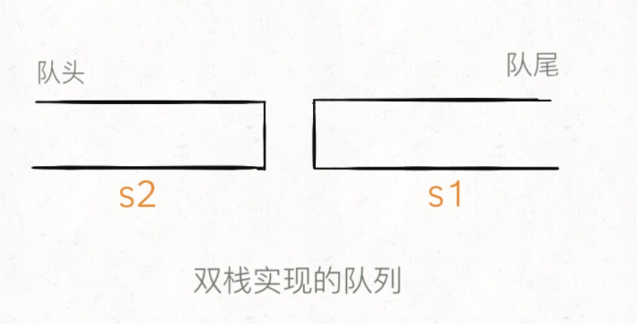

### [232. 用栈实现队列](https://leetcode-cn.com/problems/implement-queue-using-stacks/)

> 实现的API如下：
>
> ```java
> class MyQueue {
>     /** 添加元素到队尾 */
>     public void push(int x);
>     
>     /** 删除队头的元素并返回 */
>     public int pop();
>     
>     /** 返回队头元素 */
>     public int peek();
>     
>     /** 判断队列是否为空 */
>     public boolean empty();
> }
> ```
>
> 首先明确，栈有哪些api：push,pop    队头进，队头出
>
> 思路：用双栈来实现，如图
>
> 
>
> push：永远对s1进行操作，把元素压入 `s1` 即可
>
> peek：永远从s2中出，当 `s2` 为空时，可以把 `s1` 的所有元素取出再添加进 `s2`，**这时候 `s2` 中元素就是先进先出顺序了**。
>
> pop：操作 `s2`，和peek一样，不过要先调用peek，把s1元素推入s2中，保证s2非空
>
> empty：两个栈都为空的话，就说明队列为空
>
> ```js
> var MyQueue = function() {
>        this.s1 = [];
>        this.s2 = [];
> };
> 
> /** 
>  * @param {number} x
>  * @return {void}
>  */
> MyQueue.prototype.push = function(x) {
>     this.s1.push(x);
> };
> 
> /**
>  * @return {number}
>  */
> MyQueue.prototype.pop = function() {
>     // 先调用peek，把s1元素推入s2中，保证s2非空
>     this.peek();
>     return this.s2.pop();
> };
> 
> /**
>  * @return {number}
>  */
> MyQueue.prototype.peek = function() {
>     // s2空时，把s1元素全部压入s2中，s2此时先进先出
>     if (!this.s2.length) {
>         while (this.s1.length) {
>             this.s2.push(this.s1.pop());
>         }
>     }
>     return this.s2[this.s2.length - 1];
> };
> 
> /**
>  * @return {boolean}
>  */
> MyQueue.prototype.empty = function() {
>     return !this.s1.length && !this.s2.length;
> };
> ```

### [225. 用队列实现栈](https://leetcode-cn.com/problems/implement-stack-using-queues/)

> 用队列实现以下操作：
>
> ```java
> class MyStack {
>     
>     /** 添加元素到栈顶 */
>     public void push(int x);
>     
>     /** 删除栈顶的元素并返回 */
>     public int pop();
>     
>     /** 返回栈顶元素 */
>     public int top();
>     
>     /** 判断栈是否为空 */
>     public boolean empty();
> }
> ```
>
> 首先明确，队列的api：push shift    队头进， 队头出
>
> 接下来用一个队列来实现：
>
> push：利用队列的push直接`尾部进`
>
> pop：
>
> ​	把前len-1个每个元素进行这样的操作：利用队列的shift先`头部出`来，然后再用push，`尾部再进`入。
>
> ​	此时`第len个`元素就是咱需要的目标元素，它这个时候在队头，直接`shift`头部出来
>
> top：`利用pop`获得移除的栈顶元素x，将此栈顶元素再给`push进队尾`，然后返回x
>
> empty：判断队列长度
>
> ```js
> var MyStack = function() {
>        this.queue = [];
> };
> 
> /** 
>  * @param {number} x
>  * @return {void}
>  */
> MyStack.prototype.push = function(x) {
>     this.queue.push(x);
> };
> 
> /**
>  * @return {number}
>  */
> MyStack.prototype.pop = function() {
>     let len = this.queue.length;
>     while (len-- > 1) {
>         this.queue.push(this.queue.shift());
>     }
>     return this.queue.shift();
> };
> 
> /**
>  * @return {number}
>  */
> MyStack.prototype.top = function() {
>     let x = this.pop();
>     this.queue.push(x);
>     return x;
> };
> 
> /**
>  * @return {boolean}
>  */
> MyStack.prototype.empty = function() {
>     return !this.queue.length;
> };
> ```

### [20. 有效的括号](https://leetcode.cn/problems/valid-parentheses/)

> [labuladong 题解](https://labuladong.github.io/article/?qno=20)[思路](https://leetcode.cn/problems/valid-parentheses/#)
>
> 给定一个只包括 `'('`，`')'`，`'{'`，`'}'`，`'['`，`']'` 的字符串 `s` ，判断字符串是否有效。
>
> 有效字符串需满足：
>
> 1. 左括号必须用相同类型的右括号闭合。
> 2. 左括号必须以正确的顺序闭合。
>
> **示例 1：**
>
> ```
> 输入：s = "()"
> 输出：true
> ```

> ```js
> var isValid = function(s) {
>        if (s.length % 2 == 1) return false;
>        let stack = [];
>        let map = {
>            '(' : ')',
>            '{' : '}',
>            '[' : ']'
>        }
>        for (let a of s) {
>            if (a == '[' || a == '{' || a == '(') {
>                stack.push(a);
>            } else {
>                if (map[stack[stack.length - 1]] == a) {
>                    stack.pop();
>                } else {
>                    return false;
>                }
>            }
>        }
>        return !stack.length;
> };
> ```

### [1047. 删除字符串中的所有相邻重复项](https://leetcode-cn.com/problems/remove-all-adjacent-duplicates-in-string/)

> 栈方法：
>
> 可以把字符串顺序放到一个栈中：
>
> 放之前判断：如果将要放入的a不等于栈顶元素，放入，否则不仅不放入，还弹出栈顶元素

> ```js
> var removeDuplicates = function(s) {
>        let stack = [];
>        for (let a of s) {
>            if (stack[stack.length - 1] != a) {
>                stack.push(a);
>            } else {
>                stack.pop();
>            }
>        }
>        return stack.join('');
> };
> ```
>
> 力扣官方解法：多了一个length判断
>
> ```js
> var removeDuplicates = function(s) {
>        let stack = [];
>        for (let a of s) {
>            if (stack.length && stack[stack.length - 1] == a) {
>                stack.pop();
>            } else {
>                stack.push(a);
>            }
>        }
>        return stack.join('')
> };
> ```

### [150. 逆波兰表达式求值](https://leetcode.cn/problems/evaluate-reverse-polish-notation/)

> [思路](https://leetcode.cn/problems/evaluate-reverse-polish-notation/#)
>
> 难度中等571
>
> 根据[ 逆波兰表示法](https://baike.baidu.com/item/逆波兰式/128437)，求表达式的值。
>
> 有效的算符包括 `+`、`-`、`*`、`/` 。每个运算对象可以是整数，也可以是另一个逆波兰表达式。
>
> **注意** 两个整数之间的除法只保留整数部分。
>
> 可以保证给定的逆波兰表达式总是有效的。换句话说，表达式总会得出有效数值且不存在除数为 0 的情况。
>
> **示例 1：**
>
> ```
> 输入：tokens = ["2","1","+","3","*"]
> 输出：9
> 解释：该算式转化为常见的中缀算术表达式为：((2 + 1) * 3) = 9
> ```

> 就是求后缀表达式，利用栈来求，王道数据结构里面提及的思路
>
> 写法1：用Map([[key : value], [key : value]])的结构存储运算符对应的函数
>
> 然后在栈中，pop出俩个数字进行计算
>
> ps:注意将字符串转换为数字 
>
> ps: parseInt(b) : 保留整数部分
>
> Math.floor(b) : 向下取整，不一样
>
> ```js
> var evalRPN = function(tokens) {
>     const map = new Map([
>         ['+', (a, b) => a * 1 + b * 1], // 乘法，将字符串转换为数字 
>         ['-', (a, b) => b - a],
>         ['*', (a, b) => b * a],
>         ['/', (a, b) => parseInt(b / a)],
>     ]);
>     let stack = [];
>     for (let ele of tokens) {
>         if (!map.has(ele)) {
>             stack.push(ele);
>         } else {
>             const a = stack.pop();
>             const b = stack.pop();
>             stack.push(map.get(ele)(a, b));
>         }
>     }
>     return stack.pop();
> };
> ```
>
> 方法2，未优化
>
> ```js
> var evalRPN = function(tokens) {
>     let stack = [];
>     for (let a of tokens) {
>         if (a == '+') {
>             stack.push(stack.pop() * 1 + stack.pop() * 1);
>         } else if (a == '-') {
>             stack.push(-stack.pop() * 1 + stack.pop() * 1);
>         } else if (a == '*') {
>             stack.push(stack.pop() * stack.pop());
>         } else if (a == '/') {
>             let a = stack.pop();
>             let b = stack.pop();
>             stack.push(parseInt(b / a));
>         } else {
>             stack.push(a);
>         }
>     }
>     return stack.shift();
> };
> ```
>

### [239. 滑动窗口最大值](https://leetcode.cn/problems/sliding-window-maximum/)

> [labuladong 题解](https://labuladong.github.io/article/?qno=239)[思路](https://leetcode.cn/problems/sliding-window-maximum/#)
>
> 难度困难1754
>
> 给你一个整数数组 `nums`，有一个大小为 `k` 的滑动窗口从数组的最左侧移动到数组的最右侧。你只可以看到在滑动窗口内的 `k` 个数字。滑动窗口每次只向右移动一位。
>
> 返回 *滑动窗口中的最大值* 。
>
>  
>
> **示例 1：**
>
> ```
> 输入：nums = [1,3,-1,-3,5,3,6,7], k = 3
> 输出：[3,3,5,5,6,7]
> 解释：
> 滑动窗口的位置                最大值
> ---------------               -----
> [1  3  -1] -3  5  3  6  7       3
>  1 [3  -1  -3] 5  3  6  7       3
>  1  3 [-1  -3  5] 3  6  7       5
>  1  3  -1 [-3  5  3] 6  7       5
>  1  3  -1  -3 [5  3  6] 7       6
>  1  3  -1  -3  5 [3  6  7]      7
> ```

> https://labuladong.gitee.io/algo/2/22/63/
>
> 思路：用单调队列来保存滑动窗口的值，单调队列永远保持单调递增特性
>
> 单调队列，就是指队列中的元素全都是单调递增（或递减）的。后面还有一个单调栈
>
> 本题单调队列的特性api：
>
> `push(n)`:入队。在队尾添加元素，但是要把前面比自己小的元素都删掉。（本题队头开始，单调递减），如果每个元素被加入时都这样操作，最终单调队列中的元素大小就会保持一个**单调递减**的顺序。
>
> `pop(n)`：出队。队首出队，但是出队时要判断原队首是否在push时被删除了，如果被删除就不用出队了
>
> `max()`：因为push完之后，单调递减，所以要获取单调队列最大值，队首即为最大值。
>
> alsdj

> #### 代码1，借助类实现
>
> ```js
> // 实现单调队列
> function MonotonicQueue() {
>        let queue = [];
>        // 实现push
>        this.push = function(n) {
>            // 队列非空时，将小于n的元素全部删除
>            while (queue.length && queue[queue.length - 1] < n) {
>                queue.pop();
>            } 
>            // 然后将n加入尾部
>            queue.push(n);
>        }
>        // 获取队列最大值，此时必然在队首
>        this.max = function() {
>            return queue[0];
>        }
>        // 删除队头n，n可能在push时被删除了，所以判断一下，没有就不删了
>        this.pop = function(n) {
>            if (n == queue[0]) {
>                queue.shift();
>            }
>        }
> }
> 
> var maxSlidingWindow = function(nums, k) {
>        let window = new MonotonicQueue();
>        let res = [];
>        for (let i = 0; i < nums.length; i++) {
>            if (i < k - 1) {
>                // 先填满窗口的前 k-1 个位置
>                window.push(nums[i]);
>            } else {
>                // 窗口向前滑动:push当前数值
>                window.push(nums[i]);
>                // 将当前窗口最大值push进结果
>                res.push(window.max());
>                // 移出旧数字（窗口最左边值），必须知道这个数字，因为在push时它有阔能被删除了
>                window.pop(nums[i - k + 1]);
>            }
>        }
>        return res;
> };
> ```
>
> ps:这种抽象成一个类的方法在力扣耗时 `6000 ms`，所以笔试时会超时吧。。。
>
> #### 代码2，不抽象类，将api写成表达式
>
> 耗时不变
>
> ```js
> var maxSlidingWindow = function(nums, k) {
>     if (nums.length == 0 || k == 0) return [];
>     let deque = [];
>     let res = new Array(nums.length - k + 1);
>     for (let i = 0; i < k; i++) {
>         // push操作，保证头部元素值最大
>         while (deque.length && nums[i] > deque[deque.length - 1]) {
>             deque.pop();
>         }
>         deque.push(nums[i]);
>     }
>     res[0] = deque[0];
>     // 形成了窗口
>     for (let i = k; i < nums.length; i++) {
>         // shift()出队操作，此时要判断原队头是否被删除
>         if (deque[0] == nums[i - k]) deque.shift();
>         // push入队操作
>         while (deque.length && nums[i] > deque[deque.length - 1]) {
>             deque.pop();
>         }
>         deque.push(nums[i]);
>         // 添加结果进res
>         res[i - k + 1] = deque[0];
>     }
>     return res;
> };
> ```

### [347. 前 K 个高频元素](https://leetcode-cn.com/problems/top-k-frequent-elements/)

> 方法1：时间复杂度o(nlogn)，空间(n)解法（不符合时间复杂度要求）
>
> Map + 各种api
>
> ```js
> var topKFrequent = function(nums, k) {
>     let map = new Map();
>     for (let a of nums) {
>         map.set(a, (map.get(a) || 0) + 1);
>     }
>     let res = [...map].sort((a, b) => b[1] - a[1]).slice(0, k).map(ele => ele[0]);
>     return res;
> };
> ```
>
> 方法2：Map + 小顶堆
>
> 时间复杂度：O(nlogk) 空间复杂度：O(n)
>
> ```js
> 
> ```
>
> 方法3：桶排序