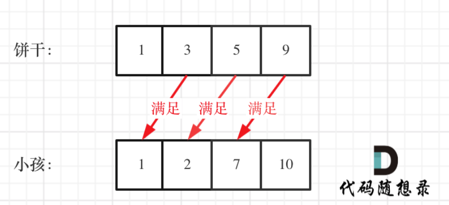
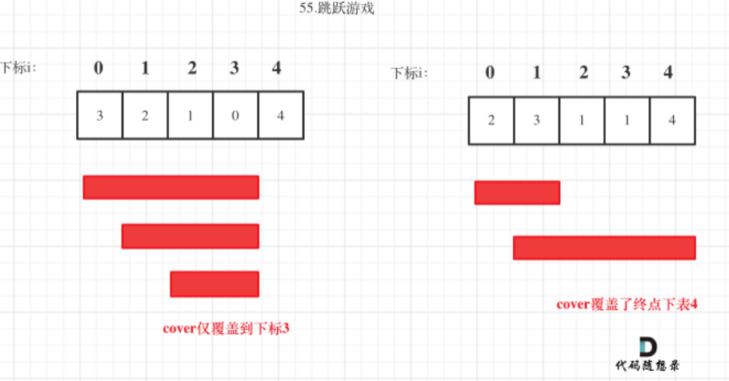
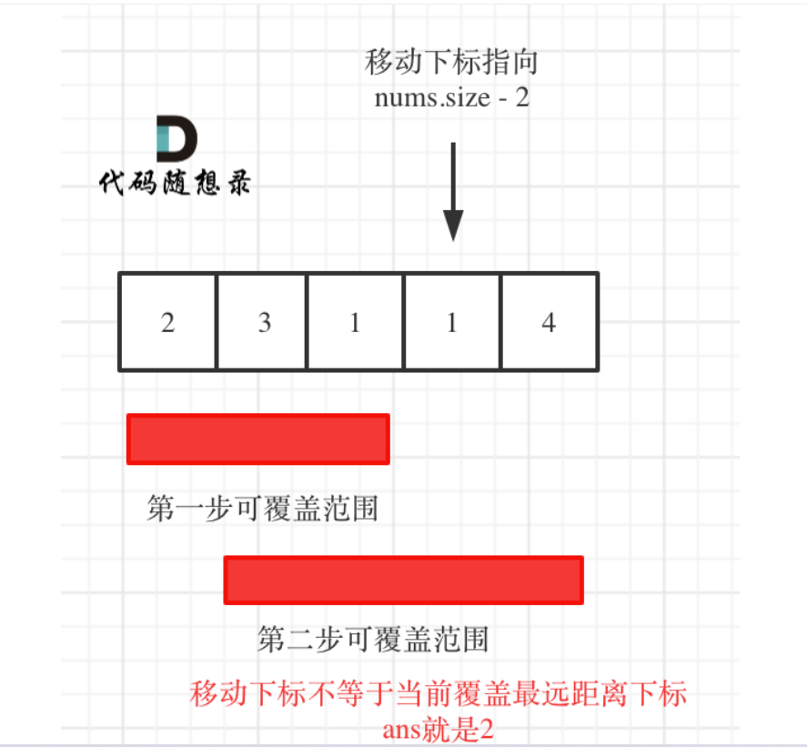
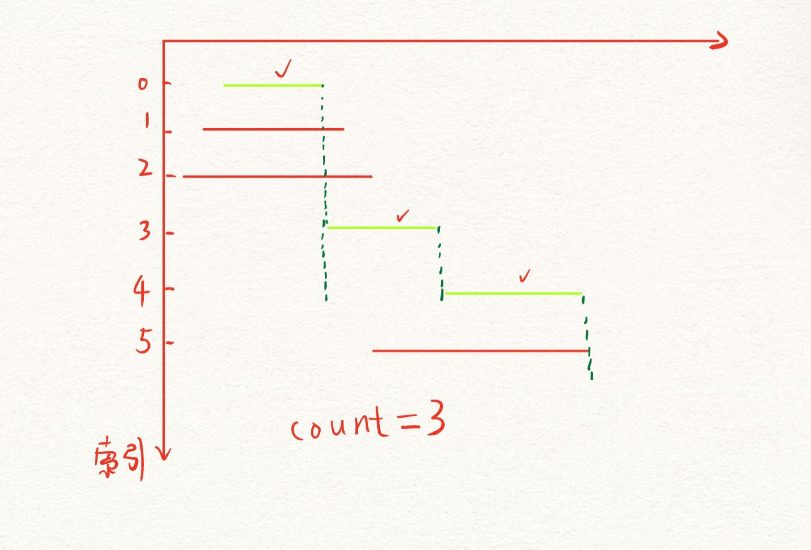
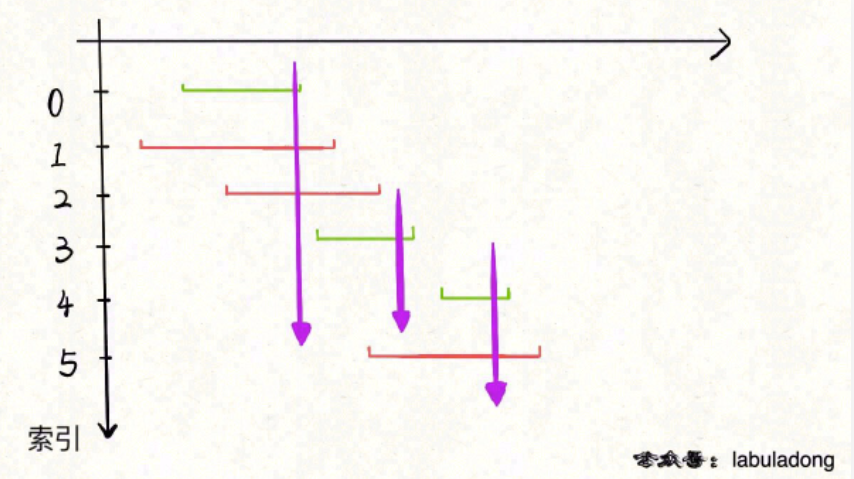
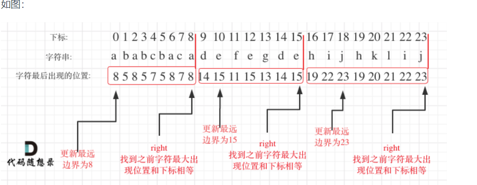
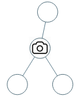

### [455. 分发饼干](https://leetcode-cn.com/problems/assign-cookies/)

> 假设你是一位很棒的家长，想要给你的孩子们一些小饼干。但是，每个孩子最多只能给一块饼干。
>
> 对每个孩子	 `i`，都有一个胃口值 `g[i]`，这是能让孩子们满足胃口的饼干的最小尺寸；并且每块饼干 `j`，都有一个尺寸 `s[j]` 。如果 `s[j] >= g[i]`，我们可以将这个饼干 `j` 分配给孩子 `i` ，这个孩子会得到满足。你的目标是尽可能满足越多数量的孩子，并输出这个最大数值。
>
> **示例 1:**
>
> ```js
> 输入: g = [1,2,3], s = [1,1]
> 输出: 1
> 解释: 
> 你有三个孩子和两块小饼干，3个孩子的胃口值分别是：1,2,3。
> 虽然你有两块小饼干，由于他们的尺寸都是1，你只能让胃口值是1的孩子满足。
> 所以你应该输出1。
> ```

> 思路：
>
> 为了满足更多的小孩，就避免造成饼干尺寸的浪费
>
> 因此让大尺寸饼干优先满足胃口大的孩子
>
> `局部最优`：大饼干喂给胃口大的，充分利用饼干尺寸喂饱一个
>
> `全局最优`：喂饱尽可能多的小孩
>
> 因此：
>
> 可以尝试使用`贪心`策略，先将饼干数组和小孩数组`排序`。
>
> `然后从后向前遍历小孩数组，用大饼干优先满足胃口大的，并统计满足小孩数量。`
>
> 
>
> ```js
> var findContentChildren = function(g, s) {
>  g.sort((a, b) => a - b);
>  s.sort((a, b) => a - b);
>  let index = s.length - 1; // 饼干数组的下标
>  let result = 0;
>  // 对胃口数组开始从尾部遍历
>  for (let i = g.length - 1; i >= 0; i--) {
>      // 保证饼干数组下标>=0 && 当前饼干尺寸大于胃口
>      if (index >= 0 && s[index] >= g[i]) {
>          result++;
>          index--;
>      }
>  }
>  return result;
> };
> ```
>
> 代码2，反过来思考，先小尺寸喂饱小的，大尺寸喂饱大的
>
> ```js
> var findContentChildren = function(g, s) {
>     // 胃口排序
>     g.sort((a, b) => a - b);
>     // 饼干尺寸排序
>     s.sort((a, b) => a - b);
>     let index = 0;
>     let result = 0;
>     // 对饼干尺寸数组从头部遍历
>     for (let i = 0; i < s.length; i++) {
>         if (index < g.length && s[i] >= g[index]) {
>             result++;
>             index++;
>         }
>     }
>     return result;
> };
> ```
>
> 

### [376. 摆动序列](https://leetcode-cn.com/problems/wiggle-subsequence/)

> 如果连续数字之间的差严格地在正数和负数之间交替，则数字序列称为 **摆动序列 。**第一个差（如果存在的话）可能是正数或负数。仅有一个元素或者含两个不等元素的序列也视作摆动序列。
>
> - 例如， `[1, 7, 4, 9, 2, 5]` 是一个 **摆动序列** ，因为差值 `(6, -3, 5, -7, 3)` 是正负交替出现的。
> - 相反，`[1, 4, 7, 2, 5]` 和 `[1, 7, 4, 5, 5]` 不是摆动序列，第一个序列是因为它的前两个差值都是正数，第二个序列是因为它的最后一个差值为零。
>
> **子序列** 可以通过从原始序列中删除一些（也可以不删除）元素来获得，剩下的元素保持其原始顺序。
>
> 给你一个整数数组 `nums` ，返回 `nums` 中作为 **摆动序列** 的 **最长子序列的长度** 。
>
>  
>
> **示例 1：**
>
> ```
> 输入：nums = [1,7,4,9,2,5]
> 输出：6
> 解释：整个序列均为摆动序列，各元素之间的差值为 (6, -3, 5, -7, 3) 。
> ```
>
> #### 思路1，贪心
>
> **局部最优：删除单调坡度上的节点（不包括单调坡度两端的节点），那么这个坡度就可以有两个局部峰值**。
>
> **整体最优：整个序列有最多的局部峰值，从而达到最长摆动序列**。
>
> 局部最优推出全局最优，并举不出反例，那么试试贪心！
>
> （为方便表述，以下说的峰值都是指局部峰值）
>
> **实际操作上，其实连删除的操作都不用做，因为题目要求的是最长摆动子序列的长度，所以只需要统计数组的峰值数量就可以了（相当于是删除单一坡度上的节点，然后统计长度）**
>
> **这就是贪心所贪的地方，让峰值尽可能的保持峰值，然后删除单一坡度上的节点**。
>
> 本题代码实现中，还有一些技巧，例如统计峰值的时候，数组`最左面`和`最右面`是最不好统计的。
>
> 例如序列[2,5]，它的峰值数量是2，如果靠统计差值来计算峰值个数就需要考虑数组最左面和最右面的特殊情况。
>
> 所以可以针对序列[2,5]，可以假设为[2,2,5]，这样它就有坡度了即preDiff = 0，如图：
>
> 
>
> 针对以上情形，`result初始为1`（默认最右面有一个峰值），此时curDiff > 0 && preDiff `<=` 0，那么result++（计算了左面的峰值），最后得到的result就是2（峰值个数为2即摆动序列长度为2）
>
> ```js
> var wiggleMaxLength = function(nums) {
>     if (nums.length <= 1) return nums.length;
>     let curDiff = 0; // 当前一对差值
>     let preDiff = 0; // 前一对差值
>     let result = 1; // 记录峰值个数，默认最右边有个峰值
>     for (let i = 0; i < nums.length; i++) {
>         curDiff = nums[i + 1] - nums[i];
>         // 出现峰值
>         if ((curDiff > 0 && preDiff <= 0) || (preDiff >= 0 && curDiff < 0)) {
>             result++;
>             preDiff = curDiff;
>         }
>     }
>     return result;
> };
> ```
>
> - 时间复杂度：$O(n)$
> - 空间复杂度：$O(1)$
>
> #### 思路2：动态规划
>
> ```js
> 
> ```

### [53. 最大子数组和](https://leetcode-cn.com/problems/maximum-subarray/)

> 给你一个整数数组 `nums` ，请你找出一个具有最大和的连续子数组（子数组最少包含一个元素），返回其最大和。
>
> **子数组** 是数组中的一个连续部分。
>
> **示例 1：**
>
> ```
> 输入：nums = [-2,1,-3,4,-1,2,1,-5,4]
> 输出：6
> 解释：连续子数组 [4,-1,2,1] 的和最大，为 6 。
> ```
>
> #### 贪心解法
>
> `局部最优`：当前“连续和”为负数的时候立刻放弃，从下一个元素重新计算“连续和”，因为负数加上下一个元素 “连续和”只会越来越小。
>
> `全局最优`：选取最大“连续和”
>
> **局部最优的情况下，并记录最大的“连续和”，可以推出全局最优**。
>
> 从代码角度上来讲：遍历nums，从头开始用count累积，如果count一旦加上nums[i]变为负数，那么就应该从nums[i+1]开始从0累积count了，因为已经变为负数的count，只会拖累总和。
>
> **这相当于是暴力解法中的不断调整最大子序和区间的起始位置**。
>
> ```js
> var maxSubArray = function(nums) {
>     let result =  -Infinity;
>     let count = 0;
>     for (let i = 0; i < nums.length; i++) {
>         count += nums[i];
>         if (count > result) { // 取区间累计的最大值（相当于不断确定最大子序终止位置）
>             result = count; 
>         }
>         if (count <= 0) count = 0; // 相当于重置最大子序起始位置，因为遇到负数一定是拉低总和
>     }
>     return result;
> };
> ```
>
> - 时间复杂度：O(n)
> - 空间复杂度：O(1)
>
> #### dp解法
>
> **以 `nums[i]` 为结尾的「最大子数组和」为 `dp[i]`**
>
> ```js
> var maxSubArray = function(nums) {
>     if (nums.length == 0) return 0;
>     let dp = new Array(nums.length).fill(0);
>     dp[0] = nums[0];
>     for (let i = 1; i < nums.length; i++) {
>         dp[i] = Math.max(nums[i], dp[i - 1] + nums[i]);
>     }
>     return Math.max(...dp);
> };
> ```
>
> - 时间复杂度：O(n)
> - 空间复杂度：O(n)

### [122. 买卖股票的最佳时机 II](https://leetcode-cn.com/problems/best-time-to-buy-and-sell-stock-ii/)

> 给定一个数组 `prices` ，其中 `prices[i]` 表示股票第 `i` 天的价格。
>
> 在每一天，你可能会决定购买和/或出售股票。你在任何时候 **最多** 只能持有 **一股** 股票。你也可以购买它，然后在 **同一天** 出售。
> 返回 *你能获得的 **最大** 利润* 。
>
>  
>
> **示例 1:**
>
> ```
> 输入: prices = [7,1,5,3,6,4]
> 输出: 7
> 解释: 在第 2 天（股票价格 = 1）的时候买入，在第 3 天（股票价格 = 5）的时候卖出, 这笔交易所能获得利润 = 5-1 = 4 。
>      随后，在第 4 天（股票价格 = 3）的时候买入，在第 5 天（股票价格 = 6）的时候卖出, 这笔交易所能获得利润 = 6-3 = 3 
> ```
>
> `思路`：
>
> - 只有一只股票！
> - 当前只有买股票或者买股票的操作
>
> 想获得利润至少要两天为一个交易单元。
>
> **把利润分解为每天为单位的维度，而不是从0天到第3天整体去考虑！**
>
> 我们需要收集每天的正利润就可以，**收集正利润的区间，就是股票买卖的区间，而我们只需要关注最终利润，不需要记录区间**。
>
> 那么只收集正利润就是贪心所贪的地方！
>
> **`局部最优`：收集每天的正利润，**就是说，如果我卖出去亏损了（<0）那我就选择不卖，收入为0，否则卖出去赚钱
>
> **`全局最优`：求得最大利润**。
>
> ```js
> var maxProfit = function(prices) {
>     let result = 0;
>     for (let i = 1; i < prices.length; i++) {
>         result += Math.max(0, prices[i] - prices[i - 1])
>     }
>     return result;
> };
> ```
>

### [714. 买卖股票的最佳时机含手续费](https://leetcode-cn.com/problems/best-time-to-buy-and-sell-stock-with-transaction-fee/)(贪心不好想)

> [labuladong 题解](https://labuladong.github.io/article/?qno=714)[思路](https://leetcode-cn.com/problems/best-time-to-buy-and-sell-stock-with-transaction-fee/#)
>
> 给定一个整数数组 `prices`，其中 `prices[i]`表示第 `i` 天的股票价格 ；整数 `fee` 代表了交易股票的手续费用。
>
> 你可以无限次地完成交易，但是你每笔交易都需要付手续费。如果你已经购买了一个股票，在卖出它之前你就不能再继续购买股票了。
>
> 返回获得利润的最大值。
>
> **注意：**这里的一笔交易指买入持有并卖出股票的整个过程，每笔交易你只需要为支付一次手续费。
>
>  
>
> **示例 1：**
>
> ```
> 输入：prices = [1, 3, 2, 8, 4, 9], fee = 2
> 输出：8
> 解释：能够达到的最大利润:  
> 在此处买入 prices[0] = 1
> 在此处卖出 prices[3] = 8
> 在此处买入 prices[4] = 4
> 在此处卖出 prices[5] = 9
> 总利润: ((8 - 1) - 2) + ((9 - 4) - 2) = 8
> ```
>
> > 如果使用贪心策略，就是最低值买，最高值（如果算上手续费还盈利）就卖。
> >
> > 此时无非就是要找到两个点，买入日期，和卖出日期。
> >
> > - 买入日期：其实很好想，遇到更低点就记录一下。
> > - 卖出日期：这个就不好算了，但也没有必要算出准确的卖出日期，只要当前价格大于（最低价格+手续费），就可以收获利润，至于准确的卖出日期，就是连续收获利润区间里的最后一天（并不需要计算是具体哪一天）。
> >
> > 所以我们在做收获利润操作的时候其实有三种情况：
> >
> > - 情况一：收获利润的这一天并不是收获利润区间里的最后一天（不是真正的卖出，相当于持有股票），所以后面要继续收获利润。
> > - 情况二：前一天是收获利润区间里的最后一天（相当于真正的卖出了），今天要重新记录最小价格了。
> > - 情况三：不作操作，保持原有状态（买入，卖出，不买不卖）
> > - 对情况一的操作，因为如果还在收获利润的区间里，表示并不是真正的卖出，而计算利润每次都要减去手续费，**所以要让minPrice = prices[i] - fee;，这样在明天收获利润的时候，才不会多减一次手续费！**
>
> ```js
> var maxProfit = function(prices, fee) {
>     // 总收入
>     let result = 0;
>     let minPrice = prices[0];
>     for (let i = 1; i < prices.length; i++) {
>         // 情况一，记录此次收获的利润，因为可能有多次利润计算，此时先不卖，更新一下result和minPrice
>         if (prices[i] > minPrice + fee) {
>             result += prices[i] - minPrice - fee;
>             // 计算利润要减去fee
>             minPrice = prices[i] - fee;
>         }
>         // 情况二，前一天到达收获利润的最后一天（已卖出），今天重新记录最小价格,result本次停止更新
>         if (prices[i] < minPrice) {
>             minPrice = prices[i];
>         }
>         // 情况三，保持原有状态（此时买则不便宜，卖则亏本），代码可省略
>         if (prices[i] >= minPrice && prices[i] <= minPrice + fee) {
>             continue;
>         }
>     }
>     return result;
> };
> ```
>
> - 时间复杂度：O(n)
> - 空间复杂度：O(1)

### [55. 跳跃游戏](https://leetcode-cn.com/problems/jump-game/)

> 给定一个非负整数数组 `nums` ，你最初位于数组的 **第一个下标** 。
>
> 数组中的每个元素代表你在该位置可以跳跃的最大长度。
>
> 判断你是否能够到达最后一个下标。
>
>  
>
> **示例 1：**
>
> ```
> 输入：nums = [2,3,1,1,4]
> 输出：true
> 解释：可以先跳 1 步，从下标 0 到达下标 1, 然后再从下标 1 跳 3 步到达最后一个下标。
> ```
>
> 思路：
>
> * 容易陷入的误区是，如果当前元素是3，究竟该跳几步，而问题的关键是在于可跳的覆盖范围
> * 每一步的最大跳跃步数，就是可以跳跃的覆盖范围
> * 问题转换：跳跃范围是否可以覆盖到终点
>
> 1. 每次取最大跳跃步数
> 2. 每移动一个单位，更新最大覆盖范围
> 3. 直到最大覆盖范围可以到达数组尾部，全部覆盖
>
> `局部最优解`：每次取最大跳跃步数
>
> `整体最优解`：得到整体最大覆盖范围，判断是否能到达终点

> 示意图：
>
> 
>
> 每次移动只能在cover的范围内移动，每移动一个元素，cover得到该元素数值（新的覆盖范围）的补充，让i继续移动下去。
>
> 而cover每次只取 max(该元素数值补充后的范围, cover本身范围)。	
>
> 如果cover大于等于了终点下标，直接return true就可以了。
>
> **注意代码：`for循环判断条件是小于等于cover，因为i遍历的是覆盖范围之内的数组`**
>
> ```js
> var canJump = function(nums) {
>     let cover = 0;
>     if (nums.length == 1) return true; // 只有一个元素，肯定覆盖
>     for (let i = 0; i <= cover; i++) { // 判断条件是小于等于cover，因为i遍历的是覆盖范围之内的数组
>         cover = Math.max(i + nums[i], cover);
>         if (cover >= nums.length - 1) return true; // 此时可以覆盖到终点，注意这里判断条件是len-1,因为要去掉自己本身长度
>     }
>     return false;
> };
> ```

### [45. 跳跃游戏 II](https://leetcode-cn.com/problems/jump-game-ii/)

> 给你一个非负整数数组 `nums` ，你最初位于数组的第一个位置。
>
> 数组中的每个元素代表你在该位置可以跳跃的最大长度。
>
> 你的目标是使用最少的跳跃次数到达数组的最后一个位置。
>
> 假设你总是可以到达数组的最后一个位置。
>
> **示例 1:**
>
> ```js
>输入: nums = [2,3,1,1,4]
> 输出: 2
> 解释: 跳到最后一个位置的最小跳跃数是 2。
>   从下标为 0 跳到下标为 1 的位置，跳 1 步，然后跳 3 步到达数组的最后一个位置。
> ```

> 
>
> 局部最优：当前可移动距离尽可能多走，如果还没到终点，步数再加一。
>
> 整体最优：一步尽可能多走，从而达到最小步数。
>
> **从覆盖范围出发，不管怎么跳，覆盖范围内一定是可以跳到的，以最小的步数增加覆盖范围，覆盖范围一旦覆盖了终点，得到的就是最小步数**
>
> **这里需要统计两个覆盖范围，当前这一步的最大覆盖和下一步最大覆盖**。
>
> 如果移动下标达到了当前这一步的最大覆盖最远距离了，还没有到终点的话，那么就必须再走一步来增加覆盖范围，直到覆盖范围覆盖了终点。
>
> 以下代码一个关键点在于len-1这个值的选取，详见代码随想录
>
> ```js
> var jump = function(nums) {
>  let curDistance = 0;    // 当前覆盖的最远距离下标
>  let jumps = 0;          // 记录走的最大步数
>  let nextDistance = 0;   // 下一步覆盖的最远距离下标
>  for (let i = 0; i < nums.length - 1; i++) {     // 小于len-1，关键所在
>      nextDistance = Math.max(nums[i] + i, nextDistance);    // 更新下一步覆盖的最远距离下标
>      if (i === curDistance) {                               // 遇到当前覆盖的最远距离下标
>          curDistance = nextDistance;                        // 更新当前覆盖的最远距离下标 
>          jumps++;
>      }
>  }
>  return jumps;
> };
> ```

### [1005. K 次取反后最大化的数组和](https://leetcode-cn.com/problems/maximize-sum-of-array-after-k-negations/)

> 难度简单236
>
> 给你一个整数数组 `nums` 和一个整数 `k` ，按以下方法修改该数组：
>
> - 选择某个下标 `i` 并将 `nums[i]` 替换为 `-nums[i]` 。
>
> 重复这个过程恰好 `k` 次。可以多次选择同一个下标 `i` 。
>
> 以这种方式修改数组后，返回数组 **可能的最大和** 。

> 思路：根据k值是否用完，进行两次贪心
>
> `局部最优：`让绝对值大的负数变为正数，当前数值达到最大，
>
> `整体最优：`整个数组和达到最大。
>
> 但有个瑕疵：如果将负数都转变为正数了，K依然大于0，此时的问题是一个有序正整数序列，如何转变K次正负，让 数组和 达到最大。
>
> 又是一个贪心：
>
> `局部最优：`只找数值最小的正整数进行反转，当前数值可以达到最大（例如正整数数组{5, 3, 1}，反转1 得到-1 比 反转5得到的-5 大多了），
>
> `全局最优：`整个 数组和 达到最大。
>
> - 第一步：将数组`按照绝对值大小从大到小`排序，**注意要按照绝对值的大小**
> - 第二步：从前向后遍历，遇到负数将其变为正数，同时K--（因为排序按照绝对值从大到小排序，所以从前往后遍历可以首先改变最小的负数）
> - 第三步：如果K还大于0，那么反复转变数值最小的元素，将K用完
> - 第四步：求和

> ```js
> var largestSumAfterKNegations = function(nums, k) {
>     // step1:将数组按照绝对值大小从大到小排序
>     nums.sort((a, b) => Math.abs(b) - Math.abs(a));
>     // step2:从前往后遍历，遇到负数且k>0,就将其变为正数，同时k--
>     for (let i = 0; i < nums.length; i++) {
>         if (nums[i] < 0 && k > 0) {
>             nums[i] *= -1;
>             k--;
>         }
>     }
>     // step3:如果k还大于0， 反复转变数值最小的元素，将k用完
>     // ps:k若为偶数的话，反复用完就相当于元素未变，所以只用判断k为奇数的情况
>     if (k > 0 && k % 2 == 1) {
>         nums[nums.length - 1] *= -1;
>     }
>     // step4:求和
>     let result = nums.reduce((a, b) => a + b, 0);
>     return result;
> };
> ```
>

### [134. 加油站](https://leetcode-cn.com/problems/gas-station/)

> [labuladong 题解](https://labuladong.github.io/article/?qno=134)[思路](https://leetcode-cn.com/problems/gas-station/#)
>
> 难度中等893
>
> 在一条环路上有 `n` 个加油站，其中第 `i` 个加油站有汽油 `gas[i]` 升。
>
> 你有一辆油箱容量无限的的汽车，从第 `i` 个加油站开往第 `i+1` 个加油站需要消耗汽油 `cost[i]` 升。你从其中的一个加油站出发，开始时油箱为空。
>
> 给定两个整数数组 `gas` 和 `cost` ，如果你可以绕环路行驶一周，则返回出发时加油站的编号，否则返回 `-1` 。如果存在解，则 **保证** 它是 **唯一** 的。
>
>  
>
> **示例 1:**
>
> ```json
> 输入: gas = [1,2,3,4,5], cost = [3,4,5,1,2]
> 输出: 3
> 解释:
> 从 3 号加油站(索引为 3 处)出发，可获得 4 升汽油。此时油箱有 = 0 + 4 = 4 升汽油
> 开往 4 号加油站，此时油箱有 4 - 1 + 5 = 8 升汽油
> 开往 0 号加油站，此时油箱有 8 - 2 + 1 = 7 升汽油
> 开往 1 号加油站，此时油箱有 7 - 3 + 2 = 6 升汽油
> 开往 2 号加油站，此时油箱有 6 - 4 + 3 = 5 升汽油
> 开往 3 号加油站，你需要消耗 5 升汽油，正好足够你返回到 3 号加油站。
> 因此，3 可为起始索引。
> ```

> #### 1，暴力解法
>
> 暴力的方法很明显就是$O(n^2)$的，遍历每一个加油站为起点的情况，模拟一圈。
>
> 如果跑了一圈，中途没有断油，而且最后油量大于等于0，说明这个起点是ok的。暴
>
> 力的方法思路比较简单，但代码写起来也不是很容易，关键是要模拟跑一圈的过程。
>
> ```js
> var canCompleteCircuit = function(gas, cost) {
>     for (let i = 0; i < cost.length; i++) {
>         let rest = gas[i] - cost[i]; // 记录剩余油量
>         let index = (i + 1) % cost.length;  // 记录索引值
>         while (rest > 0 && index != i) {  // 模拟以i为起点行驶一圈，判断条件是油量够且为达一圈，一定大于0，不然超时
>             rest += gas[index] - cost[index];    // 每走一个点，rest更新
>             index = (index + 1) % cost.length;   // 每走一个点，index更新
>         }
>         // 单轮循环后判断你是否走了一圈
>         // 如果以i为起点跑一圈，剩余油量>=0,返回该起始位置
>         if (rest >= 0 && i == index) {     
>             return i;
>         }
>     }
>     return -1;
> };
> ```
>
> #### 2，贪心
>
> **局部最优：当前累加rest[j]的和curSum一旦小于0，起始位置至少要是j+1，因为从j开始一定不行。**
>
> **全局最优：找到可以跑一圈的起始位置**。
>
> 先如果总油量减去总消耗大于等于零那么一定可以跑完一圈，而且说明 各个站点的加油站 剩油量rest[i]相加一定是大于等于零的。
>
> 接下来讨论一定可以跑完一圈的情况（跑不完一圈容易判断，rest的累加值小于0）
>
> i从0开始累加rest[i]，和记为curSum，
>
> 一旦curSum小于零，说明[0, i]区间都不能作为起始位置，起始位置从i+1算起，再从0计算curSum。
>
> #### `疑问：为什么从j+1开始就可以？`
>
> ```js
> var canCompleteCircuit = function(gas, cost) {
>     let curSum = 0;
>     let totalSum = 0;
>     let start = 0;
>     for (let i = 0; i < gas.length; i++) {
>         curSum += gas[i] - cost[i];
>         totalSum += gas[i] - cost[i];
>         if (curSum < 0) {  // 当前累加rest[i]和cursum一旦小于0
>             start = i + 1;      // 起始位置更新为i+1
>             curSum = 0;         // curSum从0开始
>         }
>     }
>     if (totalSum < 0) return -1;   // 不可能跑一圈
>     return start;
> };
> ```

### [135. 分发糖果](https://leetcode-cn.com/problems/candy/)

> 难度困难821
>
> `n` 个孩子站成一排。给你一个整数数组 `ratings` 表示每个孩子的评分。
>
> 你需要按照以下要求，给这些孩子分发糖果：
>
> - 每个孩子至少分配到 `1` 个糖果。
> - 相邻两个孩子评分更高的孩子会获得更多的糖果。
>
> 请你给每个孩子分发糖果，计算并返回需要准备的 **最少糖果数目** 。
>
>  
>
> **示例 1：**
>
> ```
> 输入：ratings = [1,0,2]
> 输出：5
> 解释：你可以分别给第一个、第二个、第三个孩子分发 2、1、2 颗糖果。
> ```

> 两次贪心，分别对当前值左边和右边的值进行比较和取值
>
> 思路：
>
> * 先确定右边评分大于左边的情况（也就是从前向后遍历）
>
>   此时`局部最优`：只要右边评分比左边大，右边的孩子就多一个糖果，
>
>   `全局最优`：相邻的孩子中，评分高的`右孩子`获得`比左边孩子`更多的糖果
>
>   如果ratings[i] > ratings[i - 1] 那么[i]的糖 一定要比[i - 1]的糖多一个，所以贪心：candyVec[i] = candyVec[i - 1] + 1
>
> * 再确定左孩子大于右孩子的情况（从后向前遍历）
>
>   ps:因为如果从前向后遍历，根据 ratings[i + 1] 来确定 ratings[i] 对应的糖果，那么每次都不能利用上前一次的比较结果了。
>
>   **所以确定左孩子大于右孩子的情况一定要从后向前遍历！**
>
>   `局部最优`：取candyVec[i + 1] + 1 和 candyVec[i] 最大的糖果数量，保证第i个小孩的糖果数量即大于左边的也大于右边的。
>
>   全局最优：相邻的孩子中，评分高的孩子获得更多的糖果。
>
>   取candyVec[i + 1] + 1 和 candyVec[i] 最大的糖果数量，**candyVec[i]只有取最大的才能既保持对左边candyVec[i - 1]的糖果多，也比右边candyVec[i + 1]的糖果多**。

> ```js
> var candy = function(ratings) {
>     let candyArr = new Array(ratings.length).fill(1);
>     let len = ratings.length;
>     // 贪心1，先确定右边评分大于左边的情况：前往后遍历，右大的话就用左的+1
>     for (let i = 1; i < len; i++) {
>         if (ratings[i] > ratings[i - 1]) {
>             candyArr[i] = candyArr[i - 1] + 1;
>         }
>     }
>     // 贪心2，确定左边评分大于右边的
>     // 此时要从后往前遍历（要利用贪心1的结果:candyArr[i]，等一下取值也要比较它）
>     // 左边如果大于右边，左边值:max(candyArr[i], candyArr[i + 1] + 1)
>     for (let i = len - 2; i >= 0; i--) {
>         if (ratings[i] > ratings[i + 1]) {
>             candyArr[i] = Math.max(candyArr[i], candyArr[i + 1] + 1);
>         }
>     }
>     let minCandy = candyArr.reduce((a, b) => a + b, 0);
>     return minCandy;
> };
> ```

### [406. 根据身高重建队列](https://leetcode-cn.com/problems/queue-reconstruction-by-height/)

> 难度中等1213
>
> 假设有打乱顺序的一群人站成一个队列，数组 `people` 表示队列中一些人的属性（不一定按顺序）。每个 `people[i] = [hi, ki]` 表示第 `i` 个人的身高为 `hi` ，前面 **正好** 有 `ki` 个身高大于或等于 `hi` 的人。
>
> 请你重新构造并返回输入数组 `people` 所表示的队列。返回的队列应该格式化为数组 `queue` ，其中 `queue[j] = [hj, kj]` 是队列中第 `j` 个人的属性（`queue[0]` 是排在队列前面的人）。
>
> **示例 1：**
>
> ```js
> 输入：people = [[7,0],[4,4],[7,1],[5,0],[6,1],[5,2]]
> 输出：[[5,0],[7,0],[5,2],[6,1],[4,4],[7,1]]
> 解释：
> 编号为 0 的人身高为 5 ，没有身高更高或者相同的人排在他前面。
> 编号为 1 的人身高为 7 ，没有身高更高或者相同的人排在他前面。
> 编号为 2 的人身高为 5 ，有 2 个身高更高或者相同的人排在他前面，即编号为 0 和 1 的人。
> 编号为 3 的人身高为 6 ，有 1 个身高更高或者相同的人排在他前面，即编号为 1 的人。
> 编号为 4 的人身高为 4 ，有 4 个身高更高或者相同的人排在他前面，即编号为 0、1、2、3 的人。
> 编号为 5 的人身高为 7 ，有 1 个身高更高或者相同的人排在他前面，即编号为 1 的人。
> 因此 [[5,0],[7,0],[5,2],[6,1],[4,4],[7,1]] 是重新构造后的队列。
> ```
>
> 思路：和分发糖果类似，两个维度要分开考虑。先确定一个维度，再考虑另外一个维度。
>
> 那么按照身高h来排序呢，身高一定是从大到小排（身高相同的话则k小的站前面），让高个子在前面。
>
> **此时我们可以确定一个维度了，就是身高，前面的节点一定都比本节点高！**
>
> 那么只需要`按照k为下标重新插入队列`就可以了
>
> 因为：按照身高排序之后，优先按身高高的people的k来插入，后序插入节点也不会影响前面已经插入的节点，最终按照k的规则完成了队列。
>
> 所以在按照身高从大到小排序后：
>
> **`局部最优`：优先按身高高的people的k来插入。插入操作过后的people满足队列属性**
>
> **`全局最优`：最后都做完插入操作，整个队列满足题目队列属性**	
>
> 注意！！！排好序后按照k为下标从前往后遍历插入一个新数组
>
> 用到`splice`:**`splice()`方法用于删除原数组的一部分成员，并可以在删除的位置添加新的数组成员，返回值是被删除的元素。注意，该方法会改变原数组。**
>
> 如果只是单纯地插入元素，`splice`方法的第二个参数可以设为`0`。
>
> 例如在a第1个索引下标插入2
>
> ```js
> var a = [1, 1, 1];
> a.splice(1, 0, 2) // []
> a // [1, 2, 1, 1]
> ```
>
> ```js
> var reconstructQueue = function(people) {
>     // [[h, k]]按照身高大到小排序，h相同的话按照k由小到大排序
>     people.sort((a, b) => {
>         if (a[0] != b[0]) {
>             return b[0] - a[0];
>         } else {
>             return a[1] -  b[1];
>         }
>     })
>     let queue = [];
>     // 从前往后以k为索引插入新数组
>     for (let i = 0; i < people.length; i++) {
>         queue.splice(people[i][1], 0, people[i]);
>     }
>     return queue;
> };
> ```
>
> 

### [860. 柠檬水找零](https://leetcode-cn.com/problems/lemonade-change/)

> 难度简单303
>
> 在柠檬水摊上，每一杯柠檬水的售价为 `5` 美元。顾客排队购买你的产品，（按账单 `bills` 支付的顺序）一次购买一杯。
>
> 每位顾客只买一杯柠檬水，然后向你付 `5` 美元、`10` 美元或 `20` 美元。你必须给每个顾客正确找零，也就是说净交易是每位顾客向你支付 `5` 美元。
>
> 注意，一开始你手头没有任何零钱。
>
> 给你一个整数数组 `bills` ，其中 `bills[i]` 是第 `i` 位顾客付的账。如果你能给每位顾客正确找零，返回 `true` ，否则返回 `false` 。
>
>  
>
> **示例 1：**
>
> ```js
> 输入：bills = [5,5,5,10,20]
> 输出：true
> 解释：
> 前 3 位顾客那里，我们按顺序收取 3 张 5 美元的钞票。
> 第 4 位顾客那里，我们收取一张 10 美元的钞票，并返还 5 美元。
> 第 5 位顾客那里，我们找还一张 10 美元的钞票和一张 5 美元的钞票。
> 由于所有客户都得到了正确的找零，所以我们输出 true。
> ```

> 模拟题，套路很固定，依次对每个元素进行判断，对手中的5,10进行++，--操作就可以了
>
> - 情况一：账单是5，直接收下。
> - 情况二：账单是10，消耗一个5，增加一个10
> - 情况三：账单是20，优先消耗一个10和一个5，如果不够，再消耗三个5
>
> **因为美元10只能给账单20找零，而美元5可以给账单10和账单20找零，美元5更万能！**
>
> 所以局部最优：遇到账单20，优先消耗美元10，完成本次找零。全局最优：完成全部账单的找零。

> ```js
> var lemonadeChange = function(bills) {
>     let five = 0, ten = 0, twenty = 0; // twenty其实不用记录，不可能用它找零
>     for (let bill of bills) {
>         // 情况一，客户给5美元
>         if (bill == 5) {
>             five++;
>         }
>         // 情况二，客户给10美元
>         if (bill == 10) {
>             if (five <= 0) {
>                 return false;
>             } else {
>                 five--;
>                 ten++;
>             }
>         }
>         // 情况三，客户给20美元
>         if (bill == 20) {
>             // 优先消耗10美元，因为5美元用处大一些
>             if (five > 0 && ten > 0) {
>                 five--;
>                 ten--;
>                 twenty++; // 20其实没必要记录
>             } else if (five >= 3) {
>                 five -= 3;
>                 twenty++;
>             } else {
>                 return false;
>             }
>         }
>     }
>     return true;
> };
> ```

### [435. 无重叠区间](https://leetcode-cn.com/problems/non-overlapping-intervals/)-区间调度

> [labuladong 题解](https://labuladong.github.io/article/?qno=435)[思路](https://leetcode-cn.com/problems/non-overlapping-intervals/#)
>
> 难度中等665
>
> 给定一个区间的集合 `intervals` ，其中 `intervals[i] = [starti, endi]` 。返回 *需要移除区间的最小数量，使剩余区间互不重叠* 。
>
> **示例 1:**
>
> ```js
> 输入: intervals = [[1,2],[2,3],[3,4],[1,3]]
> 输出: 1
> 解释: 移除 [1,3] 后，剩下的区间没有重叠。
> ```

> 贪心思路很重要：
>
> 我们先来求出这些区间中`最多有几个互不相交的区间（count）`，然后用len减去count，就得到答案：
>
> 1、从区间集合 `intvs` 中选择一个区间 `x`，这个 `x` 是在当前所有区间中**结束最早的**（`end` 最小，所以可以进行排序）。
>
> 2、把所有与 `x` 区间相交的区间从区间集合 `intvs` 中删除。
>
> 3、重复步骤 1 和 2，直到 `intvs` 为空为止。之前选出的那些 `x` 就是最大不相交子集。
>
> 把这个思路实现成算法的话，可以按每个区间的 `end` 数值升序排序，因为这样处理之后实现步骤 1 和步骤 2 都方便很多
>
> 
>
> **由于我们事先排了序**，不难发现所有与 `x` 相交的区间必然会与 `x` 的 `end` 相交；如果一个区间不想与 `x` 的 `end` 相交，它的 `start` 必须要大于（或等于）`x` 的 `end`
>
> ```js
> var eraseOverlapIntervals = function(intervals) {
>     if (intervals.length == 0) return 0;
>     // 按end升序排序
>     intervals.sort((a, b) => a[1] - b[1]);
>     // count记录算出这些区间中最多有几个互不相交的区间。初始为1代表至少有一个区间不相交
>     let count = 1;
>     // 排序后，第一个区间就是 x
>     let xEnd = intervals[0][1];
>     for (let inter of intervals) {
>         // 当前元素的起始位置
>         let start = inter[0];
>         // 当前起始大于上一个起始：找到不重和的
>         if (start >= xEnd) {
>             // 找到下一个选择的区间了
>             count++;
>             xEnd = inter[1];
>         }
>     }
>     return intervals.length - count;
> };
> ```

### [452. 用最少数量的箭引爆气球](https://leetcode-cn.com/problems/minimum-number-of-arrows-to-burst-balloons/)

> [labuladong 题解](https://labuladong.github.io/article/?qno=452)[思路](https://leetcode-cn.com/problems/minimum-number-of-arrows-to-burst-balloons/#)
>
> 难度中等564
>
> 有一些球形气球贴在一堵用 XY 平面表示的墙面上。墙面上的气球记录在整数数组 `points` ，其中`points[i] = [xstart, xend]` 表示水平直径在 `xstart` 和 `xend`之间的气球。你不知道气球的确切 y 坐标。
>
> 一支弓箭可以沿着 x 轴从不同点 **完全垂直** 地射出。在坐标 `x` 处射出一支箭，若有一个气球的直径的开始和结束坐标为 `x``start`，`x``end`， 且满足  `xstart ≤ x ≤ x``end`，则该气球会被 **引爆** 。可以射出的弓箭的数量 **没有限制** 。 弓箭一旦被射出之后，可以无限地前进。
>
> 给你一个数组 `points` ，*返回引爆所有气球所必须射出的 **最小** 弓箭数* 。
>
> **示例 1：**
>
> ```js
> 输入：points = [[10,16],[2,8],[1,6],[7,12]]
> 输出：2
> 解释：气球可以用2支箭来爆破:
> -在x = 6处射出箭，击破气球[2,8]和[1,6]。
> -在x = 11处发射箭，击破气球[10,16]和[7,12]。
> ```
>
> 思路：
>
> #### `这个问题和区间调度算法几乎一模一样！如果最多有 `n` 个不重叠的区间，那么就至少需要 `n` 个箭头穿透所有区间`：
>
> `只有一点不一样`：箭头如果碰到气球的边界气球也会爆炸，所以说相当于`区间的边界触碰也算重叠`：
>
> 所以将上题的 `>=` 改成 `>` 就OK了。
>
> 

> ```js
> var findMinArrowShots = function(points) {
>     // 按照尾部end的值升序排列
>     points.sort((a, b) => a[1] - b[1]);
>     // 计数，一开始最少一个
>     let count = 1;
>     // 尾部的初始值
>     let xEnd = points[0][1];
>     for (let arr of points) {
>         let start = arr[0];
>         // 如果下一个start>上一个的end，则没有重复，必须再用一只箭
>         if (start > xEnd) {
>             count++;
>             xEnd = arr[1];
>         }
>     }
>     return count;
> };
> ```
>
> ps:其实一开始思考比较繁杂缭乱，但是定位到最多不重复的区间，就比较明显清晰了

### [763. 划分字母区间](https://leetcode-cn.com/problems/partition-labels/)

> 难度中等711
>
> 字符串 `S` 由小写字母组成。我们要把这个字符串划分为尽可能多的片段，同一字母最多出现在一个片段中。返回一个表示每个字符串片段的长度的列表。
>
> **示例：**
>
> ```js
> 输入：S = "ababcbacadefegdehijhklij"
> 输出：[9,7,8]
> 解释：
> 划分结果为 "ababcbaca", "defegde", "hijhklij"。
> 每个字母最多出现在一个片段中。
> 像 "ababcbacadefegde", "hijhklij" 的划分是错误的，因为划分的片段数较少。
> ```
>
> 在遍历的过程中相当于是要找每一个字母的边界，**如果找到之前遍历过的所有字母的最远边界，说明这个边界就是分割点了**。此时前面出现过所有字母，最远也就到这个边界了。
>
> 可以分为如下两步：
>
> - 统计每一个字符最后出现的位置
> - 从头遍历字符，并更新字符的最远出现下标，如果找到`字符最远出现位置`下标和当前下标相等了，则找到了分割点
>
> 
>
> ```js
> var partitionLabels = function(s) {
>     let hash = {};
>     // 统计每一个字符最后出现的位置
>     for (let i = 0; i < s.length; i++) {
>         hash[s[i]] = i;
>     }
>     let result = [];
>     let left = 0;							// 左边界
>     let right = 0;							// 右边界，记录字符出现的最远边界
>     for (let i = 0; i < s.length; i++) {
>         right = Math.max(right, hash[s[i]]); // 更新字符出现的最远边界
>         if (right == i) {                    // 如果最远出现位置和当前下标相等，找到了分割点
>             result.push(right - left + 1);
>             left = i + 1;                   // 保存一个区间后，更新左边界
>         }
>     }
>     return result;
> };
> ```

### [56. 合并区间](https://leetcode-cn.com/problems/merge-intervals/)

> [labuladong 题解](https://labuladong.github.io/article/?qno=56)[思路](https://leetcode-cn.com/problems/merge-intervals/#)
>
> 难度中等1433
>
> 以数组 `intervals` 表示若干个区间的集合，其中单个区间为 `intervals[i] = [starti, endi]` 。请你合并所有重叠的区间，并返回 *一个不重叠的区间数组，该数组需恰好覆盖输入中的所有区间* 。
>
> 
>
>  **示例 1：**
>
> ```js
>输入：intervals = [[1,3],[2,6],[8,10],[15,18]]
> 输出：[[1,6],[8,10],[15,18]]
> 解释：区间 [1,3] 和 [2,6] 重叠, 将它们合并为 [1,6].
> ```
> 
> 参考：https://leetcode-cn.com/problems/merge-intervals/solution/qiu-qu-jian-wen-ti-de-tao-lu-du-shi-xian-3meb/
>
> 按照左边界排序，排序之后
>
> 局部最优：每次合并都取最大的右边界，这样就可以合并更多的区间了，
>
> 整体最优：合并所有重叠的区间。
>
> 1. 按照左边界将intervals排序
>2. 先将排好序的intervals[0]入队到result
> 3. 从i=1开始遍历：
>    1. 比较[x1,y1] [x2, y2]， 如果y1<x2则说明这两个区间不相交，push进去
>    2. 否则相交，更新当前区间右边界
> 
> ```js
>var merge = function(intervals) {
>     // 先按照区间的start升序排序
>     intervals.sort((a, b) => a[0] - b[0]);
>     let result =  [];
>     // result提前装好第一个区间，等一下比较
>     result.push(intervals[0]);
>     // 从第二个开始遍历
>     for (let i = 1; i < intervals.length; i++) {
>         // [x1, y1] [x2, y2]比较，如果前者end小于后者start，未重叠，加入result
>         if (result[result.length - 1][1] < intervals[i][0]) {
>             result.push(intervals[i]);
>         } else {
>             // 否则发生重叠，更新当前区间的右边界为最大
>             result[result.length - 1][1] = Math.max(
>                 result[result.length - 1][1],
>                 intervals[i][1]
>             )
>         }
>     }
>     return result;
> };
> ```

### 1143力扣

### [738. 单调递增的数字](https://leetcode-cn.com/problems/monotone-increasing-digits/)

> 难度中等248
>
> 当且仅当每个相邻位数上的数字 `x` 和 `y` 满足 `x <= y` 时，我们称这个整数是**单调递增**的。
>
> 给定一个整数 `n` ，返回 *小于或等于 `n` 的最大数字，且数字呈 **单调递增*** 。
>
> **示例 1:**
>
> ```js
> 输入: n = 10
> 输出: 9
> ```
>
> #### 方法1，暴力，超时
>
> - 时间复杂度：$O(n × m)$ m为n的数字长度
> - 空间复杂度：$O(1)$
>
> ```js
> var monotoneIncreasingDigits = function(n) {
>     for (let i = n; i > 0; i--) {
>         if (checkNum(i)) {
>             return i;
>         }
>     }
>     return 0;
> 
>     // 判断此数是否满足：最高位大于等于前面一位
>     function checkNum(num) {
>         // max 初始值赋值为10，因为一开始最高位绝对小于10
>         let max = 10;
>         while (num) {
>             // 取num的余数：比如，153此时取到3
>             // t此时为最高位前一位
>             let t = num % 10;
>             if (max >= t) {
>                 // 最高位大于最高位的前一位时
>                 // 更新最高位为前一位
>                 max = t;
>             } else {
>                 return false;
>             }
>             // num除以10向下取整，最高位往前移动
>             // num此时往前移动
>             num = Math.floor(num / 10);
>         }
>         return true;
>     }
> };
> ```
>
> #### 方法二，贪心
>
> 关键要想清楚一点：
>
> 题目要求小于等于N的`最大单调递增`的整数，那么拿一个两位的数字来举例。
>
> 例如：98，一旦出现strNum[i - 1] > strNum[i]的情况（`非单调递增`），首先想让strNum[i - 1]`--`，`然后strNum[i]给为9`，这样这个整数就是89，即小于98的最大的单调递增整数。
>
> **`局部最优`：遇到strNum[i - 1] > strNum[i]的情况，让strNum[i - 1]--，然后strNum[i]给为9，可以保证这两位变成最大单调递增整数**。
>
> **`全局最优`：得到小于等于N的最大单调递增的整数**。
>
> **但这里局部最优推出全局最优，还`需要其他条件`，即遍历顺序，和标记从哪一位开始`统一改成9`**。
>
> 此时是从前向后遍历还是从后向前遍历呢？
>
> **`从前后向`**
>
> 举例：数字：332，从前向后遍历的话，那么就把变成了329，此时2又小于了第一位的3了，真正的结果应该是299。
>
> `注意：flag之后的都要统一改成9！！！`
>
> ```js
> var monotoneIncreasingDigits = function(n) {
>     n = n.toString().split('').map(ele => Number(ele));
>     // flag标记赋值9从哪里开始
>     // 设置这个默认值，为了防止第二个for循环在flag没有被赋值的情况下执行
>     let flag = n.length;
>     for (let i = n.length - 1; i > 0; i--) {
>         if (n[i - 1] > n[i]) {
>             flag = i;
>             n[i - 1]--;
>         }
>     }
>     // flag之后要统一改成 9，如果不需要改动，此循环不执行
>     for (let i = flag; i < n.length; i++) {
>         n[i] = 9;
>     }
>     return Number(n.join(''));
> };
> ```
>
> - 时间复杂度：$O(n)$，n 为数字长度
> - 空间复杂度：$O(n)$，需要一个字符串，转化为字符串操作更方便

### [968. 监控二叉树](https://leetcode-cn.com/problems/binary-tree-cameras/)

> [思路](https://leetcode-cn.com/problems/binary-tree-cameras/#)
>
> 给定一个二叉树，我们在树的节点上安装摄像头。
>
> 节点上的每个摄影头都可以监视**其父对象、自身及其直接子对象。**
>
> 计算监控树的所有节点所需的最小摄像头数量。
>
> **示例 1：**
>
> 
>
> ```js
> 输入：[0,0,null,0,0]
> 输出：1
> 解释：如图所示，一台摄像头足以监控所有节点。
> ```

> 思路，后序位置可以接收到子树的信息，同时也可以通过函数参数接收到父节点传递的信息，这道题就可以比较完美地体现这一特点。
>
> 为了尽可能安装更少的摄像头，需要从叶子节点的父节点安装摄像头，`从下往上遍历`，这是很重要的线索
>
> **局部最优：让叶子节点的父节点安摄像头，所用摄像头最少**
>
> **整体最优：全部摄像头数量所用最少！**
>
> 大体思路就是从低到上，先给叶子节点父节点放个摄像头，然后隔两个节点放一个摄像头，直至到二叉树头结点。
>
> 难点：
>
> * 二叉树的遍历 ：后序遍历，因为后序遍历的特殊之处在于可以接收到子节点传过来的信息
> * 如何隔两个节点放一个摄像头：
>
> > 确定每个节点只可能有三种状态，用三个数字来表示：
> >
> > - 0：该节点无覆盖
> > - 1：本节点有摄像头
> > - 2：本节点有覆盖，空节点也属于此种情况
> > - ps：空节点要表示成有覆盖，因为这样可以保证叶子节点的父节点放置摄像头
> >
> > 递归的终止条件应该是遇到了空节点，此时应该返回2（有覆盖）
> >
> > 单层逻辑处理：
> >
> > * 首先判断该节点是否为子节点，是子节点就将其状态置为有覆盖
> >
> >   * ```js
> >     if (cur == null) {
> >         return 2;
> >     }
> >     ```
> >
> >   * 
> >
> > * 情况1：左右节点都有覆盖，此时父节点应该就是无覆盖的状态了(从下往上放，此时父节点不会是有摄像头的状态) --------0
> >
> >   * ```js
> >     // 左右节点都有覆盖
> >     if (left == 2 && right == 2) return 0;
> >     ```
> >
> > * 情况2：左右节点至少有一个无覆盖的情况，此时父节点放摄像头而且摄像头数量加1 -------------1
> >
> >   * ```js
> >     if (left == 0 || right == 0) {
> >         result++;
> >         return 1;
> >     }
> >     ```
> >
> > * 情况3：左右节点至少有一个有摄像头,父节点此时就是被覆盖的状态 -----------2
> >
> >   * ```js
> >     if (left == 1 || right == 1) return 2;
> >     ```
> >
> > * 情况4：需要单独处理的情况：头结点没有覆盖，递归结束之后，可能头结点 还有一个无覆盖的情况
> >
> >   * 所以递归结束之后，还要判断根节点，如果没有覆盖，result++
> >
> >   * ```js
> >     function minCameraCover(TreeNode* root) {
> >         result = 0;
> >         if (traversal(root) == 0) { // root 无覆盖
> >             result++;
> >         }
> >         return result;
> >     }
> >     ```
>
> `ps:情况二和情况三不能颠倒， 无覆盖 ，有覆盖(无摄像头) , 需要装摄像头   要按顺序进行判断`
>
> ```js
> var minCameraCover = function(root) {
>     let result = 0;
>     // 情况4，单独处理，头节点没被覆盖
>     if (traversal(root) == 0) {
>         result++;
>     }
>     return result;
> 
>     function traversal(cur) {
>         // 空节点时，该节点有覆盖
>         if (cur == null) {
>             return 2;
>         }
>         let left = traversal(cur.left); // 左
>         let right = traversal(cur.right); // 右
> 
>         // 情况1，左右节点都有覆盖，当前节点应为 无覆盖状态  0
>         if (left == 2 && right == 2) {
>             return 0;
>         }
>         // 情况2，左右节点至少有一个没有被覆盖，当前节点应为 有摄像头状态  1
>         if (left == 0 || right == 0) {
>             result++;
>             return 1;
>         }
>         // 情况3，左右节点至少有一个摄像头，当前节点应为 有覆盖状态  2
>         if (left == 1 || right == 1) {
>             return 2;
>         }
>     }
> };
> ```
>
> 