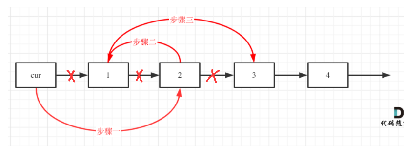

## 定义链表节点方式

> ```js
> class ListNode {
> 	val;
> 	next = null;
>     constructor(value) {
>         this.val = value;
>         this.next = null;
>     }
> }
> 
> 
> function ListNode(val, next) {
>     this.val = (val===undefined ? 0 : val)
>     this.next = (next===undefined ? null : next)
> }
> ```

## 为什么建议设置虚拟头节点

> 为了统一头节点和其它节点的处理方式。
>
> 问题：当删除的是头节点时，有两种操作方式：
>
> 方式1:直接使用原来的链表来进行删除操作。
>
> 方式2:设置一个虚拟头节点在进行删除操作。
>
> 采用方式1移除元素 1：将头节点向后移动一位就可以，这样就从链表中移除了一个头节点。但是链表中移除头节点 和 移除其他节点的操作方式是不一样，其实在写代码的时候也会发现，需要`单独`写一段逻辑来`处理移除头节点`的情况。
>
> 
>
> 采用方式2`设置一个虚拟头节点`，这样原链表的所有节点就都可以按照统一的方式进行移除了:
>
> 
>
> 来给链表添加一个虚拟头节点为新的头节点，此时要移除这个旧头节点元素1,就可以使用和移除链表其他节点的方式统一.
>
> return 头节点的时候，别忘了 `return dummyNode->next;`
>
> ```js
> //虚拟节点添加方式：
> const const dummy = new ListNode(0, head);
> let p = dummy;
> ...
> //返回时要求next
> return dummy.next;
> ```

## [203. 移除链表元素](https://leetcode-cn.com/problems/remove-linked-list-elements/)

> 给你一个链表的头节点 `head` 和一个整数 `val` ，请你删除链表中所有满足 `Node.val == val` 的节点，并返回 **新的头节点** 。
>
>  
>
> **示例 1：**
>
> 
>
> 输入：head = [1,2,6,3,4,5,6], val = 6
> 输出：[1,2,3,4,5]
>
> ```js
> var removeElements = function(head, val) {
>     const dummy = new ListNode(0, head);
>     let p = dummy;
>     while(p.next !== null) {
>         if(p.next.val === val) {
>             p.next = p.next.next;
>         } else {
>             p = p.next;
>         }
>     }
>     return dummy.next;
> };
> ```


## [707. 设计链表](https://leetcode-cn.com/problems/design-linked-list/)

> 设计链表的实现。您可以选择使用单链表或双链表。单链表中的节点应该具有两个属性：val 和 next。val 是当前节点的值，next 是指向下一个节点的指针/引用。如果要使用双向链表，则还需要一个属性 prev 以指示链表中的上一个节点。假设链表中的所有节点都是 0-index 的。
>
> 在链表类中实现这些功能：
>
> get(index)：获取链表中第 index 个节点的值。如果索引无效，则返回-1。
> addAtHead(val)：在链表的第一个元素之前添加一个值为 val 的节点。插入后，新节点将成为链表的第一个节点。
> addAtTail(val)：将值为 val 的节点追加到链表的最后一个元素。
> addAtIndex(index,val)：在链表中的第 index 个节点之前添加值为 val  的节点。如果 index 等于链表的长度，则该节点将附加到链表的末尾。如果 index 大于链表长度，则不会插入节点。如果index小于0，则在头部插入节点。
> deleteAtIndex(index)：如果索引 index 有效，则删除链表中的第 index 个节点。
>
>
> 示例：
>
> ```js
> MyLinkedList linkedList = new MyLinkedList();
> linkedList.addAtHead(1);
> linkedList.addAtTail(3);
> linkedList.addAtIndex(1,2);   //链表变为1-> 2-> 3
> linkedList.get(1);            //返回2
> linkedList.deleteAtIndex(1);  //现在链表是1-> 3
> linkedList.get(1);            //返回3
> ```
>
> 思路：就我看来，因为代码中定义了首尾指针head和tail，因此增加删除时必须要考虑三个因素：头节点位置，首指针和尾指针
>
> 另外，虚拟节点用的不多，因为用了作用不大，还是要处理首尾指针指向
>
> ps：改写if...else时，因为没有删除return；，导致一直没有ac掉，然后一直找问题，耗费了两个半小时。。。

> ```js
> var MyLinkedList = function() {
>     this._size = 0; //长度
>     this._head = null; //头指针
>     this._tail = null //尾指针
> };
> 
>    function LinkNode(val, next) {
>     this.val = val;
>   this.next = next;
> }
> 
> /** 
>  * @param {number} index
>  * @return {number}
>  */
> //返回第index个节点（0开始计数）
> MyLinkedList.prototype.getNode = function(index) {
>     if(index < 0 || index >= this._size) return null;
>     //创建虚拟头节点，其next值指向this.head
>     let cur = new LinkNode(0, this._head);
>     while(index-- >= 0) {
>         cur = cur.next;
>     }
>     return cur;
> }
> //返回第index个节点的值
> MyLinkedList.prototype.get = function(index) {
>     if(index < 0 || index >= this._size) return -1;
>     return this.getNode(index).val;
> };
> 
> /** 
>  * @param {number} val
>  * @return {void}
>  */
>  //在第一个元素前面插入值为val的节点
> MyLinkedList.prototype.addAtHead = function(val) {
>     const node = new LinkNode(val, this._head);
>     this._head = node; //考虑链表的头指针
>     //当链表一开始为空时,考虑链表的尾指针
>     if(!this._tail) {
>         this._tail = node;
>     }
>     this._size++;
> };
> 
> /** 
>  * @param {number} val
>  * @return {void}
>  */
>  //将值为val的节点追加到链表尾部
> MyLinkedList.prototype.addAtTail = function(val) {
>     const node = new LinkNode(val, null);
>     //如果原链表非空，尾部直接追加，tail指向node
>     //原链表空，头尾都要指向node
>     if(this._head) {
>         this._tail.next = node;
>         this._tail = node; //加
>     }else {
>         this._head = node;
>         this._tail = node;
>     }
>     this._size++;
> };
> 
> /** 
>  * @param {number} index 
>  * @param {number} val
>  * @return {void}
>  */
>  //在第index个节点添加值为val的节点
> MyLinkedList.prototype.addAtIndex = function(index, val) {
>     if(index <= 0) {
>         this.addAtHead(val);
>         return;
>     }
>     if(index === this._size) {
>         this.addAtTail(val);
>         return;
>     }
>     if(index > this._size) return;
>     //找到目标节点前一个 
>     const pre = this.getNode(index - 1);
>     //此语句相当于两步连接
>     pre.next = new LinkNode(val, pre.next);
>     this._size++;
> };
> 
> /** 
>  * @param {number} index
>  * @return {void}
>  */
>  //删除第index个节点
> MyLinkedList.prototype.deleteAtIndex = function(index) {
>     if(index < 0 || index >= this._size) return;
>     //如果删除的是头节点，单独处理，如果删除时原链表只有一个节点，将头指针值赋给尾指正
>     if(index === 0) {
>         this._head = this._head.next;
>         if(index === this._size - 1) {
>             this._tail = this._head;
>         }
>     }else{ //删除的不是头节点，但还是要考虑是否删除的是尾部节点，此时处理尾指针指向
>         const pre = this.getNode(index - 1);
>         pre.next = pre.next.next;
>         if(index === this._size - 1) this._tail = pre;
>     }
>     this._size--;
> };
> ```

## [206. 反转链表](https://leetcode-cn.com/problems/reverse-linked-list/)(双指针/递归)

[labuladong 题解](https://labuladong.gitee.io/plugin-v3/?qno=206&target=gitee&_=1645748085858)

> 给你单链表的头节点 `head` ，请你反转链表，并返回反转后的链表。
>
> 
>
> **示例 1：**
>
> 
>
> ```
> 输入：head = [1,2,3,4,5]
> 输出：[5,4,3,2,1]
> ```
>

### 双指针

思路(代码随想录）：双指针法，定义pre(null)，cur(head)和tmp(null)变量用来当做指针，做一下四步，顺序不可以颠倒。

> while(cur):
>
> 1. tmp指向cur.next         ---提前保存cur.next值，因为等一下这个值会改变
> 2. 将pre.next指向pre       ---反转第一个节点
> 3. pre指向cur              ---pre向后移动，为反转下一个节点做准备
> 4. cur指向tmp              ---cur向后移动，为反转下一个节点做准备
>
> ```js
> var reverseList = function(head) {
>     //如果链表为空或者只有一个节点则返回head
>     if(!head || !head.next) return head;
>     let pre = null, cur = head, tmp = null;
>     while(cur) {
>         //四步顺序不可以颠倒：先保存cur的下一个节点->让cur的next指针指向pre->然后向前移动pre到cur->最后将cur往后移动一位
>         tmp = cur.next;
>         cur.next = pre;
>         //pre和cur后移
>         pre = cur;
>         cur = tmp;
>     }
>     return pre;
> };
> ```
>
> 递归法，和双指针思路一样（代码随想录，不太明白）：
>
> ```js
>  var reverse = function(pre, cur) {
>      if(!cur) return pre;
>      const temp = cur.next;
>      cur.next = pre;
>      //和双指针法对比，其实下面这个递归写法就是代替了:pre = cur, cur = tmp这两步
>      return reverse(cur, temp);
>  }
> var reverseList = function(head) {
>     return reverse(null, head);
> };
> ```

### 递归

> 递归要点，明确并且始终相信递归的定义：**输入一个节点 `head`，将「以 `head` 为起点」的链表反转，并返回反转之后的头结点**last.
>
> 另外一种递归思路（labuladong）:
>
> * base case：如果 链表为空|| 只有一个元素，只用反转自己，返回head
>
> * 执行递归，返回新头节点last
> * 此前head变成最后一个节点，因此让反转后的尾节点指向head，同时别忘记head末尾指向null
> * 返回新头节点last
>
> 
>
> 画图说明（链表题目一定画图）：
>
> 
>
> 
>
> 
>
> ```js
>  //递归来做，本递归返回翻转后的头结点，用last变量接收
> var reverseList = function(head) {
>     if (head === null || head.next === null) return head
>     //last为翻转后的头节点，具体逻辑看上图
>     const last = reverseList(head.next);
>     head.next.next = head;
>     head.next = null;
>     return last;
> };
> ```

## 反转前n个节点

> 实现将链表前n个节点反转（n <= 链表长度）：reverseN（head， n）
>
> 思路同上，大同小异
>
> * base case要变成n === 1，因为这代表反转一个元素，也就是他本身head，return前要`记录后驱节点`，因为后驱等一下是`未反转部分链表`的`头结点`
> * head.next不能设置为null了，因为现在head节点在对n个节点递归反转之后不一定是最后一个节点，因此要记录后驱successor(第n+1个节点)，然后把head（现在是参加反转操作的子链表的尾节点）的后驱指向successor
> * 
>
> ```js
> let successor = null;
> //反转以head为起点的n个节点，返回新的头节点
> var reverseList = function(head) {
>     if (n === 1) {
>         // 记录第 n + 1 个节点
>         successor = head.next;
>         //返回如今的尾节点
>         return head;
>     }
>     // 以 head.next 为起点，需要反转前 n - 1 个节点
>     const last = reverseN(head.next, n - 1);
>     head.next.next = successor;
>     // 让反转之后的 head 节点和后面的节点连起来
>     head.next = successor;
>     return last;
> };
> ```
>
> 


## [92. 反转链表 II](https://leetcode-cn.com/problems/reverse-linked-list-ii/)

> [labuladong 题解](https://labuladong.gitee.io/plugin-v3/?qno=92&target=gitee&_=1645758057067)[思路](https://leetcode-cn.com/problems/reverse-linked-list-ii/#)
>
> 给你单链表的头指针 `head` 和两个整数 `left` 和 `right` ，其中 `left <= right` 。请你反转从位置 `left` 到位置 `right` 的链表节点，返回 **反转后的链表** 。
>
>  
>
> **示例 1：**
>
> 
>
> ```
> 输入：head = [1,2,3,4,5], left = 2, right = 4
> 输出：[1,4,3,2,5]
> ```

### **1,**

**自己参考力扣的解法，最后返回的时候要判别left是否为1，为1则返回pre.next,否则head,做法不太好**

> 思路：这种题一定一定要画图！！！不能光在脑子里想
>
> 1. 找到pre，leftNode，rightNode，later节点
> 2. 截断要翻转的节点：leftNode---rightNode
> 3. 翻转它们
> 4. 拼接上去
> 5. 如果left===1，pre此时为0，要返回pre.next（即原本的head)，否则直接返回head
>
> ```js
> //找第index个节点,第0个为虚拟节点
>  function getNode(index, head) {
>      let cur = new ListNode(0, head);
>      while(index--) {
>          cur = cur.next;
>      }
>      return cur;
>  }
> //翻转链表
> function reverseList(head) {
>     let pre = null, cur = head, temp = null
>     while(cur) {
>         temp = cur.next;
>         cur.next = pre;
>         pre = cur;
>         cur = temp;
>     }
> }
> var reverseBetween = function(head, left, right) {
>     //先找到pre，later，leftNode，rightNode
>     let pre = getNode(left - 1, head);
>     let rightNode = getNode(right, head)
>     let leftNode = pre.next
>     let later = rightNode.next;
>     //截取要翻转的链表，将pre.next和rightNode.next置为空，实现后续的部分翻转
>     pre.next = null;
>     rightNode.next = null;
>     //开始翻转链表：leftNode -> rightNode
>     reverseList(leftNode);
>     //将翻转好的链表拼接回去
>     pre.next = rightNode;
>     leftNode.next = later;
>     //如果left为1，要返回pre.next，否则返回head
>     return left===1 ? pre.next : head
> };
> ```
>
> 


### 2,

**力扣官方解法**

和自己的差不多，不同的是我用了一个getNode函数，但是这个函数还不如不用，因为用了之后没有用到虚拟头节点，对于left===1的情况判别容易出错

```js
/**
 * Definition for singly-linked list.
 * function ListNode(val, next) {
 *     this.val = (val===undefined ? 0 : val)
 *     this.next = (next===undefined ? null : next)
 * }
 */
/**
 * @param {ListNode} head
 * @param {number} left
 * @param {number} right
 * @return {ListNode}
 */

function reverseList(head) {
    let temp = null, pre = null, cur = head;
    while(cur) {
        temp = cur.next;
        cur.next = pre;
        pre = cur;
        cur = temp;
    }
}

var reverseBetween = function(head, left, right) {
     const dummy = new ListNode(0, head);
     let pre = dummy;
     //找到leftNode前一个节点pre
     for(let i = 0; i < left - 1; i++) {
         pre = pre.next;
     }
     //找到rightNode节点
     let rightNode = pre;
     for(let i = 0; i < right - left + 1; i++) {
         rightNode = rightNode.next;
     }
     //找到leftNdoe和rightNode后一个节点later
     let leftNode = pre.next;
     let later = rightNode.next;
     //截取出来： leftNode --- rightNode
     pre.next = null
     rightNode.next = null;
     //翻转它们
     reverseList(leftNode);
     //拼接回去，注意此时leftNode在右边，rightNode在左边
     pre.next = rightNode;
     leftNode.next = later;
     return dummy.next;
};
```

### 3，递归,不高效

> 思路：
>
> 目前可以解决前n个节点反转
>
> 如果 `left == 1`，就相当于反转链表开头的 `n` 个元素嘛，也就是我们刚才实现的功能
>
> 如果 `left != 1` 怎么办？如果我们把 `head` 的索引视为 1，那么我们是想从第 `left` 个元素开始反转对吧；如果把 `head.next` 的索引视为 1 呢？那么相对于 `head.next`，反转的区间应该是从第 `left - 1` 个元素开始的；那么对于 `head.next.next` 呢……

```js
var reverseBetween = function(head, left, right) {
    //base case，如果left === 1，那么相当于reverseN
    if(left === 1) {
        return reverseN(head, right);
    }
    //前进到反转的起点触发
    head.next = reverseBetween(head.next, left - 1, right - 1);
    return head;
};
let successor = null;
//先实现反转前right个元素（1---right）
function reverseN(head, right) {
    //链表中只有一个节点反转
    if (right === 1) {
        //记录它的后驱节点
        const successor = head.next;
        return head;
    }
    last = reverseN(head.next, right - 1);
    head.next.next = head;
    head.next = successor;
    return last;
}
```

## [25. K 个一组翻转链表](https://leetcode-cn.com/problems/reverse-nodes-in-k-group/)

> [labuladong 题解](https://labuladong.gitee.io/plugin-v3/?qno=25&target=gitee&_=1646206786039)[思路](https://leetcode-cn.com/problems/reverse-nodes-in-k-group/#)
>
> 给你一个链表，每 *k* 个节点一组进行翻转，请你返回翻转后的链表。
>
> *k* 是一个正整数，它的值小于或等于链表的长度。
>
> 如果节点总数不是 *k* 的整数倍，那么请将最后剩余的节点保持原有顺序。
>
> **进阶：**
>
> - 你可以设计一个只使用常数额外空间的算法来解决此问题吗？
> - **你不能只是单纯的改变节点内部的值**，而是需要实际进行节点交换。
>
>  
>
> **示例 1：**
>
> 
>
> ```
> 输入：head = [1,2,3,4,5], k = 2
> 输出：[2,1,4,3,5]
> ```

> 任何递归题型，思考三个问题：
>
> 1. 这个函数是干嘛的---返回一个反转好的头节点newHead
> 2. 这个函数参数中的变量是什么？---头节点，k值
> 3. 得到函数的递归结果，应该干什么？---反转下一组k个节点
>
> 递归思路：
>
> 1. 先反转以head开头的k个元素
>
> 2. **将第 `k + 1` 个元素作为 `head` 递归调用 `reverseKGroup` 函数**。
>
> 3. **将上述两个过程的结果连接起来**。
>
>    base case：最后的head为null/最后元素不足k个的话，保持不变 return head
>
>    
>
>    
>
>    
>
>    注意： `reverse` 函数是反转区间 `[a, b)`，所以情形是这样的：
>
>    
>
>    整个函数递归完成后：
>
>    
>
>    ```js
>    var reverseKGroup = function(head, k) {
>        //base case
>        if (head === null) return head;
>        //区间[a, b)包含k个待反转元素
>        let a = b = head;
>        //找到本轮待反转的[left, right)
>        for (let i = 0; i < k; i++) {
>            //base case，不是k个元素，不需要反转
>            if(b === null) return head;
>            b = b.next;
>        }
>        //对k个一组的[a, b)区间内的元素反转,返回新头节点，newHead保存
>        const newHead = reverse(a, b);
>        //注意：此时a指向本轮已反转组的尾节点，b指向下一轮将反转组的头节点
>        a.next = reverseKGroup(b, k) //因为右开，b此时指向下一组要反转的头节点
>        return newHead;
>    };
>    
>    //翻转从[left, right)的链表，注意左闭右开
>    function reverse(a, b) {
>        let pre = null, temp = null, cur = a;
>        while(cur !== b) {
>            temp = cur.next;
>            cur.next = pre;
>            pre = cur;
>            cur = temp;
>        }
>        //返回反转后的头节点
>        return pre;
>    }
>    ```
>
>    

## 判断一个字符串是否为回文串

```js
function isPalindrome(s) {
    let left = 0, right = s.length - 1;
    while (left < right) {
        if (s[left] !== s[right]) {
            return false;
        }
        left++;
        right--;
    }
    return true;
}
```

## [234. 回文链表](https://leetcode-cn.com/problems/palindrome-linked-list/)

> [labuladong 题解](https://labuladong.gitee.io/plugin-v3/?qno=234&target=gitee&_=1646209638410)[思路](https://leetcode-cn.com/problems/palindrome-linked-list/#)
>
> 给你一个单链表的头节点 `head` ，请你判断该链表是否为回文链表。如果是，返回 `true` ；否则，返回 `false` 。
>
>  
>
> **示例 1：**
>
> 
>
> ```
> 输入：head = [1,2,2,1]
> 输出：true
> ```

### 利用递归

> **借助二叉树后序遍历的思路，不需要显式反转原始链表也可以倒序遍历链表**
>
> 后序就是相当于倒着遍历了一遍链表。
>
> ```js
> function traverse(ListNode head) {
>     // 前序遍历代码
>     traverse(head.next);
>     // 后序遍历代码
> }
> ```
>
> **实际上就是把链表节点放入一个栈，然后再拿出来，这时候元素顺序就是反的**，只不过我们利用的是递归函数的堆栈而已。
>
> ，无论造一条反转链表还是利用后序遍历，算法的时间和空间复杂度都是 O(N)
>
> ACM模式？
>
> ```js
> function ListNode(val, next) {
>   this.val = val === undefined ? 0 : val;
>   this.next = next === undefined ? null : next;
> }
> 
> function buildLinkList(values) {
>   return values.reverse().reduce((acc, val) => new ListNode(val, acc), null);
> }
> 
> // ---- Generate our linked list ----
> const linkedList = buildLinkList(["a"]);
> ```
>
> 
>
> ```js
> var isPalindrome = function(head) {
>     //left从头节点开始
>     let left = head;
>     const traverse = (right) => {
>         if (right === null) return true;
>         let res = traverse(right.next);
>         //逻辑放到后序位置，从尾部开始，right指向尾节点，如果res为true，则right和left比较值
>         res = res && (left.val === right.val)
>         left = left.next;
>         return res;
>     }
>     return traverse(head);
> };
> ```

### 双指针：快慢指针

> 1. **先通过 [双指针技巧](https://labuladong.gitee.io/algo/2/17/16/) 中的快慢指针来找到链表的中点**：
>
> 2. **2、如果`fast`指针没有指向`null`，说明链表长度为奇数，`slow`还要再前进一步**
>
>    1. 如果链表长度为奇数(fast此时指向最后一个节点)，slow指向正中间，此时要后移
>    2. 如果链表长度为偶数(fast此时指向尾节点next，即null)，slow刚好指向中间两个点中的第二个
>
> 3. **3、从`slow`开始反转后面的链表，现在就可以开始比较回文串了**：
>
> 4. 小瑕疵：破坏了输入链表的原始结构，解决方法就是得到左部分链末尾p，和右部分链头位置q，p.next = reverse(q)，不过在一开始要排序head===null 和 head.next === null的情况，而且false情况下不能调整
>
>    
>
> ```js
> var isPalindrome = function(head) {
>     let fast = head, slow = head;
>     //找到中间位置slow
>     while (fast !== null && fast.next !== null) {
>         slow = slow.next;
>         fast = fast.next.next;
>     }
>     //长度为奇数时，slow需要后移一位
>     if (fast !== null) {
>         slow = slow.next;
>     }
>     //开始反转右边链表，同时获得左边链表
>     let left = head, right = reverse(slow);
>     //开始比较回文串
>     while (right !== null) {
>         if (left.val !== right.val) {
>             return false;
>         }
>         left = left.next;
>         right = right.next;
>     }
>     return true;
> };
> //反转链表
> function reverse(head) {
>     let temp = null, cur = head, pre = null;
>     while (cur !== null) {
>         temp = cur.next;
>         cur.next = pre;
>         pre = cur;
>         cur = temp;
>     }
>     return pre;
> }
> ```
>
> 加上恢复原链表的代码，多加了写注释的几行
>
> ```js
> var isPalindrome = function(head) {
>     if(head === null || head.next === null) return true; //恢复原链表
>     let slow = head, fast = head;
>     while (fast !== null && fast.next !== null) {
>         slow = slow.next;
>         fast = fast.next.next;
>     }
>     if (fast !== null) {
>         slow = slow.next;
>     }
>     let left = head, right = reverse(slow);
>     let p = null, q = right; //恢复原链表
>     while (right !== null) {
>         if (left.val !== right.val) {
>             return false;
>         }
>         p = left;  //恢复原链表
>         left = left.next;
>         right = right.next;
>     }
>     p.next = reverse(q)  //恢复原链表顺序：p此时在左链表末尾，q在右链表头，true时才可以恢复
>     return true;
> };
> //反转链表
> function reverse(head) {
>     let pre = null, cur = head, temp = null;
>     while (cur !== null) {
>         temp = cur.next;
>         cur.next = pre;
>         pre = cur;
>         cur = temp;
>     }
>     return pre;
> }
> ```
>
> 


## [24. 两两交换链表中的节点](https://leetcode-cn.com/problems/swap-nodes-in-pairs/)

> 给你一个链表，两两交换其中相邻的节点，并返回交换后链表的头节点。你必须在不修改节点内部的值的情况下完成本题（即，只能进行节点交换）。
>
>  
>
> **示例 1：**
>
> 
>
> ```
> 输入：head = [1,2,3,4]
> 输出：[2,1,4,3]
> ```
>
> 思路：一定要画图，不然指针多了思路会很乱。使用虚拟头节点来模拟，
>
> 注意：cur一开始指向虚拟头节点，每轮循环移动两位，while循环的判别里是cur.next && cur.next.next不为空
>
> 

> ```js
> var swapPairs = function(head) {
>     if(!head || !head.next) return head;
>     let dummy = new ListNode(0, head);
>     let cur = dummy;//cur从虚拟头节点开始走
>     while(cur.next && cur.next.next) {
>         //记录两个临时节点，tmp指向本轮交换的1，tmp1指向下一轮交换的3
>         let temp = cur.next;
>         let temp1 = cur.next.next.next;
>         //开始交换第一个和第二个节点 例如：cur->1->2->3
>         //三步：cur->2  ---  2->1   ---   1->3
>         cur.next = temp.next;
>         temp.next.next = temp;
>         temp.next = temp1;
>         //cur后移动两位
>         cur = cur.next.next; 
>     }
>     return dummy.next;
> };
> ```
>
> 


# 单链表六大解题套路—labuladong

以下几题参考labuladong：一文搞懂单链表的六大解题套路：https://labuladong.gitee.io/algo/1/8/

## [21. 合并两个有序链表](https://leetcode-cn.com/problems/merge-two-sorted-lists/)

> 将两个升序链表合并为一个新的 **升序** 链表并返回。新链表是通过拼接给定的两个链表的所有节点组成的。 
>
>  
>
> **示例 1：**
>
> 
>
> ```
> 输入：l1 = [1,2,4], l2 = [1,3,4]
> 输出：[1,1,2,3,4,4]
> ```

> 思路：while 循环每次比较 `list1` 和 `list2` 的大小，把较小的节点接到结果链表上，跳出while后再把非空的全部放到结果链表尾部
>
> 讨论：这个算法的逻辑类似于「拉拉链」，`list1, list2` 类似于拉链两侧的锯齿，指针 `pre` 就好像拉链的拉索，将两个有序链表合并。
>
> **代码中还用到一个链表的算法题中是很常见的`「虚拟头节点」`技巧，也就是 `dummy` 节点**。你可以试试，如果不使用 `dummy` 虚拟节点，代码会复杂很多，而有了 `dummy` 节点这个占位符，可以避免处理空指针的情况，降低代码的复杂性。
>
> ```js
> var mergeTwoLists = function(list1, list2) {
>     //创建虚拟头节点
>     const dummy = new ListNode(-1);
>     let pre = dummy;
>     //当两个链表都有值存在的时候
>     while(list1 !== null && list2 !== null){
>         if(list1.val > list2.val){
>             pre.next = list2;
>             list2 = list2.next;
>         }else{
>             pre.next = list1;
>             list1 = list1.next;
>         }
>         //pre指针不断前进
>         pre = pre.next;
>     }
>     //只有最多一个链表不为空时，将不为空链表放在尾部
>     pre.next = (list1 === null ? list2 : list1)
>     return dummy.next;
> };
> ```
>

## [23. 合并K个升序链表](https://leetcode-cn.com/problems/merge-k-sorted-lists/)(ps：优先级队列模板)

> 给你一个链表数组，每个链表都已经按升序排列。
>
> 请你将所有链表合并到一个升序链表中，返回合并后的链表。
>
> **示例 1：**                                     
>
> ```js
> 输入：lists = [[1,4,5],[1,3,4],[2,6]]
> 输出：[1,1,2,3,4,4,5,6]
> 解释：链表数组如下：
> [
>   1->4->5,
>   1->3->4,
>   2->6
> ]
> 将它们合并到一个有序链表中得到。
> 1->1->2->3->4->4->5->6
> ```

> 思路：合并 `k` 个有序链表的逻辑类似合并两个有序链表，难点在于，如何快速得到 `k` 个节点中的最小节点，接到结果链表上？
>
> 这里我们就要用到 `[优先级队列（二叉堆）]` 这种数据结构，把链表节点放入一个最小堆，就可以每次获得 `k` 个节点中的最小节点。
>
> 优先级队列是基于二叉堆实现的，主要操作是插入和删除。插入是先插到最后，然后上浮到正确位置；删除是调换位置后再删除，然后下沉到正确位置
>
> 优先级队列的js实现：https://github.com/wozien/leetcode-js/blob/main/templates/priority-queue.js
>
> 代码中为简单版本实现
>
> 1. 构建一个最小堆，并依次把链表头插入堆中
> 2. 弹出堆顶接到输出链表，并将堆顶元素所在链表的新链表头插入堆中
> 3. 等堆元素全部弹出后，合并工作就完成

> ```js
> /**
>  * Definition for singly-linked list.
>  * function ListNode(val, next) {
>  *     this.val = (val===undefined ? 0 : val)
>  *     this.next = (next===undefined ? null : next)
>  * }
>  */
> /**
>  * @param {ListNode[]} lists
>  * @return {ListNode}
>  */
> 
> class MinHeap {
>     constructor() {
>         this.heap = [];
>     }
>     //交换节点位置
>     swap(i1, i2) {
>         [this.heap[i1], this.heap[i2]] = [this.heap[i2], this.heap[i1]];
>     }
>     //获得父节点
>     getParentIndex(i) {
>         return (i - 1) >> 1;
>     }
>     //获得左节点
>     getLeftIndex(i) {
>         return i * 2 + 1;
>     }
>     //获得右节点
>     getRightIndex(i) {
>         return i * 2 + 2;
>     }
>     //获取堆大小
>     size() {
>         return this.heap.length;
>     }
>     //获取堆顶
>     peek() {
>         return this.heap[0];
>     }
>     //上浮
>     swim(index) {
>         if (index === 0) return;
>         const parentIndex = this.getParentIndex(index);
>         if(this.heap[parentIndex] && this.heap[parentIndex].val > this.heap[index].val) {
>             this.swap(parentIndex, index);
>             this.swim(parentIndex);
>         }
>     }
>     //下沉
>     sink(index) {
>         const leftIndex = this.getLeftIndex(index);
>         const rightIndex = this.getRightIndex(index);
>         if(this.heap[leftIndex] && this.heap[leftIndex].val < this.heap[index].val) {
>             this.swap(leftIndex, index);
>             this.sink(leftIndex)
>         }
>         if(this.heap[rightIndex] && this.heap[rightIndex].val < this.heap[index].val) {
>             this.swap(rightIndex, index);
>             this.sink(rightIndex)
>         }
>     }
>     //小根堆尾部插入
>     insert(value) {
>         this.heap.push(value);
>         //小根堆重新排序，为什么减一:索引值和序号相差1
>         this.swim(this.heap.length - 1)
>     }
>     //删除并返回堆顶元素
>     delMin() {
>         if(this.size() === 1) return this.heap.shift();
>         const top = this.heap[0];
>         //将数组最后一个元素赋值给堆顶
>         this.heap[0] = this.heap.pop();
>         //小根堆重新排序
>         this.sink(0);
>         return top;
>     }
> }
> 
> var mergeKLists = function(lists) {
>     const res = new ListNode(0);
>     let p = res;
>     const h = new MinHeap();
>     //输入k个升序链表的头部节点
>     lists.forEach(element => {
>         if(element) h.insert(element)
>     })
>     //不断的比较最小堆中k个节点的大小：堆元素全部弹出后，合并工作就完成
>     while(h.size()) {
>         //弹出堆顶元素
>         const n = h.delMin();
>         //将刚弹出的堆顶元素接到输出链表
>         p.next = n;
>         //将刚弹出的堆顶元素它所在链表的新链表头插入堆中
>         if(n.next) h.insert(n.next)
>         //p指针不断前进
>         p = p.next;
>     } 
>     return res.next;
> };
> ```
>
> `更规范的一种写法`：用这种
>
> ```js
> var mergeKLists = function(lists) {
>     class PriorityQueue {
>         constructor(comparator = (a, b) => a > b) {
>             this._heap = [];
>             this._comparator = comparator;
>         }
>         //交换节点位置
>         _swap(i1, i2) {
>             [this._heap[i1], this._heap[i2]] = [this._heap[i2], this._heap[i1]]
>         }
>         //比较前者与后者大小
>         _compare(i1, i2) {
>             return this._comparator(this._heap[i1], this._heap[i2]);
>         }
>         //获得父节点
>         _getParent(i) {
>             return Math.floor((i - 1) / 2);
>         }
>         //获得左节点
>         _getLeft(i) {
>             return i * 2 + 1;
>         }
>         //获得右节点
>         _getRight(i) {
>             return i * 2 + 2;
>         }
>         //上浮
>         _swim(index) {
>             if(index === 0) return;
>             const parent = this._getParent(index);
>             if(this._heap[parent] && !this._compare(parent, index)) {
>                 this._swap(parent, index)
>                 this._swim(parent)
>             }
>         }
>         //下沉
>         _sink(index) {
>             const left = this._getLeft(index);
>             const right = this._getRight(index);
>             if (this._heap[left] && this._compare(left, index)) {
>                 this._swap(left, index)
>                 this._sink(left)
>             }
>             if (this._heap[right] && this._compare(right, index)) {
>                 this._swap(right, index)
>                 this._sink(right)
>             }
>         }
>         //尾部插入
>         push(value) {
>             this._heap.push(value);
>             //上浮
>             this._swim(this._heap.length - 1);
>         }
>         //堆顶删除并返回
>         pop() {
>             if(this.size() === 1) return this._heap.shift();
>             const top = this._heap[0];
>             //删除最后一个元素并返回，赋值给堆顶
>             this._heap[0] = this._heap.pop();
>             //下沉重新排序
>             this._sink(0)
>             return top;
>         }
>         //获取堆顶
>         peek() {
>             return this._heap[0];
>         }
>         //获取堆大小
>         size() {
>             return this._heap.length;
>         }
>         //判断堆是否为空
>         isEmpty() {
>             return this.size() === 0;
>         }
>     }
>     if(lists.length === 0) return null;
>     //创建虚拟头节点
>     const dummy = new ListNode(-1);
>     let p = dummy;
>     //创建优先级队列，小根堆
>     const pq = new PriorityQueue((a, b) => a.val < b.val);
>     //将k个链表的头节点加入小根堆
>       //  for (const head of lists) {
>       //    if (head) pq.push(head);
>       //  }
>     lists.forEach(e => {
>         if(e) pq.push(e);
>     })
>     while(!pq.isEmpty()) {
>         //获取最小节点，插入结果链表
>         const node = pq.pop();
>         p.next = node;
>         //将刚获取的最小节点所在的链表的表头取出，插入堆中
>         if(node.next !== null) {
>             pq.push(node.next)
>         }
>         //p指针前进
>         p = p.next
>     }
>     return dummy.next;
> };
> ```
>
> 

## [19. 删除链表的倒数第 N 个节点](https://leetcode-cn.com/problems/remove-nth-node-from-end-of-list/)（双指针）

> 给你一个链表，删除链表的倒数第 `n` 个节点，并且返回链表的头节点。
>
>  
>
> **示例 1：**
>
> 
>
> ```
> 输入：head = [1,2,3,4,5], n = 2
> 输出：[1,2,3,5]
> ```

> 找到单链表倒数第k个节点思路：
>
> 要两个`快慢指针`，fast和slow都指向头节点，fast指针走k步之后，fast和slow同时再走n-k步，此时slow指向第k个节点；
>
> 注意：使用虚拟头节点方便一些
>
> ```js
> var removeNthFromEnd = function(head, n) {
>  //创建虚拟头节点
>  const dummy = new ListNode(-1);
>  dummy.next = head;
>  //删除倒数第n个，需要找到倒数第n+1个节点
>  const x = findNthFromEnd(dummy, n + 1);
>  //删掉第n个节点
>  x.next = x.next.next;
>  return dummy.next;
> };
> //返回链表的倒数第k个节点
> var findNthFromEnd = function(head, k) {
>  let p1 = head;
>  //p1先走k步
>  for(let i = 0; i < k; i++) {
>      p1 = p1.next;
>  }
>  let p2 = head;
>  //p1和p2同时走 n - k 步，则p2走到倒数第k个停止，p2指向所求节点
>  while(p1 !== null) {
>      p2 = p2.next;
>      p1 = p1.next;
>  }
>  return p2;
> }
> ```
>
> 优化写法：
>
> ```js
> var removeNthFromEnd = function(head, n) {
>     //虚拟头节点
>     const dummy = new ListNode(0, head);
>     let fast = slow = dummy;
>     //先找到倒数第n+1个节点，用slow记录
>     //让fast指针先走 n+1 步
>     while(n-- >= 0) {
>         fast = fast.next;
>     }
>     //fast和slow同时走 length-（n+1）n
>     while(fast) {
>         fast = fast.next;
>         slow = slow.next;
>     }
>     //此时slow指向倒数第n+1个节点，开始删除倒数第n个节点
>     slow.next = slow.next.next;
>     return dummy.next;
> };
> ```
>
> 

## [876. 链表的中间节点](https://leetcode-cn.com/problems/middle-of-the-linked-list/)（双指针）

> 给定一个头节点为 `head` 的非空单链表，返回链表的中间节点。
>
> 如果有两个中间节点，则返回第二个中间节点。
>
> **示例 1：**
>
> ```js
> 输入：[1,2,3,4,5]
> 输出：此列表中的节点 3 (序列化形式：[3,4,5])
> 返回的节点值为 3 。 (测评系统对该节点序列化表述是 [3,4,5])。
> 注意，我们返回了一个 ListNode 类型的对象 ans，这样：
> ans.val = 3, ans.next.val = 4, ans.next.next.val = 5, 以及 ans.next.next.next = NULL
> ```

> 双指针思路：slow和fast同时指向head，然后在fast和fast.next不为空的情况下：slow每次前进一步，fast每次前进两步；
>
> ​	当数组元素偶数，返回的是第二个中间点
>
> ```js
> var middleNode = function(head) {
>     let fast = head, slow = head;
>     while(fast !== null && fast.next !== null) {
>         fast = fast.next.next;
>         slow = slow.next;
>     }
>     return slow;
> };
> ```

## [141. 环形链表](https://leetcode-cn.com/problems/linked-list-cycle/)（双指针）

> 给你一个链表的头节点 `head` ，判断链表中是否有环。
>
> 如果链表中有某个节点，可以通过连续跟踪 `next` 指针再次到达，则链表中存在环。 为了表示给定链表中的环，评测系统内部使用整数 `pos` 来表示链表尾连接到链表中的位置（索引从 0 开始）。**注意：`pos` 不作为参数进行传递** 。仅仅是为了标识链表的实际情况。
>
> *如果链表中存在环* ，则返回 `true` 。 否则，返回 `false` 

> 思路：快慢指针，每当慢指针前进一步，快指针前进两步，
>
> 如果fast最终遇到空指针，则链表中没有环，
>
> 如果fast===slow，则fast超过slow一圈，说明含有环
>
>  
>
> **示例 1：**
>
> 
>
> ```
> 输入：head = [3,2,0,-4], pos = 1
> 输出：true
> 解释：链表中有一个环，其尾部连接到第二个节点
> ```
>
> ```js
> var hasCycle = function(head) {
>  let fast = head, slow = head;
>  while(fast !== null && fast.next !== null) {   //这个条件要注意！！！  fast和fast.next不能颠倒，短路原则
>      slow = slow.next;
>      fast = fast.next.next;
>      if (slow === fast) return true;
>  }
>  return false;
> }
> ```

## [142. 环形链表 II](https://leetcode-cn.com/problems/linked-list-cycle-ii/)(双指针)

> 给定一个链表的头节点  `head` ，返回链表开始入环的第一个节点。 *如果链表无环，则返回 `null`。*

> 思路：https://labuladong.gitee.io/algo/1/8/
>
> fast，slow指针一开始指向head，同时走，fast每次两步，slow每次一步
>
> 假设当它们相遇时，slow走k步，则fast一定走了2k步：fast多走的k步是在环里转圈，k的值为环长度整数倍
>
> 
>
> 慢指针在进入环之后，慢指针会在一圈内与快指针相遇（数学归纳法可以证明），假设相遇点距离环起点为m，那么环起点距离head：k-m,同时还可知：从相遇点前进k—m步，也恰好到达环起点。
>
> 
>
> 因此，只要把快慢指针其中任一个重新指向head，然后fast和slow同速前进，那么k-m步后一定在环的起点相遇。

> ```js
> var findCycleStart = function(head) {
>     let fast = head, slow = head;
>     while(fast !== null && fast.next !== null) {  //fast和fast.next不能颠倒，短路原则
>         fast = fast.next.next;
>         slow = slow.next;
>         if(slow === fast) break;
>     }
>     //fast遇到空指针说明没有环
>     if (fast === null || fast.next === null) return null;
>     //slow重新指向头节点
>     slow = head;
>     while(slow !== fast) {
>         slow = slow.next;
>         fast = fast.next
>     }
>     return slow;
> }
> ```

## [160. 相交链表](https://leetcode-cn.com/problems/intersection-of-two-linked-lists/)(双指针)

> 给你两个单链表的头节点 `headA` 和 `headB` ，请你找出并返回两个单链表相交的起始节点。如果两个链表不存在相交节点，返回 `null` 。
>
> 图示两个链表在节点 `c1` 开始相交**：**
>
> [](https://assets.leetcode-cn.com/aliyun-lc-upload/uploads/2018/12/14/160_statement.png)
>
> 题目数据 **保证** 整个链式结构中不存在环。
>
> **注意**，函数返回结果后，链表必须 **保持其原始结构** 
>
> 示例 1：
>
> 
>
> 输入：intersectVal = 8, listA = [4,1,8,4,5], listB = [5,6,1,8,4,5], skipA = 2, skipB = 3
> 输出：Intersected at '8'

**巧妙思路**

> 思路：双指针，通过某些方式，让p1和p2能同时到达相交节点c1
>
> ---让p1遍历完A之后再遍历B
>
> ---让p2遍历完B之后再遍历A
>
> 如此，逻辑上两条链表就连接在一起了，p1和p2也可以同时进入公共部分，同时到达相交节点c1.
>
> 证明：
>
> 当走到第一个公共节点node时，A走的步数：a+(b-c) B：b+(a-c)  很明显两者相等；
>
> 有公共尾部，c>0,无公共尾部：c=0
>
> 注意：交点不是数值相等，而是指针相等
>
> 

> ```js
> var getIntersectionNode = function(headA, headB) {
>     let p1 = headA, p2 = headB;
>     while(p1 !== p2) {
>         if(p1 === null) p1 = headB;
>         else p1 = p1.next;
>         if(p2 === null) p2 = headA;
>         else p2 = p2.next
>     }
>     return p1;
> };
> ```
>

**常规思路**

> 求出两个链表的长度，并求出两个链表长度的差值，然后让curA移动到，和curB 末尾对齐的位置
>
> 此时就可以比较curA和curB是否相同，如果不相同，同时向后移动curA和curB，如果遇到curA == curB，则找到交点。
>
> 否则循环退出返回空指针。
>
> 
>
> ```js
> // 求出链表长度
> function getLen(head) {
>     let len = 0;
>     while (head) {
>         len++;
>         head = head.next;
>     }
>     return len;
> }
> var getIntersectionNode = function(headA, headB) {
>     let curA = headA, curB = headB;
>     let lenA = getLen(headA), lenB = getLen(headB);
>     // 永远保持A链表最长，方便判断
>     if (lenB > lenA) {
>         [lenB, lenA] = [lenA, lenB];
>         [curA, curB] = [curB, curA];
>     }
>     // 两个链表尾部对齐，让A链表的curA和curB保持同一位置
>     let i = lenA - lenB;
>     while (i--) {
>         curA = curA.next;
>     }
>     // 指针同时移动，找出重合点
>     while (curA && curA !== curB) {
>         curA = curA.next;
>         curB = curB.next;
>     }
>     // 不管重合否，返回的都是curA
>     return curA;    
> };
> ```


